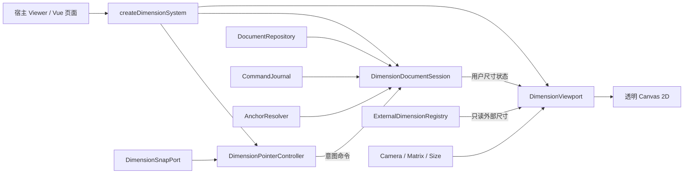

# 三维尺寸标注 API 使用指南

本文说明 `src/dimension/` 下当前三维尺寸标注系统的接入、创建、编辑、持久化、外部尺寸、导出与故障处理方式。系统通过一个透明 Canvas 2D 覆盖层，将设计空间中的三维尺寸投影为始终可读的屏幕尺寸标注。

> 当前状态（2026-07-20）
>
> - 项目级统一入口是 `@/dimension`，它是仓库内部 API，不是独立发布的 npm 包。
> - 当前实现是新的文档/视口分离系统；`docs/notes/solvespace-dimension-dataflow.md` 等旧文档描述的 `store.dimensions` 链路不再是接入依据。
> - `DIMENSION_V2_CUTOVER` 默认开启，但 `createDimensionSystem()` 本身不读取功能开关；是否创建系统由宿主页面决定。
> - 尺寸几何一律使用设计空间“米”。DTX 模型通常以毫米为源坐标，必须通过查看器适配器完成换算。
> - 用户尺寸可编辑、可持久化；MBD 和 BRAN 净距等外部尺寸只读，只能整体替换、选择或临时隐藏。
> - 当前没有独立的“尺寸 HTTP 接口”；网络持久化通过 `DimensionDocumentRepository` 抽象，校审场景复用 review record API。
> - 默认字体从 `/fonts/unicode.lff.bin` 加载，浏览器必须支持 `fetch` 和 `DecompressionStream('gzip')`。

## 快速开始

### 准备两个重合的 Canvas

尺寸系统需要：

1. `inputCanvas`：查看器原有 Canvas，负责接收指针事件。
2. `overlayCanvas`：透明覆盖 Canvas，只负责绘制尺寸。

```html
<div class="viewer-shell">
  <canvas id="viewer-canvas" class="viewer-canvas"></canvas>
  <canvas id="dimension-canvas" class="dimension-canvas" aria-hidden="true"></canvas>
</div>
```

```css
.viewer-shell {
  position: relative;
  width: 100%;
  height: 100%;
}

.viewer-canvas,
.dimension-canvas {
  width: 100%;
  height: 100%;
}

.dimension-canvas {
  position: absolute;
  inset: 0;
  z-index: 10;
  pointer-events: none;
}
```

`overlayCanvas` 必须与 `inputCanvas` 的 CSS 尺寸和位置完全一致。不要给覆盖层开启指针事件；尺寸系统会在 `inputCanvas` 的捕获阶段自动注册四个指针监听器。

### 创建 DTX 尺寸系统

下面示例使用项目现有的 DTX 适配器、本地文档仓库和本地崩溃恢复日志。`measurementTools.queryDimensionSnapCandidates()` 代表当前测量模块提供的捕捉候选查询函数。

```typescript
import { Vector3 } from 'three';

import {
  createDimensionSystem,
  createDtxDimensionViewerAdapter,
  DtxDimensionSnapPort,
  LocalStorageDimensionCommandJournal,
  LocalStorageDimensionDocumentRepository,
  localDimensionDocumentId,
  type DimensionSystem,
  type Vec3,
} from '@/dimension';

const inputCanvas = document.querySelector<HTMLCanvasElement>('#viewer-canvas')!;
const overlayCanvas = document.querySelector<HTMLCanvasElement>('#dimension-canvas')!;
const container = inputCanvas.parentElement!;

const scope = 'project=aps|db=250160';
const repository = new LocalStorageDimensionDocumentRepository(
  window.localStorage,
  scope,
);

const viewerAdapter = createDtxDimensionViewerAdapter({
  getCamera: () => dtxViewer.camera,
  getMillimetresToScene: () => dtxLayer.getGlobalModelMatrix(),
  getContainer: () => container,
});

const sceneWorldToDesignMetres = (point: Vec3): Vec3 => {
  const inverse = viewerAdapter.getDesignToWorld().clone().invert();
  const design = new Vector3(...point).applyMatrix4(inverse);
  return [design.x, design.y, design.z];
};

const snapPort = new DtxDimensionSnapPort({
  queryMeasurementCandidates: screen =>
    measurementTools.queryDimensionSnapCandidates(inputCanvas, screen),
  sceneWorldToDesignMetres,
});

const created = await createDimensionSystem({
  overlayCanvas,
  inputCanvas,
  viewer: viewerAdapter,
  journal: new LocalStorageDimensionCommandJournal(window.localStorage),
  context: {
    documentId: localDimensionDocumentId(scope),
  },
  repository,
  snapPort,
  requestFrame: callback => window.requestAnimationFrame(callback),
  cancelFrame: id => window.cancelAnimationFrame(id),
});

if (!created.ok) {
  const message = created.error instanceof Error
    ? created.error.message
    : String(created.error);
  throw new Error(`尺寸系统初始化失败（${created.stage}）：${message}`);
}

let dimensionSystem: DimensionSystem | null = created.system;
dimensionSystem.notifyViewerChanged();
```

`createDimensionSystem()` 会并行加载字体和文档。任何一项失败都会返回带阶段信息的失败结果，并且不会挂载半工作状态的画布或事件监听器。

### 启动交互式尺寸创建

```typescript
import {
  createAngularEditSession,
  createLinearEditSession,
  createProjectedEditSession,
  createRadialEditSession,
  type DimensionKind,
} from '@/dimension';

const actor = {
  actorId: currentUser.id,
  actorRole: String(currentUser.role),
};

const uniqueId = (prefix: string): string =>
  typeof crypto.randomUUID === 'function'
    ? `${prefix}-${crypto.randomUUID()}`
    : `${prefix}-${Date.now()}-${Math.random().toString(36).slice(2)}`;

function startDimensionCreation(kind: DimensionKind): void {
  const system = dimensionSystem;
  const activeSnapPort = system?.snapPort;
  if (!system || !activeSnapPort) {
    throw new Error('尺寸系统或捕捉端口尚未就绪');
  }
  if (system.hasPendingRecovery()) {
    throw new Error('请先恢复或放弃未保存的尺寸修改');
  }

  const input = {
    snapPort: activeSnapPort,
    actor,
    createDimensionId: () => uniqueId('dimension'),
    createCommandId: () => uniqueId('dimension-command'),
    now: Date.now,
    onPreview: (preview: Parameters<typeof system.viewport.setPreview>[0]) => {
      system.viewport.setPreview(preview);
    },
  };

  const edit = kind === 'linear'
    ? createLinearEditSession(input)
    : kind === 'projected'
      ? createProjectedEditSession(input)
      : kind === 'angular'
        ? createAngularEditSession(input)
        : createRadialEditSession(input);
  system.pointer.start(edit);
}

startDimensionCreation('linear');
```

系统在编辑会话进入 `ready` 后，于下一次 `inputCanvas` 的 `pointerup` 自动生成命令并写入文档。使用 `system.pointer` 时，不要再手工调用 `edit.commit()`。

每条尺寸和命令都必须有唯一 ID。下文为突出 API 结构而直接使用 `crypto.randomUUID()`；部署在不提供该函数的非安全 HTTP 环境时，应改用上面的兼容工厂或项目统一 ID 服务。

### 响应查看器变化并释放资源

相机、容器尺寸、设备像素比或模型矩阵变化后，必须通知尺寸系统：

```typescript
const notifyDimensionViewerChanged = (): void => {
  dimensionSystem?.notifyViewerChanged();
};

dtxViewer.controls.addEventListener('change', notifyDimensionViewerChanged);

const resizeObserver = new ResizeObserver(notifyDimensionViewerChanged);
resizeObserver.observe(container);

function disposeDimensionIntegration(): void {
  resizeObserver.disconnect();
  dtxViewer.controls.removeEventListener(
    'change',
    notifyDimensionViewerChanged,
  );
  dimensionSystem?.dispose();
  dimensionSystem = null;
}
```

`notifyViewerChanged()` 只同步投影器并触发尺寸覆盖层自己的按需渲染，不要求宿主额外调用尺寸绘制函数。`dispose()` 可重复调用，并会移除指针监听器、取消待处理帧、清空 Canvas 和释放订阅。

## 理解系统边界



各层职责如下：

| 层 | 职责 | 不负责 |
| --- | --- | --- |
| `DimensionDocumentSession` | 用户尺寸状态、命令、撤销/重做、脏状态、日志 | 相机、绘制、外部尺寸 |
| `DimensionViewport` | 三维投影、布局、命中、预览、选择、Canvas 绘制 | 业务持久化、用户权限来源 |
| `DimensionPointerController` | 指针分发、编辑会话提交、事件消费 | 自行构造捕捉数据 |
| `ExternalDimensionRegistry` | MBD/净距等只读尺寸的分源替换和隐藏 | 写入用户文档 |
| `DimensionDocumentRepository` | 加载和保存完整尺寸文档 | 本地崩溃日志 |
| `DimensionCommandJournal` | 保存尚未成功持久化的用户命令 | 自动决定是否恢复 |

尺寸标注与“测量”是两个独立子系统。尺寸标注用于形成可编辑、可审阅或来自 MBD 的工程尺寸；距离、角度、高程等测量工具仍使用各自的测量 API。

## 尺寸类型和交互顺序

| 类型 | `kind` | 捕捉顺序 | `flipActiveSession()` |
| --- | --- | --- | --- |
| 线性尺寸 | `linear` | 点 A → 点 B | 翻转尺寸线所在侧 |
| 投影尺寸 | `projected` | 点 A → 点 B → 方向，或选择 X/Y/Z | 翻转尺寸线所在侧 |
| 角度尺寸 | `angular` | 顶点 → 射线 A 上一点 → 射线 B 上一点 | 切换小角/大角 |
| 半径/直径 | `radial` | 优先一次捕捉圆/圆弧；否则中心 → 圆周点 → 法向 | 切换半径/直径显示 |

常用控制：

```typescript
dimensionSystem?.pointer.selectDesignAxis('x');
dimensionSystem?.pointer.flipActiveSession();
dimensionSystem?.pointer.pointerCancel();

window.addEventListener('keydown', (event) => {
  const result = dimensionSystem?.pointer.keyDown(event);
  if (result?.consumed) {
    event.preventDefault();
    event.stopImmediatePropagation();
  }
});
```

注意：

- 选择投影轴或径向法向的 X/Y/Z 后，会话进入 `ready`；随后在查看器 Canvas 上单击并释放即可提交。
- `Escape` 只会取消活动编辑会话，普通按键返回 `{ consumed: false }`。
- `pointer.start(newSession)` 会先取消旧会话。
- 创建和重新绑定默认捕捉阈值是 18 CSS 像素。
- 指针控制器默认命中容差是 6 CSS 像素。

### 使用现有 Vue 命令总线

仓库内置的 `DimensionToolbar.vue` 通过 `emitCommand()` 发出以下命令，`ViewerPanel.vue` 负责转发到尺寸 API：

| 命令 ID | 行为 |
| --- | --- |
| `panel.dimension` | 打开/激活尺寸标注面板，由 `DockLayout.vue` 处理 |
| `dimension.create.linear` | 启动线性尺寸创建 |
| `dimension.create.projected` | 启动投影尺寸创建 |
| `dimension.create.angular` | 启动角度尺寸创建 |
| `dimension.create.radial` | 启动半径/直径尺寸创建 |
| `dimension.axis.x/y/z` | 给当前会话选择设计轴 |
| `dimension.flip` | 翻转当前会话意图 |
| `dimension.undo` | 撤销上一条用户尺寸命令 |
| `dimension.redo` | 重做上一条用户尺寸命令 |
| `dimension.cancel` | 取消当前编辑会话 |

SVG 导出按钮当前不是全局命令：`DimensionToolbar.vue` 发出组件事件 `export-svg`，由 `DimensionPanelDock.vue` 直接调用 `system.exportSvg()`。

## 接入查看器、坐标和捕捉

### 实现查看器适配器

通用 Three.js 查看器可以直接实现 `DimensionViewerAdapter`：

```typescript
import { Matrix4, type Camera } from 'three';

import type { DimensionViewerAdapter } from '@/dimension';

const designToWorld = new Matrix4();

const viewer: DimensionViewerAdapter = {
  getCamera(): Camera | null {
    return threeCamera;
  },
  getDesignToWorld(): Matrix4 {
    return designToWorld.clone();
  },
  getSize() {
    const rect = container.getBoundingClientRect();
    return {
      widthCssPx: rect.width,
      heightCssPx: rect.height,
      dpr: window.devicePixelRatio || 1,
    };
  },
};
```

`getDesignToWorld()` 的含义是“设计空间米 → Three.js 场景世界坐标”。如果场景世界坐标本来就是米且没有额外模型变换，可返回单位矩阵。

DTX 的全局模型矩阵表示“模型毫米 → 场景世界”。`createDtxDimensionViewerAdapter()` 会在它后面乘以 `scale(1000)`，从而得到“设计米 → 场景世界”。不要再对该适配器额外乘一次 1000。

方向向量不能直接按点坐标做含平移的矩阵变换。当前接线采用“变换原点和端点后相减”：

```typescript
const sceneDirectionToDesign = (direction: Vec3): Vec3 => {
  const origin = sceneWorldToDesignMetres([0, 0, 0]);
  const endpoint = sceneWorldToDesignMetres(direction);
  return [
    endpoint[0] - origin[0],
    endpoint[1] - origin[1],
    endpoint[2] - origin[2],
  ];
};
```

### 提供捕捉端口

`DimensionSnapPort` 是交互创建和重新绑定锚点的唯一几何入口：

```typescript
type DimensionSnapPort = {
  query(input: {
    screen: { x: number; y: number };
    capabilities: readonly ('point' | 'direction' | 'circle' | 'arc')[];
    thresholdPx: number;
  }): readonly SnapCandidate[];
};
```

候选必须按优先级从高到低返回，编辑会话始终选第一个。`DtxDimensionSnapPort` 会自动：

- 丢弃超过阈值或距离不是有限数的候选；
- 将场景世界坐标转换为设计空间米；
- 按捕捉来源优先级、屏幕距离、候选 ID 稳定排序；
- 将 `ptset` 映射为精确 `p-point`；
- 将实例位置映射为精确 `instance-origin`；
- 将基本体关键点映射为精确 `primitive-key-point`；
- 将网格拾取点映射为近似 `model-surface`；
- 在上游候选提供相应几何时生成 `direction`、`circle` 和 `arc` 能力。

自定义端口返回的每个候选至少应包含：

```typescript
const candidate = {
  id: 'candidate-42',
  capability: 'point' as const,
  anchor: {
    snapshot: [1.2, 0.4, 3.5] as const,
    accuracy: 'exact' as const,
    semanticRef: {
      source: 'p-point' as const,
      refno: '2013286704/476',
      candidateId: 'candidate-42',
    },
  },
  label: 'P1',
  distancePx: 3.2,
};
```

`snapshot` 使尺寸在语义数据暂时不可用时仍有最后一次几何快照；`semanticRef` 使模型重新加载后可以重新解析锚点。

### 指针事件仲裁

系统在 `inputCanvas` 的捕获阶段监听：

- `pointerdown`
- `pointermove`
- `pointerup`
- `pointercancel`

有活动编辑会话或命中尺寸时，系统会调用 `preventDefault()` 和 `stopImmediatePropagation()`；未消费时事件继续交给查看器旋转、选择等逻辑。因此：

- 不需要把原生指针事件再手工转发给 `system.pointer`。
- 宿主自己的捕获阶段监听器若注册得更早，仍可能先收到事件。
- 尺寸命中会优先于后续注册的普通模型拾取逻辑。

## 创建和管理用户尺寸

### 直接通过命令创建

不需要鼠标交互时，可直接构造领域记录并调用 `document.apply()`：

```typescript
import type { UserDimensionRecord } from '@/dimension';

const at = Date.now();
const record: UserDimensionRecord = {
  id: crypto.randomUUID(),
  kind: 'linear',
  a: {
    snapshot: [0, 0, 0],
    accuracy: 'exact',
  },
  b: {
    snapshot: [1.25, 0, 0],
    accuracy: 'exact',
  },
  placement: {
    offsetM: 0.15,
    labelT: 0.5,
    side: 1,
  },
  authorId: currentUser.id,
  authorRole: String(currentUser.role),
  createdAt: at,
  updatedAt: at,
  validity: 'valid',
};

const applied = dimensionSystem!.document.apply({
  type: 'create',
  commandId: crypto.randomUUID(),
  actorId: currentUser.id,
  actorRole: String(currentUser.role),
  at,
  record,
});

if (!applied.ok) {
  throw new Error(`创建尺寸失败：${applied.reason}`);
}
```

该记录表示 1.25 米的线性尺寸，默认格式下显示为 `1250.00`。用户尺寸不能携带权威文本；显示值必须由几何和格式策略统一推导。

### 选择和监听状态

```typescript
const offDocument = dimensionSystem!.document.subscribe((state) => {
  console.log('尺寸记录已更新', state.records);
});

const offSelection = dimensionSystem!.viewport.subscribeSelection((id) => {
  console.log('当前尺寸选择', id);
});

dimensionSystem!.viewport.setSelection(record.id);
const selectedId = dimensionSystem!.viewport.getSelection();

// 组件卸载时调用
offDocument();
offSelection();
```

`document.subscribe()` 和 `viewport.subscribeSelection()` 不会立即回调；订阅前应先读取一次 `document.state` 或 `viewport.getSelection()`。

### 拖动尺寸位置

给指针控制器注册编辑工厂后，点击尺寸文字、尺寸线、角弧或引线即可启动位置编辑：

```typescript
import {
  canEditUserDimension,
  createPlacementEditSession,
} from '@/dimension';

dimensionSystem!.pointer.setEditSessionFactory((target) => {
  if (!['label', 'dimension', 'arc', 'leader'].includes(target.part)) {
    return null;
  }

  const system = dimensionSystem!;
  const item = system.document.state.records.find(
    record => record.id === target.dimensionId,
  );
  if (
    !item
    || !canEditUserDimension(
      { id: currentUser.id, role: String(currentUser.role) },
      item,
    )
  ) {
    return null;
  }

  return createPlacementEditSession({
    record: item,
    actor: {
      actorId: currentUser.id,
      actorRole: String(currentUser.role),
    },
    createCommandId: () => crypto.randomUUID(),
    now: Date.now,
    onPreview: preview => system.viewport.setPreview(preview),
    placementAt: screen => system.viewport.placementAtScreen(item, screen),
  });
});
```

当前权限规则是：只有尺寸作者或角色名不区分大小写等于 `admin` 的用户可修改用户尺寸。外部尺寸不会进入编辑工厂。

### 重新绑定锚点

```typescript
import { createRebindEditSession } from '@/dimension';

const system = dimensionSystem!;
const edit = createRebindEditSession({
  record,
  anchorSlot: 'a',
  snapPort: system.snapPort!,
  actor: {
    actorId: currentUser.id,
    actorRole: String(currentUser.role),
  },
  createCommandId: () => crypto.randomUUID(),
  now: Date.now,
  onPreview: preview => system.viewport.setPreview(preview),
});

if (edit) {
  system.pointer.start(edit);
}
```

合法锚点槽位：

| 尺寸类型 | 槽位 |
| --- | --- |
| `linear`、`projected` | `a`、`b` |
| `angular` | `vertex`、`rayA`、`rayB` |
| `radial` | `center`、`rim` |

### 删除、切换角弧和半径显示

所有修改都通过带完整操作者元数据的命令提交：

```typescript
const metadata = {
  commandId: crypto.randomUUID(),
  actorId: currentUser.id,
  actorRole: String(currentUser.role),
  at: Date.now(),
};

dimensionSystem!.document.apply({
  ...metadata,
  type: 'delete',
  dimensionId: record.id,
});

dimensionSystem!.document.apply({
  ...metadata,
  commandId: crypto.randomUUID(),
  type: 'set-angle-arc',
  dimensionId: angularRecord.id,
  arcChoice: 'major',
});

dimensionSystem!.document.apply({
  ...metadata,
  commandId: crypto.randomUUID(),
  type: 'set-radial-display',
  dimensionId: radialRecord.id,
  display: 'diameter',
});
```

不要复用 `commandId`。同一会话检测到重复命令 ID 时返回 `invalid-command`。

### 撤销和重做

```typescript
const actor = {
  actorId: currentUser.id,
  actorRole: String(currentUser.role),
};

if (dimensionSystem!.document.canUndo) {
  dimensionSystem!.document.undo(
    actor,
    Date.now(),
    crypto.randomUUID(),
  );
}

if (dimensionSystem!.document.canRedo) {
  dimensionSystem!.document.redo(
    actor,
    Date.now(),
    crypto.randomUUID(),
  );
}
```

撤销和重做本身也是新命令，会写入恢复日志。默认成功持久化或接受重放状态后会清空内存撤销栈；调用 `persistDocument({ preserveHistory: true })` 可保留当前页面内的撤销/重做历史。

## 持久化、冲突和崩溃恢复

### 选择文档仓库

`repository` 是可选项，但 `journal` 是必选项：

| 配置 | 加载行为 | `persistDocument()` |
| --- | --- | --- |
| 不传 `repository` | 使用 `context` 创建空文档 | 返回 `null` |
| `LocalStorageDimensionDocumentRepository` | 按 scope 加载本地文档 | 乐观版本保存到 `localStorage` |
| `ReviewDimensionRepository` | 从校审记录加载最新尺寸文档 | 创建带尺寸快照的新校审记录 |
| 自定义 `DimensionDocumentRepository` | 由实现决定 | 必须返回统一的保存结果 |

自定义仓库接口：

```typescript
type DimensionDocumentRepository = {
  load(context: {
    taskId?: string;
    formId?: string;
  }): Promise<DimensionDocumentState>;

  save(
    state: DimensionDocumentState,
  ): Promise<
    | { ok: true; state: DimensionDocumentState }
    | { ok: false; reason: 'conflict'; latest: DimensionDocumentState }
    | {
        ok: false;
        reason: 'network' | 'forbidden' | 'invalid';
        message: string;
      }
  >;
};
```

保存成功时，仓库返回的 `state.baseVersion` 应是服务端确认后的新版本。当前系统使用完整文档快照，不向仓库发送增量命令。

持久化快照 `SnapshotDimensionDocument` 只包含 `schemaVersion`、`documentId` 和 `records`；`taskId`、`formId` 与 `baseVersion` 属于仓库上下文。当前 `ReviewDimensionRepository` 保存时发送 `dimensionDocumentBaseVersion`，并从返回记录的 `dimensionDocumentVersion` 恢复新 `baseVersion`；包含最新尺寸文档的 HTTP 409 会映射为统一的 `conflict` 结果。

### 显式保存和处理冲突

```typescript
const saved = await dimensionSystem!.persistDocument({
  preserveHistory: true,
});

if (saved && !saved.ok) {
  if (saved.reason === 'conflict') {
    const preview = dimensionSystem!.stageRecovery(saved.latest);
    console.warn('尺寸保存冲突', {
      canApply: preview?.applied.length ?? 0,
      rejected: preview?.rejected.length ?? 0,
    });
  } else {
    console.error('尺寸保存失败', saved.message);
  }
}
```

用户确认保留本地命令时：

```typescript
const accepted = dimensionSystem!.acceptRecovery();
console.info('已重放命令', accepted?.applied.length ?? 0);
console.warn('未能重放命令', accepted?.rejected ?? []);
```

用户决定采用远端最新文档时：

```typescript
dimensionSystem!.discardRecovery();
```

`persistDocument()` 会隔离保存开始时的命令。如果保存期间又产生新命令，系统会把这些后续命令重放到仓库返回的新状态上；重放失败时返回 `invalid`，不会静默丢失修改。

### 启动时恢复未保存命令

`LocalStorageDimensionCommandJournal` 的键格式为：

```text
plant3d-web-dimension-journal-v1:<documentId>
```

创建系统时若发现日志命令：

- `pendingRecoveryCommands` 保存原始命令；
- `hasPendingRecovery()` 返回 `true`；
- 命令不会自动应用到文档；
- `getRecoveryPreview()` 返回可应用和被拒绝的命令；
- 宿主必须让用户调用 `acceptRecovery()` 或 `discardRecovery()`。

这是有意的安全行为，避免在加载了更新版本的文档后自动覆盖他人修改。日志最多保存 500 条命令；超过上限会抛出 `DimensionCommandJournalOverflowError`。

### 实现本地自动保存

尺寸系统不内置自动保存策略。宿主可监听文档并做防抖保存：

```typescript
let autosaveTimer: number | null = null;

const offAutosave = dimensionSystem!.document.subscribe(() => {
  if (autosaveTimer !== null) window.clearTimeout(autosaveTimer);
  autosaveTimer = window.setTimeout(async () => {
    const system = dimensionSystem;
    if (!system?.document.dirty || system.hasPendingRecovery()) return;

    const result = await system.persistDocument({ preserveHistory: true });
    if (result && !result.ok && result.reason === 'conflict') {
      system.stageRecovery(result.latest);
    }
  }, 400);
});
```

组件卸载时应取消计时器并调用 `offAutosave()`。

### 迁移旧 V5/V6 本地数据

`createDimensionSystem()` 和本地仓库不会自行扫描旧键。当前 `ViewerPanel.vue` 的仓库包装层只在新文档为空时执行一次迁移：

```typescript
import {
  loadArchivedDimensionArchives,
  migrateLegacyDimensionArchives,
} from '@/dimension';

const archives = loadArchivedDimensionArchives(
  window.localStorage,
  scope,
);

if (archives.length > 0) {
  const migration = migrateLegacyDimensionArchives(archives, {
    documentId: localDimensionDocumentId(scope),
    actorId: currentUser.id,
    actorRole: String(currentUser.role),
  });

  console.warn('旧尺寸迁移诊断', migration.diagnostics);
  const saved = await repository.save(migration.state);
  console.info('旧尺寸迁移保存结果', saved);
}
```

迁移器当前支持旧线性和角度尺寸。仅有旧世界坐标、结构损坏或无法解析的记录会产生诊断并可能成为无效尺寸；旧文字覆盖和旧参考标志会被明确忽略。应保留并检查 `diagnostics`，不要把无诊断视为迁移成功的唯一条件。

## 接入只读外部尺寸

### 按来源替换

推荐使用 `replaceExternalSource()`，它不会影响其他来源：

```typescript
import { mbdToExternalDimensions } from '@/dimension';

const mapped = mbdToExternalDimensions(mbdDtos);
dimensionSystem!.replaceExternalSource('mbd', mapped.records);

if (mapped.skipped.length > 0) {
  console.warn('跳过无效 MBD 尺寸', mapped.skipped);
}
```

清空单一来源：

```typescript
dimensionSystem!.replaceExternalSource('mbd', []);
```

`setExternalDimensions(records)` 会先清空整个外部注册表，再按 `mbd` 和 `bran-clearance` 重新分组；只有确实要全量替换所有来源时才使用它。

### MBD DTO

`mbdToExternalDimensions()` 接受显式几何：

```typescript
import { Matrix4 } from 'three';

const sourceMillimetresToDesignMetres = new Matrix4().makeScale(
  0.001,
  0.001,
  0.001,
);

const mbdDimension = {
  id: 'mbd:beam:42',
  reference: false,
  formattedLabel: '1250',
  dimensionLine: {
    from: [0, 0, 0] as const,
    to: [1250, 0, 0] as const,
  },
  extensionLines: [
    {
      from: [0, 0, 0] as const,
      to: [0, 150, 0] as const,
    },
  ],
  arrowLines: [],
  labelAnchor: [625, 150, 0] as const,
  sourceToDesign: sourceMillimetresToDesignMetres.toArray(),
};
```

`sourceToDesign` 必须是 16 个有限数字组成的可逆 `Matrix4`。适配器将尺寸线、界线、箭头线和文字锚点全部转换到设计空间。`reference: true` 只会切换为 `external-reference` 语义和虚线样式；显式 MBD 标签不会再经过通用格式器，因此需要 `REF` 时应由上游直接传入，例如 `formattedLabel: '1250 REF'`。

### BRAN 净距结果

```typescript
import { branClearanceToExternalDimensions } from '@/dimension';

const mapped = branClearanceToExternalDimensions(
  clearanceCandidates,
  sceneWorldToDesignMetres,
);

dimensionSystem!.replaceExternalSource(
  'bran-clearance',
  mapped.records,
);
```

若输入提供有限的 `label_mm`，适配器将它作为权威标签，例如 `250mm`；否则由转换后的几何推导显示值。

### 选择和隐藏外部尺寸

```typescript
const registry = dimensionSystem!.externalRegistry;

registry.setHidden('mbd:beam:42', true);
registry.setHidden('mbd:beam:42', false);

const snapshot = registry.snapshot;
console.log(snapshot.records);
console.log(snapshot.visibleRecords);
console.log(snapshot.hiddenIds);
```

隐藏状态只存在于当前注册表实例中，不写入用户尺寸文档。替换来源后，不再存在的 ID 会从隐藏集合中自动清理。所有来源的外部尺寸 ID 必须全局唯一，且记录的 `source` 必须与 `replaceExternalSource()` 参数一致，否则会抛错。

## 刷新语义锚点

模型重新加载、版本切换或候选几何更新后，可重新解析用户尺寸的语义锚点：

```typescript
const report = await dimensionSystem!.refreshAnchors();

console.log({
  skipped: report.skipped,
  records: report.records,
  invalidated: report.invalidated,
});
```

创建 DTX 解析器：

```typescript
import { DtxDimensionAnchorResolver } from '@/dimension';

const anchorResolver = new DtxDimensionAnchorResolver({
  loadCandidates: async (refno) => {
    const values = await measurementTools.loadDimensionAnchorCandidates(refno);
    return values.map(value => ({
      id: value.id,
      point: sceneWorldToDesignMetres(value.sceneWorld),
      accuracy: value.source === 'mesh_pick_point'
        ? 'approximate' as const
        : 'exact' as const,
      ...(value.direction
        ? { direction: sceneDirectionToDesign(value.direction) }
        : {}),
    }));
  },
});
```

将 `anchorResolver` 传给 `createDimensionSystem()`。需要恢复圆或圆弧尺寸时，候选还应提供设计空间中的 `circle`/`arc`：

```typescript
{
  circle: {
    center: [0, 0, 0],
    rim: [0.5, 0, 0],
    normal: [0, 0, 1],
  },
}
```

当前 DTX 解析器的限制：

- 需要 `semanticRef.refno` 和 `semanticRef.candidateId`；
- `model-surface` 无法稳定重解析，返回 `source-unavailable`；
- 无候选返回 `not-found`；
- 同 ID 出现多个候选返回 `ambiguous`；
- 任一必需锚点解析失败会把整条尺寸标为 `invalid`；
- 解析失败时保留已有几何快照，因此通常仍可用 `STALE` 样式显示。

锚点刷新是可重算的系统事件：它不会写入命令日志、不会改变脏状态，也不会清除撤销/重做栈。

## 格式、主题和导出

### 修改显示格式

默认策略：

```typescript
{
  lengthUnit: 'mm',
  lengthDecimals: 2,
  angleDecimals: 2,
  approximatePrefix: '~',
  stalePrefix: 'STALE ',
}
```

默认长度标签不附加单位后缀；角度附加 `°`，径向尺寸附加 `R` 或 `⌀`。显示单位只属于视口格式，不写入尺寸文档。

初始化时传入：

```typescript
const created = await createDimensionSystem({
  // 其余参数同前
  format: {
    lengthUnit: 'mm',
    lengthDecimals: 1,
    angleDecimals: 1,
    approximatePrefix: '约 ',
    stalePrefix: '失效 ',
  },
});
```

运行时修改：

```typescript
dimensionSystem!.viewport.setFormat({
  lengthUnit: 'cm',
  lengthDecimals: 2,
  angleDecimals: 2,
  approximatePrefix: '~',
  stalePrefix: 'STALE ',
});
```

### 修改主题

高级主题类型和默认值目前从内核路径导入，尚未由 `@/dimension` 桶文件重导出：

```typescript
import { SOLVESPACE_DIMENSION_THEME } from '@/dimension/kernel/theme';

dimensionSystem!.viewport.setTheme({
  ...SOLVESPACE_DIMENSION_THEME,
  textHeightPx: 13,
  lineWidthPx: 1.5,
  colors: {
    ...SOLVESPACE_DIMENSION_THEME.colors,
    normal: '#00e5ff',
    selected: '#ff3b30',
  },
});
```

主题颜色必须覆盖 `normal`、`hovered`、`selected`、`invalid`、`approximate`、`external` 和 `external-reference`。

### 导出 SVG

```typescript
dimensionSystem!.notifyViewerChanged();
await new Promise<void>(resolve => requestAnimationFrame(() => resolve()));

const svg = dimensionSystem!.exportSvg();
const blob = new Blob([svg], { type: 'image/svg+xml;charset=utf-8' });
const url = URL.createObjectURL(blob);

const link = document.createElement('a');
link.href = url;
link.download = `dimensions-${Date.now()}.svg`;
link.click();
URL.revokeObjectURL(url);
```

SVG 导出使用当前已经完成的视口布局。首次渲染前直接导出可能得到空内容，因此应先同步查看器并等待一个动画帧。文字会导出为 LFF 矢量路径，而不是 `<text>`，从而避免接收端字体不一致。

`exportSvg(exportedAt)` 可传固定时间戳，以生成可重复测试的元数据。

### 合成 PNG 或截图

```typescript
import { composeViewerCanvases } from '@/dimension';

const webglCanvas = inputCanvas;
const dimensionCanvas = dimensionSystem!.viewport.getCanvas();

const composed = composeViewerCanvases({
  webgl: webglCanvas,
  dimensions: dimensionCanvas,
  width: webglCanvas.width,
  height: webglCanvas.height,
});

composed.toBlob((blob) => {
  if (!blob) return;
  const url = URL.createObjectURL(blob);
  const link = document.createElement('a');
  link.href = url;
  link.download = `viewer-with-dimensions-${Date.now()}.png`;
  link.click();
  URL.revokeObjectURL(url);
}, 'image/png');
```

`composeViewerCanvases()` 先绘制 WebGL 画布，再绘制尺寸覆盖层。宽高必须是有限正数，否则抛出 `RangeError`。

## API 参考

### `createDimensionSystem(input)`

返回：

```typescript
type CreateDimensionSystemResult =
  | { ok: true; system: DimensionSystem }
  | {
      ok: false;
      stage: 'font' | 'document';
      error: unknown;
    };
```

输入项：

| 字段 | 必需 | 说明 |
| --- | --- | --- |
| `overlayCanvas` | 是 | 尺寸画家独占的透明 Canvas |
| `inputCanvas` | 是 | 接收指针事件的查看器 Canvas |
| `viewer` | 是 | 相机、设计到世界矩阵和视口尺寸适配器 |
| `journal` | 是 | 尚未持久化命令的恢复日志 |
| `context.documentId` | 是 | 文档唯一 ID；应与仓库加载的文档保持一致 |
| `context.taskId` | 否 | 校审任务范围 |
| `context.formId` | 否 | 校审表单范围 |
| `repository` | 否 | 完整文档加载/保存端口 |
| `snapPort` | 否 | 创建和重新绑定所需的捕捉端口 |
| `anchorResolver` | 否 | 模型更新后的语义锚点解析器 |
| `requestFrame` | 是 | 通常传 `requestAnimationFrame` |
| `cancelFrame` | 是 | 通常传 `cancelAnimationFrame` |
| `theme` | 否 | 初始绘制主题，默认 SolveSpace 风格 |
| `format` | 否 | 初始格式策略，默认毫米和两位小数 |
| `loadFont` | 否 | 自定义字体加载函数，主要用于测试或自托管字体 |

### `DimensionSystem`

| 成员 | 作用 |
| --- | --- |
| `document` | 用户尺寸文档会话 |
| `viewport` | 投影、布局、绘制、命中、选择和预览 |
| `pointer` | 指针与编辑会话控制器 |
| `snapPort` | 注入的捕捉端口；未配置时为 `null` |
| `externalRegistry` | 只读外部尺寸注册表 |
| `pendingRecoveryCommands` | 初始化时发现的日志命令快照 |
| `hasPendingRecovery()` | 是否仍需处理恢复决策 |
| `getRecoveryPreview()` | 预演当前恢复命令 |
| `stageRecovery(latest)` | 在最新文档上预演本地命令 |
| `acceptRecovery()` | 接受预演中可重放的命令 |
| `discardRecovery()` | 放弃日志命令并采用恢复基线 |
| `persistDocument(options?)` | 使用仓库保存当前用户文档 |
| `notifyViewerChanged()` | 同步相机、尺寸、DPR 和模型矩阵 |
| `setExternalDimensions(records)` | 清空并全量设置所有外部来源 |
| `replaceExternalSource(source, records)` | 替换单一外部来源 |
| `exportSvg(exportedAt?)` | 导出当前布局的 SVG |
| `refreshAnchors(now?)` | 批量重新解析语义锚点 |
| `dispose()` | 幂等释放整个系统 |

### `DimensionDocumentSession`

| 成员 | 说明 |
| --- | --- |
| `state` | 当前不可变 `DimensionDocumentState` |
| `dirty` | 是否有未成功持久化命令 |
| `canUndo` / `canRedo` | 当前页面内是否可撤销/重做 |
| `pendingCommands` | 日志中的待持久化命令 |
| `subscribe(listener)` | 监听状态更新，返回取消订阅函数 |
| `apply(command)` | 校验并应用领域命令 |
| `undo(actor, at, commandId)` | 通过逆命令撤销 |
| `redo(actor, at, commandId)` | 通过逆命令重做 |
| `previewPendingCommands(latest)` | 在给定基线上预演日志命令 |
| `acceptReplayedState(preview, options?)` | 接受重放结果 |
| `acceptPersistedState(state, options?)` | 接受仓库确认状态并清日志 |
| `acceptRefreshedState(state)` | 接受锚点刷新状态，保留日志、脏状态和历史 |
| `acceptSavedState(state)` | `acceptPersistedState(state)` 的兼容别名 |
| `discardPendingCommands(latest)` | 丢弃本地日志并采用给定状态 |

`apply()`、`undo()` 和 `redo()` 的失败原因：

| 原因 | 含义 |
| --- | --- |
| `duplicate-id` | 创建的尺寸 ID 已存在 |
| `not-found` | 目标尺寸不存在 |
| `forbidden` | 当前操作者不是作者或管理员 |
| `kind-mismatch` | 命令、放置数据或锚点槽位与尺寸类型不符 |
| `invalid-command` | 元数据、几何、数值、命令 ID 或结构无效 |

### `DimensionViewport`

| 方法 | 说明 |
| --- | --- |
| `setDocument(state)` | 替换用户尺寸输入；通常由 facade 自动调用 |
| `setExternalDimensions(records)` | 替换视口外部输入；通常由注册表自动调用 |
| `setProjector(projector)` | 更新投影器；通常通过 `notifyViewerChanged()` 调用 |
| `setTheme(theme)` | 运行时更新主题 |
| `setFormat(format)` | 运行时更新格式 |
| `setSelection(id)` / `getSelection()` | 更新/读取共享选择 |
| `subscribeSelection(listener)` | 监听选择变化 |
| `setHover(id)` | 更新悬停；通常由指针控制器调用 |
| `setPreview(input)` | 设置活动编辑预览 |
| `setExternalHidden(id, hidden)` | 低层视口隐藏；facade 接入应优先使用外部注册表 |
| `isExternalHidden(id)` | 查询低层视口隐藏状态 |
| `hitTest(point, tolerancePx)` | 对当前布局执行屏幕命中 |
| `getLayouts()` | 获取当前屏幕布局结果 |
| `getCanvas()` | 获取尺寸覆盖 Canvas |
| `placementAtScreen(record, screen)` | 把屏幕拖动位置转换为领域放置意图 |
| `invalidate(reason)` | 请求按需重排/重绘 |
| `dispose()` | 释放视口；正常情况由 `system.dispose()` 调用 |

一般接入只需直接使用选择、主题、格式、Canvas 和 `placementAtScreen()`；文档、投影器、悬停和外部输入已经由 facade 接线。

### `DimensionPointerController`

| 方法 | 说明 |
| --- | --- |
| `start(session)` | 启动编辑会话并取消旧会话 |
| `setEditSessionFactory(factory)` | 为命中的现有尺寸创建编辑会话 |
| `setCommitResultHandler(handler)` | 统一处理提交失败或异常 |
| `pointerMove/Down/Up()` | 原生事件入口；facade 已自动绑定 |
| `pointerCancel()` | 取消活动会话 |
| `keyDown(event)` | 当前只处理 `Escape` |
| `flipActiveSession()` | 翻转当前会话的离散显示意图 |
| `selectDesignAxis(axis)` | 给支持的会话选择 X/Y/Z |
| `getLastCommitResult()` | 读取最近一次提交结果 |
| `hasActiveSession` | 是否存在活动会话 |
| `dispose()` | 取消会话并释放控制器；正常情况由 `system.dispose()` 调用 |

建议始终注册提交结果处理器：

```typescript
dimensionSystem!.pointer.setCommitResultHandler((outcome) => {
  if (outcome.ok) return;
  if (outcome.reason === 'exception') {
    console.error('尺寸提交异常', outcome.error);
  } else {
    console.warn('尺寸提交被拒绝', outcome.reason);
  }
});
```

### 编辑会话工厂

| 工厂 | 用途 | 特殊能力 |
| --- | --- | --- |
| `createLinearEditSession()` | 两点线性尺寸 | `flip()` 翻侧 |
| `createProjectedEditSession()` | 两点投影尺寸 | `selectDesignAxis()`、`flip()` |
| `createAngularEditSession()` | 三点角度尺寸 | `flip()` 切换小角/大角 |
| `createRadialEditSession()` | 圆、圆弧或中心/圆周点径向尺寸 | `selectDesignAxis()`、`flip()` |
| `createPlacementEditSession()` | 拖动现有尺寸的文字/尺寸线 | 使用 `viewport.placementAtScreen()` |
| `createRebindEditSession()` | 重新捕捉一个现有锚点 | 非法槽位返回 `null` |

所有会话都提供 `phase`、`pointerMove()`、`pointerDown()`、`flip()`、`commit()` 和 `cancel()`。由 `DimensionPointerController` 托管时，宿主通常只调用 `start()`、轴选择、翻转和取消。

### `ExternalDimensionRegistry`

| 成员 | 说明 |
| --- | --- |
| `snapshot` | 当前 `records`、`visibleRecords` 和只读 `hiddenIds` 快照 |
| `replaceSource(source, records)` | 原子替换一个来源并校验来源和 ID |
| `setHidden(id, hidden)` | 设置实例级临时隐藏 |
| `isHidden(id)` | 查询临时隐藏状态 |
| `subscribe(listener)` | 订阅快照；注册时会立即回调一次 |
| `clear()` | 清空全部来源和隐藏状态 |

## 数据模型

### 文档和公共字段

```typescript
type DimensionDocumentState = {
  schemaVersion: 1;
  documentId: string;
  taskId?: string;
  formId?: string;
  baseVersion: number;
  records: readonly UserDimensionRecord[];
};
```

每条用户尺寸都有：

| 字段 | 含义 |
| --- | --- |
| `id` | 文档内唯一尺寸 ID |
| `kind` | `linear`、`projected`、`angular` 或 `radial` |
| `authorId` / `authorRole` | 权限判断和审计信息 |
| `createdAt` / `updatedAt` | 毫秒时间戳 |
| `validity` | `valid` 或 `invalid` |
| `placement` | 与视角无关的放置意图 |

### 锚点

```typescript
type DimensionAnchor = {
  snapshot: readonly [number, number, number] | null;
  accuracy: 'exact' | 'approximate';
  semanticRef?: {
    source:
      | 'p-point'
      | 'instance-origin'
      | 'primitive-key-point'
      | 'model-surface'
      | 'circle'
      | 'arc'
      | 'direction';
    refno?: string;
    candidateId?: string;
  };
};
```

- `snapshot` 使用设计空间米。
- 任一锚点为 `approximate` 时，整条用户尺寸使用近似语义样式和前缀。
- `snapshot: null` 的记录只能是无效记录，并且因缺少可布局几何可能不会显示。
- 投影轴和径向法向既可使用稳定的设计轴，也可使用带快照的语义方向。

### 放置意图

| 类型 | 字段 | 含义 |
| --- | --- | --- |
| 线性/投影 | `offsetM` | 尺寸线离基线的设计空间距离 |
| 线性/投影 | `labelT` | 文字沿尺寸线的位置，允许超出 0～1 |
| 线性/投影 | `side` | 尺寸线所在侧，`1` 或 `-1` |
| 角度 | `radiusM?` | 角弧半径；未设置时由布局决定 |
| 角度 | `labelT` | 文字沿角弧的位置 |
| 角度 | `arcChoice` | `minor` 或 `major` |
| 径向 | `leaderDirection` | 三维引线方向 |
| 径向 | `labelDistanceM` | 文字相对圆周的额外距离 |

所有距离必须是有限数；要求非负的字段传负数会导致 `invalid-command`。

### 命令类型

| 命令 | 用途 |
| --- | --- |
| `create` | 新建尺寸，操作者必须是记录作者 |
| `restore` | 恢复尺寸；管理员可恢复他人的记录 |
| `delete` | 删除用户尺寸 |
| `replace-placement` | 替换放置意图 |
| `set-angle-arc` | 切换小角/大角 |
| `set-radial-display` | 切换半径/直径 |
| `rebind-anchor` | 替换一个合法锚点槽位 |

每条命令必须包含非空 `commandId`、`actorId`、`actorRole` 和有限的 `at`。

## 功能开关

宿主可通过以下优先级控制是否挂载尺寸 UI：

1. `localStorage["dimension.flag.<NAME>"]`
2. Vite 环境变量 `VITE_<NAME>`
3. 开发环境查询参数 `?dimension_demo=1`，仅影响 `DIMENSION_V2_DEV`
4. 内置默认值

当前默认值：

| 开关 | 默认 | 用途 |
| --- | --- | --- |
| `DIMENSION_V2_DEV` | `false` | 开发/演示入口 |
| `DIMENSION_V2_CUTOVER` | `true` | 正式切换入口 |

可接受的布尔值包括 `1/0`、`true/false`、`yes/no` 和 `on/off`。

## 常见问题

### 初始化返回 `stage: 'font'`

检查：

- `/fonts/unicode.lff.bin` 是否能以 200 响应；
- 文件是否仍是 gzip 压缩的 LFF 二进制资源；
- 浏览器是否支持 `DecompressionStream`；
- 若需要兼容不支持该 API 的环境，是否通过 `loadFont` 注入了自定义加载器。

### 初始化返回 `stage: 'document'`

仓库的 `load()` 抛出了异常。检查网络、鉴权、快照结构、`schemaVersion`、`documentId` 和 `baseVersion`。加载失败时系统不会注册指针事件。

### 画布存在但没有尺寸

依次确认：

1. `viewer.getCamera()` 返回有效相机；
2. `getSize()` 的宽、高、DPR 都大于 0；
3. 初始化后调用过 `notifyViewerChanged()`；
4. 相机矩阵已更新；
5. 文档有记录或外部注册表有可见记录；
6. 锚点快照不是 `null`；
7. 导出或截图前已经等待至少一个渲染帧。

### 尺寸位置或数值相差 1000 倍

设计空间 API 使用米，而 DTX 源数据常用毫米。使用 `createDtxDimensionViewerAdapter()` 后，不要重复缩放；写入 `UserDimensionRecord` 时必须直接写米。

### 尺寸与模型在旋转或缩放后错位

相机、容器、DPR 或模型全局矩阵变化后没有调用 `notifyViewerChanged()`。只在普通 Vue 状态变化时重绘宿主页面不能替代该通知。

### 点击尺寸仍触发模型选择

确认模型选择监听器没有在更早的捕获阶段先处理事件。尺寸系统只有在命中当前已布局的尺寸时才消费事件；首次布局完成前不会命中。

### 外部尺寸替换时报重复 ID

外部 ID 在 `mbd` 和 `bran-clearance` 两个来源之间也必须唯一。给 ID 加稳定来源前缀，例如 `mbd:` 或 `bran-clearance:`。

### 保存返回冲突

不要直接重试覆盖。先调用 `stageRecovery(latest)` 展示重放预览，再由用户选择 `acceptRecovery()` 或 `discardRecovery()`。

### 尺寸显示为 `STALE`

记录已经标记为 `invalid`，常见原因是语义锚点在新模型中无法找到、候选不唯一或来源不可用。可使用 `createRebindEditSession()` 让用户重新选择锚点。

## 当前项目接线位置

| 用途 | 实现文件 |
| --- | --- |
| 统一导出入口 | [`../../src/dimension/index.ts`](../../src/dimension/index.ts) |
| 系统组合根和 facade | [`../../src/dimension/facade/createDimensionSystem.ts`](../../src/dimension/facade/createDimensionSystem.ts) |
| DTX 查看器、捕捉和锚点适配 | [`../../src/dimension/adapters/`](../../src/dimension/adapters/) |
| 用户尺寸命令和数据结构 | [`../../src/dimension/domain/`](../../src/dimension/domain/) |
| 编辑会话和指针控制 | [`../../src/dimension/interaction/`](../../src/dimension/interaction/) |
| 文档、日志和仓库 | [`../../src/dimension/services/`](../../src/dimension/services/) |
| Canvas 视口与导出 | [`../../src/dimension/viewport/`](../../src/dimension/viewport/) |
| 当前 DTX 页面完整接线 | [`../../src/components/dock_panels/ViewerPanel.vue`](../../src/components/dock_panels/ViewerPanel.vue) |
| 尺寸面板操作示例 | [`../../src/dimension/ui/DimensionPanelDock.vue`](../../src/dimension/ui/DimensionPanelDock.vue) |
| PNG 截图合成 | [`../../src/composables/useScreenshot.ts`](../../src/composables/useScreenshot.ts) |

## 验证命令

修改尺寸 API 或本文档中的接线方式后，至少运行：

```bash
npx vitest run \
  src/dimension/facade/createDimensionSystem.test.ts \
  src/dimension/interaction/editSession.test.ts \
  src/dimension/interaction/pointerController.test.ts \
  src/dimension/viewport/viewerBindings.test.ts \
  src/dimension/services/dimensionDocumentSession.test.ts
```

涉及类型或页面接线时再运行：

```bash
npm run type-check
```
