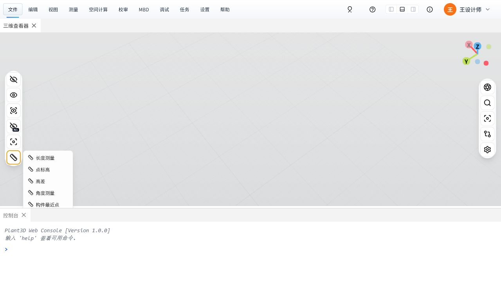
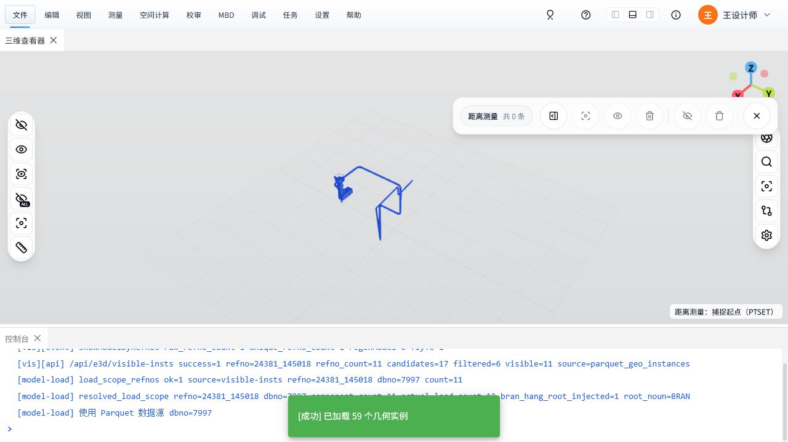
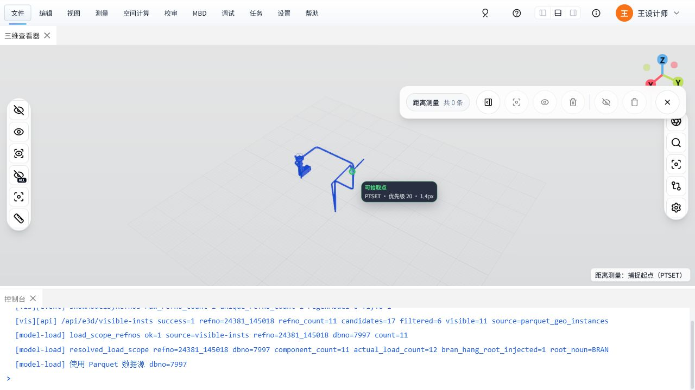
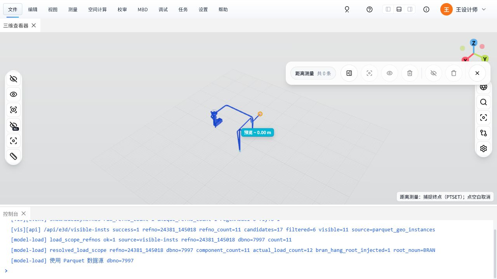
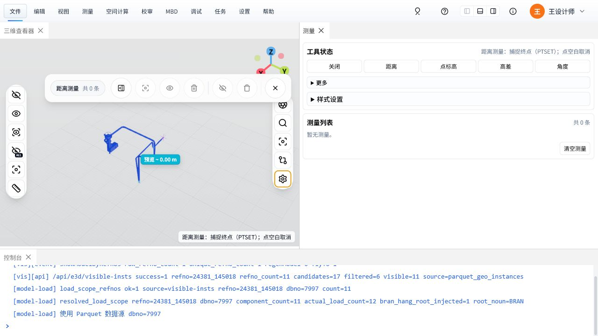

# 三维测量操作教材

本文面向第一次使用三维测量工具的设计、校审和联调人员，示例数据为 `AvevaMarineSample` 项目中的 BRAN `24381_145018`。重点讲解长度、角度、位置/标高、P-Point 捕捉和测量结果管理。

## 学习目标

完成本教程后，你应能：

- 打开三维测量菜单，并选择长度、位置/标高、高差、角度等测量模式。
- 在模型上识别 P-Point，并用工程 World 坐标完成精确测量。
- 理解测量时的绿色十字、吸附提示、预览标签、圆环锚点分别代表什么。
- 打开测量面板，查看测量状态、结果列表和样式设置。

## 准备条件

1. 打开三维查看器页面，例如：
   `http://127.0.0.1:64553/?output_project=AvevaMarineSample`
2. 确认模型已经加载完成。
3. 如需复现本文截图，可在模型树或命令入口中显示 BRAN `24381_145018`。

## 1. 打开测量菜单

在三维视口左侧工具栏中，点击尺子图标，展开测量菜单。

菜单中常用入口：

- `长度测量`：两点之间的距离测量。
- `位置/标高`：读取单点工程 World XYZ、绝对标高和相对基准标高。
- `高差`：两点之间的高度差。
- `角度测量`：三点角度测量。
- `构件最近点`、`管-墙/柱`、`管-管`：面向构件或管道的辅助测量。

## 2. 进入长度测量

点击 `长度测量` 后，右下角状态会提示当前需要捕捉起点。

状态提示示例：

- `距离测量：捕捉起点（P-Point / 实例原点）`
- `距离测量：捕捉终点（P-Point / 实例原点）；点空白取消`

测量模式下，如果点到空白区域，当前草稿会取消或保持等待状态。按一次 `Esc` 只取消当前点选序列并保留测量命令；没有草稿时再按 `Esc` 才退出测量。也可以点击浮动测量条中的退出按钮，或在测量面板中切回 `关闭`。

## 3. 使用 P-Point 捕捉点

移动鼠标到有 P-Point 数据的子元件附近。命中 P-Point 时，界面会显示绿色十字和小提示。

识别规则：

- 绿色十字：当前可捕捉的 P-Point。
- 小提示 `可拾取点 / P-Point #n`：当前鼠标已吸附到设计关键点。
- 被捕捉子元件会短暂半透明，方便看清点位。
- 没有命中可用点时，不会弹出遮挡视线的大提示框。
- 首次靠近构件时可能显示 `P-Point 正在加载`；候选完整前点击不会登记其它点源，请等待提示变为 `P-Point #n`。
- 已加载的邻近 P-Point 按光标屏幕距离参与吸附，不要求射线仍命中它所属的构件。

浮动条是 Object Snap Filter，只控制哪些点源可以捕捉；候选是否显示在测量面板中独立设置。`实例原点`是模型实例变换定义的原点，不等同于 E3D Item 端点或几何中心。`模型表面点`属于自由近似点，默认不捕捉。

## 4. 点击起点并预览终点

在 P-Point 上单击一次，锁定测量起点。起点会显示为空心圆锚点；继续移动鼠标选择终点时，会出现预览距离标签。

操作要点：

1. 第一次单击：锁定起点。
2. 移动鼠标：预览终点和当前距离。
3. 第二次单击：完成测量。
4. 如果点到空白区域：取消当前点选。

圆环锚点表示已经锁定的测量端点；绿色十字表示当前 hover 或可捕捉的 P-Point。

### 连续测量与重复测量（E3D 风格）

- 浮动测量条在长度测量模式下有 `连续测量` 开关：开启后完成 A-B 时自动以 B 为起点进入下一段，可连续测 B-C、C-D，Esc 或点空白结束当前链。
- 没开连续测量时，按一次 `空格` 执行 Repeat：优先以**当前选中**的距离测量终点为起点继续测量；没有选中时取最近一条。
- 两者只作用于长度测量，角度/标高模式不受影响。

### 直接点选尺寸图形与右键菜单（E3D 风格）

完成的测量尺寸就是场景里的可交互图形：

- **左键点选**：不在等点状态时（无进行中的草稿），左键点击尺寸线/标签即可选中该测量，与右侧列表选中互通；正在等待起点/终点时落点优先，尺寸不会抢走点击。
- **右键菜单**：任何时候右键尺寸图形都会弹出菜单（按测量类型自适应）：
  - `Display Axis`：切换距离结果的轴向分量显示（全局开关）。
  - `单位 mm/cm/m`：切换全局显示单位。
  - `复制距离值 / 复制角度值 / 复制标高值 / 复制高差值`：按当前单位精度复制到剪贴板。
  - `复制轴向分量`：距离测量专用，多行复制 ΔX/ΔY/ΔZ。
  - `Repeat（以终点继续测量）`：等价空格键，以该条测量的终点续测。
  - `定位到测量`、`隐藏/显示当前测量`、`删除测量`。
- 选中某条测量后按 `Delete` 也可以删除它。

## 5. 角度与位置测量

角度测量采用 E3D 顺序：第一次点击角度顶点，第二次点击第一边点，第三次点击第二边点。界面会依次提示 `捕捉角度顶点`、`捕捉第一边点`、`捕捉第二边点`。

`位置/标高` 单击一次完成，结果包含未受 Viewer recenter 影响的工程 `World X/Y/Z`、绝对标高和相对标高。距离结果可显示总长及带正负号的 `ΔX/ΔY/ΔZ`；它们统一跟随全局 `m/cm/mm` 和精度设置。

## 6. 查看和管理测量结果

点击浮动测量条中的面板按钮，或打开右侧 `测量` Dock 面板，可以查看测量状态、列表和样式设置。

测量面板包含：

- `工具状态`：显示当前测量模式和捕捉阶段。
- `关闭 / 距离 / 位置/标高 / 高差 / 角度`：快速切换测量模式。
- `更多`：折叠显示标高基准、管-管净距等低频功能。
- `样式设置`：折叠显示点源、捕捉阈值、标签与端点显示设置。
- `保留已完成尺寸图形（Keep Dimensions）`：关闭后，新距离完成时只隐藏旧距离图形，历史测量记录仍保留。
- `测量列表`：查看、定位、隐藏、删除、清空测量结果。

## 常见问题

### 看不到 P-Point

可能原因：

- 当前子元件没有 P-Point 数据。
- 鼠标没有靠近 P-Point 捕捉阈值范围。
- 测量点源设置中关闭了 P-Point 显示或捕捉。

处理方式：

1. 轻微移动鼠标到子元件端点、接口或关键位置附近。
2. 打开测量面板中的 `样式设置`，检查 `P-Point` 的显示和捕捉是否开启。
3. 如模型包缺少 `ptsets.parquet` 数据，前端会尝试运行态 API 兜底；仍无数据时需检查后端数据导出。

### 测量提示挡住点位

当前版本只在命中可捕捉点时显示小提示，并会尽量避开光标附近的关键点。如果仍觉得遮挡，可以旋转视角或稍微缩放模型后再捕捉。

### 滑到 TUBI 时模型没有透明

这是预期行为。普通 TUBI / mesh hover 不再自动透明，只有真正命中 P-Point 时，相关子元件才会临时半透明。

### 已点击的测量点显示成圆圈

这是测量锚点。圆圈表示该点已经被锁定为起点或终点，便于和 hover 十字、P-Point 十字区分。

## 操作检查表

完成一次标准长度测量时，可按下面检查：

- 已打开 `长度测量`。
- 鼠标靠近子元件关键点时出现绿色 P-Point 十字。
- 小提示显示 `P-Point #n`，说明候选已加载并吸附。
- 第一次点击后出现圆环锚点。
- 移动到终点时出现预览距离标签。
- 第二次点击后测量结果出现在测量列表中。
