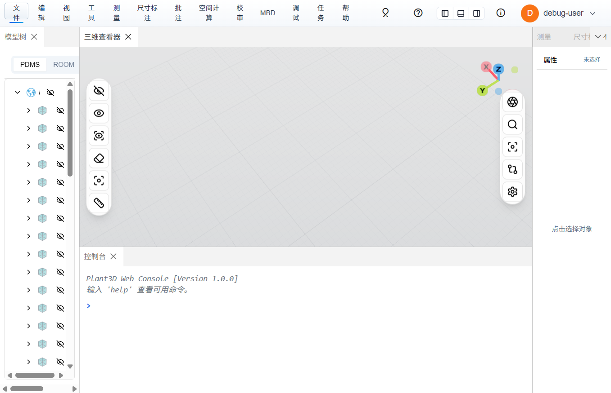
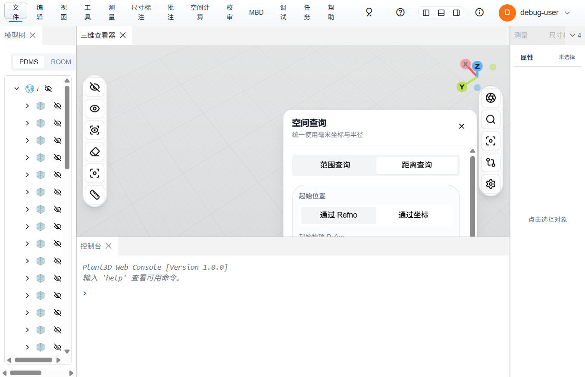
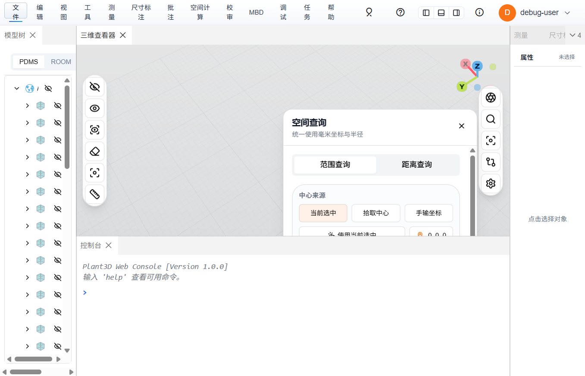
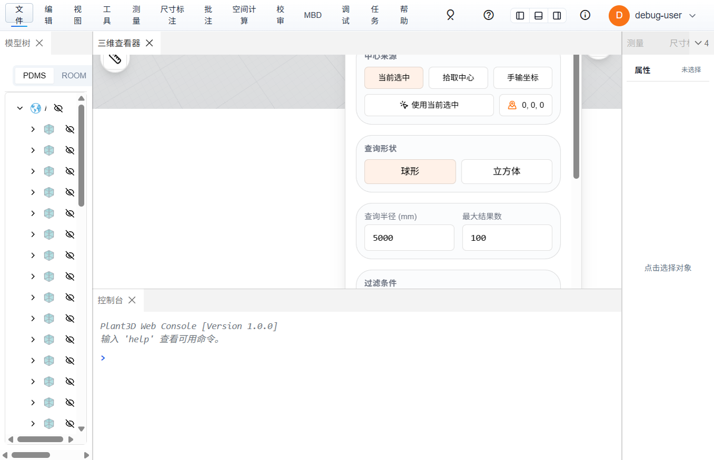
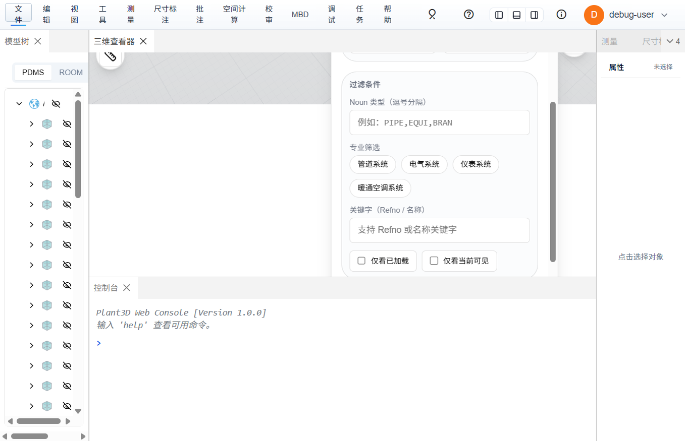
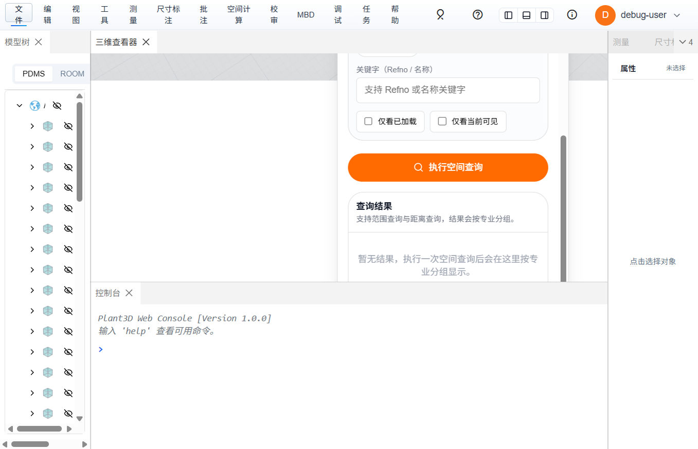
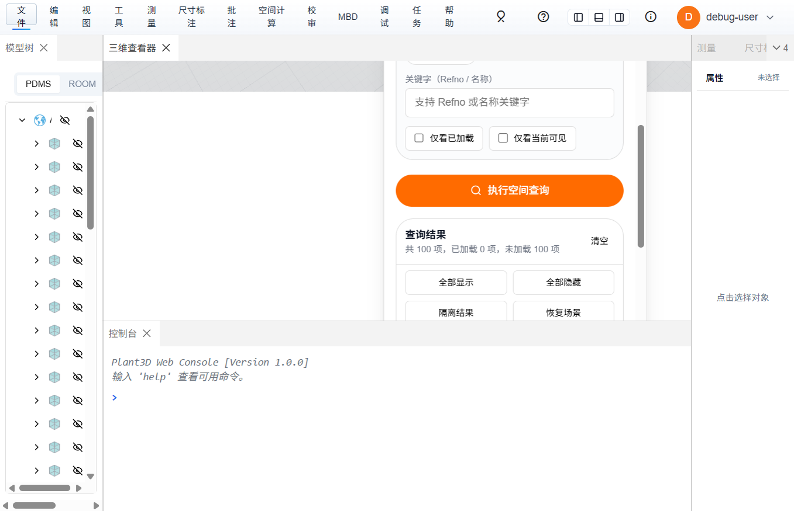
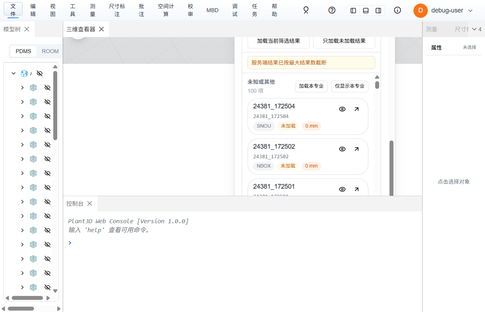

# 空间查询（按范围显示）使用教程

空间查询功能用于在三维场景中，以指定中心点和半径为条件，查找周围的构件并控制其显示/隐藏。适用于在大型工厂模型中快速定位和查看特定区域的管道、设备等。

---

## 目录

1. [打开空间查询面板](#1-打开空间查询面板)
2. [范围查询模式](#2-范围查询模式)
3. [设置查询中心](#3-设置查询中心)
4. [选择查询形状与半径](#4-选择查询形状与半径)
5. [配置过滤条件](#5-配置过滤条件)
6. [执行查询与查看结果](#6-执行查询与查看结果)
7. [结果操作：显隐、隔离、加载](#7-结果操作显隐隔离加载)
8. [距离查询模式](#8-距离查询模式)

---

## 1. 打开空间查询面板

有两种方式打开空间查询：

**方式一：右侧工具栏**

在三维查看器右侧的竖直工具栏中，点击 **放大镜（🔍）图标** 按钮即可打开空间查询面板。

**方式二：顶部菜单**

- 经典菜单栏：点击 **空间计算 → 空间查询**
- Ribbon 菜单栏：点击 **视图 → 空间查询** 按钮

打开后，面板浮动在三维视口右上方：

---

## 2. 范围查询模式

面板顶部有两个模式切换 Tab：

- **范围查询**：以中心点 + 半径定义球形/立方体区域，查找区域内所有构件
- **距离查询**：查询某个 Refno 与其他构件之间的距离

点击 **"范围查询"** 切换到范围模式：

---

## 3. 设置查询中心

范围查询需要指定一个中心点，有三种方式：

| 方式 | 说明 |
|------|------|
| **当前选中** | 以当前在场景中选中的构件的包围盒中心作为查询中心 |
| **拾取中心** | 在场景中点击一个构件，以该构件位置作为中心 |
| **手输坐标** | 手动输入 X、Y、Z 坐标（毫米单位） |

操作步骤：

1. 在「中心来源」区域选择一种方式
2. 若选择"当前选中"，先在场景中点选一个构件，再点击 **「使用当前选中」** 按钮
3. 若选择"手输坐标"，直接在 X/Y/Z 输入框中输入坐标值
4. 面板右侧的坐标指示器会实时显示当前中心坐标

---

## 4. 选择查询形状与半径

| 参数 | 说明 | 默认值 |
|------|------|--------|
| **查询形状** | 球形（推荐）或立方体 | 球形 |
| **查询半径** | 以毫米为单位的搜索范围 | 5000 mm |
| **最大结果数** | 返回的最大构件数量 | 100 |

- **球形**：以中心点为球心，半径为搜索范围，适合大多数场景
- **立方体**：以中心点为中心的正方体范围，边长 = 2 × 半径

> 提示：半径 5000mm（5 米）适合查看局部管道走向；如需查看更大范围，可调大半径至 10000-50000 mm。

---

## 5. 配置过滤条件

在「过滤条件」区域可以精确筛选结果：

| 过滤项 | 说明 | 示例 |
|--------|------|------|
| **Noun 类型** | 逗号分隔的构件类型代码 | `PIPE,EQUI,BRAN` |
| **专业筛选** | 按工程专业快速过滤 | 管道系统、电气系统、仪表系统、暖通空调系统 |
| **关键字** | 按 Refno 或名称搜索 | 输入部分 Refno 或名称 |
| **仅看已加载** | 仅在已加载到场景中的构件中查找 | - |
| **仅看当前可见** | 仅在当前可见的构件中查找 | - |

> 提示：不设过滤条件则查询范围内所有类型的构件。

---

## 6. 执行查询与查看结果

设置好条件后，点击橙色的 **「执行空间查询」** 按钮。

以下为一次实际查询的结果（中心 (0,0,0)，半径 5000mm），显示 **共 100 项，已加载 0 项，未加载 100 项**：

查询过程分为以下阶段（状态栏会实时提示）：

1. **解析中心点** → 将选中/拾取/坐标转换为世界坐标
2. **扫描已加载模型** → 在已加载的 3D 对象中检测 AABB 相交
3. **查询空间索引** → 向服务端发送请求，获取未加载的周边构件列表
4. **合并结果** → 去重合并本地和服务端结果

查询完成后，结果按 **专业分组** 显示，每个结果项包含：

- 构件名称和 Refno
- Noun 类型标签（如 SNOU、NBOX、BOX 等）
- 已加载/未加载状态标签
- 与中心点的距离

---

## 7. 结果操作：显隐、隔离、加载

结果区域提供以下批量操作按钮：

| 按钮 | 功能 |
|------|------|
| **全部显示** | 将结果中所有构件设为可见 |
| **全部隐藏** | 将结果中所有构件设为隐藏 |
| **隔离结果** | 将场景中非结果构件设为半透明（X-Ray），仅高亮结果集 |
| **恢复场景** | 取消隔离效果，恢复所有构件原始显示状态 |
| **加载当前筛选结果** | 将结果中未加载的构件从服务端下载并加载到场景 |
| **只加载未加载结果** | 仅加载状态为"未加载"的构件 |

每个专业分组还有独立的操作：

- **加载本专业**：仅加载该专业下的未加载构件
- **仅显示本专业**：隐藏其他专业，仅显示该专业的结果

单个结果项的操作：

- 点击 **眼睛图标**：切换该构件的显示/隐藏
- 点击 **箭头图标**：飞行定位到该构件
- 点击 **整行**：高亮选中并定位到该构件

---

## 8. 距离查询模式

切换到「距离查询」Tab，可以查询两点/两构件之间的距离：

- **通过 Refno**：输入起始物项的 Refno（如 `24381_100818`）
- **通过坐标**：手动输入起始坐标

后续的半径、过滤条件和结果操作与范围查询一致。

---

## 典型使用场景

### 场景 1：查看某设备周围的管道

1. 在模型树中选中设备
2. 打开空间查询 → 范围查询
3. 点击「使用当前选中」设为中心
4. 半径设为 10000 mm，Noun 类型填 `PIPE,BRAN`
5. 执行查询 → 加载未加载结果 → 隔离结果

### 场景 2：查看某区域内所有专业的构件

1. 打开空间查询 → 范围查询
2. 选择「手输坐标」，输入目标区域中心坐标
3. 半径设为 20000 mm，不设过滤条件
4. 执行查询 → 按专业分组查看

### 场景 3：快速加载局部模型

1. 在已加载的模型上选中一个构件
2. 打开空间查询 → 半径设为 5000 mm
3. 执行查询 → 点击「只加载未加载结果」
4. 系统会自动从服务端下载并加载周边几何体

---

## 注意事项

- 所有坐标和半径单位均为 **毫米（mm）**
- 查询范围过大时，建议配合 Noun 类型或专业筛选缩小结果
- "隔离结果"使用 X-Ray 效果，点击"恢复场景"可还原
- 未加载的构件需要从服务端下载，大批量加载时需等待
