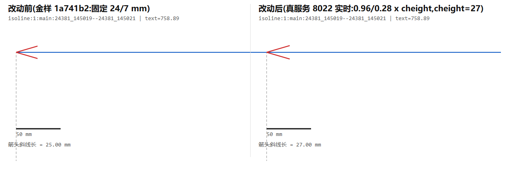
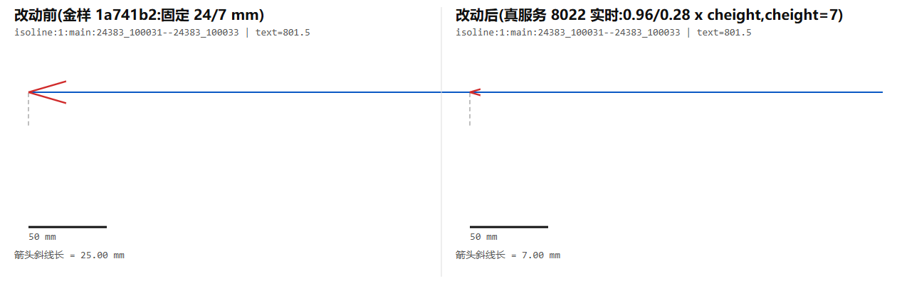

# Issue: MBD linear_dim 前端弃用 wire 上的 arrow_lines，改用自绘屏幕缩放箭头头

| 元信息 | 值 |
|------|------|
| 上报日期 | 2026-09-09 |
| 严重度 | P3（不影响 3D 视口视觉；契约字段与消费方不一致，语义/下游隐患） |
| 影响范围 | MBD V2 `linear_dim` 图元的箭头呈现；`exportSvg` 及任何以契约 `arrow_lines` 为准的消费方 |
| 修复状态 | 📝 Open（待评估：是否让前端改为消费契约几何） |
| 责任文件 | `src/dimension/adapters/mbdV2ExternalAnnotations.ts`（`mapLinearDim`）、`src/dimension/adapters/mbdV2Contract.ts`（契约类型） |

## 1. 现象描述

MBD V2 契约里，`linear_dim` 图元自带 `arrow_lines: MbdV2LineSegment[]`（求解器算好的箭头两翼线段，
设计单位、随字高的几何）。前端适配层 `mapLinearDim` **完全没有读这个字段**：它按尺寸线两端
`start / end` 现造两个 `arrows: [{ tip, towards }]`，交给内核渲染成**屏幕缩放的实心箭头头**
（尺寸恒定像素，与相机距离无关）。

结果：
- 契约里的 `arrow_lines` 在 `linear_dim` 通道被静默丢弃；只有 `slope_mark` 那类走 `arrowLines`（`slopeArrowLines`）。
- 求解器端在 `arrow_lines` 上做的任何几何决策（长度、宽度、随字高缩放）对 3D 视口的 `linear_dim` **不可见**。
- 唯一以契约 `arrow_lines` 为准的消费方是「契约开头承诺的前端 1:1 画」语义、以及从 wire 几何直接渲染的下游（如离线对拍、`exportSvg` 校对）。

> 触发这条 issue 的上下文：plant-mbd（算法单源仓）刚把 `linear_dim` 的箭头几何从写死的 24/7 mm
> 改成随组字高缩放（`0.96 / 0.28 · cheight`，提交 `f888a50`）。在真 gen-model 服务（8022）+ plant3d-web
> （3101，`?mbd_refno=24381_145018&mbdBackendPort=8022`）里目视时，3D 视口里 `linear_dim` 的箭头
> **毫无变化**——因为前端根本不看那个字段。改动的收益只有直接从 wire 几何渲染时才看得到。

### 直接从 wire 几何渲染的新旧对比

把同一条 `linear_dim` 的尺寸线 / 延长线 / `arrow_lines` 投到尺寸平面排渲染（蓝=尺寸线，红=箭头翼，虚线=延长线）：

大管（`24381_145018` isoline 1，od 114.3 → cheight 27）：箭头斜线 25 → 27 mm，几乎无感。



小管（`24383_100028` isoline 1，od 21.3 → cheight 7）：箭头斜线 25 → 7 mm，旧的 24 mm 巨箭头比尺寸文字还大，新值回到与字高同量级。



这两张是**直接从契约 `arrow_lines` 渲染**的对比；当前前端 3D 视口的 `linear_dim` 用的是自绘屏幕缩放箭头头，看不出上面这个差别。

## 2. 复现条件

1. 起 gen-model（`http://127.0.0.1:8022`）与 plant3d-web（`http://127.0.0.1:3101`）。
2. 打开 `http://127.0.0.1:3101/?mbd_refno=24383_100028&mbdBackendPort=8022`，进「三维查看器」。
3. 在浏览器控制台取任一 `linear_dim` 的 external record：

   ```js
   const sys = window.__viewerContext.dimensionSystem.value;
   const rec = sys.externalRegistry.snapshot.records
     .find(r => r.source === 'mbd' && r.id.includes(':main:'));
   console.log(rec.layout.arrowLines);  // → []（wire arrow_lines 未进 record）
   console.log(rec.layout.arrows);      // → 两个 {tip, towards}（前端自造）
   ```

   `arrowLines` 为空、`arrows` 有值即复现。

## 3. 根本原因分析

### 相关代码

`src/dimension/adapters/mbdV2ExternalAnnotations.ts` 的 `mapLinearDim`（约 L204–234）：

```typescript
return explicitRecord(primitive, 'dimension', {
  formattedLabel: primitive.text,
  labelAnchor: transformPoint(primitive.label_anchor),
  labelAlong: sub3(end, start),
  lines,                                   // ← dimension + extension_lines
  arrows: [                                // ← 前端按 start/end 现造，屏幕缩放实心头
    { tip: start, towards: end, ...(outside ? { outside } : {}) },
    { tip: end, towards: start, ...(outside ? { outside } : {}) },
  ],
  // 注意：primitive.arrow_lines 从未被读取
}, role);
```

对照 `mbdV2ExternalAnnotations.test.ts` 的注释直说了这是有意为之：
> "Millimetre arrow strokes are replaced by screen-scaled filled heads."
> `expect(rich.arrowLines).toEqual([]); expect(rich.arrows).toEqual([...])`

所以这是**当前既定设计**，不是遗漏 bug：前端刻意把 wire 上的毫米级箭头笔画换成不随距离缩放的屏幕像素箭头头，保证任何缩放级别下箭头都清晰可点。

### 影响范围

- 3D 视口视觉：无影响（前端本来就自绘）。
- 契约语义：`linear_dim.arrow_lines` 成了「产出但无人消费」的字段——求解器为它花的算力与校准（本次的随字高缩放）在主渲染路径上打了水漂。
- 下游一致性：以 wire 几何为准的路径（离线渲染、`exportSvg` 的几何校对、第三方消费方）与 3D 视口呈现不一致——同一条尺寸，一边随字高缩放、一边固定像素。

## 4. 待评估的方案（本 issue 不预设结论）

### 方案 A：前端改为消费契约 `arrow_lines`（几何箭头）

`mapLinearDim` 把 `primitive.arrow_lines` 经 `transformPoint` 映射进 `arrowLines`，
去掉自造的 `arrows`（或保留 `arrows` 仅作 fallback）。

- 优点：契约成为单一事实源，3D 视口与下游一致；求解器的箭头几何决策生效。
- 缺点：几何箭头随相机距离缩放，远景下会缩成看不见——这正是当初改屏幕缩放头的动机。需要同时评估最小像素钳制。

### 方案 B：维持现状，把契约字段标注为「非 3D 视口消费」

在 `mbdV2Contract.ts` 的 `arrow_lines` 上注明「仅供以 wire 几何为准的下游（离线/exportSvg），3D 视口自绘屏幕箭头头」，
并在 plant-mbd 侧同步一句，避免两边都以为对方在用。

- 优点：零渲染回归。
- 缺点：`arrow_lines` 继续是「产出但主路径不消费」的字段。

### 方案 C：契约瘦身

若确认 3D 视口与所有活跃下游都不以 wire `arrow_lines` 为准，评估从契约移除该字段（需 plant-mbd + 前端 + 守卫 fixture 协同，破坏性变更）。

倾向：先在本 issue 上和 plant-mbd 侧对齐「谁该是箭头几何的事实源」，再从 A/B/C 里选。

## 5. 相关文件

| 文件 | 作用 |
|------|------|
| `src/dimension/adapters/mbdV2ExternalAnnotations.ts` | `mapLinearDim` —— 丢弃 `arrow_lines`、自造 `arrows` 的入口 |
| `src/dimension/adapters/mbdV2Contract.ts` | `MbdV2LinearDim.arrow_lines` 契约类型（L71 附近） |
| `src/dimension/adapters/mbdV2ExternalAnnotations.test.ts` | 注释与断言固化了「毫米笔画换屏幕头」的现状 |
| `../vendor/plant-mbd/crates/plant-mbd/src/isodim.rs` | 求解器产出方；`make_segment` 写 `arrow_lines`，`ARROW_LENGTH_CHEIGHT_RATIO` 等（提交 `f888a50`） |

## 6. 参考

- plant-mbd 提交 `f888a50` `feat(isodim): 箭头随组字高缩放`：本 issue 的直接触发点。
- plant-mbd `crates/plant-mbd/src/isodim.rs` 模块头「与 PML 的已知差别」箭头条：记了「PML 不画箭头、线上只带 cheight、本库把箭头显式化进契约」。
- 契约另一半：`src/dimension/adapters/mbdV2Contract.ts` 与 plant-mbd `crates/plant-mbd/src/contract.rs` 同形。
