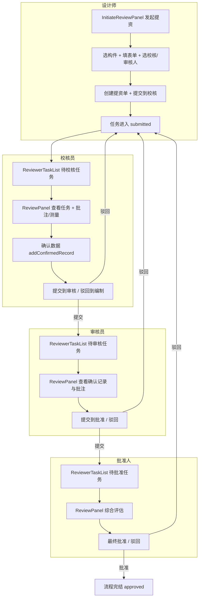

# 三维校审流程与首次使用向导分析

> 面向不同角色首次使用时的向导设计，以及当前设计/审核流程闭环分析  
> 生成时间：2025-03-19

## 一、当前三维校审流程概览

### 1.1 四段式工作流节点

| 节点代码 | 节点名称 | 对应角色     | 主要职责             |
|----------|----------|--------------|----------------------|
| `sj`     | 编制     | 设计师       | 发起提资、选构件、填表单 |
| `jd`     | 校核     | 校核员       | 校核构件、确认数据、提交或驳回 |
| `sh`     | 审核     | 审核员       | 审核校核结果、提交或驳回 |
| `pz`     | 批准     | 批准人/管理员 | 最终批准或驳回       |

流转顺序：**sj → jd → sh → pz**。可驳回至任一前置节点（如 驳回到编制、驳回到校核）。

### 1.2 角色与任务入口

| 角色         | 入口行为                         | 主要面板                     |
|--------------|----------------------------------|------------------------------|
| 设计师       | `panel.initiateReview` → 发起提资 | `initiateReview`、`myTasks`、`resubmissionTasks` |
| 校核员       | `review.start` → 待审核任务      | `reviewerTasks`、`review`    |
| 审核员       | 同上                             | `reviewerTasks`、`review`    |
| 批准人       | 同上                             | `reviewerTasks`、`review`    |

---

## 二、设计/审核流程闭环分析

### 2.1 闭环流程图

### 2.2 闭环形成机制

1. **发起端**：设计师在 `InitiateReviewPanel` 中选构件、填表单、选校核员/审核员，创建任务后自动执行 `submitTaskToNextNode`，任务进入 `submitted`。

2. **流转端**：
   - `submitTaskToNextNode`：提交到下一节点（sj→jd→sh→pz）。
   - `returnTaskToNode`：驳回到指定前置节点。
   - 驳回后 `currentNode` 回退，设计师/校核员在 `ResubmissionTaskList` 或 `DesignerTaskList` 中可见被驳回任务。

3. **数据确认**：
   - 校核/审核员在 `ReviewPanel` 中使用批注、测量工具检查模型。
   - 点击「确认数据」将批注与测量持久化为 `ConfirmedRecord`。
   - 流转决策基于这些确认记录与工作流历史。

4. **角色分流**：
   - `panel.initiateReview` 用于设计师发起提资，打开 `initiateReview`。
   - `review.start` 统一作为审核侧入口，打开 `reviewerTasks`。
   - 嵌入模式下根据 `embed_landing_state` 自动打开对应工作区。

5. **闭环保障**：
   - 驳回必填原因，便于设计人员修改。
   - WebSocket 实时刷新任务/历史，保证多人协作一致性。

---

## 三、当前首次使用向导实现情况

### 3.1 已有基础设施

| 模块                   | 位置                          | 功能说明                         |
|------------------------|-------------------------------|----------------------------------|
| `useOnboardingGuide`   | `composables/useOnboardingGuide.ts` | 向导状态、步骤、完成标记         |
| `OnboardingOverlay`    | `components/onboarding/OnboardingOverlay.vue` | 高亮遮罩 + 气泡引导             |
| `designerGuide`        | `roleGuides/designerGuide.ts` | 设计师步骤定义                   |
| `proofreaderGuide`     | `roleGuides/reviewerGuide.ts` | 校核员步骤定义                   |
| `reviewerGuide`        | 同上                          | 审核员步骤定义                   |
| `managerGuide`         | 同上                          | 批准人步骤定义                   |
| `data-guide` 标记      | InitiateReviewPanel, ReviewPanel | 目标元素定位                     |

### 3.2 向导步骤现状

**设计师向导（8 步）**：
1. 校审功能区 → 2. 发起提资 → 3. 填写提资信息 → 4. 选择构件 → 5. 上传附件 → 6. 提交提资 → 7. 我的提资 → 8. 复审任务

**校核员向导（6 步）**：
1. 校审功能区 → 2. 查看待审核任务 → 3. 待校核任务列表 → 4. 工作流进度 → 5. 确认三维数据 → 6. 提交或驳回

**审核员向导（5 步）**：
1. 校审功能区 → 2. 待审核任务列表 → 3. 审核面板 → 4. 审核决策

**批准人向导（5 步）**：
1. 校审功能区 → 2. 待批准任务列表 → 3. 审批面板 → 4. 最终决策

### 3.3 首次使用自动触发逻辑

- `useOnboardingGuide` 中已实现：
  - `shouldShowGuideForCurrentUser()`：根据 `userId + role` 判断是否已完过成向导。
  - `autoStartIfNeeded()`：若未完成则自动开始当前角色向导。

- **当前问题**：`autoStartIfNeeded` 未被调用。向导仅能通过 Ribbon 中的「校审向导」按钮手动触发。

---

## 四、首次使用向导改进建议

### 4.1 自动触发时机

| 时机             | 说明                                      | 实现要点                                   |
|------------------|-------------------------------------------|--------------------------------------------|
| 选择项目后首次进入 | 用户选定项目进入主界面，且该角色未完成向导 | 在 `App.vue` 中，`currentProject` 变化且 `shouldShowGuideForCurrentUser()` 为真时调用 `autoStartIfNeeded()` |
| 切换到校审 Tab 时 | 用户首次进入校审 Tab 且未完成向导         | Ribbon 校审 Tab 的 `@click` 中检查并触发   |
| 进入嵌入模式时     | 外部系统嵌入打开，按角色落点              | 在 `embedRoleLanding` 或 `DockLayout` 解析 embed 参数后调用 |

推荐：**项目选择后首次进入** 作为默认自动触发点，兼顾体验与可预测性。

### 4.2 角色差异化的逐步操作

当前向导主要是“页面/按钮说明”，缺少“必须完成的操作”约束。建议：

1. **设计师**：增加“任务式”步骤：
   - 步骤 3：实际选中至少 1 个构件并点击「添加构件」。
   - 步骤 4：填写数据包名称、选择校核员和审核员。
   - 步骤 5：点击「创建并提交提资单」完成一次真实提交。

2. **校核/审核/批准**：增加“任务式”步骤：
   - 步骤 N：从待办列表点击进入一个任务。
   - 步骤 N+1：在 ReviewPanel 中执行一次「确认数据」或「提交/驳回」。

3. **可跳过与不可跳过**：
   - 对“了解流程”的步骤使用 `canSkip: true`。
   - 对“完成一次实际操作”的步骤不设置 `canSkip`，或增加 `required: true` 语义。

### 4.3 数据标记与持久化

- 当前：`plant3d-onboarding-v1` 的 `completedGuides[userId__role]` 标记完成。
- 建议：维持按 `userId + role` 的 granularity；若需要“分场景完成”，可扩展为 `completedGuides[userId__role__scene]`，例如 `designer__first_submit`。

### 4.4 实现改动清单（最小可行）

| 序号 | 改动 | 文件 |
|------|------|------|
| 1 | 项目选择后自动触发首次向导 | `App.vue`：在 `currentProject` 的 watch 中调用 `onboarding.autoStartIfNeeded()` |
| 2 | 确保 Ribbon 校审 Tab 有 `data-ribbon-tab="review"` | `RibbonBar.vue` / `ribbonConfig.ts` |
| 3 | 确保 `review.start`、`panel.myTasks` 等按钮有对应 `data-command` | `ribbonConfig.ts`（已存在） |
| 4 | 可选：增加“任务式”步骤的前置检查 | `designerGuide`、`reviewerGuide` 的 `onBeforeShow` 中检查是否已有构件/任务 |

---

## 五、闭环与向导的关系

- **闭环**：由工作流节点、角色分流、提交/驳回与数据确认共同构成。
- **向导**：帮助用户第一次就正确完成闭环中的关键操作，降低学习成本，提高流程完成率。

建议在完成 P1 级代码修复（如确认记录保存、审批操作的异步一致性）后，再完善首次使用向导的自动触发与“任务式”步骤，以保证引导的是稳定、可预期的流程。
