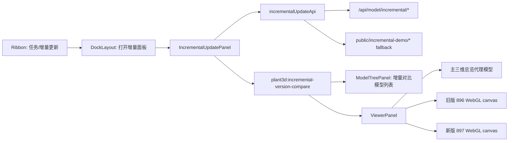

# 增量更新与双三维版本对比架构计划

## 前置约束

- 前端仓库 `plant3d-web` 只负责增量更新入口、差异展示、模型树同步、三维版本对比视图和错误兜底。
- E3D 数据库目录监控、增量解析保存、真实模型增量生成由后端提供接口；前端通过 `/api/model/incremental/*` 消费结果。
- `AvevaMarineSample` 的 `DB 1112 · SES 896 -> 897` 是当前可复现样例；当后端接口不可用时，前端必须能用 `public/incremental-demo/` 数据完成端到端 UI 验证。
- 对比模式必须显示两个三维界面：左侧旧版，右侧新版。单一三维视图中的状态块只能作为总览，不满足最终交付要求。

## 需求分析

### 用户目标

用户需要在 `AvevaMarineSample` 测试站点中选择 `DB 1112` 的一个历史记录，对比两个数据库版本，最终在界面上看到：

- 增量监控记录：能看到哪个 DB 发生变化、元素变化数量、影响模型数量。
- 增量详情：能查看新增、修改、删除的元素和属性差异。
- 模型树对照：左侧模型树区域能列出受影响模型，并显示旧版/新版状态。
- 双三维对比：同一批模型在两个三维界面中并排展示，旧版在左，新版在右。
- 错误隔离：缺少后端、缺少 Parquet 或部分查询 500 时，对比界面仍能展示样例版本差异，不进入全局错误态。

### 交付范围

| 范围 | 内容 | 当前前端责任 |
| --- | --- | --- |
| 增量监控 | 查询变更 DB、版本号、统计信息 | 是 |
| 增量解析 | E3D DB 文件历史版本解析、差异保存 | 否，后端责任 |
| 模型增量生成 | 后端按变化 refno 生成/刷新模型资产 | 否，前端传递 `generate_model` 并展示状态 |
| 模型树差异 | 受影响模型列表、旧/新状态、选择同步 | 是 |
| 双三维对比 | 旧版/新版两个三维视口并排渲染 | 是 |
| 演示兜底 | 1112 的 896 -> 897 demo 数据 | 是 |

## Edge cases

| 场景 | 风险 | 处理策略 |
| --- | --- | --- |
| 后端监控接口不可用 | 增量面板空白 | fallback 到 1112 demo 监控数据，并显示来源提示 |
| 后端详情接口不可用 | 无法查看元素变化 | fallback 到 demo summary |
| 后端模型变化接口不可用 | 无影响模型列表 | 从 summary 中按 `model_refno` 聚合构造模型变化行 |
| 后端属性差异接口不可用 | 属性差异加载失败 | 面板级错误提示，不影响模型树和三维对比 |
| `db_meta_info.json` 缺失 | Viewer 无法按 refno 解析 dbnum | AvevaMarineSample demo 使用内置 `DB 1112 -> ref0 17496` 映射兜底 |
| Parquet 缺失 | 普通模型加载会弹红色错误 | compare 模式不触发普通 Parquet 加载，只渲染版本对比视图 |
| 模型 refno 重复 | 重复渲染、统计错误 | 使用 `Set` 去重 |
| 模型数量过大 | UI 卡顿、WebGL 对象过多 | 当前入口限制最多 300 个 refno；1112 样例 118 个可接受 |
| 空模型列表 | 无意义事件或空界面 | 直接返回，不派发对比 |
| Viewer/ModelTree 尚未挂载 | 对比事件丢失 | 先激活面板，再延迟二次派发对比事件 |
| canvas 尚未进入 DOM | WebGL 初始化失败 | `nextTick + requestAnimationFrame` 后渲染双视口 |
| WebGL 上下文重建 | 内存泄漏 | 关闭对比时 dispose scene/renderer；重绘前释放旧 scene 对象 |
| 旧版缺失/新版存在 | 新增模型误读为旧版存在 | 左视口渲染灰色线框，右视口渲染绿色实体 |
| 旧版存在/新版缺失 | 删除模型误读为新版存在 | 左视口渲染红色/实体状态，右视口渲染灰色线框 |
| 修改模型 | 无法区分新增/修改 | 双视口都渲染存在状态，并用修改色标识 |
| 部分后端 `/api/pdms/*` 500 | 控制台错误影响判断 | UI 对比路径不依赖这些接口；错误不应变成可见阻断态 |

## 架构说明



### 数据流

1. 用户打开 `任务 -> 增量更新`。
2. `IncrementalUpdatePanel` 调用 `loadIncrementalMonitor`。
3. 后端成功时使用后端数据；后端失败时加载 1112 demo 数据。
4. 用户选择 `DB 1112 · 896 -> 897`。
5. 面板加载 summary、属性差异、模型变化列表。
6. 用户点击“对比”。
7. 面板激活 `modelTree` 和 `viewer`，派发 `plant3d:incremental-version-compare`。
8. `ModelTreePanel` 构造增量模型列表。
9. `ViewerPanel` 渲染主三维总览代理模型，并在浮层中渲染左右两个 WebGL 三维视口。

### 文件结构

| 文件 | 责任 |
| --- | --- |
| `src/api/incrementalUpdateApi.ts` | 增量接口类型、后端请求、demo fallback |
| `src/components/incremental/IncrementalUpdatePanel.vue` | 增量监控、详情、模型对比矩阵、派发版本对比事件 |
| `src/components/dock_panels/IncrementalUpdatePanelDock.vue` | Dock 面板包装 |
| `src/components/DockLayout.vue` | 注册和打开增量更新面板 |
| `src/ribbon/ribbonConfig.ts` | Ribbon 增量更新入口 |
| `src/composables/usePanelZones.ts` | 面板 zone 注册 |
| `src/components/model-tree/ModelTreePanel.vue` | 模型树增量对比列表、选择同步 |
| `src/components/dock_panels/ViewerPanel.vue` | 主三维总览、旧版/新版双 WebGL 视口、资源释放 |
| `src/composables/useDbMetaInfo.ts` | AvevaMarineSample 1112 demo db_meta 映射兜底 |
| `public/incremental-demo/1112_896_897_incremental_summary.json` | 1112 样例增量 summary |
| `public/incremental-demo/1112_896_897_model_changes.json` | 1112 样例影响模型列表 |

## 核心实现

### 增量面板

- 以 `IncrementalMonitorRecord` 表示一个 DB 版本变化记录。
- 以 `IncrementalSummary` 表示元素级变化。
- 以 `IncrementalModelChange` 表示受影响模型。
- “对比”模式只派发版本对比事件，不调用普通 `showModelByRefnosWithAck`，避免缺 Parquet 时弹出普通模型加载错误。
- “加载变化模型”仍保留普通模型加载路径，用于后端真实模型资产可用的环境。

### 模型树

- 监听 `plant3d:incremental-version-compare`。
- 将事件中的 `models/refnos` 标准化为 `17496_496493` 形式。
- 在模型树顶部显示“增量对比模型”虚拟列表。
- 选择模型时同步全局 selection，并派发定位事件。

### Viewer

- 监听 `plant3d:incremental-version-compare`。
- 渲染三类可视化：
  - 主三维总览代理模型：在主 Viewer scene 中展示所有变化模型。
  - 旧版三维视口：独立 WebGL canvas，渲染旧版状态。
  - 新版三维视口：独立 WebGL canvas，渲染新版状态。
- 旧版/新版状态映射：
  - `missing`：灰色透明线框。
  - `present`：实体模型。
  - `added`：新版绿色实体，旧版灰色线框。
  - `deleted`：旧版删除色实体，新版灰色线框。
  - `modified/mixed`：修改色实体。

### 错误处理

| 层级 | 错误 | 处理 |
| --- | --- | --- |
| API | fetch 非 2xx | 抛出结构化 Error，由调用方 fallback 或提示 |
| Monitor | 后端不可用 | demo monitor fallback |
| Summary | 后端不可用 | demo summary fallback |
| Model changes | 后端不可用 | 从 summary 聚合 |
| Compare | refno 为空 | 不派发事件 |
| Compare | compare 模式缺 Parquet | 不走普通模型加载 |
| Viewer | canvas 未挂载 | 延迟到 next frame 渲染 |
| Viewer | 关闭 overlay | dispose 代理模型、mini scene、renderer |
| Db meta | AMS demo 缺文件 | 使用内置 1112 映射 |

## 开发计划

1. 建立接口层
   - 定义 monitor/report/model-changes/attr-diff 类型。
   - 实现后端请求和 1112 demo fallback。

2. 建立增量面板
   - 接入 Ribbon 和 Dock。
   - 显示监控记录、详情、属性差异、模型对比矩阵。
   - 对 compare 模式派发版本对比事件。

3. 建立模型树对照
   - 监听版本对比事件。
   - 显示虚拟增量模型列表。
   - 支持选择和定位同步。

4. 建立 Viewer 对照
   - 主 scene 渲染总览代理模型。
   - 浮层渲染旧版/新版两个 WebGL canvas。
   - 实现资源释放、重绘调度、状态配色。

5. 验证
   - 使用 `AvevaMarineSample`、`DB 1112`、`896 -> 897`。
   - 验证双三维视口均渲染 118 个模型。
   - 验证模型树存在 118 个对比模型。
   - 验证无可见 Parquet/模型加载失败错误。

## 验证方式

### 自动化验证

已使用 Playwright 打开：

```text
http://127.0.0.1:5174/?output_project=AvevaMarineSample
```

验证流程：

1. 点击 `任务`。
2. 打开 `增量更新`。
3. 选择第一条 `DB 1112` monitor record。
4. 等待 `模型对比` 和 `新增 118` 出现。
5. 点击“对比”。
6. 断言：
   - `window.__incrementalCompareProxy.count === 118`
   - `window.__incrementalCompareSplit.before.count === 118`
   - `window.__incrementalCompareSplit.after.count === 118`
   - 页面包含 `旧版 896`
   - 页面包含 `新版 897`
   - 页面包含 `增量对比模型`
   - 页面不包含 `模型加载失败`
   - 页面不包含 `Parquet 不可用`

截图证据：

```text
test-results/incremental-viewer-tree-compare-ams1112-dual-viewport.png
```

### 构建验证

```powershell
rtk npm run type-check
rtk npm run build-only
git diff --check -- src\components\dock_panels\ViewerPanel.vue src\components\incremental\IncrementalUpdatePanel.vue
```

当前结果：

- `type-check` 通过。
- `build-only` 通过。
- `diff --check` 通过。
- Vite 仍报告既有 chunk-size/dynamic import 警告，不影响本功能。

## 性能与可维护性考虑

- 对比入口最多处理 300 个 refno，避免一次性构造过多 WebGL 对象。
- 1112 样例 118 个模型，每个双视口各 118 个 mesh，主 scene 另有总览代理模型；当前规模可接受。
- 双视口使用独立 WebGLRenderer，关闭 overlay 时显式 dispose，降低上下文和 GPU 资源泄漏风险。
- compare 模式与普通模型加载解耦，缺 Parquet 时仍可验证版本差异；真实模型资产可用时，“加载”按钮仍能走普通模型路径。
- 版本对比通过 `plant3d:incremental-version-compare` 解耦面板、模型树和 Viewer，后续可替换为共享 store，但当前事件方式改动面更小。
- demo fallback 只针对 AvevaMarineSample/1112，不应扩散为通用数据策略。

## 最终 review 总结

- 需求闭环：已从单视图代理升级为双三维视口对比，满足“两个界面有三维模型对比”的目标。
- 错误处理：后端不可用、Parquet 缺失、db_meta 缺失均有前端兜底；compare 模式不会触发普通模型加载失败弹窗。
- 可验证性：1112 的 896 -> 897 自动化验证已覆盖双视口、模型树、错误态和构建。
- 剩余外部依赖：真实 E3D 目录监控、增量解析保存、真实增量模型生成仍依赖后端接口稳定输出；前端已经按接口契约接入。
