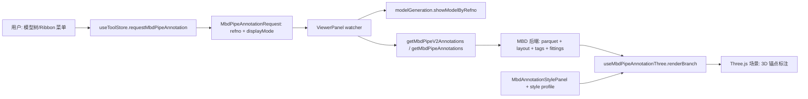

# 三维交互 MBD 管道尺寸标注架构与开发计划

## 背景与目标

用户目标是在三维前台中选择真实管道 BRAN 后，通过菜单点击显示 MBD 尺寸标注。标注必须和真实三维模型绑定，而不是固定在某个出图视角或截图视角中。用户旋转、缩放、平移摄像机时，尺寸线、箭头、文字、材料编号、坐标标签等应继续对应正确的三维锚点，并保持可读。

当前优先目标是 BRAN 长度尺寸标注，参考 `D:\work\plant-code\rs-core\MBD` 的 BRAN 长度标注效果。第一条真实测试数据是 `2013286704/476`，站点来自 `D:\AVEVA\Projects\E3D2.1\AvevaPlantSample\aps000\aps250160_0001`，前端消费 `plant-model-gen-cata-closure\dist\package` 部署包，并依赖 `D:\AVEVA\Projects\E3D2.1\AvevaCatalogue` 元件库项目路径。

## 范围

### 必须交付

- 在三维交互界面中，通过模型树右键菜单或 Ribbon 菜单触发 MBD 管道标注。
- 菜单触发默认显示完整交互式 MBD 标注，包括 BRAN 主链长度、管段长度、位置标签、标高、材料编号、焊缝/弯头/管件辅助信息等后端可返回内容。
- 标注使用真实后端和真实 branch 数据，不使用演示几何作为验收依据。
- 三维标注采用真实 3D 锚点和投影，不把菜单触发路径切换到固定图纸布局。
- 提供 MBD 标注样式配置入口，能够配置尺寸线、箭头、引线、管道轮廓和模型增强样式。
- 具备完整错误处理和可验证的自动/手工验证方式。

### 暂不作为第一阶段完成标准

- 自动生成正式出图图纸文件。
- 2D 图纸排版算法完全复刻参考图每一个图框位置。
- 对所有 AVEVA 管道元件族做全量覆盖。
- 后端部署脚本和 E3D 站点创建脚本的自动化编排。

## 需求分析

### 用户流程

1. 用户打开普通三维页面。
2. 用户加载真实模型包，能看到 `2013286704/476` 对应 BRAN。
3. 用户在模型树或三维选择中选中 BRAN/HANG/PIPE。
4. 用户点击右键菜单 `生成 MBD 标注`，或 Ribbon 的 `MBD -> 生成标注`。
5. 前端发出 MBD 标注请求，明确 `displayMode: 'full'`。
6. Viewer 预加载或聚焦对应真实模型。
7. Viewer 请求后端 MBD API，带上完整交互标注所需开关。
8. `useMbdPipeAnnotationThree` 将后端返回的尺寸、标签、材料、管件增强渲染到三维场景。
9. 用户旋转、缩放摄像机，标注仍然和管道锚点对应，文字保持 billboard 可读，尺寸线和箭头不漂离模型。
10. 用户打开设置中的 MBD 标注样式面板，修改颜色、线宽、箭头大小等配置，当前标注应可刷新或重新渲染。

### 模式定义

| 模式 | 触发 | 目的 | 坐标策略 |
| --- | --- | --- | --- |
| `full` | 菜单/Ribbon 默认，普通 `mbd_refno` URL 默认 | 三维交互完整 MBD 标注 | 真实 3D 锚点，随摄像机投影 |
| `length` | 显式 `mbd_preset=length/core/minimal/dims` | 只看核心长度尺寸 | 真实 3D 锚点，少量标注 |
| `drawing` | 显式 `mbd_preset=drawing/sheet/reference` 或 `mbd_sheet=1` | 参考图/出图式固定版面 | 图纸视角和屏幕排版策略 |

菜单/Ribbon 不允许默认进入 `drawing`。固定图纸模式只能由显式 URL preset 进入。

## Edge cases

| 场景 | 风险 | 处理策略 |
| --- | --- | --- |
| 选中的是 BRAN | 正常路径 | 直接以该 refno 请求后端 |
| 选中的是 PIPE/HANG | 后端可能只能支持部分 noun | 菜单允许入口，后端失败时给出明确 toast，后续按 noun 扩展 |
| 选中的是 TUBI/ELBO 等子元件 | 用户期望看到所属 BRAN 标注 | 第一阶段菜单只开放 BRAN/HANG/PIPE；后续可向上解析 owner BRAN |
| refno 使用 `2013286704/476` | 前后端 key 可能不一致 | 统一通过 `normalizeRefnoKeyLike` 归一化为可查询 key |
| refno 使用 `2013286704_476` | URL 和文件名常用格式 | 视为同一 branch |
| 模型尚未加载 | 标注出现但模型不可见 | 请求前调用 `showModelByRefno`，超时后继续标注并记录 warning |
| 模型预加载失败 | 页面无反馈或卡死 | toast 继续显示生成进度，console 记录 `[mbd-pipe]` warning |
| 后端不可用 | 用户只看到空面板 | 捕获异常，toast 显示失败原因 |
| 后端返回 `success=false` | 静默失败 | 使用 `error_message` toast，并 console.warn |
| 后端返回无 `layout_result` | `layout_first` 渲染缺少排布提示 | 保持当前模式，toast 提示 fallback 渲染 |
| 后端缺少 segments | 尺寸和轮廓无法锚定 | 渲染已存在数据，缺失部分不报 fatal |
| 后端缺少 fittings/tags/material | 完整 MBD 内容不完整 | full 模式按返回内容增量渲染，不因局部缺失失败 |
| parquet 中没有该 owner | 真实 branch 测不出来 | API 返回明确错误；验证记录可用 owner 列表 |
| 多次快速点击生成 | 旧请求覆盖新请求 | 使用 request timestamp/clear 策略，后续可接入 latest-only gate |
| 用户清空标注时请求仍在飞 | 旧响应重新渲染 | Viewer watcher 使用 latest-only gate，响应前判断 latest |
| 普通 URL 带 `mbd_refno` | 误进入图纸固定视角 | 默认解析为 `displayMode: 'full'` |
| 显式 `mbd_preset=drawing` | 用户要参考图式出图 | 才启用 drawing preset |
| 交互 full 模式需要管道增强 | 以前只在 drawing preset 生成增强几何 | 用独立 `showPipeVisualEmphasis` 控制，不依赖 drawing URL |
| 管段长度 `600` 属于 inline tube length | 被 cut-tubi 开关误隐藏 | 用 `showInlineTubeLengthDims` 单独控制 |
| 旋转摄像机后文字反向或遮挡 | 读数不可用 | 文字 billboard，锚点仍为 3D 坐标；必要时做屏幕避让 |
| 缩放后箭头过大/过小 | 视觉比例失真 | 样式 profile 以像素参数驱动，渲染层换算为相机相关尺寸 |
| 标注和模型全局矩阵不一致 | 尺寸漂离模型 | 渲染层统一使用 Viewer 提供的 global model matrix |
| 模型单位或重心变化 | 旧标注错位 | 现有策略清空/重建标注，后续可按 transform version 检测 |
| 多 BRAN 验证 | 单样本过拟合 | 使用当前 cata2 包验证 `2013286704_476`，用 multibran 包补测 `497/508/488` |
| 大量 BRAN 同时标注 | WebGL 对象过多 | 第一阶段单 branch；后续批量标注需要 batching 和 LOD |
| 样式 localStorage 损坏 | 设置面板异常 | profile 读取失败回默认值，输入做 sanitize |
| 样式配置后当前标注不刷新 | 用户认为配置无效 | 监听 style version，重新应用运行时样式并重绘当前 branch |
| 图纸模式和交互模式共享全局函数 | 改一处破坏另一处 | 所有 drawing-only 行为必须由显式 drawing predicate 保护 |
| 模型树 root 尚未初始化就触发定位 | `focusNodeById` 直接返回，BRAN 行未渲染 | UI/E2E 等待 root/flatRows ready；外部定位流程保留容错 |
| 右键菜单内容增多后靠近窗口底部 | `生成 MBD 标注` 可能落到视口外无法点击 | 菜单打开后读取真实 DOM 尺寸并二次 clamp 到 viewport |

## 架构说明



### 关键原则

- 请求层必须显式传递 `displayMode`，不能从 URL 全局状态推断菜单意图。
- `drawing` 是特殊出图模式，所有固定视角、屏幕排版、drawing-only 管线只在该模式启用。
- `full` 是普通三维交互模式，允许显示完整 MBD 数据，但仍使用三维锚点和相机投影。
- 样式配置和可见性配置应分离：样式决定颜色/线宽/箭头，visibility 决定显示哪些标注类型。
- 后端失败和局部数据缺失不应破坏 Viewer；错误要落到 toast 和 console。

### 前端文件结构

| 文件 | 责任 |
| --- | --- |
| `src/components/model-tree/ModelTreePanel.vue` | 模型树右键菜单入口，判断可生成 MBD 的 noun，并发起 `displayMode: 'full'` 请求 |
| `src/components/model-tree/ModelTreeRow.vue` | 模型树行渲染，提供稳定 refno/type test attributes，支持真实 DOM 右键验证 |
| `src/ribbon/ribbonConfig.ts` | Ribbon 的 MBD 工具入口和设置入口 |
| `src/components/dock_panels/ViewerPanel.vue` | 监听 MBD 请求、预加载模型、组合 API 参数、处理错误、调用渲染器 |
| `src/composables/useToolStore.ts` | 跨组件 MBD 请求契约，定义 `MbdPipeAnnotationDisplayMode` |
| `src/composables/mbd/mbdRequestSync.ts` | 请求/外部标注注册的同步辅助，后续承载 latest-only 防竞态 |
| `src/utils/mbdStandaloneUrl.ts` | URL preset 解析，区分 standalone full 与 explicit drawing |
| `src/api/mbdPipeApi.ts` | MBD API DTO、参数默认值、响应解析 |
| `src/composables/useMbdPipeAnnotationThree.ts` | 三维尺寸、标签、材料、焊缝、管件增强的核心渲染 |
| `src/composables/mbd/mbdDrawingStyleProfile.ts` | MBD 标注样式 profile、预设、持久化、输入清洗 |
| `src/components/tools/MbdAnnotationStylePanel.vue` | 设置页中的样式配置面板 |
| `src/components/dock_panels/MbdAnnotationStylePanelDock.vue` | Dock 面板包装 |
| `src/utils/three/annotation/*` | 3D 尺寸线、文字、焊缝等基础标注对象 |
| `e2e/*mbd*` | 真实 BRAN/浏览器验证脚本 |
| `e2e/mbd-interactive-ui.spec.ts` | 真实后端 gated 的 Ribbon 和模型树右键菜单点击 E2E，覆盖 full 交互标注、相机旋转锚点和样式设置 |

## 核心实现设计

### 请求契约

```ts
export type MbdPipeAnnotationDisplayMode = 'full' | 'drawing' | 'length';

export type MbdPipeAnnotationRequest = {
  refno: string;
  displayMode?: MbdPipeAnnotationDisplayMode;
  timestamp: number;
};
```

默认值为 `full`。模型树菜单和 Ribbon 生成标注都显式传 `full`。只有 URL preset 明确指定 drawing/sheet/reference 或 `mbd_sheet=1` 时才进入 `drawing`。

### Viewer 编排

Viewer watcher 的职责：

1. 归一化 refno。
2. 显示生成中 toast。
3. 按 `displayMode` 计算：
   - `isDrawingSheetMbd`
   - `isFullInteractiveMbd`
   - `isFullMbd`
4. 普通交互模式打开 MBD 管道面板。
5. 预加载模型，drawing 模式不 flyTo，full 模式允许 flyTo 到真实模型。
6. 组合 API 参数：
   - 长度基础：`include_chain_dims=true`、`include_cut_tubis=true`
   - full 完整数据：`include_fittings/tags/position_tags/elevation_marks/branch_label/material_balloons/material_table/welds/bends=true`
7. 调用 V2 API，失败时 fallback 或 toast。
8. 调用 `renderBranch` 和 `flyTo`。
9. 同步标注到交互系统。
10. finally 只清理当前 watcher 自己处理过的 request，避免旧请求清掉新请求。

### 渲染层

`useMbdPipeAnnotationThree` 保持三类职责：

- 数据到 Three 对象：尺寸线、箭头、文字、标签、焊缝、弯头、管件增强。
- 可见性控制：segment/chain/overall/port/cut-tubi/tags/material 等显示开关。
- 运行时样式：读取 `MBD_DRAWING_STYLE_PROFILE`，在 style version 改变时重绘当前数据。

新增或保留的关键开关：

- `showInlineTubeLengthDims`: full 模式可显示 inline tube length，不强制打开 cut-tubi 明细。
- `showPipeVisualEmphasis`: full 模式可显示管道和管件增强几何，不依赖 drawing preset。

### 样式设置

样式 profile 至少覆盖：

- 尺寸线颜色、悬停色、选中色、透明度、线宽。
- 箭头大小、箭头角度。
- 界线透明度和宽度比例。
- 引线颜色、透明度、管线半径。
- 管道主体、环线、band、rail、outline 的颜色和透明度。
- 管件核心、端口、arm 的颜色和透明度。
- 模型边线颜色、透明度和阈值角。

localStorage 读取失败、JSON 损坏、数值越界时必须回到默认 profile。

## 开发计划

### Phase 0: 需求和现状审计

状态：完成。

- 阅读用户参考图和历史反馈。
- 用 SigMap 和 `rg` 收敛 MBD 请求、Viewer、渲染、样式配置文件。
- 确认当前核心问题是 fixed drawing preset 与三维交互 full 模式混用。

### Phase 1: 请求模式分层

状态：完成/待复核。

- 增加 `MbdPipeAnnotationDisplayMode`。
- 模型树菜单和 Ribbon 触发 `displayMode: 'full'`。
- URL standalone 默认 full，显式 drawing preset 才进入 drawing。
- 补充 URL preset 单元测试。

### Phase 2: Viewer API 参数和错误处理

状态：完成/待复核。

- 根据 `displayMode` 区分 full/drawing/length。
- full 模式请求完整 MBD 数据。
- full 模式不启用 drawing fixed-view 行为。
- 预加载模型失败、后端失败、layout_result 缺失均有 toast/console 处理。
- 使用 latest-only gate，避免旧请求覆盖新请求。

### Phase 3: 三维渲染通用化

状态：完成/待复核。

- 将 inline tube length 显示和 cut-tubi 细节显示分离。
- 将管道/管件视觉增强和 drawing preset 分离。
- 保持尺寸线、文字、箭头使用 3D 锚点和相机 billboard。
- 样式 version 改变时重绘当前 branch。

### Phase 4: 样式设置页

状态：完成。

- 已有 MBD 标注样式面板和 Dock 包装。
- 已有 profile sanitize、localStorage 持久化和预设。
- 真实 UI E2E 覆盖从 Ribbon 打开 `MBD -> 标注设置`，应用样式预设后 full 交互标注线色热更新。

### Phase 5: 自动测试

状态：完成。

- URL preset 测试覆盖 full/drawing/length 分离。
- 渲染层测试覆盖 layout_first 默认、cut-tubi opt-in、普通三维页不误生成 drawing-only 几何。
- 真实 UI E2E 覆盖 Ribbon 菜单点击触发 full request。
- 真实 UI E2E 覆盖模型树 BRAN 行右键菜单点击触发 full request。
- 竞态 E2E 覆盖快速切换 MBD 请求时保留最新请求结果。

### Phase 6: 真实 BRAN 验证

状态：完成。

- 使用 `2013286704_476` 和真实后端验证可显示主尺寸 `600`、`1073`、`783`。
- 验证摄像机旋转后标注屏幕位置变化，说明不是固定截图/固定视角叠图。
- 已生成验证 artifact：`tmp/mbd-real-2013286704_476-interactive-verify.json`。
- 已新增真实 UI 菜单验证：`MBD_REAL_UI_E2E=1 ... npx playwright test e2e/mbd-interactive-ui.spec.ts`。
- 该验证点击 Ribbon 的 `MBD -> 生成标注` 和 `MBD -> 标注设置`，确认 full 请求、三维锚点旋转、样式预设热更新。
- 该验证还定位模型树真实 BRAN 行，右键打开上下文菜单并点击 `生成 MBD 标注`，确认 full 请求、三维锚点旋转和主长度文本。
- 待补：在可用 multibran 后端或测试包上验证 `497/508/488` 等其他 BRAN。

## 验证方式

### 自动化命令

```powershell
npm run type-check

npx eslint src/utils/mbdStandaloneUrl.ts src/utils/mbdStandaloneUrl.test.ts src/composables/mbd/mbdRequestSync.ts src/composables/useToolStore.ts src/components/model-tree/ModelTreePanel.vue src/components/dock_panels/ViewerPanel.vue src/composables/useMbdPipeAnnotationThree.ts --fix

npx vitest run src/utils/mbdStandaloneUrl.test.ts src/composables/useMbdPipeAnnotationThree.flyTo.test.ts -t "standalone MBD|drawing preset|普通三维页只叠加|layout_first defaults show main|V2 cut_tubi" --reporter=dot

$env:MBD_REAL_UI_E2E='1'; $env:MBD_REAL_BACKEND_URL='http://127.0.0.1:18082'; $env:MBD_REAL_OUTPUT_PROJECT='aps250160-mbd-cata2'; $env:MBD_REAL_REFNO='2013286704_476'; npx playwright test e2e/mbd-interactive-ui.spec.ts

npx playwright test e2e/mbd-pipe-race.spec.ts
```

### 真实 BRAN 浏览器验证

测试 URL 示例：

```text
http://127.0.0.1:3101/viewer/?backend=http%3A%2F%2F127.0.0.1%3A18082&output_project=aps250160-mbd-cata2&mbd_refno=2013286704_476&mbd_debug=1&mbd_api_debug=1&mbd_dim_text=backend
```

验收点：

- 默认 `mbd_refno` URL 进入 full 交互模式，而不是 drawing preset。
- 页面中出现真实模型，不是空白或演示几何。
- 出现 BRAN 主链尺寸和管段长度，例如 `1073`、`600`、`783`。
- API 请求包含 full 数据开关，例如 `include_fittings=true`、`include_tags=true`、`include_material_balloons=true`。
- 旋转摄像机后，标注屏幕坐标随模型投影变化，且仍在视口内。
- 标注和模型的相对位置不明显漂离。

### 手工验收

1. 打开普通三维页面。
2. 加载 `aps250160-mbd-cata2`。
3. 在模型树找到 `2013286704/476` 或 `2013286704_476`。
4. 右键点击该 BRAN，选择 `生成 MBD 标注`。
5. 确认 MBD 面板打开，三维场景中显示管道和标注。
6. 旋转、缩放视图，确认尺寸线、箭头、文字仍绑定到管道。
7. 打开设置里的 `MBD 标注样式`，修改颜色/线宽/箭头，确认当前标注可更新。

## 性能与可维护性考虑

- 单 branch 渲染优先，避免一次性给大量 BRAN 建立海量标注对象。
- drawing-only 屏幕排版算法不进入 full 交互模式，降低旋转时的重排成本和错位风险。
- 样式 profile 集中管理，避免颜色/线宽散落在渲染函数中。
- 后续若 full 模式标注数量增长，需要将线/箭头/管道强调几何做 batching 或对象池。
- 后续需要增加 request token 或 AbortController，解决快速切换 branch 的竞态。
- 验证不要只依赖单一 BRAN；至少覆盖直管、折线、多管件、缺少标签、缺少 layout_result 的样本。
- debug snapshot 只在 dev 或显式 debug URL 下启用，避免生产性能损耗。

## 最终 Review 总结

- 普通三维交互页的 MBD 生成路径已和 drawing 出图路径分离：模型树菜单、Ribbon 和普通 `mbd_refno` 默认进入 `displayMode: 'full'`，显式 drawing preset 才进入固定图纸模式。
- Viewer 请求完整后端数据并做模型预加载、错误 toast、fallback 和 latest-only 防竞态；旧请求不会覆盖或清理新请求。
- 三维渲染保留真实 3D 锚点，长度文本、尺寸线和箭头会随摄像机旋转/缩放重新投影，不再是固定视角叠图。
- 样式设置页/profile 已接入，真实 UI E2E 验证 full 交互标注能热更新线色。
- 模型树右键路径已用真实 BRAN 自动化验证：定位 `2013286704_476` 行、右键菜单点击 `生成 MBD 标注`、检查 full API 参数和 `600/1073/783` 长度标注。
- 额外修复了模型树上下文菜单内容过多时底部按钮出视口的问题。
- 残余风险：当前稳定真实样本主要是 `2013286704_476`；多 BRAN 泛化已有架构与历史候选，但仍建议在 multibran 后端/包可用时补跑 `497/508/488` 等样本。

## Review checklist

- 菜单/Ribbon 默认是否为 `displayMode: 'full'`。
- `mbd_refno` 默认是否不触发 `isMbdDrawingPresetUrl`。
- full 模式是否请求完整后端数据。
- full 模式是否避免 drawing fixed-view 行为。
- 尺寸、标签、材料、管道增强是否全部使用真实 3D 锚点。
- 样式配置是否有 sanitize、默认值和持久化兜底。
- 后端异常、空数据、缺 layout_result 是否有明确错误处理。
- 快速切换 BRAN 时旧请求是否不会覆盖或清理新请求。
- 单元测试和真实 BRAN 浏览器验证是否都记录结果。
