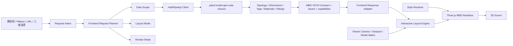

# MBD 三维交互标注 Oracle 架构评审与开发方案

## 评审来源

- Oracle MCP session: `mbd-3d-architectu-review`
- Oracle transcript: `C:\Users\dpc\.oracle\sessions\mbd-3d-architectu-review\artifacts\transcript.md`
- 评审日期: 2026-06-19
- 前端仓库: `D:\work\plant-code\plant3d-web`
- 后端仓库: `D:\work\plant-code\plant-model-gen-cata-closure`
- 参考实现: `D:\work\plant-code\rs-core\MBD`
- 首个真实测试 BRAN: `2013286704/476`

## 总结论

当前方向应保留: 普通三维页面中的模型树菜单、Ribbon 菜单、普通 `mbd_refno` URL 默认进入交互式 MBD 标注；只有显式 `drawing/sheet/reference` preset 才进入固定图纸模式。已经验证过的 `2013286704_476`、长度 `600/1073/783`、相机旋转后标注随投影变化、样式热更新这些能力都应作为回归基线保留。

但 `full/drawing/length` 不能继续作为系统内部唯一架构轴。它们只适合作为用户入口 preset。通用方案应升级为五轴契约:

1. `requestIntent`: 用户想做什么。
2. `dataScope`: 后端需要返回哪些语义数据。
3. `layoutMode`: 布局由后端语义、后端 hint、后端预排版还是固定图纸负责。
4. `renderMode`: 前端用交互三维、图纸固定、调试还是导出方式渲染。
5. `styleProfile`: 系统、项目、用户、会话级样式配置。

核心原则: 后端负责稳定、相机无关的管道语义和布局提示；前端负责实时、相机相关的投影、billboard、避让、LOD、样式和交互。

## 目标与非目标

### 目标

- 在普通三维交互页面显示真实 BRAN 的 MBD 尺寸标注。
- 标注由模型树右键菜单或 Ribbon 菜单开启，默认是交互式三维标注。
- 尺寸线、箭头、文字、材料球、坐标/标高、管件标签都绑定真实 3D 锚点。
- 视图旋转、缩放、平移时，标注保持正确锚点和可读性。
- 提供设置页面配置尺寸线、箭头、文字、引线、管道轮廓、管件强调、标签、避让和可见性。
- 使用真实后端和真实 BRAN 验证，不能只为 `2013286704/476` 写特殊规则。
- 从第一目标 BRAN 长度标注，演进到多 BRAN、多拓扑、多数据缺失场景。

### 非目标

- 第一阶段不追求完全复刻固定图纸中每一个标注位置。
- 第一阶段不实现正式工程图文件导出。
- 第一阶段不要求全部 AVEVA/E3D 元件族一次性覆盖。
- 不让后端负责交互相机下的最终屏幕排版。
- 不把 `full` 做成 `drawing` 的更多内容版。
- 不一次性大重写 `ViewerPanel.vue` 和 `useMbdPipeAnnotationThree.ts`。

## 需求与 Edge Cases

### 入口与请求

| 场景 | 风险 | 方案 |
| --- | --- | --- |
| 模型树右键 BRAN | 正常路径 | 发送 `requestIntent=interactive_annotation` |
| Ribbon 生成标注 | 当前选择不一定是 BRAN | 优先使用当前选中 refno，缺失时 toast 提示选择 BRAN |
| URL `mbd_refno=2013286704_476` | 误进固定图纸模式 | 默认进入交互三维模式 |
| URL `mbd_preset=drawing` | 用户需要固定图纸参考 | 显式进入 `sheet_fixed` |
| URL `mbd_preset=length` | 用户只看长度 | `dataScope.lengths` 全开，语义数据按最小集 |
| refno 是 `2013286704/476` | API、文件名和 URL 不一致 | 统一归一化为稳定 key，同时保留原始 refno |
| refno 是子元件 | 用户期望标注所属 BRAN | 阶段一提示选择 BRAN；阶段二后端 owner resolve |
| 多次快速点击 | 旧请求覆盖新请求 | `requestGate` 只允许最新请求提交渲染 |
| 清空标注时请求仍在飞 | 旧响应重新显示 | abort 或 token 校验，过期响应丢弃 |

### 后端数据

| 场景 | 风险 | 方案 |
| --- | --- | --- |
| 后端不可用 | 页面卡死或静默失败 | 前端 toast + debug log，保留模型显示 |
| V2 API 失败 | 标注完全不可用 | 尝试 V1 fallback，记录 issue |
| `layout_result` 缺失 | full 模式不应失败 | 交互三维退回 `semantic_only` |
| material/tag 缺失 | 完整 MBD 内容不全 | 返回 warning issue，已知数据继续渲染 |
| segments 缺失 | 长度无法渲染 | fatal 或 degraded，取决于是否还有 V2 primitives |
| 单位不一致 | 长度数值错误 | DTO 明确单位，前端 adapter 做单位转换和断言 |
| 矩阵不一致 | 标注漂离模型 | 响应带坐标系信息，前端统一走 Viewer transform |
| 后端只支持某些 noun | 非 BRAN 点击失败 | 返回 `unsupported_noun` issue |

### 拓扑与几何

| 场景 | 风险 | 方案 |
| --- | --- | --- |
| 直管 | 标注重叠模型 | 使用外偏移和屏幕避让 |
| 折线 | 链长和分段长混淆 | 后端返回拓扑边和 chain 语义 |
| U 型 | 两侧尺寸互相穿插 | 前端按相机投影选择外侧候选槽位 |
| 垂直/斜管 | 屏幕投影短线不可读 | 使用最小屏幕长度和 leader fallback |
| 支管/TEE/OLET | 主链和支链关系不清 | 后端返回 branch graph 和 role |
| 管件密集 | 标签拥挤 | LOD、优先级、避让、折叠 |
| 弯头与短管混合 | 尺寸锚点不稳定 | 后端给端点、中心线、管件连接点 |
| 重合/近重合锚点 | 文本抖动 | 合并候选、最小间距、稳定排序 |

### 交互渲染

| 场景 | 风险 | 方案 |
| --- | --- | --- |
| 相机旋转 | 文字反向或漂移 | 文本 billboard，线段保持 world anchor |
| 相机缩放 | 箭头过大或过小 | 以像素目标换算 world size |
| 视口变化 | 文本跑出屏幕 | rAF 节流重算屏幕布局 |
| 透视遮挡 | 标注压在模型内部 | depth policy 可配置，默认标注优先可读 |
| DPI 改变 | 线宽不一致 | 所有屏幕尺寸乘 `devicePixelRatio` |
| 大量标注 | Three 对象过多 | 对象池、批量线段、文本 atlas |
| 标注调试开启 | 生产性能下降 | 只在 debug URL 或 dev 环境生成 snapshot |

### 样式与配置

| 场景 | 风险 | 方案 |
| --- | --- | --- |
| localStorage 损坏 | 设置页面报错 | sanitize 后回默认值 |
| 项目级默认样式 | 多项目要求不同 | 系统默认 < 项目 < 用户 < 会话 |
| 修改颜色后无变化 | 用户误以为失败 | style version 触发当前标注热更新 |
| visibility 和 style 混在一起 | 配置难维护 | 拆分 `StyleProfile` 与 `VisibilityProfile` |
| drawing 和 interactive 共用样式 | 命名误导 | 重命名为 `MbdAnnotationStyleProfile` |

## 推荐架构



### 五轴模型

```ts
type MbdRequestIntent =
  | 'interactive_annotation'
  | 'length_focus'
  | 'drawing_reference'
  | 'inspection'
  | 'batch_export';

type MbdLayoutMode =
  | 'semantic_only'
  | 'backend_hints'
  | 'backend_prelaid'
  | 'sheet_fixed';

type MbdRenderMode =
  | 'interactive_3d'
  | 'drawing_sheet'
  | 'debug_overlay'
  | 'offscreen_export';
```

兼容层继续接受:

```ts
type MbdPipeAnnotationDisplayMode = 'full' | 'drawing' | 'length';
```

映射关系:

| displayMode | requestIntent | layoutMode | renderMode |
| --- | --- | --- | --- |
| `full` | `interactive_annotation` | `backend_hints` 优先，缺失退 `semantic_only` | `interactive_3d` |
| `length` | `length_focus` | `backend_hints` 优先，缺失退 `semantic_only` | `interactive_3d` |
| `drawing` | `drawing_reference` | `sheet_fixed` 或 `backend_prelaid` | `drawing_sheet` |

### 后端职责

后端负责稳定且与相机无关的数据:

- refno 归一化、owner BRAN resolve、noun 支持判断。
- 数据源一致性: parquet、Surreal、cache、layout_result、元件库路径。
- 管道拓扑: centerline、segments、connections、branch graph、fitting graph。
- 尺寸语义: segment length、chain length、overall length、port distance、cut tubi。
- 标签语义: branch label、position tags、elevation marks、PE、坐标。
- 材料语义: material balloons、material table、item code、quantity。
- 管件语义: elbow、tee、olet、flange、valve、weld、bend。
- layout hints: 推荐外侧、优先级、锚点 role、可选 sheet layout。
- 标准 issue/capability 返回，不因局部缺失让 full 模式失败。

### 前端职责

前端负责实时且与相机相关的行为:

- 请求编排、latest-only、AbortController、toast 和 debug。
- 模型预加载、模型聚焦、坐标系/矩阵适配。
- DTO adapter: V2/V1/V3 统一成 render model。
- 3D 锚点到屏幕投影。
- 文本 billboard、箭头像素尺寸换算。
- 屏幕避让、候选槽位、文本碰撞、leader fallback。
- LOD、可见性过滤、对象池、生命周期 dispose。
- 样式解析、项目/用户/会话覆盖、热更新。
- debug snapshot 和 E2E 可观测状态。

## 文件结构建议

### 前端

```text
src/composables/mbd/
  useMbdAnnotationController.ts       # Viewer 侧 MBD 编排 facade
  mbdPresetMapper.ts                  # full/drawing/length -> 五轴请求
  mbdApiParamBuilder.ts               # 五轴请求 -> API query
  mbdRequestGate.ts                   # latest-only / abort / race guard
  mbdModelPreloader.ts                # showModelByRefno / flyTo 策略
  mbdResponseAdapter.ts               # V1/V2/V3 DTO -> render model
  mbdDebugSnapshot.ts                 # debug snapshot 输出
  mbdAnnotationStyleProfile.ts        # 新样式模型
  mbdAnnotationVisibilityProfile.ts   # 可见性模型

src/viewer/mbd/
  MbdThreeSceneController.ts          # renderer 生命周期总控
  MbdProjectionService.ts             # world -> screen / screen -> world
  MbdScreenAvoidance.ts               # 屏幕避让和候选槽
  MbdLodPolicy.ts                     # LOD 和 priority
  MbdAnnotationObjectPool.ts          # 对象池
  DimensionRenderer.ts                # 尺寸线、箭头、文字
  LabelRenderer.ts                    # 坐标、PE、branch label
  LeaderRenderer.ts                   # 引线
  PipeEmphasisRenderer.ts             # 管道轮廓和视觉增强
  FittingEmphasisRenderer.ts          # 管件强调

src/api/
  mbdPipeApi.ts                       # 保留 API client，增加 V3/issue 类型

src/components/tools/
  MbdAnnotationStylePanel.vue         # 设置页，扩展为 style + visibility tabs

e2e/fixtures/
  mbd-branch-corpus.json              # 多 BRAN 真实样本库
```

短期不强制搬迁 `useMbdPipeAnnotationThree.ts` 的全部代码。先用 facade 把请求、DTO、样式、投影等新边界包起来，再逐步把 renderer 子模块抽出。

### 后端

```text
src/web_api/mbd/
  mod.rs
  routes.rs
  contract/
    query.rs
    dto_v1.rs
    dto_v2.rs
    dto_v3.rs
    issues.rs
  service/
    pipe_annotation_service.rs
    export_service.rs
  repository/
    surreal_repo.rs
    parquet_repo.rs
    cache_repo.rs
  domain/
    topology.rs
    dimensions.rs
    materials.rs
    tags.rs
    fittings.rs
    layout_hints.rs
  adapter/
    rs_core_v2.rs
    v1_compat.rs
  tests/
    golden/
```

`mbd_pipe_api.rs` 保留 public route 和兼容入口，但内部逐步委托到 `service`、`domain`、`adapter`。不要一次性搬完，优先拆无行为变化的 DTO、query resolve、issue/capability。

## 数据契约与错误处理

推荐响应增加标准 issues 和 capabilities:

```ts
type MbdIssueSeverity = 'fatal' | 'degraded' | 'warning' | 'info';

type MbdIssue = {
  severity: MbdIssueSeverity;
  category:
    | 'request'
    | 'data_source'
    | 'topology'
    | 'layout'
    | 'render_hint'
    | 'unit'
    | 'transform'
    | 'compat';
  message: string;
  refno?: string;
  primitiveId?: string;
  recoverable: boolean;
};

type MbdCapabilities = {
  hasLayoutResult: boolean;
  hasSemanticTopology: boolean;
  hasMaterialData: boolean;
  hasTags: boolean;
  supportsInteractive3d: boolean;
  supportsDrawingSheet: boolean;
};
```

处理规则:

- `fatal`: 不能构建任何可靠标注，toast 错误，停止渲染。
- `degraded`: 可以显示核心长度或部分标签，toast warning，继续渲染。
- `warning`: 控制台和 debug panel 记录，用户不一定需要打断。
- `info`: 仅 debug。

对于交互式 `full`，缺 `layout_result` 不是 fatal。后端应返回 `success=true`、`layoutMode='semantic_only'` 或 warning issue，前端用语义 fallback 渲染。

## 样式与设置页

样式体系拆分:

- `MbdAnnotationStyleProfile`: 颜色、线宽、透明度、箭头尺寸、字体、轮廓强度。
- `MbdAnnotationVisibilityProfile`: 哪些标注类型显示。
- `MbdAnnotationLayoutProfile`: 避让、LOD、最小间距、leader 策略。

配置来源优先级:

```text
system default < project default < user preference < session override
```

设置页建议 tabs:

1. 尺寸线: 颜色、线宽、透明度、延伸线、链长/总长样式。
2. 箭头: 大小、角度、填充、屏幕像素锁定。
3. 文字/标签: 字号、颜色、背景、billboard、遮挡策略。
4. 引线: 颜色、线宽、折线、端点。
5. 管道轮廓: 主体、边线、band、rail、outline。
6. 管件强调: 弯头、法兰、阀门、焊缝、端口。
7. 避让与 LOD: 最小间距、优先级、缩放阈值。
8. 可见性: 长度、坐标、PE、材料、焊缝、管件标签。

## 测试与验证矩阵

### BRAN 语料库

创建 `e2e/fixtures/mbd-branch-corpus.json`:

```json
[
  {
    "refno": "2013286704_476",
    "project": "aps250160-mbd-cata2",
    "topology": "branch_with_valve_or_fitting",
    "expectedTexts": ["600", "1073", "783"]
  },
  {
    "refno": "2013286704_497",
    "project": "aps250160-mbd-multibran",
    "topology": "branch_stub",
    "expectedTexts": []
  },
  {
    "refno": "2013286704_508",
    "project": "aps250160-mbd-multibran",
    "topology": "dense_material_or_tags",
    "expectedTexts": []
  },
  {
    "refno": "2013286704_488",
    "project": "aps250160-mbd-multibran",
    "topology": "alternate_route",
    "expectedTexts": []
  }
]
```

`expectedTexts` 先填已知稳定值，未知样本先做“非空标注 + 无 fatal + 相机旋转后锚点移动”的验收，再逐步补 golden。

### 前端单元测试

- URL preset: `full/drawing/length` 映射正确。
- preset mapper: 三种兼容模式展开为五轴请求。
- API param builder: full 请求完整语义，length 请求核心长度，drawing 请求 sheet。
- response adapter: V1/V2/V3 缺字段、单位、issues 兼容。
- style resolver: 默认、项目、用户、会话覆盖和 sanitize。
- projection/layout: billboard、最小屏幕尺寸、候选槽位、碰撞处理。
- renderer lifecycle: clear、dispose、style version hot update。

### 后端单元/契约测试

- refno resolve: slash/underscore/owner resolve。
- query defaults: interactive、length、drawing 的默认 scope。
- topology builder: straight、polyline、U、branch、dense fittings。
- dimension semantics: segment、chain、overall、port、cut tubi。
- missing data: layout/material/tag 缺失时 issues 正确。
- V2/V3 adapter golden: 固定输入得到稳定 primitives。
- 与 rs-core 对齐: BRAN 长度规则、坐标/PE 标签、材料编号语义。

### E2E

- Ribbon 打开三维 MBD 标注。
- 模型树真实 BRAN 右键生成 MBD 标注。
- 设置页修改样式，当前标注热更新。
- 快速切换 BRAN，旧请求不覆盖新请求。
- 后端不可用，页面有明确 toast 且不崩。
- 缺 `layout_result`，full 模式仍显示 semantic fallback。
- 多 BRAN corpus 批量 smoke。
- drawing preset 仍进入固定图纸，不被 full 改坏。
- length preset 只显示核心长度，不显示过多噪声。

## 性能与可维护性

- API 请求使用 latest-only、AbortController、cache key、可选 ETag/gzip。
- 大 BRAN 或多 BRAN 场景使用对象池和批量线段。
- 文本使用 atlas 或缓存，避免每帧重建几何。
- 相机变化时只在 rAF 中重算屏幕布局。
- 避让使用屏幕 occupancy grid，避免 O(n²) 在密集标签下失控。
- LOD 根据屏幕长度、相机距离、用户 zoom、标注 priority 隐藏低价值标签。
- debug snapshot 只在显式 debug 下启用。
- 后端 route 变薄，domain/service/repository 分层，便于单元测试和 rs-core 对齐。

## 分阶段开发计划

### Phase 0: 冻结当前可用路径

交付:

- 保存 `2013286704_476` 的 API response、debug snapshot、截图和 E2E 日志。
- 记录当前已验证的 `600/1073/783` 基线。
- 把 Oracle 评审方案纳入项目文档。

验收:

- 当前 `full` 菜单路径不退化。
- drawing preset 不退化。

### Phase 1: 请求五轴模型兼容层

交付:

- 新增 `mbdPresetMapper.ts`。
- 保留 `displayMode`，内部转换为五轴请求。
- 新增 `mbdApiParamBuilder.ts`。
- 扩展 URL preset 单元测试。

验收:

- 模型树/Ribbon 默认 interactive。
- 显式 drawing 仍固定图纸。
- length 只开核心长度。

### Phase 2: Viewer 编排抽出

交付:

- 新增 `useMbdAnnotationController.ts`。
- 新增 `mbdRequestGate.ts`，统一 latest-only 和 abort。
- 新增 `mbdModelPreloader.ts`。
- ViewerPanel 只保留 watcher glue code。

验收:

- 快速点击不会旧响应覆盖新响应。
- 模型预加载失败可降级。
- toast 和 debug issue 清晰。

### Phase 3: 响应契约和 adapter

交付:

- 前端新增 `MbdIssue`、`MbdCapabilities` 类型。
- 新增 `mbdResponseAdapter.ts`。
- 后端先在现有 route 中追加兼容字段。
- 缺 layout/material/tag 不让 full 失败。

验收:

- `layout_result` 缺失时仍显示核心长度。
- V1/V2 fallback 行为有测试。

### Phase 4: 交互三维 renderer 拆分

交付:

- 抽出 projection、avoidance、LOD、dimension、label、leader、emphasis renderer。
- `useMbdPipeAnnotationThree.ts` 变为 facade。
- 引入对象池和 dispose 统一管理。

验收:

- 相机旋转和缩放后锚点正确。
- 文本可读，箭头尺度稳定。
- 多 BRAN corpus smoke 不出现明显漂移。

### Phase 5: 样式配置升级

交付:

- `mbdDrawingStyleProfile.ts` 迁移到 `mbdAnnotationStyleProfile.ts`。
- 新增 visibility/layout profile。
- 设置页 tab 化。
- 项目级、用户级、会话级覆盖。
- 旧 localStorage 自动迁移。

验收:

- 旧用户配置不丢。
- 修改样式当前标注热更新。
- visibility 不影响 style sanitize。

### Phase 6: 后端架构拆分

交付:

- `mbd_pipe_api.rs` 保留 route，拆出 query/DTO/issues。
- 新建 service/repository/domain/adapter 目录。
- 将 BRAN 尺寸、材料、标签、拓扑逐步与 rs-core 对齐。
- 建立 golden tests。

验收:

- API 响应与旧版兼容。
- issue/capability 覆盖缺数据场景。
- rs-core 参考算法差异有记录。

### Phase 7: 多 BRAN 泛化

交付:

- `mbd-branch-corpus.json`。
- 批量 E2E smoke。
- 多拓扑 golden 和截图报告。
- 调整避让、LOD、标签优先级。

验收:

- 至少覆盖直管、折线、U 型、支管、管件密集、缺 layout_result、缺 material/tag。
- 不为单个 refno 写特殊规则。

## 当前方案保留/重构/禁止清单

### 保留

- 菜单/Ribbon 默认 `full` 交互三维标注。
- 显式 drawing preset 才走固定图纸。
- V2 优先、V1 兼容。
- `showInlineTubeLengthDims` 和 `showPipeVisualEmphasis` 的解耦。
- 真实 BRAN Playwright 验证链路。
- 样式面板热更新能力。

### 重构

- `displayMode` 内部改为五轴模型。
- ViewerPanel 请求编排抽出。
- `useMbdPipeAnnotationThree.ts` 渲染子模块渐进拆分。
- 样式模型从 drawing 命名升级为 annotation。
- 后端 `mbd_pipe_api.rs` 变薄，拆 service/domain/repository/adapter。

### 禁止

- 禁止让菜单默认打开 drawing 固定视角。
- 禁止用截图或 overlay 假装三维标注。
- 禁止把相机相关屏幕排版放到后端。
- 禁止为了 `2013286704/476` 写 refno 特判。
- 禁止一次性大重写导致已验证路径失稳。

## Review 总结

最佳方案不是把现有成果推倒重来，而是在已经跑通的真实 BRAN 交互标注上补齐架构边界: 用五轴请求模型替代单一 `displayMode`，让后端专注语义和 hint，让前端专注相机投影和渲染，把 Viewer 编排、响应 adapter、样式配置、renderer 生命周期分别拆出。这样既能保住当前 `2013286704_476` 的可用路径，又能向多 BRAN、多拓扑、缺数据、样式可配置和后端 rs-core 对齐演进。
