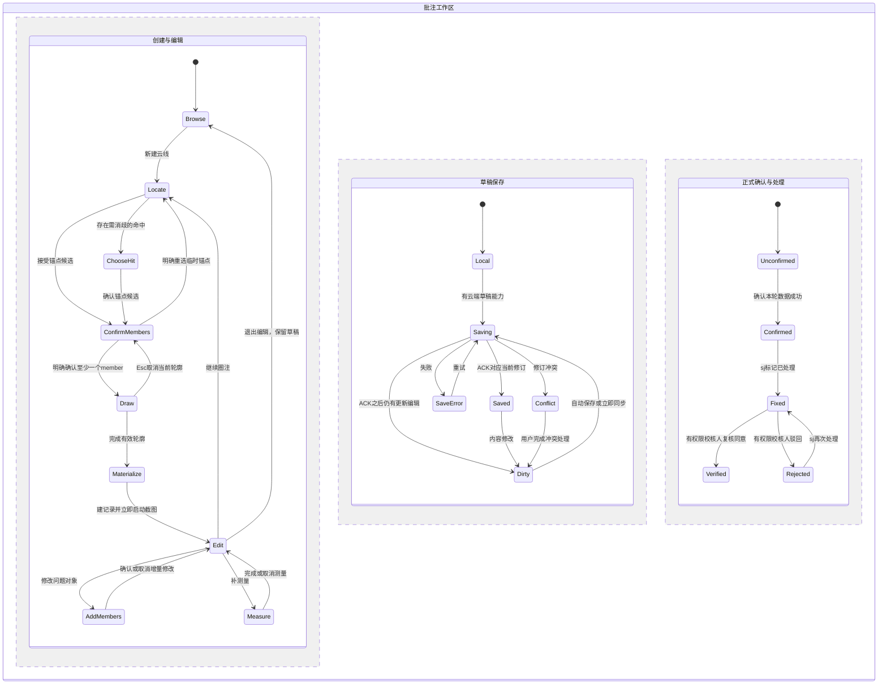

# 三维批注交互改进方案（2026-09-14）

> 状态：**待产品拍板**（§9 列出 10 个拍板项；未拍板前不动代码）。
> 评审来源：oracle CLI 0.20.0 浏览器模式，ChatGPT 模型标签 `Latest`（= GPT-6）+ 思考档 `Pro`，会话 `review-3d-annotation-ux`（21 分钟，↑20.29k ↓12.47k tokens）。
> 评审原文：`2026-09-14-3d-annotation-interaction-redesign/oracle-transcript-gpt6-pro.md`；送审简报：同目录 `oracle-brief-current-state.md`。
> 本文 = 评审结论 × 接手会话对源码的核对（§2.3）。凡标 **[核对]** 的是本会话在源码里查过的事实；标 **[评审]** 的是 GPT-6 Pro 的判断；标 **[采纳/调整/后置]** 是本文口径。

## 0. 一句话结论

**把三维批注的主交互收敛为「一个问题工作台 + 一个视口上下文条」；云线创建改为「锚点先行 → 关联建议显式确认 → 再圈范围」；草稿自动落本机（后续落云端），但保留显式「确认本轮数据」；浏览与处理围绕同一条「当前问题」连续进行（上一条 / 下一条、三端同步选中）。**

三条不能混的边界 [评审，采纳]：

1. **锚点先行 ≠ 锚定即关联**。命中构件先是锚点候选；系统可以推荐它或所属 BRAN 作问题对象，但要经确认才进 `bindings` 的 `member`。
2. **草稿已保存 ≠ 数据已确认 ≠ 问题已处理**。三个维度分开显示，不压进一个 status。
3. **自适应投影包络 ≠ 真实可见轮廓**。ADR-0050「渲染只读坐标快照」下前者可先做，后者另设能力与性能门槛。

评审明确**不建议**：优先投入真实可见轮廓提取；把「确认当前数据」改成后台自动调用（会把未完成的说明、误选目标、未完成截图提前变成正式校审证据）。

## 1. 范围与不变量

- 对象：`plant3d-web` 校审域的四类批注（text / cloud / rect / obb）从创建、编辑、浏览到 sj 处理、jd/sh 复核的全部交互；PMS iframe 嵌入与独立站点两种宿主。
- 不动：渲染引擎（DTX + MeshLine + HTML overlay）、四节点流程 `sj→jd→sh→pz`、ADR-0049～0053、记录 schema 只增不改、localStorage 容器 V6、payload superset、三条恢复链路（task_records / workflow_sync / import_package）、`useDtxTools.ts` 与 `ViewerPanel.vue` 不一次性重写。
- 桌面鼠标键盘为主；**触屏不在本轮**，窄 iframe 在本轮。

## 2. 现状评估

### 2.1 十个摩擦点的独立判断 [评审]（用户代价 C × 出现频率 F，各 1–5；频率是工作假设，非埋点）

| 序 | 摩擦点（简报编号） | 成立？ | 要点 | 优先级 |
|---|---|---|---|---|
| 1 | 草稿 / 已保存 / 已确认不清、可能串任务（#5） | 部分成立，后果最重 | 确认后有时间与数量回显，不是「完全不可见」；缺口是**逐条修订是否到服务器、是否进本轮确认、异步结果归属哪个任务** | **25，P0** |
| 2 | 密集管线拾取、框选误关联（#4） | 成立 | 问题不是 Tab，是候选不可解释 + 框选含背景；Tab 保留为熟练加速键 | **20，P1** |
| 3 | 四入口、多面板重复（#2） | 成立于信息架构 | 错在它们各持一份「当前批注」与编辑草稿；先统一命令与编辑会话，不是先删组件 | **20，P1** |
| 4 | 创建步骤多、先选目标不自然（#1） | 部分成立，被高估 | 已有选择集时「从当前选择创建」是合理专家路径；难点在「只是看到问题、尚未选对象」 | **15，P1** |
| 5 | 缺连贯导航（#7） | 缺口成立，「表格双击是唯一导航」不成立 | 缺的是固定筛选队列里的上一条 / 下一条、当前项强调、证据视角恢复、三端同步 | **15，P1** |
| 6 | 模式多、切换即清空（#8） | 成立于状态设计 | 保留单一 pointer 仲裁，加「子工具借用」与安全暂停，不再造事件系统 | **12，P1** |
| 7 | 固定像素云线 / 大 AABB 都不理想（#3） | 成立，但不是都该改自动包络 | 手工圈线表达「这里这一处」，自动包住整条 BRAN 反而放大范围；区分**原视角圈注**与**目标范围提示** | 9，P2 |
| 8 | 无触屏、小视口（#9） | 窄 iframe 成立；触屏不是本期缺陷 | 解决 iframe 宽高变化、侧栏挤压、工具卡越界、输入区被遮 | 9，P1 顺手落地 |
| 9 | overlay 卡片遮挡、截图不含卡片（#10） | 密度风险成立；「用 DOM」「不进截图」不是缺陷 | 后者是 ADR-0052 的选择，不以 UX 名义推翻 | 9，P2 |
| 10 | 创建瞬间自动截图不合适（#6） | 主要被高估 | 创建瞬间保留了发现问题的上下文（ADR-0053 理由）；改善预览、失败反馈、重拍，不取消自动拍 | 6，P2 |

> **最该先改的不是「三步变两步」，而是让用户始终知道：我正在改哪一条、它属于哪张单、改动到了哪里、当前关联到底是什么。**

### 2.2 简报没提到的问题 [评审]

| 补充问题 | 用户后果 | 建议落点 |
|---|---|---|
| 修改目标会清掉已选好的锚点（操作说明如此） | 补选一个阀门被迫重找锚点 | 新状态机里改 `pendingTargets` 只使「目标确认」失效，**不清有效锚点** |
| 「定位问题对象」与「回到证据视角」混为一个动作 | 能找到阀门，却看不到原问题；窄 iframe 尤甚 | `AnnotationInlineDetailCard.vue` 拆成「回证据视角」「定位目标」两个命令；增量保存视角快照 |
| BRAN 关联与子元素反查语义可能不一致 | 对整条分支提了问题，点其中阀门却以为没批注 | 反查分「直接关联 / 上级 BRAN 关联」，不静默改写 `bindings` |
| 当前选择集可能混入批注导航产生的高亮 | 从上一条导航过来后一键创建沿用了上一条目标 | 交互层区分 `user-model` / `annotation-navigation` / `candidate-preview` 三种选择来源 |
| 截图、加载、高亮、保存都可能晚于切任务完成 | 旧任务异步结果覆盖新任务 | 所有结果发布同时校验 `scopeEpoch` + 操作修订号 |
| 几何失效与业务处理状态互相污染 | 「构件 missing」被读成「问题已解决」 | 状态徽标分栏；复核只看本轮有效处理事件 |
| 只增字段不自动保证旧写端再保存不丢字段 | 新增视角 / 呈现快照被旧端编辑后丢失 | 四类 × 三链路 round-trip 测试 |

### 2.3 材料冲突与源码核对 [核对]

| 冲突 / 疑点 | 本文口径与源码事实 |
|---|---|
| 07-28 方案 Phase 2 与 PATCH 草案有 `rebindAnchor`；ADR-0051 禁止 | **以 ADR-0051 为准**，不提供换锚点入口，不接受该写操作 |
| 严重度是三级还是四级 | 源码 `types/auth.ts:41` 是三级 `principle / general / drawing`（× / △ / ○）；07-28 方案里的「致命 / 严重 / 一般 / 建议」是旧稿。历史不认识的值原样保留并显示「历史类型」 |
| ADR-0049「四类统一为带角色绑定」是否已实现 | 评审时**只有 cloud 有 `bindings`**；text 仍是 `refno` + `refnos`，rect / obb 只有 `refnos`。**2026-09-14 用户拍板「其他批注也需要 bindings」，已随本方案同日落地**（plant3d-web 提交见 §8 第 1 条）：text 由 `refno`（点击命中构件）推导 anchor + member 双角色、其余 `refnos` 为 member；rect / obb 由 `refnos`（兜底 `objectIds`）推导 member、不推导 anchor；`deriveAnnotationBindings / getAnnotationMemberRefnos / addAnnotationMembers / removeAnnotationMember / findAnnotationsByMemberRefnosAcrossTypes` 四类通用；详情卡「关联元素」区块与视口「当前模型关联批注」反查覆盖四类 |
| ADR-0050「批量重解析 + stale 降级」是否已实现 | 评审时 `src` 中**没有**任何运行实现（只在无关测试里出现字面量）。**2026-09-14 同日落地最小运行时解析**（见 §8 第 1 条）：纯函数 `review/domain/bindingResolve.ts` 四态 `resolved / unloaded / missing / stale`，运行时 `composables/useAnnotationBindingResolve.ts` 在模型加载 / 版本切换（`useDbnoInstancesDtxLoader` 的 `dtxLoaderRevision`）后批量重算、定位回执 `fail` 记权威 missing；详情卡逐绑定徽标降级，missing 只能移除不可定位。结果**只在内存**，`resolveDetailsV1` 持久化仍归后续 |
| ADR-0051 的技术理由「几何签名参与 `annotationKey`」 | `review/domain/annotationKey.ts` 的 v1 = sha1(type, taskId, geometry 签名, content)，其中 cloud 取 `points`、text 取 anchor、rect/obb 取 center+size；**`computeAnnotationKeyV1` 当前没有运行时调用方**，评论线程按 `${type}:${annotationId}@formId#taskId` 归并（`commentThread.ts`）。结论：约束仍按 ADR 执行；新增呈现 / 视角字段**不会**进键（键只吃几何签名与 content）；提醒未来接线者：`content` 参与键会让改描述改键，接线前先定夺 |
| 批注是否保存了相机 / 视角 | `useToolStore.ts` / `types/auth.ts` / `review/` **没有**任何 viewpoint / camera 字段；「回证据视角」必须新增 `viewpointV1`（§6） |
| 拖框完成即创建，还是要再点「保存批注」 | 源码 `useDtxTools.ts:4557–4580` + `endMarquee`：**松开鼠标即 `addCloudAnnotation`**，随后浮层提示去「待保存证据」确认；PMS 操作说明（07-31）里的「点击保存批注」已过时 → U2 顺手改说明 |
| 四个入口是否都受同一闸门 | `canDrawCloudAnnotation()` / `notifyCloudGateBlocked()` 集中在工具层（`useDtxTools.ts:3053–3082`），入口不自校验 → 保留这一层次 |

## 3. 目标交互模型

### 3.1 以「问题」为中心，不新建问题实体 [评审，采纳]

界面统称「问题」，底层仍是四类记录、`AnyAnnotationRecord`、评论线程、`reviewState` 与快照链路。四种创建方式收敛成一个主按钮 **「新建问题 ▾：云线 / 文字图钉 / 对象框 / 选择集框」**；默认项记当前会话的工具偏好，不继承上一条问题的关联、描述、处理状态。四类之间不做「切换外观」的伪无损转换。

落点：`AnnotationWorkspace.vue` = 问题工作台；`AnnotationInlineDetailCard.vue` = 公共详情；各旧入口只发统一创建命令。

### 3.2 云线创建：锚点先行，保留专家路径 [评审，采纳]

默认路径（看到问题时直接开始）：

| 用户动作 | 系统反馈与写入边界 |
|---|---|
| ① 新建问题 → 云线 | 进入 `locating`，状态条「点击问题附近的模型表面」；**不自动读历史全局选择集** |
| ② 单击阀门表面 | 暂存锚点候选；小型确认条：`锚点：VALV …` · `建议问题对象：此元件` · `改为所属 BRAN` · `仅作为锚点`。此时还不是正式批注 |
| ③ Enter / 点「使用这 1 个目标并圈定」 | 显式确认 member；同一 refno 兼任锚点与目标时写两种角色，关联数只算 member |
| ④ 拖动圈范围 | 只改待创建的 `screenOffset / cloudSize`，**不把框内其它对象加入 member** |
| ⑤ 松手 | 满足「≥1 已确认 member + 有效锚点 + 当前任务权限」才**恰好创建一条** store 记录；锚点从此冻结；立即启动既有 WebGL 自动截图 |
| ⑥ 填错误类型与说明 | 编辑器显示「本机草稿 / 正在同步 / 云端草稿」；不再要求另找一处「保存批注」 |
| ⑦ 「继续圈注」 | 新开干净创建会话；上一条说明保留，目标与锚点不继承 |
| ⑧ 「确认本轮数据」 | 核对当前修订，沿 `/api/review/records` 确认；不自动送审、不切 PMS 节点 |

- 第一期**不**把「拖框开始」隐含当成「接受候选」；显式 Enter 是低成本确认。以后可作独立开关试验「拖框即采用建议目标」。
- 专家路径：模型树 / 视口明确选好 → **「从当前选择创建问题」**（独立命名的命令）→ 点锚点 → 圈范围；不再弹同义确认。两条命令不能按选择集是否非空暗中切换。
- 锚点在梁柱、问题在管线：点梁柱 → 「仅作为锚点」→ 点选管线 / 导入选择集 → 确认 member → 圈定（保留 07-28 方案允许的锚点 / 目标解耦）。
- 工具层接线（只加不拆）：① `useDtxTools.ts` 云线单击分支在新模式下允许先生成**临时锚点候选**、不调 `addCloudAnnotation`；② `beginMarquee` 继续统一校验「已确认 member 非空 + 锚点有效 + scope 未变」；③ `createCloudAnnotationRecordFromAnchorAndMarquee` 前加统一 `canMaterializeCloud()`；④ `cancelCloudCreation()` 只作「彻底结束本次创建」，子工具返回不再滥用；⑤ 改临时目标保留有效锚点。

### 3.3 拾取与消歧 [评审，采纳；「仅可见」后置]

- **点选**：光标旁小环形计数 `1/4` + 数行候选列表 `noun · refno · 所属 BRAN · 前方/后方/可见性未知`；悬停候选只做临时轮廓预览；Tab / Shift+Tab 轮换、Enter 确认、鼠标可直点；一次消歧内候选顺序固定，相机或指针实质变化才重算。复用 `DTXSelectionController` 的 Tab 候选来源，加薄适配层；**不假定它已提供完整深度命中或可见像素查询**。新增 `src/review/domain/annotationPickCandidates.ts`（去重 / 排序 / 层级转换纯函数）+ `src/components/review/AnnotationPickCandidates.vue`。
- **预览与正式选择分离**：`SelectionOrigin = 'user-model' | 'annotation-navigation' | 'candidate-preview'`；`candidate-preview` 不触发「当前模型关联批注」反查、不作「使用当前选择」输入；`annotation-navigation` 不被下一次创建静默导入。初期不重构全局 selection store，在批注命令适配层记来源、预览走临时高亮通道；候选悬停**不要**调用带永久选择 + 飞行副作用的 `highlightAnnotationTargets`。
- **层级**：保留 `CloudTargetLevel = 'element' | 'branch'` 两档，显示改成「问题对象：当前元件 VALV … / 所属分支 BRAN …」；锚点始终是实际点击的表面点与构件；没有可靠父链就显示「暂无法取得所属 BRAN」，不按名字猜。
- **框选**：列表标题改成「**投影范围候选：18 项，可能包含遮挡对象**」；已明确选择的继续勾选，**新收集的背景候选不默认全勾**；提供「全部选择」与 noun 分组，由用户主动执行。这有意调整 07-28 方案「默认全勾 + Enter」的决定（附录决策 #3）——密集管线下错误关联的代价高于少按一次全选。**只有运行测试证实可见性计算正确后，才出现「仅可见对象」**；候选只覆盖已加载对象时须标「仅检查已加载模型」。
- **深度剥离后置**：临时透视 / 剥离若做，须不改持久 `visible` 与材质、Esc / 切任务 / 完成时恢复、不污染自动截图、不把透视后看见的对象自动加 member。

### 3.4 云线几何：两种原语义保留，新增快照驱动的投影包络 [评审，采纳；U4]

| 模式 | 适用 | 推荐表现 | 不应宣称 |
|---|---|---|---|
| 现有 `screen2d` | 圈某视角中的局部问题 | 保留手绘范围；提供「回原圈注视角」；明显偏离原视角时突出图钉与目标，原圈线弱化并标「原视角圈注」 | 换任意相机后仍准确包住目标 |
| 现有 `bbox3d` | 强调一组对象的整体空间范围 | 保留三维范围框 | 合并 AABB = 对象外形 |
| **新增 投影包络** | 随相机变化提示关联目标范围 | 对保存的目标几何范围快照做投影再加留白；多个相离区域允许多轮廓共用一个编号 | 「真实可见轮廓」 |
| 实验 真实可见轮廓 | 贴合表面且遮挡语义严格 | 仅在具备版本固定几何快照 / 渲染代理、可靠深度语义与性能证据后试验 | 用 AABB 投影或单点深度测试冒充 |

- 与 ADR-0050 兼容：新增可选 `presentationV1`（目标范围坐标快照 + 坐标系 / 模型快照标识 + member 集合摘要 + 留白与算法版本）；渲染只接 `projectCloudEnvelope(geometrySnapshot, camera, viewport)`，不每帧解析 refno、不访问后端、不悄悄重定位锚点；模型版本变化由批量解析给 `stale` 标识，旧快照仍显示；**自动重解析不得自动改写历史证据**。
- 包络规则（新 `annotationProjection.ts`）：先裁近裁剪面再投影；相距远的目标不求总凸包、允许分离轮廓；BRAN 只有总 AABB 时注明「分支范围近似」；振幅 / 留白 / 线宽按 CSS 像素并区分 drawing-buffer 像素；相机运动中用简化框、停止后精化（迟滞参数是设计值）；轮廓巨大 / 目标离屏 / 在相机后方时退到图钉 + 边缘方向提示。`screenOffset / cloudSize / selectionBbox` 保留为回退。
- 遮挡：当前问题即使锚点被遮也保留可发现徽标（空心 / 虚线 + 「被遮挡」）；非当前问题可按显示策略隐藏或聚合，列表数量不变；深度只作显示提示，不改 `bindings` / `resolve`。
- 大量批注：当前问题完整展示 → 悬停临时展示 → 其它只图钉 → 密集图钉聚合。默认只展开一张当前问题卡；聚合按屏幕接近度生成、点击列成员或放大；`visible / collapsed` 是记录 / 用户状态，LOD 是运行时决策，**不能为省性能批量写 `visible=false`**。轮廓色仍归 `useAnnotationStyleStore.ts`。

### 3.5 状态机：创建、保存、业务处理三维分开 [评审，采纳]

拟新增领域类型（坐标 DTO 在接线层转成现有 `Vec3`）：

```ts
type ReviewNode = 'sj' | 'jd' | 'sh' | 'pz';
type AnnotationKind = 'text' | 'cloud' | 'rect' | 'obb';
type Point3 = readonly [number, number, number];
type NonEmpty<T> = readonly [T, ...T[]];

type ReviewScope = Readonly<{
  projectId: string;
  actorId: string;
  epoch: number; // 仅前端异步结果隔离，不是服务端权限凭据
  target:
    | { kind: 'task'; taskId: string; formId?: string; reviewRound: number; node: ReviewNode; workflowRevision: string }
    | { kind: 'provisional'; draftSessionId: string };
}>;

type AnnotationHandle = Readonly<{ scopeKey: string; kind: AnnotationKind; id: string; annotationKey?: string }>;
type AnchorCandidate = Readonly<{ refno: string; noun?: string; worldPos: Point3 }>;
type MemberCandidate = Readonly<{
  refno: string; noun?: string;
  source: 'surface' | 'current_selection' | 'branch' | 'box';
  visibility: 'front' | 'occluded' | 'unknown';
}>;
type CloudSession = Readonly<{ operationId: string; scope: ReviewScope; targetLevel: 'element' | 'branch'; drawMode: 'screen2d' | 'bbox3d' }>;

type CloudCreateState =
  | { kind: 'idle' }
  | { kind: 'locating'; session: CloudSession }
  | { kind: 'disambiguating'; session: CloudSession; hits: NonEmpty<AnchorCandidate>; activeIndex: number }
  | { kind: 'confirming_members'; session: CloudSession; anchor: AnchorCandidate; candidates: readonly MemberCandidate[] }
  | { kind: 'drawing'; session: CloudSession; anchor: AnchorCandidate; members: NonEmpty<MemberCandidate> }
  | { kind: 'materializing'; session: CloudSession; anchor: AnchorCandidate; members: NonEmpty<MemberCandidate> }; // 禁止重复提交

type EditingState =
  | { kind: 'browsing'; active?: AnnotationHandle }
  | { kind: 'editing'; active: AnnotationHandle }
  | { kind: 'adding_members'; active: AnnotationHandle }
  | { kind: 'measuring'; active: AnnotationHandle; measurement: 'distance' | 'angle' | 'elevation' | 'elevation_delta' }
  | { kind: 'blocked'; reason: 'scope_changed' | 'permission_changed' | 'model_changed' };

// 编辑会话的同步状态，不写入 reviewState
type DraftSyncState =
  | { kind: 'local_only'; localRevision: number; persistedLocally: boolean }
  | { kind: 'dirty'; localRevision: number; baseServerRevision?: string }
  | { kind: 'saving'; sentLocalRevision: number }
  | { kind: 'saved'; serverRevision: string; acknowledgedLocalRevision: number }
  | { kind: 'error'; message: string; retryable: boolean }
  | { kind: 'conflict'; baseRevision: string; currentRevision: string };

// 正式快照确认信息，不替代问题处理状态
type ConfirmationState =
  | { kind: 'unconfirmed' }
  | { kind: 'confirmed'; recordId: string; confirmedRevision: string; hasUnconfirmedEdits: boolean };

// 仅 UI 派生态，由既有 reviewState + 本轮有效历史计算
type ResolutionView = 'awaiting_action' | 'fixed_awaiting_verification' | 'rejected_for_revision' | 'verified' | 'unknown';

type AnnotationInteractionState = {
  creation: CloudCreateState; editing: EditingState; sync: DraftSyncState;
  confirmation: ConfirmationState; resolution: ResolutionView;
};
```

`text / rect / obb` 用各自现有构造逻辑进入公共 `editing`，不必先重写成与 cloud 一样的创建状态。



reducer / guard 不变量：

| 不变量 | 落点 |
|---|---|
| 没有已确认 member 的 cloud 不得 materialize；临时锚点候选不算正式批注 | 新 `annotationInteraction.ts` + `beginMarquee` + 创建函数入口 |
| `addCloudAnnotation` 成功即锁锚点，不是等服务器保存后才锁 | `useToolStore.ts` 可改字段白名单 + 命令层 |
| 同一 `operationId` 不因重复 pointerup / 重试 / 重入产生两条记录 | materialize effect |
| 旧 `scopeEpoch` 的回调不得更新当前任务的 store / 选择 / 高亮 / 相机 / 截图引用 | 请求、导航、截图结果发布点 |
| `saved` 只能由匹配修订的服务器 ACK 得到；localStorage 成功只标「本机草稿」 | `useAnnotationDraftSession.ts` |
| `fixed / agree / reject` 仍走现有状态接口，前端不能改显示状态冒充业务提交 | `/api/review/annotation-states/apply` 适配层 |
| 不认识的历史 `reviewState` 不得默认显示「已复核」 | `deriveResolutionView()` |

### 3.6 保存时机与任务隔离 [评审，采纳]

同一条问题可同时显示三行状态：「云端草稿 · 未确认」「已确认到修订 12 · 有未确认修改」「已处理，待复核 · 关联 2/3 可用」。不只给一颗绿勾，也不把「已确认」塞进 `reviewState`。

| 时机 | 行为 |
|---|---|
| 点锚点、调候选、尚未成记录 | 只属于创建会话，不混入正式批注数组 |
| cloud materialize | 写当前 scope 的本机草稿；立即自动截图；允许说明暂不完整 |
| 输说明 / 改类型 / 改 member | 编辑完成或防抖后存草稿；中文输入法组合输入结束前不触发「完成说明」 |
| 切到下一条 | 先提交当前输入框内容到编辑会话再切换；不等于正式确认 |
| 「确认本轮数据」 | 固定本次 payload 修订，检查权限 / 任务 / 轮次 / 必填 / 截图状态，再沿 `/records` 提交 |
| PMS 送审 / 驳回 | 既有流程；自动存草稿不触发节点推进 |

- **没有新后端能力时，第一阶段只做「可靠的本机草稿 + 明确未落库提示」**；不靠偷偷重复调 `/records` 假装云端草稿（它已是正式确认链路）。
- 「确认本轮数据」**不能拿当前过滤列表当 payload**：仍从当前任务的完整 `ReviewSnapshot` 构造，保留其它类型、测量、未知字段与已有正式数据；新建 / 修改项有未完成必填或失败截图时阻止该批并定位到问题项；不为「跳过一条」从数组删项（会被表达成删除）。
- **防串任务是数据边界，不是切页面时 `clearAll()`**：本机草稿按「项目 + canonical taskId + reviewRound + 当前用户」隔离，节点 / 流程修订 / `form_id` 作上下文校验，每次切换递增 `scopeEpoch`；未取得 taskId 的新建单据用独立 `draftSessionId`；容器仍 V6，只给草稿 key 加 scope 命名空间；旧全局 key 受控兼容读取，不能识别归属的显示「未归属草稿」、不默认导入。（对应 issue `annotation-persist-on-new-task.md` 的根因治法。）
- 异步结果发布同时核对「属于当前 scope？」「对应仍有效的操作修订？」：A 任务截图上传返回时用户已在 B，只能归属 A；修订 7 的 ACK 到达时已编辑到 8，界面须继续显示「有未同步修改」。

### 3.7 编辑、浏览、处理：一个当前项，三端同步 [评审，采纳]

- 新增 `useAnnotationSelection.ts`：`activeAnnotationHandle / filteredOrderedHandles / navigationSequence`；UI 身份 = `scope + type + id`（跨快照评论归并继续用既有键）；视口图钉、`AnnotationWorkspace` 列表、`AnnotationTableView` 行、「当前模型关联批注」结果、上一条 / 下一条都调同一个 `selectAnnotation()`。
- **选择与移动相机分成两个命令**：单击列表 / 表格行 / 图钉 → 三端同步当前项 + 强调徽标 + 同一详情编辑器，**默认不飞行**；「回证据视角」恢复代表截图对应的视角上下文（只有相机数据就提示「仅恢复相机」）；「定位全部 / 单个目标」复用现有逻辑；「下一条」在当前筛选排序队列里切换，开「跟随定位」才自动飞；「返回浏览前视角」不改记录。表格双击飞行保留为兼容快捷方式；文字图钉双击仍是折叠 / 展开，**不全系统统一双击为 flyTo**。保留「部分加载失败高亮成功项、全失败保留原视角」的既有行为。
- 快速导航竞争：点 A 后立刻点 B，须在**真正设置选择与调 flyTo 之前**校验导航序号——不能只在 `await highlightAnnotationTargets(A)` 之后检查（函数内部已产生副作用）；把「加载准备」与「选择 / 飞行提交」拆开，不重写加载器。
- 处理侧不再是另一套编辑器：`DesignerCommentHandlingPanel.vue` 变成同一详情组件的 sj 外壳（说明与截图 → 处理回复 → 标记已处理 → 下一条）；校核侧（看回复 → 回证据视角 / 定位 → 同意或驳回 → 下一条）。「标记已处理并下一条」可合成一键，但状态接口成功后才切换；单条复核通过**不**自动推进 `jd→sh→pz`。
- 关联失效 ≠ 问题解决：详情里「问题目标」逐条列 `已解析 / 未加载 / 当前版本不存在`，「锚点」单列 `位置失效，锚点不可更换`；失效 member 可按 ADR 增删替换，失效锚点不能借「修复关联」绕过 ADR-0051；是否以「设计已删除该构件」复核通过由有权限的人判断，不由 `missing` 推导。

### 3.8 一条问题的说明如何最快填完 [评审，采纳]

公共编辑器首屏只放五项：**错误类型、问题说明、关联摘要、代表截图、当前保存状态**；标题、评论历史、测量明细、样式配置可展开但非必经。

| 项目 | 推荐 | 落点 |
|---|---|---|
| 错误类型 | × 原则 / △ 一般 / ○ 图面三选；草稿可未选，确认前必选；默认不沿用上一条，可显式开「本轮沿用」 | `severity`；`AnnotationInlineDetailCard.vue`；作者 / 节点权限不变 |
| 问题说明 | 创建后聚焦说明；标题可由第一行生成候选，用户改过标题后不再自动覆盖 | `description / title` |
| 模板 / 常用语 | 首屏少量项目常用语（「与相邻构件净距不足」「检修空间不足」「标高需核对」），插入可编辑文本，**不伪造规范数值**（实测值取选定测量结果，设计要求人工填写） | 新 `annotationTemplates.ts`，写回现有 `description` |
| 补测量 | 作为当前问题的子工具，完成后返回原问题；插入说明前让用户选是否引用实测 | 复用现有测量关联 |
| 截图 | 自动截图后立即显示缩略图 + 拍摄状态 + 「重拍」；改标题 / 描述同步附件 description 元数据 | 现有 `screenshot` / attachments |
| 处理回复 | 保留 `useCommentThread`；提交前固定当前问题身份，不依据后来变化的 activeId | `comments[]` / `reviewState` / 状态接口 |

自动截图顺序：创建记录 → 当前批注徽标与轮廓完成一帧渲染 → 立即读 WebGL 主画布 → 显示截图状态 → 上传并关联。重拍每条一张，新图关联成功后再清旧图，连续重拍用 `captureId` 区分，失败不清有效旧图。

### 3.9 快捷键与模式切换 [评审，采纳]

快捷键以焦点位置与当前子状态为前提，不无差别拦截宿主页面：

| 场景 | 快捷键 | 防误操作 |
|---|---|---|
| 候选弹层 / 视口有焦点 | Tab / Shift+Tab 切候选；Enter 确认 | 输入框内 Tab 保持焦点导航 |
| 绘制中 | Esc 取消当前轮廓，保留锚点与已确认目标 | 不等于删除已创建记录 |
| member 拾取 / 补测量 | Esc 返回原问题编辑 | 不执行全量 `cancelCloudCreation()` |
| 编辑文本 | Enter 换行；Ctrl+Enter 完成当前说明 | 不等于确认本轮；输入法组合输入不触发 |
| 问题列表有焦点 | ↑↓ 移动当前行；上一条 / 下一条用专门按钮或可配置键 | 不抢模型漫游键 |
| 已创建记录编辑态 | Esc 离开编辑并保留草稿 | 删除走明确命令 + 既有门控 |
| 临时导航 | 复用相机导航并暂停创建工具 | 松开后回原创建会话，不自动提交候选 |

第一期不抢 Ctrl+S / Ctrl+W，不默认用全局数字 1/2/3 改错误类型。模式切换策略：**子工具借用不清空；切到无关工具先存草稿、明确结束当前创建；相机导航是暂停不是换工具**。`ToolMode` 枚举保持不变，创建 / 编辑子状态放独立状态机，不往全局枚举里塞 `annotation_cloud_pick_xxx`。

## 4. 业界参照：借什么、不借什么 [评审]

| 产品与具体交互 | 借到本系统 | 不照搬 |
|---|---|---|
| Autodesk Model Coordination：选类型 / 模板 → 在模型上放 issue pin → 完善详情；放置时生成含 pin 的缩略图 | 「先在现场指出位置，再完善结构化说明」= `locating → confirming_members → editing`；截图立即生成与 ADR 相容 | 其 pin 所在模型关联 ≠ 本系统 member；官方允许移动 pin 到另一对象，本系统禁止 |
| Autodesk Issues Viewer：问题列表过滤 / 排序；选问题进同一右侧详情；图钉表达类型 / 状态 / 发布状态 | 统一列表—图钉—详情选择，状态做成可见信息 → `AnnotationWorkspace` + 共享 active handle | 完整状态枚举、默认发布策略、自由移动图钉 |
| Navisworks：用 review tools 给 viewpoint 加批注传达设计问题 | 「批注离不开查看上下文」→ 「回证据视角」与「定位构件」分开 | 把问题降格成只有截图和 viewpoint、无 member 语义的红线 |
| Revizto：切到问题 3D 视图时应用 issue viewpoint；stamp template 是预定义属性集合 | 证据视角导航 + 少量常用模板 → `viewpointV1`、说明模板、连续处理 | 模板覆盖 PMS 责任人 / 节点 / 结论；模板自动填值当成审核人确认 |
| Revizto 二维 sheet：相近 pin 聚合；选中问题与其它 markup 用不同透明度 | 「聚合 + 当前问题优先」迁到三维视口 | 这是其 2D sheet 交互，不据此声称三维聚合 / 遮挡算法可直接复制 |
| Dalux：任务模板规定字段；权限与工作流关联，状态随流程变 | 角色相关最小表单、常用模板、提问题者与处理者看到不同操作 | 另一套工作包流转；模板自动批准；替换 `sj→jd→sh→pz` |

候选环、基于 BRAN 的关联建议、任务修订隔离、自适应投影包络是针对本架构提出的设计，不冒称某家产品已验证。AVEVA Review / Solibri / iTwin 因缺足够具体的官方证据不作归因。

## 5. 界面布局 [评审，采纳]

### 5.1 两处交互中心

- **常驻：问题工作台**（`AnnotationWorkspace.vue`）——同一个列表、同一个详情编辑器、同一个保存状态来源。首屏：当前任务名与节点、是否有未确认修改；筛选与列表；当前问题编号 + 上一条 / 下一条；错误类型、说明、关联摘要、截图；与权限匹配的确认 / 处理动作。
- **临时：视口上下文条**（`AnnotationOverlayBar.vue`）——**拆掉完整向导表单**，只留「当前动作提示 / 候选计数 / 目标数量 / 确认 / 取消 / 返回上一步」；不再保有第二份 `severity / description` 草稿，不再负责另一种保存。
- 视口内：当前问题 = 徽标 + 云线 / 框 + 必要引线 + 一张可编辑卡；其它问题 = 图钉或聚合徽标；候选消歧列表只在拾取期间出现；样式面板只在明确请求时出现。

### 5.2 宽视口

```text
┌────────────────────────────────────────────────────────────────────────────┐
│ 校审单：XXX   节点：jd 校对   本轮：2   云端草稿已同步 · 3项未确认          │
│ [新建问题 ▾] [测量]                         [确认本轮数据] [流程操作…]      │
├────────────┬───────────────────────────────────────┬───────────────────────┤
│ 模型树     │                                       │ 问题工作台            │
│ 可收起     │               三维视口                │ [筛选] [搜索]         │
│            │                                       │ C12  待处理           │
│ BRAN …     │       C12 ○                           │ C13  已处理待复核     │
│  VALV …    │         └─ 当前问题轮廓               │ ────────────────────  │
│  PIPE …    │                                       │ [上一条] 2/18 [下一条]│
│            │                                       │ 当前：C13             │
│            │                                       │ 错误类型：× △ ○       │
│            │                                       │ 问题说明：            │
│            │                                       │ [                  ]  │
│            │                                       │ 关联：2项 [修改]      │
│            │                                       │ [截图缩略图] [重拍]   │
│            │                                       │ [回证据视角][定位目标]│
│            │                                       │ [测量/评论/历史 ▾]    │
├────────────┴───────────────────────────────────────┴───────────────────────┤
│ [可选展开：问题表格]  行选择与三维、右侧详情同步；不再打开第二个独立Drawer   │
└────────────────────────────────────────────────────────────────────────────┘
```

模型树、表格都不必同时常驻，以「问题工作台 + 足够大的三维视口」为主。`AnnotationTableView.vue` 保留搜索 / 排序 / 分页 / CSV / 右键菜单；宽视口可加分栏 / 底部表格，窄视口沿用中央 tab。

### 5.3 窄 iframe 降级（按 iframe 内部容器宽度判断，阈值是初始设计值）

| 可用宽度 | 布局 |
|---|---|
| ≥ 1200 CSS px | 模型树可常驻；右侧 340–380 px 工作台；表格可分栏 |
| 900–1199 | 模型树默认收起；三维 + 工作台；不同时展开底部大表格 |
| < 900 | 「模型 / 问题」两种主视图；详情单抽屉；拾取时临时收起抽屉、保留上下文条 |
| 很低的容器高度 | 操作栏与保存状态固定，表单内部滚动；截图默认缩略 |

```text
┌───────────────────────────────────────┐
│ 当前单据 · jd     本机草稿，尚未同步   │
│ [模型] [问题 18]           [新建 ▾]    │
├───────────────────────────────────────┤
│              三维视口                 │
│   当前：C13  [上一条] [下一条]         │
├───────────────────────────────────────┤
│ 圈注：已确认2个目标，请拖动圈定 [取消] │
└───────────────────────────────────────┘
```

工程要求：`ViewerPanel.vue` 只加布局接线与尺寸通知；pointer 坐标、marquee、`overlayToWorld()` 都按**实际 canvas / overlay 的 bounding rect**；侧栏展开后不能沿用旧视口宽度；文字卡拖拽仍是 `worldPos` 不变、只更新 `labelWorldPos`。

### 5.4 四入口与旧面板的收敛

| 现有文件 | 新职责 |
|---|---|
| `AnnotationOverlayBar.vue` | 轻量上下文条；统一创建命令的辅助入口，不再是第二个完整编辑器 |
| `AnnotationPanel.vue` | 独立站点保留入口与测量功能；任务内批注区转为工作台入口 / 受控视图 |
| `AnnotationWorkspace.vue` | 主问题工作台、唯一当前编辑会话 |
| `AnnotationInlineDetailCard.vue` | 公共详情内容；由工作台、文字内联位置、表格详情宿主复用 |
| `AnnotationTableView.vue` | 表格视图；行点击只改共享 active handle，不另养 Drawer 草稿 |
| `DesignerCommentHandlingPanel.vue` | sj 权限与处理操作外壳，复用同一详情 |
| `ReviewPanel.vue` | 任务、批次确认、流程；「新建批注」仅转发统一命令 |

同一时刻只挂载一个可写编辑器；文字内联编辑通过同一编辑会话切换宿主，不靠多份 watcher 互相追值。

## 6. 数据与接口增量 [评审，采纳；字段名以实施时真实源码为准]

### 6.1 只增可选字段

| 新增字段 | 定义 | 用途与限制 |
|---|---|---|
| `contextV1?` | `{ projectId; taskId?; reviewRound?; createdNode?: ReviewNode; modelSnapshotId? }` | 创建上下文，供诊断 / 导入提示；**不是权限凭据**，不覆盖 replay 的权威任务上下文 |
| `viewpointV1?` | `{ creation?: ViewSnapshotV1; representative?: ViewSnapshotV1 }` | `creation` = 原圈注视角；`representative` 随代表截图重拍更新（两份相机上下文 ≠ 两张截图）|
| `bindingSelectionV1?` | `{ method: 'surface_confirmed'\|'selection_import'\|'manual_pick'\|'box_confirmed'; level; confirmedAt; sourceRefno? }` | 说明关联如何获得，便于排查误绑；成员权威仍是 `bindings` |
| `resolveDetailsV1?` | `Array<{ refno; role; state: 'resolved'\|'stale'\|'missing'\|'unloaded'; checkedAt?; modelSnapshotId?; reason? }>` | 逐绑定解析状态；**[核对] 最小运行时解析已于 2026-09-14 落地**（`useAnnotationBindingResolve` 的内存 `BindingResolveEntry` 与本字段同形，只差 `modelSnapshotId`），是否写回记录留到 U0 定 |
| `templateRef?` | `{ id; version }` | 记录所用常用语版本；内容仍写 `title / description` |
| `presentationV1?`（cloud） | `CloudPresentationV1`（下） | 投影包络快照与参数；不搬旧 `screenOffset / cloudSize / selectionBbox` |
| `replacesAnnotation?`（后置） | `{ taskId; annotationType; annotationKey; reason }` | 锚点选错必须另建问题时只建来源关系；不移评论、不冒充同一条 |

```ts
type ViewSnapshotV1 = {
  version: 1; capturedAt: number;
  position: Point3; target: Point3; up: Point3;
  projection:
    | { kind: 'perspective'; verticalFovDeg: number; zoom: number; near: number; far: number }
    | { kind: 'orthographic'; worldHeight: number; zoom: number; near: number; far: number };
  viewportCss: { width: number; height: number };
  coordinateFrameId?: string; modelSnapshotId?: string; // 来自实际模型 / 坐标系上下文
  clipPlanes?: ReadonlyArray<{ normal: Point3; constant: number }>; // 只在实际支持捕获与恢复时写
  capturedContext: ReadonlyArray<'camera' | 'clipping' | 'visibility'>; // 没有可恢复的 visibility 表达就不能写 'visibility'
};

type CloudPresentationV1 = {
  version: 1; mode: 'projected_envelope'; algorithm: 'projected-box-union-v1'; paddingCssPx: number;
  geometrySnapshot: {
    capturedAt: number; coordinateFrameId?: string; modelSnapshotId?: string;
    memberSetDigest: string; coverage: 'complete' | 'partial';
    parts: ReadonlyArray<{ refno: string; min: Point3; max: Point3 }>;
  };
};
```

`coverage='partial'` 不能渲染成「全部问题对象的准确范围」。**[核对]** 上述字段都不进 `annotationKey`（键只吃几何签名与 content，见 §2.3）。

不写进正式记录的运行时信息：`scopeEpoch` / 导航序号 / pointer ownership（交互 composable）；`localRevision / sentRevision / ackRevision`（草稿会话与服务端 envelope）；聚合分组、悬停、展开卡数（视口运行时）；候选深度顺序与预览高亮（拾取会话）；「回浏览前视角」（浏览会话）；当前节点可执行动作（权限上下文，不由客户端 `authorId / contextV1` 自授权）。

### 6.2 新接口：任务上下文 + 整快照草稿 PATCH（U3）

```http
GET   /api/review/tasks/{taskId}/annotation-context
PATCH /api/review/tasks/{taskId}/annotation-drafts/{draftId}   # If-Match 草稿修订；首建用不存在前置条件
GET   /api/review/tasks/{taskId}/annotation-drafts/{draftId}
POST  /api/review/records                                        # 原接口，只加前置条件
```

- `annotation-context` 返回：`task_id / project_id / form_id?`、`review_round`、`node`、`workflow_revision`、`record_revision`、`allowed_actions`、`capabilities.{draft_snapshot_patch, record_commit_preconditions, screenshot_compare_and_set}`。若现有 task 返回能增量承载，可不新开路由。旧服务不支持时回到「本机草稿 + 原确认链路」，不显示虚假云端状态。
- 草稿 PATCH 请求：`base_record_revision`、`workflow_revision`、`review_round`、`client_mutation_id`、`payload`（**现有完整快照 payload**，保留全部数组、测量与未知字段）；返回 `draft_id / draft_revision / acknowledged_client_mutation_id / saved_at`。服务端从认证取所有者；内部存「完整 JSON 草稿快照」，不建第二套正式 annotation 实体表；草稿仅作者可恢复，不进 task_records、不推进流程、不做反查与统计来源；受保护字段（锚点、原作者、处理历史）不因整 payload 提交而被覆盖。
- 恢复顺序：先按现有正式链路恢复基线 → 校验任务 / 轮次 / 用户 / 基线修订 → 提示恢复本人未确认编辑。这是编辑层覆盖，**不是第四种恢复来源**。
- `/records` 增量：`draft_id? / draft_revision? / base_record_revision? / expected_workflow_revision? / client_mutation_id?`；确认成功对应**这一份固定 payload 修订**；草稿携带的旧 `comments / reviewState` 不能覆盖评论 / 处理接口已写入的较新状态（服务端沿现有权威合成或明确返回冲突）。
- 本轮**不**新开独立 bindings PATCH（07-28 草案中的 `rebindAnchor` 废除）；元素反查接口后置，若支持上级 BRAN 匹配须带 `matched_refno` 与 `match_kind = 'exact' | 'ancestor_member'`。

### 6.3 恢复与兼容验收

`normalizeCloudAnnotationRecord` 仍是 cloud 新旧字段的单一漏斗；`refnos` 由 member 双写、`anchorRefno` 由 anchor 双写；同一 refno 双角色不能按 refno 一次去重掉。必须新增：**四类记录 × 三条正式恢复链路 × 新增可选字段 × 未认识字段 × 历史错误类型 × 失效绑定 的 round-trip 测试**，不能只测新建 cloud 再刷新。

## 7. 分阶段落地（U0–U5，避免与已实施的 Phase 1+2 混淆）[评审，采纳；本会话补充见 §8]

| 阶段 | 改动 | 可独立验收 | Playwright 要点 | 开关 | 回退 |
|---|---|---|---|---|---|
| **U0 统一口径、任务隔离、真实保存反馈** | `useToolStore.ts`、`reviewApi.ts`、`review/domain/reviewSnapshot.ts` 调用边界、`review/adapters/*` 测试、`ReviewPanel.vue`；新增 `src/review/domain/annotationScope.ts`、`src/composables/useAnnotationDraftSession.ts` | 本机草稿与正式确认状态可区分；A 任务迟到结果不能更新 B；新增元信息不改 `annotationKey`；四类记录通过恢复兼容测试；**不换创建顺序** | A 中创建并输说明，延迟截图 / 保存响应后切 B，断言 B 的记录数、截图引用、选择、相机不被 A 改；覆盖同任务新轮次、登出换用户、新建未获 taskId、localStorage 写失败 | `annotationUx.scopedDraftsV1` | 可退状态条与草稿 UI；scope 校验不退成全局混用；严重问题时未归属草稿只读 |
| **U1 共享工作台、连续导航、窄 iframe** | `AnnotationWorkspace.vue`、`AnnotationInlineDetailCard.vue`、`AnnotationTableView.vue`、`DesignerCommentHandlingPanel.vue`、`AnnotationPanel.vue`、`ViewerPanel.vue` 轻量布局；新增 `useAnnotationSelection.ts` | 任意入口选问题三端同一当前项；单击不意外飞行；上一条 / 下一条遵守筛选；只有一个可写编辑会话；窄 iframe 关键操作可达 | 快速 A→B 且 A 加载后完成，最终相机高亮属 B；状态变化使其不再符合筛选时不跳错索引；跨分页导航；文字图钉双击仍折叠；表格双击只飞一次；多种 iframe 宽高 | `annotationUx.sharedWorkspace`、`annotationUx.continuousNavigation` | 恢复旧布局与中央 tab，保留 selection service 与 scope guard；不迁移数据 |
| **U2 锚点先行、候选消歧、快速说明** | `useDtxTools.ts` 的单击 / `beginMarquee` / 创建提交 / 子工具返回四个边界；`AnnotationOverlayBar.vue`；四个旧入口；新增 `src/review/domain/annotationInteraction.ts`、`annotationPickCandidates.ts`、`src/components/review/AnnotationPickCandidates.vue`、`annotationTemplates.ts` | 普通创建可先取临时锚点；确认非空 member 后才能画圈；矩形范围不加 member；已创建锚点不可改；补测量返回原问题；截图恰好自动触发一次 | 复用 BRAN `24381_145018` 真机样本（07-28 方案称 `bran_24381_145018` fixture；`e2e/gen-model-v1-*` / `spatial-query-real-bran` 用例已在用）+ 可控遮挡夹具：普通创建 / 选择集导入 / 锚点与 member 分离 / 一对多；同 refno 双角色 member 数不重复；重复 pointerup 只一次 `addCloudAnnotation`；创建期间 `/records` 调用 0 次；框内背景不自动绑定；改 member 不清锚点；删空临时 member 不能提交；输入法 Enter 不完成批注；输入框 Tab 不切候选；四入口同一闸门 | `annotationUx.anchorFirst`、`annotationUx.pickCandidatesV2` | 关新入口恢复旧「先选目标」路径；记录仍是原 schema superset 无须迁移；锚点不可换与 scope guard 始终保留 |
| **U3 云端草稿、确认修订、截图竞争** | `reviewApi.ts`、`useAnnotationDraftSession.ts`、`ReviewPanel.vue`；后端任务上下文、草稿 PATCH/GET、`/records` 确认 handler/service、附件关联服务 | 云端 ACK 前不显示已保存；草稿不进正式记录；确认的是指定修订；节点变更后写入被拒；旧草稿不覆盖较新评论 / 处理状态；重拍失败保留旧图 | 延迟、断网、重试、重复提交、双标签并发、保存中切任务、确认中节点变化、两次重拍乱序、删除中旧上传返回；检查请求里的 taskId / round / mutationId 与最终附件引用 | `annotationUx.remoteDrafts`（与服务端能力协商相与） | 停自动 PATCH，显示「本机草稿，需手动确认」；服务端已有草稿保留；不把未确认草稿提成正式记录 |
| **U4 投影包络、当前问题优先、LOD** | `useAnnotationStyleStore.ts` 独立呈现设置；`useToolStore.ts` 可选呈现快照；`useDtxTools.ts` 云线渲染边界；新增 `annotationProjection.ts`、`useAnnotationVisibilityPolicy.ts` | 相机变化不逐 refno 网络解析、不每帧取 AABB；近裁剪面不产生巨大异常框；失效按快照降级；聚合不改业务数量；选中问题始终可找到；旧客户端可回退显示 | 透视 / 正交、不同 DPR、侧栏开合、相机穿过范围、目标离屏、多区域目标、BRAN 粗包围盒、missing / unloaded；大量记录下统计展开卡数、轮廓数、解析调用次数、帧开销；性能门槛按固定机器 + 相同相机轨迹与基线比 | `annotationUx.projectedEnvelope`、`annotationUx.adaptiveLod` | 按原 `screenOffset / cloudSize / selectionBbox` 渲染；保留新快照不使用 |
| **U5 真实可见性与更强消歧（按证据决定）** | 仅 `DTXSelectionController` 候选 / 可见性能力边界与批注渲染适配器 | **Go**：有与裁剪 / 隐藏 / 透明 / 实例映射一致的可见性信息、版本固定几何快照、性能证据、无截断候选被误标完整；**No-Go**：只能得 AABB / 单点深度 / 需每帧在线解析 → 继续 U2/U4 | 透明管件、薄壁、重合构件、切面、前后深度候选、部分加载、临时透视恢复、截图不受污染 | `annotationUx.visibilityAwarePick`、`annotationUx.visibleContourExperimental` | 关闭退回 U2/U4 |

**首批最小交付 = U0 + U1**（任务隔离、真实保存反馈、共享当前问题、上一条 / 下一条、窄 iframe）；**第二批 = U2**（锚点先行与候选确认）。投影包络与可见轮廓是后续可独立回退的呈现增强，不是主交互改进的前置。

## 8. 接手会话的补充与调整（相对评审原文）

1. **[调整] U0 要吃下两条「已记录未实施」的 ADR**：ADR-0049 的 `bindings?` 推导补到 text / rect / obb——**已于 2026-09-14 先行落地**（用户拍板「其他批注也需要 bindings」）：`useToolStore.ts` 四类记录都有 `bindings?`，各自 normalize 漏斗推导并双写旧字段（text：`refno` = 锚点、`refnos` = member；rect / obb：`objectIds` / `refnos` = member），`update*Annotation` 在 patch 碰到关联字段时重投影；`annotationWorkspaceModel` 条目带 `bindings`（`cloudBindings` 保留为云线过渡别名）；`AnnotationInlineDetailCard` 的「关联元素 / 锚点构件」区块、`cloudMemberPick` → `startAnnotationMemberPick`、`AnnotationOverlayBar` 的「当前模型关联批注」反查均覆盖四类；data-testid 沿用 `annotation-cloud-*` 旧名。验证：新增 `useToolStore.annotationBindings.test.ts` 15 例 + 全量 vitest 301 文件 / 2550 例通过。**ADR-0050 的最小运行时解析也已同日落地**（用户指令「模型加载 / 版本切换后批量解析 bindings，stale / missing / unloaded 在详情卡降级显示」）：
   - 纯函数 `src/review/domain/bindingResolve.ts`：`classifyBinding` 四态——`resolved`（几何在场景）/ `unloaded`（未装；reason 区分「索引认识」与「存在性未验证」，**不擅判 missing**）/ `missing`（只认权威证据：一次按 refno 的定位 / 加载明确失败，reason 拼回执错误文本）/ `stale`（仅 anchor：已加载但锚点世界坐标漂出构件包围盒外扩带，外扩 = max(25% 对角线, 100)）；`getBindingResolveDisplay`（resolved 不出徽标；missing 不可定位）、`summarizeBindingResolve`（可用 = resolved + unloaded）。
   - 运行时 `src/composables/useAnnotationBindingResolve.ts`：结果只放内存 `Map<type:id:role:refno, entry>`，**不写回记录**；触发 ① `useDbnoInstancesDtxLoader` 新增 `dtxLoaderRevision`（每批实例装载 / `replaceExistingObjects` 版本切换 +1）→ `watch` 合并 120ms 后全量重算；② 详情卡打开 / 换记录 / 绑定增删按记录重算；③ `ReviewPanel` / `DesignerCommentHandlingPanel` 的定位回执 `showModelByRefnosWithAck` → `markLoadResult`（fail → missing，ok → 撤销）；④ 记录集合 / 某条记录的绑定数变化（导入快照 / 服务端拉回 / 新建 / 删除）与 ① 共用同一合并窗口——模型先装好、批注后到时视口才拿得到结果，此时结论只会是 resolved / unloaded，不会误判 missing。探针默认接跨库 `isDtxRefnoLoadedAcrossAllDbnos / isDtxRefnoKnownAcrossAllDbnos` + `viewer.scene.getAABB([refno])`，可注入。记录级 `getRecordDegrade / getRecordDegrades`（纯函数 `summarizeRecordDegrade`：任一绑定 missing → missing，否则 anchor stale → stale，resolved / unloaded 不降级；带徽标文字与 reason tooltip）供视口消费。
   - UI `AnnotationInlineDetailCard.vue`：member 行与锚点区块各出一枚徽标（`annotation-binding-state-<refno>` / `annotation-anchor-state`，title 为 reason），missing 行隐藏「定位高亮」并从「定位高亮全部」剔除；仅当有 missing / stale 时标题旁出「可用 x/N」（`annotation-binding-resolve-summary`）。渲染仍只读坐标快照。
   - 验证：`bindingResolve.test.ts` 14 例、`useAnnotationBindingResolve.test.ts` 6 例、详情卡 +2 例、`ReviewPanel.test.ts` +1 例（定位回执 fail → 行内卡「元素不存在」→ 再定位成功撤销）、loader +1 例（探针两种 refno 写法 + 修订号），全量 vitest 通过；type-check 我改的文件 0 新错（`useDtxTools.*.test.ts` 的 `dtxLayerRef` 基线漂移是他人在途）。**视口侧失效样式已随后落地**（用户指令「云线 / 图钉在 missing 或 stale 时改虚线灰色，左上角加小徽标」）：口径在 `ANNOTATION_DEGRADE_VIEWPORT_STYLE`——线条一律 slate-400 灰 + 虚线，missing / stale 只靠左上角小徽标区分（missing = 玫红「⚠ 不存在」，stale = 琥珀「STALE」，tooltip 为各失效绑定的 reason）。适配层 `composables/annotationDegradeViewport.ts`（MeshLine `dashArray` 按 counters 计、`LineDashedMaterial` 正常态 `gapSize 0` 等价实线故不换材质、徽标 HTML / 定位）；`useDtxTools` 接线：云线的轮廓（含 `outlineExtra`）/ bbox3d 盒边 / 锚点小针 / 引线在 paint 阶段按 `cloud.degrade` 刷（`paintTracker` = 帧级样式版本 × 本条降级态，只重刷变了的那条），徽标为 overlay 元素贴轮廓参考框左上角（参考框缺失时退到锚点图钉左上角）；文字 / 矩形 / OBB 的 DOM 图钉 SVG 灰填充 + 虚线描边并在左上角内嵌徽标，文字批注引线同步灰虚线；云线的图钉只灰不挂徽标（一条记录一枚）。解析表变化走 `applyBindingDegrade` 就地更新（不重建 overlay，行内编辑不断、渲染缓存不清）。验证：`annotationDegradeViewport.test.ts` 9 例、`useDtxTools.bindingDegrade.test.ts` 5 例（missing 云线全套外观 + 徽标贴参考框左上角；正常 → stale → 恢复就地更新且 paintUpdates 恰 +1、文字框元素同一个；missing 压过 stale、结果不变不重刷；文字图钉 stale + 恢复；矩形图钉 missing），既有 `useDtxTools.*.test.ts` 91 例不变。**仍没做**：矩形 / OBB 的框体本身不变灰（只动图钉）、`resolveDetailsV1` 持久化、按 `modelSnapshotId` 区分版本、实机走查（未起服务）。
2. **[调整] U2 的纯函数状态机可与 U0 并行**：`annotationInteraction.ts` 是无副作用 reducer，可以先落 + vitest，接线（`useDtxTools` 四个边界）等 U0 的 scope guard 就位再合。这样 UX 主变化不会被 U0/U1 拖到第三批才可见。
3. **[核对] `annotationKey` 现状**（§2.3）：v1 未接运行时，评论按 `annotationId` 归并。因此评审 G3 第一问已答：新增字段不影响键；但 ADR-0051 继续作为产品约束执行（换锚点 = 批注搬家的语义理由仍成立）。若日后接线 v1，请先决定 `content` 是否留在键里。
4. **[调整] 07-28 方案附录决策 #3「框选默认全勾 + Enter」**：本方案改为「已选的保留勾选、新收集的背景候选不默认全勾」。这是对既有拍板的翻转，列入 §9 拍板项 #2 一并确认。
5. **[补充] PMS 操作说明与本地教程要同步改**：`docs/guides/pms-cloud-element-binding-interaction-guide.md` §4 与 `cloud-element-binding-user-guide.md` §一 描述的仍是「先选目标 → 锚点 → 拖拽 → 点保存批注」；U2 上线时按新流程重写，并删掉已过时的「保存批注」按钮描述（源码是松手即创建）。
6. **[补充] 后端排期**：U3 的四条接口落在 `gen-model-refactor` 校审域（`src/web_service/review/*`，records.rs 当前有 slot 幂等的 `create_record` 与 owner 校验）；草稿 PATCH 需要新表或新 kind，且要过 ADR-075 的持久化闸（mem 档 503）。U3 之前前端一律「本机草稿 + 原确认链路」。
7. **[保留] 现有 e2e 资产**：gen-model 侧 `scripts/review/walkthrough`（u1/u2/u4，2026-09-14 已全绿）是 API 契约走查，不驱动真实 UI 创建；U2 的 Playwright 用例应落在 plant3d-web `e2e/`（现有 `dtx-annotation-visual.spec.ts`；BRAN `24381_145018` 样本见 `e2e/helpers/spatialQueryRealBran.ts` 等，**仓库里没有名为 `bran_24381_145018` 的独立 fixture 目录**，07-28 方案的称呼指的就是这条真机 BRAN），两套互不替代。

## 9. 需要拍板的选项（推荐项在前）

| # | 决策 | 推荐 | 不建议 |
|---|---|---|---|
| 1 | 默认创建顺序 | 普通入口锚点先行；「从当前选择创建」保留先绑路径 | 按全局选择集是否非空暗中切换 |
| 2 | 自动关联程度 / 框选默认勾选 | 推荐命中元件或已验证父 BRAN，明确确认后成 member；框选新候选不默认全勾（翻转 07-28 决策 #3） | 按圈线范围、空间邻近、同 noun 自动绑定；默认全勾 |
| 3 | 错误类型默认值 | 草稿可未选；确认前必选；「本轮沿用」须主动开 | 默认上一条且不提示 |
| 4 | 「已保存」的含义 | 仅服务器对应修订 ACK 后称云端已保存；本机单独标明 | localStorage 写入即绿勾 |
| 5 | 缺截图的新 cloud 能否正式确认 | 默认不能，允许继续编辑并重试；历史无截图记录单独兼容 | 截图失败仍显示证据齐全 |
| 6 | 最后一个 member 能否删除 | 编辑会话可临时为空，新正式提交须 ≥ 1；历史无关联记录保留并提示 | 静默留下看似有效的新 cloud |
| 7 | 单击是否自动飞行 | 单击选择；连续导航可开「跟随定位」 | 每次点任何编辑控件都重聚焦 |
| 8 | 点击子元素是否看到 BRAN 问题 | 分组显示「直接关联 / 上级 BRAN 关联」并注明来源 | 混成一个数字 |
| 9 | 云端草稿谁可见 | 默认作者可恢复；正式确认后走既有协作范围 | 存一次输入就公开给所有节点 |
| 10 | 复核通过是否推进流程 | 不推进；单条问题状态与节点流转分开 | 最后一条同意后自动送下一节点 |

约束本身限制了更优解的地方（维持约束下的次优解 / 若放开）：锚点不可换（创建前充分消歧 + 创建后只改 member + 锚点错就另建并留 `replacesAnnotation` / 先建与几何无关的稳定问题身份再允许带审计的迁移）；渲染只读快照（快照投影包络 / 基于明确模型版本的实时轮廓，但须区分「当前模型提示」与「历史证据」）；一张代表截图（自动首拍 + 显式重拍 + 任务级 manual / 批注级多视角，但牵动附件生命周期、详情、表格、PMS 与恢复格式）；payload 快照为正式权威（云端草稿保存完整 payload 编辑分支 / 一等问题实体，但要重做权威来源与导入）。**放开项都不在本轮范围。**

实施前必须补的工程证据：DTX 候选是否遵守隐藏 / 剖切 / 实例映射（未确认前显示「投影候选 / 可见性未知」）；是否已有可恢复的相机 / 剖切 / 可见性快照（无则分项添加并声明覆盖范围）；模型版本与坐标系是否有可靠标识（不能按 refno 相同推定位置正确）；`/records`、评论、状态更新之间的并发语义（云端草稿上线前明确防覆盖契约）；已提交记录的内容 / member / 截图各允许怎样修改（沿服务端门控，UI 不扩权）。
