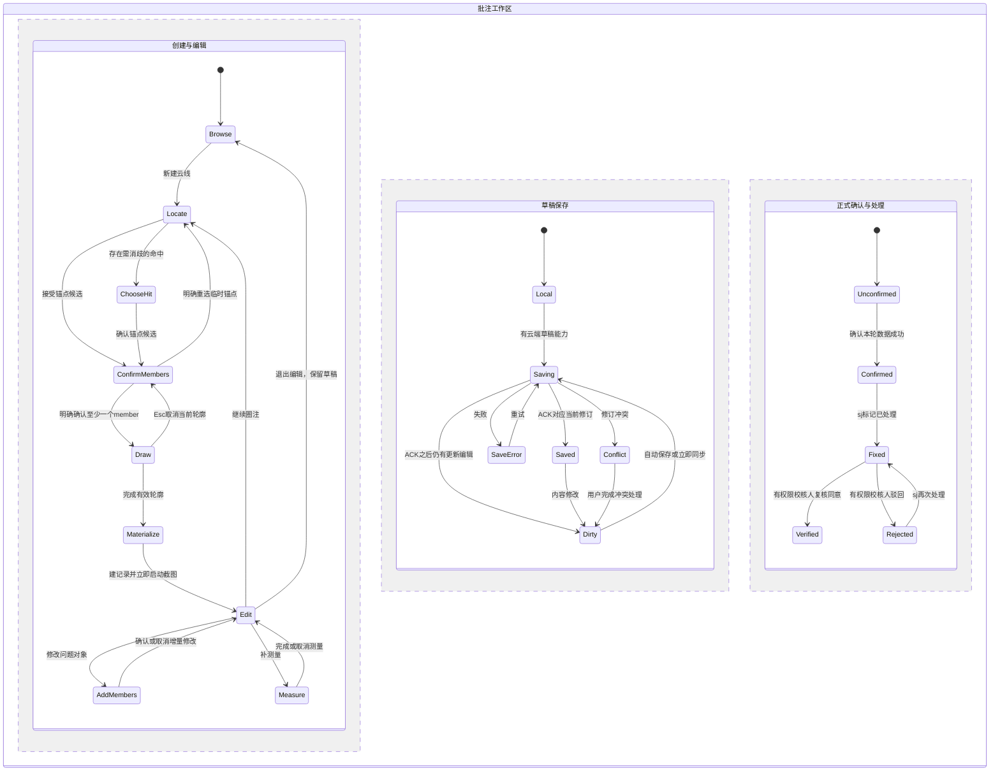

# Oracle 评审原文 —— 三维批注交互（GPT-6 Pro，会话 review-3d-annotation-ux，2026-09-14）

> 由 oracle CLI 0.20.0 浏览器模式生成（ChatGPT 模型标签 Latest = GPT-6，思考档 Pro，用时 21m01s，↑20.29k ↓12.47k tokens）。
> 原件：C:\Users\dpc\.oracle\sessions\review-3d-annotation-ux\artifacts\transcript.md。附件 6 份见同目录 oracle-brief-current-state.md 与仓库内原始文档。
> 本文是原始输出，**仅作评审依据**；采纳口径见上级目录 2026-09-14-3d-annotation-interaction-redesign-proposal.md。

# Oracle Browser Transcript

Conversation: https://chatgpt.com/c/6aa7ba30-ae38-83e9-88ef-593e27c03a34

## Prompt

你是一位资深的三维工程软件交互设计与前端架构评审专家，熟悉工厂/管道/BIM 设计校审工具（AVEVA E3D & Review、Navisworks / Autodesk Construction Cloud Issues & Markups、Solibri、Revizto、Trimble Connect、Dalux、Bentley iTwin 等）的批注（markup / issue / redline）交互范式，也熟悉 Vue 3 + Three.js 前端的落地约束。请用中文回答。

## 背景

附件是一个三维校审系统 plant3d-web（Vue 3 + TypeScript + Three.js 自研 DTX 查看器，后端 Rust）的资料：
- `00-brief-current-3d-annotation-interaction.md`：接手方整理的**现状简报**（系统、四类批注、云线三步创建流程、查看/处理侧界面、已落地的架构决策、观察到的摩擦点、能力边界）。**请先完整读它。**
- `01-…binding-plan-2026-07-28.md`：云线与模型元素绑定的工程化方案（已实施 Phase 1+2），含创建状态机、四个入口、闸门落点、数据模型 V7、显示设计。
- `02-…interaction-guide.md`：PMS 宿主里的实际操作说明（用户视角的现行流程）。
- `03-…draggable-card-design.md`：文字批注图钉 + 可拖动卡片设计。
- `04-adr-0049-0053-annotation.md`：五条不可推翻的架构决策。
- `05-record-types-excerpt.ts.md`：记录类型源码摘录。

场景：工厂三维模型（管道 / 阀门 / 结构，元素以 refno 标识，可上溯 BRAN 分支）的四节点校审流程 sj→jd→sh→pz，校对 / 审核人在 PowerPMS 的 iframe 里打开三维页面，对模型「圈问题、说明问题、定错误类型」，设计人员回来处理、回复，校核再确认。桌面浏览器，鼠标键盘为主。

## 任务

针对**当前的三维批注交互**提出一套**更好的方案**。要求：

1. **诚实评估现状**：先独立判断简报 §6 列出的 10 个摩擦点哪些成立、哪些不成立或被高估，补充你看到但简报没提的问题；按「用户代价 × 出现频率」排一次优先级。
2. **目标交互模型**：给出你推荐的批注创建 / 编辑 / 浏览 / 处理的整体交互模型。至少覆盖：
   - 「先圈再绑」还是「先绑再圈」？能否做成**锚点先行 + 关联自动推断 + 一键确认/修正**？重叠 / 遮挡 / 密集管线下的拾取与消歧怎么做（候选环、深度剥离、上溯层级、悬停预览等）？
   - 云线的几何表现：屏幕空间固定像素 vs 三维 AABB vs 「随目标可见投影轮廓自适应」的第三种；相机变化时的稳定性与遮挡处理；大量批注时的聚合 / LOD / 徽标。
   - 草稿 → 已保存 → 已确认 → 已处理 → 已复核 的**状态可见性**与保存时机（是否改自动保存草稿、何时落库、如何避免串任务）。
   - 批注间导航（上一条 / 下一条 / 飞行 / 高亮当前 / 与表格、列表、三维三端同步选中）。
   - 一条批注的「说明」如何最快填完（错误类型、描述、截图重拍、补测量、模板 / 常用语）。
   - 四个入口 / 四个面板如何收敛成清晰的一到两处；浮动工具条向导卡该保留还是拆掉。
   - 键盘快捷键与模式切换的防误操作；窄 iframe 下的布局降级。
3. **业界参照**：具体说明上述哪些做法来自哪家产品的哪个交互，为什么适合这里、哪些不适合（不要泛泛而谈）。
4. **落地约束下的方案**：所有建议必须兼容附件 04 的五条 ADR 与简报 §5 的其它约束（只增不改的记录 schema、payload superset、三条恢复链路、锚点不可换、四节点流程、PMS 嵌入、不一次性重写 `useDtxTools.ts`）。若你认为某条约束本身妨碍了更好的方案，单独列出并给出「维持约束下的次优解」与「若放开约束的更优解」两版。
5. **交付物格式**：
   - A. 现状评估表（摩擦点 | 成立? | 依据 | 优先级）
   - B. 目标交互模型（状态机用 TypeScript 联合类型 + Mermaid stateDiagram 各给一份；关键操作用「用户动作 → 系统反馈」逐步写）
   - C. 界面布局（文字描述 + ASCII 草图即可，说明常驻区 / 临时区 / 视口内元素）
   - D. 数据与接口增量（只增字段、新端点，各给字段级定义与用途）
   - E. 分阶段落地计划（每阶段：改哪些文件 / 模块、可独立验收的判据、Playwright 用例要点、回退方式、特性开关）
   - F. 明确**不要改**的东西与理由
   - G. 风险与开放问题（哪些需要产品拍板，给出你的推荐选项）

请直接给结论和依据，不要客套；长度不限，但每一条建议都要落到简报里点到的具体文件 / 状态 / 字段上，避免通用 UX 教科书式表述。

## Answer

## 结论

**推荐把主交互收敛为：一个“问题工作台”＋一个视口上下文条；创建采用“锚点先行、关联建议显式确认、再圈定范围”；自动保存草稿，但保留显式“确认本轮数据”；浏览和处理围绕同一条当前批注连续进行。**

不建议优先投入真实可见轮廓提取，也不建议把“确认当前数据”直接改成后台自动调用。前者解决不了保存不确定性，后者可能把未完成的说明、误选的目标和未完成的截图提前变成正式校审证据。

有三个必须说清的边界：

* **锚点先行不等于锚定即关联。** 云线命中的构件先成为锚点候选；系统可以推荐它或所属 BRAN 为问题对象，但必须经过明确确认，才进入 `bindings` 的 `member` 集合。
* **草稿已保存不等于数据已确认，更不等于问题已处理。** 这三个维度不能压进一个 `status`。
* **自适应投影包络不等于真实可见轮廓。** 在 ADR-0050“渲染只读坐标快照”的约束下，前者可以先做；后者必须另设能力和性能门槛，不能把投影 AABB 包装成可见轮廓。上述角色绑定、不可换锚点和快照渲染边界，分别来自 ADR-0049、0051、0050。

**本次是材料核对和交互方案评审，不是完整源码或运行时审计。** `00` 是现状汇总，`01—03` 含历史设计和操作说明，`05` 是不完整类型摘录。下面会明确区分“材料能支持的现状”“据此推断的风险”和“拟新增能力”；不把旧计划中的验收项当成当前实现已经通过的证据。

---

# A. 现状评估表

## A1. 对十个摩擦点的独立判断

排序采用 **用户代价 C × 出现频率 F**，各取 1—5。频率是针对本次桌面、PMS 嵌入、连续校审场景的工作假设，**不是已有埋点统计**。P0 表示必须优先解决的可信度或隔离问题；相同分数优先处理可能产生错误关联、丢失工作或误确认的问题。

| 排序 / 原编号 | 摩擦点                      | 成立？                                  | 依据与独立判断                                                                                                                                | 优先级                         |
| -------- | ------------------------ | ------------------------------------ | -------------------------------------------------------------------------------------------------------------------------------------- | --------------------------- |
| 1 / #5   | 草稿、已保存、已确认不清楚，可能串任务      | **部分成立，后果最严重；历史故障不等于当前仍有漏洞**         | `00` 明确是 localStorage 暂存，再通过 `/records` 批次落库；但 `02` 又明确确认后会显示确认时间、批次和数量，所以不能说“确认状态完全不可见”。真正缺口是**逐条修订是否已到服务器、是否已进入本轮确认，以及异步结果归属哪个任务**。  | **5×5=25，P0**               |
| 2 / #4   | 密集管线拾取和框选误关联             | **成立；问题不是 Tab 本身，而是候选不可解释、框选包含背景**   | 框选包含遮挡/背景对象有明确说明。Tab 是可保留的熟练用户加速方式；不能因为难发现就废掉。候选确认列表在 `01` 中是要求，在 `00` 中仍以“设计稿要求”表述，不能断言当前每条路径都执行了确认。                                  | **5×4=20，P1**               |
| 3 / #2   | 四个入口、多个编辑面板重复            | **成立于信息架构；尚不能证明存在实际状态不同步缺陷**         | 四个入口和多处详情载体是材料事实。但多个入口不天然错误，错误是它们承担不同的“当前批注”和编辑草稿，或让用户猜哪处保存有效。应先统一命令与编辑会话，而不是先删组件。                                                     | **4×5=20，P1**               |
| 4 / #1   | 创建步骤多，先选目标不自然            | **部分成立，“至少五次点击”及所有人都自然先圈的表述被高估**     | 已有选择集时，“从当前选择创建”是合理专家路径。困难主要发生在**尚未选对象、只是看到问题**的场景。另有材料冲突：`00` 说拖框完成即建记录，`02` 还要求点击“保存批注”；因此现有精确点击数不能据文档确定。                            | **3×5=15，P1**               |
| 5 / #7   | 缺少连贯批注导航                 | **连续导航缺口成立；“表格双击是唯一导航”不成立**          | 已有列表定位、高亮、全部目标定位和逐元素定位。缺的是**固定筛选队列里的上一条/下一条、当前项强调、证据视角恢复及三处同步选中**，不是重新实现 flyTo。                                                        | **3×5=15，P1**               |
| 6 / #8   | 模式多，切换就清空，误切代价高          | **成立于状态设计；没有足够证据认定 pointer 管线本身有缺陷** | `ToolMode` 的确有多种测量、批注和拾取模式；操作说明明确切换工具会清空当前创建状态。应保留单一 pointer 仲裁，增加“子工具借用”和安全暂停，而不是再造一套事件系统。                                            | **4×3=12，P1**               |
| 7 / #3   | 固定像素云线与大 AABB 都不理想       | **成立，但不是所有云线都应改成随目标自动包络**            | 固定屏幕尺寸确实不保证换视角后仍圈住原对象；但手工圈线表达的是“这里这一处”，自动包住整条 BRAN 可能反而扩大问题范围。应区分**原视角圈注**与**目标范围提示**。                                                 | **3×3=9，P2**                |
| 8 / #9   | 无触屏、小视口适配                | **窄 iframe 成立；触屏不是本期缺陷**             | 本次明确桌面鼠标键盘，不应把移动端手势设计塞进本轮。应解决 iframe 宽高变化、侧栏挤压、工具卡越界和输入区被遮挡。                                                                           | **窄视口 3×3=9，P1 顺手落地；触屏不排期** |
| 9 / #10  | HTML overlay 卡片遮挡、截图不含卡片 | **卡片密度风险成立；“用 DOM”及“不进截图”不是缺陷**      | 文字卡已有拖动、折叠和内联编辑设计；没有运行截图和性能数据，不能直接认定层级混乱。截图不包含标题/描述是 ADR-0052 的明确选择，不应以 UX 优化名义推翻。                                                     | **3×3=9，P2；当前卡优先可提前做**      |
| 10 / #6  | 创建瞬间自动截图不合适              | **主要被高估**                            | 创建瞬间未必是构图最漂亮的时候，但通常保留了发现问题时的上下文；这正是 ADR-0053 保留立即拍摄、否决延后拍摄的理由。应改善截图预览、失败反馈和重拍，而不是取消自动拍摄或把文字合成进去。                                       | **2×3=6，P2**                |

**最值得优先改变的不是“三步变两步”，而是让用户始终知道：我正在改哪一条、它属于哪张单、改动到了哪里、当前关联到底是什么。**

## A2. 简报未充分指出的问题

| 补充问题                         | 证据层级                                                              | 用户后果                                        | 建议落点                                                                 |
| ---------------------------- | ----------------------------------------------------------------- | ------------------------------------------- | -------------------------------------------------------------------- |
| **修改目标会清除已经选好的锚点**           | 操作说明明确如此；同时旧方案明确锚点可以与目标解耦。                                        | 用户补选一个阀门，却被迫重新找锚点；增加不必要返工                   | 新创建状态机里，修改 `pendingTargets` 只使“目标确认”失效，**不自动清除有效的锚点候选**              |
| **“定位问题对象”和“回到证据视角”被混为一个动作** | 当前文档中的 flyTo 是合并 AABB 聚焦；类型摘录没有展示可恢复相机字段，但不能据此认定完整项目中不存在。         | 能找到阀门，却未必看得到原问题；窄 iframe 下尤其明显              | `AnnotationInlineDetailCard.vue` 分成“回证据视角”和“定位目标”；增量保存视角快照           |
| **BRAN 关联和子元素反查的语义可能不一致**    | 已有 `element/branch` 两层级；反查规则只说明看 member，未说明点击子元素是否包含上级 BRAN 的问题。  | 用户明明对整条分支提了问题，点其中阀门却以为没有批注                  | 反查结果区分“直接关联”和“上级 BRAN 关联”，不得静默改写 `bindings`                          |
| **当前选择集可能混入批注导航产生的高亮**       | 属于待源码核实的组合风险：现有高亮会调用 `setObjectsSelected`，创建又会读当前选择。              | 从上一条问题导航过来后，一键创建可能不知不觉沿用上一条目标               | 在交互适配层区分 `user-model`、`annotation-navigation`、`candidate-preview` 来源 |
| **截图、加载、高亮和保存都可能晚于切任务完成**    | 这是架构风险，不是附件已证明的 bug                                               | 旧任务的异步结果覆盖新任务；或快速“下一条”后相机飞回上一条              | 所有结果发布同时校验 `scopeEpoch` 和操作修订号，不能只依赖取消请求                             |
| **几何失效与业务处理状态容易互相污染**        | `resolve` 与 `reviewState` 是不同语义；ADR 明确失效不得静默删除。                   | “构件 missing”被误理解成“问题已解决”，或旧一轮 agree 被当成本轮通过 | 状态徽标分栏；复核基于本轮有效处理事件，不根据渲染成功与否猜测                                      |
| **只增字段不自动保证所有旧客户端再次保存都不丢字段** | `01` 证明了当时特定 replay 路径的 superset；并未展示全部旧写端和四类 normalizer。         | 新增视角、呈现快照在旧端编辑后丢失                           | 新字段对四类型、三恢复链路做 round-trip；必要时对不兼容旧写端只读                               |

## A3. 必须先统一的材料冲突

这一步不是重新规划已经做完的 Phase 1+2，而是防止新实现重新引入被否决的行为。

| 冲突                                                                     | 本次采用的口径                                                                                |
| ---------------------------------------------------------------------- | -------------------------------------------------------------------------------------- |
| `01` Phase 2、PATCH 草案允许 `rebindAnchor`；ADR-0051 禁止                     | **以 ADR-0051 为准。** 已创建记录不提供换锚点入口，也不接受该写操作。                                             |
| `00` 是三类错误类型；`01` 和 `05` 注释仍出现四级严重度                                    | 新 UI 按 `principle/general/drawing`；历史不认识的值原样保留并显示“历史类型”，**不擅自映射**。实际 union 需在真实源码确认。   |
| ADR-0049/0050 已规定四类统一绑定、批量解析；`05` 的 text/rect 未展示相应字段，cloud 也未展示全部解析字段 | 把 `05` 当摘录，不凭它断言 ADR 未实施，也不据它删掉实际字段；先补真实类型与恢复测试                                        |
| `00` 拖框完成即创建；`02` 还有“保存批注”                                             | 在实施前记录一次实际事件序列，确定 `addCloudAnnotation`、截图和 `/records` 各发生在哪一步，再统一按钮文案；不凭历史文档计算点击数      |

---

# B. 目标交互模型

## B1. 总体模型：以“问题”为中心，不新建一套问题数据实体

界面统称“问题”，底层仍保留 `text/cloud/rect/obb` 四类记录、原有 `AnyAnnotationRecord`、评论线程、`reviewState` 和快照链路。

四种创建方式收敛为一个主按钮：

> **新建问题 ▾：云线 / 文字图钉 / 对象框 / 选择集框**

默认项可记住**当前用户本次会话的工具偏好**，不自动继承上一条问题的关联、描述或处理状态。

| 类型      | 保留的几何语义                                 | 创建后进入哪里              |
| ------- | --------------------------------------- | -------------------- |
| `cloud` | 锚点＋手工圈定范围，或目标集合包围框                      | 同一问题编辑器              |
| `text`  | 一次表面点击；按 ADR-0049 默认写 anchor、member 双角色 | 保留视口内联编辑，但与工作台共用编辑会话 |
| `rect`  | 当前对象 OBB                                | 同一问题编辑器              |
| `obb`   | 明确选择集的 OBB                              | 同一问题编辑器              |

**不把四类记录转换成一种新记录，也不把云线、矩形、文字之间的“切换外观”当成无损转换。** 原始创建方式和数据结构已有差异。

落点：`AnnotationWorkspace.vue` 承担问题工作台；`AnnotationInlineDetailCard.vue` 承担公共详情；各旧入口只发送统一创建命令。

---

## B2. 创建：推荐“锚点先行”，保留“先绑再圈”的专家路径

### 默认路径：看到问题时直接开始

| 用户动作                       | 系统反馈与写入边界                                                              |
| -------------------------- | ---------------------------------------------------------------------- |
| ① 点击“新建问题 → 云线”            | 进入 `locating`；状态条显示“点击问题附近的模型表面”。**不自动读取历史全局选择集**                      |
| ② 单击一个阀门表面                 | 暂存锚点候选；显示小型确认条：`锚点：VALV …`、`建议问题对象：此元件`、`改为所属 BRAN`、`仅作为锚点`。此时还不是正式批注  |
| ③ 按 Enter 或点“使用这 1 个目标并圈定” | 显式确认 member 集合；若同一 refno 同时承担锚点和问题对象，写两种角色，但关联数量只算 member              |
| ④ 拖动圈定范围                   | 只改变待创建的 `screenOffset/cloudSize`，**不把框内其他对象加入 member**                 |
| ⑤ 松开鼠标                     | 满足至少一个已确认 member、有效锚点和当前任务权限后，恰好创建一条 store 记录；锚点从此冻结；立即启动原有 WebGL 自动截图 |
| ⑥ 输入错误类型和说明                | 编辑器显示“本机草稿 / 正在同步 / 云端草稿”等明确状态；不再要求为这条问题额外找到另一处“保存批注”                  |
| ⑦ 点“继续圈注”                  | 新建一个干净创建会话；上一条说明保留，目标和锚点不继承                                            |
| ⑧ 完成本轮后点“确认本轮数据”           | 核对当前修订并沿原 `/api/review/records` 链路确认；不自动送审或切换 PMS 节点                   |

这里的“自动推断”是**推荐一个可解释的关联候选**，不是系统替用户决定工程问题对象。

第一期不建议把“拖框开始”隐含当成“接受候选”。显式 Enter 已经是一次低成本确认，更容易训练、测试和避免误绑。以后可以试验清楚标注的“拖框即采用建议目标”，但必须作为独立特性开关，而不是默认暗规则。

### 专家路径：已经选好目标

> 在模型树或视口明确选择对象 → “从当前选择创建问题” → 点击锚点 → 圈定范围。

这条路径保留 `pendingTargets` 导入能力；因为“从当前选择创建”本身就是显式选择动作，不需要再弹一次同义确认。

**普通“新建问题”与“从当前选择创建”必须是两个清楚命名的命令。** 不要根据是否碰巧存在选择集，悄悄改变同一个按钮的行为。

### 锚点在梁柱、问题对象在管线上的情况

> 点击梁柱锚点 → 选“仅作为锚点” → 点选管线/阀门或导入选择集 → 确认 member → 圈定。

这保留了 `01` 明确允许的锚点与问题目标解耦，而不是把该工程场景退化成不支持。

### 对现有工具层的具体修改

新流程不能只改浮动卡片，因为当前工具层会在目标为空时阻止取锚点。

建议仅增加以下接线：

1. `useDtxTools.ts` 云线单击处理分支：新模式下允许先生成**临时锚点候选**，不调用 `addCloudAnnotation`。
2. `beginMarquee`：继续统一校验“已确认 member 非空＋锚点有效＋scope 未变化”；四个入口不能自行绕过。
3. `createCloudAnnotationRecordFromAnchorAndMarquee` 前增加统一 `canMaterializeCloud()` 校验；通过后才真正创建。
4. `cancelCloudCreation()` 保留为**彻底结束本次创建**的清理函数；子工具返回不再滥用它。
5. 修改临时目标时保留有效锚点，仅重新确认目标；不要沿用操作说明里“改一个 member 就清掉锚点”的策略。

原方案已明确把四入口闸门集中在 `useDtxTools.beginMarquee`，这一层次应保留。

---

## B3. 拾取与消歧：先把候选讲清楚，再考虑深度剥离

### 1. 点选：候选环用于提示，列表用于决定

不推荐把十几个构件名称全部塞进径向菜单。建议：

* 光标附近显示小型环形计数 `1/4`，表示当前射线候选中的位置。
* 同时显示最多数行的候选列表：`noun · refno · 所属 BRAN · 前方/后方/可见性未知`。
* 悬停候选只做临时轮廓预览，不修改正式选择集。
* Tab/Shift+Tab 保留前后轮换；Enter 确认当前候选；鼠标直接点候选也可以。
* 一次消歧期间固定候选顺序；相机或指针位置发生实质变化后才重算，避免轻微抖动造成“Tab 选中的对象突然变了”。

`DTXSelectionController` 已承担拾取与选择职责。应优先复用现有 Tab 候选来源，在它与新状态机之间加小型适配层；**不要先假定它已经提供完整深度命中、可见像素查询或所有实例的稳定句柄**。材料没有给出这些接口。

拟新增：

```text
src/review/domain/annotationPickCandidates.ts
src/components/review/AnnotationPickCandidates.vue
```

纯函数负责按“模型身份＋refno”去重、稳定排序和层级转换；渲染/拾取适配器负责提供候选事实。

### 2. 预览必须与正式选择分离

建议在交互层区分：

```ts
type SelectionOrigin =
  | 'user-model'
  | 'annotation-navigation'
  | 'candidate-preview';
```

`candidate-preview` 不得触发“当前模型关联批注”反查，不得成为“使用当前选择”的默认输入；`annotation-navigation` 也不能被下一次普通创建静默导入。

初期不必重构全局 selection store：可在批注命令适配层记录来源，预览使用临时高亮通道。关键是不要让候选悬停继续调用带有永久选择和飞行副作用的现有 `highlightAnnotationTargets`。

### 3. 层级上溯：保留两档，不扩大成任意层级选择器

继续使用现有：

```ts
type CloudTargetLevel = 'element' | 'branch';
```

显示建议改成：

> 问题对象：`当前元件 VALV …` / `所属分支 BRAN …`

锚点保持实际点击的表面点和构件；切换到 BRAN 只改变**问题对象建议**。

没有可靠父链时显示“暂无法取得所属 BRAN”，不根据 refno 字符串、名称相似或当前选择树位置猜父节点。已有两档层级的语义可直接复用。

### 4. 框选：候选集，而不是“看得见的全部目标”

第一期建议把列表标题改为：

> **投影范围候选：18 项，可能包含遮挡对象**

已经明确选择的目标继续勾选；新收集的背景候选不要默认全勾。提供“全部选择”和 noun 分组选择，但必须由用户主动执行。

这有意调整 `01` 的“默认全勾＋Enter”决定：它虽然减少按键，却可能把确认列表变成形式上的免责弹窗。工厂密集管线下，错误关联的代价比少按一次全选更高。原计划本身已经确认框选会包含遮挡对象。

**只有通过运行测试证实可见性计算正确后，才能出现“仅可见对象”选项。** 若候选来源只覆盖已加载对象，必须同时显示“仅检查已加载模型”，不能把局部候选称为完整集合。

### 5. 深度剥离后置

第一阶段利用现有射线候选消歧；再考虑“查看后方候选”的临时透视/剥离效果。

此类效果必须满足：

* 不改变模型的持久 `visible` 状态或原始材质。
* Esc、切任务和完成选择时恢复。
* 不污染自动截图。
* 不把临时透视后看见的所有物体自动加入 member。

真正多层 GPU 深度剥离只有在现有候选无法满足实测需求时再做，不是第一轮 UX 改造的前置条件。

---

## B4. 云线几何：保留两种原语义，新增快照驱动的投影包络

### 推荐的模式分工

| 模式            | 适用情况             | 推荐表现                                                 | 不应宣称的能力             |
| ------------- | ---------------- | ---------------------------------------------------- | ------------------- |
| 现有 `screen2d` | 校审人圈出某个视角中的局部问题  | 保留手绘范围；提供“回原圈注视角”。明显偏离原视角时，默认突出图钉和目标，原圈线可弱化并标“原视角圈注” | 不声称换任意相机后仍准确包住目标    |
| 现有 `bbox3d`   | 强调一组对象的整体空间范围    | 保留三维范围框；适合对象集合检查，不作为所有局部问题的默认                        | 不把合并 AABB 等同于对象外形   |
| **新增：投影包络**   | 随相机变化提示关联目标范围    | 对保存的目标几何范围快照做投影，再形成带留白的包络；多个相离区域允许多个轮廓，共用一个问题编号      | 不称为“真实可见轮廓”         |
| **实验：真实可见轮廓** | 需要贴合表面且遮挡语义严格的场景 | 仅在具备版本固定的几何快照/渲染代理、可靠深度语义和性能证据后试验                    | 不用 AABB 投影或单点深度测试冒充 |

### 第三种模式如何兼容 ADR-0050

新增一个可选的呈现字段，例如 `presentationV1`。它保存：

* 目标范围坐标快照；
* 坐标系/模型快照标识；
* 快照对应的 member 集合摘要；
* 留白像素和包络算法版本。

渲染函数只接收：

```text
projectCloudEnvelope(geometrySnapshot, camera, viewport)
```

它不在每帧解析 refno、不访问后端、不根据新加载模型悄悄重定位锚点。

模型版本变化后，由现有批量解析机制更新失效提示；旧快照仍可显示，但带 `stale` 标识。只有用户明确修正 member 等允许操作时，才能为新的呈现上下文准备新快照。**不能把自动重解析做成自动改写历史证据。** ADR-0050 明确要求渲染只读坐标快照。

### 包络的具体几何规则

落到拟新增的 `annotationProjection.ts`：

* 先裁剪近裁剪面，再投影，避免相机穿过对象时包络突然放大。
* 不对相距很远的目标一律求总凸包；允许分离轮廓，避免把中间无关设备圈进去。
* 对 BRAN 只有总 AABB 时，界面注明“分支范围近似”，不承诺贴合管线。
* 波浪振幅、留白和线宽按 CSS 像素计算；正确区分 CSS 像素与 drawing-buffer 像素。
* 相机运动中先用较稳定的简化框/轮廓；停止后再精化。迟滞参数是可调设计值，不作为已验证的性能事实。
* 轮廓巨大、目标离屏或在相机后方时，退到当前问题图钉/边缘方向提示，不画一个横跨全屏的巨大云框。
* `presentationV1` 只是呈现扩展；旧 `screenOffset/cloudSize/selectionBbox` 保留兼容回退，不搬字段。

### 遮挡处理

对当前问题，建议即使锚点被遮挡也保留可发现的徽标，但显示空心/虚线边框和“被遮挡”提示。不要把它伪装成当前可见的表面命中。

对非当前问题，可按用户显示策略隐藏遮挡徽标或参与聚合，但列表数量不变。

这部分即便引入场景深度作为**显示提示**，也不能据此修改 `bindings` 或 `resolve`。未取得可靠深度能力时，只显示“可见性未知”，不做假精确判断。

### 大量批注：先限制展开卡片，再做 LOD

优先顺序：

> 当前问题完整展示 → 悬停问题临时展示 → 其他问题只显示图钉 → 密集图钉聚合。

具体建议：

* 默认只展开一张当前问题卡。
* 保留手动展开其他卡片的能力，但设置合理上限和“收起其他卡片”。
* 聚合按屏幕接近程度生成，点击后列出成员或放大视角；不生成新的业务批注。
* `visible/collapsed` 是记录/用户状态；LOD 是运行时显示决策，**不能为了省性能把记录批量写成 `visible=false` 或 `collapsed=true`**。
* 选中问题不因聚合而消失。
* 云线轮廓色仍由 `useAnnotationStyleStore.ts` 控制；错误类型只通过 ×/△/○、徽标和色点表达。

旧方案已经要求缓存 AABB、合并 `ensureRefnos` 和分级渲染；应复用这些方向，但不把其中 500/2000 条阈值当作当前硬件实测结论。

---

## B5. 状态机：创建、保存、业务处理必须分开

### TypeScript 联合类型

以下为**拟新增领域类型**。坐标 DTO 在接线层转换到现有 `Vec3`；不要求改变既有记录坐标格式。

```ts
type ReviewNode = 'sj' | 'jd' | 'sh' | 'pz';
type AnnotationKind = 'text' | 'cloud' | 'rect' | 'obb';
type Point3 = readonly [number, number, number];
type NonEmpty<T> = readonly [T, ...T[]];

type ReviewScope = Readonly<{
  projectId: string;
  actorId: string;
  // 仅用于前端异步结果隔离，不作为服务端权限凭据。
  epoch: number;
  target:
    | {
        kind: 'task';
        taskId: string;
        formId?: string;
        reviewRound: number;
        node: ReviewNode;
        workflowRevision: string;
      }
    | {
        kind: 'provisional';
        draftSessionId: string;
      };
}>;

type AnnotationHandle = Readonly<{
  scopeKey: string;
  kind: AnnotationKind;
  id: string;
  // 跨快照归并继续使用现有 annotationKey 规则，不重新发明。
  annotationKey?: string;
}>;

type AnchorCandidate = Readonly<{
  refno: string;
  noun?: string;
  worldPos: Point3;
}>;

type MemberCandidate = Readonly<{
  refno: string;
  noun?: string;
  source: 'surface' | 'current_selection' | 'branch' | 'box';
  visibility: 'front' | 'occluded' | 'unknown';
}>;

type CloudSession = Readonly<{
  operationId: string;
  scope: ReviewScope;
  targetLevel: 'element' | 'branch';
  drawMode: 'screen2d' | 'bbox3d';
}>;

type CloudCreateState =
  | { kind: 'idle' }
  | { kind: 'locating'; session: CloudSession }
  | {
      kind: 'disambiguating';
      session: CloudSession;
      hits: NonEmpty<AnchorCandidate>;
      activeIndex: number;
    }
  | {
      kind: 'confirming_members';
      session: CloudSession;
      anchor: AnchorCandidate;
      candidates: readonly MemberCandidate[];
    }
  | {
      kind: 'drawing';
      session: CloudSession;
      anchor: AnchorCandidate;
      members: NonEmpty<MemberCandidate>;
    }
  | {
      kind: 'materializing';
      session: CloudSession;
      anchor: AnchorCandidate;
      members: NonEmpty<MemberCandidate>;
      // 几何由现有构造函数生成；此态禁止重复提交。
    };

type EditingState =
  | { kind: 'browsing'; active?: AnnotationHandle }
  | { kind: 'editing'; active: AnnotationHandle }
  | { kind: 'adding_members'; active: AnnotationHandle }
  | {
      kind: 'measuring';
      active: AnnotationHandle;
      measurement: 'distance' | 'angle' | 'elevation' | 'elevation_delta';
    }
  | {
      kind: 'blocked';
      reason: 'scope_changed' | 'permission_changed' | 'model_changed';
    };

// 这是编辑会话的同步状态，不写入 reviewState。
type DraftSyncState =
  | { kind: 'local_only'; localRevision: number; persistedLocally: boolean }
  | { kind: 'dirty'; localRevision: number; baseServerRevision?: string }
  | { kind: 'saving'; sentLocalRevision: number }
  | {
      kind: 'saved';
      serverRevision: string;
      acknowledgedLocalRevision: number;
    }
  | { kind: 'error'; message: string; retryable: boolean }
  | { kind: 'conflict'; baseRevision: string; currentRevision: string };

// 这是正式快照确认信息，不替代问题处理状态。
type ConfirmationState =
  | { kind: 'unconfirmed' }
  | {
      kind: 'confirmed';
      recordId: string;
      confirmedRevision: string;
      hasUnconfirmedEdits: boolean;
    };

// 仅为 UI 派生态；由既有 reviewState + 本轮有效历史计算。
type ResolutionView =
  | 'awaiting_action'
  | 'fixed_awaiting_verification'
  | 'rejected_for_revision'
  | 'verified'
  | 'unknown';

type AnnotationInteractionState = {
  creation: CloudCreateState;
  editing: EditingState;
  sync: DraftSyncState;
  confirmation: ConfirmationState;
  resolution: ResolutionView;
};
```

`text/rect/obb` 用各自现有构造逻辑进入公共 `editing`，不必先重写成与 cloud 一模一样的创建状态。

### Mermaid stateDiagram

三个并行区域表达三个维度，**不是把所有标签串成一个大枚举**。



### 必须写进 reducer/guard 的不变量

| 不变量                                                 | 落点                                                 |
| --------------------------------------------------- | -------------------------------------------------- |
| 没有已确认 member 的 cloud 不得 materialize；临时锚点候选不算正式批注    | 新 `annotationInteraction.ts`＋`beginMarquee`＋创建函数入口 |
| 一旦 `addCloudAnnotation` 成功，锚点不可换；不是等服务器保存以后才锁       | `useToolStore.ts` 允许字段白名单＋命令层                      |
| 同一 `operationId` 不能因重复 pointerup、重试或重入产生两条记录        | materialize effect                                 |
| 旧 `scopeEpoch` 的回调不得更新当前任务的 store、选择、高亮、相机或截图引用     | 请求、导航、截图结果发布点                                      |
| `saved` 只能由匹配修订的服务器 ACK 得到；localStorage 成功只能标“本机草稿” | `useAnnotationDraftSession.ts`                     |
| `fixed/agree/reject` 仍走现有状态接口；前端不能靠改显示状态冒充业务提交      | `/api/review/annotation-states/apply` 适配层          |
| 不认识的历史 `reviewState` 不得默认显示“已复核”                    | `deriveResolutionView()`                           |

---

## B6. 保存时机与任务隔离

### 界面上的状态应该长这样

同一条问题可以同时显示：

> **云端草稿 · 未确认**
> **已确认到修订 12 · 有未确认修改**
> **已处理，待复核 · 关联 2/3 可用**

不要只显示一颗绿色“已保存”勾，也不要把“已确认”直接当成 `reviewState` 的一个新值。

### 推荐保存策略

| 时机                  | 行为                                                   |
| ------------------- | ---------------------------------------------------- |
| 点击锚点、调整候选、尚未形成记录    | 只属于创建会话；不混入正式批注数组                                    |
| cloud materialize   | 写入当前 scope 的本机草稿；立即自动截图；允许说明暂不完整                     |
| 输入说明、改错误类型、改 member | 编辑完成/防抖后保存草稿；中文输入法组合输入结束前不触发“完成说明”                   |
| 切到下一条问题             | 先提交当前输入框内容到编辑会话，再切换；不意味着正式确认                         |
| 点击“确认本轮数据”          | 固定本次 payload 修订，检查权限、任务、轮次、必填项、截图状态，再沿 `/records` 提交 |
| PMS 送审/驳回           | 使用既有流程；自动存草稿不触发节点推进                                  |

**没有新后端能力时，第一阶段只做“可靠的本机草稿＋明确未落库提示”。** 不通过偷偷重复调用 `/records` 假装实现云端草稿，因为当前 `/records` 已处于正式确认链路。

### “确认本轮数据”不能取当前过滤列表作为 payload

表格可能只显示“一般错误”或“待处理”，这只是视图过滤，不能决定保存哪些记录。

确认时仍从当前任务的完整 `ReviewSnapshot` 构造 payload，保留其他批注类型、测量、已有未知字段和原有正式数据。

第一期建议：

> 本次待确认的新建/修改项有未完成必填或失败截图时，阻止该批确认，并定位到问题项。

不要为了“允许跳过一条”就直接从数组里删掉它；那可能把既有记录误表达成删除。后续若支持部分确认，必须显式构造“正式基线＋选中修改＋明确删除”的完整快照。

### 防串任务必须是数据边界，不是切页面时 `clearAll()`

建议本机草稿按以下稳定信息隔离：

```text
项目 + canonical taskId + reviewRound + 当前用户
```

流程节点、流程修订、`form_id` 映射作为上下文校验；每次切换或重新绑定上下文递增前端 `scopeEpoch`。

尚未取得正式 taskId 的“新建单据”，使用独立 `draftSessionId`。只有服务端确认映射后，才允许将该会话归属到正式任务。**未知归属的历史 localStorage 数据不能自动塞进刚打开的新单。**

容器内容仍是 V6，不升版本；可以对草稿存储 key 增加 scope 命名空间。旧全局 key 只做受控兼容读取，对不能识别归属的数据展示“未归属草稿”，不默认导入当前任务。

### 异步结果发布必须同时核对两件事

```text
结果是否属于当前 scope？
结果是否对应仍然有效的操作修订？
```

例如 A 任务的截图上传已发出，用户切到 B。即使无法撤回网络请求，返回结果也只能归属 A，不能读取此时全局 `currentTaskId=B` 再写入。

同理，保存修订 7 的 ACK 到达时，用户已经编辑到修订 8，界面必须继续显示“有未同步修改”，而不是整条变成“已保存”。

---

## B7. 编辑、浏览、处理：一个当前项，三端同步

### 1. 单一“当前问题”

拟新增 `useAnnotationSelection.ts`，持有：

```text
activeAnnotationHandle
filteredOrderedHandles
navigationSequence
```

其中 UI 身份使用 `scope + type + id`；跨快照评论归并继续使用既有 `annotationKey`。不要用数组下标、分页行号或截图上临时显示序号当身份。

以下入口调用同一个 `selectAnnotation()`：

* 视口图钉；
* `AnnotationWorkspace.vue` 列表；
* `AnnotationTableView.vue` 行；
* “当前模型关联批注”结果；
* 上一条/下一条。

### 2. 选择和移动相机分成两个命令

| 用户动作        | 系统反馈                                   |
| ----------- | -------------------------------------- |
| 单击列表、表格行、图钉 | 三端同步当前项、强调当前徽标、显示同一个详情编辑器；默认不强制飞行      |
| 点击“回证据视角”   | 恢复该代表截图对应的已记录视角上下文；若只有相机数据，明确提示“仅恢复相机” |
| 点击“定位全部目标”  | 复用现有加载、聚焦和高亮逻辑                         |
| 点击“定位单个目标”  | 复用现有逐元素定位                              |
| 点击“下一条”     | 在当前筛选与排序队列中切到下一条；开启“跟随定位”时才自动飞行        |
| 点击“返回浏览前视角” | 恢复进入连续校审前的临时视角，不改任何批注记录                |

表格双击飞行可保留为兼容快捷方式；文字图钉双击仍是折叠/展开，**不要将全系统双击强行统一为 flyTo**。

现有“部分加载失败时高亮成功项、全部失败保留原视角和原选择”的行为应保留，不要重写后退化。

### 3. 快速导航的异步竞争

点 A 后立刻点 B，A 的 `ensureRefnos` 可能晚返回。必须在**真正设置选择和调用 flyTo 之前**检查导航序号。

不能只在：

```text
await highlightAnnotationTargets(A)
```

之后检查序号——因为现有函数内部可能已经完成相机和选择副作用。

因此需要给该边界增加“小型结果发布检查”或拆开“加载准备”和“选择/飞行提交”，不是重写整套加载器。

### 4. 处理侧不再是另一套问题编辑器

`DesignerCommentHandlingPanel.vue` 改为同一详情组件的 sj 操作外壳：

> 说明与截图 → 处理回复 → 标记已处理 → 下一条。

校核侧：

> 查看处理回复 → 回证据视角/定位当前模型 → 同意或驳回 → 下一条。

“标记已处理并下一条”可以是组合按钮，但只有状态接口成功后才执行下一条；失败时停留当前问题并保留回复。

单条复核通过不自动推进 `jd→sh→pz`。sj 在 PMS 默认入口仍只查看/处理当前单据已有批注；显式“发起编校审”仍是独立行为。

### 5. 关联失效不等于问题解决

详情中分别列出：

```text
问题目标
  VALV …   已解析
  BRAN …   未加载
  PIPE …   当前版本不存在

锚点
  STRU …   位置失效，锚点不可更换
```

失效 member 可按 ADR 增删/替换；失效锚点不能借“修复关联”绕过 ADR-0051。

用户仍可阅读原说明、截图和评论。是否允许以“设计已删除该构件”为理由复核通过，必须由有权限的人员明确判断，不能由 `missing` 自动推导。

---

## B8. 一条问题的说明如何最快填完

公共编辑器首屏只放五项：

> **错误类型、问题说明、关联摘要、代表截图、当前保存状态。**

标题、评论历史、测量明细和样式配置可展开，但不要都成为必经步骤。

| 项目     | 推荐操作                                                            | 具体落点                                                  |
| ------ | --------------------------------------------------------------- | ----------------------------------------------------- |
| 错误类型   | 保留 × 原则 / △ 一般 / ○ 图面三选；未选允许存草稿，但确认前要求明确选择。默认不沿用上一条；可显式开启“本轮沿用” | `severity`；`AnnotationInlineDetailCard.vue`；作者/节点权限不变 |
| 问题说明   | 创建后聚焦说明；标题可从第一行生成候选，用户修改标题后不再自动覆盖                               | `description/title`；公共编辑会话                            |
| 模板/常用语 | 首屏显示少量项目常用语，例如“与相邻构件净距不足”“检修空间不足”“标高需核对”；插入可编辑文本，不伪造规范数值        | 新 `annotationTemplates.ts`；写回现有 `description`         |
| 测量插入   | “补测量”作为当前问题的子工具，完成后返回原问题；插入说明前让用户选择是否引用实测结果                     | 复用现有测量关联，不另造第二套 measurementId 关系                      |
| 截图     | 自动截图后立即展示缩略图、拍摄状态和“重拍”；改标题/描述后同步附件 description 元数据              | 现有 `screenshot` 和 attachments 链路                      |
| 处理回复   | 保留 `useCommentThread`；提交处理动作前固定当前问题身份，不依据后来变化的 activeId         | `comments[]`、`reviewState`、现有状态接口                     |

模板内容只能填“表述”，不能把某个默认数值写成该项目设计要求。例如：

> 实测净距为 `{选定测量结果}`；设计要求为 `{人工填写或明确来源}`，请核对并调整。

### 自动截图的正确顺序

> 创建记录 → 当前批注徽标和轮廓完成一帧渲染 → 立即读取 WebGL 主画布 → 显示截图状态 → 上传并关联。

这只是保证拍到了已创建图元，不是延迟到用户填完标题后再拍。

重拍保持每条一张：新截图关联成功后再清理旧附件；连续重拍用 `captureId` 区分新旧结果，失败不能把有效旧图清掉。已进入工作流保护范围的操作继续受原门控约束。ADR-0053 已规定单张、重拍清旧、删批注级联以及标题/描述元数据同步。

---

## B9. 快捷键与模式切换

快捷键必须以**焦点位置和当前子状态**为前提，不监听整个宿主页面后无差别拦截。

| 场景            | 快捷键建议                        | 防误操作                          |
| ------------- | ---------------------------- | ----------------------------- |
| 批注候选弹层/视口有焦点  | Tab / Shift+Tab 切候选；Enter 确认 | 输入框中的 Tab 保持焦点导航；候选关闭后不拦截     |
| 绘制中           | Esc 取消当前轮廓，保留锚点和已确认目标        | 不等同于删除已创建记录                   |
| member 拾取或补测量 | Esc 返回原问题编辑                  | 不执行全量 `cancelCloudCreation()` |
| 编辑文本          | Enter 换行；Ctrl+Enter 完成当前说明编辑 | 完成说明不等于确认本轮数据；输入法组合输入时不触发     |
| 问题列表有焦点       | 上下键移动当前行；专门按钮或可配置快捷键上一条/下一条  | 不抢占模型漫游按键                     |
| 已创建记录的编辑态     | Esc 离开编辑并保留草稿                | 删除使用明确删除命令和已有门控               |
| 临时导航          | 复用现有相机导航方式，并暂停创建工具           | 松开后返回原创建会话；不自动提交当前候选          |

第一期不建议抢占浏览器常用的 Ctrl+S、Ctrl+W，也不建议默认用全局数字 1/2/3 改错误类型。

模式切换策略是：

> **子工具借用不清空；切到无关工具时先保存草稿、明确结束当前创建；相机导航是暂停，不是换业务工具。**

`ToolMode` 枚举可以保持不变。新增创建/编辑子状态放在独立状态机中，不把各种 `annotation_cloud_pick_xxx` 不断塞回全局枚举。

---

## B10. 业界参照：具体借什么、不借什么

以下是官方资料可核实的交互。右侧“迁移方式”是针对本系统的设计判断，不代表这些产品已实现相同的 refno/BRAN 语义。

| 产品与具体交互                                                                                               | 借到本系统的做法                                                                                 | 不适合直接照搬的部分                                                            |
| ----------------------------------------------------------------------------------------------------- | ---------------------------------------------------------------------------------------- | --------------------------------------------------------------------- |
| **Autodesk Model Coordination：选择类型/模板，在模型上放置 issue pin，然后完善详情；放置时生成包含 pin 的缩略图**。([Autodesk Help][1]) | 借“先在现场指出问题位置，再完善结构化说明”，对应 `locating → confirming_members → editing`；截图立即生成，与本系统既有 ADR 相容 | 其 pin 所在模型关联不等于本系统 member 关联；官方文档还允许移动 pin 到另一对象/模型，本系统禁止照搬           |
| **Autodesk Issues Viewer：问题列表支持过滤/排序；选择问题进入同一个右侧详情面板；图钉表达类型、状态和发布状态**。([Autodesk Help][2])            | 借统一列表—图钉—详情选择，以及把状态做成可见信息；落到 `AnnotationWorkspace` 和共享 active handle                     | 不照搬其完整状态枚举、默认发布策略和自由移动图钉；本系统仍保留四节点及 `resolutionStatus/decisionStatus` |
| **Navisworks：使用 review tools 给 viewpoint 添加批注来传达设计问题**。([Autodesk][3])                                | 借“批注离不开查看上下文”，把“回证据视角”与“定位构件”分开                                                          | 不把问题降格成只有截图和 viewpoint、没有 member 语义的红线；本系统仍要 refno 反查和失效治理            |
| **Revizto：切到问题的 3D 视图时应用 issue viewpoint；stamp template 是预定义问题属性集合**。([Revizto Help][4])              | 借证据视角导航和少量常用问题模板；落到 `viewpointV1`、说明模板和连续处理                                              | 不让模板覆盖当前 PMS 责任人、流程节点或处理结论；不把模板自动填值当成审核人确认                            |
| **Revizto 的二维 sheet 交互：相近 issue pin 可聚合；选中问题与其他 markup 可采用不同透明度**。([Revizto Help][5])                 | 将“聚合＋当前问题优先”迁移到本系统三维视口，解决卡片和图钉密度                                                         | 这是从其 **2D sheet** 交互迁移的设计，不据此声称 Revizto 的三维聚合、遮挡算法可直接复制；也不照搬其图钉双击语义   |
| **Dalux：任务模板规定字段；任务权限与工作包/工作流关联，任务状态随流程而变化**。([Dalux HelpCenter][6])                                  | 借角色相关的最小表单、常用问题模板，以及“提问题的人”和“回复处理的人”看到不同操作                                               | 不引入另一套工作包流转，不允许模板自动批准，不替换 `sj→jd→sh→pz`                               |

**候选环、基于 BRAN 的关联建议、任务修订隔离、自适应投影包络是本方案针对现有架构提出的设计，不冒称为某家产品已经验证的现成交互。** 对没有取得足够具体官方证据的 AVEVA Review、Solibri 或 iTwin 操作，本方案不做强行归因。

---

# C. 界面布局

## C1. 两处交互中心

### 常驻：问题工作台

由 `AnnotationWorkspace.vue` 承担，内部是同一个列表、同一个详情编辑器、同一个保存状态来源。

首屏常驻：

* 当前任务名称、当前节点、是否有未确认修改；
* 问题筛选和列表；
* 当前问题编号、上一条/下一条；
* 错误类型、说明、关联摘要、截图；
* 与权限匹配的确认/处理动作。

### 临时：视口上下文条

保留 `AnnotationOverlayBar.vue`，但**拆掉完整向导表单**，只留：

> 当前动作提示 / 候选计数 / 目标数量 / 确认 / 取消 / 返回上一步。

它不再保有第二份 `severity/description` 草稿，不再负责另外一种保存。

### 视口内元素

当前问题：徽标、云线/框、必要的引线、一张可编辑卡。

其他问题：图钉或聚合徽标。

候选消歧列表只在拾取期间出现；样式面板只在明确请求样式编辑时出现。

---

## C2. 宽视口布局

```text
┌────────────────────────────────────────────────────────────────────────────┐
│ 校审单：XXX   节点：jd 校对   本轮：2   云端草稿已同步 · 3项未确认          │
│ [新建问题 ▾] [测量]                         [确认本轮数据] [流程操作…]      │
├────────────┬───────────────────────────────────────┬───────────────────────┤
│ 模型树     │                                       │ 问题工作台            │
│ 可收起     │               三维视口                │ [筛选] [搜索]         │
│            │                                       │ C12  待处理           │
│ BRAN …     │       C12 ○                           │ C13  已处理待复核     │
│  VALV …    │         └─ 当前问题轮廓               │ ────────────────────  │
│  PIPE …    │                                       │ [上一条] 2/18 [下一条]│
│            │                                       │ 当前：C13             │
│            │                                       │ 错误类型：× △ ○       │
│            │                                       │ 问题说明：            │
│            │                                       │ [                  ]  │
│            │                                       │ 关联：2项 [修改]      │
│            │                                       │ [截图缩略图] [重拍]   │
│            │                                       │ [回证据视角][定位目标]│
│            │                                       │ [测量/评论/历史 ▾]    │
├────────────┴───────────────────────────────────────┴───────────────────────┤
│ [可选展开：问题表格]  行选择与三维、右侧详情同步；不再打开第二个独立Drawer   │
└────────────────────────────────────────────────────────────────────────────┘
```

模型树、表格都不是必须同时常驻。以“问题工作台＋足够大的三维视口”为主。

`AnnotationTableView.vue` 保留搜索、排序、分页、CSV 和右键菜单；宽视口可增加分栏/底部表格模式，窄视口继续使用现有中央 tab，**不要求一次改造全部 Viewer 布局**。

---

## C3. 窄 iframe 降级

建议按 iframe 内部容器宽度，而不是顶层屏幕宽度判断。阈值是初始设计值，需用真实 PMS 容器调整。

| 可用宽度         | 布局                                        |
| ------------ | ----------------------------------------- |
| ≥1200 CSS px | 模型树可常驻，右侧约 340—380 px 工作台；表格可选分栏          |
| 900—1199 px  | 模型树默认收起；保留三维＋工作台，不同时展开底部大表格               |
| <900 px      | “模型 / 问题”两种主视图；详情用单个抽屉。进入拾取时临时收起抽屉，保留上下文条 |
| 很低的容器高度      | 操作栏和保存状态固定，表单内部滚动；截图默认缩略，不让按钮掉出底部         |

```text
┌───────────────────────────────────────┐
│ 当前单据 · jd     本机草稿，尚未同步   │
│ [模型] [问题 18]           [新建 ▾]    │
├───────────────────────────────────────┤
│                                       │
│              三维视口                 │
│                                       │
│   当前：C13  [上一条] [下一条]         │
│                                       │
├───────────────────────────────────────┤
│ 圈注：已确认2个目标，请拖动圈定 [取消] │
└───────────────────────────────────────┘
```

具体工程要求：

`ViewerPanel.vue` 只增加布局接线和尺寸通知；pointer 坐标、marquee、`overlayToWorld()` 均基于**实际 canvas/overlay 的 bounding rect**。侧栏展开后不能继续用旧视口宽度。文字卡拖拽仍保留 `worldPos` 不变、只更新 `labelWorldPos` 的既有语义。 

## C4. 四个入口与旧面板如何收敛

| 现有文件                               | 新职责                                           |
| ---------------------------------- | --------------------------------------------- |
| `AnnotationOverlayBar.vue`         | 轻量上下文条；统一创建命令的辅助入口，不再是第二个完整编辑器                |
| `AnnotationPanel.vue`              | 独立站点保留入口和测量功能；任务内批注区转为工作台入口/受控视图              |
| `AnnotationWorkspace.vue`          | 主问题工作台、唯一当前编辑会话                               |
| `AnnotationInlineDetailCard.vue`   | 公共详情内容；由工作台、文字内联位置或表格详情宿主复用                   |
| `AnnotationTableView.vue`          | 表格视图；行点击只改变共享 active handle，不另养一份 Drawer 编辑草稿 |
| `DesignerCommentHandlingPanel.vue` | sj 权限与处理操作外壳，复用同一问题详情                         |
| `ReviewPanel.vue`                  | 任务、批次确认、流程职责；“新建批注”仅转发统一命令                    |

复用组件时要避免“隐藏但仍挂载的两个编辑器”各自保存。建议同一时刻只挂载一个可写编辑器；文字内联编辑可通过同一编辑会话切换宿主，而不是靠多份 watcher 互相追值。

---

# D. 数据与接口增量

## D1. 不改旧字段，仅增加可选扩展

以下均为建议字段；若真实源码已有等价字段，直接复用，不再增加同义字段。

| 新增字段                       | 字段级定义                                                                                                                                                                  | 用途与限制                                                         |
| -------------------------- | ---------------------------------------------------------------------------------------------------------------------------------------------------------------------- | ------------------------------------------------------------- |
| `contextV1?`               | `{ projectId: string; taskId?: string; reviewRound?: number; createdNode?: 'sj'\|'jd'\|'sh'\|'pz'; modelSnapshotId?: string }`                                         | 保存创建上下文用于诊断、导入提示；**不作为权限凭据**。不能覆盖 replay 已有的权威任务上下文           |
| `viewpointV1?`             | `{ creation?: ViewSnapshotV1; representative?: ViewSnapshotV1 }`                                                                                                       | `creation` 保存原圈注视角；`representative` 随当前代表截图重拍更新。两份相机上下文不是两张截图 |
| `bindingSelectionV1?`      | `{ method: 'surface_confirmed'\|'selection_import'\|'manual_pick'\|'box_confirmed'; level: 'element'\|'branch'; confirmedAt: number; sourceRefno?: string }`           | 说明关联是如何获得的，便于排查误绑定；成员权威仍是 `bindings`，不能反向从该元数据重建关联            |
| `resolveDetailsV1?`        | `Array<{ refno: string; role: 'anchor'\|'member'; state: 'resolved'\|'stale'\|'missing'\|'unloaded'; checkedAt?: number; modelSnapshotId?: string; reason?: string }>` | 在已有汇总 `resolve` 不够时提供逐绑定状态；旧解析结果只能作为上次结果，新模型打开后仍需批量验证         |
| `templateRef?`             | `{ id: string; version: string }`                                                                                                                                      | 记录所用常用语/模板版本；模板实际内容仍写入现有 `title/description`                  |
| `presentationV1?`，仅 cloud  | 见下方类型                                                                                                                                                                  | 新投影包络的快照和参数；不搬走旧 `screenOffset/cloudSize/selectionBbox`       |
| `replacesAnnotation?`，可选后置 | `{ taskId: string; annotationType: string; annotationKey: string; reason: string }`                                                                                    | 锚点确实选错而必须另建问题时，仅建立来源关系；不移动旧评论、不冒充同一条批注                        |

`ViewSnapshotV1` 建议定义：

```ts
type ViewSnapshotV1 = {
  version: 1;
  capturedAt: number;

  position: Point3;
  target: Point3;
  up: Point3;

  projection:
    | {
        kind: 'perspective';
        verticalFovDeg: number;
        zoom: number;
        near: number;
        far: number;
      }
    | {
        kind: 'orthographic';
        worldHeight: number;
        zoom: number;
        near: number;
        far: number;
      };

  viewportCss: { width: number; height: number };

  // 必须来自实际模型/坐标系上下文，不能用“当前时间”冒充版本。
  coordinateFrameId?: string;
  modelSnapshotId?: string;

  // 只有实际支持捕获和恢复时才写入。
  clipPlanes?: ReadonlyArray<{ normal: Point3; constant: number }>;

  capturedContext: ReadonlyArray<'camera' | 'clipping' | 'visibility'>;
};
```

`capturedContext` 防止“保存了 camera 就宣称能完整复现截图”。若没有可恢复的 visibility 表达，不能写 `'visibility'`。坐标原点或模型变换发生变化时，没有可靠坐标系映射就退回截图查看与目标定位，不错误套用旧相机坐标。

新增呈现定义：

```ts
type CloudPresentationV1 = {
  version: 1;
  mode: 'projected_envelope';
  algorithm: 'projected-box-union-v1';
  paddingCssPx: number;

  geometrySnapshot: {
    capturedAt: number;
    coordinateFrameId?: string;
    modelSnapshotId?: string;
    memberSetDigest: string;
    coverage: 'complete' | 'partial';

    parts: ReadonlyArray<{
      refno: string;
      min: Point3;
      max: Point3;
    }>;
  };
};
```

`coverage='partial'` 不能渲染成“这是全部问题对象的准确范围”；应显示范围不完整提示或回退原云线。

**在验证 `annotationKey` 的真实计算逻辑之前，不能假定新增呈现字段天然不影响归并键。** U0 必须锁定这一点；确认后新增显示字段不得参与既有几何身份签名。

---

## D2. 不应写进每条正式记录的运行时信息

| 信息                                       | 放置位置                  | 原因                                  |
| ---------------------------------------- | --------------------- | ----------------------------------- |
| `scopeEpoch`、导航序号、pointer ownership      | 新交互 composable        | 它们是会话竞争控制，不是校审证据                    |
| `localRevision/sentRevision/ackRevision` | 草稿编辑会话及服务端草稿 envelope | 不能污染 `reviewState`                  |
| 聚合分组、当前悬停、实际展开卡数量                        | 视口运行时状态               | 不应因浏览行为改写批注                         |
| 候选的临时深度顺序和预览高亮                           | 拾取会话                  | 不属于确认后的工程关联                         |
| “回浏览前视角”                                 | 当前浏览会话                | 不应覆盖创建或代表截图视角                       |
| 当前节点可执行动作                                | 任务权限上下文               | 不以客户端记录中的 `authorId/contextV1` 自行授权 |

---

## D3. 新接口：最小为任务上下文＋整快照草稿 PATCH

后端真实 Rust 文件路径未提供，因此下面精确到路由和 handler/service 职责，不编造仓库文件名。前端接线落在 `reviewApi.ts`。

### ① 任务上下文

```http
GET /api/review/tasks/{taskId}/annotation-context
```

若现有 task 返回已能增量承载这些信息，可不新开路由。

| 返回字段                                       | 类型            | 用途                     |
| ------------------------------------------ | ------------- | ---------------------- |
| `task_id/project_id/form_id?`              | string        | canonical 身份映射         |
| `review_round`                             | number        | 防止旧轮草稿落入新轮             |
| `node`                                     | `sj/jd/sh/pz` | 展示当前节点；不由前端自由提交修改      |
| `workflow_revision`                        | string        | 状态变更前置条件               |
| `record_revision`                          | string        | 当前正式数据基线修订             |
| `allowed_actions`                          | string[]      | 现有权限的 UI 投影；服务端写入仍自行校验 |
| `capabilities.draft_snapshot_patch`        | boolean       | 是否允许云端草稿               |
| `capabilities.record_commit_preconditions` | boolean       | 是否支持确认前置条件             |
| `capabilities.screenshot_compare_and_set`  | boolean       | 是否支持截图引用竞争校验           |

旧服务不支持这些能力时，回到“本机草稿＋原确认链路”，不显示虚假的云端保存状态。

### ② 云端草稿：保存整个现有 payload 的私有编辑分支

```http
PATCH /api/review/tasks/{taskId}/annotation-drafts/{draftId}
```

| 请求字段                   | 类型             | 用途                                   |
| ---------------------- | -------------- | ------------------------------------ |
| `base_record_revision` | string         | 草稿基于哪份正式数据                           |
| `workflow_revision`    | string         | 防止节点变化后继续写入                          |
| `review_round`         | number         | 防跨轮次                                 |
| `client_mutation_id`   | string         | 重试去重                                 |
| `payload`              | 现有完整快照 payload | 保留全部批注数组、测量与未知字段；不改成 annotation 列表语义 |

已有草稿使用 `If-Match` 校验草稿修订；首次创建使用明确的不存在前置条件。服务端从身份认证取得草稿所有者，不信任客户端传入的用户 ID。

返回：

```text
draft_id
draft_revision
acknowledged_client_mutation_id
saved_at
```

内部可用一个“完整 JSON 草稿快照”存储，不建立第二套正式 annotation 实体表。云端草稿默认仅作者可恢复，不进入正式 task_records、不推进流程、不成为反查和统计的正式证据来源。

服务端必须校验受保护字段：锚点、原作者、处理历史等不能因为提交的是完整 payload 就任意覆盖。

### ③ 读取本人草稿

```http
GET /api/review/tasks/{taskId}/annotation-drafts/{draftId}
```

返回上述上下文、修订和完整 payload。恢复时：

> 先按现有正式链路恢复基线 → 验证任务、轮次、用户及基线修订 → 提示恢复本人未确认编辑。

这是编辑层的草稿覆盖，不是把正式恢复改成第四种列表来源。`task_records/workflow_sync/import_package` 的 payload 权威不变。

### ④ 正式确认仍用原接口，只增加前置条件

```http
POST /api/review/records
```

增量加入：

```text
draft_id?
draft_revision?
base_record_revision?
expected_workflow_revision?
client_mutation_id?
```

服务端确认成功必须对应**这一份固定 payload 修订**。不能前端拿到任何 200 就把所有当前编辑标成已确认。

另外，草稿里携带的旧 `comments/reviewState` 不能覆盖评论接口、处理接口已经成功写入的较新状态。确认服务必须沿现有权威合成逻辑保留最新状态，或明确返回冲突；不能做盲目的整对象最后写入覆盖。

### 本轮不必新开独立 bindings PATCH

member 修改仍走草稿和既有记录保存。`01` 已有后续反查/PATCH 设想，但其中 `rebindAnchor` 必须废除；没有必要为这次 UX 再加一个独立、可能与 payload 不一致的绑定写源。

元素反查接口可沿 `01` 原草案后置；当前任务先用本地 member 索引。若支持上级 BRAN 匹配，响应必须带 `matched_refno` 和 `match_kind='exact'|'ancestor_member'`，不要把上级关联伪装成该子元素的直接绑定。

---

## D4. 恢复与兼容的验收范围

`normalizeCloudAnnotationRecord` 继续是 cloud 新旧字段兼容的单一漏斗；`refnos` 由 member 双写，`anchorRefno` 由 anchor 双写；同一 refno 的双角色不能按 refno 一次去重掉。既有方案已经明确这条恢复路径和 superset 原则。 

必须新增：

> 四类记录 × 三条正式恢复链路 × 新增可选字段 × 未认识字段 × 历史错误类型 × 失效绑定的 round-trip 测试。

不能只测新建 cloud 再刷新一次。

---

# E. 分阶段落地计划

以下使用 **U0—U5**，避免与附件中已实施的 Phase 1+2 混淆。这里的 Playwright 项目均是**拟执行验收用例，不是本次已运行结果**。

## U0：统一口径，建立任务隔离和真实保存反馈

**修改文件/模块**

`useToolStore.ts`、`reviewApi.ts`、`review/domain/reviewSnapshot.ts` 的调用边界、`review/adapters/*` 测试、`ReviewPanel.vue`。新增：

```text
src/review/domain/annotationScope.ts
src/composables/useAnnotationDraftSession.ts
```

**可独立验收**

本机草稿与正式确认状态可区分；A 任务的迟到结果不能更新 B；新增元信息不改变 `annotationKey`；四类记录均通过恢复兼容测试。此阶段不更换创建顺序。

**Playwright 要点**

A 中创建并输入说明，延迟截图/保存响应后切 B；断言 B 的记录数、截图引用、选择和相机均不被 A 修改。分别覆盖同任务新轮次、登出换用户、新建未获得 taskId、localStorage 写失败。

**特性开关**

`annotationUx.scopedDraftsV1`。

**回退**

可回退状态条样式和草稿 UI，但已验证的 scope 校验不能回退成全局混用；严重问题时对未归属草稿只读，而不是重新导入当前任务。

---

## U1：共享工作台、连续导航和窄 iframe

**修改文件/模块**

`AnnotationWorkspace.vue`、`AnnotationInlineDetailCard.vue`、`AnnotationTableView.vue`、`DesignerCommentHandlingPanel.vue`、`AnnotationPanel.vue`、`ViewerPanel.vue` 的轻量布局接线。新增 `useAnnotationSelection.ts`。

**可独立验收**

任意入口选择问题，列表、表格和视口显示同一当前项；单击不意外飞行；上一条/下一条遵守当前筛选；只有一个可写编辑会话；窄 iframe 下关键操作可达。

**Playwright 要点**

快速选 A→B，故意让 A 加载后完成，最终相机和高亮仍属于 B；当前状态变化导致它不再符合筛选时，不跳到错误索引；跨分页导航；文字图钉双击仍折叠；表格双击只飞行一次；测试多种 iframe 宽高。

**特性开关**

`annotationUx.sharedWorkspace`、`annotationUx.continuousNavigation`。

**回退**

恢复旧布局和中央 tab，保留统一 selection service 与 scope guard；不迁移记录数据。

---

## U2：锚点先行、候选消歧和快速说明

**修改文件/模块**

`useDtxTools.ts` 的单击、`beginMarquee`、创建提交、子工具返回四个边界；`AnnotationOverlayBar.vue`；四个旧入口。新增：

```text
src/review/domain/annotationInteraction.ts
src/review/domain/annotationPickCandidates.ts
src/components/review/AnnotationPickCandidates.vue
src/review/domain/annotationTemplates.ts
```

**可独立验收**

普通创建可以先取得临时锚点；确认非空 member 后才能画圈；矩形范围不增加 member；已创建锚点不可改；补测量返回原问题；截图恰好自动触发一次。

**Playwright 要点**

复用 `bran_24381_145018` fixture，并增加可控的遮挡合成夹具：

* 普通创建、选择集导入、锚点与 member 分离、一对多；
* 同一 refno 双角色，member 数不重复；
* 重复 pointerup 只产生一次 `addCloudAnnotation`；
* 创建期间 `/records` 调用数为 0，正式确认才调用；
* 框内背景对象不会自动绑定；
* member 修改不清锚点；删空临时 member 后无法提交；
* 输入法 Enter 不完成批注；输入框 Tab 不切模型候选；
* 四入口均受同一闸门约束。

fixture 名不作为实际 noun 的证据：操作说明末尾记录的 noun 与“BRAN”称呼存在差异，验收应读取夹具实际层级，不硬编码推断。

**特性开关**

`annotationUx.anchorFirst`、`annotationUx.pickCandidatesV2`。

**回退**

关闭新创建入口后恢复旧的先选目标路径；已创建记录仍是原 schema superset，无须迁移；锚点不可换和 scope guard 始终保留。

---

## U3：云端草稿、正式确认修订与截图竞争控制

**修改文件/模块**

`reviewApi.ts`、`useAnnotationDraftSession.ts`、`ReviewPanel.vue`；Rust 任务上下文、草稿 PATCH/GET、`/records` 确认 handler/service，以及已有附件关联服务。

**可独立验收**

云端 ACK 前不显示已保存；草稿不进入正式记录；确认的是指定修订；节点变更后写入被拒绝；旧草稿不能覆盖较新的评论/处理状态；重拍失败保留有效旧图。

**Playwright 要点**

延迟、断网、失败重试、同请求重复提交、两个标签页并发编辑、保存途中切任务、确认途中节点变化、两次重拍乱序、删除途中旧上传返回。检查实际请求的 taskId、round、mutationId 和最终附件引用。

**特性开关**

`annotationUx.remoteDrafts`，并与服务端能力协商相与。

**回退**

停止自动 PATCH，显示“本机草稿，需手动确认”；服务端已有草稿保留可恢复。不得把未确认草稿直接提升为正式记录来简化回退。

---

## U4：投影包络、当前问题优先和 LOD

**修改文件/模块**

`useAnnotationStyleStore.ts` 增加独立呈现设置；`useToolStore.ts` 增加可选呈现快照；`useDtxTools.ts` 云线渲染边界。新增：

```text
src/review/domain/annotationProjection.ts
src/composables/useAnnotationVisibilityPolicy.ts
```

**可独立验收**

相机变化时不调用逐 refno 网络解析或每帧获取 AABB；近裁剪面不会产生巨大异常框；失效仍按快照降级；聚合不改变业务数量；选中问题始终可找到；旧客户端可回退显示。

**Playwright 要点**

透视/正交、不同 DPR、侧栏开合、相机穿过范围、目标离屏、多区域目标、BRAN 粗包围盒、missing/unloaded；大量记录下统计展开卡数量、详细轮廓数量、解析调用次数和帧开销。

性能门槛按固定机器和相同相机轨迹与基线比较；不能只以“低于某个数量”替代实际性能证据。

**特性开关**

`annotationUx.projectedEnvelope`、`annotationUx.adaptiveLod`。

**回退**

按原 `screenOffset/cloudSize/selectionBbox` 渲染；保留新增快照但不使用；不重写或删除新字段。

---

## U5：真实可见性与更强消歧，按证据决定是否实施

**修改范围**

仅限 `DTXSelectionController` 的候选/可见性能力边界和批注渲染适配器，不开展查看器重写。

**Go 条件**

存在可复用且与裁剪、隐藏、透明、实例映射一致的可见性信息；版本固定的几何快照/代理可取得；性能测试证明收益；不存在截断候选被误标完整的情况。

**No-Go 条件**

只能得到 AABB、只能做单点深度比较，或者需要每帧在线解析；此时继续使用投影包络与候选列表，不发布“真实可见轮廓”。

**Playwright 要点**

透明管件、薄壁、重合构件、切面、前后深度候选、部分加载、临时透视恢复及截图不受污染。

**特性开关/回退**

`annotationUx.visibilityAwarePick`、`annotationUx.visibleContourExperimental`；关闭后退回 U2/U4，不影响记录恢复和校审流程。

---

# F. 明确不要改的东西

| 不要改                                              | 理由与落点                                                                     |
| ------------------------------------------------ | ------------------------------------------------------------------------- |
| **不要把 anchor 自动当作全部类型的问题对象规则**                   | text 按 ADR-0049保留默认双角色；cloud 的 member 必须显式确认。反查和统计只看 member               |
| **不要允许已创建记录换锚点**                                 | `anchorRefno` 和相关几何身份涉及 `annotationKey`。新交互只允许临时创建会话重选锚点；不是“尚未正式确认就可以随便换” |
| **不要把失效当成删除或处理完成**                               | 保留批量解析、`stale/missing/unloaded` 和最后快照；受影响关联只按允许操作修正                       |
| **不要改成 DOM 合成截图**                                | 保留 WebGL 主画布、场景内编号徽标，标题/描述在工作台、表格和 PMS 展示                                 |
| **不要取消 cloud 创建立即拍摄，也不要改批注级多图画廊**                | 保留一张代表截图；重拍覆盖；多视角走任务级 `kind=manual`                                       |
| **不要升级 localStorage 容器版本或搬旧字段**                  | V6 保持；记录只增可选字段；`refnos/anchorRefno` 双写；旧呈现字段用于回退                          |
| **不要用反查索引或新问题列表替换 payload 恢复**                   | 正式 `task_records/workflow_sync/import_package` 都仍由完整 payload 恢复           |
| **不要把自动存草稿当成确认或送审**                              | `/records`、annotation-state apply、PMS workflow 分别承担不同职责                   |
| **不要删除现有评论、测量、表格、单个/全部定位能力后再重造**                 | 这些已经有文档支持；本轮重点是统一上下文和命令，不是重新建设功能                                          |
| **不要一次性重写 `useDtxTools.ts` 或 `ViewerPanel.vue`** | 新状态机先纯函数测试，再在有限边界接线；维持现有 DTX、MeshLine、overlay、测量体系                        |

尤其不应为了视觉一致性，把所有 DOM 卡片迁进 WebGL。当前“场景负责几何与编号、DOM 负责可输入的文字”是可继续利用的分工；需要解决的是密度、焦点和编辑会话，而不是先换文本系统。

---

# G. 风险与开放问题

## G1. 需要产品明确拍板的选项

| 决策                 | 推荐选项                                 | 不建议的选项                        |
| ------------------ | ------------------------------------ | ----------------------------- |
| 默认创建顺序             | 普通入口锚点先行；“从当前选择创建”保留先绑路径             | 根据全局选择集是否非空，暗中切换流程            |
| 自动关联程度             | 推荐命中元件或已验证父 BRAN，明确确认后成为 member      | 按圈线范围、空间邻近或同 noun 自动绑定        |
| 错误类型默认值            | 草稿可未选；确认前明确选择；“本轮沿用”须主动开启            | 默认上一条错误类型且不提示                 |
| “已保存”的含义           | 仅服务器对应修订 ACK 后称云端已保存；本机单独标明          | localStorage 写入后显示统一绿色成功      |
| 缺截图的新 cloud 能否正式确认 | 默认不能，允许继续编辑并重试；历史无截图记录单独兼容           | 截图失败仍显示证据齐全                   |
| 最后一个 member 能否删除   | 编辑会话可临时为空，但新正式提交应要求至少一个；历史无关联记录保留并提示 | 删除最后 member 后静默留下看似有效的新 cloud |
| 单击是否自动飞行           | 单击选择；连续导航可开启跟随定位                     | 每次点击任何编辑控件都重聚焦                |
| 点击子元素是否看到 BRAN 问题  | 分组显示“直接关联 / 上级 BRAN 关联”，注明匹配来源       | 混在一个数字里，造成直接绑定错觉              |
| 云端草稿谁可见            | 默认作者可恢复；正式确认后走既有协作范围                 | 保存一次输入就公开给所有节点                |
| 复核通过是否推进流程         | 不推进；单条问题状态和节点流转分开                    | 最后一条同意后自动送下一节点                |

## G2. 约束确实限制了哪些更优交互

下表“放开约束”只用于说明取舍，**不属于本轮实施范围**。

| 约束              | 维持约束下的次优解                                      | 若未来正式放开约束                                                |
| --------------- | ---------------------------------------------- | -------------------------------------------------------- |
| 锚点构件不可换         | 创建前充分消歧；创建后只改 member；锚点错误时另建问题并保留来源链接，旧评论留在旧问题 | 先建立与几何无关的稳定问题身份，再允许带审计的锚点迁移；必须迁移跨快照评论归并规则，不能只加一个按钮       |
| 渲染只读坐标快照        | 使用快照投影包络；真实轮廓能力不足时回退；保存原视角和代表截图                | 可允许基于明确模型版本的渲染句柄做实时轮廓，但必须区分“当前模型提示”与“历史证据”，防止版本变化悄悄改证据含义 |
| 一张代表截图          | 保留自动首拍＋显式重拍；补充视角走任务级 manual 截图                 | 可做批注级多视角和历史图，但会影响附件生命周期、详情、表格、PMS 和恢复格式，本轮不值得承担          |
| payload 快照为正式权威 | 云端草稿仍保存完整 payload 编辑分支，确认仍生成正式快照               | 一等问题实体可更自然地支持细粒度并发，但需要重做权威来源、同步和导入；不是改善当前交互的必要条件         |

立即自动拍摄本身，我不认为需要放开。优化空间足够来自缩略图、重拍、相机上下文和失败反馈，不必先推翻这一约束。

## G3. 实施前必须补齐的工程证据

| 开放问题                                          | 未确认前的安全做法                             |
| --------------------------------------------- | ------------------------------------- |
| `annotationKey` 具体包含哪些几何字段？                   | 不改已创建锚点及可能进入签名的几何输入；新呈现字段必须先做键稳定性测试   |
| 四类真实 record/normalizer 是否已完整实现 ADR-0049/0050？ | 对照真实源码补最小缺口，不根据 `05` 摘录重新设计           |
| DTX 候选是否完整遵守隐藏、剖切和实例映射？                       | 显示“投影候选/可见性未知”，不发布“仅可见”模式             |
| 是否已有可恢复相机、剖切、可见性快照？                           | 先复用；没有则分项添加并声明恢复覆盖范围                  |
| 模型版本和坐标系是否有可靠标识？                              | 不根据 refno 相同推定位置仍正确；不能可靠转换时保留旧截图与失效提示 |
| `/records`、评论、状态更新之间的当前并发语义是什么？               | 云端草稿上线前明确防覆盖契约；不以“通常只有一人”代替版本校验       |
| 已提交记录的内容、member 和截图分别允许怎样修改？                  | 沿现有服务端门控；UI 统一不能扩大权限                  |

**首批最小交付应是 U0＋U1：任务隔离、真实保存反馈、共享当前问题、上一条/下一条和窄 iframe 布局。第二批再交付 U2 的锚点先行与候选确认。**

这两批能直接降低丢工作、绑错对象和来回找面板的成本；投影包络和真实可见轮廓应作为后续可独立回退的呈现增强，而不是主交互改进的前置工程。

[1]: https://help.autodesk.com/cloudhelp/ENG/Coord-Issues/files/get-started-issues/Model_Coord_Create_Issue.html?utm_source=chatgpt.com "Create Issues in Model Coordination"
[2]: https://help.autodesk.com/cloudhelp/ENG/Build-Issues/files/Work_with_Issues_in_Viewer.html?utm_source=chatgpt.com "Work with Issues in the Viewer"
[3]: https://www.autodesk.com/learn/ondemand/curated/navisworks-quick-start-guide/17iARkbBDDeoQ1z2TQVAjh "Navisworks Quick Start Guide - Communicate design issues using review tools | Autodesk"
[4]: https://help.revizto.com/hc/en-us/articles/360002131795-Glossary?utm_source=chatgpt.com "Glossary - Revizto Help Center"
[5]: https://help.revizto.com/hc/en-us/articles/4404217613967-Viewing-sheets "Viewing sheets – Revizto"
[6]: https://support.dalux.com/hc/en-us/articles/5105781479580-How-to-set-up-Tasks?utm_source=chatgpt.com "How to set up Tasks – Dalux HelpCenter"
