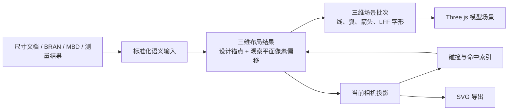

# SolveSpace 风格三维尺寸绘制底层重构计划

> **状态：** 已确认，2026-07-23
> **取代：** `2026-07-19-dimension-system-roadmap.md` 中的屏幕 `LayoutResult`、Canvas2D viewport 和相关切换计划
> **依据：** ADR 0048、`CONTEXT.md`、`D:\work\plant-code\solvespace\src\drawconstraint.cpp`、`render/render.h`、`render/rendergl3.cpp`

## 目标

用一个批处理 Three.js 场景画家统一呈现用户尺寸、BRAN/MBD 图元和各测量工具的尺寸结果；实现与 SolveSpace 一致的设计锚点、观察平面、屏幕恒定尺度和 `FRONT` 语义。所有类型达到视觉、交互、版本和性能门槛后，一次性删除 Canvas2D、逐尺寸 Object3D、Sprite 和 CSS2D 尺寸绘制。

本计划只重构绘制与布局呈现链。尺寸文档、权限、恢复日志、评审持久化、测量计算、拾取、吸附、BRAN/MBD 契约继续复用。

## 非目标

- 不迁移焊缝、坡度和普通引线等非尺寸 Viewer 标注。
- 不增加新的渲染依赖。
- 不实现模型遮挡、物理标牌或世界字高模式。
- 不保留生产双渲染器或长期 feature flag。
- 不重写 BRAN/MBD 生成算法和各测量工具的计算逻辑。

## 权威数据流



三维布局顶点使用“设计空间锚点 + 观察平面像素偏移”的参数化表达。GPU 根据当前相机基向量、投影矩阵和锚点深度计算最终裁剪空间位置，因此：

- 测量锚点始终粘附真实模型位置；
- 箭头、延伸线和字形保持屏幕恒定尺寸；
- 相机运动时只更新共享参数，不重建全部 CPU 几何；
- 二维数据只由三维布局投影得到，不能反向成为绘制权威。

## 保留、替换与删除边界

| 类别 | 处理 |
| --- | --- |
| `src/dimension/domain/*`、`services/*`、权限、日志、评审仓库 | 保留；仅增加 `labelPinned` 及迁移 |
| BRAN/MBD 标准化适配器、`ExternalDimensionRegistry` | 保留并扩展来源 |
| 数值格式化、单位、主题角色、LFF parser/font | 保留；主题默认色改为深红 |
| 碰撞算法、命中索引、SVG 导出 | 保留算法，输入改为三维布局的投影结果 |
| `kernel/layout/*`、`kernel/types.ts`、`DimensionViewport` | 改为三维权威布局和投影派生数据 |
| `canvasPainter.ts` 与透明 Canvas overlay | 最终删除 |
| `AlignedDimension`、`AngleDimension` | 迁移测量来源后删除 |
| 四个 `Xeokit*Measurement` 渲染类 | 保留计算来源，删除 Line2/CSS2D 对象实现 |
| `usePipeDistanceAnnotationThree` | 改为外部尺寸适配后删除 |
| `AnnotationBase`、`AnnotationMaterials`、非尺寸标注、`SolveSpaceBillboardVectorText` | 保留，仍服务非尺寸工具 |

## 全局约束

- 设计空间仍使用米和弧度；相机、viewer recenter、像素偏移不得进入测量语义。
- 所有尺寸默认 `depthTest=false`、`depthWrite=false`，使用固定 render order。
- 默认深红，hover 黄色，selected 亮红；失效和近似使用独立警示色。
- 尺寸值沿尺寸线并自动正读；设备编号、坐标和多行说明保持视口水平。
- 默认实心三角箭头；空间不足自动外翻；外部显式箭头不重复生成。
- 尺寸线和引线按 LFF 字形边界裁切；默认无文字底板。
- 每视口只有一个尺寸场景根节点；对象、材质、几何和 draw call 数量只能随样式批次增长。
- 当前工作树包含大量无关改动。实施时只暂存本计划明确涉及的文件，不得顺带格式化、删除或提交其他修改。

---

## MDU 0：冻结基线与验收数据

### 任务

- [ ] 记录当前分支、HEAD、脏文件清单以及尺寸专项测试基线。
- [ ] 固定四类规范尺寸、MBD V2 显式图元和测量结果的输入样例。
- [ ] 固定 AMS DB 7997、BRAN `24381_145018` 的加载步骤与期望锚点/数值。
- [ ] 固定版本对比样例：DB 7997、组件 `24381_145018`、A sesno 897 / artifact 791、B sesno 898 / artifact 898。
- [ ] 保存当前合成 10k/2k benchmark 原始结果；现状不达标只能作为 before，不得降低 ADR 0040 门槛。
- [ ] 建立固定透视与正交相机快照，覆盖正视、斜视、旋转、缩放和近裁剪面。

### 产物

- `src/fixtures/dimensions/scene/`：小型确定性输入与三维 golden。
- `docs/verification/dimensions/`：真实模型步骤、截图和性能记录。
- 现有 `bran-24381_145018-version-compare.png` 只作历史证据；新的固定相机截图在最终画家落地后生成。

### 检查

```powershell
rtk npm run type-check
rtk npx vitest run src/dimension src/testing/dimensionLegacyRemovalGuard.test.ts
rtk npm run perf:dimensions:kernel
rtk npm run perf:dimensions:browser
```

### 退出条件

输入、相机、版本和性能采样方式均可重复，不依赖人工临时拖动得到结果。

---

## MDU 1：文档级标签固定

### 修改

- `src/dimension/domain/types.ts`
- `src/dimension/domain/document.ts`
- `src/dimension/domain/commands.ts`
- `src/dimension/domain/reducer.ts`
- `src/dimension/domain/migrationV5.ts`
- `src/dimension/adapters/reviewSnapshotAdapter.ts`
- `src/dimension/adapters/normalizeUserDimensions.ts`
- `src/dimension/interaction/editSession.ts`
- 对应现有测试与固定样例

### 任务

- [ ] 将用户尺寸文档 schema 升级一版，并为每条用户尺寸增加 `labelPinned`。
- [ ] 旧文档和 V5 数据迁移时写入 `labelPinned=false`。
- [ ] 标签拖拽在一个事务中同时保存语义 placement 和 `labelPinned=true`。
- [ ] “恢复自动布局”只把 `labelPinned` 改回 `false`，不改测量锚点。
- [ ] undo/redo、恢复日志和评审快照完整往返该字段。
- [ ] 外部只读来源继续由适配器决定是否固定，不写入用户文档。

### 检查

```powershell
rtk npx vitest run src/dimension/domain/reducer.test.ts src/dimension/domain/migrationV5.test.ts src/dimension/interaction/editSession.test.ts src/dimension/adapters/reviewSnapshotAdapter.test.ts
rtk npm run type-check
```

### 退出条件

手工位置不会再被自动避让覆盖；旧文档无需人工修复即可加载。

---

## MDU 2：三维布局权威模型

### 修改

- `src/dimension/kernel/types.ts`
- `src/dimension/kernel/layout/context.ts`
- `src/dimension/kernel/layout/{linear,projected,angular,radial,explicit}.ts`
- `src/dimension/kernel/geometry/*`
- `src/dimension/kernel/glyph/*`
- `src/dimension/kernel/viewport/layoutViewport.ts`
- `src/dimension/kernel/collision/resolveLabelCollisions.ts`
- `src/dimension/kernel/hit/*`
- `src/dimension/export/svgOverlay.ts`

### 任务

- [ ] 新增三维线、路径、三角箭头、标记和 LFF 字形图元；每个顶点保存设计锚点与观察平面像素偏移。
- [ ] 四类用户尺寸直接产出三维图元，不再先产出 `ScreenLine`/`ScreenGlyphRun`。
- [ ] MBD 显式线、弧、圆、点、文字和参考框转换为同一三维图元。
- [ ] 实现工程文字旋转和正读翻转。
- [ ] 使用字形边界裁切尺寸线与引线。
- [ ] 实现实心三角箭头的内侧/外侧判定；显式 MBD 箭头保持原样。
- [ ] 从三维布局投影出碰撞、命中和 SVG 所需的二维快照。
- [ ] 自动碰撞只修改显示像素偏移；固定标签不参与移动。
- [ ] 在迁移期间允许旧屏幕类型留作测试兼容，但禁止新增生产调用；MDU 6 必须删除。

### 最小检查

- 三维 golden 精确验证设计锚点、图元拓扑和文字方向。
- 投影 golden 分别覆盖透视与正交相机。
- 相机旋转后数值和锚点不变，只有显示平面和正读方向变化。
- 碰撞后的像素偏移不得回写文档。

```powershell
rtk npx vitest run src/dimension/kernel src/dimension/export/svgOverlay.test.ts
rtk npm run type-check
```

### 退出条件

三维布局可在无 DOM、无 Canvas、无 Three Scene 的纯测试环境中确定性生成和投影。

---

## MDU 3：单一批处理 Three.js 场景画家

### 新增或替换

- `src/dimension/viewport/scenePainter.ts`
- `src/dimension/viewport/dimensionViewport.ts`
- `src/dimension/viewport/threeViewportProjector.ts`
- `src/debug/dimensionKernelDemo.ts`
- `src/debug/dimensionPerf.ts`

### 任务

- [ ] 实现一个场景根 `Group`，按图元族与样式角色维护少量 `BufferGeometry + ShaderMaterial` 批次。
- [ ] 线、弧和 LFF 字形使用共享线段批次；实心箭头使用共享三角形批次。
- [ ] shader 只接收必要的设计锚点、像素偏移和共享相机参数；不得创建每尺寸或每字形对象。
- [ ] 所有尺寸材质关闭深度测试和深度写入，并使用稳定 render order。
- [ ] 相机运动期间只更新共享 uniform 并请求 Viewer 渲染。
- [ ] 数据、主题、交互状态或停稳后的碰撞结果变化时才重建对应批次 buffer。
- [ ] 字形 trace 按字体、字高和文本缓存；资源由画家统一释放。
- [ ] idle viewport 不产生尺寸布局、buffer 上传或额外 RAF。
- [ ] 把 demo/perf harness 改为 WebGL 场景，不再依赖 Canvas2D。

### 检查

- 100 条和 2,000 条同样式尺寸拥有相同数量的场景对象、材质和渲染批次。
- 连续 orbit/pan/zoom 不重建全部 CPU buffer。
- mount/dispose 循环后场景无残留对象，几何和材质均释放。
- hover/selected 只更新受影响的样式批次。

```powershell
rtk npx vitest run src/dimension/viewport/dimensionViewport.test.ts src/dimension/viewport/threeViewportProjector.test.ts
rtk npm run perf:dimensions:browser
rtk npm run type-check
```

### 退出条件

独立 WebGL harness 可完整绘制四类尺寸和 MBD 显式图元，且没有生产切换。

---

## MDU 4：Viewer、交互与导出接线

### 修改

- `src/dimension/facade/createDimensionSystem.ts`
- `src/dimension/viewport/viewerBindings.ts`
- `src/dimension/interaction/pointerController.ts`
- `src/components/dock_panels/ViewerPanel.vue`
- `src/dimension/export/{svgOverlay,composePng}.ts`
- `src/dimension/ui/*`

### 任务

- [ ] `DimensionViewerAdapter` 提供 Three Scene、相机、设计到世界矩阵、viewport 尺寸和 `requestRender`；移除 overlay canvas 参数。
- [ ] `DimensionViewport` 把场景画家挂到 DTX Viewer 的同一 Three Scene。
- [ ] 相机运动时保留最后稳定的命中快照；pointerdown 前强制刷新当前投影，避免拖拽旧位置。
- [ ] 相机停止后只执行一次投影、碰撞、命中索引和必要 buffer 更新。
- [ ] 标签拖拽仍通过现有语义 placement 事务，不直接移动 Object3D。
- [ ] 增加“恢复自动布局”命令和可访问 UI。
- [ ] SVG 从投影快照导出；PNG 直接使用已包含尺寸场景的 Viewer framebuffer，不再叠加 Canvas。
- [ ] 保持选中属于文档、hover/拖拽预览属于视口的现有语义。

### 检查

```powershell
rtk npx vitest run src/dimension/facade/createDimensionSystem.test.ts src/dimension/viewport/viewerBindings.test.ts src/dimension/interaction src/dimension/export src/dimension/ui
rtk npm run type-check
```

### 退出条件

开发入口可在真实 Viewer 场景中完成创建、选择、拖拽、固定、恢复自动、SVG 和 PNG；旧 Canvas 仍未删除但不得与新画家同时显示。

---

## MDU 5：所有生产尺寸来源迁移

### 修改

- `src/dimension/services/externalDimensionRegistry.ts`
- `src/dimension/adapters/*ExternalDimensions.ts`
- `src/composables/useMeasurementAnnotation.ts`
- `src/composables/useXeokitMeasurementTools.ts`
- `src/composables/usePipeDistanceAnnotationThree.ts`
- `src/components/pipe-distance/PipeDistanceDrawer.vue`
- `src/components/dock_panels/ViewerPanel.vue`
- `src/utils/three/annotation/index.ts`

### 任务

- [ ] 保持用户尺寸、BRAN、MBD v1/v2 现有输入，禁止重复渲染。
- [ ] 把 `MeasurementAnnotationManager` 的距离/角度结果映射为只读外部尺寸记录。
- [ ] 把 Xeokit 距离、角度、高程点、高程差结果映射为只读外部尺寸记录；保留拾取、吸附、计算和 Store。
- [ ] 把 `PipeDistanceResult` 映射为只读外部尺寸记录；保留检测、严重度、Store 和 Drawer。
- [ ] 外部来源以稳定 source key 替换自己的快照，卸载时清空，不能污染用户文档。
- [ ] 为每个来源验证数值、设计锚点、显示角色、隐藏和生命周期。
- [ ] 非尺寸焊缝、坡度和普通引线继续通过共享标注系统渲染。

### 检查

- 同一测量结果只出现一份图元。
- 删除/隐藏/重新计算后无幽灵批次。
- 用户尺寸与外部只读尺寸权限保持隔离。

```powershell
rtk npx vitest run src/dimension/adapters src/dimension/services/externalDimensionRegistry.test.ts src/composables/useXeokitMeasurementTools.test.ts src/composables/usePipeDistanceAnnotationThree.test.ts
rtk npm run type-check
```

### 退出条件

生产代码扫描不再发现任何尺寸结果直接执行 `scene.add(Object3D)`、创建 CSS2D 尺寸标签或 Sprite 尺寸文字。

---

## MDU 6：版本对比独立尺寸批次

### 修改

- `src/components/dock_panels/ViewerPanel.vue`
- `src/components/model-version/ModelVersionComparePanel.vue`
- `src/components/model-version/VersionTimelinePanel.vue`
- `src/composables/useVersionTimelineStore.ts`
- `src/dimension/viewport/dimensionViewport.ts`
- 版本数据加载与 MBD/BRAN source adapter

### 任务

- [ ] 为普通视图、A 版本和 B 版本维护独立批次槽位。
- [ ] `renderModelUnitCompareScene` 每个 render pass 只显示对应版本批次。
- [ ] 外部 BRAN/MBD 使用各自 release/sesno 数据生成。
- [ ] 用户尺寸在 A、B 各自解析语义锚点；单侧失败只把该侧标为失效。
- [ ] 切换版本、退出 split、卸载组件时释放旧版本 buffer。
- [ ] 同一相机下两侧保持一致的文字尺寸、颜色和朝向规则。
- [ ] 不把当前版本的三维几何直接复制到 A/B。

### 真实验收

1. 加载 DB 7997 的最小交付单元 `24381_145018`。
2. 固定 A：sesno 897 / artifact 791。
3. 固定 B：sesno 898 / artifact 898。
4. 进入三维分屏，验证 `24381_145019` 的修改只反映在对应侧模型和对应侧尺寸锚点。
5. 往返退出/进入分屏三次，确认批次、选择和相机状态无泄漏。

### 退出条件

不同版本模型和版本尺寸批次一一对应；单侧缺失或失效不会污染另一侧。

---

## MDU 7：原子切换并删除旧绘制底层

该 MDU 必须作为一个可独立回滚的切换提交完成。前六个 MDU 只能新增或迁移不可见能力，不得提前删除生产回退路径。

### 删除

- `src/dimension/viewport/canvasPainter.ts`
- `src/dimension/viewport/canvasPainter.test.ts`
- `src/utils/three/annotation/annotations/AlignedDimension.ts`
- `src/utils/three/annotation/annotations/AlignedDimension.test.ts`
- `src/utils/three/annotation/annotations/AngleDimension.ts`
- `src/utils/three/annotation/annotations/AngleDimension.test.ts`
- 四个 `Xeokit*Measurement` 渲染类及只验证旧渲染实现的测试
- `usePipeDistanceAnnotationThree.ts` 的独立绘制实现及旧 harness
- `ViewerPanel.vue` 的 `dimensionOverlayCanvas`
- `src/assets/main.scss` 的 `.dimension-viewport-overlay`
- 旧屏幕 `LayoutPrimitive` 绘制契约和只服务 Canvas 的 geometry helper

### 保留

- 非尺寸 Annotation 系统、CSS2DRenderer 及其焊缝/坡度/普通引线调用。
- `SolveSpaceBillboardVectorText`，只要仍有非尺寸生产调用。
- LFF 字体资源与 parser。
- SVG 投影导出、屏幕命中索引和碰撞算法。

### 任务

- [x] 切换 `createDimensionSystem` 和 Viewer 生产接线到场景画家。
- [x] 删除 `DIMENSION_V2_DEV` 的 Canvas/生产双路由含义；生产只有一个尺寸画家。
- [x] 更新 `src/utils/three/annotation/index.ts` 导出。
- [x] 扩展 `dimensionLegacyRemovalGuard.test.ts`，禁止旧 Canvas、CSS2D 尺寸类、Sprite 管道间距和逐尺寸 Object3D 重新进入生产。
- [x] 更新 ADR 0011、0041 和旧计划状态。
- [ ] 用 CodeGraph 验证被删文件无生产 importer。

### 检查

```powershell
rtk npx vitest run src/dimension src/testing/dimensionLegacyRemovalGuard.test.ts
rtk npm run type-check
rtk npm run build
```

### 回滚

只回滚本 MDU 的切换提交即可恢复旧生产路径；前六个 MDU 的未接线代码不影响生产。不得用长期 feature flag 代替该回滚策略。

---

## MDU 8：发布门槛

### 确定性门槛

- 四类用户尺寸和全部 MBD 显式图元的三维 golden 通过。
- 透视/正交投影、文字正读、箭头外翻、字形裁线和命中 golden 通过。
- `labelPinned` 文档迁移、拖拽、撤销和恢复自动布局通过。
- 100 与 2,000 条同样式尺寸的批次数量相同。

### 真实模型门槛

| 场景 | 操作 | 必须结果 |
| --- | --- | --- |
| AMS DB 7997 | 加载、聚焦、orbit、pan、zoom | 尺寸锚点不漂移，文字恒定可读，无荧光重叠线 |
| BRAN `24381_145018` | 加载模型与 BRAN/MBD 标注 | 模型、尺寸值、箭头、引线和参考框语义正确 |
| 管道间距 | 创建/隐藏/重算结果 | 只出现统一画家的一份只读尺寸 |
| A/B 版本对比 | 897/791 对 898/898 | 两侧模型和尺寸批次独立，修改与失效不串侧 |

### 性能门槛

- 10,000 条已加载、2,000 条可见。
- 1920×1080、DPR 2。
- 相机交互目标 60 FPS。
- 尺寸 layout → projection → collision → batch update p95 ≤ 16 ms。
- pointer hit-test p95 ≤ 2 ms。
- 相机运动帧不得全量重建 CPU buffer。
- 静止两秒后尺寸系统不得持续请求 RAF 或上传 buffer。
- 连续挂载/卸载 20 次后场景对象、几何和材质数量回到基线。

### 视觉门槛

- 固定相机截图使用容差比较，不要求跨 GPU 像素完全一致。
- 几何锚点、测量值和箭头方向必须由确定性断言验证，截图不能替代语义检查。
- 默认呈现接近目标参考图：深红工程线、实心箭头、沿线尺寸值、水平多行说明、无文字底板。

### 最终命令

```powershell
rtk npx vitest run src/dimension src/testing/dimensionLegacyRemovalGuard.test.ts
rtk npm run perf:dimensions:kernel
rtk npm run perf:dimensions:browser
rtk npm run type-check
rtk npm run build
rtk npm run test:e2e
```

真实 Web Server 联调必须通过 HTTP 页面与浏览器执行，不以纯 Vitest 模拟代替 AMS、BRAN 和版本加载。

---

## 建议提交边界

1. `feat(dimensions): persist pinned label placement`
2. `feat(dimensions): add authoritative scene layout`
3. `feat(dimensions): add batched three scene painter`
4. `feat(dimensions): wire scene painter interaction and export`
5. `refactor(dimensions): route measurement sources through shared painter`
6. `feat(dimensions): render version-scoped dimension batches`
7. `refactor(dimensions): cut over and delete legacy painters`
8. `test(dimensions): add real-model visual and performance gates`

每个提交只暂存本计划文件清单中的实际改动。当前工作树的其他改动归用户所有，不得一并提交或清理。

## 完成定义

只有同时满足以下条件才算完成：

- 生产运行时只有一个尺寸绘制入口；
- Canvas、逐尺寸 Object3D、Sprite 和 CSS2D 尺寸路径已删除；
- 非尺寸标注无回归；
- AMS 7997、BRAN `24381_145018` 和 A/B 最小交付单元通过真实浏览器验证；
- ADR 0040 性能门槛通过；
- CodeGraph 无旧尺寸绘制生产 importer；
- 类型检查、构建和专项测试零新增失败。
