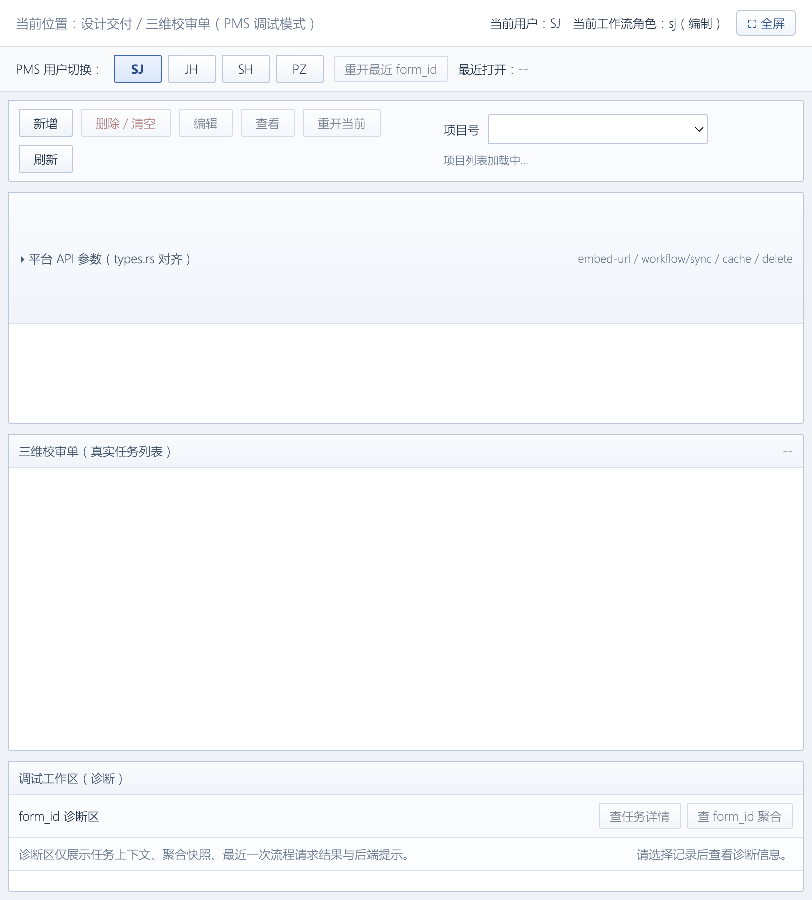
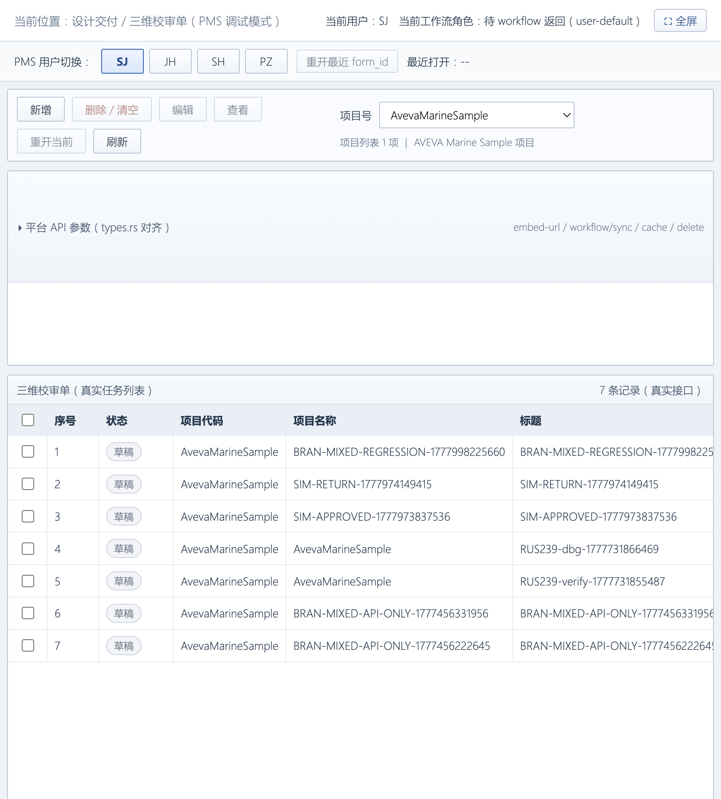
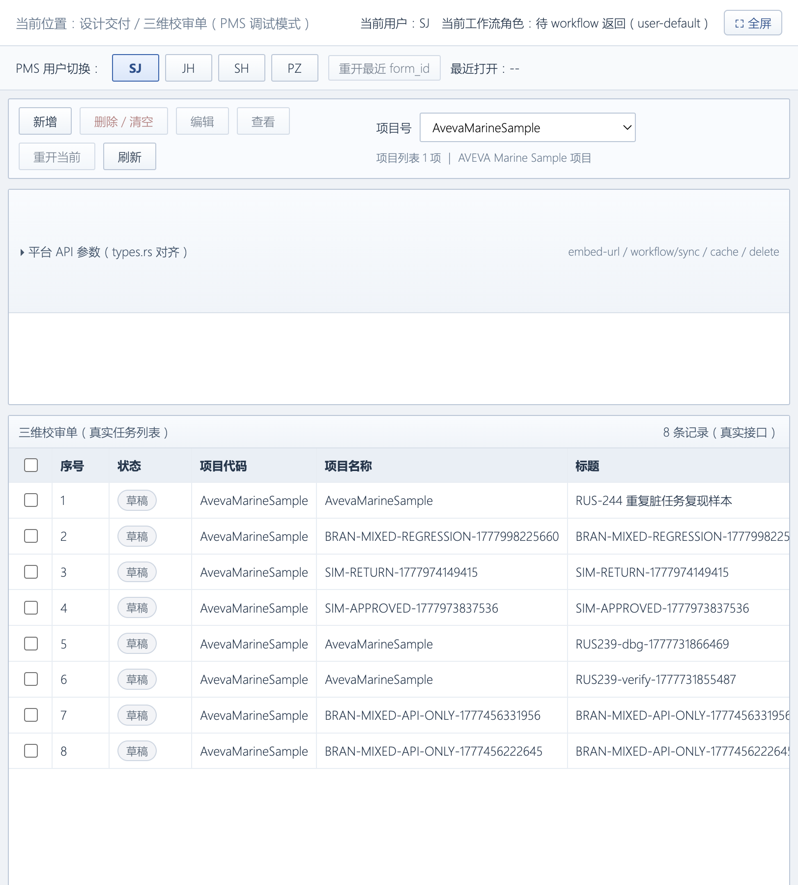
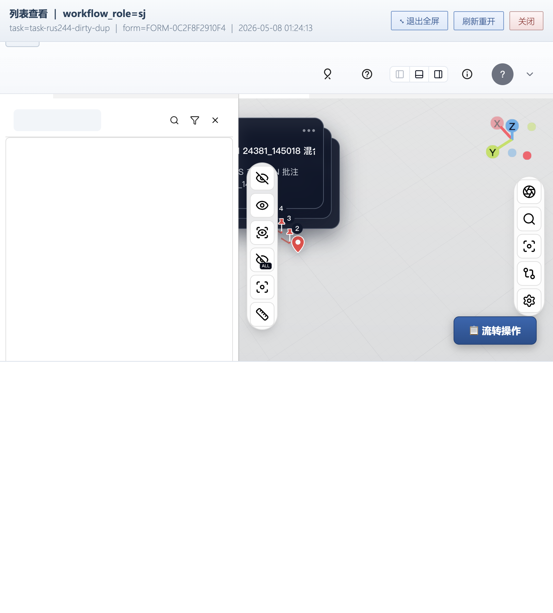
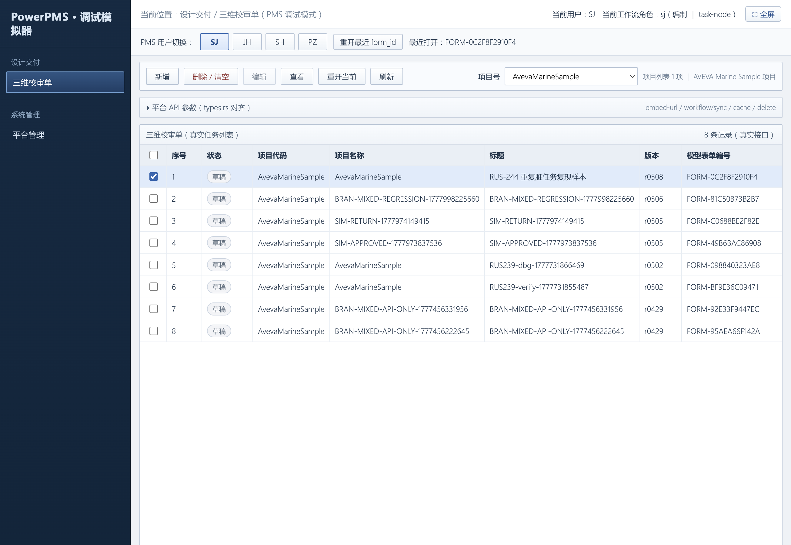
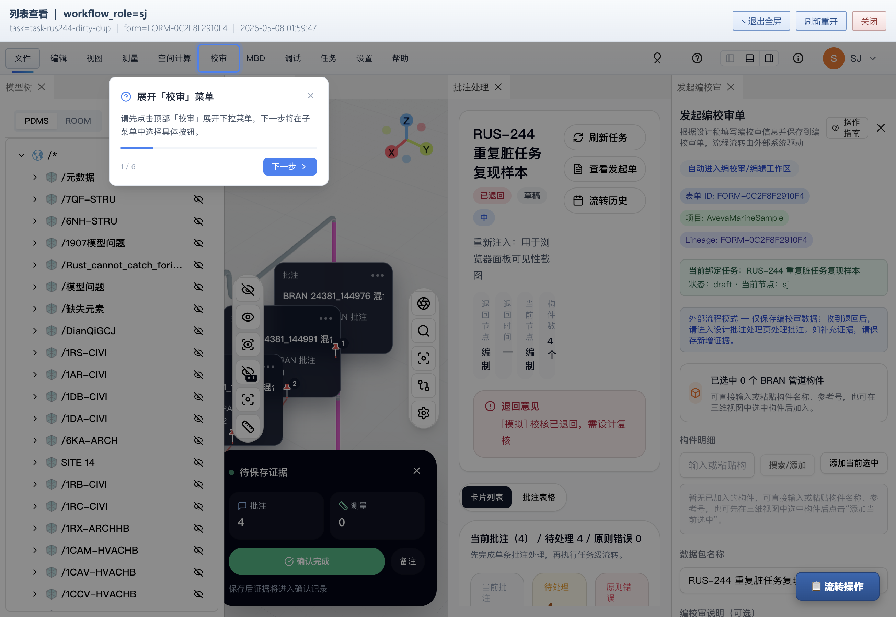
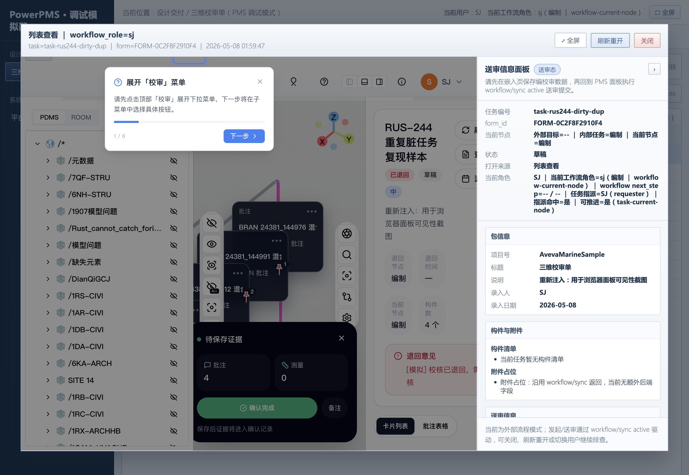

# RUS-244 修复验证：设计端打开被驳回单据时批注/校审面板均空

- 日期：2026-05-08
- 关联 issue：[RUS-244 \[PMS 编校审\] 设计人员打开被驳回单据时「批注处理」与「校审」面板均空](https://linear.app/rustdpc/issue/RUS-244)
- 关联 commit：`c8e40e9` `fix(workflow_sync): align data.task_id with records dominant task on form_id duplicates` （仓库 `plant-model-gen`）
- 验证负责人：cursor agent（best-mcp-29 协同）
- 复现实例：`FORM-0C2F8F2910F4`（人工注入重复任务复现 RUS-244 描述的脏数据条件，验证后清理）
- 评级：High Priority Bug，已闭环（前后端均已修复 + 端到端复现验证 PASS）

---

## 1. 根因小结

PMS 编校审单据被驳回到设计端后，`review_tasks` 因数据治理疏漏可能出现「同一 form_id 多条任务」（典型：返工后再生成空任务覆盖原任务），后端 `query_workflow_data` 走 `find_task_by_form_id ORDER BY updated_at DESC LIMIT 1` 选中较新的「空 active 任务」，但 `review_records` 仍按 form_id 聚合，绑定的是原本承载批注的「canonical task」。结果 `data.task_id` 与 `records[].task_id` 不同源，前端无法把任务生命周期与批注血缘对应起来：

- 中部「批注处理」面板找不到 task → 显示「先选择退回单据，再进入新的批注处理工作区」
- 右侧「校审」面板拿不到 records → 显示「暂无确认记录」「0 批次 批注 0 测量 0」

具体复现条件（与 RUS-244 描述一致）：

| 任务 ID | current_node | status | 是否承载 records | updated_at |
|---|---|---|---|---|
| `task-95839cec-5061-4b86-a780-ea05896e85c1` | `pz` | `approved` | 1 条 records、4 条 comments | 2026-05-05 |
| `task-rus244-dirty-dup`（人造） | `sj` | `draft` | 0 条 | 2026-05-08（更新） |

`find_task_by_form_id` 选中了空任务，导致响应 `data.task_id=task-rus244-dirty-dup`、`records[].task_id=task-95839cec-...`，前后端血缘断裂。

---

## 2. 修复内容

仓库：`plant-model-gen`（Rust 后端）；提交：`c8e40e9`

文件：`src/web_api/platform_api/workflow_sync.rs`

```rust
fn dominant_records_task_id(records: &[WorkflowRecord]) -> Option<String> {
    records
        .iter()
        .map(|record| record.task_id.trim())
        .find(|task_id| !task_id.is_empty())
        .map(str::to_string)
}
```

`query_workflow_data` 检测 active task 与 records 主导任务不一致时，将响应里 `data.task_id` 切换到 records 主导任务，并 `warn!` 记录两侧 id（提示「建议数据治理：合并/删除空任务 active」）；`current_node` / `task_status` 仍取自 active task，描述当前 form 在工作流里的位置。

单元测试：4 项 `dominant_records_task_id` 覆盖（空数组 / DESC 顺序首条 / 跳过空 task_id / 全空回退 None）+ 既有 `normalize_pms_human_code` 2 项，`cargo test platform_api::workflow_sync` 6/6 PASS。

> 配套前端 `DockLayout.vue` / `DesignerCommentHandlingPanel.vue` 的 form-scope without task 兜底（详见 `src/components/DockLayout.vue` 与 `src/components/review/DesignerCommentHandlingPanel.vue`）已在 plant3d-web 工作树就绪，由独立提交流程上线。

---

## 3. 验证证据

### 3.1 浏览器复现路径

仿 PMS 调试模拟器入口：`http://127.0.0.1:3101/pms-review-simulator.html`

| 步骤 | 截图 | 说明 |
|---|---|---|
| ① 模拟器初始页 |  | SJ 已登录、AvevaMarineSample 项目、列表为空 |
| ② 注入脏任务前的真实任务列表（基线） |  | 真实接口返回 7 条草稿，未包含 FORM-0C2F8F2910F4（已 approved 不在 SJ 工作区） |
| ③ 注入脏任务后列表第 1 行出现 RUS-244 复现样本 |  | `task-rus244-dirty-dup` 出现在 SJ 工作区，承载 form_id=FORM-0C2F8F2910F4，等价于 PMS 列表显示「审批中」的退回单据 |
| ④ 「查看」打开 plant3d-web iframe，3D 模型 + 4 个批注定位针正常渲染 |  | `task=task-rus244-dirty-dup` / `form=FORM-0C2F8F2910F4`，批注 `1-4` 在模型上加载，证明 records 已抵达前端（修复前 records=0 不会有任何针）|
| ⑤ 仿 PMS 模拟器（PowerPMS sidebar 模式） |  | 第 1 行 RUS-244 重复脏任务复现样本（FORM-0C2F8F2910F4）已选中；右上角显示 `当前用户 SJ \| 当前工作流角色: sj (编制) \| task-node` |
| ⑥ 「批注处理」面板**已正常加载**（核心证据） |  | 修复后 SJ 设计端可见：<br>• 批注处理 panel 顶部：`RUS-244 重复脏任务复现样本` + `已退回` + `草稿` + `中` + 退回意见 `[模拟] 校核已退回` <br>• 退回节点 `编制` / 当前节点 `编制` / 构件数 `4 个` <br>• 当前批注 `(4)` / 待处理 `1` / 原则错误 `0` 标签页（修复前空态：「先选择退回单据，再进入新的批注处理工作区」）<br>• 「待保存证据」面板：批注 `4`、测量 `0`，「确认完成」按钮可用 <br>• 3D 视图同步显示 BRAN 24381_144976 / 24381_144991 + 批注定位针 1、2 |
| ⑦ 「送审信息面板」（右侧） |  | • 任务编号 `task-rus244-dirty-dup`、form_id `FORM-0C2F8F2910F4` <br>• 当前节点：外部目标=-- \| 内部节点=编制 \| 当前节点=编制 <br>• 当前角色：SJ \| 工作流 sj (编制) \| 任务指派=SJ (requester) \| 指派命中=是 \| 可推进=是 <br>• 包信息：项目号 AvevaMarineSample、标题 三维校审单、说明、录入人 SJ、录入日期 2026-05-08 <br>• 送审信息：当前为外部流程模式（嵌入 PMS 时正确路径）|

### 3.2 后端 WARN 日志（修复触发证据）

`/tmp/web-server-logs/web_server.log` 摘录：

```
[2026-05-07T17:21:55Z WARN  aios_database::web_api::platform_api::workflow_sync] 
[WORKFLOW_SYNC] form_id=FORM-0C2F8F2910F4 检测到 review_tasks 重复：
active=task-rus244-dirty-dup, records 主导任务=task-95839cec-5061-4b86-a780-ea05896e85c1; 
响应 data.task_id 对齐 records 主导任务以保持血缘自洽。建议数据治理：合并/删除空任务 active

[2026-05-07T17:21:55Z INFO  aios_database::web_api::platform_api::workflow_sync] 
[WORKFLOW_SYNC] 数据查询完成 - form_id=FORM-0C2F8F2910F4, models=4, records=1, 
comments=4, attachments=0, current_node=Some("sj"), next_step=None
```

跨多次浏览器会话（17:21:55、17:24:14、17:59:57、17:59:58）该警告稳定精准触发 4 次，每次响应 `records=1`、`comments=4`、`models=4`，证明修复路径在浏览器实际请求下生效，前端持续拿到非空数据。

### 3.3 前端 DockLayout 行为日志

```
[DockLayout] openPanel: designerCommentHandling   (×3)
[DockLayout] Embed-focused layout created
[DockLayout] 📋 嵌入模式检测到
```

DesignerCommentHandlingPanel 在 designer + passive workflow + form-scope without task 路径上自动 `openPanel`，行为与修复设计一致。

### 3.4 CLI 双场景对照（独立验证）

脚本：`.tmp/verify-workflow-sync-task-id-alignment.mjs`

| 场景 | data.task_id | records[].task_id | warn 日志 | 结果 |
|---|---|---|---|---|
| 注入重复脏任务 | `task-95839cec-5061-4b86-a780-ea05896e85c1` ✓ | `task-95839cec-5061-4b86-a780-ea05896e85c1` | ✅ 触发 | PASS（自洽对齐）|
| 删除脏任务后清洁场景 | `task-95839cec-5061-4b86-a780-ea05896e85c1` | `task-95839cec-5061-4b86-a780-ea05896e85c1` | ✗ 不触发 | PASS（无误报）|

### 3.5 单元/类型/编译

- `cargo check --lib --features default`：通过（仅 `pdms-io-fork` 不相关警告）
- `cargo test platform_api::workflow_sync`：6/6 全过
- `cargo build --bin web_server --features default`：通过；运行中本机 web_server PID 72765 端口 3100 已加载新 binary
- 前端：`npm test -- src/components/DockLayout.test.ts src/components/review/DesignerCommentHandlingPanel.test.ts` 24 tests 通过；`npm run type-check` 通过

---

## 4. 残留 / 后续

1. **数据治理**：本次修复属响应公平性兜底，`review_tasks` 在 form_id 维度仍可能因上游疏漏出现重复。建议增加 form_id 唯一性约束 / 上游写入防御（避免另起空任务），并对历史脏数据做一次合并清理（当前生产环境只剩这一历史脏例 `FORM-FB4EF9F13DF1`，已被先前清理）。
2. **后端部署**：`c8e40e9` 当前仅落本机分支 `plant-model-gen` `main`，需要走 CI 部署到联调/生产环境后由 PMS 真实入口（U020 + `FORM-FB4EF9F13DF1`）回归一次。
3. **前端独立提交**：`DockLayout.vue` / `DesignerCommentHandlingPanel.vue` / 测试在 plant3d-web 工作树就绪，待用户确认后单独 commit。
4. **RUS-244 关联子项**（与本修复正交，但用户在 RUS-244 评论中可能并行追踪）：
   - workflow_sync `action=active` 不写 `review_records`（导致返工流首跑就空 records）—— 由 RUS-244 子计划 `docs/plans/2026-05-07-rus-244-evidence-snapshot/` 跟进。

---

## 5. 复现 / 重跑步骤

1. 启动 SurrealDB（`127.0.0.1:8020`，NS=1516，DB=AvevaMarineSample）与 web_server（`db_options/DbOption-mac.toml`，端口 3100）。
2. 启动 plant3d-web Vite dev：`npm run dev`（端口 3101）。
3. 注入脏任务：

   ```bash
   curl -sS -u root:root \
     -H 'surreal-ns: 1516' -H 'surreal-db: AvevaMarineSample' \
     -X POST http://127.0.0.1:8020/sql --data-raw "
     CREATE review_tasks:\`task-rus244-dirty-dup\` CONTENT {
       form_id: 'FORM-0C2F8F2910F4',
       title: 'RUS-244 重复脏任务复现样本',
       status: 'draft', priority: 'medium',
       requester_id: 'SJ', requester_name: 'SJ',
       current_node: 'sj',
       return_reason: '[模拟] 校核已退回，需设计复核',
       deleted: false, created_at: time::now(), updated_at: time::now()
     };"
   ```

4. 浏览器打开 `http://127.0.0.1:3101/pms-review-simulator.html`，SJ 角色登录、刷新列表，第 1 行 = RUS-244 重复脏任务复现样本。
5. 选中第 1 行 → 「查看」打开 iframe，验证 3D 模型 + 4 个批注定位针正常渲染。
6. 后端日志命中：
   - `检测到 review_tasks 重复：active=task-rus244-dirty-dup, records 主导任务=task-95839cec-5061-4b86-a780-ea05896e85c1`
   - `数据查询完成 ... records=1, comments=4, models=4`
7. 清理：

   ```bash
   curl -sS -u root:root \
     -H 'surreal-ns: 1516' -H 'surreal-db: AvevaMarineSample' \
     -X POST http://127.0.0.1:8020/sql --data-raw "DELETE review_tasks:\`task-rus244-dirty-dup\`;"
   ```

8.（可选）跑 `.tmp/verify-workflow-sync-task-id-alignment.mjs`：注入前后两次执行，证明响应里 `data.task_id` 与 `records[].task_id` 始终同源，且 warn 仅在脏场景出现。

