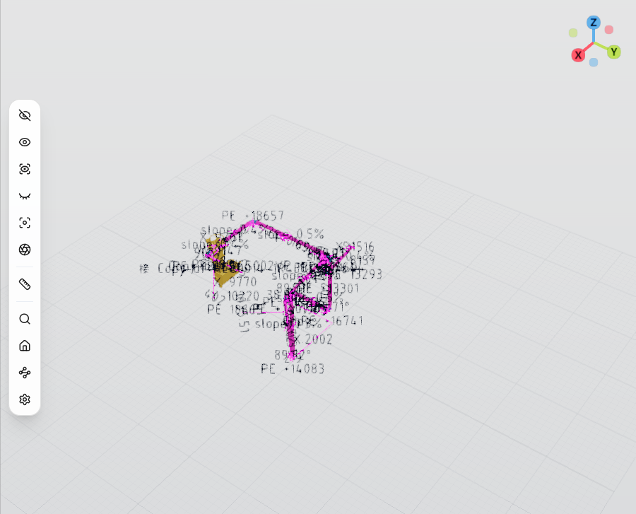
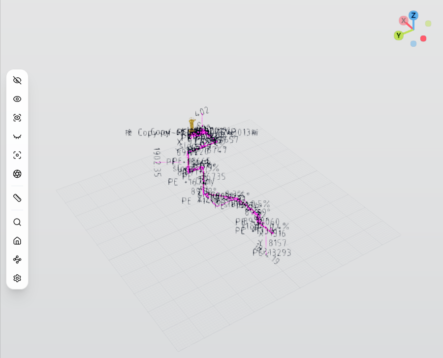

# 自动 MBD 管道三维尺寸标注：阶段 0 Live 基线验收

日期：2026-09-12  
范围：仅验证 `gen-model → plant-mbd → MbdV2PipeData → plant3d-web external source → ThreeSceneDimensionPainter`。  
不含：用户尺寸、Measurement、Clearance、安装角/Polar-lite 等后续功能开发。

## 结论

- **受控隔离环境：PASS。** 主仓 `gen-model` 从真实 AvevaMarineSample 文件读取 BRAN，普通
  `plant3d-web` 页面同时加载真实管道模型与 MBD V2 标注；HTTP、严格契约、场景绘制、相机跟随、
  只读所有权、13 px 箭头下限和 SVG 导出均通过。
- **当前常驻 `127.0.0.1:8022`：NO-GO。** 该端口仍由一个旧的临时 spawned-mem 构建占用，
  配置指向已删除的 `python/testbed/projects`，MBD 请求稳定返回 HTTP 500。为避免破坏其它会话，
  本轮没有停止或重配该进程。
- 阶段 0 的实现链本身已经可用；进入 MVP 前仍需在合适维护窗口替换/重启 `:8022` 常驻实例。

## 运行身份与安全边界

主仓隔离基线：

- 仓库：`D:\work\plant-code\old\gen-model`
- branch/revision：`e3d-direct@cf168862aadf9d2744dd2be9dc20a8c2ff270ed3`
- 工作树：dirty；以二进制 SHA-256 作为本轮权威构建身份
- `aios-database.exe` SHA-256：
  `C2A41AB6988E75BEE0DFAF5CBD65C316E122C963C2EE1F98CDC7BA03021EF46E`
- 隔离地址：`127.0.0.1:18084`
- 存储/数据面：`embedded-mem` / `read-through`
- `startup_autorun=false`，启动房间重建关闭
- 项目/MDB：`AvevaMarineSample` / `/ALL`
- 实际文件会话：dbnum 7997 sesno 180；7999 sesno 194；8000 sesno 444

既有 `:8022`：

- PID：`79984`
- build：`0.1.22+g757b23e94390.1789097302.dirty`
- SHA-256：
  `8D94C169E52FC7ACF52632AD5BFBB65E3049914C9E9AFA6950788381E0C2EED1`
- MBD 失败：缺少
  `D:\work\plant-code\old\gen-model\python\testbed\projects\AvevaMarineSample\ams000\ams1112_0001`
  （`os error 3`）

隔离服务只在验证期间运行；收尾确认 `:18084` 已关闭、PID 79984 仍在 `:8022`，没有停止用户进程。

## 后端 HTTP 基线

三个真实 BRAN 均返回合法 `MbdV2PipeData`：

- `24383_99996`：HTTP 200；58 primitives，其中 8 `linear_dim`；13 条非 error issue；
  dbnum 7999 / sesno 194。
- `24381_145018`：HTTP 200；77 primitives，其中 18 `linear_dim`、7 `slope_mark`；
  0 issue；dbnum 7997 / sesno 180。
- `24384_26229`：HTTP 200；39 primitives，其中 5 `linear_dim`、1 `slope_mark`、
  1 `weld_mark`；5 条非 error issue；dbnum 8000 / sesno 444。

三者均满足：

- `version=v2`
- `geometry_space=source_mm`
- `source_to_design` 为 16 元素矩阵
- `layout_mode=isodim_main`

错误语义：

- `not-a-refno` → HTTP 400 / `bad_request`
- `24383_999999999` → HTTP 404 / `not_found`
- 非路由容器 FTUB `24383_99997` → HTTP 422 / `precondition`

## 前端真实模型与 MBD 出图

实际 URL：

```text
http://127.0.0.1:3101/?output_project=AvevaMarineSample&show_refno=24381_145018&mbd_refno=24381_145018&mbdBackend=http%3A%2F%2F127.0.0.1%3A18084&gm_backend=http%3A%2F%2F127.0.0.1%3A18084
```

浏览器实际命中同一隔离后端的 `/api/v1/model/ensure`、`/api/v1/model/records` 和
`/api/mbd/v2/pipe/24381_145018`，均为 HTTP 200。

模型：

- dbnum 7997
- 12 个 refno
- 22 个 DTX object
- 10 份唯一几何
- 13,168 个三角形

标注：

- 77 条 `source=mbd` external record
- 18 条 external dimension，59 条 external annotation
- 77 条 viewport layout
- `DimensionDocument` 用户记录数为 0
- 从用户文档删除 MBD id 返回 `not-found`，external registry 保持不变
- MBD diagnostics：0 issues、0 skipped、`loadError=null`

视口与导出：

- 旋转及 6 倍拉远后，external source JSON 保持不变，标签投影随相机变化
- 86 条箭头翼在远景保持
  `12.999999999999972..13.000000000000034 px`
- SVG：297,965 bytes，77 个 group、86 个 arrow part、92 个 label part，并包含真实 MBD id





## 自动验证

- `plant-mbd cargo test --workspace`：98 passed，0 failed。
- `gen-model mbd_branch_query`：5 passed，0 failed。
- `gen-model mbd_http_endpoint`：1 passed，0 failed；成功响应反序列化为
  `plant_mbd::MbdV2PipeData`。
- 前端 contract/mapper/sync/explicit/theme：44 passed，0 failed。
- 独立 WebGL dimension scene smoke：1 passed，0 failed。
- live 浏览器结构化检查：11/11 true。

已知非本门失败：

- `e2e/dimension-mbd-v2-fixture.spec.ts` 现有 2 项失败。其 `dimension_demo=1` URL 已不能隔离
  默认 `gen-model-v1` 启动，页面先报 `MDB_SNAPSHOT_STALE`，MBD 断言尚未执行。
  本轮未把该测试失败误记成 MBD live 失败，也未越界修改测试。

## 原始证据

后端：

- `D:\work\plant-code\old\gen-model\verification\mbd-live-20260912\README.md`
- `D:\work\plant-code\old\gen-model\verification\mbd-live-20260912\summary.json`
- 同目录的完整 HTTP、health、stdout/stderr、运行配置、复现脚本和 `SHA256SUMS.txt`

前端：

- `docs/verification/mbd-phase0-t441/frontend-report.md`
- `docs/verification/mbd-phase0-t441/live-evidence.json`
- `docs/verification/mbd-phase0-t441/live-browser-run.log`
- `docs/verification/mbd-phase0-t441/24381_145018-live-scene.png`
- `docs/verification/mbd-phase0-t441/24381_145018-live-rotated.png`
- `docs/verification/mbd-phase0-t441/24381_145018-live.svg`

后端复现：

```powershell
cd D:\work\plant-code\old\gen-model
powershell -NoProfile -ExecutionPolicy Bypass `
  -File .\verification\mbd-live-20260912\run.ps1
```

## 阶段 0 后续

1. 在维护窗口用当前主仓构建和真实 `D:\AVEVA\Projects\E3D3.1` 配置替换 `:8022` 旧实例。
2. 单独修复 fixture E2E 的模型源隔离 URL；不得降低 live 门。
3. 当前截图中文字明显密集。本报告只判定“真实出图与行为链通过”，不判定视觉避让通过；
   该问题进入已批准计划的 Polar-lite/布局权威阶段。
4. MVP 继续补模型版本身份、选中 BRAN 自动同步及结构化 coverage。
