# 线上三维校审全流程验收（外部流程模式）——2026-09-28 部署 `c8c7bb24` 后实跑

> 目标：把 `plant3d-web` 部到 Ubuntu（`123.57.182.243`）之后，在**线上包**上把三维校审的完整操作走一遍并留证。
> 做法：模拟 PMS 后端直调模型中心（`auth/token → embed-url → workflow/verify → workflow/sync active/agree/return`），Playwright 无头 Chromium 驾驭线上嵌入页 `/review/3d-view` 真点（SJ 发起编校审、JH 批注 + 测量 + 确认当前数据、SJ「已修改」、JH「同意」、SH / PZ 复核），每步后端断言 + 截图。
> 脚本：`scripts/online-review-acceptance.mjs`（本目录的 `tc1-report.json` / `tc2-report.json` 就是它的输出）。关联：`../pms-3d-review-integration-e2e.md`（真实 PMS 三条案例）、`../三维校审批注与处理留痕操作教程.md`。

## 0. 结论先行

| 案例 | 单据 | 结果 | 模型中心 history |
| --- | --- | --- | --- |
| TC-1 正向全通 | `FORM-6485C84D52D3`（`task-e160ca4d-187c-473c-be03-0e0f2b5a769c`，包名 `ACCEPT-20260928-152353-TC1`） | **21 / 21 步通过**：`approved / approved / pz`，`records=1`（JH 的测量证据） | `sj submit → jd approve → sh approve → pz approve`（4 条） |
| TC-2 驳回回路 | `FORM-8F4B579C5582`（`task-b4391ccf-5002-4e8e-ab6e-637dbca91462`，包名 `ACCEPT-20260928-152925-TC2`） | **32 / 33 步通过**（唯一 ✗ 是脚本对设计侧终态落地页的选择器预期写错，页面本身正常，见 §4 第 8 步）：`approved`，批注 `r1 open/pending → r2 fixed/agreed` | `sj submit → jd return → sj submit(重提) → jd approve → sh approve → pz approve`（6 条） |
| 附带：首次 TC-2 试跑 | `FORM-17160EB8879B`（`task-2d81179d-8909-4eec-bf75-9dcae842d547`） | 脚本重试多注了 2 条批注而中止；顺带验到「1 条已修改 + 2 条待处理」时 `verify active` 被拦、`sync active` **409**——退回后必须逐条处理全部批注 | `sj submit → jd return`，停在 `sj` |

另一个与前端部署无关、但直接决定真实 PMS 能不能用的发现（§7）：**线上 3100 口被退役的 plant-model-gen `web_server` 占着**，PMS `ModelRootUrl` 仍指 `:3100`，PMS 侧 `PreValidate` 现回「接口连通失败」。

## 1. 部署

- 本机没有 `sshpass` / `rsync`、也没有服务器 root 密码，按 `deploy/README.md` 走仓库 GitHub Actions：`gh workflow run deploy-ubuntu.yml --ref main` → run [36441069764](https://github.com/happyrust/plant3d-web/actions/runs/36441069764) `success`（15:06:34Z 起，2 min 13 s：`npm ci → vite build → rsync → nginx -t ok → reload → Deployment finished`）。
- 部的是 `origin/main` = `c8c7bb24`（feat(model-version): add time selection and linked split view）。线上此前已是同一 commit（当天 12:36Z 从 `codex/version-compare` 部过），本次内容不变、只刷 buildDate。
- 校验：`http://123.57.182.243/version.json` 与 `https://` 同为 `{commit: c8c7bb24…, buildDate: 2026-09-28 15:10:37 UTC}`；首页 bundle `assets/index-B9dqJ_Re.js`；80 / 443 `Last-Modified: 15:10:37 GMT`；`/api/review/health` → `{status:ok, database:healthy}`，`/api/v1/health` ok。`:3100/version.json` → 404（见 §7）。

## 2. 环境与做法

| 项 | 值 |
| --- | --- |
| 站点 / 模型中心 | `http://123.57.182.243`（nginx 80：前端 + `/api` 反代 gen-model `:8022`），本机走直连（系统代理 `127.0.0.1:7890` 开着，Chromium 加 `--proxy-server=direct:// --proxy-bypass-list=*`，Node `fetch` 不吃系统代理） |
| 项目 / 构件 | `output_project=AvevaMarineSample`，BRAN `24381_145018` |
| 角色 token | `POST /api/auth/token {project_id, user_id, role}`：`SJ/sj`、`JH/jd`、`SH/sh`、`PZ/pz`（与 PMS 页面 `GetZyModeInfo` 同一条路） |
| 单据存根 | `POST /api/review/embed-url {project_id, user_id:SJ, workflow_role:sj, token}` → `data.query.form_id`（PMS 后端 `GetZyModelUrl` 做的事） |
| 流转 | `POST /api/review/workflow/verify`（= PMS `PreValidate`，不写库）+ `POST /api/review/workflow/sync action=active/agree/return`（= PMS `SyncRevInfo`），`actor {id,name,roles}` + `next_step {assignee_id,name,roles}` |
| 嵌入页 | `${BASE}/review/3d-view?form_id=…&user_token=<角色 JWT>&output_project=AvevaMarineSample&automation_review=1`，每个角色一个独立 browser context（独立 localStorage，避免本机草稿互串） |
| 浏览器 | Playwright 1.58 无头 Chromium，`--use-angle=swiftshader`，1800×1050 |
| 钩子 | SJ：`__plant3dInitiateReviewE2E.addMockComponent / getLastCreateResult`，其余按钮真点；JH：`__plant3dReviewerE2E.addMockAnnotation / addMockMeasurement / confirmData / getConfirmedRecordCount`；设计「已修改」与校核「同意」全部真点表格行 → 按钮 → 「提交处理结果 / 提交确认结果」 |
| 前端流程模式 | 外部流程模式（默认，未设 `plant3d_workflow_mode`）：嵌入页只展示节点 / 状态与批注处理，送审 / 同意 / 驳回由「PMS 后端」（脚本）调 `workflow/sync` |

## 3. TC-1 正向全通（23:24:55–23:25:48）

| # | 谁 | 操作 | 模型中心应变成 | 实测 |
| --- | --- | --- | --- | --- |
| 1 | PMS 后端 | `embed-url` 领 `FORM-6485C84D52D3` | `form.exists=true status=blank task_created=false` | ✓ |
| 2 | SJ | 嵌入页「发起编校审」面板 → 构件明细出现 `BRAN 24381_145018` → 填包名 → 真点「创建编校审数据」 | toast「编校审单创建成功」，`getLastCreateResult` 回 `task-e160ca4d…`；`query` → `draft / sj` | ✓（外部流程模式下面板无校核 / 批准下拉） |
| 3 | PMS 后端 | `verify active` → `sync active` | `passed:true, next_step:jd`；`form_status=active task_status=submitted current_node=jd` | ✓ |
| 4 | JH | 嵌入页「当前节点：校对 · 当前状态：待处理 · 外部流程模式 · 任务详情 1 构件 FORM-…」→ 加 1 条距离测量 → 「确认当前数据」 | `POST /api/review/records → 200`，toast「确认数据已保存」，`getConfirmedRecordCount=1`；`query records=1` | ✓ |
| 5 | PMS 后端 | JH `verify agree`（无待处理批注）→ `sync agree` | `passed:true`；`in_review / sh` | ✓ |
| 6 | SH | 打开嵌入页 | 「当前节点：审核」，外部流程模式 | ✓ |
| 7 | PMS 后端 | SH `sync agree` | `current_node=pz` | ✓ |
| 8 | PZ | 打开嵌入页 | 「当前节点：批准」 | ✓ |
| 9 | PMS 后端 | PZ `sync agree` | `form_status=approved task_status=approved` | ✓ |
| 10 | PZ | reopen | 「当前状态：已通过」，四节点全绿，测量回放在场景里，审核记录 1 · 历史流转 4 | ✓ |
| 11 | — | `GET /api/review/tasks/{id}/workflow` | 4 条 history | ✓ `sj submit by SJ / jd approve by JH / sh approve by SH / pz approve by PZ` |

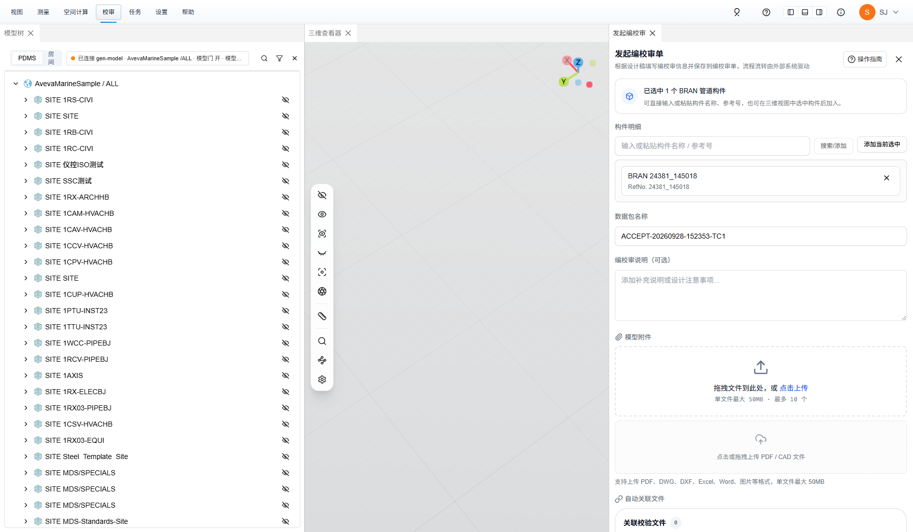

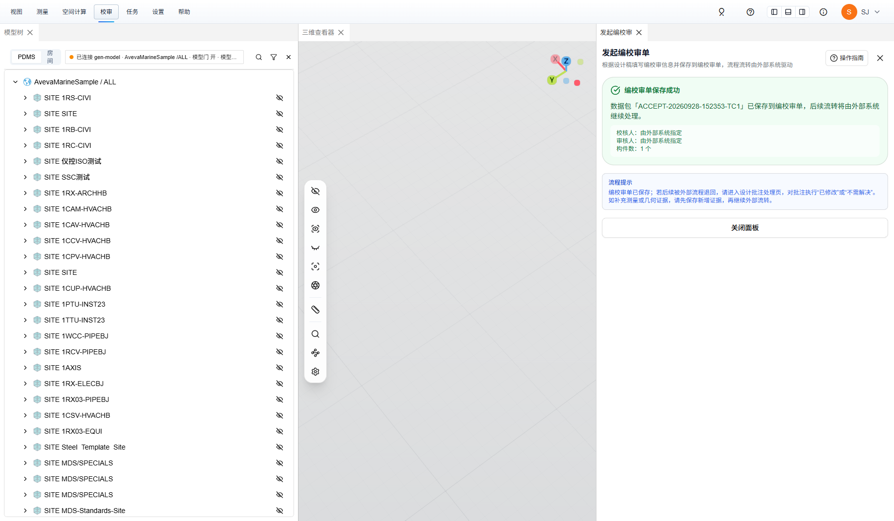

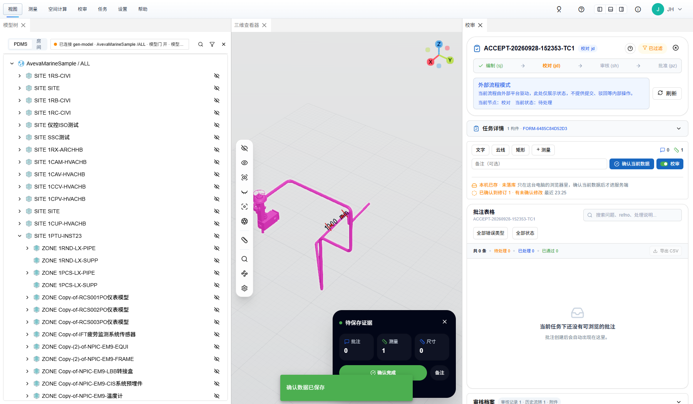


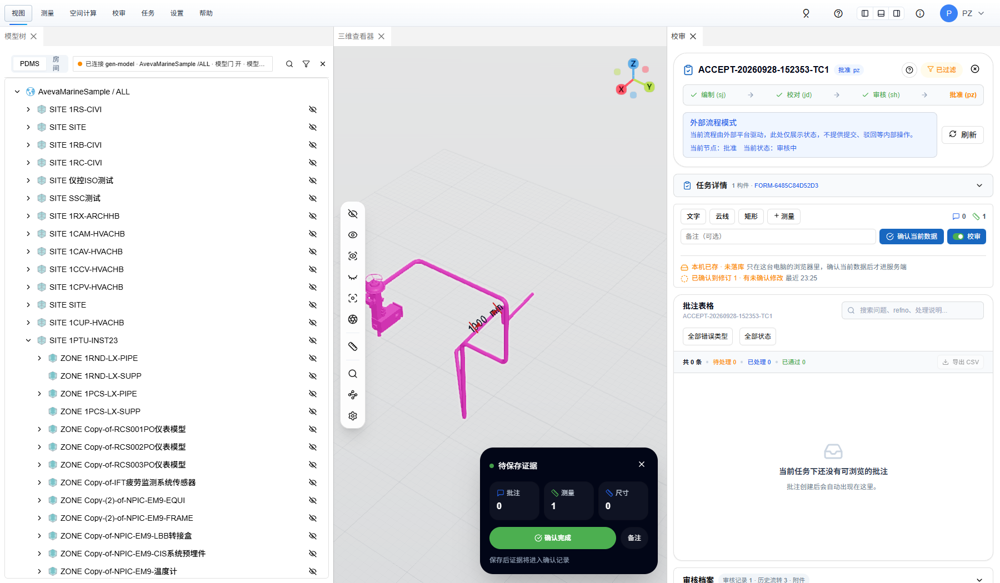


## 4. TC-2 驳回回路（23:30:28–23:33:06）

| # | 谁 | 操作 | 模型中心 / 页面应变成 | 实测 |
| --- | --- | --- | --- | --- |
| 1 | SJ / PMS 后端 | 发起 `FORM-8F4B579C5582` → `sync active` | `submitted / jd` | ✓ |
| 2 | JH | 加 1 条文字批注（挂 `24381/145018`）+ 1 条测量 → 「确认当前数据」 | `records 200`，`query records=1`；`annotation-states` `r1 open/pending` | ✓ |
| 3 | PMS 后端 | JH `verify agree`（带待处理批注） | **被拦**：`passed:false block_code=ANNOTATION_CHECK_FAILED「存在未处理批注，请逐条处理后再继续」` | ✓ |
| 4 | JH | 点开批注行 | 「同意」按钮**禁用**（设计侧未处理前不可同意） | ✓ |
| 5 | PMS 后端 | JH `sync return` | `draft / sj`（驳回后状态字仍是 draft，靠 history 判），history `+ jd return by JH` | ✓ |
| 6 | PMS 后端 | SJ `verify active`（直接重提） | **被拦**：`ANNOTATION_CHECK_FAILED「存在未处理批注，请逐条回复后再提交」` | ✓ |
| 7 | SJ | 嵌入页：顶部「打回原因：校对驳回：请处理批注后重提（线上验收）」、「仅处理已有批注」；批注表格 共 1 条 · 待处理 1 → 点行 → 「讨论与处理」→ **已修改** → 备注 → **提交处理结果** | `annotation-states/apply → 200 {reviewRound:2, resolutionStatus:fixed, decisionStatus:pending}`；行变「✓ 已修改」；`states r2 fixed/pending`（r1 原样保留） | ✓（备注占位符「处理备注（可选，例如修改说明）」，`aria-required` 无——已修改可不填） |
| 8 | PMS 后端 | SJ `verify active` → `sync active`（重提） | `passed:true`；`submitted / jd` | ✓ |
| 9 | JH | 嵌入页：行显「已修改」→ 点行 → **同意** → **提交确认结果** | `apply → 200 {r2 fixed/agreed, updatedById:JH}`；行变「★ 已同意」；统计「共 1 条 · 待处理 0 · 已处理 0 · 已通过 1」 | ✓（占位符「决定备注（可选，例如同意理由）」） |
| 10 | PMS 后端 | JH `agree` → SH `agree` → PZ `agree` | `sh → pz → approved / approved` | ✓ |
| 11 | SJ | 打开已批准的单 | 设计侧落地页没有校审面板：三维 + 回放的批注 / 测量（「待保存证据」卡 批注 1 · 测量 1） | 页面正常；脚本这一步等的是校审面板选择器，**记 ✗ 属脚本预期错**，已改成等 `review-confirmation` / `canvas` |
| 12 | — | history | 6 条 | ✓ `sj submit → jd return → sj submit → jd approve → sh approve → pz approve` |

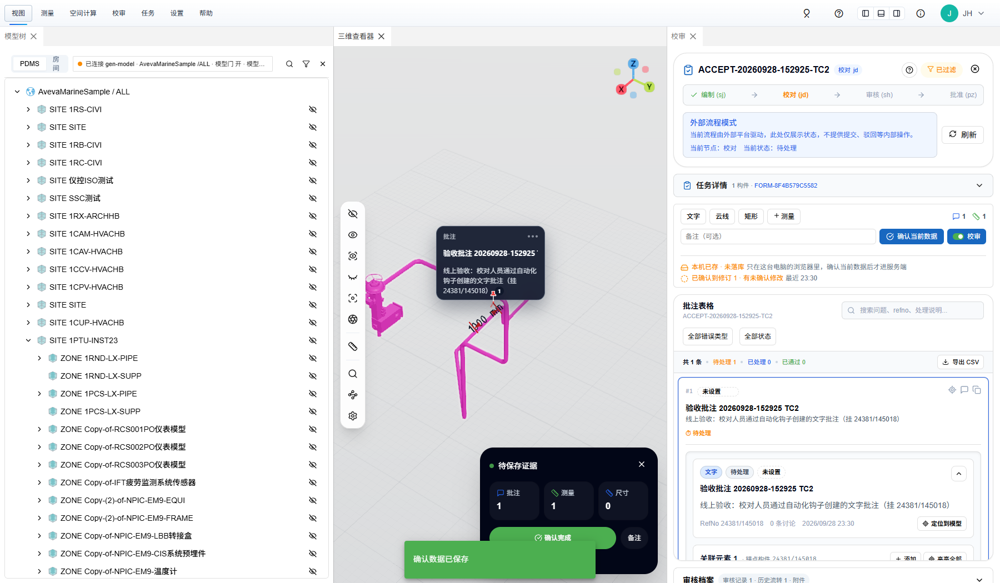

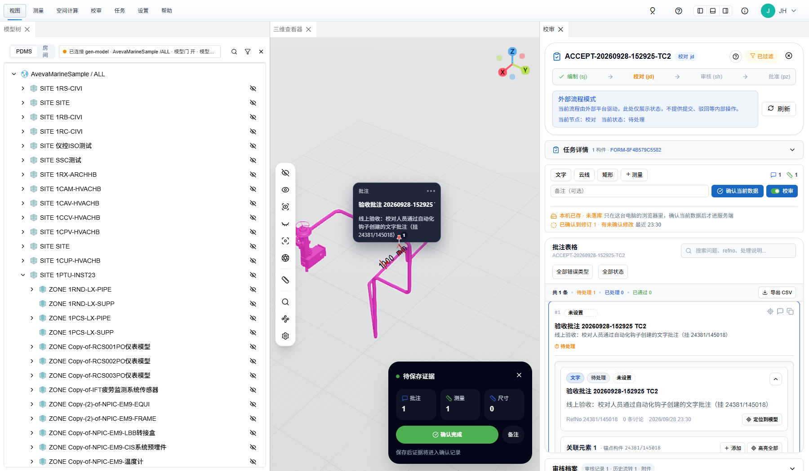

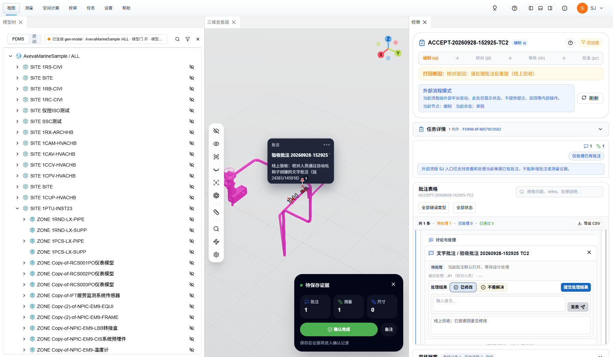

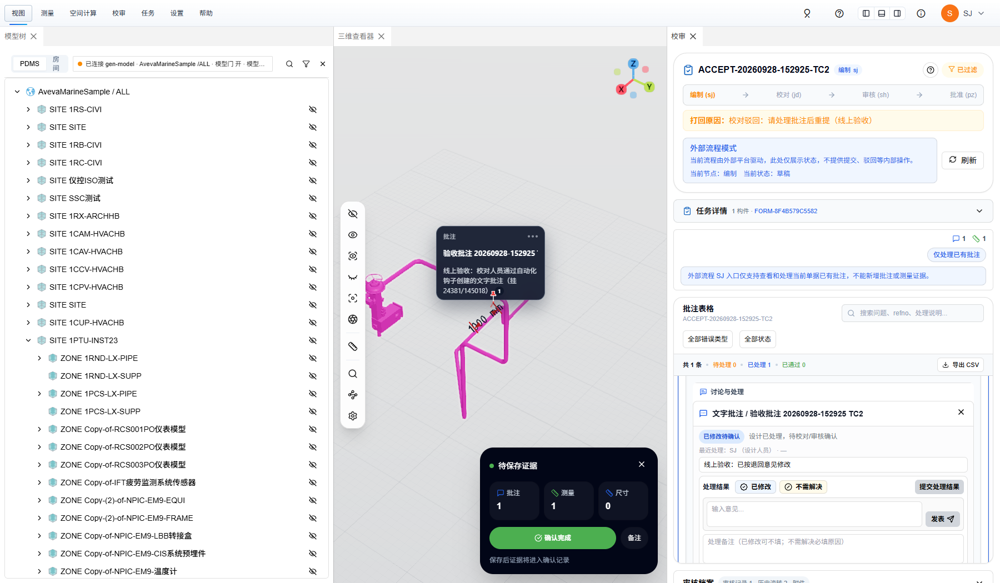

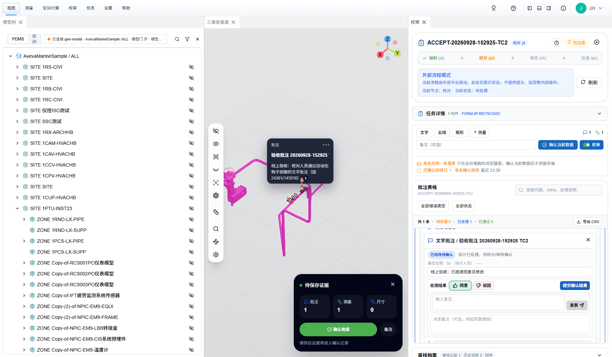

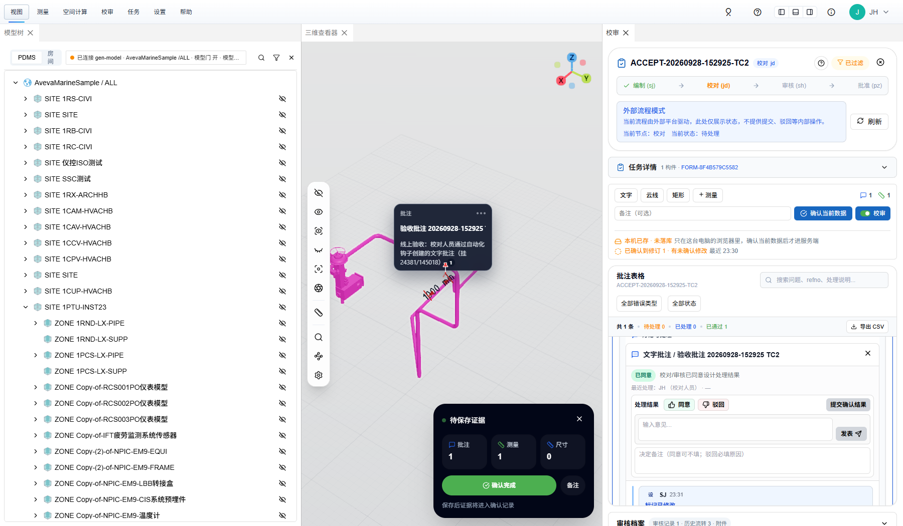

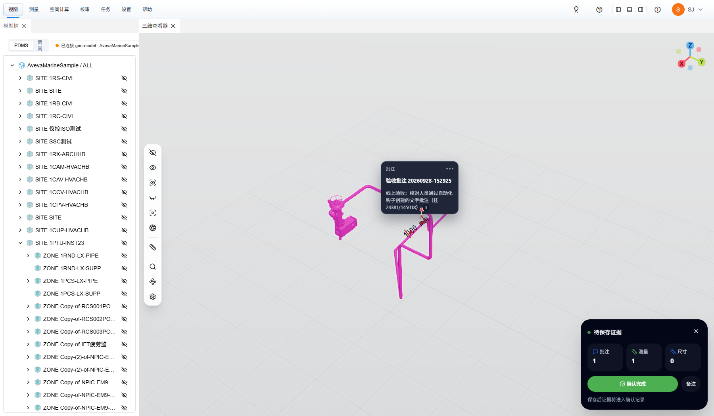

## 5. 首次 TC-2 试跑中止的附带验证（`FORM-17160EB8879B`）

脚本用「批注表格 共 N 条」判断草稿是否注入成功，而表格只列已落库批注、草稿不计，于是重试 3 次注了 3 条批注一起确认（`states` 三条 `r1 open/pending`）。之后 SJ 只把第 1 条点成「已修改」就重提：

- `verify active` → `passed:false ANNOTATION_CHECK_FAILED「存在未处理批注，请逐条回复后再提交」`
- `sync active` → **HTTP 409** 同一句话

即后端对教程里「退回后先处理完**全部**批注再重新发起」是硬约束，不是口径。这张单现停在 `sj` 节点（1 条 fixed/pending + 2 条 open/pending），可留作样本也可删。日志见 `run-tc1-and-aborted-tc2.txt` 后半段。

## 6. 前端观察（不阻塞流程）

1. **重提的 history 动作现在记为 `sj submit`**。09-21 的 e2e 文档 §5 第 2 条记的是「重提被记成 approve」，本次两张单都是 `submit`，口径已一致。
2. **reopen 已确认的单，回放后仍提示「有未确认修改」**：PZ / SJ 打开 approved 单，场景里回放出批注 / 测量后，浮层「待保存证据」卡显示 批注 1 · 测量 1 且「确认完成」可点，校审面板写「已确认到修订 1 · 有未确认修改」（图 06 / 13）。没有任何新增却提示有未确认修改，与 e2e 文档 §5.1 第 5 条「待核实」同源。本次是钩子造的测量（`entityId` 形如 `24381_145018:origin`），真手画是否同样未验；若成立，用户可能会误点「确认完成」再落一条重复记录。
3. **自动化时序**（真人不受影响）：嵌入页刚挂出 `__plant3dReviewerE2E` 就注入草稿，会被随后的 `applyProject` / 任务作用域切换（`refreshToolStorePersistedScope` → `applyPersistedState`）整体换掉——首轮实跑页面显示「本机 无草稿」、`confirmData` 无 POST（图 14）。脚本改为等模型加载提示消失 + 网络空闲后再注入，并用 `getAnnotationCount()` 而非表格计数判断。
4. 设计侧打开 approved 单没有校审面板（只有三维与回放），与 e2e 文档 §6.3.1「设计侧落地页没有校审面板」一致；SJ 想看批注单要点浮层「打开批注单」。

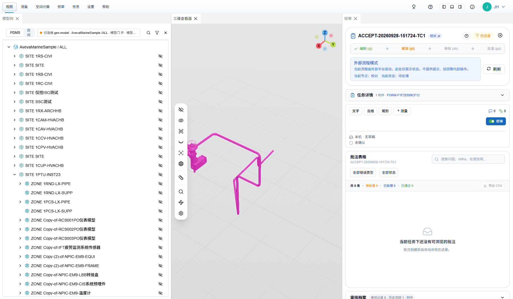

## 7. 线上 3100 口与真实 PMS 那一跳（需服务器或 PMS 侧处理）

| 探测（直连） | 80 口 | 3100 口 |
| --- | --- | --- |
| `GET /` | 200 `Server: nginx/1.24.0` | `307 → /console`，无 `Server: nginx`，带 tower-http CORS 头；`/console` 404 |
| `GET /version.json` | 200 `c8c7bb24` | 404 |
| `GET /api/v1/health` | `{status:ok, core:{route_count:71,…}}` | `{status:ok, database:healthy, is_primary:true, litefs:{…}}`（旧版健康体） |
| `GET /api/review/health` | `{status:ok, database:healthy}` | **504** `校审数据库连接失败: WebSocket error: … Server sent no subprotocol` |
| `POST /api/auth/token` | 200 JWT | 200 JWT（同一签名密钥，token 可互用） |
| `POST /api/review/embed-url`（带 token） | 200 | **500** WebSocket error |
| `POST /api/review/workflow/verify`（`FORM-CB658BB5921A`） | 200「当前单据已处于终态 approved，不可继续流转」 | **500** `查询任务失败: WebSocket error …` |

结论：**退役的 plant-model-gen `web_server` 又在 3100 上跑着**（其 `/api/review` 连的 SurrealDB 已不在），nginx 模板里的 `listen 3100` 绑不上（reload 时 bind 失败、静默保留旧配置；部署脚本只查 80 所以照样绿）。

真实 PMS 侧证据（SJ 登 `pms.powerpms.net:1801`，页内只调只读接口，未建单、未推流程；`pms-probe-sj-prevalidate.json`，token 已脱敏）：

- `POST /HD/GetZyModeInfo username=SJ&project=AvevaMarineSample&role=SJ` → 200 `{ip_addr:"http://123.57.182.243", token:"eyJ…"}`（这一条还通，因为 3100 上旧后端的 `/api/auth/token` 还能签）
- `POST /HD/PreValidate form_id=FORM-CB658BB5921A&action=active&role=sj` → **`{"message":"接口连通失败，异常信息：","success":false}`**（换 `FORM-F1F2E899CF12` 同样）——对接清单 §6 第一行的症状。

即 PMS `ModelRootUrl` 仍是 `http://123.57.182.243:3100`，PMS 后端的 `GetZyModelUrl / PreValidate / SyncRevInfo` 这一跳现在全 500 → 真实 PMS 里「新增三维校审单 / 送审 / 同意 / 驳回」都会报「接口连通失败」。与本次前端部署无关（前端在 80，页面自己只走同源 `/api`）。二选一：

```bash
# 服务器（root）：把 3100 还给 nginx
ss -ltnp | grep ':3100'                                   # 看谁占着（应是 nginx，现在多半是旧 web_server）
systemctl list-units --type=service | grep -iE 'plant|web_server|model'
systemctl disable --now <上面那个旧后端 unit>
nginx -t && systemctl reload nginx && tail -n 5 /var/log/nginx/error.log
curl -sI http://127.0.0.1:3100/version.json | head -1     # 应 200
```

或让 PMS 把 `ModelRootUrl` 改成 `http://123.57.182.243`（80；《PMS对接清单》§7 第 28 项本就建议如此，改完再收掉 3100）。

## 8. 证据清单（本目录）

| 文件 | 内容 |
| --- | --- |
| `tc1-report.json` / `tc2-report.json` | 脚本逐步结果（每步名称、通过与否、后端回包摘要、history / states 真值）；不含 token |
| `run-tc1-and-aborted-tc2.txt` | TC-1 全程 + 首次 TC-2 试跑（含 409）控制台日志 |
| `run-tc2.txt` | TC-2 重跑全程日志 |
| `pms-probe-sj-prevalidate.json` | 真实 PMS `GetZyModeInfo` / `PreValidate` 回包（JWT 已脱敏） |
| `01`–`06` | TC-1 截图 |
| `07`–`13` | TC-2 截图 |
| `14` | 首轮时序问题现场 |

## 9. 复跑

```bash
# 仓库根目录；需已 npm install（playwright 在 dependencies 里，Chromium 用 Playwright 自带的）
node scripts/online-review-acceptance.mjs smoke      # 只领 token / embed-url、开 SJ 嵌入页，不建单
node scripts/online-review-acceptance.mjs tc1        # 正向全通（会真建 1 张 approved 的单）
node scripts/online-review-acceptance.mjs tc2        # 驳回回路（同上）
node scripts/online-review-acceptance.mjs all
# 可选：P3D_BASE=http://… P3D_PROJECT=… P3D_BRAN=… OUT_DIR=…（默认 tmp/online-review-acceptance，已 gitignore）
```

每张单都是真建（包名 `ACCEPT-<时间戳>-TCn`），跑完留在模型中心；不想留就 `DELETE /api/review/tasks/{taskId}`。PMS 只读探测那段没进仓库（登录要 `PMS_E2E_PASSWORD`，账号见 `AGENTS.md`），做法见 §7。
