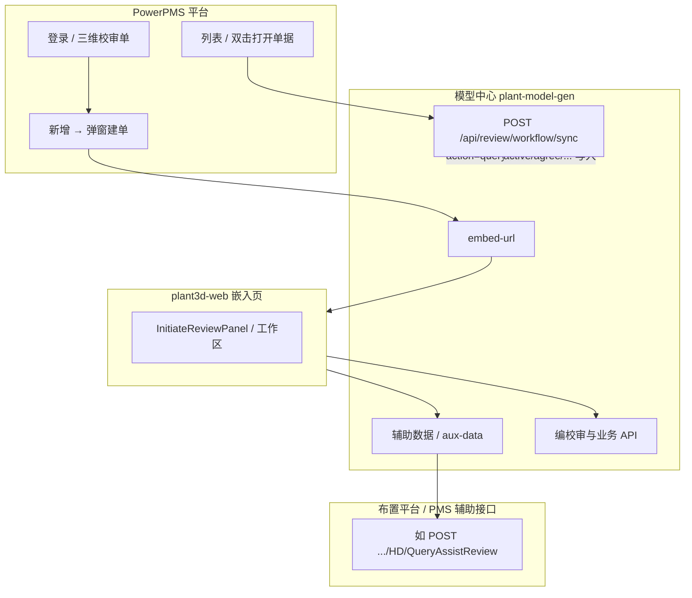
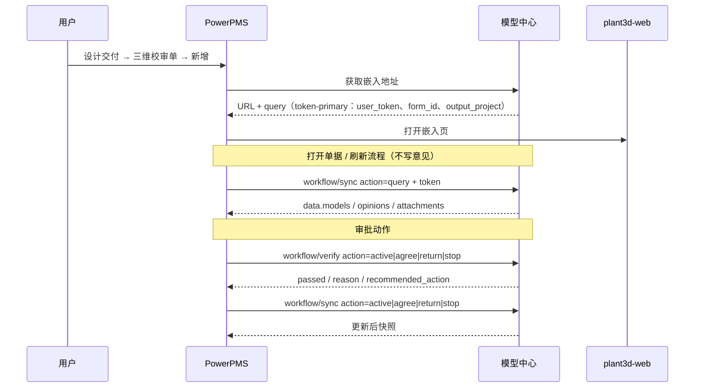

# PowerPMS「三维校审单」→ 新增 → 打开三维页：测试计划

## 目标

验证在 [PowerPMS 登录页](http://pms.powerpms.net:1801/sysin.html) 使用角色账号登录后，**设计交付 → 三维校审单 → 新增** 能打开预期的三维布置 / plant3d-web 页面（新标签或当前页跳转，以实现为准）。

> 2026-04-01 补充口径：若联调对象是本仓库内的 **仿 PMS 调试页**（`/pms-review-simulator.html`），当前默认项目不再沿用 `PROJECT-EMBED-001` 之类伪值，而是以后端 `/api/projects` 返回的真实模型项目为准；本地默认会回退到 `AvevaMarineSample`。

## 手工测试步骤（SOP）

1. 打开 `http://pms.powerpms.net:1801/sysin.html`。
2. 使用角色简写账号登录（如 `SJ`、`SH` 等，**大写**），密码由运维提供（勿在文档中写死）。
3. 若出现验证码，完成验证或使用免验证码测试账号。
4. 左侧菜单进入 **设计交付** → **三维校审单**，确认列表与工具栏（含 **新增**）可见。
5. 点击 **新增**，记录：
   - 是否新开浏览器标签；
   - 最终 URL 是否指向预期环境（内网 plant3d 域名或 `127.0.0.1:3101` 等）；
   - URL 查询参数是否符合当前合同：
     - 必须带 `user_token`
     - 建议带 `output_project=<真实模型项目路径>`
     - 不应再依赖 `project_id / user_id / user_role` 作为嵌入身份事实源。
6. **换角色**（如 `SH`）重复步骤 1–5，确认权限与打开地址是否符合预期。

## 自动化（Playwright）

- 规格文件：`e2e/pms-powerpms-review-new.spec.ts`
- 配置：`playwright.pms.config.ts`（**不**启动本地 Vite，避免与默认 `test:e2e` 冲突）

### 环境变量（密码仅通过环境变量注入）

| 变量 | 说明 |
|------|------|
| `PMS_E2E_ENABLED` | 设为 `1` 才执行（防止 CI 误连外网） |
| `PMS_E2E_PASSWORD` | 登录密码 |
| `PMS_E2E_USERNAME` | 单角色，默认 `SJ` |
| `PMS_E2E_ROLES` | 可选，逗号分隔多角色串行测，如 `SJ,SH,JD` |
| `PMS_E2E_BASE` | 可选，默认 `http://pms.powerpms.net:1801` |
| `PMS_E2E_OPEN_URL_SUBSTRING` | 断言「新增」后页面 URL 应包含的子串，默认 `127.0.0.1`（可按部署改为域名） |
| `PMS_E2E_HEADLESS` | 设为 `1` 时本地也使用无头模式 |
| `PMS_E2E_SUBMIT_REVIEW` | 设为 `1` 时，在通过 URL 断言后继续在 plant3d 内执行发起编校审，直至出现「编校审单创建成功」（与 CDP 的 `PMS_CDP_SUBMIT_REVIEW` 等价；需已部署含自动化钩子的前端） |
| `PMS_E2E_FILL_PMS_DIALOG` | 设为 `1` 时，在点击「新增」后轮询填写 PMS 弹窗（项目代码/名称等）并提交 |
| `PMS_E2E_FULL_FLOW` | 设为 `1` 时同时启用 `FILL_PMS_DIALOG` + `SUBMIT_REVIEW`；可用 `PMS_E2E_SKIP_PMS_DIALOG=1` / `PMS_E2E_SKIP_PLANT3D_SUBMIT=1` 关闭其中一步 |

### 命令示例

```bash
cd plant3d-web
export PMS_E2E_ENABLED=1
export PMS_E2E_PASSWORD='********'
export PMS_E2E_OPEN_URL_SUBSTRING='127.0.0.1:3101'   # 按实际嵌入地址调整
npm run test:e2e:pms
```

### Chrome DevTools Protocol（CDP）脚本

与 Cursor 里 **Chrome DevTools MCP** 一样，本质都是通过 **CDP** 控制 Chromium。仓库提供不依赖 MCP 客户端、可直接在终端运行的脚本。

**嵌入页为线上部署的 plant3d-web（非本地）时**，请设置部署域名片段，用于断言「新增」后是否打开正确站点：

```bash
export PMS_E2E_PASSWORD='********'
export PMS_EMBEDDED_SITE_SUBSTRING='你的-plant3d-线上域名'   # 如 web.plant.example.com
npm run test:pms:cdp
# 或 npm run test:pms:browser（同一脚本，默认有头弹出 Chrome）
```

不设 `PMS_EMBEDDED_SITE_SUBSTRING` / `PMS_E2E_OPEN_URL_SUBSTRING` 时，只自动化到**点击「新增」**，不校验外链 URL。

### 从 PMS 入口跑通全流程（推荐）

入口固定为：[PowerPMS 登录页](http://pms.powerpms.net:1801/sysin.html)（脚本内 `PMS_E2E_BASE` 默认同域，实际打开 `…/sysin.html`）。

1. **部署**：plant3d-web 需已发布，且含自动化钩子（`registerPlant3dAutomationReviewInitScript` 会写入 `localStorage.plant3d_automation_review=1`，页面暴露 `window.__plant3dInitiateReviewE2E.addMockComponent`）。
2. **外部流程模式**（默认）：三维内按钮为「**创建编校审数据**」，脚本通过 `[data-guide="submit-btn"]` 点击；成功文案为「编校审单创建成功」。设计人员若还要继续送审，需回到 **PMS 右侧面板** 再点「送审提交」，该动作现在固定按 `workflow/verify -> workflow/sync active` 顺序执行。  
   > 2026-04-02 补充口径：在本仓 **仿 PMS 调试页**（`/pms-review-simulator.html`）里，external/passive 已补齐 `workflow/sync active / agree / return / stop` 全动作链，并已拿到 `approved / cancelled / return->sj` 的真实闭环证据；本节的 CDP 脚本仍以 **真实 PowerPMS 入口** 为主，因此 reviewer 内部按钮验证仍默认走 `manual/internal`。
3. **一键命令**（密码与嵌入站点片段必填）：

```bash
cd plant3d-web
export PMS_E2E_PASSWORD='********'
export PMS_EMBEDDED_SITE_SUBSTRING='123.57.182.243'   # 或你的 plant3d 线上域名/IP
npm run test:pms:cdp:full
```

`test:pms:cdp:full` 等价于 `PMS_CDP_FULL_FLOW=1`：自动打开 **弹窗轮询填写** + **plant3d 发起编校审**。若只需其中一步，可改用手动开关或 `PMS_CDP_SKIP_PMS_DIALOG=1` / `PMS_CDP_SKIP_PLANT3D_SUBMIT=1`。

### PMS → 列表可见编校审包 → JH 登录 → plant3d 校核提交（extended）

目标：仍以 **PMS 登录页为唯一入口**，在 `test:pms:cdp:full` 基础上增加：

1. SJ（或 `PMS_E2E_USERNAME`）发起编校审成功后，回到 **设计交付 → 三维校审单**，在页面或 iframe 内 **等待出现本次编校审包名称**（与 `PMS_MOCK_PACKAGE_NAME` 一致；未设时脚本会自动生成 `E2E-PMS-JH-时间戳`）。
2. `clearCookies` 后，以 **校核账号**（默认 `JH`，`PMS_CHECKER_USERNAME` 可改）再次从 `sysin.html` 登录。
3. 再次进入三维校审单列表，**双击/点击**含包名的行（尽力而为，表格实现因 PMS 版本可能不同）。
4. 在嵌入的 plant3d 内等待 **校对工作区**（`[data-testid="review-workbench-workflow-zone"]`），点击流程区 **「确认流转至…」** 主按钮（如「确认流转至审核」），并处理可能出现的确认弹窗。

> 注意：当前前端默认是**被动/外部流程模式**。对 **真实 PowerPMS → 嵌入 plant3d** 这条 CDP 自动化链，reviewer 工作区仍只展示状态，不提供内部“提交/驳回”按钮；因此 `extended` 若要继续验证 plant3d 内 reviewer 提交链路，仍需显式切到 `manual/internal`。  
> 但对 **本仓仿 PMS 调试页** 而言，external/passive 已通过右侧 workflow 面板补齐 `active / agree / return / stop`，不再局限于 `SJ` 的 `active`。  
> 因此 `extended` 自动化若要继续验证 **plant3d 内部 reviewer 提交流程**，必须显式切到 `manual/internal`。  
> 现在脚本在 `PMS_CDP_EXTENDED_FLOW=1` 且未显式配置时，会自动注入 `PMS_CDP_WORKFLOW_MODE=manual`。

一键命令：

```bash
cd plant3d-web
export PMS_E2E_PASSWORD='********'
export PMS_EMBEDDED_SITE_SUBSTRING='123.57.182.243'
export PMS_CDP_WORKFLOW_MODE='manual'
# 如需额外验证“reviewer 浏览器刷新后仍能恢复工作区”，再显式打开：
# export PMS_CDP_CHECKER_REFRESH_RESTORE='1'
# 建议固定包名，便于在 PMS 列表里肉眼核对：
# export PMS_MOCK_PACKAGE_NAME='联调-编校审-001'
npm run test:pms:cdp:extended
```

发起编校审时，extended 默认会把 **`PMS_INITIATE_CHECKER_SUBSTRING` 设为与 `PMS_CHECKER_USERNAME` 相同**，以便在校核/审核人下拉里优先选到 JH（选项文案中须包含 `JH` 等子串）。若你们下拉展示的是中文姓名，请显式设置 `PMS_INITIATE_CHECKER_SUBSTRING=某姓名片段`。

### 环境变量补充（CDP 脚本）

| 变量 | 说明 |
|------|------|
| `PMS_CDP_FULL_FLOW` | `1`：启用 `PMS_CDP_FILL_PMS_DIALOG` + `PMS_CDP_SUBMIT_REVIEW`（可用 `SKIP` 关闭子步骤，见上） |
| `PMS_CDP_SUBMIT_REVIEW` | `1`：注入模拟 BRAN、填数据包名、点提交，直到出现「编校审单创建成功」 |
| `PMS_CDP_FILL_PMS_DIALOG` | `1`：点击「新增」后在所有标签页轮询尝试填写 PMS 建单弹窗 |
| `PMS_CDP_WORKFLOW_MODE` | 可选：写入嵌入页 `localStorage.plant3d_workflow_mode`。默认不设时沿用前端默认口径；若要让 reviewer 工作区出现内部提交/驳回按钮，请设为 `manual` 或 `internal`。`test:pms:cdp:extended` 未设时会自动补成 `manual` |
| `PMS_TARGET_BRAN_REFNO` | 自动化注入的测试 BRAN RefNo，默认 **`24381_145018`**（与 PMS 数据界面展示一致，便于核对回写/列表同步）；仍可用 `24381/145018` 等其它格式 |
| `PMS_CDP_SELECTION_MODE` | 设为 **`console`**（或 **`console_add`**，同义）时：在 plant3d 控制台输入 `= 24381/145018` 形式选中 CE，再自动点击「添加构件」，并等待构件列表出现对应 RefNo（失败则回退 mock 注入）。`postmessage` 为父页向 iframe 发 `plant3d.select_refno` |
| `PMS_CDP_ADD_COMPONENT_READY_MS` | `console`/`postmessage` 成功后，等待「添加构件」按钮可用的超时（毫秒），默认 **45000** |
| `PMS_CDP_ADD_COMPONENT_LIST_MS` | 点击「添加构件」后，等待列表中出现匹配 RefNo 的超时（毫秒），默认 **90000**（含 `pdmsGetUiAttr` 等请求） |
| `PMS_MOCK_PACKAGE_NAME` / `PMS_MOCK_PROJECT_CODE` / `PMS_MOCK_PROJECT_NAME` | 编校审包名、弹窗内项目代码/名称 |
| `PMS_PLANT3D_POLL_MS` | 等待发起编校审面板出现的超时（毫秒），默认 `180000` |
| `PMS_CDP_EXTENDED_FLOW` | `1`：在编校审成功后执行「PMS 可见包名 → 换 JH → 打开条目 → plant3d 校核提交」；`npm run test:pms:cdp:extended` 已带上 |
| `PMS_CHECKER_USERNAME` | 校核登录账号，默认 `JH`（与 `PMS_E2E_PASSWORD` 共用密码） |
| `PMS_CDP_CHECKER_REFRESH_RESTORE` | 可选：设为 `1`/`true` 时，JH 进入 plant3d reviewer 工作区后，会先执行一次浏览器刷新，并等待工作区恢复，再继续提交到审核，用于验证“刷新恢复”链路 |
| `PMS_CDP_PMS_VERIFY_MS` | 等待 PMS 列表出现包名的超时（毫秒），默认 `90000` |
| `PMS_INITIATE_CHECKER_SUBSTRING` | 发起编校审时校核下拉按 **option 文案** 子串匹配；extended 未设时默认等于 `PMS_CHECKER_USERNAME` |
| `PMS_CDP_VERIFY_PMS_API` | 默认开启：`1`/`true` 或不设时，编校审成功后会回到「三维校审单」并**嗅探 PMS 域名下 XHR/Fetch 的 JSON 响应体**，断言出现 **编校审包名** 或 **测试 BRAN**（`PMS_TARGET_BRAN_REFNO` / 斜杠互换形式）。设为 `0`/`false` 可关闭 |
| `PMS_CDP_PMS_API_MS` | 上述接口断言超时（毫秒），默认 `120000` |
| `PMS_API_URL_SUBSTRING` | 可选，仅当响应 URL 还包含该子串时才记入嗅探（用于缩小到列表接口路径） |

实现：`scripts/pms-api-sniffer.ts`（`BrowserContext.on('response')` 读 `content-type` 含 `json` 的 body）。

分步示例：

```bash
export PMS_E2E_PASSWORD='********'
export PMS_EMBEDDED_SITE_SUBSTRING='你的-plant3d-域名'
export PMS_CDP_SUBMIT_REVIEW=1
export PMS_CDP_FILL_PMS_DIALOG=1
npm run test:pms:cdp
```

**用真实 CE +「添加构件」写入列表（不用 mock）**：

```bash
export PMS_E2E_PASSWORD='********'
export PMS_EMBEDDED_SITE_SUBSTRING='123.57.182.243'
export PMS_CDP_SELECTION_MODE=console
export PMS_TARGET_BRAN_REFNO='24381_145018'
npm run test:pms:cdp:full
```

说明：若三维页在 **跨域 iframe** 内，Playwright 无法操作内部 DOM，需改为新标签打开同源三维地址或调整嵌入方式。若后端 `createReviewTask` 失败，脚本会在提交步骤报错。

- 脚本路径：`scripts/pms-chrome-devtools-flow.ts`（`npx tsx` 执行；Playwright → Chromium → **CDP**）。
- **附加本机 Chrome（推荐用 Chrome DevTools 肉眼跟流程）**：
  1. 终端执行 `./scripts/launch-chrome-cdp.sh`（macOS 默认 Chrome；等价于带 `--remote-debugging-port=9222` 与独立 `user-data-dir`）。
  2. 另开终端：`export PMS_E2E_PASSWORD=…`、`export PMS_EMBEDDED_SITE_SUBSTRING=…`，再运行 `npm run test:pms:cdp:attach:full` 或 `test:pms:cdp:attach:extended`（已写死 `CHROME_CDP_URL=http://127.0.0.1:9222`；换端口时自行覆盖该变量）。
  3. 使用 `CHROME_CDP_URL` 时，脚本结束时会 **disconnect**（`browser.close()` 仅断开 Playwright 的 CDP 会话，**不会**关掉你已启动的 Chrome），可在 Chrome 里继续按 F12 看 Network / DOM。
- 默认 **有头**；无头可加 `PMS_CDP_HEADLESS=1`（仅在不使用 `CHROME_CDP_URL` 时）。

### 限制说明

- PMS 前端结构若升级，需调整 `e2e/pms-powerpms-review-new.spec.ts` 中的选择器（菜单文案、按钮角色等）。
- 若登录强制验证码且无测试账号，自动化会失败，以手工步骤为准。
- **「新增」在 iframe 内**：用例会在**主文档 + 所有子 frame** 中轮询可见的「新增」（`button` / `link` / 工具栏区域文本），并在菜单点击后等待 iframe 挂载；若仍找不到，需用浏览器开发者工具确认是否 shadow DOM 或跨域 iframe（跨域时 Playwright 仍可操作 frame，只要同源或已导航到该 frame）。

## 与 PMS 数据界面联调（测试 BRAN）

发起编校审自动化默认向任务里写入 RefNo **`24381_145018`**（脚本常量 `PMS_DEFAULT_TEST_BRAN_REFNO`，与工程内 MBD/实例数据常用写法一致）。在 PMS 侧打开对应单据或构件列表时，可用同一 RefNo 核对：

- plant3d 编校审单构件明细中的 **RefNo** / 名称是否与 PMS 展示一致；
- 回传或刷新后 PMS 是否出现该 BRAN 关联记录（以实际接口为准）。

若 PMS 使用斜杠记法，可执行前设置：`export PMS_TARGET_BRAN_REFNO='24381/145018'`。

## 与编校审接口的关系（便于联调对照）

- **新增** 打开的 URL 通常由平台后端调用模型中心 **embed-url** 类能力再重定向/拼接得到；当前前端已按 **token-primary** 合同消费最终地址：优先保留 `user_token + output_project`，必要时可带 `form_id`，但不再依赖 URL 中的 `user_id / user_role / project_id` 身份字段。
- **UCode/UKey** 用于模型中心 **主动请求** 布置平台辅助数据接口，与「新增打开页」不是同一条链路；勿混测。
- **校审工作流同步** `POST /api/review/workflow/sync`（模型中心实现）：
  - `POST /api/review/workflow/verify`：外部流程的正式预校验入口；请求体与 `workflow/sync` 一致，只返回 `passed / reason / recommended_action` 等判断结果，**不写库**。
  - **`action=query`**：PMS **打开/刷新** 嵌入页或单据时拉取当前工作流与意见快照；**不**在模型中心新建 `review_opinion` 记录（即使请求里带了 `comments`）。
  - **`active` / `agree` / `return` / `stop`**：真实审批推进；当前本地模型中心实现已会更新 `review_tasks / review_forms`，并在返回快照中反映最新 `current_node / task_status / form_status`。正式调用顺序应为 `verify -> sync`。其中：
    - `active`：编制送审，推进到 `next_step`
    - `agree`：同意并推进；`pz agree` 作为最终批准，进入 `approved`
    - `return`：退回到指定前置节点，并回写 `returnReason`
    - `stop`：终止流程，进入 `cancelled`
- **终态对齐（2026-04-02 已验证）**：
  - `approved`：`task_status = approved`、`form_status = approved`、`embed-url lineage.status = approved`
  - `cancelled`：`task_status = cancelled`、`form_status = cancelled`、`embed-url lineage.status = cancelled`
- **仿 PMS external/passive 当前闭环**：已通过真实界面点击验证
  - `SJ active -> JH agree -> SH agree -> PZ agree -> approved`
  - `SJ active -> JH agree -> SH stop -> cancelled`（手工 SOP 全节点路径）
  - `SJ active -> JH agree -> SH agree -> PZ return -> sj -> SJ reopen initiate`
- **自动化模拟器快捷路径**（`pms-simulator-runner.ts`）：
  - `stop` 场景使用 `SJ active -> JH stop -> cancelled`（在校对节点直接终止，跳过 SH 角色登录与 agree 步骤，缩短 ~30s 执行时间；`stop` 动作本身的 verify/sync 合同校验完全一致）
- **基于固定 BRAN `24381_145018` 的数据证据（2026-04-02 已验证）**：
  - `JH` 阶段可真实添加：
    - 1 条批注
    - 1 条距离测量
    - 1 个截图附件
  - `records/by-task` 已可回读：
    - `annotations_total = 1`
    - `measurements_total = 1`
  - `workflow/sync?action=query` 已可回读：
    - `attachments_len = 1`
  - `approved` reopen 时：
    - iframe 内已恢复批注与测量
    - iframe 内“附件材料”tab 已出现 1 条附件
    - 当前默认显示 attachment `description` / 标签文案，而不是原始上传文件名
- Token：`SHA256(hex)`，盐与 `form_id`、`actor.id` 规则见《编校审交互接口设计》与 `DbOption.toml` 中 `[model_center].token_secret`。

### 端到端流程图（PMS ↔ 模型中心 ↔ plant3d-web）





### CDP 如何模拟「发起校审」时的关联数据

自动化不替代真实三维选区时，通过 **与手工「添加构件」相同的前端状态路径** 注入一条 BRAN，使 `createReviewTask` 请求里带有构件列表。

1. **开启条件**（任一即可）  
   - Playwright：`registerPlant3dAutomationReviewInitScript` 在上下文里执行 `localStorage.setItem('plant3d_automation_review','1')`。  
   - 或 URL 带 `?automation_review=1`。

2. **页面挂载后**（`InitiateReviewPanel.vue`）  
   - 若上述条件满足，在 `window` 上挂载 `__plant3dInitiateReviewE2E.addMockComponent(refNo?, name?)`。  
   - 内部调用 `ensureComponentSelected`：若 `selectedComponents` 中尚无该 `refNo`，则 `push` 一条 `ReviewComponent`（与用户在面板里点「添加构件」后的列表项结构一致）。

3. **CDP / Playwright 调用方式**（`scripts/pms-plant3d-initiate-flow.ts`）  
   - 在嵌入 **plant3d** 的 frame 上 `page.evaluate`，执行 `window.__plant3dInitiateReviewE2E?.addMockComponent(targetRefNo, displayName)`。  
   - 默认 `PMS_TARGET_BRAN_REFNO`（如 `24381_145018`）与 PMS 数据界面展示对齐，便于列表/回写核对。

4. **非 mock 路径**（可选）  
   - `PMS_CDP_SELECTION_MODE=console`：在三维控制台输入 `= 24381/145018` 等形式选中 CE，再自动点「添加构件」，等待列表出现 RefNo（走真实 `pdmsGetUiAttr` 链路）。  
   - `postmessage`：父页向 iframe 发 `plant3d.select_refno`（视部署与同源策略而定）。

**结论**：CDP 的「模拟关联」= 在已开启自动化钩子的嵌入页里，直接往 **发起编校审面板** 的 `selectedComponents` 写入与手工添加等价的条目；随后脚本再填包名、点「创建编校审数据」等按钮，与真实用户操作序列一致。
