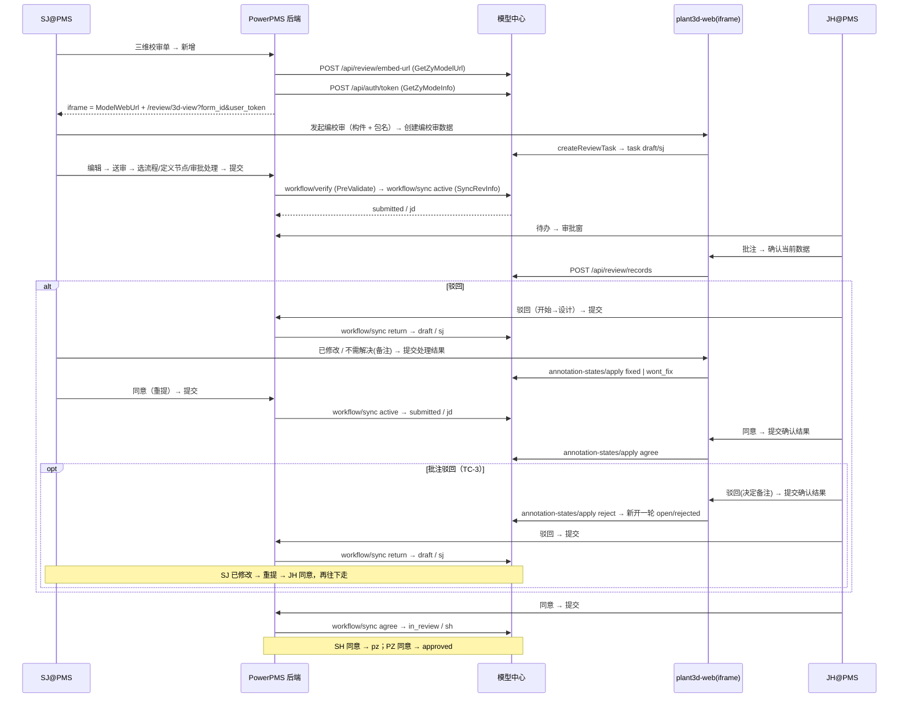

# PowerPMS ↔ 模型中心 ↔ plant3d-web：三维校审端到端测试案例

> 2026-09-21 按真实 PowerPMS（`http://pms.powerpms.net:1801`）+ 公网模型中心（`http://123.57.182.243`）实跑重写。
> 本文以 **三条真机跑通的测试案例** 为主线：TC-1 正向全通（SJ → JH → SH → PZ → approved）、TC-2 驳回回路（JH 钩子批注 + 驳回 → SJ 处理重提 → 第 2 轮同意 → approved）、TC-3 真手画批注回路（JH 用文字 / 云线工具真手画 → 设计「不需解决」→ 校核「批注驳回」→ 第 3 轮同意 → approved）。
> 每一步写清「在哪个界面点什么」「PMS 后端会调什么」「模型中心应变成什么」，并附当天的证据。旧版只覆盖到「新增打开三维页」，且假定校核人能在列表里直接找到设计人的草稿，与真实 PMS 不符，已整体替换。

## 0. 结论先行

| 案例 | 单据 | 结果 | 模型中心 history |
| --- | --- | --- | --- |
| TC-1 正向全通 | `FORM-2EBB10854469`（task-4cd2d1a5…，包名 `E2E-PMS-JH-0921-1842`） | `form_status=approved / task_status=approved / current_node=pz` | `sj submit → jd approve → sh approve → pz approve`（4 条） |
| TC-2 驳回回路 | `FORM-067232BF29AB`（task-581a0e26…，包名 `E2E-PMS-JH-0921-1835`） | 同上，另有 1 条批注 `round1 open/pending → round2 fixed/agreed` | `sj submit → jd return → sj approve(重提) → jd approve → sh approve → pz approve`（6 条） |
| TC-3 真手画批注回路 | `FORM-CB658BB5921A`（task-565542bf…，包名 `E2E-PMS-CLOUD-0921-2035`） | 同上，`records=1 attachments=1`；文字批注 `r1 open → r2 fixed/agreed`，云线批注 `r1 open → r2 wont_fix→rejected → r3 fixed/agreed` | `sj submit → jd return → sj approve → jd return → sj approve → jd approve → sh approve → pz approve`（8 条） |

三条链上 PMS 每次「提 交」都回 `/HD/SyncRevInfo {"message":"同步校审数据成功","success":true}`，模型中心 `workflow/sync?action=query` 与 `/api/review/tasks/{id}/workflow` 的节点、状态、history 与 PMS 审批历史逐条对得上。

## 1. 环境与前提

| 项 | 值（2026-09-21） |
| --- | --- |
| PMS 入口 | `http://pms.powerpms.net:1801/sysin.html`，账号 `SJ / JH / SH / PZ`（大写），密码由运维提供，只经环境变量注入 |
| PMS「三维模型」参数 | `ModelRootUrl = http://123.57.182.243:3100`（PMS 后端调模型中心七条路由的基址，nginx 已 80 / 3100 兼听）、`ModelWebUrl = http://123.57.182.243`（iframe 基址，即 `GetZyModeInfo` 回的 `ip_addr`）——见《PMS对接清单》§7 |
| 模型中心后端 | gen-model `0.1.27+gc04a9e558`，`/api/review/health → {"status":"ok","database":"healthy"}`，持久层 rocksdb |
| plant3d-web 前端 | `739f97bc`（`version.json`），Google Fonts 外链已去掉，嵌入页首屏 ~4 s |
| 前端流程模式 | **外部流程模式**（默认）：嵌入页只展示节点 / 状态与批注处理，送审 / 同意 / 驳回一律在 **PMS 工具栏** 上做 |
| 测试 BRAN | `24381_145018`（`PMS_DEFAULT_TEST_BRAN_REFNO`），发起时由自动化钩子注入 |
| 本机网络 | 访问 PMS 必须直连；系统代理（`127.0.0.1:7890`）下 PMS 超时。Chrome 用 `--proxy-server=direct:// --proxy-bypass-list=*` 启动 |

### 各角色在 PMS 里的入口（真机核对，和旧文档假设不同）

| 角色 | 首页布局 | 待办入口 | 能否从「三维校审单」列表审批 |
| --- | --- | --- | --- |
| SJ | 业务中心 | 顶栏「待审批事项 N」下拉（被驳回的单在这里，文案 `校核 刚刚 (驳回) 三维校审单`） | 列表里能「编辑」自己的单并「送审」 |
| JH | 个人中心（有「待处理的 / 我发起的 / 我参与的」待办件） | 待办件第一行 `(*NEW) 三维校审单 设计\|日期`，或顶栏「待审批事项」 | **不能**：列表不显示别人的草稿；送审后才出现在待办 |
| SH / PZ | 业务中心（没有待办件） | **只有**顶栏「待审批事项 N」下拉（每条 `a[href*="/Message/Show/<id>"]`，文案如 `校核 10分钟前 三维校审单`） | **不能**：列表「查看」打开的窗只有 监控 / 全屏 / 关闭 |

> 列表菜单「设计交付 → 三维校审单」默认折叠（`a.nav-item-a` 文案「三维校审单」），展开后侧边菜单遮罩 `#J_backdrop` 会拦住点击；列表行显示的是 `ModelFormId`（`FORM-xxxx`），**不显示**我们的编校审包名。

## 2. TC-1 正向全通：SJ 发起 → PMS 送审 → JH / SH / PZ 逐级同意

### 2.1 步骤与断言

| # | 谁 | PMS 界面操作 | PMS 后端 → 模型中心 | 模型中心应变成 | 2026-09-21 证据 |
| --- | --- | --- | --- | --- | --- |
| 1 | SJ | 登录 → 设计交付 → 三维校审单 → **新增** | `POST /HD/GetZyModelUrl`（1 次，`{"message":"获取成功","success":true}`）→ `embed-url`；`POST /HD/GetZyModeInfo`（form-urlencoded `username=SJ&project=AvevaMarineSample&role=SJ`）→ `auth/token` | `review_forms` 出现 `FORM-xxxx` 存根；PMS 库里 `ModelFormId` 同值 | 18:42 `GetZyModelUrl` 只调了 1 次（09-21 17:21 那次三连调见《PMS对接清单》§8，本次未复现） |
| 2 | SJ | 嵌入 plant3d：校审 → 发起编校审 → 加构件（自动化用 `__plant3dInitiateReviewE2E.addMockComponent('24381_145018')`）→ 填包名 → **创建编校审数据** | plant3d 直连模型中心 `createReviewTask` | `task_created=true`，`task_status=draft`，`current_node=sj`，`models=["24381_145018"]` | `task_id=task-4cd2d1a5-… form_id=FORM-2EBB10854469` |
| 3 | SJ | 回列表，选中该行 → **编辑** → 窗口顶部 **送审** | `POST /HD/PreValidate form_id=…&action=active&role=sj` → `workflow/verify`（`校审数据预验证成功`） | 不写库 | 19:07 |
| 4 | SJ | 弹 `WorkNodeSelect.html`：**选择流程**「三维编校审」→ **定义节点** 校核 / 审核 / 批准 各点「选择人员」（`SelectUser.html`：先点部门树 `1 (5)`，姓名查 `JH` / `SH` / `PZ`，双击结果行，确定）→ **下一步** → **审批处理** 填处理意见 → **提 交** | `POST /HD/SyncRevInfo Id=<PMS 记录 Id>` → `workflow/sync action=active` | `form_status=active`，`task_status=submitted`，`current_node=jd`，history `+ sj submit by SJ` | 19:08:53 `sj submit`；PMS 记录 `Id=58c5ae27-…` |
| 5 | JH | 登录 → 待办件 `(*NEW) 三维校审单 设计\|2026-09-21` → 审批窗（同意 / 驳回 / 转办 / 沟通 / 委派 / 终止 / 监控） | `GetZyModeInfo role=proofread` → `auth/token`（JH token `role=jd`） | 嵌入页「当前节点：校对 · 待处理」，任务详情 `1 构件 · FORM-…` | iframe `…/review/3d-view?form_id=FORM-2EBB10854469&user_token=<JH JWT>&output_project=AvevaMarineSample` |
| 6 | JH | **同意** → 审批处理（即将流转到 **审核**）→ 意见 → **提 交** | `SyncRevInfo` → `workflow/sync action=agree` | `task_status=in_review`，`current_node=sh`，history `+ jd approve by JH` | 19:14:12 |
| 7 | SH | 登录 → 顶栏 **待审批事项** → `校核 … 三维校审单` → 审批窗 → **同意** → 提交 | 同上 `agree` | `current_node=pz`，history `+ sh approve by SH` | 19:44:06；嵌入页「当前节点：审核 · 审核中」 |
| 8 | PZ | 登录 → 顶栏 **待审批事项** → `审核 … 三维校审单` → **同意**（即将流转到 **结束**）→ 提交 | `agree`（终态） | `form_status=approved`，`task_status=approved`，history `+ pz approve by PZ`；PMS 列表状态列 `新增 → 审批中 → 批准` | 19:46:01 |

### 2.2 服务端断言脚本（PowerShell，直连）

```powershell
$tok = ((Invoke-WebRequest -Uri 'http://123.57.182.243/api/auth/token' -Method POST -ContentType 'application/json' `
  -Body '{"project_id":"AvevaMarineSample","user_id":"SJ","role":"sj"}' -UseBasicParsing -NoProxy).Content | ConvertFrom-Json).data.token
$body = @{ form_id='FORM-2EBB10854469'; token=$tok; action='query'; actor=@{ id='SJ'; name='SJ'; roles='sj' } } | ConvertTo-Json -Compress
$d = ((Invoke-WebRequest -Uri 'http://123.57.182.243/api/review/workflow/sync' -Method POST -ContentType 'application/json' -Body $body -UseBasicParsing -NoProxy).Content | ConvertFrom-Json).data
"$($d.form_status) $($d.task_status) $($d.current_node) $($d.task_id)"          # approved approved pz task-4cd2d1a5-…
$w = (Invoke-WebRequest -Uri "http://123.57.182.243/api/review/tasks/$($d.task_id)/workflow" -Headers @{ Authorization="Bearer $tok" } -UseBasicParsing -NoProxy).Content | ConvertFrom-Json
$w.history | % { "$($_.timestamp) $($_.node) $($_.action) $($_.operatorId)" }   # 4 行：sj submit / jd approve / sh approve / pz approve
```

`/api/review/tasks/{id}` 与 `/workflow` 需要 `Authorization: Bearer <JWT>`；`workflow/sync` 走请求体里的 `token`。

## 3. TC-2 驳回回路：JH 批注 + 驳回 → SJ 处理重提 → 第 2 轮同意 → approved

前 4 步与 TC-1 相同（本次复用了 TC-1 首跑遗留的草稿 `FORM-067232BF29AB`，直接从「编辑 → 送审」开始）。

| # | 谁 | PMS / 嵌入页操作 | 后端调用 | 模型中心应变成 | 证据 |
| --- | --- | --- | --- | --- | --- |
| 1 | SJ | 编辑 → 送审 → 三维编校审 → JH / SH / PZ → 下一步 → 提交 | `SyncRevInfo` → `active` | `submitted / jd`，history `sj submit` | 19:55:54 |
| 2 | JH | 待办 → 审批窗；**嵌入页内加批注**：手工用 文字 / 云线 / 矩形 工具，自动化用 `__plant3dReviewerE2E.addMockAnnotation(title, desc)` + `confirmData(note)` | plant3d 直连 `POST /api/review/records`（`type=batch`，`annotations[0].entityId=24381/145018`） | `workflow/sync?query` 的 `records=1`；批注表格「共 1 条 · 待处理 1」 | 19:59:31 record `slot-67ebedac…`，`annotationId=e2e-annot-1789991970507` |
| 3 | JH | **驳回** → 弹 `WorkReturnSelect.html`：「即将流转到 **开始 → 设计**」（默认）、「驳回后发送模式：**按流程图执行**」（默认）→ 处理意见 → **提 交** | `SyncRevInfo` → `workflow/sync action=return` | `current_node=sj`，history `+ jd return by JH`；**注意**此时 `form_status / task_status` 显示为 `draft`（不是 returned），只能从 history 的 `return` 判断 | 20:01:02 |
| 4 | SJ | 登录 → 顶栏待审批事项 `校核 刚刚 (驳回) 三维校审单` → 审批窗（**同意** / 转办 / 沟通 / 委派 / 终止 / 监控，没有驳回）；嵌入页显示「打回原因：<JH 意见>」「仅处理已有批注」 | `GetZyModeInfo role=design` | 嵌入页批注 `#1 … 待处理`，「讨论与处理」区有 **已修改 / 不需解决 / 提交处理结果** | 20:03 |
| 5 | SJ | 批注「讨论与处理」→ **已修改** → **提交处理结果** | plant3d 直连 `POST /api/review/annotation-states/apply {action:"fixed"}` | `annotation-states`: `resolutionStatus=fixed, decisionStatus=pending, reviewRound=2`；表格「待处理 0 · 已处理 1」；时间线「SJ 20:03 标记已修改」 | 20:03:02 |
| 6 | SJ | PMS **同意**（=重提）→ `WorkNodeSelect` 直接落在定义节点页（人员已保留）→ **下一步** → 意见 → **提 交** | `SyncRevInfo` → `active` | `submitted / jd`，history `+ sj approve by SJ`（**重提被记成 approve，不是 submit**） | 20:04:41 |
| 7 | JH | 待办（新一条 `设计 刚刚 三维校审单`）→ 嵌入页批注显示「已修改待确认 · 设计已处理，待校对/审核确认」→ **同意** → **提交确认结果** | `annotation-states/apply {action:"agree"}` | `decisionStatus=agreed`；时间线「JH 20:08 同意」；表格「待处理 0 · 已处理 0」（已同意不再计入已处理） | 20:08:32 |
| 8 | JH | PMS **同意** → 提交 | `agree` | `in_review / sh`，history `+ jd approve by JH` | 20:08:54 |
| 9 | SH → PZ | 与 TC-1 第 7、8 步相同 | `agree` ×2 | `approved / approved / pz`；history 共 6 条 | 20:10:13、20:11:36 |

### 3.1 批注状态断言

```powershell
$as = ((Invoke-WebRequest -Uri 'http://123.57.182.243/api/review/annotation-states?form_id=FORM-067232BF29AB' -Headers @{ Authorization="Bearer $tok" } -UseBasicParsing -NoProxy).Content | ConvertFrom-Json).states
$as | % { "$($_.annotationId) round=$($_.reviewRound) $($_.resolutionStatus)/$($_.decisionStatus) :: " + (($_.history | % { "$($_.action)@$($_.workflowNode) by $($_.operatorId)" }) -join ' -> ') }
# e2e-annot-1789991970507 round=1 open/pending
# e2e-annot-1789991970507 round=2 fixed/agreed :: fixed@sj by SJ -> agree@jd by JH
```

## 4. TC-3 真手画批注回路：JH 真手画文字 + 云线 → 驳回 → SJ「已修改」/「不需解决」→ JH 同意 / 批注驳回 → SJ 再改 → 第 3 轮同意 → approved

TC-2 的批注是钩子造的。这条用**真实的文字 / 云线工具**在嵌入页里画，并把设计侧「**不需解决**」与校核侧「**批注驳回**」两条支路走完（2026-09-21 20:41–21:13 实跑）。
前 4 步同 TC-1：`test:pms:cdp:full`（attach 到可见 Chrome）新建 `FORM-CB658BB5921A`（task-565542bf…，BRAN `24381_145018`，包名 `E2E-PMS-CLOUD-0921-2035`），再由 SJ 在 PMS 送审。

**画批注用的浏览器**：JH 在可见 Chrome 打开待办后，取审批窗里嵌入 iframe 的地址（含 JH 的 `user_token`），在另一个 **headless Chrome（CDP 9446，SwiftShader 软渲染）** 里直接打开同一地址画图——WebGL 能渲染、截图稳定，且与同机 SJ 那边的本机草稿隔离（做法见 §6.3）。

| # | 谁 | PMS / 嵌入页操作 | 后端调用 | 模型中心应变成 | 2026-09-21 证据 |
| --- | --- | --- | --- | --- | --- |
| 1 | SJ | 新增 → 发起（构件 `24381_145018`）→ 列表「编辑」→ **送审** → 三维编校审 → JH / SH / PZ → 下一步 → 提交 | `PreValidate` → `SyncRevInfo` → `active` | `submitted / jd`，history `sj submit` | 20:41:44 |
| 2 | JH | 待办 → 审批窗 → 取嵌入地址 → headless 打开。**文字**：点「文字」→ 先滚轮放大到管子够粗 → 点管子表面（构件变紫红 / 模型树高亮 = 命中）→ 内联编辑器填标题、描述 | 无（本地草稿） | 批注表格「共 1 · 待处理 1」，模型上出现标记 A1 | 20:47:31 `anno-1789994851286-…`「文字批注：立管 24381_145018 与支架间距不足」 |
| 3 | JH | **云线**：点「云线」→「使用当前选择」（BRAN 仍处选中）→ 点管子表面设锚点（提示「锚点已就绪，请拖拽绘制云线轮廓」）→ **先关掉盖在视口中央的「待保存证据」弹层** → 在画布上拖出矩形 | 自动截图 `POST /api/review/attachments` | 弹「刚创建云线的详情」：严重度选「一般错误」、填描述；批注表格「共 2 · 待处理 2」 | 20:52:46 `cloud-1789995166633-…`；附件 `att-828e1f45-…`（`type=annotation_screenshot`，描述「云线批注 1」） |
| 4 | JH | **确认当前数据** | `POST /api/review/records`（`type=batch`，同一 slot 覆写） | `workflow/sync?query`：`records=1 attachments=1`，`records[0].annotations=1 cloud_annotations=1` | `confirmed_at 20:53:33`（文字那条在此之前已作为「修订 1」落库一次，见 §5.1 第 5 条） |
| 5 | JH | PMS **驳回** → `WorkReturnSelect` 默认 → 意见 → 提交 | `SyncRevInfo` → `return` | `draft / sj`，history `jd return` | 20:54:49 |
| 6 | SJ | 顶栏待审批事项（驳回）→ 嵌入页：文字批注 →「**已修改**」→ 提交处理结果；云线批注 →「**不需解决**」→ **必须填处理备注** → 提交处理结果 | `annotation-states/apply fixed` / `wont_fix` | 文字 `round2 fixed/pending`；云线 `round2 wont_fix/pending`；表格「共 2 · 待处理 0 · 已处理 1」（不需解决不计入已处理） | 20:56:13 `fixed`；21:01:03 `wont_fix` |
| 7 | SJ | PMS **同意**（重提）→ 定义节点页人员已保留 → 下一步 → 提交 | `SyncRevInfo` → `active` | `submitted / jd`，history `sj approve` | 21:01:47 |
| 8 | JH | 待办 → 嵌入页：文字（「已修改待确认」）→「**同意**」→ 提交确认结果；云线（「不需解决待确认」+ SJ 的备注）→「**驳回**」→ **必须填决定备注** → 提交确认结果 | `apply agree` / `apply reject` | 文字 `round2 fixed/agreed`；云线 `round2 open/rejected`，设计侧显示「已驳回 校对/审核要求重新处理」；表格「共 2 · 待处理 0 · 已处理 0」 | 21:03:56 `agree`；21:06:04 `reject` |
| 9 | JH | PMS **驳回** → 提交 | `return` | `draft / sj`，history 第 2 条 `jd return` | 21:06:53 |
| 10 | SJ | 待审批事项 → 云线批注 →「已修改」（填备注）→ 提交处理结果 → PMS 同意（重提） | `apply fixed`；`active` | 云线 `round3 fixed/pending`；`submitted / jd` | 21:08:27 `fixed`；21:08:54 重提 |
| 11 | JH | 云线 →「同意」→ 提交确认结果 → PMS **同意** → 提交 | `apply agree`；`agree` | 云线 `round3 fixed/agreed`；`in_review / sh` | 21:10:20；21:10:47 |
| 12 | SH → PZ | 顶栏待审批事项 → 同意 → 提交，各一次 | `agree` ×2 | `approved / approved / pz`；history 共 8 条；PMS 列表状态列「批准」 | 21:12:11、21:13:40 |

### 4.1 断言（2026-09-22 上午复查仍一致）

```text
form_status=approved  task_status=approved  current_node=pz  records=1  attachments=1
history: sj submit → jd return → sj approve → jd return → sj approve → jd approve → sh approve → pz approve
annotation-states?form_id=FORM-CB658BB5921A:
  text  anno-1789994851286-…  round=1 open/pending → round=2 fixed/agreed   (fixed@sj by SJ → agree@jd by JH)
  cloud cloud-1789995166633-… round=1 open/pending → round=2 open/rejected  (wont_fix@sj by SJ → reject@jd by JH)
                                                   → round=3 fixed/agreed   (fixed@sj by SJ → agree@jd by JH)
```

- 校核对处理结果「驳回」后，`annotation-states` **新开一轮**（round 3），前两轮原样保留；`resolutionStatus` 回 `open`、`decisionStatus=rejected`。
- 处理备注 / 决定备注都在 `annotation-states.history[].note` 里；`workflow/sync?query` 的 `annotation_comments` 全程为 `[]`（那里只有「发表」的讨论），PMS 若要在审批历史里展示批注处理情况，现在拿不到。
- 云线自动截图以附件 `type=annotation_screenshot` 挂在 `attachments`，JH / SJ 重开都能看到并带已同意星标。

## 5. 今天暴露的口径问题（不阻塞，已记进对接清单待办）

1. **驳回后的状态字**：`workflow/sync?query` 回 `form_status=draft / task_status=draft`，与首次建单后的草稿无法区分；嵌入页能显示「打回原因」说明前端另有判据（history / `returnReason`）。建议后端补 `returned` 或在快照里带 `returnReason`。
2. **重提的 history 动作**：SJ 在 `sj` 节点重提被记为 `action=approve`，与首次送审 `submit` 不一致；按 submit 统计送审次数会漏。
3. **task 上的人员字段不跟 PMS**：`task.checkerId=JH reviewerId=JH approverId=PZ` 来自发起面板默认值，而 PMS 流程里审核人是 SH；`workflow/sync agree` 照样接受了 SH 在 `sh` 节点的同意（外部流程以 PMS 为准，没错），但按 `reviewerId` 筛待办 / 出报表会错。
4. **JH 首页自动弹旧待办**：`FORM-F2DFD64CA811`（有存根无任务，嵌入页提示「已识别 form_id，但尚未绑定内部任务，当前不可审核」）每次登录都挡在前面，是历史测试遗留，应在 PMS 里终止或删掉。
5. **自动化残留提示**：JH 第 2 轮嵌入页顶部出现「共 1 条 —— 这是切到任务作用域之前留在旧容器里的批注，本任务下只读、不导入」，是 `addMockAnnotation` 留在 localStorage 的草稿，真实用户不会碰到。TC-3 没再出现——画图在独立 headless 会话里、没有本机草稿，不代表已修。

### 5.1 TC-3 真手画暴露的嵌入页交互问题（前端，不阻塞流程但会让真用户卡住 / 误读）

1. **「待保存证据」弹层拦住画云线**：弹层固定在视口中央，云线拖拽起点落在它范围内就变成选中页面文字，云线不出、也不报错；要先点弹层的 `svg.lucide-x` 关掉才能画。真实用户会碰到，建议弹层不占画布（贴边 / 可折叠）或对画布放行 pointer 事件。**已修**：`151290c1`（云线锚点就绪 / OBB 框画 / 框选目标时该卡放行 pointer 事件并降级显示 `data-canvas-drag-armed=true`，浮层栈容器改为各卡自接事件）；2026-09-22 用本地 build 在 9446 headless 上做 A/B 真机复验通过——同一落点旧包只选中文字、新包成云线，做法与数据见 §6.3.1。
2. **文字 / 锚点点击落空无反馈**：默认视角下管子很细，点空只是状态停在「点击模型表面创建」，没有任何提示；要先放大再点。建议落空给一次 toast 或状态闪动。
3. **备注「可选」但实为必填**：设计「不需解决」与校核「驳回」不填备注只弹 toast、不提交（`ReviewCommentsTimeline.vue` `canSubmitReviewAction`），而 `textarea` 占位符写的是「可选」。改占位符文案或在未填时禁用提交按钮即可。**已修**：`151290c1`（占位符跟所选动作走，选了「不需解决」/「驳回」写「（必填：…）」并加 `aria-required`、框描黄、框下一行提示、提交按钮 `title` 同文；填了就消。按钮不禁用，toast 拦截照旧）；2026-09-22 用本地 build 在 9446 上两侧真机复验通过（做法同 §6.3.1，不提交、只读 DOM）：**SJ**（`打开批注单` → 详情 → `[data-testid=review-action-note]`）未选「处理备注（已修改可不填；不需解决必填原因）」→ 点「不需解决」变「处理备注（必填：为什么不需解决，依据是什么）」+ `aria-required=true` + `border-amber-400` + `[data-testid=review-action-note-required-hint]`「「不需解决」需先填写原因，才能提交处理结果」→ 填原因后提示消、清空又回来 → 点「已修改」变「处理备注（可选，例如修改说明）」；**JH** 同理：「决定备注（同意可不填；驳回必填原因）」→「驳回」→「决定备注（必填：驳回原因，设计要按这个重新处理）」+ 提示「「驳回」需先填写驳回原因，才能提交确认结果」→「同意」→「决定备注（可选，例如同意理由）」。对照线上旧包 `index-3hv8nOec`：SJ 一律「处理备注（可选，例如修改说明）」、JH 一律「决定备注（可选，例如同意理由或驳回意见）」，选什么都不变、无提示。
4. **统计条漏计**（TC-2 已见，真手画再次复现）：`AnnotationTableView.vue` 表头只摆 `pending` / `fixed`，已同意 / 已驳回 / 不需解决 都不计入「已处理」，终态显示「共 2 · 待处理 0 · 已处理 0」。**已修**（2026-09-22）：统计条改三颗药丸、相加 = 共 N，口径同 `annotationSheetNavigation.isAnnotationActionableForRole`——待处理 = pending + rejected、已处理 = fixed + wont_fix、已通过 = approved，计数复用 `buildAnnotationWorkspaceSummary`（设计面板五张卡同一份）。**顺带发现并修的 4b**：设计侧「打开批注单」进的 `DesignerCommentHandlingPanel` 从不请求 `annotation-states`（只有 `ReviewPanel` 调 `syncAnnotationReviewStates`，点开某条详情时 `ReviewCommentsTimeline` 才单条拉），所以 SJ 页面里已同意的两条全显示「待处理 2」、「已修改 / 不需解决」按钮还能点；现在该面板在聚焦单据 / 任务变化时也拉一次（外部嵌入按 form 维度，内部任务带 taskId）。本地 build 复验（§6.3.1 做法，`stats-check.mjs`，服务端真值两条均 fixed/agreed）：JH 侧「共 2 条 · 待处理 0 · 已处理 0 · 已通过 2」、两行「已同意」；SJ 侧同一串、两行「已同意」、整页 `GET /api/review/annotation-states?form_id=…` 1 次（修前 0 次、显示「待处理 2」）。**4c 也收了**：JH 侧一进页 `ReviewPanel` 几个 watch 各自触发，1.3 s 内对同一 form 发了 10 次该 GET（+845 / +1236 / +1238 / +1277 / +1759 / +1771 / +1789 / +1944 / +1954 / +2122 ms，回包一样）；`syncAnnotationReviewStates` 现在按 `form_id|task_id` 同参在飞合并 + 回包后 1.2 s 短窗复用（失败不进窗，`force: true` 绕开，`ReviewCommentsTimeline` 提交处理动作成功后 `invalidateAnnotationReviewStatesCache(formId)` 作废窗，免得旧回包盖掉刚提交的状态）。复验：JH 侧 10 → 2 次（+1053 / +2761 ms，第二次在窗外，是后面 watch 正常再拉），SJ 侧 1 次；行状态 / 统计条不变。
5. **未解释的一次自动确认**：文字批注在没点「确认完成」之前就已作为「修订 1」落库（校审面板显示「已确认到修订 1 · 有未确认修改」），怀疑内联编辑器的 Tab / blur 或随后的锚点点击误触了确认按钮，当时截图对不上，标「待核实」。

## 6. 自动化现状与跑法

### 6.1 已能一键跑的部分：`test:pms:cdp:full`（SJ 新增 → 发起 → 严格校验）

```bash
cd plant3d-web
export PMS_E2E_PASSWORD='********'
export PMS_EMBEDDED_SITE_SUBSTRING='123.57.182.243'
export PMS_MOCK_PACKAGE_NAME='E2E-PMS-JH-<日期时间>'        # 便于肉眼核对
npm run test:pms:cdp:full
```

- 覆盖 TC-1 第 1、2 步，并「严格校验」：回列表按 **本次发起拿到的 `form_id`** 重开记录（`7af7a6c2` 起，之前只按包名回查，而 PMS 列表不存包名，必挂），再断言嵌入站点接口里出现 BRAN / 包名。
- 本机代理下 Playwright 自启的 Chrome 连不上 PMS，请先手动起一个直连 Chrome 再 attach：

```powershell
Start-Process 'C:\Program Files\Google\Chrome\Application\chrome.exe' -ArgumentList @('--proxy-server=direct://','--proxy-bypass-list=*','--remote-debugging-port=9445',"--user-data-dir=$env:TEMP\pms-e2e-profile",'about:blank')
$env:CHROME_CDP_URL='http://127.0.0.1:9445'; $env:PMS_CDP_FULL_FLOW='1'; $env:PMS_E2E_PASSWORD='********'; $env:PMS_EMBEDDED_SITE_SUBSTRING='123.57.182.243'
npx tsx scripts/pms-chrome-devtools-flow.ts
```

### 6.2 尚未进脚本的部分：PMS 送审 / 同意 / 驳回 与 SJ 批注处理

`test:pms:cdp:extended` 的 JH 段假设「JH 能在三维校审单列表里找到并双击该记录，然后在 plant3d 里点内部按钮」，这与真实 PMS 不符（见 §1 入口表）；真机上 JH 段必须先由 SJ 在 PMS **送审**，JH 再从 **待办** 进入，并在 **PMS 工具栏** 同意 / 驳回。2026-09-21 这两步是用 CDP attach 到同一 Chrome 分步驾驭完成的，选择器如下，可直接折进脚本：

| 动作 | 所在 frame | 选择器 / 做法 |
| --- | --- | --- |
| 打开记录 | `Form/EditForm/b41b5f93-…`（列表） | `tbody tr` 中 `innerText` 含 `FORM-xxxx` 的行 → 单击 → 工具栏「编辑」（SJ）；「查看」只能看 |
| 送审 | `Form/ValidForm/64a0f6b3-…/edit/<Id>` | `getByText('送审')` |
| 选流程 | `OpenURL?url=/PowerPlat/WorkFlows/WorkNodeSelect.html` | `li` 文案以「三维编校审」开头 |
| 选人员 | 同上 → `Commons/SelectUser.html` | `getByText('选择人员').nth(i)` → 先点树节点 `1 (5)`（不先选部门会弹「请先选中人员所在的部门/岗位」）→ `#search_name$text` 填名 → `a.mini-button`「查询」→ `td.mini-grid-cell` 文案等于名字的行 `dblclick` → `a.mini-button`「确定」 |
| 意见与提交 | `WorkNodeSelect.html` | `#txtMindInfo$text` → `a.mini-button` 文案 `提 交`（中间有空格） |
| 待办进入 | 主页 | `a.dropdown-toggle[title=待审批事项]` 点开 → `a[href*="/Message/Show/"]` 选文案含「三维校审单」且时间最新的一条；打开后校验嵌入 frame 的 `form_id` |
| 同意 / 驳回 | `ValidForm` 审批窗 | `getByText('同意')` / `getByText('驳回')`；驳回弹 `WorkReturnSelect.html`，默认项即可，同样 `#txtMindInfo$text` + `提 交` |
| 校核加批注 | 嵌入 frame（`location.href` 含 `/review/3d-view`） | `window.__plant3dReviewerE2E.addMockAnnotation(title, desc)` → `confirmData(note)`；需 `localStorage.plant3d_automation_review = '1'`（同 origin 设过一次即生效） |
| 设计处理批注 | 嵌入 frame | `button`「已修改」/「不需解决」→ `button`「提交处理结果」 |
| 校核确认处理结果 | 嵌入 frame | `button`「同意」/「驳回」→ `button`「提交确认结果」 |

> attach 模式的两个坑：`frame.url()` 偶尔回空串，找嵌入 frame 要用 `frame.evaluate(() => location.href)` 兜底；`page.screenshot` 会卡在 waiting for fonts（窗口被遮挡时 CDP `Page.captureScreenshot` 也会卡），以 DOM 文本 dump 为准。

### 6.3 真手画批注（TC-3）：独立 headless Chrome + 真点工具

文字 / 云线工具没有钩子，只能真点画布。2026-09-21 的做法：JH 在可见 Chrome 打开待办后，读审批窗里嵌入 iframe 的 `src`（`…/review/3d-view?form_id=…&user_token=<JH JWT>&output_project=…`），另起一个 **headless** Chrome 直接打开它，再用 Playwright `connectOverCDP` 驾驭——软渲染下 WebGL、拾取、截图都正常，且不会和同机其他账号的本机草稿串（见 §5 第 5 条）。

```powershell
Start-Process 'C:\Program Files\Google\Chrome\Application\chrome.exe' -ArgumentList @('--headless=new','--proxy-server=direct://','--proxy-bypass-list=*','--remote-debugging-port=9446',"--user-data-dir=$env:TEMP\pms-draw-profile",'--no-first-run','--window-size=1500,950','--use-angle=swiftshader','--enable-unsafe-swiftshader','--ignore-gpu-blocklist','about:blank')
```

| 动作 | 选择器 / 做法 |
| --- | --- |
| 进文字模式并落点 | `button`「文字」→ 先在 `canvas` 上 `mouse.wheel` 放大到管子够粗 → `mouse.click` 到几何上。命中与否看构件是否变紫红 / 模型树是否高亮；落空没有任何提示 |
| 填文字批注 | `input[placeholder="输入批注标题"]` 直接 `fill`；`textarea[placeholder="输入批注描述"]` 常被弹层挡住点不到，用 JS 设 `value` + 派发 `input` 事件再 `blur` |
| 进云线模式 | `button`「云线」→ `[data-testid=annotation-cloud-target-current]`（需已选中构件）→ `canvas` 上点几何设锚点，状态变「锚点已就绪，请拖拽绘制云线轮廓」 |
| 画云线 | `151290c1` 之前要**先关「待保存证据」弹层**（`svg.lucide-x`），`151290c1` 起锚点就绪时该卡自动放行 pointer 事件、不必再关（见 §6.3.1）→ `mouse.down / move / up` 拖矩形；矩形任一边 < 6 px 会被当成再点一次锚点而不成云线（`useDtxTools.ts` `endMarquee`）→ 自动 `POST /api/review/attachments` → 详情框 `[data-testid=annotation-cloud-detail-severity-general]`、`[data-testid=annotation-cloud-detail-description]` |
| 保存 | `button`「确认当前数据」→ `POST /api/review/records` |
| 设计 / 校核处理 | `[data-testid=annotation-table-view]` 内 `article` 行点一下开详情（**再点会关**，已展开时别重复点）；「不需解决」/「驳回」先填 `textarea[placeholder*="处理备注"]` / `textarea[placeholder*="决定备注"]`，再点「提交处理结果」/「提交确认结果」，落 `annotation-states/apply` |

#### 6.3.1 本地 build 真机复验：拦截换包，不部署也不起服务（2026-09-22，复验 `151290c1`）

改了嵌入页想在真环境里验，不必发到 123.57.182.243：Playwright `connectOverCDP` 附到上面那个 headless Chrome（9446），`page.route` 把同源的 `/review/3d-view` 文档和 `/assets/*` 全部 `fulfill` 成本地 `dist`（`index.html` + 对应 hash 的 js / css / 字体），`/api`、`/config` 照走线上后端。换包是否成功看两处：`document.scripts` 的 src 只剩本地 hash（本次 `/assets/index-BYzxeycd.js`），以及新 build 才有的 `data-testid`（`annotation-overlay-footer`、`review-confirmation`）在 DOM 里。build 在临时 worktree 里做，不受工作区未提交改动影响：`git worktree add --detach $env:TEMP\p3d-wt HEAD` → junction `node_modules` → `npx vite build`（11.6 s）→ 验完 `git worktree remove`。脚本：`%TEMP%\pms-getzy-probe\local-build-cloud.mjs`（`MODE=local|online`，同一流程跑两遍做 A/B）、`local-build-cleanup.mjs`（还原副作用）。

| 步骤 | 做法 / 坑 |
| --- | --- |
| 视口 | 先 `page.setViewportSize(2000×1100)`：默认 1478×852 下三维查看器只有 492 px 宽，批注浮层栈盖满画布、管子全在「待保存证据」卡底下 |
| 选目标 | 点批注表格里已有批注的行后，`[data-testid=annotation-cloud-target-current]`「使用当前选择」直接可用（「定位到模型」不改相机，别指望它把管子挪到空处） |
| 点锚点 | 别按「画布中心 + 偏移」点——会点到浮层卡 / 工具栏（本次曾误点工具栏「错误类型」下拉，把文字批注严重度 `PATCH …/severity` 成「原则错误」，之后 `PATCH severity=null` 还原）。改为 CDP `Page.captureScreenshot` → 页内 `<canvas>` 解码 → 找选中高亮紫红（r>140、b>140、g<130）的实心 9×9 像素块、且 `elementFromPoint` 为 `CANVAS` 的点 |
| 拖拽起点 | 卡放行后 `elementFromPoint` 会穿到底下，底下可能恰好是已有批注的悬浮气泡（它自己接 pointer 事件，与本卡无关）；要在卡上挑一个底下就是 canvas 的文字点（本次是「批注」计数数字）。对照组旧包里卡自己接事件，探测时临时把卡 `pointer-events: none` 找同一处落点，探完恢复 |
| 已批准的单 | JH 仍能本地画，但自动截图 `POST /api/review/attachments` 403（既非发起人也非当前 `pz` 节点负责人），toast「云线已创建，但自动截图失败，可在批注面板重拍」，云线照常生成；不点「确认当前数据」服务端不落任何记录 |
| 换角色（要 SJ 的页面） | `user_token` 是按人签的 JWT，拿不到就没法开设计侧：在 `browser.newContext()`（独立 cookie / localStorage，不和 JH 的本机草稿串）里登 PMS（账号见 `AGENTS.md`）→ 三维校审单 → 该记录「查看」→ 读嵌入 iframe 的 `src`（含 SJ token，24 h 有效，可缓存）。PMS 给的是 `http://`，站点会 302 到 `https://`，拦截按主机名匹配而不是 origin。设计侧落地页没有校审面板，先点浮层「打开批注单」（`[data-testid=annotation-overlay-details-toggle]`）才有 `annotation-table-view`。脚本 `%TEMP%\pms-getzy-probe\placeholder-check.mjs`（`ROLE=SJ|JH`、`MODE=local|online`） |

A/B 结果（同一锚点 (944,730)、同一卡上落点、拖 140×110 px；`FORM-CB658BB5921A`，2026-09-22 14:57 / 14:59）：

| | 本地 build `151290c1`（`index-BYzxeycd.js`） | 线上旧包（`index-3hv8nOec.js`） |
| --- | --- | --- |
| 锚点就绪时的卡 | `[data-testid=review-confirmation][data-canvas-drag-armed=true]`，`pointer-events: none`，opacity 0.6，出现「正在绘制：本卡已让路，在这里按下拖拽也会直接落到模型上」；`annotation-overlay-footer` 同步 `data-canvas-drag-armed=true` | 无该属性，`pointer-events: auto`，opacity 1 |
| 起点 `elementFromPoint` | `canvas.viewer` | 卡内计数 `div`（`annotation-overlay-root` 之下） |
| 松开后 | 弹「刚创建云线的详情」（`annotation-cloud-detail-severity-general` / `-description` 都在）、横幅「云线已创建」、卡计数 批注 2→3、「当前模型关联批注」多出「云线批注 2」、画布出现新云线虚线框；`getSelection()` 为空 | 无云线、状态仍停在「锚点已就绪，请拖拽绘制云线轮廓」；`getSelection()` =「打开批注单 待保存证据 批注 2」——§5.1 第 1 条原样复现 |

**上线后在线上包上再跑一遍（2026-09-22 16:35 部署，同日 16:36–16:38 复验）**：走仓库的 GitHub Actions `Deploy Frontend To Ubuntu`（`gh workflow run deploy-ubuntu.yml --ref main`，1 分 59 秒；做法见 `deploy/README.md`「用 GitHub Actions 部署」），上线 main `cf7d8f0e`（含 `151290c1` / `749fa0e5` / `9888922b` / `8e5f290d` / `05f3b576`），`https://123.57.182.243/version.json` = `{commit: cf7d8f0e…, buildDate: 2026-09-22 08:35:14 UTC}`，首页 bundle `index-alRAXGtB.js`，80 / 3100 / 443 三个入口同一 `Last-Modified`。三个脚本全部 `MODE=online`、不拦截、直接跑线上包：

| 脚本 | 线上包读数（与本地 build 一致） |
| --- | --- |
| `local-build-cloud.mjs`（§5.1 第 1 条） | 锚点就绪时卡 `data-canvas-drag-armed=true` / `pointer-events: none` / opacity 0.6 / 提示行在；起点卡上「批注」计数 (1058,672) → `canvas.viewer`；松开后详情框 + 「云线已创建」，**云线生成**（`POST /api/review/attachments` 403 照旧，已批准单的预期） |
| `placeholder-check.mjs` JH / SJ（§5.1 第 3 条） | JH「决定备注（同意可不填；驳回必填原因）」→ 驳回 →「决定备注（必填：驳回原因，设计要按这个重新处理）」+ `aria-required` + 描黄 + 提示，填了消，同意 →「决定备注（可选，例如同意理由）」；SJ 同理（不需解决 / 已修改）。没提交任何动作 |
| `stats-check.mjs` JH / SJ（§5.1 第 4 条） | 两侧「共 2 条 · 待处理 0 · 已处理 0 · 已通过 2」、两行「已同意」；`GET annotation-states` JH 1 次（本地 build 时 2 次，这次后一下落在窗内）、SJ 1 次 |

### 6.4 CDP 脚本环境变量（`scripts/pms-chrome-devtools-flow.ts`）

| 变量 | 说明 |
| --- | --- |
| `PMS_E2E_PASSWORD` | 登录密码（必填，只经环境变量） |
| `PMS_E2E_BASE` / `PMS_E2E_USERNAME` / `PMS_CHECKER_USERNAME` | 默认 `http://pms.powerpms.net:1801` / `SJ` / `JH` |
| `PMS_EMBEDDED_SITE_SUBSTRING` | 嵌入站点片段（线上 `123.57.182.243`）；设了才做嵌入地址校验与嵌入接口嗅探 |
| `CHROME_CDP_URL` | 设了则 `connectOverCDP` 附加到已启动的 Chrome，不自起浏览器，结束只断开不关窗 |
| `PMS_CDP_FULL_FLOW` | `1`：弹窗轮询填写 + plant3d 发起编校审（`PMS_CDP_SKIP_PMS_DIALOG=1` / `PMS_CDP_SKIP_PLANT3D_SUBMIT=1` 可关子步骤） |
| `PMS_CDP_EXTENDED_FLOW` | `1`：发起后等 PMS 列表出现匹配键 → 清 Cookie 换 JH → 打开记录 → plant3d 内校核提交。**真机需先 PMS 送审，当前会在「JH 未能在 PMS 列表中打开已有单据」处停**，见 §6.2 |
| `PMS_MOCK_PACKAGE_NAME` / `PMS_MOCK_PROJECT_CODE` / `PMS_MOCK_PROJECT_NAME` | 编校审包名、PMS 弹窗内项目代码 / 名称（extended 未设包名时自动生成 `E2E-PMS-JH-<时间戳>`） |
| `PMS_TARGET_BRAN_REFNO` | 注入的测试 BRAN，默认 `24381_145018`，也接受 `24381/145018` |
| `PMS_CDP_SELECTION_MODE` | `console`：在三维控制台输入 `= 24381/145018` 选中 CE 再点「添加构件」（走真实 `pdmsGetUiAttr`），失败回退 mock；`postmessage`：父页向 iframe 发 `plant3d.select_refno` |
| `PMS_CDP_ADD_COMPONENT_READY_MS` / `PMS_CDP_ADD_COMPONENT_LIST_MS` | `console` 模式两个超时，默认 45000 / 90000 |
| `PMS_CDP_WORKFLOW_MODE` | 写入嵌入页 `localStorage.plant3d_workflow_mode`；extended 未设时补 `manual`。**真实 PMS 链请勿设**——外部流程模式下同意 / 驳回在 PMS 做 |
| `PMS_CDP_VERIFY_PMS_API` / `PMS_CDP_PMS_API_MS` / `PMS_API_URL_SUBSTRING` | PMS 域名 JSON 响应嗅探开关 / 超时 / URL 过滤（真实 PMS 列表接口不是 JSON，嗅探命不中是正常的，严格校验会改走 form_id 回查） |
| `PMS_CDP_VERIFY_EMBED_API` / `PMS_CDP_EMBED_API_MS` / `PMS_EMBED_API_URL_SUBSTRING` | 嵌入站点 JSON 响应嗅探，需出现包名或 BRAN |
| `PMS_CDP_PMS_VERIFY_MS` / `PMS_PLANT3D_POLL_MS` | 等 PMS 列表出现匹配键 / 等发起面板出现的超时，默认 90000 / 180000 |
| `PMS_INITIATE_CHECKER_SUBSTRING` | 发起面板校核下拉按文案子串选人，extended 未设时等于 `PMS_CHECKER_USERNAME` |
| `PMS_CDP_CHECKER_REFRESH_RESTORE` | `1`：JH 进工作区后先刷新一次再提交，验证刷新恢复 |
| `PMS_CDP_HEADLESS` | `1` 无头（仅自起浏览器时） |

### 6.5 旧 Playwright 规格（仍可用，只到「新增」）

- `e2e/pms-powerpms-review-new.spec.ts` + `playwright.pms.config.ts`（不起本地 Vite）：`PMS_E2E_ENABLED=1 PMS_E2E_PASSWORD=… PMS_E2E_OPEN_URL_SUBSTRING=123.57.182.243 npm run test:e2e:pms`。
- `PMS_E2E_ROLES=SJ,SH,JD` 可串行多角色；`PMS_E2E_FULL_FLOW` / `PMS_E2E_SUBMIT_REVIEW` / `PMS_E2E_FILL_PMS_DIALOG` 与 CDP 同名开关等价。

## 7. 与接口合同的对照（便于联调）

- **新增**：PMS 后端 `GetZyModelUrl → POST /api/review/embed-url`（回 `relative_path=/review/3d-view`、`query.form_id`）；页面 `GetZyModeInfo → POST /api/auth/token`（form-urlencoded 原样体即可，回 `code:0` + JWT + `form_id`）。iframe = `ModelWebUrl + relative_path + ?form_id&user_token&output_project`。**token 是 `/api/auth/token` 签的 JWT**，不是旧文档说的 SHA256 串——详见《编校审交互接口设计》§2 / §6。
- **送审 / 同意 / 驳回**：PMS 先 `PreValidate`（→ `workflow/verify`，不写库），提交时 `SyncRevInfo`（→ `workflow/sync action=active|agree|return|stop`）。`action=query` 只读，用于打开 / 刷新时拉快照。
- **终态**：`approved`：`task_status=approved`、`form_status=approved`；`cancelled`（`stop`）：两者 `cancelled`。本次真机只跑了 `active / agree / return`，`stop` 仍以仿 PMS 调试页（`/pms-review-simulator.html`）的证据为准。
- **批注链**（plant3d 直连模型中心，不经 PMS）：`POST /api/review/records`（校核确认批注；云线的自动截图先走 `POST /api/review/attachments`，以 `type=annotation_screenshot` 挂到快照 `attachments`）→ `POST /api/review/annotation-states/apply`（设计 `fixed | wont_fix`，校核 / 审核 `agree | reject`；`wont_fix` 与 `reject` 带 `note`）→ `GET /api/review/annotation-states?form_id=`（同一 `annotationId` 每轮一条，`reject` 后新开一轮，取最大 `reviewRound` 为现状）。
- **UCode / UKey** 是模型中心主动请求 PMS 辅助数据（`QueryAssistReview`）的另一条链，与本文无关，勿混测。

### 端到端时序（真机版）


```mermaid
sequenceDiagram
  participant SJ as SJ@PMS
  participant PMS as PowerPMS 后端
  participant MC as 模型中心
  participant P3D as plant3d-web(iframe)
  participant JH as JH@PMS

  SJ->>PMS: 三维校审单 → 新增
  PMS->>MC: POST /api/review/embed-url (GetZyModelUrl)
  PMS->>MC: POST /api/auth/token (GetZyModeInfo)
  PMS-->>SJ: iframe = ModelWebUrl + /review/3d-view?form_id&user_token
  SJ->>P3D: 发起编校审（构件 + 包名）→ 创建编校审数据
  P3D->>MC: createReviewTask → task draft/sj

  SJ->>PMS: 编辑 → 送审 → 选流程/定义节点/审批处理 → 提交
  PMS->>MC: workflow/verify (PreValidate) → workflow/sync active (SyncRevInfo)
  MC-->>PMS: submitted / jd

  JH->>PMS: 待办 → 审批窗
  JH->>P3D: 批注 → 确认当前数据
  P3D->>MC: POST /api/review/records
  alt 驳回
    JH->>PMS: 驳回（开始→设计）→ 提交
    PMS->>MC: workflow/sync return → draft / sj
    SJ->>P3D: 已修改 / 不需解决(备注) → 提交处理结果
    P3D->>MC: annotation-states/apply fixed | wont_fix
    SJ->>PMS: 同意（重提）→ 提交
    PMS->>MC: workflow/sync active → submitted / jd
    JH->>P3D: 同意 → 提交确认结果
    P3D->>MC: annotation-states/apply agree
    opt 批注驳回（TC-3）
      JH->>P3D: 驳回(决定备注) → 提交确认结果
      P3D->>MC: annotation-states/apply reject → 新开一轮 open/rejected
      JH->>PMS: 驳回 → 提交
      PMS->>MC: workflow/sync return → draft / sj
      Note over SJ,MC: SJ 已修改 → 重提 → JH 同意，再往下走
    end
  end
  JH->>PMS: 同意 → 提交
  PMS->>MC: workflow/sync agree → in_review / sh
  Note over PMS,MC: SH 同意 → pz；PZ 同意 → approved
```

## 8. 嵌入页自动化钩子（`localStorage.plant3d_automation_review = '1'` 或 URL `?automation_review=1`）

| 钩子 | 挂在 | 方法 |
| --- | --- | --- |
| `window.__plant3dInitiateReviewE2E` | `InitiateReviewPanel.vue`（SJ 发起面板） | `addMockComponent(refNo?, name?)`：往 `selectedComponents` 写一条与手工「添加构件」等价的 `ReviewComponent`；`getLastCreateResult()` 回 `{taskId, formId, title, error}` |
| `window.__plant3dReviewerE2E` | `ReviewPanel.vue`（校审面板） | `addMockAnnotation(title?, desc?)`（挂到 `24381/145018`）、`addMockMeasurement(kind)`、`confirmData(note?)`（= 点「确认完成」，落 `POST /api/review/records`）、`getConfirmedRecordCount()`、`getAnnotationCount()`、`refreshAnnotationCommentThread(type, id)`、`getCloudScreenshot(id)` |

Playwright / CDP 用 `registerPlant3dAutomationReviewInitScript(context)` 在上下文注入该 localStorage 项；attach 到已开的 Chrome 时，在嵌入 frame 里直接 `localStorage.setItem(...)` 后 `location.reload()` 亦可。设计侧「已修改 / 不需解决」与校核侧「同意 / 驳回」目前没有钩子，按 §6.2 的按钮文案点即可；真手画文字 / 云线也没有钩子，按 §6.3 真点画布。

## 9. 变更记录

- 2026-09-22（下午，五）：§6.3.1 追记上线（Actions 部 main `cf7d8f0e`，16:35）与三项线上包复验读数——云线拖拽 / 备注占位符 / 统计条与 annotation-states 次数，均与本地 build 一致。
- 2026-09-22（下午，四）：§5.1 第 4 条追记 4c——`syncAnnotationReviewStates` 同参在飞合并 + 1.2 s 短窗复用，JH 侧一进页 10 次 GET → 2 次。
- 2026-09-22（下午，三）：§5.1 第 4 条标已修（统计条三药丸 + 设计面板拉 annotation-states，记两侧本地 build 复验读数）。
- 2026-09-22（下午，二）：§5.1 第 3 条标已修（`151290c1`）并记 SJ / JH 两侧本地 build 真机复验的占位符 / 提示 / `aria-required` 实测值与旧包对照；§6.3.1 补「换角色」一行（独立 context 登 PMS 取 SJ token、http→https 按主机名拦、设计侧先点「打开批注单」）。
- 2026-09-22（下午）：§5.1 第 1 条标已修（`151290c1`）；新增 §6.3.1「拦截换包」本地 build 真机复验做法（worktree build → `page.route` 换 document + `/assets` → 像素找锚点 → 卡上挑底下是 canvas 的落点）与新旧包 A/B 结果；§6.3「画云线」行改口：`151290c1` 起不必先关「待保存证据」。
- 2026-09-22：补 TC-3 真手画批注回路（09-21 20:41–21:13 实跑，`FORM-CB658BB5921A`：文字 + 云线真手画、设计「不需解决」、校核「批注驳回」、第 3 轮同意 → approved，8 条 history）；§5.1 记真手画暴露的 5 个嵌入页交互问题；§6.3 记 headless Chrome 真点画布的做法与选择器；时序图补批注驳回支路。
- 2026-09-21：按真实 PMS 两条链（TC-1 正向、TC-2 驳回回路）重写；补各角色入口、送审 / 驳回对话框、批注处理链、服务端断言、口径问题清单；`test:pms:cdp:full` 严格校验改为按 form_id 回查（`7af7a6c2`）。
- 2026-04-02 及更早：仿 PMS 调试页 external/passive 闭环、`stop → cancelled`、附件 / 测量回读等结论保留在 git 历史与《新的三维校审流程分析》中。
