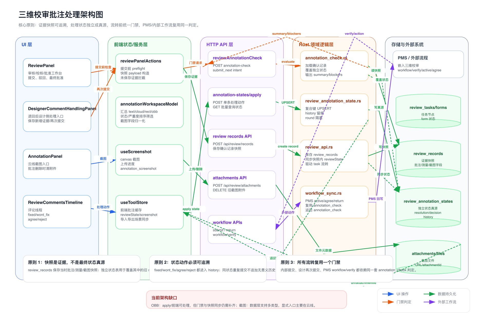

# 三维校审批注处理架构与原理说明

> 日期：2026-04-28  
> 范围：`plant3d-web` 前端批注处理、`plant-model-gen` 后端状态/门禁接口、PMS 工作流校验链路。

## 1. 架构分层

当前批注处理链路分为五层：

1. **UI 层**：`ReviewPanel` 负责审核侧流转；`DesignerCommentHandlingPanel` 负责退回后的设计侧处理；`AnnotationPanel` 提供批注列表和云线截图入口；`ReviewCommentsTimeline` 承载评论与单条批注处理动作。
2. **前端状态/服务层**：`useToolStore` 保存当前场景里的批注、截图、处理状态；`useScreenshot` 负责 canvas 截图和上传；`annotationWorkspaceModel` 汇总批注列表视图；`reviewPanelActions` 统一提交前预检与快照构造。
3. **HTTP API 层**：前端通过 `reviewApi.ts` 调用附件、确认记录、批注处理状态、批注门禁、工作流提交/驳回等接口。
4. **Rust 领域逻辑层**：`review_annotation_state.rs` 维护独立批注状态表；`annotation_check.rs` 计算门禁；`review_api.rs` 保存确认记录并同步快照状态；`workflow_sync.rs` 将同一门禁接入 PMS 外部流程。
5. **存储与外部系统层**：SurrealDB 中的 `review_records`、`review_annotation_states`、`review_tasks/review_forms` 保存证据、状态和任务；附件文件保存截图；PMS 通过 workflow verify/action 接入同一套校验。

## 2. 核心原理

### 原理一：证据快照和处理状态分离

`review_records` 是“证据快照”：保存某次确认时的批注、测量、截图、备注和节点信息。它用于审计和恢复现场，但不应该作为后续处理状态的唯一真源。

`review_annotation_states` 是“处理状态真源”：以 `form_id + task_id + annotation_type + annotation_id + review_round` 为维度保存单条批注的处理状态，并维护 `history`。流转门禁读取快照后，会用该独立状态覆盖快照中的旧 `reviewState`。

### 原理二：单条批注有明确状态机

处理动作来自 `ReviewCommentsTimeline`：

| 动作 | 操作侧 | resolutionStatus | decisionStatus | 语义 |
|---|---|---:|---:|---|
| `fixed` | 设计侧 | `fixed` | `pending` | 已修改，等待审核侧确认 |
| `wont_fix` | 设计侧 | `wont_fix` | `pending` | 不需解决，必须填写原因，等待确认 |
| `agree` | 审核侧 | 保持 | `agreed` | 同意处理结果，门禁视为通过 |
| `reject` | 审核侧 | 保持 | `rejected` | 驳回处理结果，必须填写原因 |

后端 apply 接口只在状态发生变化时追加 history，避免重复点击产生无意义历史。

### 原理三：所有流转复用同一门禁

内部审核流转、设计侧再次提交、PMS `workflow/verify` 都调用同一套 `annotation_check` 判定：

| 当前节点 | open / rejected | pending_review | approved |
|---|---|---|---|
| `sj` 编制 | `block`，提示先处理 | 允许提交 | 允许提交 |
| `jd`/`sh`/`pz` | `return`，提示应先驳回或重新处理 | `block`，提示逐条确认 | 允许流转 |

因此 UI、模拟器和 PMS 外部流程看到的是同一套业务规则，避免“前端能点、PMS 又拦”的不一致。

### 原理四：截图是附件，批注只保存引用

云线批注点击“添加截图/重拍”后：

1. `useScreenshot` 从 3D viewer canvas 生成 PNG。
2. 前端上传到 `/api/review/attachments`，附带 `type=annotation_screenshot`、`sourceAnnotationId` 和描述。
3. 上传成功后，`useToolStore.setAnnotationScreenshot()` 将 `url`、`attachmentId`、`name`、`capturedAt` 写回批注。
4. 云线批注仍兼容旧字段 `thumbnailUrl` / `attachmentId`，供列表缩略图和旧数据恢复使用。
5. 重拍或删除批注时，旧附件通过异步 `reviewAttachmentDelete()` 清理；清理失败只提示 warning，不阻断主流程。

## 3. 主要数据流

### 截图链路

`AnnotationPanel` -> `useScreenshot` -> `/api/review/attachments` -> `attachments/files` -> `useToolStore`

作用：把当前视角截图变成附件，再把附件引用挂回批注。

### 处理状态链路

`ReviewCommentsTimeline` -> `/api/review/annotation-states/apply` -> `review_annotation_states` -> `useToolStore`

作用：把单条批注的处理动作持久化为独立状态，并返回规范化状态给前端。

### 证据保存链路

`DesignerCommentHandlingPanel` / `ReviewPanel` -> `reviewPanelActions` -> `/api/review/records` -> `review_records`

作用：保存当前批注、测量、截图和备注快照。后端会从快照中的 `reviewState` 同步一份到 `review_annotation_states`，用于兼容旧的内嵌状态路径。

### 门禁链路

`runReviewSubmitPreflight` -> `reviewAnnotationCheck` -> `annotation_check.rs` -> `review_records + review_annotation_states`

作用：计算每条批注的有效状态，生成 summary 和 blockers，决定是否允许继续流转。

### PMS 外部链路

PMS `workflow/verify` / `active` / `agree` / `return` -> `workflow_sync.rs` -> `annotation_check.rs`

作用：外部系统也必须经过同一套批注门禁，返回 `ANNOTATION_CHECK_FAILED` 时会携带 `annotation_check` 明细。

## 4. 当前架构缺口

1. **OBB 覆盖不完整**：前端类型和 `annotation-states/apply` 支持 `obb`，但当前门禁默认类型、前端 preflight `includedTypes`、快照状态同步仍主要覆盖 `text/cloud/rect`。
2. **截图入口不对称**：数据模型支持多类型 `screenshot`，但显式“添加截图/重拍”入口主要在云线批注列表；`text/rect/obb` 是否也需要截图入口，需要产品确认。
3. **附件清理是弱一致**：旧截图清理失败不会回滚截图替换，这保证主流程不断，但需要后续后台清理或巡检兜底。

## 5. 建议修复顺序

1. 先补齐 OBB 门禁：统一前端 `includedTypes`、后端 `SUPPORTED_ANNOTATION_TYPES`、`sync_annotation_states_from_snapshot` 和 `review_records` 读取逻辑。
2. 再明确截图产品策略：如果所有批注都要支持截图，则补齐 `text/rect/obb` UI 入口；如果只支持云线，则收敛类型定义和文案。
3. 最后补附件治理：增加按 `sourceAnnotationId` 或孤儿附件的后台清理/巡检机制。

## 6. 相关文件

- 架构图：`docs/verification/review-annotation-handling-architecture-2026-04-28.svg`
- 架构图 PNG：`docs/verification/review-annotation-handling-architecture-2026-04-28.png`
- 流程审核图：`docs/verification/review-annotation-handling-flow-2026-04-28.svg`
- 前端批注面板：`src/components/tools/AnnotationPanel.vue`
- 前端时间线处理：`src/components/review/ReviewCommentsTimeline.vue`
- 前端流转预检：`src/components/review/reviewPanelActions.ts`
- 后端门禁：`plant-model-gen/src/web_api/platform_api/annotation_check.rs`
- 后端独立状态：`plant-model-gen/src/web_api/review_annotation_state.rs`
