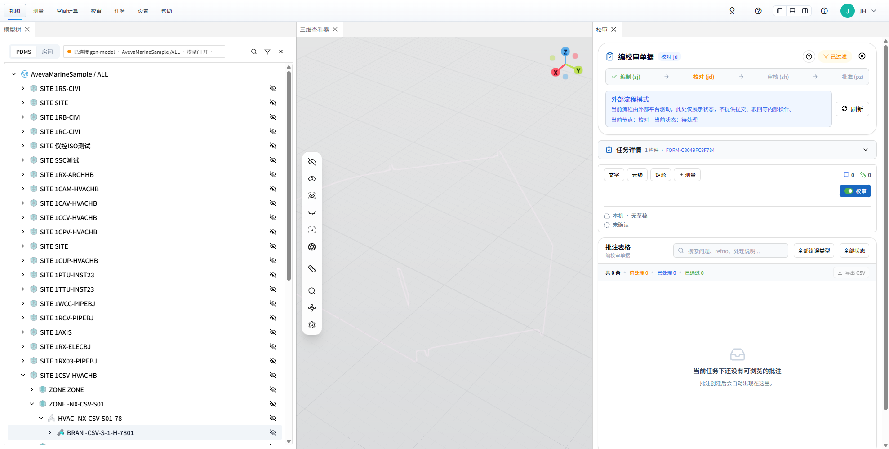
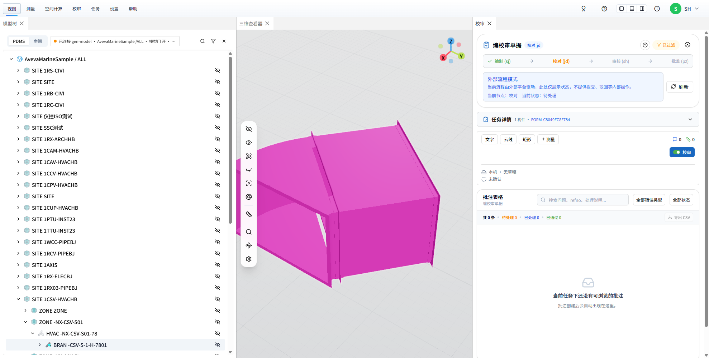
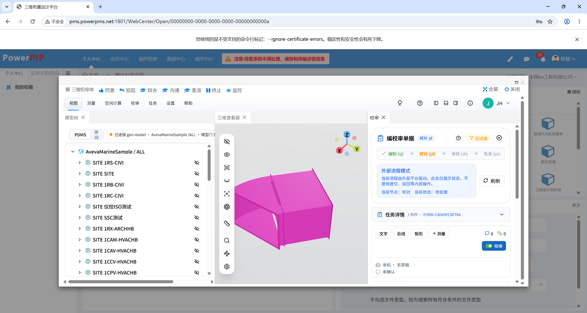
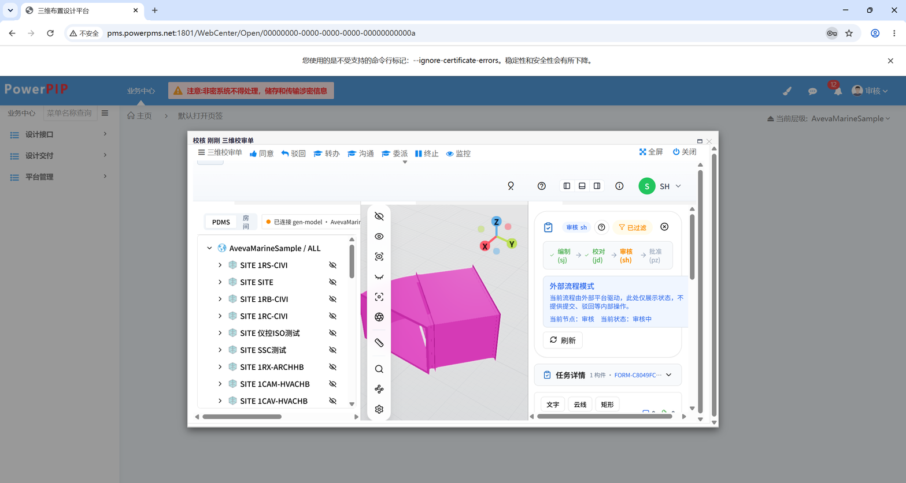
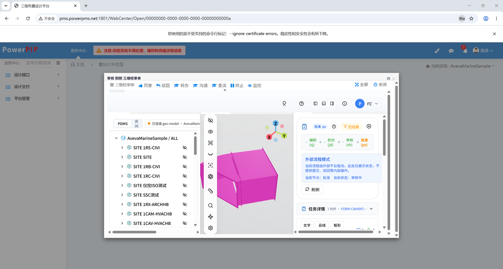
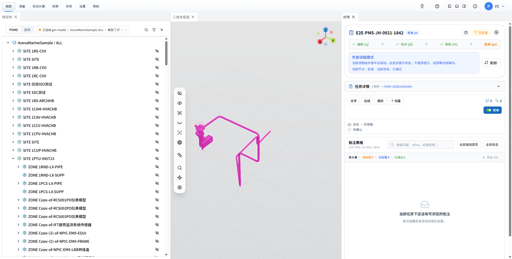
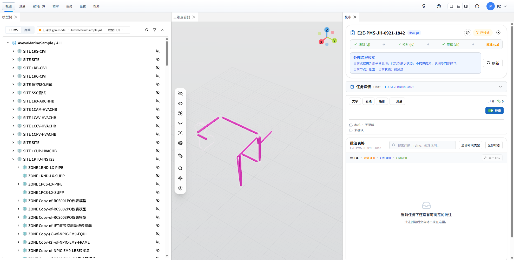
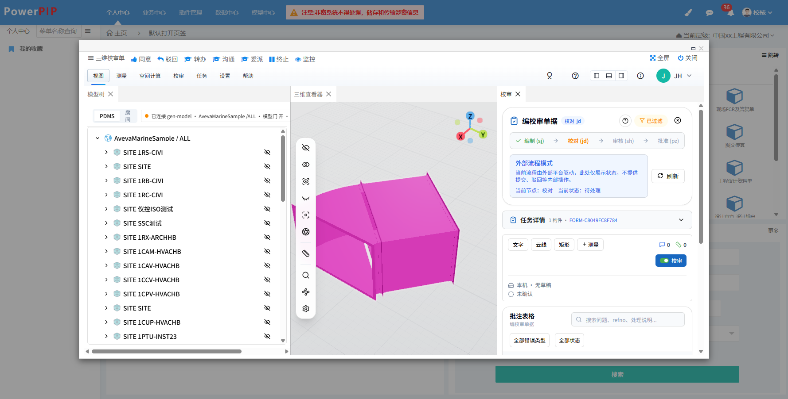
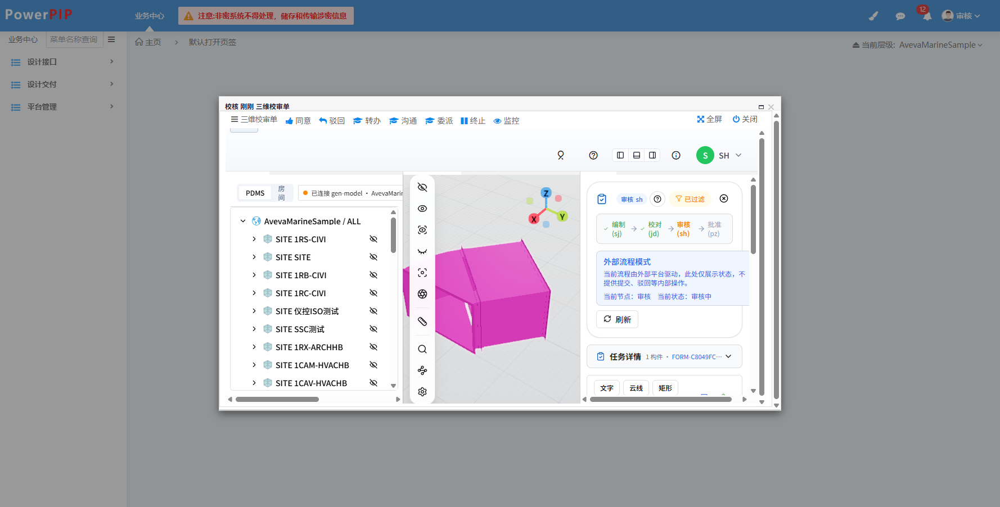
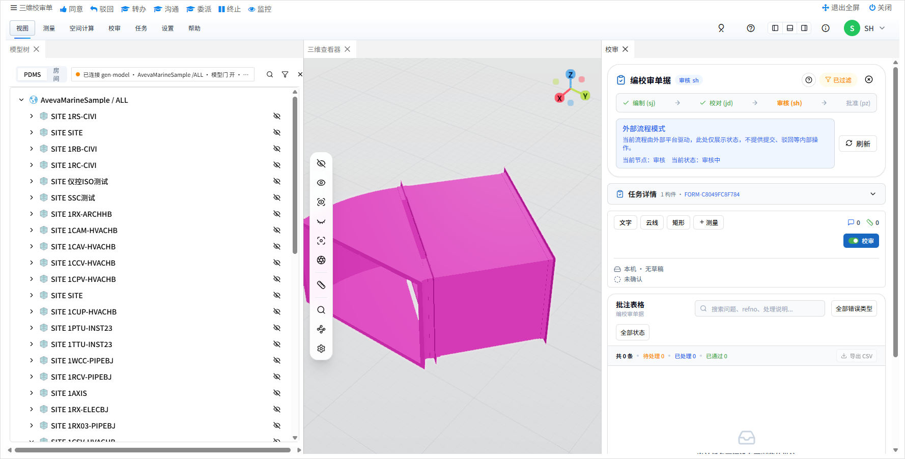

# 校审单流转到 JH / SH / PZ 后三维视口空白——线上复验（2026-09-24）

对应 CHANGELOG「校审单流转到 JH / SH / PZ 后三维视口不再空白…」条目；GitHub issue [#84](https://github.com/happyrust/plant3d-web/issues/84)；修复提交 `0dec493d`。

## 根因一句话

审核侧落点 `ReviewPanel` 装完模型自动「只显示任务构件」：`setObjectsVisible(全部, false)` 后只亮任务单元键 `24384_24935`（BRAN），而 BRAN 自己一个 DTX 对象都没有——几何在成员 BEND `24384_24936` / STRT `24384_24939` 名下（HVAC 支管没有隐含管子）→ 视口空白；模型树那份 `useModelGeneration` 再对同一 BRAN 报「1 个 refno 没有几何记录」。设计端（SJ）没有这一步，所以只在流转到后续人员后才看得见。

## 1. 部署

- `git push origin main`（`fe5a2786..0dec493d`）→ `gh workflow run deploy-ubuntu.yml --ref main` → run [35951124846](https://github.com/happyrust/plant3d-web/actions/runs/35951124846) `success`（03:21:43Z 起，03:23:28Z 完）。
- 验收：`http://123.57.182.243/version.json` → `commit 0dec493d…`，`buildDate 2026-09-24 03:22:55 UTC`；80 / 443 首页同为 `assets/index-DARS-7AE.js`。

## 2. 线上复验：单据 `FORM-C8049FC8F784`

token 直接向模型中心领（与 PMS 页面 `GetZyModeInfo` 同一条路，不必登 PMS）：

```powershell
Invoke-RestMethod -Uri http://123.57.182.243/api/auth/token -Method Post -ContentType application/json `
  -Body '{"username":"JH","project":"AvevaMarineSample","role":"jd","form_id":"FORM-C8049FC8F784"}'
# code=0 form_id=FORM-C8049FC8F784；SH 同法 role=sh
```

`POST /api/review/workflow/sync action=query`（JH）→ `formExists=true formStatus=active currentNode=jd taskStatus=submitted models=["24384_24935"] records=0`——单据仍停在校对节点，正是 issue 现场。

嵌入地址 `http://123.57.182.243/review/3d-view?form_id=FORM-C8049FC8F784&user_token=<jwt>&output_project=AvevaMarineSample`，headless Chrome 152（`--headless=new --use-angle=swiftshader`，CDP 9448）经 chrome-devtools-mcp 打开，JH / SH 各一个隔离 context。

| 读数（页内 `window.__xeokitViewer.scene`） | JH（jd） | SH（sh） |
| --- | --- | --- |
| 载入的包 | `index-DARS-7AE.js` | 同 |
| 状态表 `objectIds` 总数 | 47 | 47 |
| 有 DTX 对象的 refno | 仅 `24384_24936`(1) / `24384_24939`(1) | 同 |
| 其中可见 / 被藏 | 2 可见 / **0 被藏** | 同 |
| `getSubtreeRefnos(['24384_24935'])` | `['24384_24936','24384_24939']` | — |
| `getAABB([BRAN])` / `getSubtreeAABB([BRAN])` | `null` / `[-1.00,-1.18,-0.55, 1.00,1.18,0.55]` | — |
| 面板 | 「当前节点：校对 · 待处理」「任务详情 1 构件 · FORM-C8049FC8F784」 | 同 |
| 「没有几何记录 / 未绘制实例」文案 | 无 | 无 |
| console `error` / `warn` | 0 / 0 | — |

console 顺序（JH）：`[embed][form-restore] workflow snapshot resolved` → `task components replaced from workflow snapshot` → `[embed][viewer-restore] showModelByRefnos result` → `[ModelTreePanel] autoLocateRefno … 24384/24935` → `Node located in tree` → **`Model already loaded: 24384/24935`**（修前这一步是 `Auto-load failed` + 警告 toast）。


### 2.1 同一场景回放旧逻辑（证根因 ①）

在 JH 页面里按修前 `filterModelByTask` 的两步手动执行：`setObjectsVisible(objectIds, false)` → `setObjectsVisible(['24384_24935'], true)`，有几何且可见的 refno 立刻变成 `[]`（BRAN 自己 `_getDtxObjectIds` = 0），视口只剩隐藏几何的淡轮廓：



再按新逻辑 `setObjectsVisible([BRAN, ...getSubtreeRefnos([BRAN])], true)` → 可见几何回到 `['24384_24936','24384_24939']`，画面与上图一致。

### 2.2 SH 打开同一单据



### 2.3 cua 走真实 PMS 入口（JH / SH / PZ）

§2 的 token 是向模型中心直领的；这一节补用户真实的打开路径（11:30–12:40，cua-driver 0.20.0 操作有界面的 Chrome 152，临时 profile，带 `--disable-features=CalculateNativeWinOcclusion --disable-backgrounding-occluded-windows` 保证窗口被遮挡时照常渲染）：

1. PMS `sysin.html` 登录（账号见 `AGENTS.md`；表单经 CDP 填写并提交，原因见备注）；
2. **JH**：个人中心「我的审批 · 待处理的」第一行「三维校审单 设计|2026-09-23」——cua `click` 按 `element_token` 走 UIA Invoke 点开，PMS 弹出审批窗「[校核]」；
3. **SH**：JH → 审核这一步由 §2.5 在 12:10 办完（模型中心 `current_node=sh`、`task_status=in_review`）。SH 登录后顶栏「待审批事项」由 11 条变 12 条，点开第一条「校核 刚刚 三维校审单」（同样 UIA Invoke），PMS 弹出审批窗「[审核]」；
4. **SH → 批准**（12:35）：审批窗「同意」（cua UIA Invoke）→ 弹出 `WorkNodeSelect`「审批处理 · 即将流转到 ☑批准」，目标人一个都没预选（与 §2.5 JH 那一步相同，不选直接提交不会发）——经 CDP 选中「批准」（PZ 的显示名）、填处理意见「审核通过（#84 上线复验：SH 从 PMS 待审批事项打开，三维视口模型正常）」→ cua 点「提 交」→ 模型中心 `current_node=pz`、`task_status=in_review`；
5. **PZ**：登录后「待审批事项」7 条，第一条「审核 刚刚 三维校审单」（UIA Invoke）→ 审批窗「[批准]」；
6. 三个审批窗里嵌入的都是 `/review/3d-view?form_id=FORM-C8049FC8F784&user_token=<PMS 当场签发的 token>&output_project=AvevaMarineSample`，token 分别是 `JH / role=jd`、`SH / role=sh`、`PZ / role=pz`。

| 读数 | JH（校对） | SH（审核） | PZ（批准） |
| --- | --- | --- | --- |
| 载入的包 / `version.json` | `index-DARS-7AE.js` / `0dec493d` | 同 | 同 |
| 面板 | 「当前节点：校对 · 待处理」，「已过滤」开着 | 「当前节点：审核 · 审核中」，「已过滤」开着 | 「当前节点：批准 · 审核中」，「已过滤」开着 |
| `scene.objects` 里 `24384_24935` / `24384_24936` / `24384_24939` | 都在，都 `visible=true`（47 条状态里 9 条可见） | 同 | 同 |
| 「没有几何记录 / 加载结束但未绘制实例」文案、snackbar | 无 | 无 | 无 |
| cua 点「已过滤」（`help="显示所有模型"`） | 过滤关掉，47 / 47 可见——「显示全部」能恢复 | 未点 | 未点 |

JH 这条隔约 10 分钟重新登录、再点同一行重跑一遍，读数相同。单据现停在批准节点（PZ 未同意）。







### 2.4 管道 BRAN 单据（PZ · `FORM-2EBB10854469` · `24381_145018`）：配件也亮了

修前对管道 BRAN 的症状是「只剩管子亮着、配件全藏」（issue 根因 ① 末句）。用 09-21 e2e 留下的已批准单据 `FORM-2EBB10854469`（`workflow/sync?query`：`formStatus=approved currentNode=pz models=["24381_145018"]`），PZ（pz）直领 token 打开，页面「当前节点：批准 · 已通过」（11:52，headless Chrome 152 / CDP 9448，隔离 context）：

| 读数 | 结果 |
| --- | --- |
| 状态表 240 条里有 DTX 对象的 refno | 12 个：BRAN `24381_145018` 自己 **11** 个（隐含管子 TUBI）+ 成员 `145019 / 145021 / 145023 / 145025 / 145026 / 145028 / 145029 / 145031 / 145032 / 145033 / 145035` 各 1 |
| 其中可见 / 被藏 | **12 / 0** |
| `getSubtreeRefnos(['24381_145018'])` | 上述 12 个（含 BRAN 自己——它有管子对象） |
| `getAABB([BRAN])` vs `getSubtreeAABB([BRAN])` | `x∈[-4.45, 3.86]` vs `x∈[-4.45, 4.45]`、`z∈[-3.32, 2.17]` vs `z∈[-3.32, 3.32]`——配件把盒撑大，相机按子树盒飞 |
| 「没有几何记录」文案 | 无 |



同页回放旧两步 `setObjectsVisible(全部,false)` → `setObjectsVisible([BRAN],true)`：有几何且可见的只剩 `['24381_145018']`（11 段管子），每个转角都断开、左端阀组消失——这就是 e2e 一直没人注意的「只剩管子」：



再按新逻辑亮 `[BRAN, ...getSubtreeRefnos([BRAN])]` → 可见 12 / 被藏 0，回到上图。

### 2.5 单据在 PMS 里由 JH 同意推到审核（§2.3 SH 那一行的前置动作）

12:05–12:12，headless Chrome 152（CDP 9448）+ chrome-devtools-mcp，JH / SH 各一个隔离 context，全走 PMS 真实界面：

1. **JH** `sysin.html` 登录 → 个人中心「我的审批 · 待处理的」第一行「三维校审单 设计|2026-09-23」→ 审批窗「[校核]」（嵌入页 `form_id=FORM-C8049FC8F784`、`role=jd`，模型正常，图 06）→ **同意**（PMS 先发 `POST /HD/PreValidate`）→ 弹「审批处理」（`WorkNodeSelect.html`）：「即将流转到 ☑ 审核」、处理意见、目标人列表 `U021 … U030 / 审核`。
2. **坑**：这张单的审核节点没有预选目标人，直接点「提 交」什么都不发生——`CheckSelectUser()` 里 `Power.ui.warning("对不起，节点[审核]没有选择目标人")` 一闪而过，网络上没有 `SyncRevInfo`。在列表里点选「审核」（即 SH 账号的显示名）后再「提 交」→ `SyncRevInfo` → 模型中心 `workflow/sync action=agree`。
3. 随即 `workflow/sync?query`：`formStatus=active currentNode=jd taskStatus=submitted` → **`currentNode=sh taskStatus=in_review`**，`models=["24384_24935"]` 不变。
4. **SH** 登录 → 顶栏「待审批事项」（11 → 12）→ 第一条「校核 刚刚 三维校审单」→ 审批窗「[审核]」，嵌入页 `form_id=FORM-C8049FC8F784`、`user_token` 为 PMS 当场签的 `SH / role=sh`。

SH 审批窗读数（页面 console 里能看到嵌入 iframe 的日志）：`[useUserStore] 嵌入模式：已创建并切换到外部用户 SH, workflowRole=reviewer (verified)` → `嵌入模式角色落点: reviewer` → `[embed][form-restore] workflow snapshot resolved` → `task components replaced from workflow snapshot` → `[embed][viewer-restore] showModelByRefnos result` → `[ModelTreePanel] … Model already loaded: 24384/24935`；面板「审核 (sh)」为当前节点、「当前节点：审核 · 当前状态：审核中」、「已过滤」开着、「任务详情 1 构件 · FORM-C8049FC8F784」；无「没有几何记录」文案；console error / warn 0。







## 3. 本地验证（提交前）

- vitest：`taskModelFilter.test.ts` 5 例、`DtxCompatScene.getSubtreeAABB.test.ts` 7 例（+3 `getSubtreeRefnos`）、`useModelGeneration.genModelV1.test.ts` 29 例（+2 #84）——3 文件 41 passed。
- AGENTS.md 双胞胎面板 5 套：`ReviewPanel` 49 / `DesignerCommentHandlingPanel` / `AnnotationTableView` / `AnnotationSheetWorkspace` / `ReviewCommentsTimeline` 共 125 passed，0 fail（无新增）。
- eslint 触及 8 文件 0 错误；`npm run type-check` 触及文件新增 0（基线外仅剩 `d0cd5971` 带进来的 `instanceMapping.test.ts` 3 条 TS2531，本条未碰）。

## 备注

- 验证用 Chrome profile（`%TEMP%\chrome-9448-profile-84`）用完即删；token 24 h 后自然失效。
- 修前线上包已被覆盖，「修前」证据以 §2.1 同场景回放 + issue 正文（09-23 现场）为准。
- §2.3 的 cua 做法：Cursor 里 cua 的 MCP 回执只有文字摘要，看不到 `snapshot_id` / `element_token` / 浏览器 `tab_id`，带索引的点击和 `browser_*` 都会被拒；改用 `cua-driver call <tool> <json>` CLI，JSON 里有 `element_token`，再按它点。Chromium 网页内容对背景像素点击（PostMessage）没反应；前台 `type_text` 有一次打到一半丢了焦点、后半截按键落到别的前台窗口，所以登录表单改走 CDP。临时 profile 用完即删。
