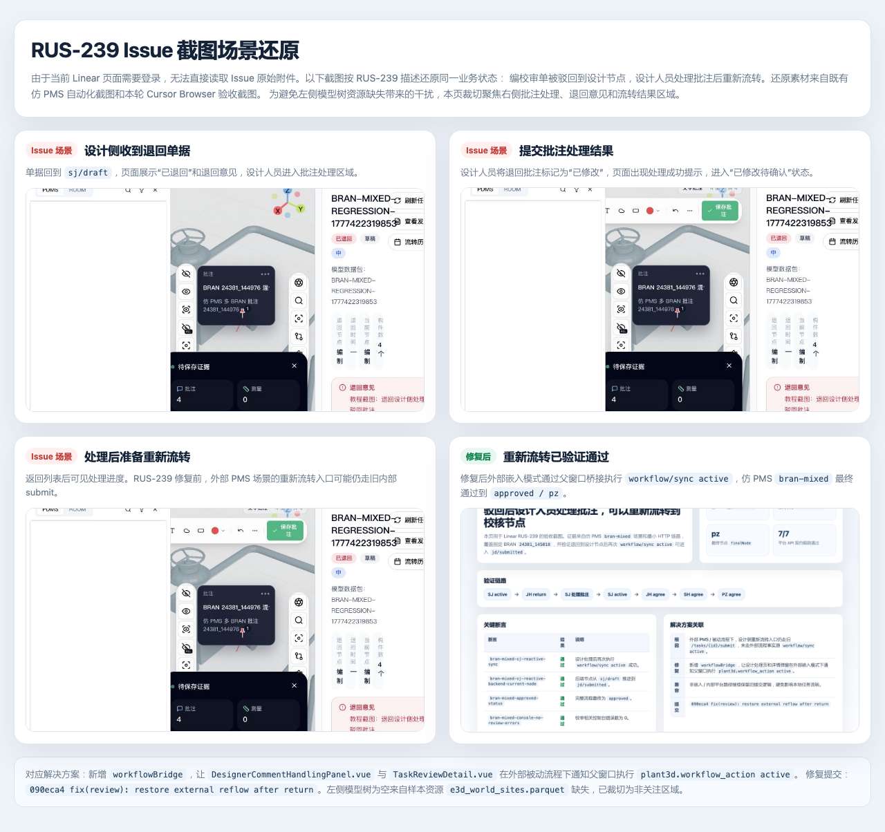

# RUS-239 Issue 截图场景还原

## 说明

当前 Linear 页面需要登录，无法直接读取 RUS-239 Issue 原始附件。因此本文件按 Issue 描述还原同一业务状态：编校审单被驳回到设计节点后，设计人员处理批注，然后重新流转。

还原截图已刻意裁切到右侧批注处理、退回意见和流转结果区域，避免左侧模型树为空造成误解。左侧模型树为空是样本环境 `e3d_world_sites.parquet` 资源缺失导致，影响 PDMS 模型树显示，但不影响 RUS-239 的驳回处理和重新流转验证。

还原素材来自：

- `docs/verification/images/设计侧驳回单据处理教程-2026-04-29/`
- `docs/verification/images/rus-239-reflow-after-return/02-rus-239-evidence-summary.png`
- `artifacts/rus-239-bran-mixed-report.json`

## 还原截图

### 总览拼图

这张图把 Issue 场景和修复后验证结果放在同一张截图中，适合贴到 RUS-239 的评论里说明“原问题表现”和“修复后结果”。

### 裁切版总览拼图

这张图隐藏左侧空模型树，重点展示 Issue 关注的退回意见、批注处理、重新流转和修复后验证结果。

### 1. 设计侧收到退回单据

单据回到 `sj/draft`，页面展示“已退回”和退回意见，设计人员进入批注处理区域。

### 2. 提交批注处理结果

设计人员将退回批注标记为“已修改”，页面出现处理成功提示，进入“已修改待确认”状态。

### 3. 处理后准备重新流转

返回列表后可见处理进度。RUS-239 修复前，外部 PMS 场景的重新流转入口可能仍走旧内部 submit。

### 4. 修复后重新流转已验证通过

修复后外部嵌入模式通过父窗口桥接执行 `workflow/sync active`，仿 PMS `bran-mixed` 最终通过到 `approved / pz`。

## 关联解决方案

- 修复提交：`090eca4 fix(review): restore external reflow after return`
- 关键修复：
  - 新增 `workflowBridge`。
  - `DesignerCommentHandlingPanel.vue` 的“流转回校对”在外部嵌入模式下通知父窗口执行 `active`。
  - `TaskReviewDetail.vue` 的“再次提交”在外部嵌入模式下同样通知父窗口执行 `active`。
  - 非嵌入 / 内部平台路径继续保留旧提交逻辑。
- 验证 BRAN：`24381_145018`
- 验证链路：`SJ active -> JH return -> SJ active -> JH agree -> SH agree -> PZ agree`
- 最终结果：`approved / pz`
