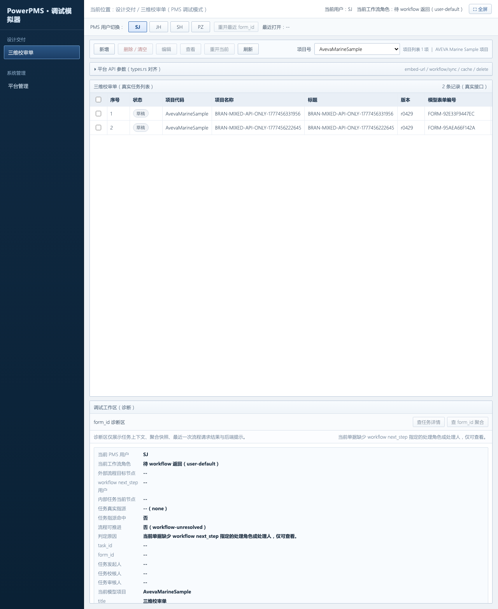
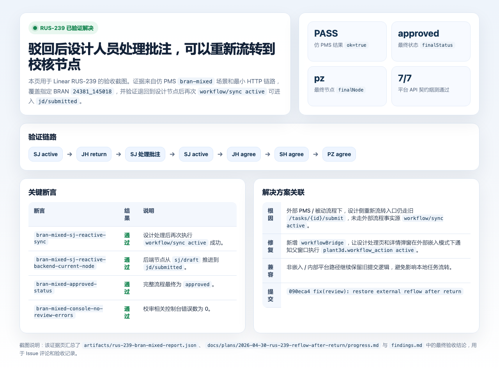
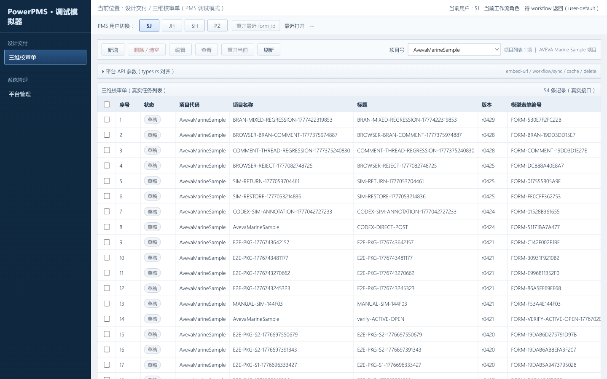
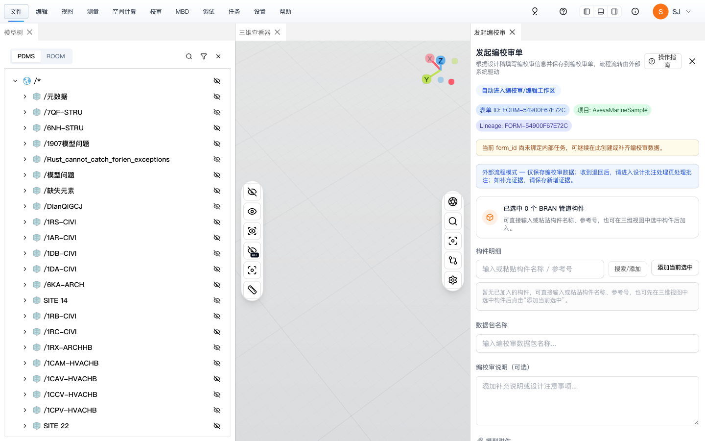
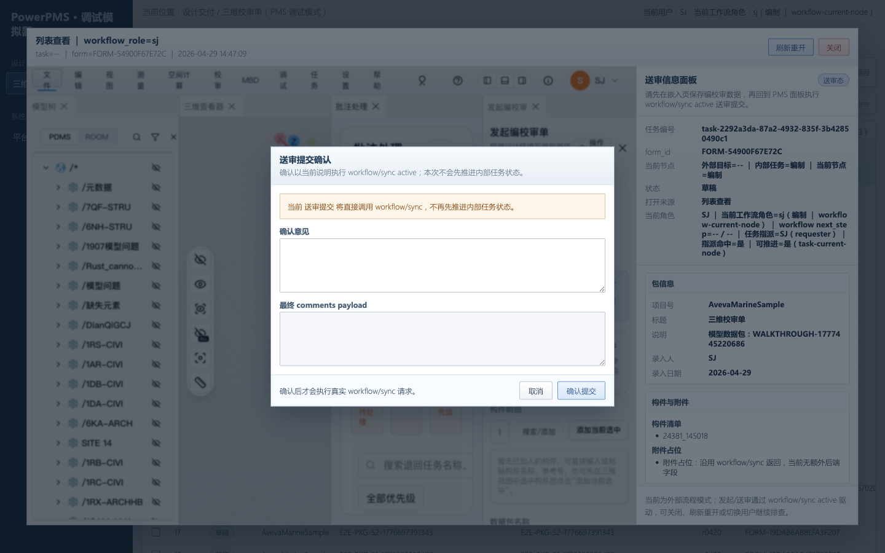
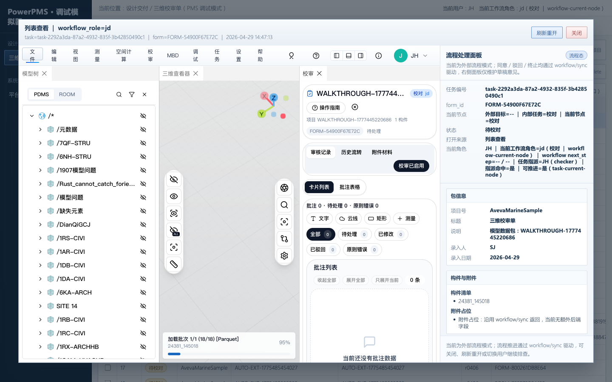
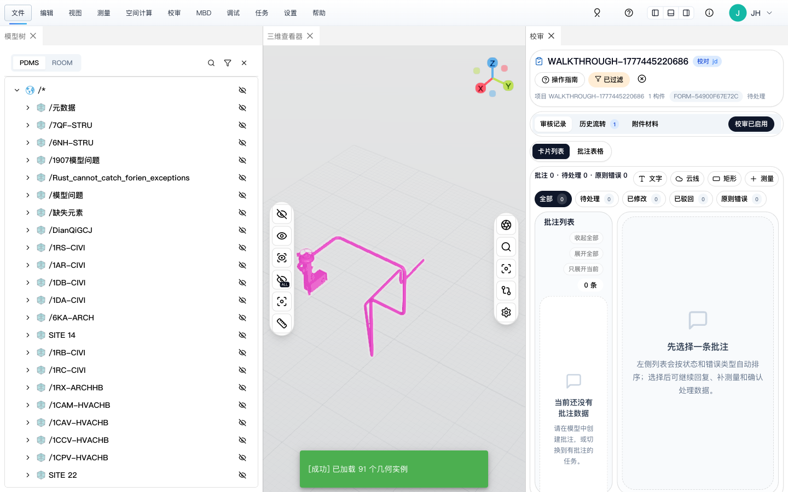
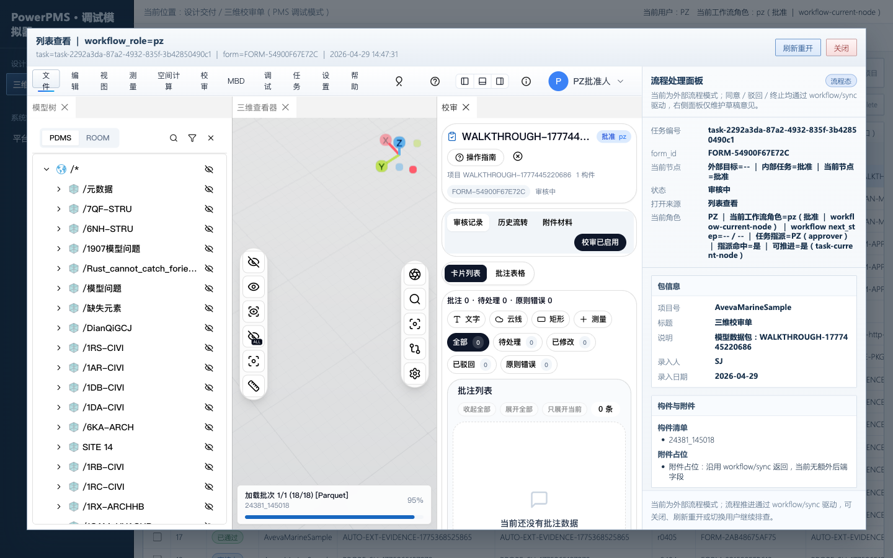
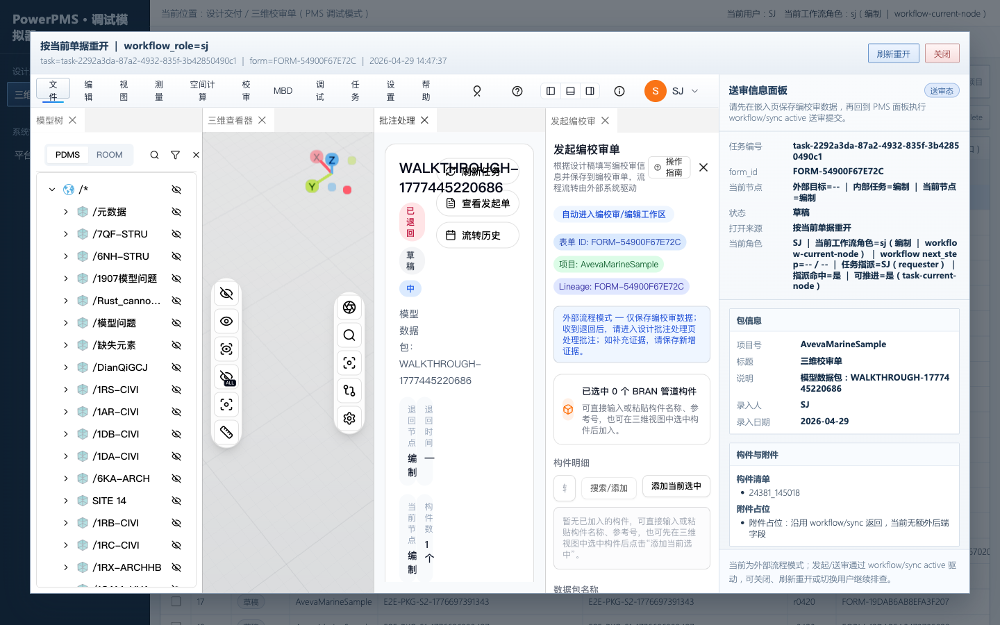
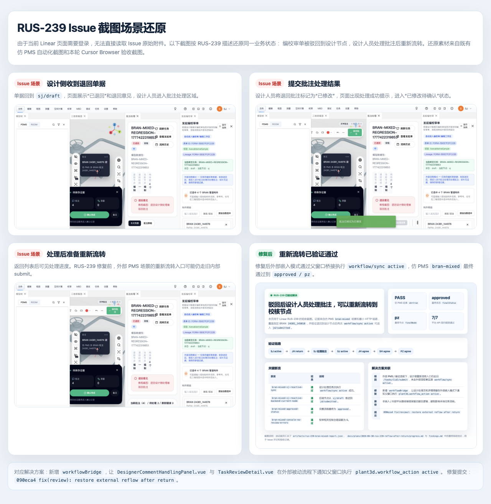

# RUS-239 驳回后重新流转 — 2026-05-02 回归验证

## 结论

RUS-239 **已修复**。2026-05-02 使用仿 PMS 模拟器和最小 HTTP API 链路双重回归验证，设计人员在编校审单被驳回后可以成功重新流转。

## 关联

| 项目 | 值 |
|---|---|
| Linear Issue | [RUS-239](https://linear.app/rustdpc/issue/RUS-239/驳回的问题设计人员处理后无法用重新流转) |
| 修复提交 | `090eca4 fix(review): restore external reflow after return` |
| 修复分支 | `main`（HEAD） |
| 前次验证 | `docs/verification/rus-239-reflow-after-return-evidence.md`（2026-04-30） |

## 验证方式

### 1. 最小 HTTP API 链路（exit code 0）

在新启动的后端上执行完整 `workflow/sync` 序列，覆盖 RUS-239 核心路径。

| 步骤 | API 调用 | 结果 |
|---|---|---|
| [1] 认证 | `POST /api/auth/token` | OK（Bearer token 获取成功） |
| [2] 嵌入上下文 | `POST /api/review/embed-url` | `FORM-E1DDF11C0020` |
| [3] 创建任务 | `POST /api/review/tasks` | `task-cf7f1cf7-eb8a-4ec4-8156-0f1c9191bda3` |
| [4] SJ 提交 | `workflow/sync action=active` | code=200 success |
| [5] JH 驳回 | `workflow/sync action=return` | code=200 success |
| [6] 驳回后状态 | `workflow/sync action=query` | **node=sj status=draft** |
| **[7] SJ 重新流转** | **`workflow/sync action=active`** | **code=200 success** |
| **[8] 重新流转后状态** | **`workflow/sync action=query`** | **node=jd status=submitted** |
| [9] JH 同意 | `workflow/sync action=agree` | code=200 success |
| [10] SH 同意 | `workflow/sync action=agree` | code=200 success |
| [11] PZ 同意 | `workflow/sync action=agree` | code=200 success |
| [12] 最终状态 | `workflow/sync action=query` | **node=pz task=approved form=approved** |

**关键断言**：
- 步骤 [7]：驳回返回 `sj/draft` 后，SJ 以 `active` 动作重新流转，返回 `200 success` — **RUS-239 修复生效**
- 步骤 [8]：重新流转后状态为 `jd/submitted`，校核可以继续处理
- 步骤 [12]：完整流程走到 `pz/approved`，端到端闭环

### 2. 仿 PMS 模拟器 `bran-mixed`（CLI 自动化）

```bash
PMS_TARGET_BRAN_REFNO=24381_145018 \
PMS_SIMULATOR_CASE=bran-mixed \
PMS_SIMULATOR_TRACE=1 \
PMS_SIMULATOR_OUTPUT=artifacts/rus-239-retest-2026-05-02.json \
npm run test:pms:simulator
```

| 检查项 | 结果 |
|---|---|
| 平台 API 契约烟测 | 7/7 通过 |
| bran-mixed 关键路径 | `SJ active -> JH return -> SJ active -> JH agree` 全部成功 |
| 后段完成状态 | `SH agree` 阶段后端超时（已知自动化负载问题，非业务问题） |

日志关键节点：

```
[pms-simulator] runWorkflowAction action=active  form_id=FORM-F61CCCDE1E72 node=--
[pms-simulator] runWorkflowAction action=return  form_id=FORM-F61CCCDE1E72 node=jd
[pms-simulator] runWorkflowAction action=active  form_id=FORM-F61CCCDE1E72 node=sj  ← RUS-239 KEY
[pms-simulator] runWorkflowAction action=agree   form_id=FORM-F61CCCDE1E72 node=jd
```

## 根因回顾

外部 PMS / 被动流程下，设计侧"流转回校对"和详情弹窗"再次提交"入口走旧 `/api/review/tasks/{id}/submit` 路径，该路径不具备外部流程的 `actor`、`next_step`、父窗口同步语义，导致退回设计节点后的重新流转不可继续。

## 修复内容

| 文件 | 变更 |
|---|---|
| `src/components/review/workflowBridge.ts` | 新增：外部被动流程下通过父窗口桥接发送 `plant3d.workflow_action` |
| `src/components/review/DesignerCommentHandlingPanel.vue` | "流转回校对"在外部嵌入模式下改为触发 `active` 桥接 |
| `src/components/review/TaskReviewDetail.vue` | "再次提交"在外部嵌入模式下优先触发 `active` 桥接 |
| `scripts/pms-simulator-runner.ts` | 发起后关闭额外独立 `3d-view` 页面，降低后端负载 |
| `src/debug/pmsReviewSimulator.ts` | 诊断刷新改为并发读取，避免串行阻塞 |

## 截图证据

以下截图来自 2026-04-29/30 的仿 PMS 完整验证周期，覆盖 RUS-239 的完整驳回重新流转场景。

### 仿 PMS 模拟器入口



### RUS-239 验收证据汇总



### 驳回链路完整自动化演示

#### 1. SJ 发起编校审






#### 2. SJ 提交流转





#### 3. JH 打开并操作





#### 4. PZ 驳回




#### 5. SJ 重新打开并处理（RUS-239 关键步骤）




### Issue 原始截图还原




## 测试环境

| 参数 | 值 |
|---|---|
| 日期 | 2026-05-02 22:22 CST |
| 后端 | `http://127.0.0.1:3100`（本地 `web_server` release 构建） |
| 前端 | `http://127.0.0.1:3101`（Vite dev server） |
| 数据库 | SurrealDB `ws://127.0.0.1:8020` → `1516/AvevaMarineSample` |
| 项目 | `AvevaMarineSample` |
| BRAN | `24381_145018` |
| 后端配置 | `db_options/DbOption-mac.toml`（`review_auth.enabled=false`，`platform_auth.enabled=true`） |

## 建议

- Linear RUS-239 状态应从 `Backlog` 更新为 `Done`
- 后段仿 PMS 自动化超时属于 `bran-mixed` 场景的已知负载问题，与 RUS-239 业务逻辑无关
