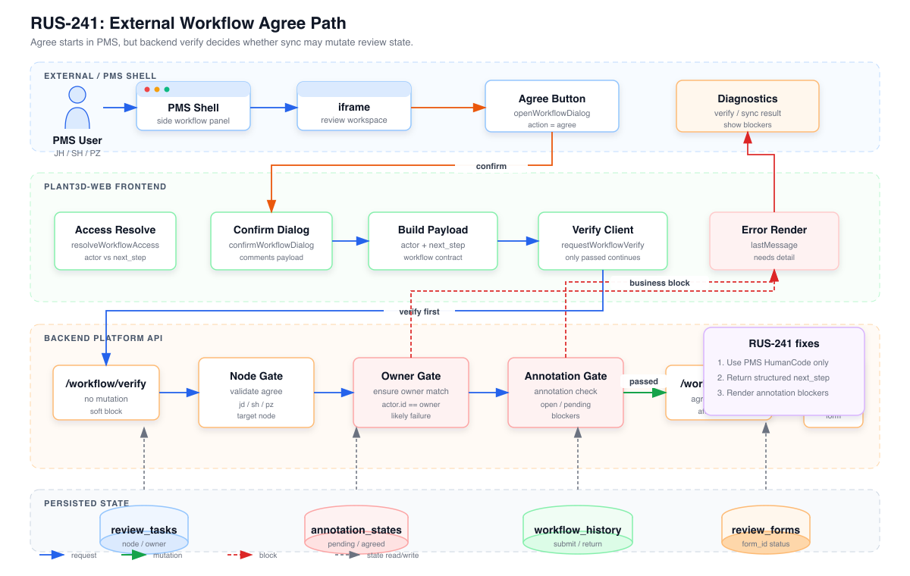

# RUS-241 审批同意链路架构与修复方案

> Issue：`走到审批流程无法完成同意操作`
>
> 说明：当前无法直接读取 Linear 正文，本文基于 issue 标题、仿 PMS / Plant3D 现有代码链路，以及后端 `workflow/verify` / `workflow/sync` 契约分析。

## 架构图

- SVG：[`rus-241-workflow-agree-architecture.svg`](./rus-241-workflow-agree-architecture.svg)
- PNG：[`rus-241-workflow-agree-architecture.png`](./rus-241-workflow-agree-architecture.png)



## 需求理解

RUS-241 的核心问题不是“按钮点不动”这么简单，而是外部审批流程中 `agree` 动作没有完成最终流转。当前仿 PMS / external 模式下，“同意”动作属于外部流程驱动：

1. 右侧 PMS 面板打开确认弹窗。
2. 前端构建 `workflow/verify` payload。
3. 后端先做节点、身份、下一步处理人、批注状态校验。
4. `verify.passed=true` 后，前端才调用 `workflow/sync?action=agree`。
5. 后端更新 `review_tasks`、`review_forms`，并写入 `review_workflow_history`。

因此失败可能发生在三类地方：

- 当前用户不是当前节点负责人。
- `next_step` 缺失或目标节点不符合当前节点。
- 批注状态门禁未通过，例如仍有待处理、待确认或已驳回批注。

## 关键链路

### 1. 前端入口

仿 PMS 的右侧按钮绑定在 `src/debug/pmsReviewSimulator.ts`：

- `panelActionAgreeBtn` 点击后调用 `openWorkflowDialog('agree')`。
- 确认弹窗提交后调用 `confirmWorkflowDialog()`。
- 最终进入 `executeWorkflowAction('agree', comment, targetNode)`。

`executeWorkflowAction` 的核心原则是：先 `workflow/verify`，再 `workflow/sync`。这保证业务门禁可以在真正落库前给出明确拦截。

### 2. Payload 组成

前端 `buildWorkflowMutationPayload` 会构建：

- `form_id`：外部流程稳定主键。
- `token`：S2S / embed token。
- `action: 'agree'`。
- `actor`：当前 PMS 用户与工作流角色，例如 `{ id: 'JH', roles: 'jd' }`。仿 PMS 也应使用真实 PMS 一致的 HumanCode，不应主动生成内部测试账号 ID。
- `next_step`：非终态节点继续向后推进时需要，例如 `jd -> sh`、`sh -> pz`。
- `comments`：用户填写的处理意见。

这意味着 `actor.id` 和 `next_step.assignee_id` 的 ID 体系必须一致，否则后端权限校验会失败。

### 3. 后端 verify

后端 `validate_workflow_agree` 的校验顺序是：

1. 根据 `form_id` 找到活动 `review_tasks`。
2. 读取 `current_node`。
3. 确认当前节点只能是 `jd / sh / pz`。
4. 校验当前请求人是当前节点负责人。
5. 非 `pz` 节点必须提供正确 `next_step`：
   - `jd` 只能推进到 `sh`。
   - `sh` 只能推进到 `pz`。
6. 执行批注状态门禁 `evaluate_annotation_check`。

只要其中任意一步失败，`workflow/verify` 会返回 `passed=false`，前端不应继续执行 `workflow/sync`。

### 4. 后端 sync

`workflow/sync?action=agree` 只在 verify 通过后执行。它会：

- 更新 `review_tasks.current_node`。
- 更新任务状态：`sh / pz` 为 `in_review`，最终 `pz agree` 为 `approved`。
- 更新下一节点负责人字段。
- 清空 `return_reason`。
- 同步 `review_forms` 状态。
- 写入 `review_workflow_history`。

## 最可能根因

### 根因 A：身份体系不一致

当前最可疑点是 `actor.id` 与任务负责人字段不一致。需要先明确边界：真实 PMS、仿 PMS、任务 owner、`next_step.assignee_id` 都应使用同一套 HumanCode；内部账号不再作为兼容输入。

示例：

- PMS / 仿 PMS 当前用户：`JH`
- 任务字段错误写成：`checker_id = proofreader_001`
- 正确任务字段应为：`checker_id = JH`
- 结果：后端应拦截并提示任务 owner 不是合法 PMS HumanCode，推动修正数据构造源头。

同类问题还可能出现在 `SH/PZ` 节点：如果任务字段写成内部账号或后端统一账号，应视为数据错误，而不是在审批校验里放宽匹配。

### 根因 B：`next_step` 信息不足

当前前端已经尝试读取 `workflowSnapshot.data.next_step`，但后端类型中 `SyncWorkflowData.next_step` 是字符串，无法稳定表达“下一处理人是谁”。前端只能回退到任务字段推断权限，这会放大身份不一致问题。

### 根因 C：批注门禁正确拦截但 UI 不清楚

`agree` 会执行批注状态检查。如果仍有未处理或待确认批注，后端应拦截。这种情况下问题不是流程坏了，而是 UI 没把 blockers 讲清楚，用户会误以为“同意操作失败”。

## 实现方案

### Phase 1：增强诊断

后端 `workflow/verify` 的失败响应增加结构化字段：

- `actor_id`
- `owner_id`
- `owner_source`
- `current_node`
- `task_status`
- `next_step`
- `annotation_check.summary`
- `annotation_check.blockers`

前端将这些信息显示在仿 PMS 诊断区和右侧面板中。目标是先区分：身份错、节点错、批注未过，还是 token/form_id 问题。

### Phase 2：统一 HumanCode 硬校验

在后端引入 HumanCode 规范化与白名单校验，而不是兼容内部账号。

校验逻辑保持严格授权：

```text
normalizeHumanCode(actor.id) == normalizeHumanCode(owner_id)
```

其中 `normalizeHumanCode` 只做 trim / 大写化，并校验值属于真实 PMS HumanCode 集合；如果 owner 是 `proofreader_001` 这类内部账号，直接返回数据不一致错误。

仿 PMS 新产生的 `user_id`、`actor.id`、`next_step.assignee_id` 必须保持 `SJ/JH/SH/PZ` 这类真实 PMS HumanCode，避免模拟环境偏离真实联调。

### Phase 3：结构化 next_step

把 `workflow/sync?action=query` 返回的下一处理人从字符串增强为结构化对象：

```json
{
  "next_step": {
    "assignee_id": "SH",
    "name": "SH",
    "roles": "sh"
  }
}
```

如果当前分支尚未发布，可以直接把下一处理人收敛为结构化字段，不为旧字符串语义额外保留分支。

前端优先读取结构化对象：

1. `next_step.assignee_id`
2. `next_step.roles`
3. 旧字符串字段
4. 任务当前节点与任务指派兜底

### Phase 4：前端错误展示

前端 verify 失败时，不再只显示一行 `workflow/verify 拦截`，而是按类型展示：

- 身份不匹配：显示当前用户、当前角色、期望处理人。
- 节点不匹配：显示当前节点和期望下一节点。
- 批注门禁失败：显示 blockers 数量、状态、标题、RefNo。

这能把“无法同意”转换成可执行提示：

- 换正确 PMS 用户重新打开。
- 先处理并确认批注。
- 修复单据负责人字段。

### Phase 5：验证

需要覆盖这些路径：

- SJ `active` 成功推进到 JH。
- JH `agree` 成功推进到 SH。
- SH `agree` 成功推进到 PZ。
- PZ `agree` 成功变为 `approved`。
- `JH` 与 `proofreader_001` 混用时必须被拦截，并提示 owner 不是合法 PMS HumanCode。
- 有未处理批注时，`agree` 必须被拦截，并返回 blockers。
- 错误用户打开时，只读或明确提示“当前用户不是处理人”。

## 技术决策

### 2026-05-08 落地状态

本次已把 RUS-241 的身份契约前移到任务创建阶段：

- `plant3d-web` 外部流程创建编校审单时不再提交空 `checkerId / approverId`，默认提交 `JH / SH` 这类 PMS HumanCode。
- `useUserStore` 不再把 `JH/SH/PZ` 映射到 `proofreader_001 / reviewer_001 / manager_001`，收件箱查询只使用当前 HumanCode。
- `plant-model-gen` 的 `create_task` 会拒绝空 assignee 和带下划线的旧内部账号，`reviewer_id` 固定与 `checker_id` 同源。
- 后端 mock 用户列表只暴露 `SJ / JH / SH / PZ`，旧内部账号只保留在历史数据读取/错误输入测试中。

因此真实 PMS 中再次出现 `proofreader_001 / manager_001` 时，应按数据构造源头缺陷处理，不应在 `workflow/verify` 或前端收件箱里继续做兼容别名。

### 保留 verify 前置校验

`workflow/verify` 是正确的架构边界。它能在真正修改流程状态前完成业务校验，避免错误落库。修复不应绕过 verify。

### 身份归一化放在后端

前端可以辅助判断可操作状态，但真正权限裁决必须在后端完成。真实 PMS、仿 PMS、任务 owner 应使用同一套 HumanCode；发现内部账号字段时应修正数据源，而不是在权限裁决中兼容。

### next_step 使用结构化事实

审批流程不仅要知道“当前节点是什么”，还要知道“当前该谁处理”。`roles` 和 `assignee_id` 应作为同一个结构返回，避免前端在多个来源之间猜测。

## 风险提示

- 不应简单移除 `ensure_owner_matches`，否则可能引入越权审批。
- 不应跳过 `evaluate_annotation_check`，否则会让未处理批注进入后续审批。
- 身份映射必须可审计，最好来自配置或后端统一用户表，临时硬编码只适合作为过渡。
- `next_step` 响应结构变化后，现有脚本应同步更新到结构化字段。
- 当前仓库工作区有大量未提交改动，实施时应严格限定修改文件，避免混入无关变更。

## 最小落地顺序

1. 先增强 verify 响应和前端错误展示。
2. 再做 HumanCode 严格校验与数据源修正。
3. 然后结构化 `next_step`。
4. 最后补全 SJ -> JH -> SH -> PZ 的自动化回归。

这个顺序能最快判断 RUS-241 的真实失败原因，同时避免一开始就大改流程状态模型。
