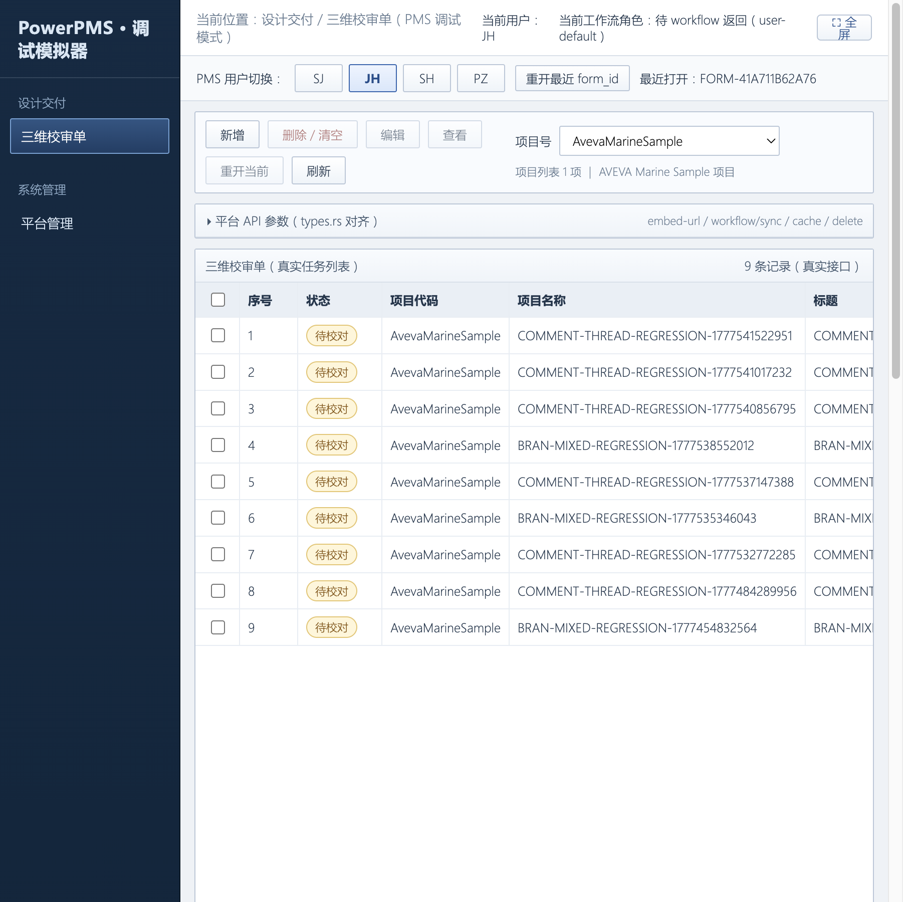
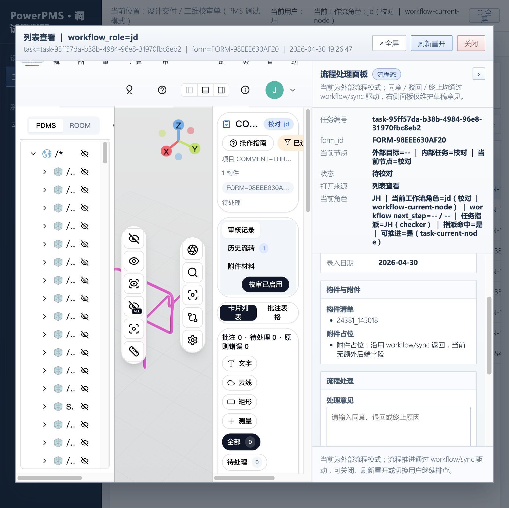
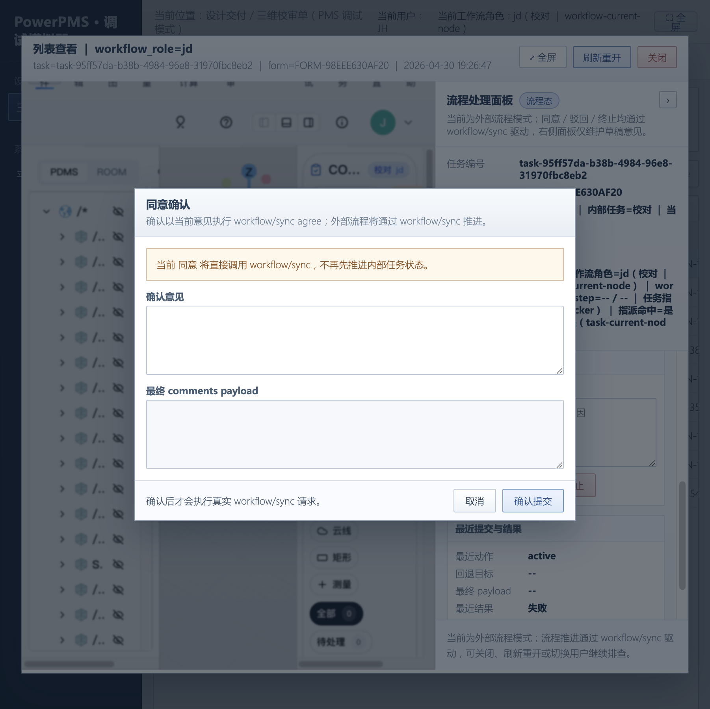
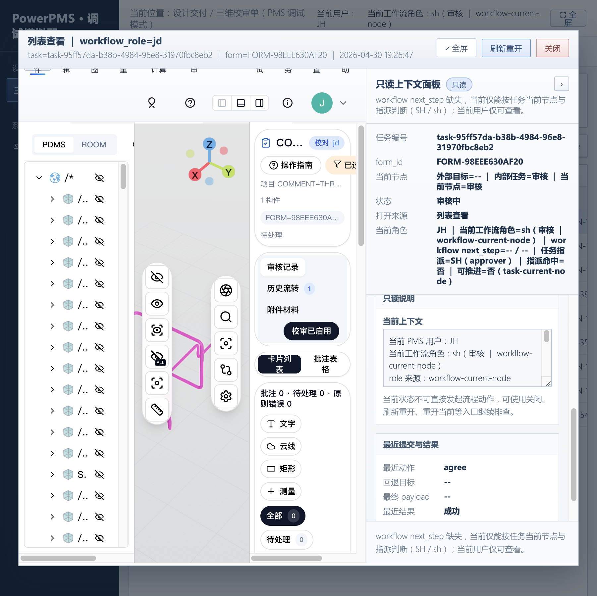

# RUS-241 审批同意流程修复验证

> 日期：2026-04-30  
> 关联：RUS-241 `走到审批流程无法完成同意操作`  
> 开发方案：`docs/plans/2026-04-30-rus-241-workflow-agree-fix/task_plan.md`  
> 架构图：`docs/plans/2026-04-30-rus-241-workflow-agree-fix/rus-241-workflow-agree-architecture.svg`

## 验证环境

- 前端：`http://127.0.0.1:3101`（Vite dev server）
- 后端：`http://127.0.0.1:3100`（plant-model-gen web_server）
- 数据库：本地 SurrealDB
- 验证工具：Cursor Browser

## 验证场景：JH 校对节点同意流转

### 步骤 1：JH 用户查看待校对任务列表

切换到 JH 用户后，列表显示 9 条待校对（`待校对`）状态任务。



### 步骤 2：打开待校对任务

双击第一条任务 `COMMENT-THREAD-REGRESSION-1777541522951`，Plant3D 嵌入页打开。

右侧显示：
- 任务编号：`task-95ff57da-b38b-4984-96e8-31970fbc8eb2`
- form_id：`FORM-98EEE630AF20`
- 状态：**待校对**
- 当前角色：JH | jd（校对 | workflow-current-node）
- 任务指派=JH（checker）| 指派命中=是
- 可推进=是（task-current-node）
- 构件清单：`24381_145018`



### 步骤 3：点击"同意"

点击右侧"同意"按钮，弹出确认对话框：
- 提示"确认以当前意见执行 workflow/sync agree"
- 可输入确认意见



### 步骤 4：确认提交——agree 成功

点击"确认提交"后，workflow/verify + workflow/sync agree 执行成功：

- **最近动作：agree**
- **最近结果：成功**
- 当前工作流角色已从 `jd（校对）` 自动变为 `sh（审核 | workflow-current-node）`
- 状态从"待校对"变为"**审核中**"
- 右侧切换为"只读上下文面板"，提示 JH 不再是当前节点负责人
- 任务指派=SH（approver）



## 修复内容总结

### 后端改动（.tmp/plant-model-gen-edit）

| 文件 | 改动 |
|------|------|
| `types.rs` | `VerifyWorkflowData` 新增 `block_code`/`actor_id`/`owner_id`/`owner_source`/`expected_next_node`/`requested_next_step` 诊断字段 |
| `types.rs` | 新增 `WorkflowVerifyNextStepDiagnostic` 和 `WorkflowNextStepDetail` 结构化类型 |
| `types.rs` | `SyncWorkflowData` 新增 `next_step_detail` |
| `workflow_sync.rs` | 新增 `normalize_pms_human_code()` 白名单校验（SJ/JH/SH/PZ） |
| `workflow_sync.rs` | `ensure_owner_matches` 改为 HumanCode 规范化后严格比较 |
| `workflow_sync.rs` | `WorkflowSyncActionError` 新增 `owner_mismatch`/`invalid_identity` |
| `workflow_sync.rs` | verify 响应填充全部诊断字段 |

### 前端改动

| 文件 | 改动 |
|------|------|
| `src/api/reviewApi.ts` | 新增 `WorkflowNextStepDetail` 类型 + `normalizeWorkflowNextStepDetail` |
| `src/debug/pmsReviewSimulator.ts` | 优先读取 `next_step_detail` + `buildAnnotationCheckBlockersHtml` |

### 测试验证

```
npm run type-check → 通过
npm run lint（涉及文件） → 通过
vitest run（RUS-241 相关） → 167 tests passed
```

## 待跟进

- 后端 `.tmp` 改动需同步到 `plant-model-gen` 仓后做 `cargo check`/`cargo test`
- 仿 PMS simulator-runner 端到端回归（`PMS_SIMULATOR_CASE=approved/gate-block`）
- WS review DB 环境复跑集成断言

## 2026-04-30 复查：问题是否仍存在

结论：RUS-241 主问题当前未复现。仿 PMS `approved` 端到端链路已复跑通过，覆盖 JH、SH、PZ 三个同意节点。

复查命令：

```bash
PMS_TARGET_BRAN_REFNO=24381_145018 \
PMS_SIMULATOR_CASE=approved \
PMS_SIMULATOR_TRACE=1 \
PMS_SIMULATOR_OUTPUT=artifacts/rus-241-approved-rerun-report.json \
npm run test:pms:simulator
```

结果：

- 契约烟测通过：`7/7`。
- 仿 PMS `approved` 通过：`ok=true`。
- 完整链路：`SJ active -> JH agree -> SH agree -> PZ agree`。
- 最终结果：`finalStatus=approved / finalNode=pz`。
- 报告文件：`artifacts/rus-241-approved-rerun-report.json`。

关键断言：

| 断言 | 结果 | 说明 |
| --- | --- | --- |
| `jh-agree-verify` | 通过 | `workflow/verify agree` 返回 `ok=true` |
| `jh-agree-sync` | 通过 | `workflow/sync agree` 提交成功 |
| `sh-agree-verify` | 通过 | `workflow/verify agree` 返回 `ok=true` |
| `sh-agree-sync` | 通过 | `workflow/sync agree` 提交成功 |
| `pz-agree-verify` | 通过 | `workflow/verify agree` 返回 `ok=true` |
| `pz-agree-sync` | 通过 | `workflow/sync agree` 提交成功 |
| `approved-status` | 通过 | 最终状态为 `approved` |
| `approved-node` | 通过 | 最终节点为 `pz` |

当前判断：

- “走到审批流程无法完成同意操作”在本地仿 PMS 主链中已不存在。
- 若真实 PMS 仍出现同类问题，应优先对照 `workflow/verify` 返回的 `block_code`、`actor_id`、`owner_id`、`owner_source`、`expected_next_node` 和 `requested_next_step` 诊断字段，判断是人员 HumanCode 不匹配、当前节点负责人不匹配，还是批注门禁拦截。
