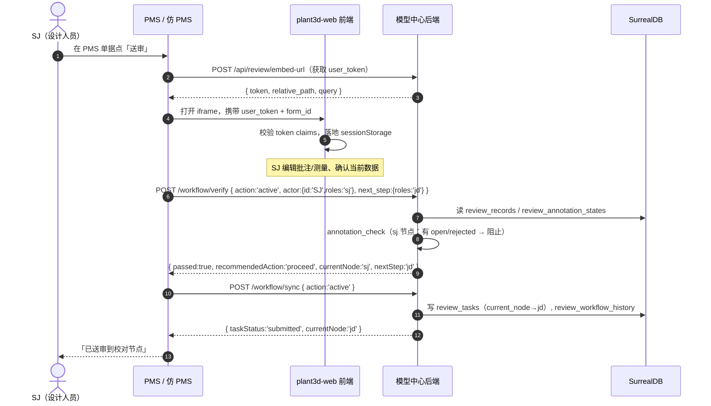
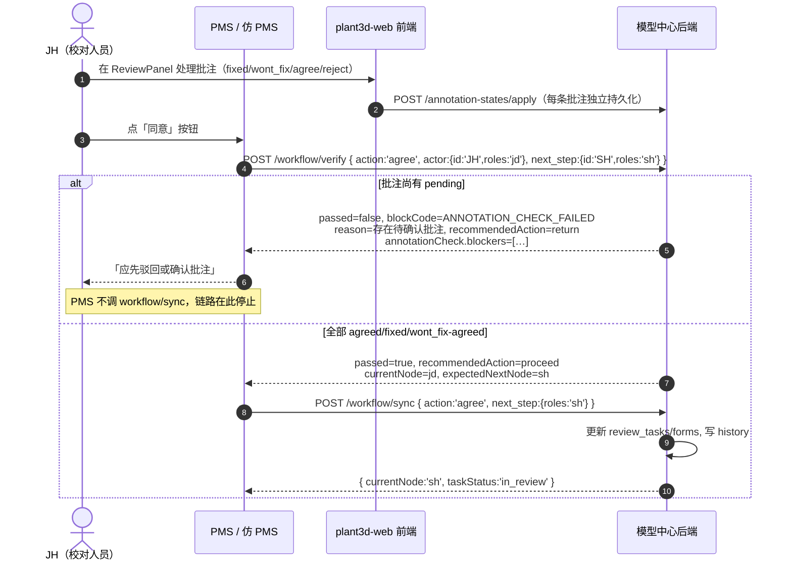
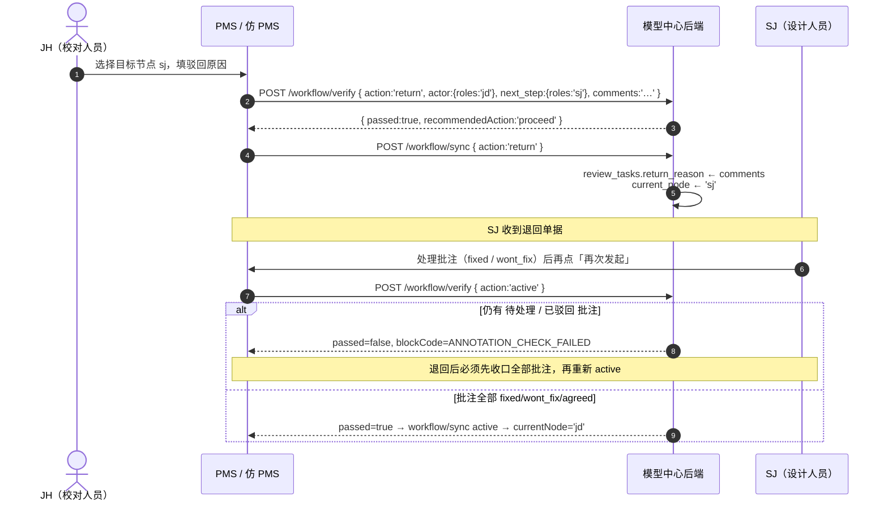
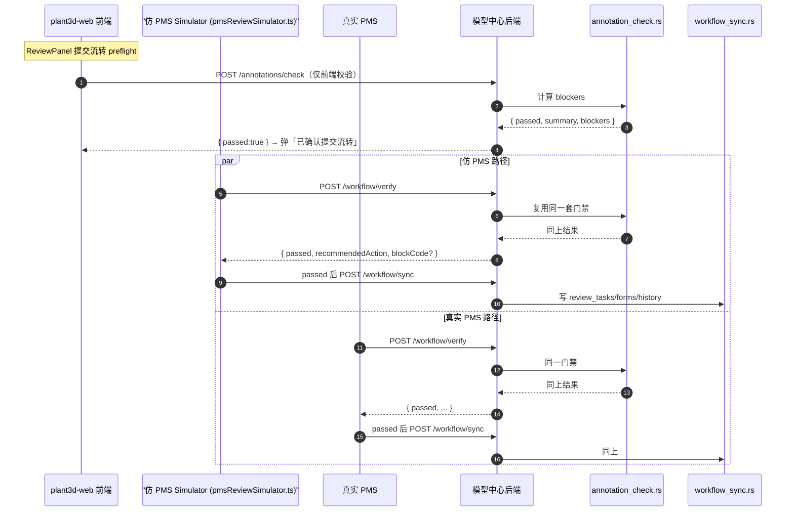

# 三维校审 workflow/verify 接口使用指南

> **范围**：`POST /api/review/workflow/verify` 在三维校审/编校审流程里的角色、调用时序、字段语义、与 `workflow/sync` / `annotations/check` 的协同关系，以及前后端常见踩坑点。
>
> **适用对象**：plant3d-web 前端开发、模型中心后端开发、PMS 联调与平台集成方、仿 PMS 模拟器 / E2E 自动化的维护者。
>
> **关联文档**：
> - `docs/verification/review-annotation-handling-architecture-2026-04-28.md`
> - `docs/verification/三维校审完整流程审查文档.md`
> - `docs/verification/rus-241-workflow-agree-architecture.md`
> - `docs/plans/2026-04-30-rus-241-workflow-agree-fix-plan.md`
> - `docs/verification/pms-3d-review-integration-e2e.md`

---

## 一、一句话结论

`workflow/verify` 是**外部审批链路上的"预校验闸口"**：

- **不写库**，只返回 `passed / reason / recommendedAction` 等判断结果；
- 与 `workflow/sync` 共享同一份请求体语义；
- 与 `annotations/check` 复用同一套批注门禁；
- **正确调用顺序固定为 `verify → sync`**：先用 `verify` 拿放行结果，`passed=true` 才允许调 `workflow/sync` 真正落库。

---

## 二、概念区分：verify / sync / annotations check

| 接口 | 路径 | 写库 | 用途 | 触发方 |
|---|---|---|---|---|
| `workflow/verify` | `POST /api/review/workflow/verify` | 否 | 业务门禁预检（节点、身份、下一步、批注） | PMS / 仿 PMS / 外部平台在执行 sync 之前 |
| `workflow/sync` | `POST /api/review/workflow/sync` | 是 | 真正推进 `active / agree / return / stop`，并维持 `query` 快照拉取 | PMS / 仿 PMS 在 verify 通过后 |
| `annotations/check` | `POST /api/review/annotations/check` | 否 | 单独跑批注门禁，前端 preflight 用 | plant3d-web `runReviewSubmitPreflight` 之前 |

> **关键事实**：`verify` 内部最终也会调用 `annotation_check.rs` 的判定逻辑，所以"verify passed=false 因为 ANNOTATION_CHECK_FAILED"和"annotations/check passed=false"是**等价**的——前者是带工作流上下文的封装，后者是裸门禁。详见 `docs/verification/review-annotation-handling-architecture-2026-04-28.md`「原理三：所有流转复用同一门禁」。

---

## 三、接口规格

### 3.1 路径与方法

```
POST /api/review/workflow/verify
Content-Type: application/json
```

### 3.2 请求体

| 字段 | 类型 | 必填 | 说明 |
|---|---|---|---|
| `form_id` | string | 是 | 外部流程稳定主键，PMS 与模型中心共享 |
| `token` | string | 是 | embed-url 返回的 `user_token`（HMAC-SHA256，盐由 `DbOption.toml` 中 `[model_center].token_secret` 决定） |
| `action` | enum | 是 | `active` / `agree` / `return` / `stop` 之一 |
| `actor` | object | 是 | `{ id, name, roles }`，PMS HumanCode（SJ/JH/SH/PZ 之一） |
| `next_step` | object \| null | 看 action | 非 stop 推进时建议提供，结构 `{ assignee_id, name, roles }` |
| `comments` | string | 否 | 用户填写的处理意见 |
| `metadata` | object \| null | 否 | 透传字段，用于 trace（如 `{ source: 'simulator' }`） |

> 前端类型定义见 `src/api/reviewApi.ts:406-414`（`WorkflowVerifyRequest`）。

#### 字段细节

- **`actor.roles`**：必须是 `sj` / `jd` / `sh` / `pz` 之一，与 `WorkflowNode` 严格对齐。
- **`next_step.roles`**：同上规则；`agree` 推到下一节点时填下一节点角色（`jd → sh`、`sh → pz`），`return` 时填**驳回到的目标节点**角色。
- **`actor.id`** 与任务 owner 字段（`requester_id` / `checker_id` / `approver_id`）必须**严格相等**——RUS-241 之后后端通过 `normalize_pms_human_code` 做白名单校验，不再允许 `proofreader_001` 这类内部测试 ID 与 `JH` 混用。

> 2026-05-08 补充：创建编校审任务的 `checkerId / reviewerId / approverId` 也已切到同一约束。外部流程保存任务时必须提交 PMS HumanCode；后端 `create_task` 会拒绝空 assignee 和旧内部账号，不再用 `reviewer_id` 或空字符串静默生成 `proofreader_001 / manager_001` 这类 owner。

### 3.3 响应体（`data` 字段）

```typescript
type WorkflowVerifyData = {
  passed: boolean;
  action: string;
  blockCode?: string;
  currentNode: string;
  taskStatus: string;
  nextStep?: string;
  actorId?: string;
  ownerId?: string;
  ownerSource?: string;
  expectedNextNode?: string;
  requestedNextStep?: WorkflowVerifyNextStep;
  reason: string;
  recommendedAction: 'proceed' | 'return' | 'block';
};
```

| 字段 | 含义 |
|---|---|
| `passed` | 是否允许继续调 `workflow/sync` |
| `blockCode` | 失败时的诊断码（`OWNER_MISMATCH` / `NEXT_STEP_INVALID` / `ANNOTATION_CHECK_FAILED` 等） |
| `currentNode` / `taskStatus` | 当前任务节点与状态快照 |
| `actorId` / `ownerId` / `ownerSource` | 身份比对诊断：调用人 / 任务 owner / owner 来源字段名 |
| `expectedNextNode` / `requestedNextStep` | 预期的下一节点 vs 请求里写的下一步，用于比对 |
| `reason` | 给人看的失败原因 |
| `recommendedAction` | `proceed`（放行）/ `return`（建议先驳回）/ `block`（彻底拒绝） |
| `annotationCheck` | 顶层字段，`passed=false` 且 `blockCode=ANNOTATION_CHECK_FAILED` 时携带详细批注门禁结果 |

> 前端规范化在 `src/api/reviewApi.ts` 的 `normalizeWorkflowVerifyResponse`，把 snake_case 字段变成 camelCase；保持 `passed=false` 语义不变（rus-241 修复加固点）。

---

## 四、调用时序图

### 4.1 时序图 1：SJ 发起编校审（action = active）



**关键点**：
- 在 default `external` 模式下，SJ 在 plant3d-web 里只**保存编校审单数据**，不直接调 `workflow/sync`，送审动作由 PMS 调起；
- `verify.passed=false` 时 PMS **不应**继续 `workflow/sync`，而是按 `recommendedAction` 提示用户。

### 4.2 时序图 2：JH 同意流转（action = agree，含 verify 失败回退）



**关键点**：
- `actor` 与 `task.checker_id` 不一致时返回 `blockCode='OWNER_MISMATCH'`，附带 `actorId / ownerId / ownerSource` 用于追踪；
- `next_step` 缺失或角色与当前节点期望不匹配时返回 `blockCode='NEXT_STEP_INVALID'`；
- `recommendedAction='return'` 是给前端的"建议先驳回"提示，不是命令。

### 4.3 时序图 3：JH 驳回（action = return）



**关键点**：来自 `三维校审批注与处理留痕操作教程.md:761-767`：
> 退回后先收口全部批注，再重新发起。

### 4.4 时序图 4：verify ↔ sync ↔ annotations/check 整体关系



**核心结论**：内部 `annotations/check`、仿 PMS `workflow/verify`、真实 PMS `workflow/verify` 三条路径**最终**都调用同一份 `annotation_check.rs` 的判定逻辑——这是设计上的**一致性保证**。

---

## 五、4 种 action 语义详解

| action | 谁能发起 | next_step | 典型 currentNode → 下一节点 | verify 关注点 |
|---|---|---|---|---|
| `active` | SJ（首次送审）/ SJ（驳回后再发起） | 必填，roles=`jd` | sj → jd | 批注全部 fixed/wont_fix/agreed |
| `agree` | JH/SH | 必填，下一节点角色 | jd → sh / sh → pz | 当前节点 owner 校验 + 批注全部 agreed |
| `agree`（终态） | PZ | 不填或填空 | pz → approved | 同上 + taskStatus 转 approved |
| `return` | JH/SH/PZ | 必填，目标节点角色 | * → 上游节点 | 不校验批注，校验 next_step 是上游 |
| `stop` | 任意非 approved 节点 | 不填 | * → cancelled | 校验当前 owner |

---

## 六、批注门禁规则速查（来自 `开发文档/代码审查/三维校审审查.md`）

| 当前节点 | 批注状态分布 | 结果 |
|---|---|---|
| `sj` | 含 `open` 或 `rejected` | 阻止 active，要求处理批注 |
| `sj` | 全部 `fixed / wont_fix / agreed` | 允许 active 到 jd |
| `jd / sh / pz` | 含 `open` 或 `rejected` | `recommendedAction='return'`，建议退回 |
| `jd / sh / pz` | 含 `pending` | 阻止 agree，要求逐条确认 |
| `jd / sh / pz` | 全部 `agreed` | 允许继续流转 |

> 门禁类型仅含 `text / cloud / rect`，**不**包含 OBB（包围盒批注暂不参与门禁）。

---

## 七、blockCode 与 recommendedAction 速查

| blockCode | 触发原因 | 推荐 recommendedAction |
|---|---|---|
| `OWNER_MISMATCH` | `actor.id` 不等于 task 的 owner（requester/checker/approver） | `block`（修数据后才能继续） |
| `INVALID_IDENTITY` | actor.roles 或 actor.id 未通过 HumanCode 白名单 | `block` |
| `NEXT_STEP_INVALID` | next_step 缺失 / 角色与 currentNode 期望不匹配 | `block` |
| `ANNOTATION_CHECK_FAILED` | 批注门禁未通过 | `return` 或 `block`（取决于具体节点 + 批注状态） |
| `WORKFLOW_NODE_INVALID` | currentNode 与 task 实际节点不一致 | `block` |
| 无 / `OK` | passed=true | `proceed` |

> RUS-241 之后所有 `blockCode` 都会附 `actorId / ownerId / ownerSource / expectedNextNode / requestedNextStep` 五个诊断字段，前端在 `pmsReviewSimulator.ts` 的 verify diagnostics 区按"身份/节点/下一步/批注"四类展示。

---

## 八、调用示例

### 8.1 前端 TypeScript（`reviewVerifyWorkflow`）

```typescript
import { reviewVerifyWorkflow } from '@/api/reviewApi';

const response = await reviewVerifyWorkflow({
  formId: 'FORM-2026-0506-1',
  token: userToken,                       // 来自 embed-url
  action: 'agree',
  actor: { id: 'JH', name: 'JH', roles: 'jd' },
  nextStep: { assigneeId: 'SH', name: 'SH', roles: 'sh' },
  comments: '校对同意，提交审核',
  metadata: { source: 'simulator' },
});

if (!response.data?.passed) {
  console.warn(
    '[verify failed]',
    response.data?.blockCode,
    response.data?.reason,
    response.data?.recommendedAction,
  );
  return;
}

// passed=true 才能调 workflow/sync
await reviewSyncWorkflow({ ...sameRequest });
```

### 8.2 cURL（联调用）

```bash
curl -X POST 'http://localhost:7777/api/review/workflow/verify' \
  -H 'Content-Type: application/json' \
  -d '{
    "form_id": "FORM-2026-0506-1",
    "token": "<user_token from /api/review/embed-url>",
    "action": "agree",
    "actor": { "id": "JH", "name": "JH", "roles": "jd" },
    "next_step": { "assignee_id": "SH", "name": "SH", "roles": "sh" },
    "comments": "校对同意",
    "metadata": { "source": "curl-debug" }
  }'
```

### 8.3 仿 PMS Simulator 路径

```typescript
// src/debug/pmsReviewSimulator.ts::executeWorkflowAction
// 1. resolveWorkflowSyncToken(formId) 拿 token
// 2. buildWorkflowSyncPayload({ formId, token, action, actor, nextStep, comments })
// 3. requestWorkflowVerify(payload) -> 失败直接渲染诊断卡片，return
// 4. requestWorkflowSync(payload) -> 成功后刷新 diagnostics
```

仿 PMS 模拟器是**前端唯一**主动调 `reviewVerifyWorkflow` 的现场，default `external` 模式下，真实 PMS 由外部平台直接调后端，前端不关心 verify。

---

## 九、排错清单

| 现象 | 可能原因 | 排查动作 |
|---|---|---|
| 401 Unauthorized | token 过期 / token 与 form_id 不匹配 | 重新走 `/api/review/embed-url`；查 `DbOption.toml` 中的盐 |
| `passed=false` `OWNER_MISMATCH` | task.checker_id ≠ actor.id（常见：内部账号 vs HumanCode） | 检查任务种子数据，把 ID 统一成 SJ/JH/SH/PZ |
| `passed=false` `NEXT_STEP_INVALID` | 前端没填 next_step、或角色错 | 看 `expectedNextNode` 字段，按它修正 |
| `passed=false` `ANNOTATION_CHECK_FAILED` | 批注未收口 | 看 `annotationCheck.blockers`，按节点-状态规则补处理动作 |
| 验证通过，sync 还是 401 | sync 端 token 过期被吞 / 替换 | 比对两次请求的 token，确保用同一个；时序图里 verify 与 sync **必须用同一个 token** |
| 模拟器卡在 verify 不进 sync | 前端开关 `passiveWorkflowMode=true`，仿 PMS 不应自己写库 | 切换到主动模式或改用真实 PMS |
| `recommendedAction=return` 但前端继续 sync | 前端没读 recommendedAction | 在 ReviewPanel/diagnostics 显式分支处理 |

---

## 十、关键源码索引

### 前端

| 文件 | 关键内容 |
|---|---|
| `src/api/reviewApi.ts:411-433` | `reviewVerifyWorkflow()` 调用入口 |
| `src/api/reviewApi.ts:406-438` | `WorkflowVerifyRequest` / `WorkflowVerifyData` 类型 |
| `src/api/reviewApi.test.ts:465-603` | verify pass / fail 单测 |
| `src/components/review/reviewPanelActions.ts:384-428` | `runReviewSubmitPreflight` 内部走 `reviewAnnotationCheck` |
| `src/components/review/workflowBridge.ts` | iframe `postMessage` 桥，把 plant3d-web 的动作传给外层 PMS |
| `src/debug/pmsReviewSimulator.ts::executeWorkflowAction` | 仿 PMS 模拟器里**唯一**主动调 `reviewVerifyWorkflow` 的现场 |
| `src/debug/pmsReviewSimulatorWorkflow.ts` | `resolveSimulatorWorkflowMutationTargetRole` 等 actor/role 计算 |
| `src/components/review/embedRoleLanding.ts` | embed token 校验、`verifiedClaims` 落地 |

### 后端（plant-model-gen 仓）

| 文件 | 关键内容 |
|---|---|
| `src/web_api/platform_api/workflow_sync.rs` | verify / sync 的 HTTP handler，`normalize_pms_human_code` 白名单 |
| `src/web_api/platform_api/annotation_check.rs` | 批注门禁判定，verify 与 annotations/check 共用 |
| `src/web_api/platform_api/types.rs` | `VerifyWorkflowData` / `WorkflowVerifyNextStepDiagnostic` |
| `src/web_api/review_annotation_state.rs` | 独立批注状态表，覆盖 review_records 内嵌的旧 reviewState |

### 端到端验证

| 文件 | 用途 |
|---|---|
| `scripts/pms-contract-sequence.ts` | verify → sync → query 合同 smoke 脚本，CI 可跑 |
| `scripts/pms-plant3d-initiate-flow.ts` | 真实 PMS 端到端发起流程 |
| `docs/verification/pms-3d-review-integration-e2e.md` | 完整 PMS 集成 E2E 教程 |

---

## 十一、版本与变更记录

| 日期 | 版本 | 主要变更 |
|---|---|---|
| 2026-05-06 | 实跑日志 | 见 [`三维校审-workflow-verify-实跑日志-2026-05-06.md`](./三维校审-workflow-verify-实跑日志-2026-05-06.md)：`auth/token` ✓、`embed-url` ✗ 500 `Specify a namespace to use`（review pool init NS 未设上），verify→sync 真实业务请求未发出。已知 issue 已记录。 |
| 2026-04-30 | RUS-241 | verify 失败响应增加 `blockCode / actorId / ownerId / ownerSource / expectedNextNode / requestedNextStep / annotationCheck`；后端 `normalize_pms_human_code` 严格 HumanCode 校验 |
| 2026-04-28 | annotation handling 重构 | `review_annotation_states` 独立表化；verify 与 annotations/check 复用同门禁 |
| 2026-04-25 | `workflow/sync` 引入 query | sync 增加 `action=query` 用于打开/刷新嵌入页拉快照 |

---

## 十二、附录：Mermaid 时序图源（可粘贴到外部工具调试）

四张时序图的源码已直接内嵌在 §4 中，渲染需要支持 mermaid 的 Markdown 预览（VS Code mermaid 插件、GitLab/GitHub 原生、`mmdc` CLI 等都可）。如果要单独导出 SVG/PNG，可参考同目录下 `rus-241-workflow-agree-architecture.svg` 的产出方式（用 `mmdc` 或 fireworks-tech-graph 工具）。
