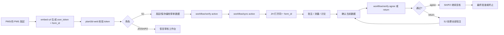
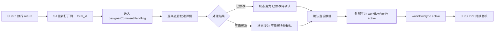
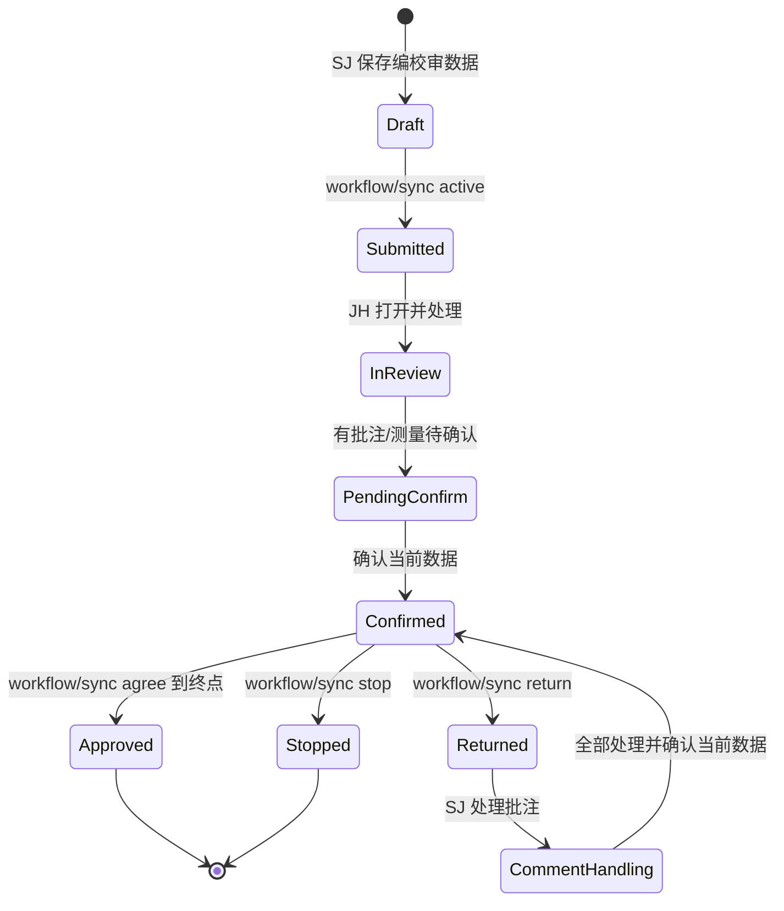

# 三维校审完整流程审查文档

> 日期：2026-04-24  
> 范围：`plant3d-web` 当前工作区，重点覆盖三维校审入口、外部流程模式、批注处理、确认记录、`workflow/verify -> workflow/sync`、仿 PMS 联调与当前未提交改动。  
> 图示：[`./三维校审完整流程图.html`](./三维校审完整流程图.html)  
> 关联文档：[`./三维校审当前流程追踪.md`](./三维校审当前流程追踪.md)、[`./三维校审批注与处理留痕操作教程.md`](./三维校审批注与处理留痕操作教程.md)、[`./三维校审操作教程.md`](./三维校审操作教程.md)

---

## 1. 审查结论

当前三维校审主线已经很明确：

> **外部平台负责流程推进，`plant3d-web` 负责三维数据保存、上下文恢复、批注处理、测量、附件和留痕展示。**

关键判断如下：

| 项目 | 当前结论 |
| --- | --- |
| 默认模式 | `external / passive`，不是前端内部自推进 |
| 第一主键 | `form_id`，用于跨系统定位同一张单据 |
| 内部任务锚点 | `task_id`，用于平台内任务、确认记录、批注恢复 |
| 设计侧默认动作 | 保存编校审单数据，不在前端直接推进完整审批 |
| 审核侧默认动作 | 恢复任务和快照，做批注、测量、确认当前数据 |
| 流程推进 | 外部平台先调用 `workflow/verify`，通过后再调用 `workflow/sync` |
| 驳回后主线 | 设计侧处理全部批注，确认当前数据，再重新发起流程 |
| 内部 `manual / internal` | 保留为本地调试和非 PMS 场景，不是当前 PMS 主链 |

---

## 2. 本次审查覆盖

### 2.1 核心代码路径

| 范围 | 文件 |
| --- | --- |
| 嵌入入口、token 校验、角色落点 | `src/components/DockLayout.vue` |
| 嵌入参数、角色落点规则 | `src/components/review/embedRoleLanding.ts` |
| `form_id` 任务恢复 | `src/components/review/embedContextRestore.ts` |
| `workflow/sync?action=query` 快照恢复 | `src/components/review/embedFormSnapshotRestore.ts` |
| 外部/内部模式判断 | `src/components/review/workflowMode.ts` |
| SJ 发起与保存编校审数据 | `src/components/review/InitiateReviewPanel.vue` |
| JH/SH/PZ 工作台 | `src/components/review/ReviewPanel.vue` |
| 确认当前数据、提交流转预检 | `src/components/review/reviewPanelActions.ts` |
| 批注讨论时间线 | `src/components/review/ReviewCommentsTimeline.vue` |
| 批注、测量和评论前端状态 | `src/composables/useToolStore.ts` |
| 评论真源与事件日志 | `src/review/services/commentThreadStore.ts`、`src/review/services/sharedStores.ts`、`src/review/services/commentEventLog.ts` |
| 仿 PMS 调试页 | `src/debug/pmsReviewSimulator.ts` |
| 仿 PMS payload 合同 | `src/debug/pmsPlatformContractPayloads.ts`、`src/debug/pmsReviewSimulatorWorkflow.ts` |
| 合同序列脚本 | `scripts/pms-contract-sequence.ts`、`scripts/pms-simulator-bootstrap.ts`、`scripts/pms-simulator-runner.ts` |

### 2.2 当前工作区改动

当前工作区里有一组未提交改动，主要在 **评论真源从 DUAL_READ 推向 CUTOVER**：

- 删除：`src/review/services/commentThreadDualRead.ts`
- 默认开启：`REVIEW_C_COMMENT_THREAD_STORE_CUTOVER`
- 读路径：`useToolStore.getAnnotationComments()` 默认从 `commentThreadStore` 读取
- 恢复路径：`workflow_sync / task_records / import_package` 会把快照合入 `commentThreadStore`

这组改动方向合理，但当前仍有会影响三维校审批注讨论的阻塞问题，见第 8 节。

---

## 3. 总流程图

完整泳道图见：[`./三维校审完整流程图.html`](./三维校审完整流程图.html)

简化主线如下：



---

## 4. 当前真实主链路

### 4.1 外部平台打开三维校审

1. 外部平台调用 `POST /api/review/embed-url`。
2. 后端返回带 `user_token`、`form_id`、`workflow_role` 的嵌入地址。
3. `DockLayout.vue` 校验 token。
4. token claims 被视为可信来源；旧式 URL 参数只作兼容输入。
5. 根据 `workflow_role` 分配落点：
   - `sj` -> 设计侧
   - `jd / jh / sh / pz / admin` -> 审核侧

### 4.2 设计侧 SJ

SJ 打开后进入 `InitiateReviewPanel`。

设计侧负责：

- 选择或输入构件参考号
- 填写数据包名称和说明
- 上传附件
- 保存编校审单数据
- 绑定当前 `form_id`

在默认 `external` 模式下：

- 按钮文案是 **保存编校审单数据**。
- 成功语义是 **编校审单保存成功**。
- 不会直接调用内部 `submitTaskToNextNode()`。
- 后续送审由外部平台继续执行。

### 4.3 外部平台送审

外部平台送审动作分两步：

1. `POST /api/review/workflow/verify`
   - 只做预检
   - 不写入最终流转状态
   - 用于判断当前动作是否允许继续

2. `POST /api/review/workflow/sync`
   - 真正执行 `active / agree / return / stop`
   - 写入外部流程状态
   - 通过 `form_id` 继续维持跨系统单据关系

当前仿 PMS 模拟器已经按这个顺序执行：先 `verify`，通过后再 `sync`。

### 4.4 审核侧 JH / SH / PZ

审核侧打开同一 `form_id` 后：

1. `restoreEmbedWorkbenchContext()` 按 `form_id` 匹配内部任务。
2. `restoreEmbedFormSnapshotContext()` 调 `workflow/sync?action=query`。
3. 前端恢复：
   - 构件
   - 批注
   - 测量
   - 批注讨论
   - 确认记录
   - 附件
4. `ReviewPanel` 打开校审工作台。

审核侧默认做这些事：

- 创建批注
- 创建测量
- 围绕批注回复、编辑、删除意见
- 查看历史讨论
- 点击 `确认当前数据` 写入确认记录
- 回到外部平台继续 `agree / return / stop`

---

## 5. 批注、测量与确认记录

### 5.1 批注不是单独动作

当前批注链路由四层组成：

| 层级 | 作用 |
| --- | --- |
| 草稿层 | 当前工作台内新画的批注和测量 |
| 讨论层 | 针对单条批注的回复、编辑、删除和处理意见 |
| 确认记录层 | 点击 `确认当前数据` 后，把当前批注/测量固化为记录 |
| 流程层 | 外部平台根据确认结果继续流转或退回 |

### 5.2 `确认当前数据` 的作用

`确认当前数据` 不是普通保存按钮，它的业务含义是：

> **把当前工作台中的批注、测量和处理状态写成一条可追溯的处理留痕。**

它完成后：

- 当前草稿被清空
- 确认记录被写入后端
- 场景再从确认记录回放
- 后续流程动作才能基于已确认数据继续

### 5.3 测量的定位

测量当前作为处理证据参与确认记录。

它不独立进入：

- 已修改
- 同意
- 驳回

这些状态仍属于批注处理状态。

---

## 6. 驳回后的完整回路

驳回不是“重新填一次表单”。当前正确语义是：

> **驳回后，设计侧进入批注处理路径，把所有待处理批注处理完，再确认当前数据，然后重新发起流程。**

完整步骤：



设计侧必须处理的是 **全部本轮待处理批注**，不是只处理其中一条。

---

## 7. 状态机口径



状态机的关键点：

- `Draft` 到 `Submitted` 由外部平台推进。
- `PendingConfirm` 必须先回到 `Confirmed`，不能跳过。
- `Returned` 后的主动作是处理批注，不是重新编辑普通表单。
- `Approved` 和 `Stopped` 是终态。

---

## 8. 代码审查发现

### 总体判断

**当前流程设计主线清楚，但当前未提交的评论 CUTOVER 改动不建议直接合并。**

原因：评论读取已经默认切到 `commentThreadStore`，但部分写入和后端加载路径仍停留在 inline comments，容易让批注讨论为空、变旧或无法回退。

### P0 - Critical

无。

### P1 - High

#### P1-1：后端加载评论后没有写入当前读路径

- 位置：`src/composables/useToolStore.ts:1497-1528`、`src/composables/useToolStore.ts:1640-1647`
- 现象：`ReviewCommentsTimeline` 和 `AnnotationPanel` 从后端拿到评论后调用 `setAnnotationComments()`，但该函数只写 inline `annotation.comments`。
- 同时，`getAnnotationComments()` 在 CUTOVER 后直接从 `commentThreadStore` 读取。
- 结果：后端明明返回了评论，界面仍可能显示为空或旧数据。

建议修复：

- `setAnnotationComments()` 必须同步写入 `commentThreadStore`。
- 或在 store 线程不存在时回退 inline，但这会削弱 CUTOVER 语义。
- 必须补一个测试：模拟 `reviewCommentGetByAnnotation()` 返回评论后，`ReviewCommentsTimeline` 能显示该评论。

#### P1-2：CUTOVER 回退开关被 `useToolStore` 绕过

- 位置：`src/composables/useToolStore.ts:1675-1677`、`src/review/services/sharedStores.ts:51-52`
- 现象：`sharedStores` 仍声明可通过 `review.flag.REVIEW_C_COMMENT_THREAD_STORE_CUTOVER=0` 或 `review.force_legacy=1` 回退，但 `useToolStore._isCommentStoreActive()` 直接返回 `true`。
- 结果：线上如遇评论 store 问题，回退开关无法让核心读写路径回到 inline comments。

建议修复：

- `useToolStore` 重新使用 `isReviewCommentThreadStoreActive()`。
- 保留 try/catch fallback，保证 localStorage 回退真实可用。
- 增加测试：关闭 CUTOVER 后，`getAnnotationComments()` 读取 inline comments。

### P2 - Medium

#### P2-1：评论写入顺序会产生孤儿 store 数据或误删

- 位置：`src/composables/useToolStore.ts:1454-1458`、`src/composables/useToolStore.ts:1540-1548`、`src/composables/useToolStore.ts:1595-1598`
- 现象：新增、更新、删除评论时，代码先操作 `commentThreadStore`，再检查对应批注是否存在。
- 结果：如果 annotation 不存在、已经被重建，或 inline 投影尚未恢复，store 里可能出现孤儿评论，也可能删除仍应保留的 store 评论。

建议修复：

- 先确认 annotation 存在，再写 store。
- CUTOVER 后编辑评论应优先从 store 取 existing comment，而不是只从 inline 查。
- store 更新成功后再维护 inline 兼容投影。

### P3 - Low

无必须处理项。

---

## 9. 当前可删除项与延后项

### 可删除项

当前 diff 已删除 `commentThreadDualRead.ts` 和对应测试。代码层面没有发现仍然依赖该文件的直接 import。

但是否能安全删除，取决于第 8 节 P1 问题是否修完。

### 延后项

| 项目 | 建议 |
| --- | --- |
| DUAL_READ 历史文档 | 等 CUTOVER 稳定后，再统一清理旧文档中的 DUAL_READ 说法 |
| 评论实时同步统一化 | 当前 `ReviewCommentsTimeline` 内仍有组件级 `comment_added` 回拉，后续可收敛到 `commentSyncService` |
| 真实 PMS 列表可见性 | 需要继续用真实 PMS 接口确认创建后的列表可见、重开和字段写回 |

---

## 10. 操作口径速查

### 10.1 正向通过

| 阶段 | 操作者 | 动作 | 判断标准 |
| --- | --- | --- | --- |
| 发起 | SJ | 保存编校审单数据 | `form_id` 已绑定，构件和附件已保存 |
| 送审 | PMS | `verify active` -> `sync active` | verify 通过，sync 成功 |
| 校核 | JH | 批注、测量、确认当前数据 | 确认记录出现 |
| 审核 | SH | 复核并同意 | 批注处理留痕可见 |
| 批准 | PZ | 最终同意 | 状态进入批准终态 |

### 10.2 驳回重提

| 阶段 | 操作者 | 动作 | 判断标准 |
| --- | --- | --- | --- |
| 驳回 | SH/PZ | `verify return` -> `sync return` | 单据退回设计侧 |
| 处理 | SJ | 对所有批注选择已修改或不需解决 | 无未处理批注 |
| 确认 | SJ | 确认当前数据 | 新确认记录出现 |
| 重提 | PMS | `verify active` -> `sync active` | 重新进入校核/审核 |
| 复核 | JH/SH/PZ | 继续 agree 或 return | 流程可继续走完 |

### 10.3 终止

| 阶段 | 操作者 | 动作 | 判断标准 |
| --- | --- | --- | --- |
| 终止 | 有权限角色 | `verify stop` -> `sync stop` | 当前流程进入终止，不再继续办理 |

---

## 11. 验证命令

### 11.1 本次已执行

```bash
npm run type-check
npm test -- src/review/flags.test.ts src/review/services/sharedStores.test.ts src/components/review/ReviewCommentsTimeline.test.ts src/components/tools/ToolManagerPanel.import.test.ts
```

结果：

- `type-check` 通过
- 4 个测试文件通过
- 17 个测试用例通过

### 11.2 建议补充验证

当前测试没有覆盖第 8 节的关键风险，建议补充：

```bash
npm test -- src/components/review/ReviewCommentsTimeline.test.ts src/composables/useToolStore.test.ts
```

需要新增或补强的用例：

1. 后端加载评论后，CUTOVER 读路径能立即显示评论。
2. `review.flag.REVIEW_C_COMMENT_THREAD_STORE_CUTOVER=0` 后，读取路径回到 inline comments。
3. annotation 不存在时，新增/更新/删除评论不会污染 `commentThreadStore`。

### 11.3 仿 PMS 全流程

```bash
npm run test:pms:simulator
```

覆盖重点：

- SJ 发起
- JH 校核
- SH 驳回
- SJ 处理批注并重提
- JH/SH/PZ 继续走完
- 终止分支
- `workflow/verify` 与 `workflow/sync` 顺序

### 11.4 真实 PMS CDP

```bash
export PMS_E2E_PASSWORD='******'
export PMS_EMBEDDED_SITE_SUBSTRING='你的 plant3d 站点关键字'
npm run test:pms:cdp:extended
```

真实 PMS 验证必须额外关注：

- PMS 列表是否能看到刚创建单据
- 是否能按包名或 BRAN 重新打开
- `ModelFormId / ModelUrl / ModelPackage` 是否完整写回
- `GridPageLoad / FormLoad / GetZyModeInfo` 返回里是否出现本次 `form_id` 或包名

---

## 12. 最短排障路径

| 问题 | 优先检查 |
| --- | --- |
| 页面打不开 | token 是否有效，`form_id` 是否存在 |
| 角色落错面板 | token claims 的 `role / workflowMode` |
| 审核侧找不到任务 | `form_id` 是否已绑定内部 `task_id` |
| 构件没恢复 | `workflow/sync?action=query` 是否返回 `models` |
| 批注没恢复 | `records / annotationComments` 是否返回，`commentThreadStore` 是否合入 |
| 评论为空 | 重点查 `setAnnotationComments()` 是否写入 store |
| 流程不能继续 | 先看 `workflow/verify` 的 `passed / reason / annotationCheck` |
| 驳回后不能重提 | 是否所有批注都处理并确认当前数据 |
| 真实 PMS 找不到记录 | 查 PMS 列表接口与写回字段，不要只看 plant3d 保存成功 |

---

## 13. 后续建议

### 必做

1. 修复第 8 节两个 P1 问题。
2. 增加 CUTOVER 下后端评论加载、回退开关、缺失 annotation 的测试。
3. 用 `npm run test:pms:simulator` 再跑一次仿 PMS 主链。

### 建议做

1. 把评论实时同步从组件级监听收口到统一服务。
2. 把 `form_id / task_id / workflow_role / current_node` 做成调试面板固定四项。
3. 真实 PMS 验证继续聚焦列表可见性和写回字段。

### 暂不建议做

1. 不建议把默认 PMS 主链改回内部按钮自推进。
2. 不建议把驳回解释成重新填表单。
3. 不建议在评论 CUTOVER 未补测试前删除所有兼容回退口径。
