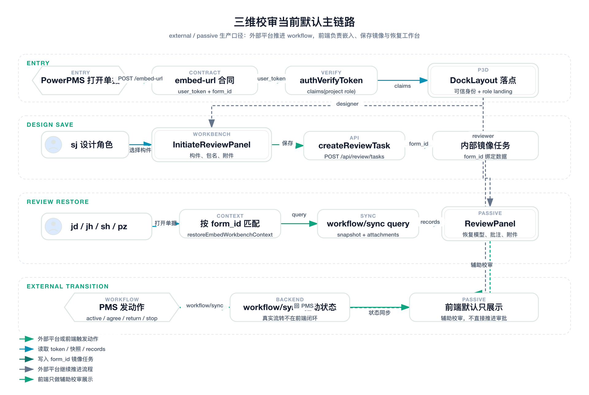
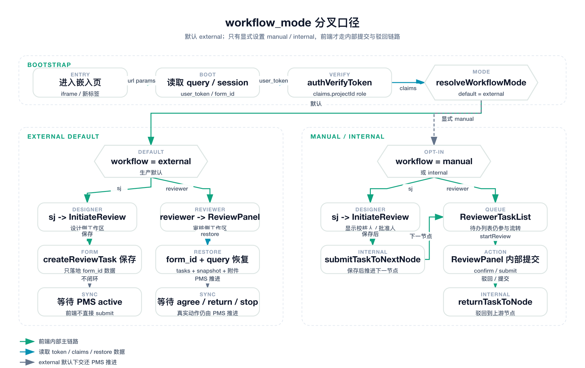

# 三维校审当前流程追踪

> 范围：`plant3d-web` 当前代码路径
>
> 审计时间：2026-04-16
>
> 审计口径：以当前 `src/`、`scripts/`、现有联调文档为准，不以历史设计稿或早期会议纪要为准。

## 结论先行

- 当前 `plant3d-web` 的默认主路径是“外部平台驱动 + token-primary 嵌入 + 被动工作台”。
- `form_id` 是当前三维校审链路里的主键，贯穿嵌入落点、任务匹配、快照恢复、附件恢复和工作流查询。
- `workflow_mode` 当前默认落到 `external`；只有显式切到 `manual` / `internal`，前端才会走内部编校审与内部审核按钮链路。
- 设计侧默认动作是“保存编校审单数据”，不是“在 `plant3d-web` 内部直接推进完整审批流”。
- 审核侧默认动作是“恢复上下文 + 展示状态 + 辅助校审”，真实流转由外部平台通过 `workflow/verify -> workflow/sync` 驱动。

## 本次审计覆盖的关键入口

- 嵌入地址与 token 合同：`src/api/reviewApi.ts`
- 应用启动与项目预选：`src/App.vue`
- 嵌入落点、token 校验、上下文恢复：`src/components/DockLayout.vue`
- 流程模式判定：`src/components/review/workflowMode.ts`
- 设计侧编校审面板：`src/components/review/InitiateReviewPanel.vue`
- 审核侧待办列表：`src/components/review/ReviewerTaskList.vue`
- 审核工作台：`src/components/review/ReviewPanel.vue`
- `form_id` 上下文恢复：`src/components/review/embedContextRestore.ts`
- `workflow/sync?action=query` 快照恢复：`src/components/review/embedFormSnapshotRestore.ts`
- PMS 联调脚本：`scripts/pms-chrome-devtools-flow.ts`、`scripts/pms-plant3d-initiate-flow.ts`

## 当前默认流程图

图源：

- 规格：`docs/verification/fireworks-specs/review-flow-external-passive.json`
- 矢量图：`docs/verification/images/review-flow-external-passive.svg`
- 位图：`docs/verification/images/review-flow-external-passive.png`

## 模式分叉图

图源：

- 规格：`docs/verification/fireworks-specs/review-flow-workflow-mode-branch.json`
- 矢量图：`docs/verification/images/review-flow-workflow-mode-branch.svg`
- 位图：`docs/verification/images/review-flow-workflow-mode-branch.png`

## 当前真实链路拆解

### 1. 外部平台如何打开嵌入页

1. 外部平台先调用 `POST /api/review/embed-url` 获取嵌入地址。
2. 当前前端已经按 token-primary 合同消费 URL。
3. 当 URL 同时携带 `user_token` 与旧式 `user_id / project_id / workflow_role` 时，真正被信任的是 token claims。
4. `DockLayout.vue` 会先校验 token，再把 `claims.projectId / claims.userId / claims.role / claims.workflowMode` 写入嵌入态。

### 2. 为什么当前默认是 external / passive

1. `workflowMode.ts` 的兜底返回值是 `external`。
2. 只有 query、`sessionStorage`、`localStorage` 或 token claims 中显式给出 `manual` / `internal`，才会进入内部流转模式。
3. 这意味着真实 PMS 嵌入场景默认不是“前端自己推进审批”，而是“前端展示和恢复，PMS 负责动作提交”。

### 3. 设计侧当前实际行为

1. 设计角色 `sj` 进入嵌入页后，`DockLayout.vue` 会把主工作区落到 `InitiateReviewPanel`。
2. `InitiateReviewPanel.vue` 在 external 模式下：
   - 保留构件选择、数据包名称、描述、附件上传。
   - 保存时使用当前 `formId` 调 `createReviewTask(...)`。
   - 成功文案是“编校审单保存成功”。
   - 不会在前端内直接 `submitTaskToNextNode`。
3. 真正的“确认提交流转”动作由外部平台侧继续执行：
   - 先 `workflow/verify active`
   - 通过后再 `workflow/sync active`

### 4. 审核侧当前实际行为

1. `jd`、`jh`、`sh`、`pz`、`admin` 当前都落到 reviewer 侧工作区。
2. `DockLayout.vue` 会先通过 `restoreEmbedWorkbenchContext(...)` 用 `form_id` 匹配内部任务。
3. 如果 token 与可信身份完整，会继续调用 `restoreEmbedFormSnapshot(...)`：
   - 发 `reviewWorkflowSyncQuery(...)`
   - 拉回 `models / records / annotationComments / attachments`
   - 回放批注、测量和附件信息
4. `ReviewPanel.vue` 在 passive 模式下只显示：
   - 当前节点
   - 当前状态
   - 刷新按钮
   - 辅助校审 / 数据同步 / 历史记录
   - 若存在未确认的批注 / 测量处理，会显式提示先 `确认当前数据` 再回外部平台继续流转
5. 当前 external reviewer 工作台还新增了三类辅助语义：
   - 当前批注线程命中 `comment_added` 时，会自动刷新该条讨论
   - 测量只作为处理证据参与确认记录，不独立进入已修改 / 同意 / 驳回状态机
   - 确认记录卡片会额外展示处理状态分布摘要
6. 在默认 external 模式下，`ReviewPanel` 不提供内部“确认流转至审核 / 确认驳回流转”按钮链路。

### 5. 内部 manual / internal 流程仍然存在，但不是默认生产路径

1. 设计侧在 manual / internal 模式下会显示校对人员、批准人、优先级、期望完成时间。
2. 保存后会额外执行 `submitTaskToNextNode(...)`。
3. 审核侧 `ReviewerTaskList.vue` 仍保留：
   - `reviewTaskStartReview`
   - 打开 `ReviewPanel`
   - 内部提交流转 / 驳回流转
4. `ReviewPanel.vue` 也保留：
   - `confirmCurrentData`
   - `submitTaskToNextNode`
   - `returnTaskToNode`
5. 这条链路更像“本地调试 / 仿 PMS / 手动演练”路径，而不是当前默认嵌入主链路。

## 角色落点矩阵

| 工作流角色 | 当前落点 | 主面板 | 默认行为 |
| --- | --- | --- | --- |
| `sj` | designer | `initiateReview` | 保存编校审数据，等待外部平台继续流转 |
| `jd` | reviewer | `review` | 恢复任务与快照，展示校审工作台 |
| `jh` | reviewer | `review` | 与 `sh` 同口径，作为 reviewer 侧别名映射 |
| `sh` | reviewer | `review` | 恢复任务与快照，默认不在前端内提交 |
| `pz` | reviewer | `review` | 恢复任务与快照，默认不在前端内提交 |
| `admin` | reviewer | `review` | 走 reviewer 侧落点 |

## 关键跟踪点

### A. 主键与恢复

- 主键不是任务标题，而是 `form_id`。
- `embedContextRestore.ts` 先按 `form_id` 匹配内部任务。
- `embedFormSnapshotRestore.ts` 再按同一 `form_id` 调 `workflow/sync?action=query` 恢复快照。

### B. 任务来源

- 内部任务列表来自 `GET /api/review/tasks`。
- external 模式下，前端内部任务更像“承载三维数据、附件、校审记录与处理留痕的本地镜像”。
- 真正的审批推进状态仍以外部平台 + `workflow/sync` 为主。
- 因此前端 reviewer 更偏“先确认当前数据，再把流转交还外部平台”，而不是在嵌入页内直接闭环审批。

### C. 设计侧和审核侧的边界

- 设计侧负责保存：
  - 构件
  - 包名/描述
  - 附件
  - 与 `form_id` 绑定的内部任务
- 审核侧负责恢复：
  - 当前任务
  - 模型 refno
  - 批注/测量
  - 批注讨论
  - 附件
  - 工作流展示状态
- reviewer 侧在 external 模式下还负责把批注 / 测量先固化成确认记录，再交由外部平台继续流转。
- 默认 external 模式下，审批按钮不在嵌入页内完成闭环。

### D. 不同批注情况的最小闭环

按当前实现，最常见的 external 闭环可直接归成四类：

1. `fixed + pending -> agreed`
   - 设计点 `已修改`
   - 校对 / 审核点 `同意`
   - 最终作为 `已同意` 写进确认记录
2. `wont_fix + pending -> agreed`
   - 设计点 `不需解决`
   - 校对 / 审核认可
   - 最终作为 `已同意不处理` 写进确认记录
3. `fixed/wont_fix -> rejected`
   - 设计已回应
   - 但校对 / 审核不认可
   - 最终作为 `已驳回` 回到设计侧重做
4. `measurement as evidence`
   - 测量跟随批注一起确认
   - 但不独立进入已修改 / 同意 / 驳回状态机

## 对现有文档口径的修正建议

### 1. 需要明确区分两套流程口径

- “真实 PMS 嵌入默认流程”
- “本地 / 仿 PMS / manual internal 流程”

如果不区分，容易把 `DesignerTaskList`、`ReviewerTaskList`、前端内部提交流转按钮误认为生产主路径。

### 2. 需要把 `form_id` 写成第一主线

- 当前很多历史说明强调角色和列表，但从代码看，真正把设计端和审核端串起来的是 `form_id`。
- 后续所有联调、排错、截图核对应优先记录 `form_id`。

### 3. 需要把 `workflow_mode` 的默认值写清楚

- 当前默认就是 `external`。
- 如果测试目标是前端内部提交流转链路，必须显式切到 `manual` 或 `internal`。

## 建议的最短排查路径

### 路径一：验证真实 PMS 默认主链路

1. 从 PMS 点击“新增”打开嵌入页。
2. 确认 URL 带有 `user_token` 与 `form_id`。
3. 设计侧在 `InitiateReviewPanel` 保存编校审数据。
4. 回 PMS 先做 `workflow/verify active`，通过后再做 `workflow/sync active`。
5. 用 `jd/sh/pz` 重新打开同一单据。
6. 确认 reviewer 工作区能按 `form_id` 恢复任务、批注、测量、附件。

### 路径二：验证前端内部 manual 链路

1. 显式设置 `workflow_mode=manual` 或 `internal`。
2. 设计侧确认出现校对人员/批准人等字段。
3. 保存后确认内部任务已流转到下一节点。
4. 在 `ReviewerTaskList` 中打开任务。
5. 在 `ReviewPanel` 内执行确认、提交流转、驳回流转。

## 当前审计结论

- 生产默认路径已经是“外部平台驱动流程，前端负责嵌入、恢复和辅助校审”。
- 内部 manual 流程仍可用，但它是保留能力，不应再被当作当前默认主路径描述。
- 如果后续继续写三维校审文档，建议所有流程文档先标注“external 默认”还是“manual/internal 调试”。
