# 三维校审批注与处理留痕操作教程

> 适用范围：当前 `plant3d-web` 中围绕批注、测量、意见讨论、确认记录与处理留痕的真实操作链路。  
> 适用入口：PowerPMS 嵌入页、`plant3d-web` reviewer 工作台。  
> 当前口径：以 `src/components/review/*` 当前实现为准；若与旧教程或历史设计稿不一致，以本文为准。  
> 关联文档：`./三维校审操作教程.md`、`./三维校审当前流程追踪.md`、`../../开发文档/三维校审/批注体系重构开发计划-2026-04-18.md`

---

## 一、先看结论

当前三维校审里，批注操作并不是一个孤立动作，而是和下面四条线绑定在一起：

1. **批注 / 测量草稿线**  
   在 reviewer 工作台里直接创建文字批注、云线批注、矩形批注、包围盒批注与测量。

2. **批注讨论线**  
   选中某条批注后，可围绕该批注继续补充意见、回复、编辑、删除，并查看处理状态。

3. **确认记录线**  
   点击 `确认当前数据` 后，当前批注与测量会写入确认记录；草稿区随即清空，再由确认记录回放到场景中。

4. **流程流转线**  
   对当前 **仿 PMS** 与 **真实 PMS** 主链，应按默认 `external` 模式理解：前端主要负责批注、留痕、恢复与展示，真正流转由外部平台继续执行；`manual / internal` 仅作为本地调试补充路径。

因此，建议把当前链路理解成：

> **先创建批注 / 测量 -> 再围绕批注讨论 -> 再确认当前数据形成处理留痕 -> 最后再做流程流转**

如果流程中途被驳回，当前真实口径还要多记住一条：

> **驳回后先处理完本轮全部批注 -> 再确认当前数据 -> 再重新发起流程 -> 后续角色继续复核并走完**

这里的“处理完全部批注”，不是只处理其中一条，而是要把本轮要求整改的批注都收口为：

- `已修改待确认`
  或
- `不需解决待确认`

---

## 二、当前最重要的模式区别

### 1. 仿 PMS 与真实 PMS：都按 `external` 外部驱动理解

这是当前最重要的结论，也是本文默认前提。

- PowerPMS 嵌入页是外部驱动模式。
- 仿 PMS 调试页在当前联调主线上，也按外部驱动模式使用。
- plant3d 前端负责：批注、测量、讨论、确认当前数据、恢复与展示。
- 真正的流程推进由外部平台通过 `workflow/sync active / agree / return` 驱动。

适合理解为：

> **前端负责批注与处理留痕，平台负责真正流转。**

### 2. `manual / internal` 只作为本地内部调试路径

仓内仍保留 `manual / internal` 相关能力与按钮文案，用于：

- 本地工作台调试
- 非 PMS 嵌入场景下的内部按钮演练
- reviewer 流程按钮的独立 smoke

但在 **仿 PMS** 与 **真实 PMS** 的当前主链上，不应把它当作默认验收入口。

所以如果你的目标是讲“当前 PMS / 仿 PMS 结合批注怎么操作”，本文后续一律以 **external 外部驱动** 为主线。

---

## 三、角色与批注相关职责

| 角色 | 常用账号 | 当前与批注直接相关的动作 |
| --- | --- | --- |
| 设计人员 | `SJ` | 发起编校审、上传附件、接收退回意见、对批注标记为 `已修改` / `不需解决` |
| 校对人员 | `JH` | 打开工作台、创建批注与测量、补充讨论、确认当前数据；如需继续推进，由外部平台执行 `agree` |
| 审核人员 | `SH` | 复核批注与测量、查看讨论与处理留痕、判断是否通过；如需继续推进或退回，由外部平台执行 `agree / return` |
| 批准人员 | `PZ` | 复核全量处理留痕与附件；最终是否通过或退回，由外部平台执行 `agree / return` |

### 1. 四角色动作速查图

如果你要在培训、联调或排障时，快速讲清“每个角色此刻最该做什么”，可直接用下面四张小图。

#### SJ：设计人员

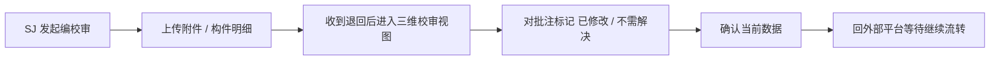

#### JH：校对人员

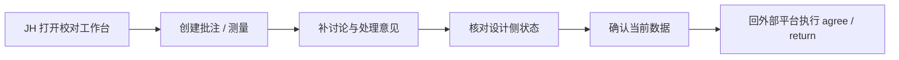

#### SH：审核人员

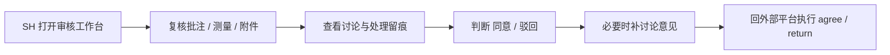

#### PZ：批准人员

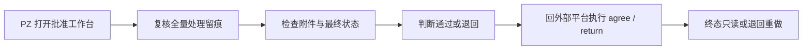

#### 一句话记忆

- `SJ`：**回应批注并确认当前数据**
- `JH`：**建批注、补证据、先把留痕做实**
- `SH`：**复核留痕是否成立，再决定是否继续推进**
- `PZ`：**看最终留痕是否闭环，再决定是否通过**

---

## 四、进入批注工作区前的准备

### 1. 示例构件

本文统一使用 BRAN 参考号：

- `24381_145018`

### 2. 建议先准备好的内容

- 已创建好的编校审单
- 至少一条构件明细
- 至少一份附件（便于后续核对附件是否跟随批注处理一起可见）

### 3. 进入 reviewer 工作台后，先确认三块区域

当前 `ReviewPanel` 内，和批注直接相关的区域主要是：

1. **`批注与测量` 区**
   - 可直接发起批注与测量
   - 可看到待确认批注数、测量数
   - 可点击 `确认当前数据`
   - external 模式下若仍有未确认处理，区块会显式提醒：先确认当前数据，再回外部平台继续流转
   - 测量当前仅作为处理证据参与确认记录，不独立进入 `已修改 / 同意 / 驳回` 状态机

2. **`批注列表` 区**
   - 汇总当前任务下的所有批注
   - 每条批注会显示类型、状态、意见数、更新时间
   - 可展开进入该批注的讨论时间线
   - 当前线程命中 `comment_added` 实时事件时，会自动刷新该条批注的讨论内容

3. **`审核记录 / 历史流转 / 附件材料` 区**
   - 用来查看确认记录是否已形成
   - 用来核对附件是否可继续查看
   - 用来确认当前任务是否已经发生流转
   - 确认记录卡片当前还会汇总处理状态分布，如 `已修改待确认 / 已同意 / 已驳回`

---

## 五、校对人员（JH）如何创建批注与测量

### 步骤 1：进入校对工作台

可复用现有截图：

进入后先确认：

- 左侧模型中能看到 `24381_145018`
- 当前任务标题与当前节点正确
- 右侧存在 `批注与测量` 区

### 步骤 2：创建批注

当前 reviewer 工作台的批注按钮来自 `reviewerDirectLaunchActions`，实际可直接发起：

- `文字批注`
- `云线批注`
- `矩形批注`
- 以及其他已接线批注类型（如包围盒批注）

对应操作建议：

1. 在 `批注与测量` 区点击一种批注类型。
2. 回到三维区，在问题位置落点或圈选。
3. 填写批注标题与说明。
4. 完成后检查下方计数是否增加：
   - `批注 <数量>`

### 步骤 3：创建测量

同一区域点击：

- `测量`

然后在三维区选择两个点或对应测量对象。

完成后检查：

- `测量 <数量>` 不再是 0
- 待确认数据区已出现本次测量

### 步骤 3A：不同批注类型建议怎么用

当前 reviewer 工作台里，最常见的“问题表达”大致分成下面几类：

| 类型 | 适合什么情况 | 建议怎么写 |
| --- | --- | --- |
| `文字批注` | 明确点位、单个构件、单个接口问题 | 标题写问题结论，正文写原因、影响与建议 |
| `云线批注` | 一片区域内有多处问题、需要圈出范围 | 标题写该区域的总问题，正文写范围内要处理的点 |
| `矩形批注` | 规则区域、二维框选更容易表达的位置问题 | 标题写区域问题，正文补充与周边专业的关系 |
| `包围盒批注` | 三维空间范围、设备包络、净空或碰撞区间 | 标题写空间问题，正文说明影响体量与处理边界 |
| `测量` | 需要给出尺寸、距离、净空、偏移量证据 | 不建议单独当作处理结论，最好与某条批注一起出现 |

可直接这样理解：

- **批注** 负责描述“问题是什么”
- **测量** 负责补充“证据是多少”

所以在实际操作里，最稳的组合通常是：

> 先建一条批注说明问题，再补一条测量说明尺寸或距离。

### 步骤 4：先不要急着流转

当前实现里，**批注 / 测量创建完成 != 已形成留痕**。  
它们此时仍属于“待确认草稿态”。

所以推荐顺序一定是：

> 先创建批注 / 测量 -> 再讨论 -> 再确认当前数据

---

## 六、如何围绕某条批注继续讨论

### 步骤 1：打开 `批注列表`

在 reviewer 工作台下半区，当前会看到：

- `批注列表`

列表中每条批注会显示：

- 标题
- 类型（文字 / 云线 / 矩形 / 包围盒）
- 当前状态（如 `待处理`、`已修改待确认`、`已同意`、`已驳回`）
- 意见数
- 最近更新时间

### 步骤 2：展开一条批注

点击某条批注卡片后，会展开：

- `批注 / 标题` 讨论时间线

当前时间线支持：

- 查看已有意见
- 回复某条意见
- 编辑自己发出的意见
- 删除自己发出的意见
- 查看处理状态与处理历史

### 步骤 3：提交讨论意见

当前时间线里的基础讨论动作为：

- 输入意见
- 点击 `提交意见`

如果是回复某条意见，界面会先出现：

- `回复 xxx`

然后再提交。

### 步骤 3A：当前线程的评论刷新规则

当前最小实时闭环已经接上：

- 如果有人针对**当前批注**新增评论，当前时间线会自动刷新
- 如果新增评论属于**其他批注**，当前线程不会误刷新

因此你在 reviewer 工作台里展开一条批注后，可以把它当作“只跟当前批注绑定”的讨论窗口来理解。

### 步骤 4：理解当前批注状态

当前状态文案以 `src/types/auth.ts` 为准，常见状态包括：

| 状态 | 含义 |
| --- | --- |
| `待处理` | 当前批注刚创建，等待设计处理 |
| `已修改待确认` | 设计侧已处理，等待校对/审核确认 |
| `不需解决待确认` | 设计侧认为无需处理，等待校对/审核确认 |
| `已同意` | 校对/审核已同意设计处理结果 |
| `已驳回` | 校对/审核已驳回该批注处理结果 |
| `已同意不处理` | 校对/审核已同意该批注无需处理 |

### 步骤 4A：把状态理解成“两轴六种常见情况”

当前批注处理不是单轴状态，而是两轴组合：

- `resolutionStatus`
  - `open`
  - `fixed`
  - `wont_fix`
- `decisionStatus`
  - `pending`
  - `agreed`
  - `rejected`

最常见的 6 种用户可感知状态，可以直接按下面这张表理解：

| 代码状态 | 页面文案 | 谁刚做了动作 | 当前意味着什么 | 下一步通常是谁处理 |
| --- | --- | --- | --- | --- |
| `open + pending` | `待处理` | 批注刚创建，或被退回后重新打开 | 设计侧还没回应 | 设计侧先处理 |
| `fixed + pending` | `已修改待确认` | 设计侧点了 `已修改` | 设计说已经改完，等校对/审核确认 | 校对 / 审核 / 批准侧确认 |
| `wont_fix + pending` | `不需解决待确认` | 设计侧点了 `不需解决` | 设计认为无需处理，等校对/审核确认 | 校对 / 审核 / 批准侧确认 |
| `fixed + agreed` | `已同意` | 校对/审核点了 `同意` | 设计处理结果被认可 | 可继续流转或留档 |
| `wont_fix + agreed` | `已同意不处理` | 校对/审核点了 `同意` | “不处理”这一决定被认可 | 可继续流转或留档 |
| `* + rejected` | `已驳回` | 校对/审核点了 `驳回` | 当前处理结果不被认可，需要回到设计侧重做 | 设计侧重新处理 |

这张表里最值得记住的是：

1. **设计侧只负责改 `resolutionStatus`**
   - `open -> fixed`
   - `open -> wont_fix`
2. **校对 / 审核 / 批准侧只负责改 `decisionStatus`**
   - `pending -> agreed`
   - `pending -> rejected`
3. 一条批注是否能放行，不是只看“设计有没有动”，而是要看：
   - 设计是否已回应
   - 校审是否已认可

---

## 七、设计侧与审核侧如何处理批注状态

### 1. 设计侧可执行的动作

当当前登录角色是设计人员时，批注时间线里的处理按钮是：

- `已修改`
- `不需解决`

并可填写：

- `处理备注（可选，例如修改说明）`

执行后，时间线会留下处理事件，状态会变成：

- `已修改待确认`
  或
- `不需解决待确认`

#### 设计侧什么时候选 `已修改`

适合这几类情况：

- 确实已经改了模型、位置、参数、构件关系
- 问题已经被消除，但需要校对/审核再看一遍
- 需要配合测量、截图或文字说明证明本次修改

建议备注里写清：

- 改了什么
- 影响了哪些构件 / 区域
- 是否需要后续角色重点复核

#### 设计侧什么时候选 `不需解决`

适合这几类情况：

- 该批注基于误解，当前模型其实符合要求
- 这是已知例外，有明确业务依据
- 当前阶段不处理是合理决定，但需要校对/审核认可

建议备注里写清：

- 为什么不处理
- 依据是什么
- 是否有后续条件或边界

### 2. 校对 / 审核 / 批准侧可执行的动作

当前登录角色为校对 / 审核 / 批准时，在设计侧已经先做出处理动作后，可执行：

- `同意`
- `驳回`

并可填写：

- `决定备注（可选，例如同意理由或驳回意见）`

成功后会出现对应反馈：

- `已同意该批注处理结果`
- `已驳回该批注处理结果`

#### 校对 / 审核什么时候点 `同意`

适合这几类情况：

- 设计已经改到位，问题确实消除
- 虽然没有修改，但“不需解决”的理由成立
- 该批注已经有足够证据支撑关闭

#### 校对 / 审核什么时候点 `驳回`

适合这几类情况：

- 设计说“已修改”，但问题仍然存在
- 设计说“不需解决”，但理由不足或结论不成立
- 批注讨论里还缺关键证据，当前不能放行

### 2A. 不同处理情况的推荐节奏

#### 情况 A：明确问题，设计已修改

推荐顺序：

1. reviewer 创建批注
2. reviewer 补测量或补讨论
3. 设计侧点 `已修改`
4. 校对 / 审核侧核对后点 `同意`
5. 再统一 `确认当前数据`

#### 情况 B：明确问题，但设计认为无需处理

推荐顺序：

1. reviewer 创建批注
2. 设计侧点 `不需解决`
3. 设计侧在备注里写清依据
4. 校对 / 审核侧判断理由是否成立
5. 成立则 `同意`，不成立则 `驳回`

#### 情况 C：设计已回应，但校审不认可

推荐顺序：

1. 设计侧先给出 `已修改` 或 `不需解决`
2. 校对 / 审核侧检查发现仍有问题
3. 在讨论里补充驳回理由
4. 点 `驳回`
5. 让批注重新回到设计侧处理

### 3. 当前最稳的处理节奏

建议按下面顺序使用：

1. reviewer 创建批注
2. 围绕该批注补充讨论
3. 设计侧标记 `已修改` 或 `不需解决`
4. 校对 / 审核再做 `同意` 或 `驳回`
5. 关键批注处理完成后，再统一确认当前数据并形成处理留痕

### 3A. 四个最常见的实战闭环例子

#### 例子 1：`fixed + pending -> agreed`

适用场景：

- reviewer 已指出明确问题
- 设计已经改模型
- 校对 / 审核复核后认可修改结果

推荐动作：

1. JH 建一条文字批注，说明问题
2. JH 补一条测量，证明偏移量或净空值
3. SJ 在该批注下点 `已修改`，备注写清改动位置
4. SH / PZ 复核后点 `同意`
5. 最后统一 `确认当前数据`

最终你会看到：

- 批注状态变成 `已同意`
- 确认记录里会出现 `已同意 1` 或更多摘要

#### 例子 2：`wont_fix + pending -> agreed`

适用场景：

- 设计认为该问题本轮无需处理
- 且有明确依据
- 校对 / 审核认可这一决定

推荐动作：

1. reviewer 创建批注，说明问题点
2. SJ 点 `不需解决`，在备注里写依据
3. SH / PZ 检查依据是否成立
4. 若成立，则点 `同意`
5. 再统一 `确认当前数据`

最终你会看到：

- 批注状态变成 `已同意不处理`
- 确认记录里会出现 `已同意不处理` 摘要

#### 例子 3：`fixed -> rejected`

适用场景：

- 设计说已经改完
- 但校对 / 审核复核后，认为问题仍在

推荐动作：

1. SJ 先点 `已修改`
2. JH / SH 在讨论里补充“不认可”的具体原因
3. 校对 / 审核点 `驳回`
4. 批注重新回到设计侧处理
5. 待设计重新处理后，再进入下一轮确认

最终你会看到：

- 批注状态变成 `已驳回`
- 当前批注不能直接当作已完成放行

#### 例子 4：测量只作证据，不单独流转

适用场景：

- 你需要证明距离、净空、偏移量
- 但不希望把测量本身当成“单独结论”

推荐动作：

1. 先建批注，写清问题与影响
2. 再补测量，给出尺寸证据
3. 后续所有 `已修改 / 不需解决 / 同意 / 驳回` 都围绕**批注**做
4. 测量随确认记录一起保存与回放

应这样理解：

- 批注负责状态推进
- 测量负责证据补强

### 3B. 状态变化总览图

下图可直接当作“当前不同批注情况怎么流转”的最短速记：

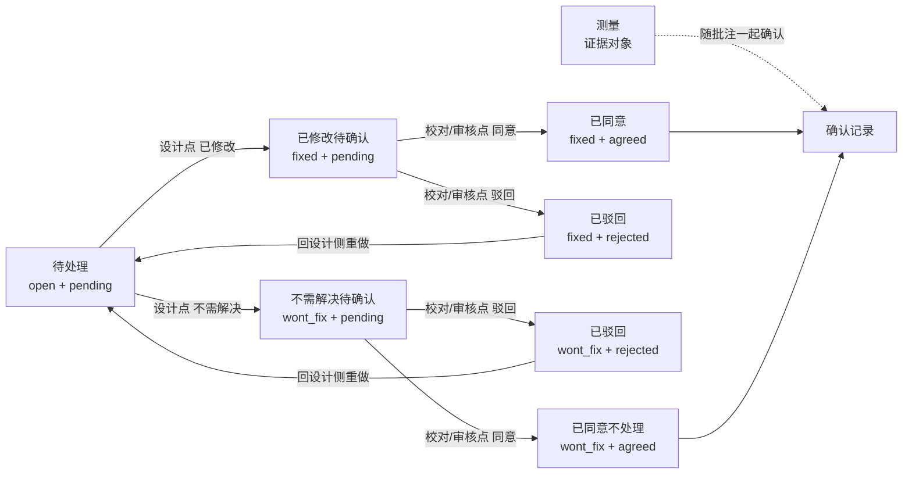

### 3C. 实战速查表

| 看到的状态 | 说明 | 现在最该做什么 |
| --- | --- | --- |
| `待处理` | 批注刚建好，设计还没回应 | 先让设计侧给出 `已修改` 或 `不需解决` |
| `已修改待确认` | 设计说已经改完 | 校对 / 审核复核后决定 `同意` 还是 `驳回` |
| `不需解决待确认` | 设计说本轮无需处理 | 校对 / 审核先看理由是否成立，再决定 `同意` 或 `驳回` |
| `已同意` | 修改结果已被认可 | 通常可继续流转，或与其他批注一起确认留痕 |
| `已同意不处理` | “不处理”已被认可 | 通常可继续流转，或与其他批注一起确认留痕 |
| `已驳回` | 当前处理结果不被认可 | 回设计侧重做，再进入下一轮确认 |
| `测量已创建但无状态` | 测量只是证据，不是独立处理结论 | 检查它是否已跟对应批注一起被 `确认当前数据` |

---

## 八、如何把批注和测量写成处理留痕

### 步骤 1：回到 `批注与测量` 区

当你已经完成：

- 批注创建
- 测量创建
- 必要的讨论补充

此时应回到上方的：

- `批注与测量`

区域。

### 步骤 2：填写备注（可选）

输入框文案当前是：

- `备注（可选）`

适合填写：

- 本轮批注处理结论
- 本轮测量说明
- 需要后续角色关注的点

### 步骤 3：点击 `确认当前数据`

按钮当前文案是：

- `确认当前数据`

点击后，当前实现会执行这条链：

1. 组装当前草稿中的批注 / 云线 / 矩形 / 包围盒 / 测量
2. 调用确认记录保存
3. 保存成功后执行 `toolStore.clearAll()`
4. 再把已确认记录重新回放到场景中

所以正常现象应是：

- 草稿态被清空
- 场景仍能看到已保存内容
- 下方 `审核记录` 出现新的确认记录

如果当前没有新的待确认内容，界面会显示：

- `当前批注/测量已保存，新增或修改后可再次确认`

这正是当前“处理留痕已经形成”的信号。

### 步骤 3A：external 模式下，哪些动作会提醒你先确认

当前实现里，只要仍有未确认的批注 / 测量处理，external reviewer 工作台就会显式提醒：

- 先点击 `确认当前数据`
- 再回外部平台继续流转

当前会触发这类提醒的高风险动作包括：

- 点击 `刷新`
- 切换到其他任务
- 关闭当前任务
- 直接离开页面

所以最稳的习惯仍是：

> 先把批注处理结果和测量证据确认成留痕，再做任何 external 流转或离开动作。

### 步骤 3B：确认记录现在会显示什么

当前 `审核记录` 卡片除了批注数量、测量数量外，还会额外汇总本次确认里的处理状态，例如：

- `待处理`
- `已修改待确认`
- `不需解决待确认`
- `已同意`
- `已同意不处理`
- `已驳回`

这意味着 reviewer / 审核 / 批准在回看某次确认记录时，不必只看“本批有几条批注”，还可以直接看出“这一批到底处理成了什么结果”。

---

## 九、批注操作与流程流转如何衔接

### 1. 当前 PMS / 仿 PMS 主链：始终按 `external` 理解

当前 reviewer 工作台会明确显示：

- `外部流程模式`

并提示：

- 当前流程由外部平台驱动，此处仅展示状态，不提供提交、驳回等内部操作。

在这种模式下，推荐把整条链理解为：

1. 在前端完成批注、测量、评论、确认记录
2. 返回外部平台继续执行 `workflow/sync active / agree / return`
3. 再通过 reopen / 刷新回到 plant3d 查看最新状态

### 2. 当前最稳的操作顺序

如果目标是“结合批注把一条单据走完”，当前最稳顺序是：

1. reviewer 创建批注
2. 围绕该批注补充讨论
3. 设计侧标记 `已修改` 或 `不需解决`
4. reviewer / 审核 / 批准侧继续核对处理结果
5. 在 plant3d 内点击 `确认当前数据`，形成处理留痕
6. 回外部平台执行：
   - 正向流转：`active / agree`
   - 逆向流转：`return`

### 2A. external 主链小图

如果只想一眼记住“当前 external 主链到底怎么走”，可直接看下面这张图：

此图可直接概括成一句话：

> 先在前端把批注处理与留痕做实，再把真正流转交回外部平台。

### 2B. 回外部平台前的检查清单

在你准备回 PMS / 仿 PMS 点 `active / agree / return` 之前，最好先逐项检查：

- 当前批注是否已经补全讨论
- 设计侧是否已给出 `已修改` 或 `不需解决`
- 校对 / 审核是否已经做出 `同意` 或 `驳回` 判断
- 需要的测量是否已经补齐
- 是否已经点击 `确认当前数据`
- `审核记录` 中是否已出现新的确认记录

如果上面最后两项还没成立，就不宜直接回外部平台继续流转。

### 2C. 驳回后重新发起的最稳顺序

如果当前不是正向通过，而是被 `return` 回到设计侧，推荐严格按下面顺序做：

1. `SJ` 重新打开被退回的单据
2. 逐条查看退回原因和批注列表
3. 把本轮要求处理的**全部批注**逐条处理成：
   - `已修改待确认`
     或
   - `不需解决待确认`
4. 在 plant3d 内再次点击 `确认当前数据`
5. 确认 `审核记录` 已出现新的确认记录，且批注列表里不再遗留 `待处理` / `已驳回`
6. 回外部平台再次执行 `active`
7. `JH` reopen 后，逐条复核批注处理结果
8. `JH` 对已处理结果做 `同意` 或 `驳回`，再点击 `确认当前数据`
9. `JH` 回外部平台执行 `agree`
10. `SH`、`PZ` 再继续按正常主线走完

实际联调里，这里有两个很关键的阻断规则：

- 如果 `JH` 还看到 `待处理` 批注，就直接去做 `agree`，`workflow/verify` 会拦截，并给出“应先驳回”的结果
- 如果 `SJ` 收到退回后，还有批注停留在 `待处理` 或 `已驳回`，就直接再次 `active`，`workflow/verify` 也会拦截

所以驳回分支不要理解成“退回后再点一次发起”，而要理解成：

> **退回后先收口全部批注，再重新发起。**

### 3. `manual / internal` 在本文中的位置

如果后续单独做本地工作台调试，仍可继续验证：

- `确认流转至校对`
- `确认流转至审核`
- `确认流转至批准`
- `确认最终批准`
- `确认驳回流转`

但这条链不属于当前 **仿 PMS / 真实 PMS** 的主验收路径，所以本文不把它作为默认教程主线。

---

## 十、审核人员（SH）与批准人员（PZ）如何复核批注

### 1. 审核人员（SH）

进入同一任务后，重点看三块：

1. `批注列表`
2. 已展开批注的讨论时间线
3. `审核记录 / 历史流转 / 附件材料`

审核侧重点不再是重新画批注，而是：

- 查看 JH 留下的批注和测量
- 查看设计是否已经标记 `已修改` / `不需解决`
- 判断当前处理结果是否可继续推进
- 必要时继续补充讨论意见
- 在 PMS / 仿 PMS 主链中，如需继续推进或退回，回外部平台执行 `agree / return`

### 2. 批准人员（PZ）

批准侧建议先做总复核：

- 批注是否完整
- 测量是否完整
- 确认记录是否完整
- 附件是否可见
- 历史流转是否已经经过 `SJ -> JH -> SH`

然后根据结果执行：

- 在外部平台执行 `agree`
  或
- 在外部平台执行 `return`

---

## 十一、最短可复讲路径

如果你要对业务同学或联调同学讲“当前结合批注的操作主线”，最短可以直接讲这一段：

### SJ

`创建编校审单 -> 上传附件 -> 在外部平台执行 active`

### JH

`打开校对工作台 -> 添加批注 -> 添加测量 -> 展开批注讨论 -> 确认当前数据 -> 在外部平台执行 agree`

### SH

`打开审核工作台 -> 查看批注 / 测量 / 附件 / 留痕 -> 复核处理结果 -> 在外部平台执行 agree 或 return`

### PZ

`打开批准工作台 -> 复核全部处理留痕 -> 在外部平台执行 agree 或 return`

### 驳回分支

`JH / SH / PZ 驳回 -> SJ 回到任务 -> 处理完全部批注 -> 确认当前数据 -> 外部平台再次 active -> JH 复核同意 -> SH / PZ 继续走完`

---

## 十二、常见问题

### 1. 为什么我已经画了批注，但下一个人看不到？

先检查是否已经点击：

- `确认当前数据`

如果没有确认，当前批注还只是草稿态。

### 2. 为什么刷新、切任务或离开页面时，会提示我先确认当前数据？

因为当前 external 模式下，批注处理和测量证据必须先固化成确认记录，后续 external 流转才有稳定留痕。

如果你已经：

- 点了 `已修改 / 不需解决 / 同意 / 驳回`
- 但还没点 `确认当前数据`

那么刷新、切任务、关闭、离页都不会自动替你保存这批处理结果。

### 3. 为什么确认后场景里的批注先消失又重新出现？

这是当前实现的正常行为：

- 先清空草稿
- 再从确认记录回放

目的是保证场景与已保存留痕一致。

### 4. 为什么 reviewer 工作台里没有“确认流转至审核”按钮？

大概率当前单据处于：

- `external` 默认模式

这种模式下，前端负责批注和留痕，真正流转由外部平台继续执行。

### 5. 为什么我能看到 `驳回到设计`，弹窗却写 `确认驳回流转`？

这是当前实现里仍存在的一处界面文案过渡态。  
实际使用上可以理解为：

- 列表按钮：进入退回动作
- 弹窗：正式确认驳回流转

### 6. 为什么被驳回后不能直接再次发起？

因为当前真实校验不是只看“单据回到 `SJ` 了没有”，还会看本轮批注有没有真正处理完。

如果仍有批注停留在：

- `待处理`
  或
- `已驳回`

那么直接再次 `active` 会被拦住。  
更稳的做法是先把全部批注处理成：

- `已修改待确认`
  或
- `不需解决待确认`

然后再点击 `确认当前数据`，最后再回外部平台重新发起。

### 7. 为什么 `JH` 不能带着未处理批注直接点 `agree`？

因为当前真实规则不是“只要到 `JH` 就能放行”，而是“`JH` 只能放行已经被设计侧处理过的批注”。

如果 `JH` 看到的批注仍然是：

- `待处理`

那么直接 `agree` 会被拦截。  
正确动作是先 `return` 回设计侧，让设计把本轮批注全部处理完，再重新发起。

---

## 十三、2026-04-20 仿 PMS 实跑记录（结合批注）

这部分不是推演，而是本轮在本地仿 PMS 页里**真实走过一遍**后的结果记录。

### 1. 本次实跑入口

- 仿 PMS 页：`http://127.0.0.1:3101/pms-review-simulator.html?output_project=AvevaMarineSample`
- 后端健康检查：`http://127.0.0.1:3100/api/health`
- 固定测试 BRAN：`24381_145018`

### 2. 本次实际走通的链路

本次先走通的是当前最稳、也与真实 PMS 一致的：

> **external / passive 仿 PMS 链路**

也就是说：**仿 PMS 与真实 PMS 当前都按外部驱动模式理解**，不是内部按钮链。

实际走通顺序如下：

1. `SJ` 发起编校审
2. `SJ` 执行 `active`
3. `JH` reopen 同一单据
4. `JH` 真实添加 1 条批注，并执行 `confirmData(...)`
5. `JH` 执行 `agree`
6. `SH` 执行 `agree`
7. `PZ` 执行 `agree`
8. `PZ` 再次 reopen，单据进入 `readonly`

### 3. 本次实跑截图

#### `SJ` 创建编校审

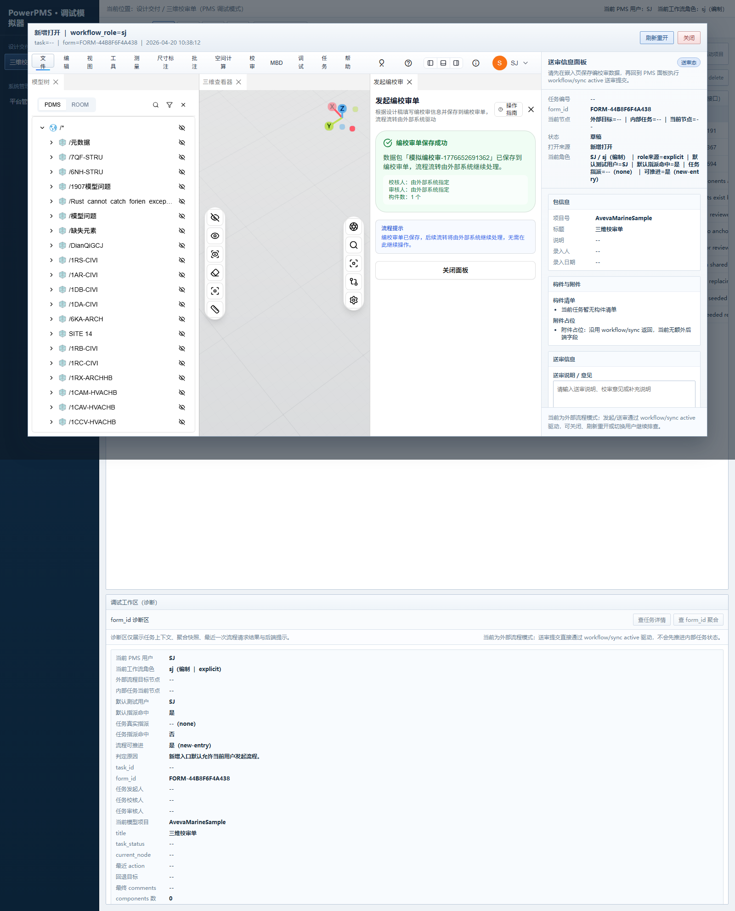

#### `SJ` 确认提交流转

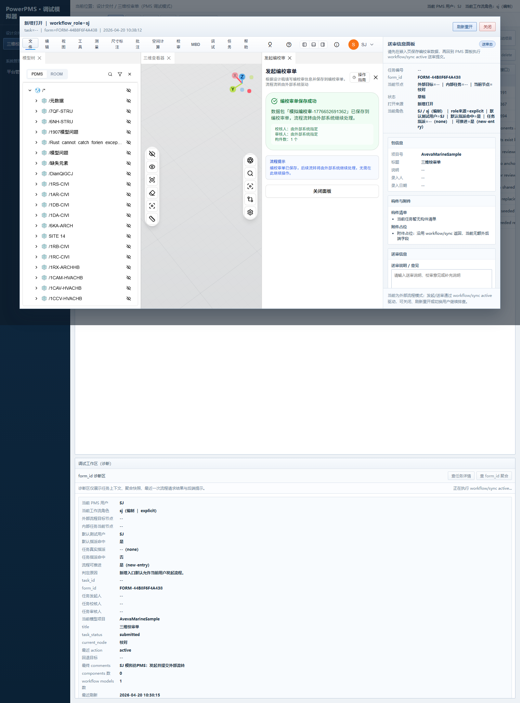

#### `JH` 侧完成批注确认并同意

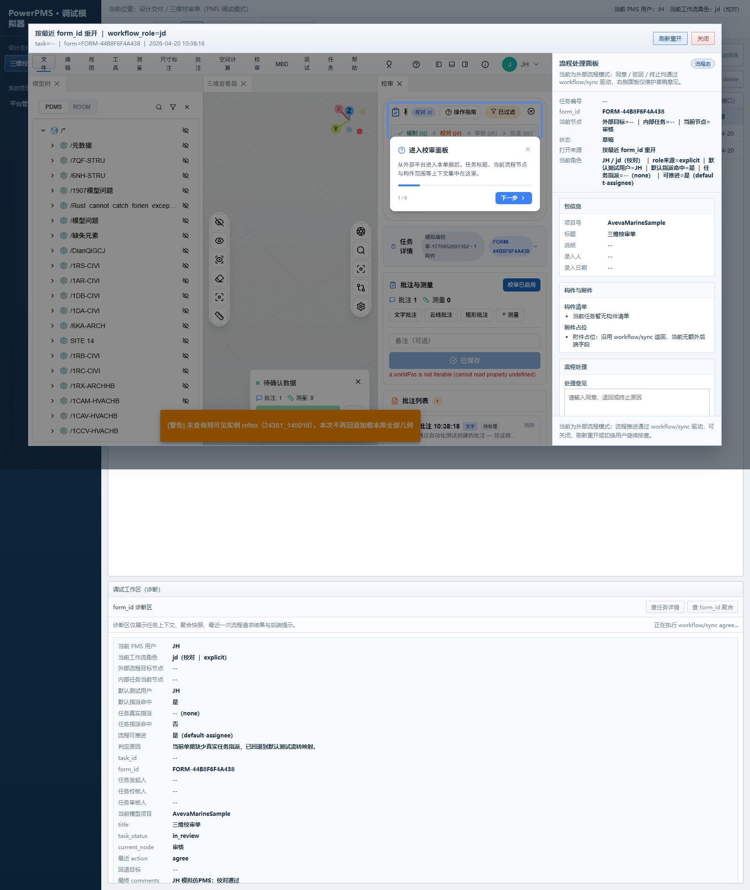

#### `SH` 审核同意

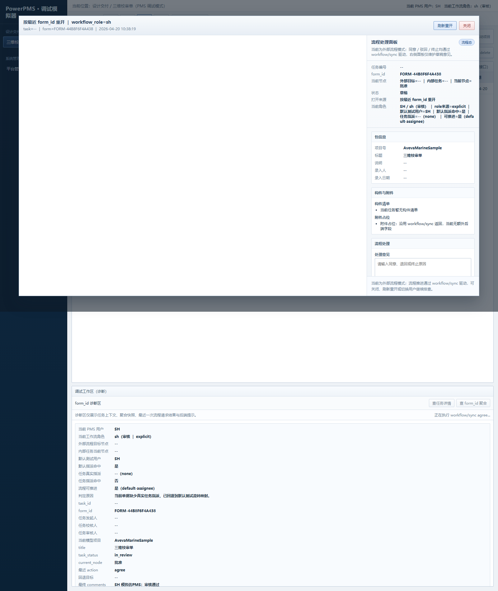

#### `PZ` 批准通过

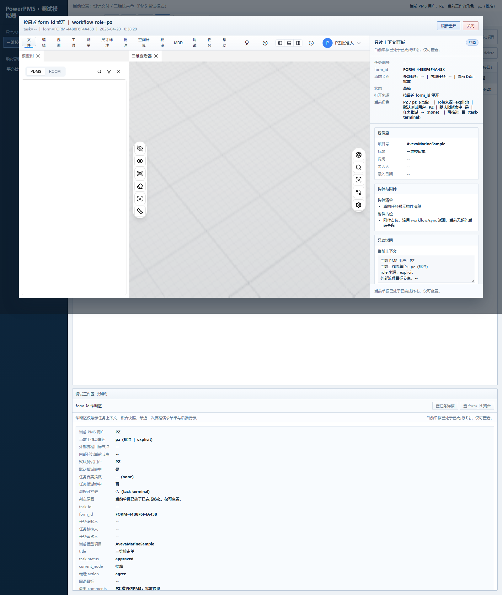

#### 终态只读 reopen

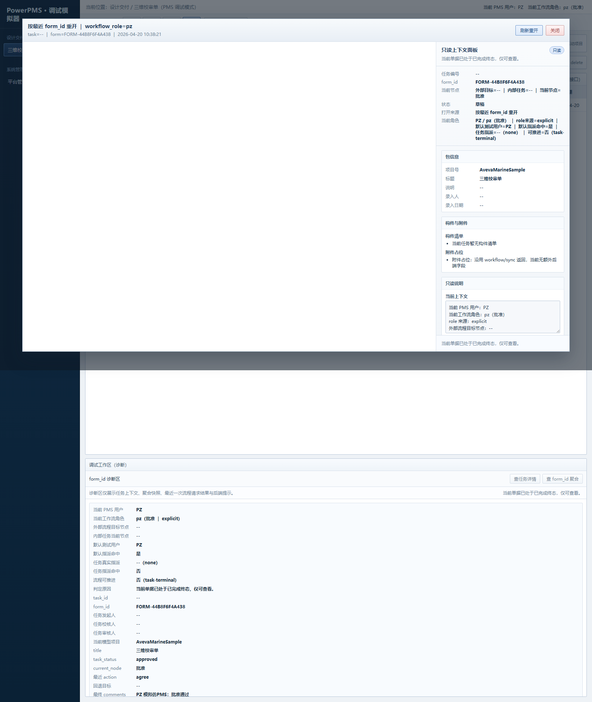

### 4. 本次实跑拿到的关键事实

#### A. `SJ` 发起成功

- 成功创建包名：
  - `模拟编校审-1776652691362`
- 成功生成：
  - `form_id = FORM-44B8F6F4A438`

#### B. `JH` 阶段真实完成批注留痕

本次 automation 返回：

- `annotationId = e2e-annot-1776652698273`
- `confirmedCount = 1`

这说明本次不是只点了流转按钮，而是已经真实执行到：

- 添加批注
- `confirmData(...)`
- 形成 1 条确认记录

#### C. `PZ` 终态只读成立

最终快照里已经出现：

- `canMutateWorkflow = false`
- `sidePanelMode = readonly`
- `accessDecisionReason = 当前单据已处于已完成终态，仅可查看。`

这说明：

> **本次仿 PMS 链路已经从发起、批注留痕、审核推进，一直走到了终态只读。**

### 5. 本次实跑的直接结论

如果你的目标是先确认“当前结合批注的仿 PMS 链路到底能不能走通”，那本轮答案是：

- **能走通**
- 且已经走到：
  - `SJ active`
  - `JH 批注 + confirmData + agree`
  - `SH agree`
  - `PZ agree`
  - `readonly reopen`

但也要注意：

- 本次跑通的是 **external/passive** 主链
- 不是 `manual/internal` 的 reviewer 内部按钮链

这点和下一份问题汇总中的第 1 条问题直接相关。

---

## 十四、2026-04-21 仿 PMS 实跑记录（驳回后重新提交并走完）

这部分补的是另一条更贴近日常使用的问题链路：

> **单据被驳回后，设计侧先处理完全部批注，再重新发起，最后继续走完整个流程。**

### 1. 本次实跑想确认什么

本次重点不是再证明“正向能走通”，而是确认下面三件事：

1. 驳回后，能不能直接重新发起
2. 驳回后，批注要处理到什么状态才允许重新发起
3. 重新发起后，后续 `JH -> SH -> PZ` 能不能继续走完

### 2. 本次实际走通的链路

本次样例使用 1 条批注做验证；真实业务里如果有多条批注，应把下面的处理动作对**全部批注**逐条执行完。

实际走通顺序如下：

1. `SJ` 创建编校审单并执行 `active`
2. `JH` reopen 同一单据
3. `JH` 添加批注，并点击 `确认当前数据`
4. `JH` 执行 `return -> sj`
5. `SJ` reopen 被退回单据
6. `SJ` 按退回意见处理批注，把状态收口为 `已修改待确认`
7. `SJ` 再次点击 `确认当前数据`
8. `SJ` 回外部平台再次执行 `active`
9. `JH` reopen 单据，复核该批注处理结果
10. `JH` 对该批注执行 `同意`，再点击 `确认当前数据`
11. `JH` 回外部平台执行 `agree`
12. `SH` 执行 `agree`
13. `PZ` 执行 `agree`
14. `PZ` 再次 reopen，单据进入 `readonly`

### 3. 本次实跑截图

#### `SJ` 被驳回后重新进入发起面板

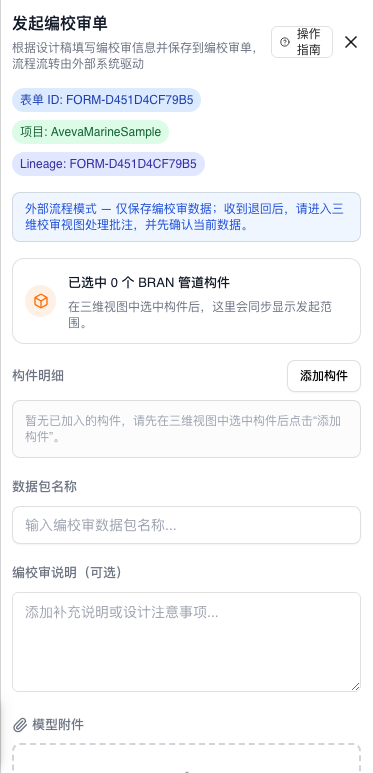

这张图对应的意思是：

- 单据已经退回到 `SJ`
- 当前仍然是 `外部流程模式`
- 设计侧接下来不是直接结束，而是进入三维校审视图继续处理批注

#### `JH` 二轮复核：批注已经变成 `已修改待确认`

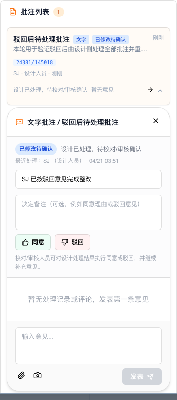

这张图对应的意思是：

- 设计侧已经按退回意见完成处理
- `JH` 此时看到的状态不再是 `待处理`
- 这时才进入“复核并决定同意 / 驳回”的阶段

#### `PZ` 二轮终态：整条链路重新走完

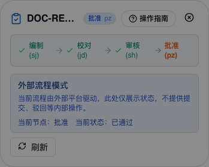

这张图对应的意思是：

- 驳回后的二轮流程已经重新走到最后
- 当前节点显示为 `批准`
- 单据最终状态为 `已通过`

### 4. 本次实跑拿到的关键事实

#### A. `JH` 不能带着未处理批注直接放行

如果 `JH` 看到的批注仍然是：

- `待处理`

那么直接做 `agree` 不会通过。当前真实校验会拦截，并要求先回到驳回分支处理。

#### B. `SJ` 不能带着未处理批注直接重新发起

如果单据虽然已经退回到 `SJ`，但本轮仍有批注停留在：

- `待处理`
  或
- `已驳回`

那么直接再次 `active` 也不会通过。

#### C. 真正允许重新发起的前提，是先把全部批注处理完

这里的“处理完”不是要求当场都变成最终闭环，而是至少先把本轮待整改批注收口为：

- `已修改待确认`
  或
- `不需解决待确认`

并且已经再次点击：

- `确认当前数据`

#### D. 重新发起后，后续角色仍按正常主线继续

一旦二轮重新发起成功，后续动作又回到正常顺序：

- `JH` 复核并同意
- `SH` 继续复核
- `PZ` 最终批准
- reopen 后进入 `readonly`

### 5. 驳回分支的最短口径

如果只想记一句话，当前最稳口径就是：

> **驳回 -> 处理完全部批注 -> 确认当前数据 -> 再次发起 -> 复核同意 -> 继续走完**

---

## 十五、代码锚点（便于排查）

当前教程对应的关键代码位置如下：

- reviewer 工作台主入口：`D:/work/plant-code/plant3d-web/src/components/review/ReviewPanel.vue`
- 批注讨论时间线：`D:/work/plant-code/plant3d-web/src/components/review/ReviewCommentsTimeline.vue`
- 批注三栏评论面板（若后续切换使用）：`D:/work/plant-code/plant3d-web/src/components/review/ReviewCommentsPanel.vue`
- 确认当前数据与主按钮文案：`D:/work/plant-code/plant3d-web/src/components/review/reviewPanelActions.ts`
- 已确认记录恢复：`D:/work/plant-code/plant3d-web/src/components/review/confirmedRecordsRestore.ts`
- 嵌入恢复与 workflow/sync 聚合：`D:/work/plant-code/plant3d-web/src/components/review/embedFormSnapshotRestore.ts`

驳回后重新提交并继续走完的操作口径，已经补在上一节；如果后续还要继续补更多变体，可以直接在本文基础上扩展，不需要另起一套术语。
