# 三维校审操作教程

> 适用入口：`http://pms.powerpms.net:1801/sysin.html`
>
> 适用场景：从 PowerPMS 进入三维校审，完成设计发起、校核、审核、批准四个角色的完整操作。
>
> 本文示例构件参考号：`24381_145018`
>
> 截图时间：2026-04-08。截图中的包名、人员名称仅作示例。
>
> 关键截图已经补成 `24381_145018` 在三维区实际显示后的状态，便于直接核对模型是否已被正确带出。

## 零、流程总览图

下图把四个角色的操作主线、关键通过信号，以及 `workflow/sync` 的查询/流转口径放到同一张图里。建议先看此图，再按后续分角色步骤逐项操作。

Excalidraw 源文件：[`./images/三维校审操作教程/14-三维校审操作流程总览.excalidraw`](./images/三维校审操作教程/14-三维校审操作流程总览.excalidraw)

## 一、开始前准备

### 1. 角色与主流程

| 角色 | 常用账号 | 本文中的主要动作 |
| --- | --- | --- |
| 设计人员 | `SJ` | 发起编校审、上传附件、送审 |
| 校核人员 | `JH` | 添加批注、添加测量、提交到审核 |
| 审核人员 | `SH` | 查看校核结果、同意或驳回 |
| 批准人员 | `PZ` | 最终批准或退回 |

主流程：`SJ 发起 -> JH 校核 -> SH 审核 -> PZ 批准`

### 2. 本文使用的构件对象

本教程统一使用参考号 `24381_145018` 作为示例构件。

### 3. 可直接上传的空白 PDF 附件示例

如需在发起阶段演示附件上传，可直接使用仓库内这两份示例文件：

- `./files/三维校审操作教程/空白校审附件-01.pdf`
- `./files/三维校审操作教程/空白校审附件-02.pdf`

---

## 二、设计人员（SJ）发起编校审

### 1. 打开登录页并登录

访问：`http://pms.powerpms.net:1801/sysin.html`

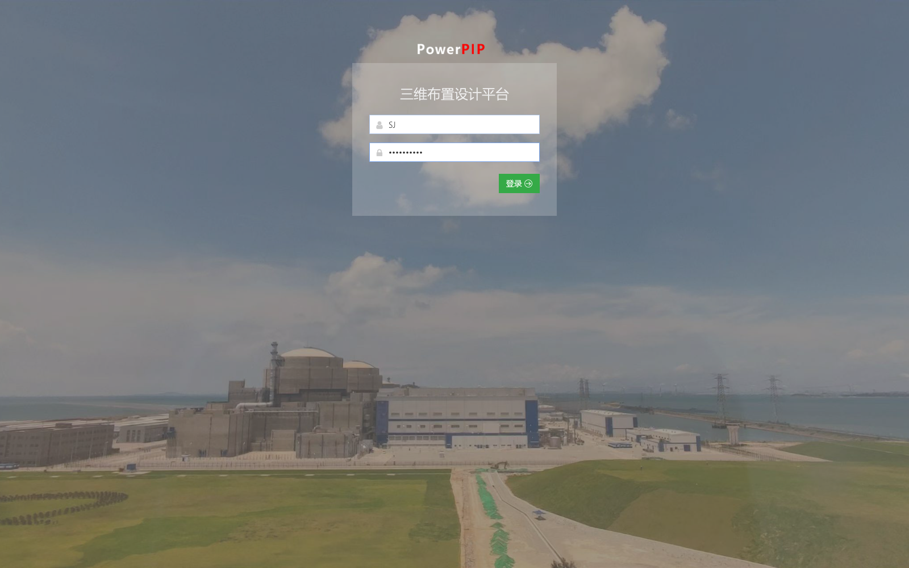

判断标准：
- 输入账号密码后可以进入 PowerPMS 首页。
- 右上角能看到当前登录用户。

### 2. 登录后确认已进入首页

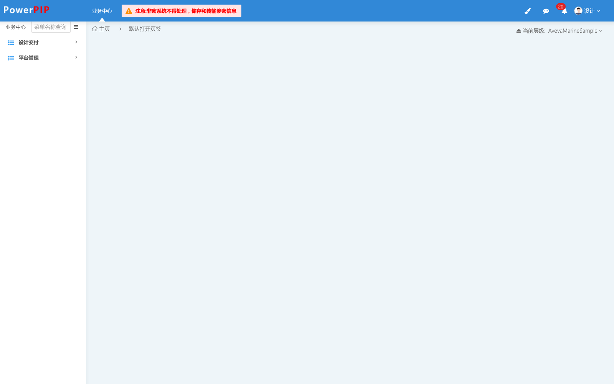

判断标准：
- 左侧菜单能看到 `设计交付`。
- 当前层级已切到目标项目，例如 `AvevaMarineSample`。

### 3. 进入三维校审单列表

路径：`设计交付 -> 三维校审单`

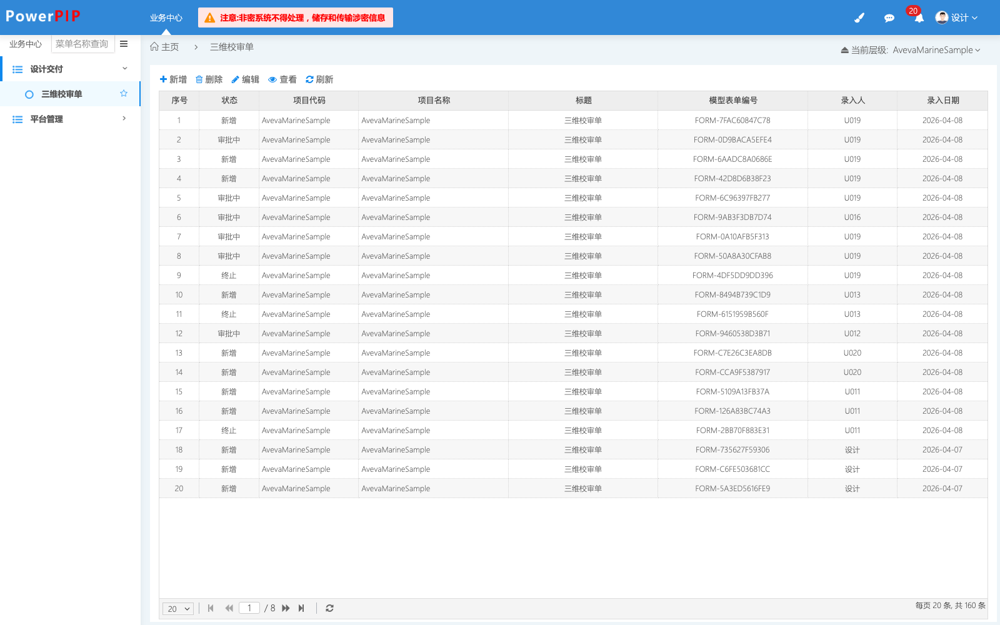

判断标准：
- 页面出现单据列表。
- 工具栏能看到 `新增`。

### 4. 点击新增，打开三维校审界面

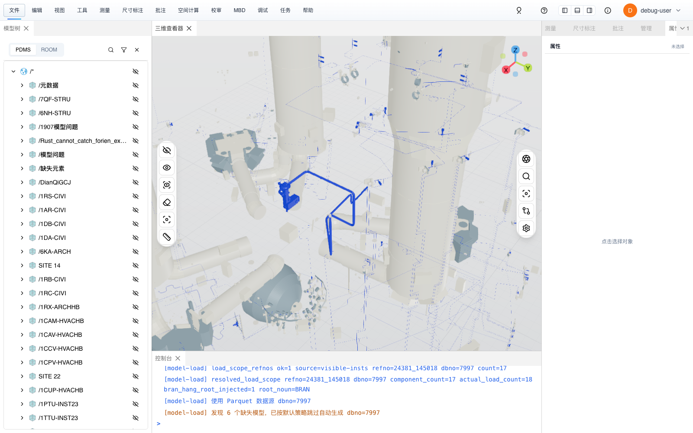

页面分区：
- 左侧：模型树。
- 中间：三维查看区。
- 右侧：属性与操作区。

本图已经能直接看到 `24381_145018` 对应的 BRAN 模型在三维区显示。

### 5. 添加构件，确认已带出 BRAN `24381_145018`

先在三维或模型树中选择目标构件，再点右侧 `添加构件`。

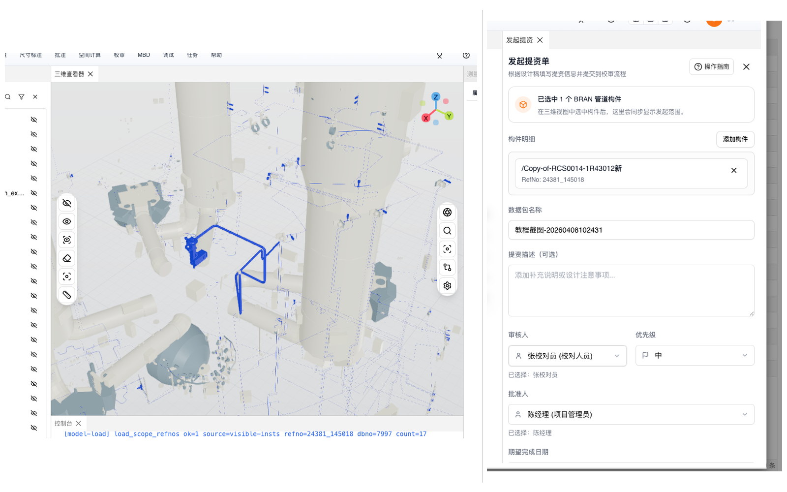

本图左侧就是当前已显示出来的 BRAN 模型，右侧是同步带出的编校审信息。

本步应确认：
- 左侧三维区能看到 `24381_145018` 对应模型。
- 右侧 `构件明细` 已出现 1 条构件。
- 构件的 `RefNo` 为 `24381_145018`。
- `数据包名称` 已填写。
- 下一位处理人和批准人已选好。

### 6. 上传空白 PDF 等附件

右侧面板向下滚动后，可以看到 `模型附件` 上传区。

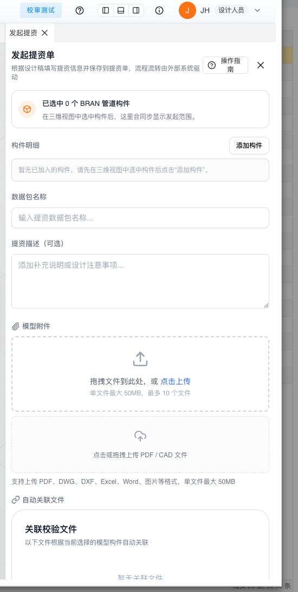

操作说明：
- 点击上传区，选择本教程配套的空白 PDF。
- 也可以拖拽 PDF 到上传框。
- 建议至少上传 1 份，便于后续在校核、审核、批准阶段核对附件流转。

建议上传文件：
- `空白校审附件-01.pdf`
- `空白校审附件-02.pdf`

### 7. 提交并确认创建成功

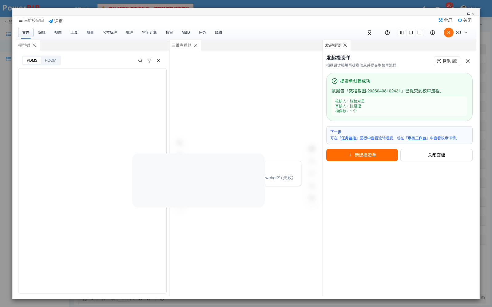

成功标志：
- 页面出现 `编校审单创建成功`。
- 右侧成功卡片能看到数据包名称、校核人、审核人或批准人、附件数等信息。

### 8. 继续送审

如果本次不只创建单据，还要继续往下流转，就在流程弹窗里提交。

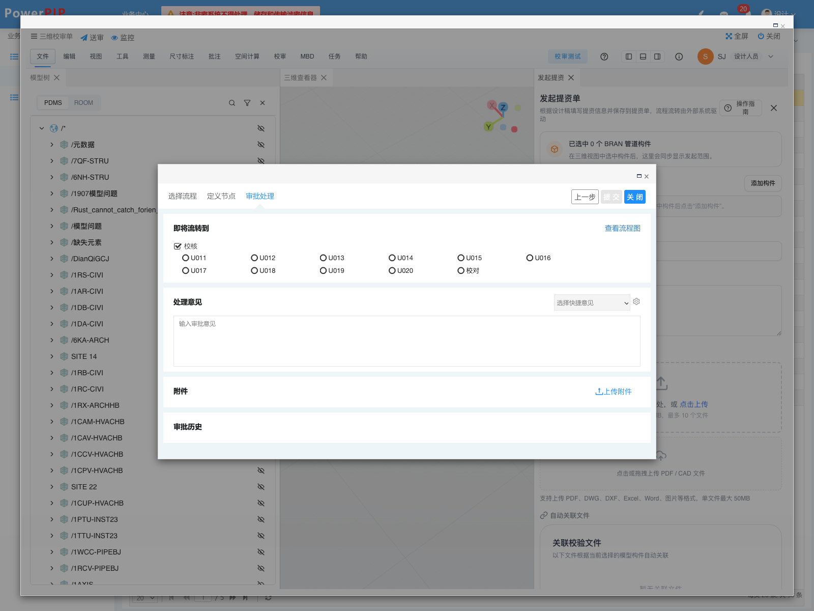

操作说明：
- 选择要转交的下一位处理人。
- 需要时填写处理意见。
- 需要补充材料时，可在弹窗中继续上传附件。
- 点击 `确认提交流转`。

完成标准：
- 列表中能看到新单据。
- 下一位角色登录后可以找到该单据。

---

## 三、校对人员（JH）处理单据

### 1. 在列表中找到待处理单据

校对人员登录后，进入同一路径：`设计交付 -> 三维校审单`。

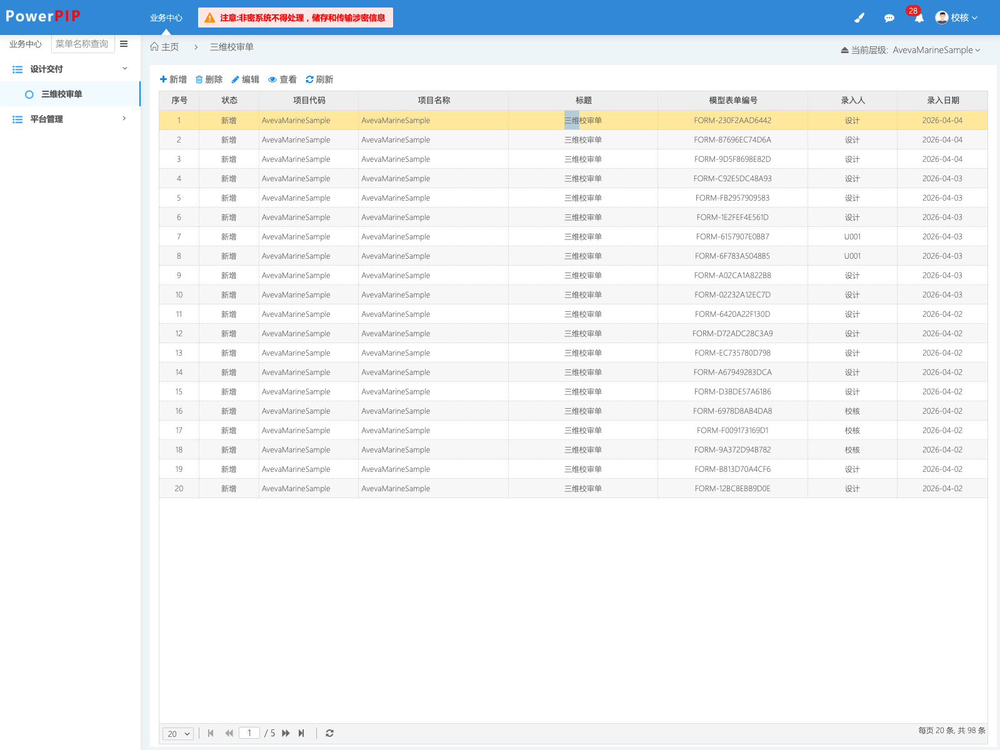

判断标准：
- 能在列表中看到刚才发起的数据包。
- 打开后会进入校对工作台。

### 2. 进入校对工作台

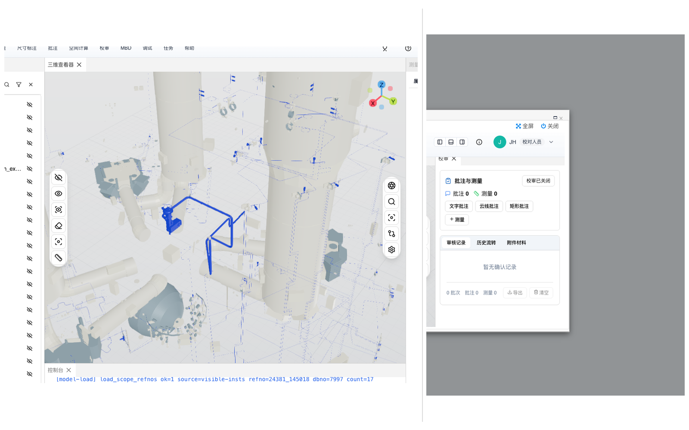

本图左侧仍能看到 `24381_145018` 对应模型，右侧是校对工作台。

工作台里要重点看三块：
- 顶部流程按钮区
- 右侧 `批注与测量`
- 右侧 `审校记录 / 历史流转 / 附件材料`

### 3. 添加批注

在右侧 `批注与测量` 区，先选批注类型，再到三维区域落点。

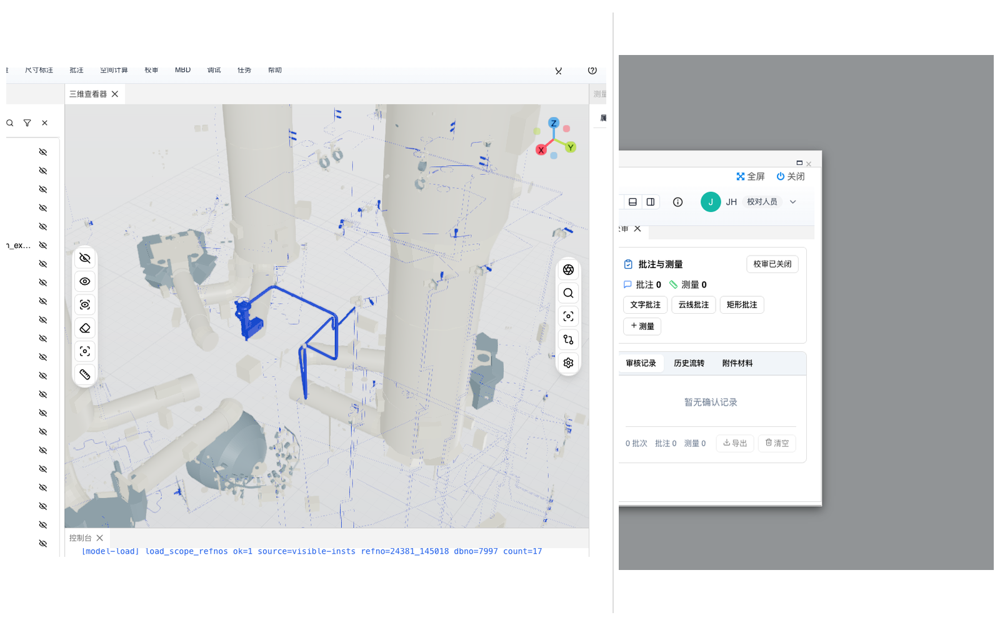

本图左侧是当前 BRAN 模型显示区域，右侧是批注与测量操作区。

推荐顺序：
1. 点击 `文字批注`、`云线批注` 或 `矩形批注`。
2. 在三维区域标出问题位置。
3. 填写批注说明。
4. 保存本次批注。

完成标准：
- `批注` 数量不再是 0。
- `审校记录` 中能看到本次记录。

### 4. 添加距离测量

仍在同一区域，点击 `+测量` 后，在三维区域依次选择两个点。

建议做法：
- 直接围绕 `24381_145018` 所在构件选择两个点。
- 完成后保存本次测量结果。

完成标准：
- `测量` 数量不再是 0。
- `审校记录` 中能看到测量已被保存。

### 5. 查看流程按钮区并确认流转至审核

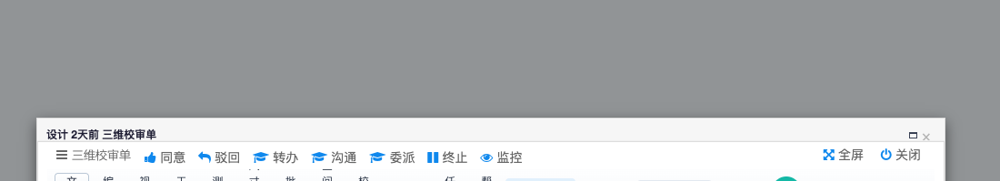

常用按钮：
- `确认流转至审核`：继续流转到审核。
- `确认驳回流转`：退回到设计或前一节点。
- `转办` / `沟通` / `委派`：按项目规则使用。
- `终止`：结束当前流程。

通常做法：
- 批注、测量、附件都确认无误后，点击 `确认流转至审核`。
- 在流程弹窗中填写意见，再确认提交流转到 `SH`。

可配合核对：
- `历史流转` 里出现新的节点记录。
- `附件材料` 里能看到设计阶段上传的 PDF。

---

## 四、审核人员（SH）处理单据

### 1. 打开审核单据

审核人员登录后，仍从 `设计交付 -> 三维校审单` 进入，并打开同一条单据。

可重点查看：
- 校对阶段是否已经留下批注和测量。
- 附件材料里是否能看到设计阶段上传的 PDF。
- 历史流转是否能看到 `SJ -> JH` 的过程。

### 2. 审核处理

审核阶段沿用同一套工作台和流程弹窗。

审核人员常见动作：
- 查看 JH 留下的批注、测量、附件。
- 需要补充说明时，可继续填写处理意见。
- 通过时点击 `确认流转至批准`，把单据流转到批准。
- 不通过时点击 `确认驳回流转`，并写明退回原因。

完成标准：
- 通过后，单据进入 `PZ`。
- 驳回后，设计人员重新登录能看到退回任务。

---

## 五、批准人员（PZ）处理单据

### 1. 打开批准单据

批准人员登录后，进入同一路径打开待处理单据。

建议先核对三项：
- 批注与测量是否已经齐全。
- 附件材料是否已经齐全。
- 历史流转是否完整经过 `SJ -> JH -> SH`。

### 2. 最终批准或退回

批准阶段仍在同一工作台里处理。

批准人员常见动作：
- `确认最终批准`：任务完成，进入最终通过状态。
- `确认驳回流转`：退回到指定前置节点。

本文档对应的仓库证据已经覆盖：
- 批准通过后重新打开单据，批注、测量、附件仍可查看。
- 附件材料页可继续看到之前上传的附件条目。

---

## 六、常用判断方法

### 1. 是否已经成功发起编校审

以页面出现 `编校审单创建成功` 为准。

### 2. 是否已经成功把 BRAN 写入单据

以右侧 `构件明细` 出现 `RefNo: 24381_145018` 为准。

### 3. 是否已经成功保存批注和测量

以 `批注`、`测量` 计数增加，且 `审校记录` 出现新记录为准。

### 4. 是否已经成功流转到下一角色

以下任一项成立即可判断：
- 当前角色提交后，`历史流转` 增加了新节点；
- 下一位角色登录后能在列表中找到该单据；
- 当前单据状态发生变化。

---

## 七、常见问题

### 1. 看得到页面，但三维区无法正常显示

如果页面提示 `需要 WebGL2`，说明当前浏览器或图形环境不满足要求。

处理方法：
- 改用最新版本的 Chrome 或 Edge。
- 确认本机图形环境支持 WebGL2。

### 2. 提交后列表中找不到新单据

先检查：
- 是否只完成了创建，还没有继续确认提交流转；
- 数据包名称是否填错；
- 当前项目层级是否正确；
- 列表是否已经刷新。

### 3. 校对人员打开后看不到批注与测量区

先检查：
- 是否真的进入了校对工作台，而不是停留在列表页；
- 当前登录角色是否正确；
- 单据是否已经流转到校对节点。

### 4. 附件上传后下一个角色看不到附件

先检查：
- 发起阶段是否真的上传成功；
- 是否在创建成功后又继续完成了确认提交流转；
- 后续角色是否切到了 `附件材料` 页签。

---

## 八、建议的最短操作路径

### 设计人员（SJ）

`登录 -> 设计交付 -> 三维校审单 -> 新增 -> 添加 24381_145018 -> 上传 PDF -> 创建编校审单 -> 确认提交流转`

### 校对人员（JH）

`登录 -> 三维校审单 -> 打开单据 -> 添加批注 -> 添加测量 -> 确认流转至审核 -> 确认提交流转`

### 审核人员（SH）

`登录 -> 三维校审单 -> 打开单据 -> 查看批注/测量/附件 -> 确认流转至批准或确认驳回流转`

### 批准人员（PZ）

`登录 -> 三维校审单 -> 打开单据 -> 确认最终批准或确认驳回流转`
