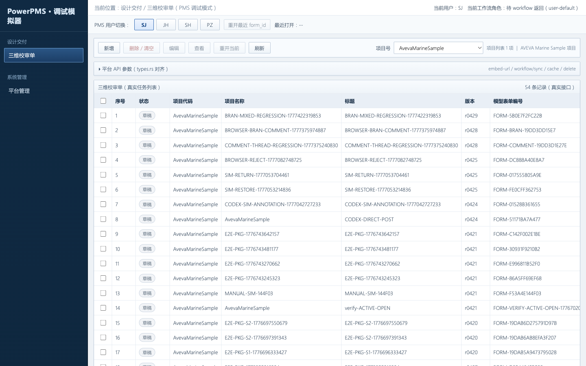
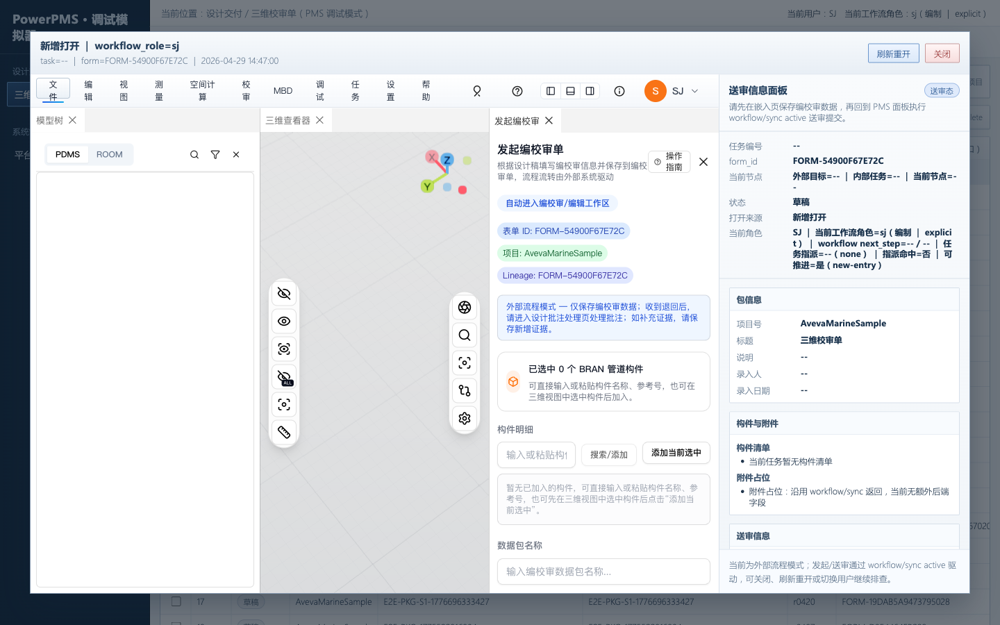
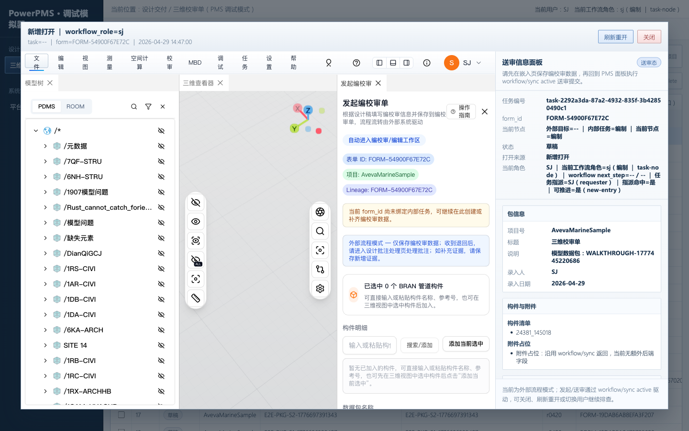
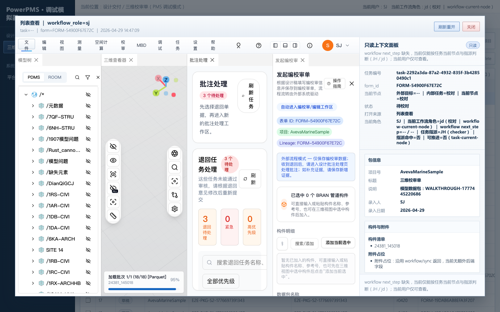
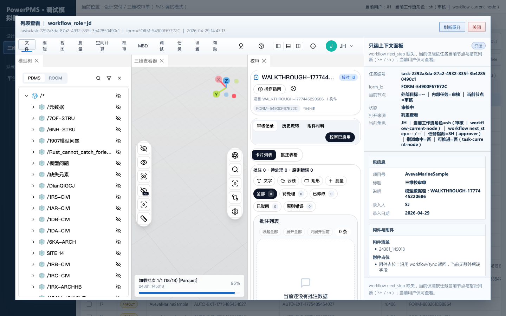
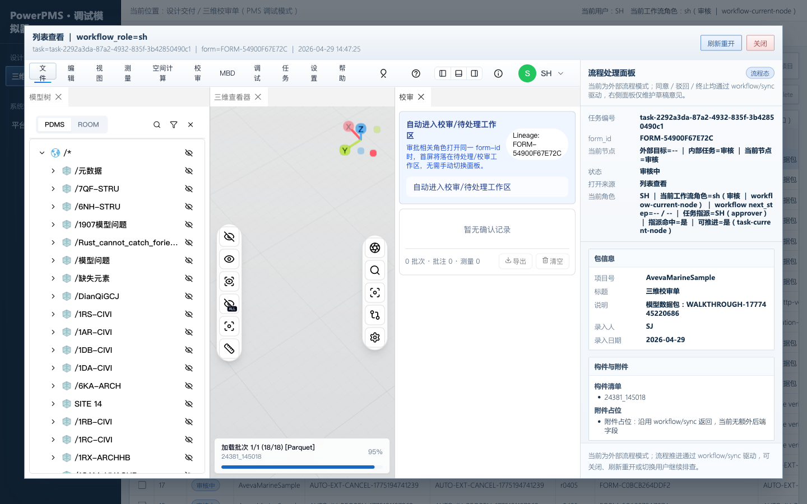
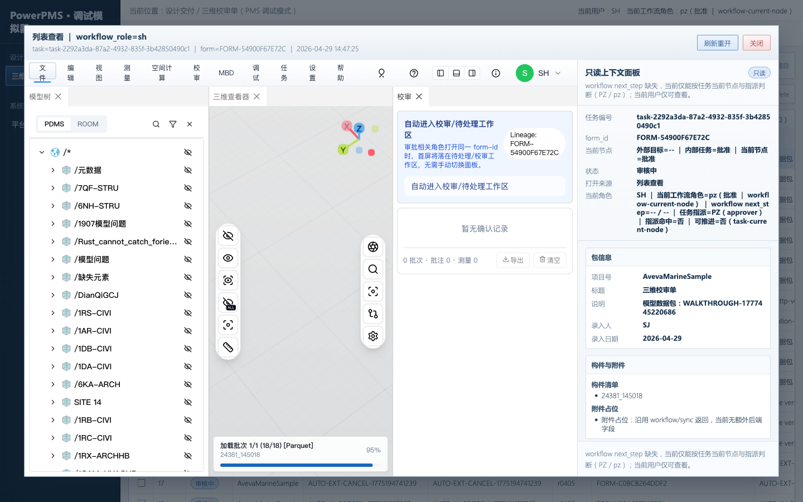
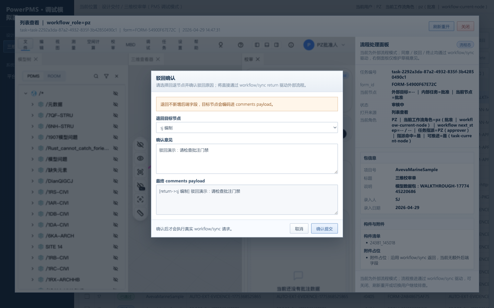
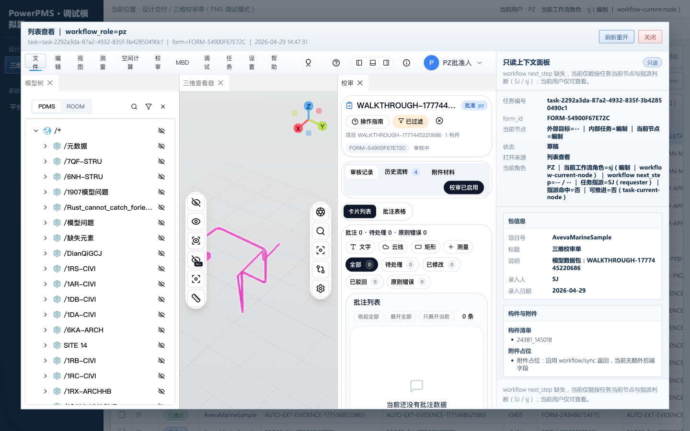
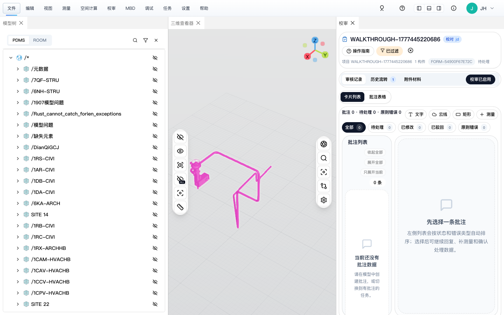

# 仿 PMS 驳回链路自动化演示（2026-04-29）

> 本文档由 `scripts/pms-simulator-walkthrough.ts` 自动生成，记录仿 PMS 驳回链路（return）一次完整自动化演示的每一步操作 + 截图。

## 概要

- 演示日期：2026-04-29
- form_id：`FORM-54900F67E72C`
- task_id：`task-2292a3da-87a2-4932-835f-3b42850490c1`
- 路径：SJ 发起 → SJ active → JH agree → SH agree → PZ return(→SJ) → SJ 重新打开
- 仿 PMS 入口：`http://127.0.0.1:3101/pms-review-simulator.html?debug_ui=1&auth_strict=0&project=AvevaMarineSample`
- 后端：`http://127.0.0.1:3100` ｜ 前端：`http://127.0.0.1:3101`
- 浏览器：Chromium (headed, viewport 1440×900)

## 前置准备

1. backend `web_server` 监听 `127.0.0.1:3100`（plant-model-gen 仓 `cargo run --bin web_server`）。
2. frontend vite 监听 `127.0.0.1:3101`（`npm run dev -- --host 127.0.0.1 --port 3101 --strictPort`）。
3. `curl http://127.0.0.1:3100/api/health` 返回 `status:ok` 且 `database:healthy`。

## 执行命令

```bash
npx tsx scripts/pms-simulator-walkthrough.ts
```

## 操作步骤

### 步骤 1：仿 PMS 平台主页

打开仿 PMS 模拟器：`http://127.0.0.1:3101/pms-review-simulator.html?debug_ui=1&auth_strict=0&project=AvevaMarineSample`。 `debug_ui=1` 开启调试面板（角色切换 / 工作流按钮 / 列表刷新），`auth_strict=0` 放宽鉴权方便手测。 左侧任务列表、右侧将作为 plant3d 嵌入区。


*仿 PMS 平台默认主页*

### 步骤 2：SJ 设计师登场

SJ 是设计师角色，负责发起评审。在 simulator 顶部点击 `SJ` 按钮（脚本里调用 `__pmsReviewSimulatorTest.switchRole("SJ")`）。



*切换到 SJ 设计师角色*

### 步骤 3：SJ 新建评审单

SJ 在仿 PMS 主页点「新建」打开 plant3d 内嵌发起页面（同时新开同源 tab 用于自动化注入 BRAN）。`__pmsReviewSimulatorTest.openNew()`。



*SJ 打开「新建评审」iframe*


*plant3d 设计端发起页面（独立标签）*

### 步骤 4：SJ 提交评审

脚本通过 `__plant3dInitiateReviewE2E.addMockComponent` 注入测试 BRAN `24381_145018`，然后调用 `submitReview` 完成发起。后端返回 form_id=`FORM-54900F67E72C`，task_id=`task-2292a3da-87a2-4932-835f-3b42850490c1`。



*SJ 提交评审完成，列表出现 FORM-54900F67E72C*

### 步骤 5：SJ 激活流程（流转到 JH）

SJ 在仿 PMS 列表里选中刚发起的单据 → 点「激活」→ 弹出确认框 → 确认。后端 `task.current_node` 从 `sj` → `jd`（JH 校核节点）。


*SJ 激活流程对话框*



*SJ 激活完成，单据流入 JH 校核节点*

### 步骤 6：JH 校核师同意（流转到 SH）

JH 校核师切换角色后打开任务，校验三维批注后点「同意」。后端 `task.current_node` 从 `jd` → `sh`（SH 审查节点），状态 `in_review`。


*JH 打开校核任务*


*JH 校核师视角下的 plant3d 三维校审界面*



*JH 同意，单据流入 SH 审查节点*

### 步骤 7：SH 审查师同意（流转到 PZ）

SH 审查师切换并打开任务，确认无误后点「同意」。后端 `task.current_node` 从 `sh` → `pz`（PZ 批准节点）。



*SH 打开审查任务*



*SH 同意，单据流入 PZ 批准节点*

### 步骤 8：PZ 批准人驳回到 SJ（关键链路）

PZ 打开任务 → 点「退回」→ 选择目标节点 `SJ` → 填写驳回意见 → 确认。后端 `task.current_node` 从 `pz` → `sj`，状态变为 `draft`。这是最近 commit `45bf5ec fix(pms-review): 修复仿 PMS 驳回链路 P0 阻塞 + 断言口径对齐` 修复的核心场景。


*PZ 打开批准任务*



*PZ 选择驳回目标节点 SJ + 填写理由*



*PZ 确认驳回完成，单据回到 SJ draft*

### 步骤 9：SJ 重新打开被驳回单据

SJ 切回设计师角色，从「待重新提交」/「我发起的」入口重新打开被 PZ 驳回的单据。 simulator 侧栏会切到 `initiate` 模式（设计端批注处理区可见），plant3d 内嵌「设计端批注处理区」`[data-testid=designer-comment-annotation-list]`。 这是最近 fix `45bf5ec` 与 `77bd745` 共同保障的关键 UX：即使工作流控件 readonly，设计师也能查看驳回理由 / 批注列表 / 单条修改。


*SJ 重新打开被驳回单据*



*plant3d 设计端「批注处理区」（最近 fix 关键还原点）*

## 关键回归断言

参考 `artifacts/pms-simulator-report.json` 的 return 场景断言（执行 `PMS_SIMULATOR_CASE=return npm run test:pms:simulator` 时生成）：

| 断言 key | 期望 | 实际 | 通过 |
| --- | --- | --- | --- |
| sj-active-backend-current-node | jd | jd | ✓ |
| jh-agree-backend-current-node | sh | sh | ✓ |
| sh-agree-backend-current-node | pz | pz | ✓ |
| return-backend-current-node | sj | sj | ✓ |
| return-side-panel | initiate\|readonly | initiate | ✓ |
| return-form-preserved | (form 保持) | (form 保持) | ✓ |
| return-designer-comment-list | 列表渲染 | 渲染正常 | ✓ |
| return-designer-comment-detail-hidden | false | false | ✓ |
| return-designer-comment-task-entry-hidden | false | false | ✓ |

## 相关参考

- `docs/verification/三维校审完整流程审查文档.md`
- `docs/verification/设计侧驳回单据处理教程-2026-04-29.md`
- `docs/verification/三维校审批注与处理留痕操作教程.md`
- `scripts/pms-simulator-runner.ts`（runner 主体，含 7 个回归场景）
- `scripts/pms-simulator-bootstrap.ts`（bootstrap 入口，自动拉起 backend/frontend）
