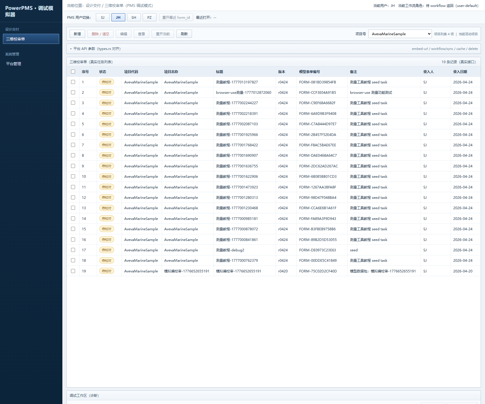
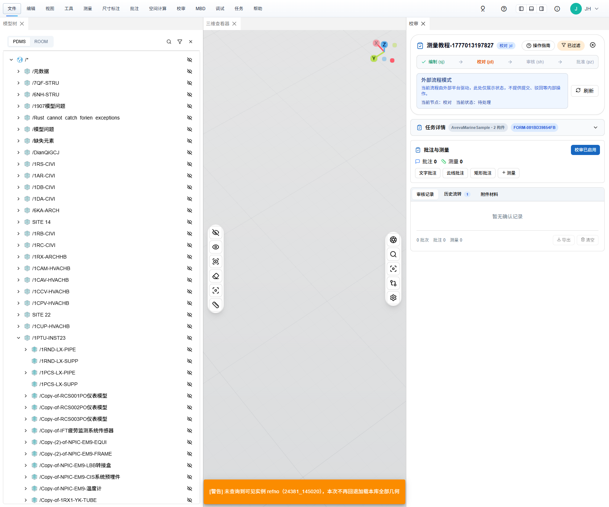
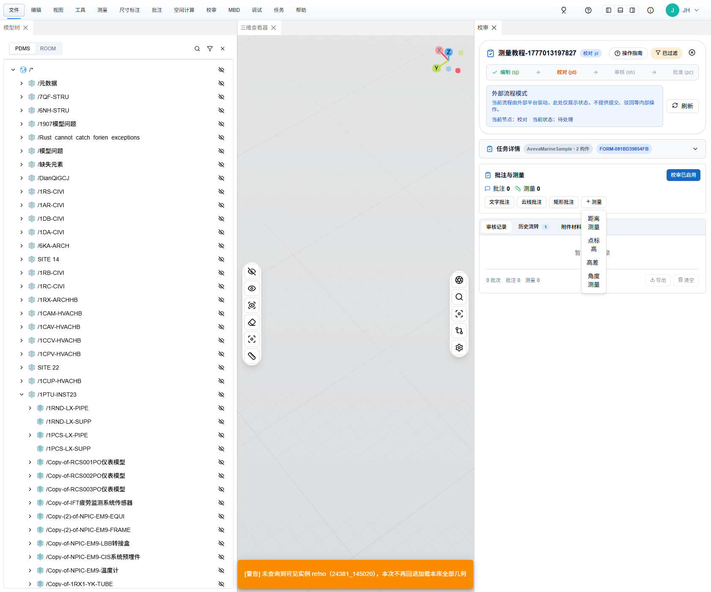
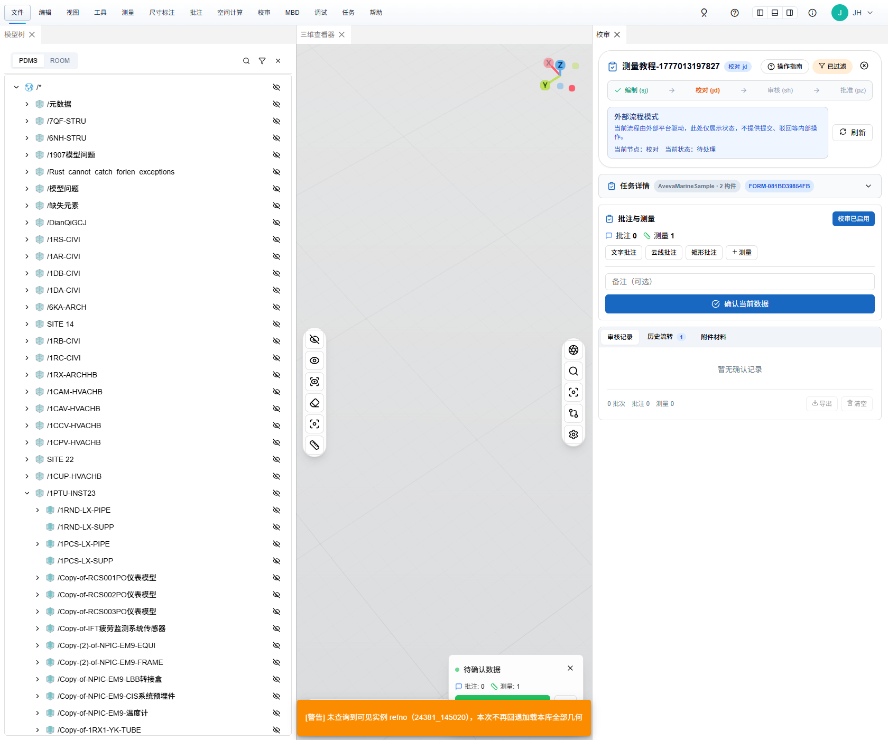
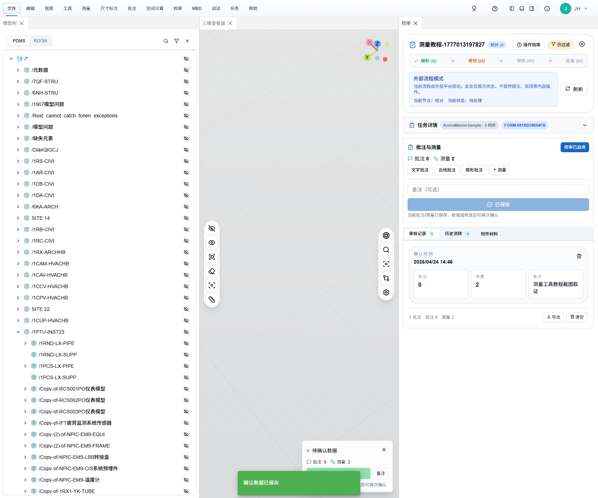

# 测量工具操作教程

> 适用范围：`plant3d-web` reviewer 工作台中的测量操作。本文固定以 **仿 PMS 模拟器** 为入口，不走真实 PMS。  
> 当前覆盖：`距离测量`、`角度测量`。  
> 截图时间：2026-04-24。  
> 当前口径：**测量是证据，不是独立状态机**；只有点击 `确认当前数据` 后，测量才会写入确认记录并成为可回看的处理留痕。  
> 关联文档：`./三维校审批注与处理留痕操作教程.md`、`./三维校审操作教程.md`

---

## 一、前置条件与本地打开方式

### 1. 本文默认环境

- 前端 / 模拟器：`http://127.0.0.1:3101/pms-review-simulator.html?output_project=AvevaMarineSample`
- 后端健康检查：`http://127.0.0.1:3100/api/health`
- 当前 reviewer 角色：`JH`
- 当前示例项目：`AvevaMarineSample`
- 当前示例构件参考号：`24381_145018`

### 2. 手工操作前先确认两件事

1. 仿 PMS 页面右上角当前角色已经切到 `JH`
2. `真实 PMS 拼链` 处于关闭状态，保持当前默认 **token-primary** 打开方式

### 3. 本次截图复拍使用的 CDP 启动方式

如果你只看业务步骤，这一段可以跳过；如果你要按本文同样方式复拍截图，可直接复用下面命令。

PowerShell 启动 Chrome 远程调试：

```powershell
& "C:\Program Files\Google\Chrome\Application\chrome.exe" `
  --remote-debugging-port=9222 `
  --user-data-dir="D:\work\plant-code\plant3d-web\.tmp\chrome-cdp-profile" `
  "http://127.0.0.1:3101/pms-review-simulator.html?output_project=AvevaMarineSample"
```

本次截图取证 attach 命令：

```powershell
$env:CHROME_CDP_URL = 'http://127.0.0.1:9222'
npx tsx .tmp/measurement-tutorial-capture.mts
```

说明：

- 上述命令会先在仿 PMS 中补一条 `SJ -> active -> JH` 的测量示例单据
- `距离测量` 与 `角度测量` 都是先真实点击 reviewer 工作台按钮，再通过现有 hook 注入测量结果
- 本次取证使用的 hook 为：`window.__plant3dReviewerE2E.addMockMeasurement('distance' | 'angle')`

---

## 二、进入 `JH` reviewer 工作台

### 1. 在仿 PMS 列表中确认待处理单据

打开模拟器后，切到 `JH`，在 `三维校审单` 列表中找到待处理单据。



本图中应重点确认：

- 左上角当前角色是 `JH`
- 列表里能看到本次测量示例单据
- `模型表单编号` 已经带出对应 `form_id`

### 2. 打开 reviewer 工作台

进入同一条单据后，应看到 reviewer 工作台。



进入后先看右侧三块信息：

1. `外部流程模式` 提示卡  
   当前教程按 `external` 模式理解，流程推进仍由外部平台控制。
2. `任务详情`  
   这里要能看到当前项目与 `form_id`。
3. `批注与测量`  
   后续距离测量、角度测量、确认当前数据，都在这里完成。

说明：

- 若本机当前仿 PMS 调试页点击 `查看` 没反应，可直接复制 diagnostics 里的最终 `iframe src` 打开
- 2026-04-24 本地取证时，仿 PMS `task-view` 打开链路曾出现 `workflowRole is not defined`；因此本次截图是先在模拟器里定位同一条单据，再用同一 `form_id` 的 token-primary reviewer URL 直开工作台

---

## 三、`距离测量` 操作步骤

### 1. 打开工作台内的 `+测量` 菜单

在右侧 `批注与测量` 区，点击 `+测量`。



当前可选项固定为：

- `距离测量`
- `角度测量`

### 2. 选择 `距离测量`

手工业务操作时，点击 `距离测量` 后，应回到三维区选择两个点。

本次教程截图为了稳定复现，采用的是：

1. 真实点击 `+测量 -> 距离测量`
2. 再通过现有 hook 注入距离测量结果

### 3. 确认距离测量已经进入“待确认”状态



本步完成标准：

- 右侧 `测量` 数量从 `0` 变成 `1`
- 下方出现待确认数据提示卡
- `确认当前数据` 主按钮已经出现

这里要注意：

- 此时测量还只是草稿
- **还没有形成审核记录**
- 这一步只能说明“证据已补充”，不能说明“留痕已完成”

---

## 四、`角度测量` 操作步骤

### 1. 再次打开 `+测量`

继续在同一位置点击 `+测量`，然后选择 `角度测量`。

手工业务操作时，角度测量一般需要在三维区选择三个点。

### 2. 确认角度测量已经叠加到当前草稿


本步完成标准：

- `测量` 数量变成 `2`
- 当前草稿里已经同时包含：
  - 1 条距离测量
  - 1 条角度测量
- `确认当前数据` 仍处于可点击状态

当前正确理解应是：

> **这两条测量现在属于同一轮待确认草稿，会在下一步一起进入确认记录。**

---

## 五、`确认当前数据` 与审核记录回看

### 1. 点击 `确认当前数据`

在 `批注与测量` 区可选填写备注，然后点击：

- `确认当前数据`

这一步就是当前测量留痕的分界线。

分界线前后区别如下：

| 阶段 | 含义 |
| --- | --- |
| 点击前 | 距离测量、角度测量都只是草稿证据 |
| 点击后 | 当前草稿被写入确认记录，并可在 `审核记录` 中回看 |

### 2. 在 `审核记录` 中检查是否落库



本图里应重点检查：

- `确认当前数据` 按钮已经变成 `已保存`
- `审核记录` 页签下出现了新的确认卡片
- 卡片中能看到：
  - `批注 0`
  - `测量 2`
  - 本次备注内容

### 3. 为什么确认后顶部仍然看到 `测量 2`

这是当前实现里最容易误解的一点。

确认完成后：

1. 草稿会先写入确认记录
2. 工作台会再把确认记录回放到场景中，方便继续查看与复核

所以不要把“顶部还能看到 `测量 2`”误判成“还没确认”。  
当前更可靠的判断标准是：

- `确认当前数据` 按钮文案已经变成 `已保存`
- `审核记录` 中新增了确认卡片

---

## 六、常见问题与限制

### 1. 为什么测量没有 `已修改 / 已同意 / 已驳回`

因为当前实现里：

- **批注** 才进入处理状态机
- **测量** 只作为证据随确认记录一起保存和回放

因此，测量本身不会单独拥有处理状态。

### 2. 为什么页面提示我先确认当前数据

因为当前 `external` 主链下：

- reviewer 工作台负责补批注、补测量、补讨论
- 外部平台负责真正的 `agree / return / active`

所以在离开当前页或继续流转前，必须先把本轮证据点成确认记录。

### 3. 为什么底部会出现橙色告警 `JSON fallback 已执行...`

本次截图里可以看到该提示。它说明当前样例里没有命中可绘制实例，系统回退到了 JSON fallback。

对本文的影响是：

- **不影响** 当前“测量作为证据进入确认记录”的教程主线
- **会影响** 你想在三维区精确看到实例高亮、真实拾取点位时的体验

如果你要做真实点选而不是教程复拍，建议先确认：

- 目标 `refno` 在当前项目里确实有可绘制实例
- 模型实例索引已正确加载

### 4. 为什么仿 PMS 点了 `查看` 可能没直接打开工作台

2026-04-24 本地取证时，仿 PMS 的 `task-view` 打开链路曾出现：

```text
workflowRole is not defined
```

因此当前更稳的做法是：

1. 先在仿 PMS 里定位到同一条 `form_id`
2. 再复制 diagnostics 里的最终 `iframe src` 直开 reviewer

本文截图就是按这个口径取证的。

### 5. 当前有没有“标高测量”

没有。  
截至 2026-04-24，本文只覆盖：

- `距离测量`
- `角度测量`

如果后续新增“单点标高”或“两点高差”，应补成独立条目，不要混写成当前文档已支持。
