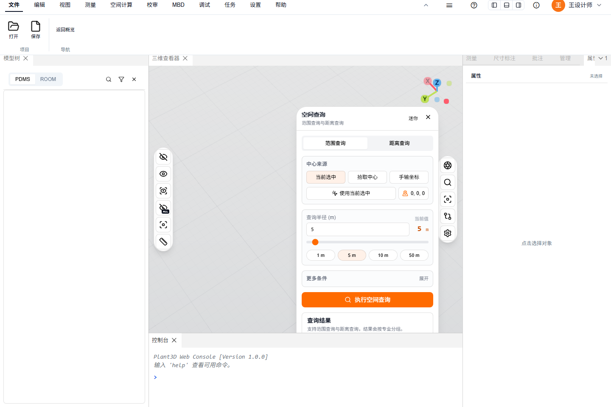
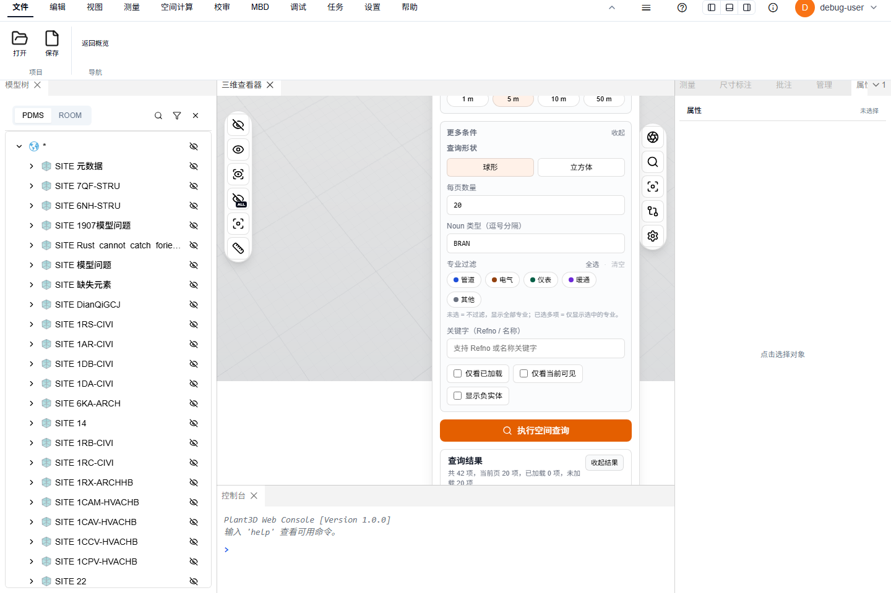
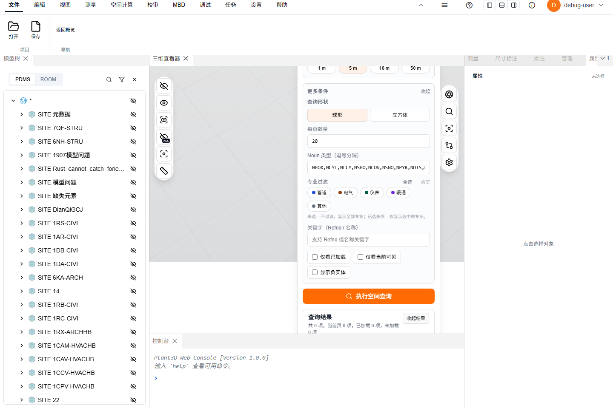
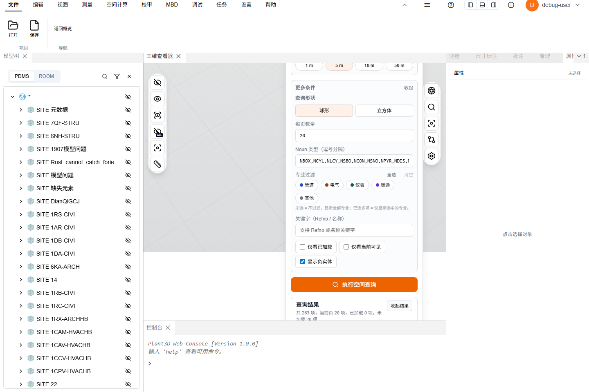

# 空间查询使用教程

> 适用范围：`plant3d-web` 中的空间查询面板。  
> 示例项目：`AvevaMarineSample`。  
> 示例 BRAN：`24381_145018`。  
> 示例中心坐标：`X=5642.735`、`Y=9188.425`、`Z=15979.015`。  
> 截图目录：`./images/空间查询使用教程-2026-06-22/`。  
> 实测后端：`http://127.0.0.1:3102`（本地临时验证端口）；日常使用默认 `3100`。

---

## 一、打开示例项目

1. 启动前端和后端后，在浏览器打开：

   ```txt
   http://127.0.0.1:3101/?output_project=AvevaMarineSample
   ```

2. 等待三维视图和模型树加载完成。
3. 如果需要核对目标构件，可在模型树或搜索入口中定位 BRAN `24381_145018`。

**预期结果**

- 当前项目显示为 `AvevaMarineSample`。
- 三维视图中可以正常加载模型。
- 后续空间查询结果能够显示 `已加载` / `未加载` 状态。

截图：可参考下一节面板截图确认项目已进入三维视图。

---

## 二、打开空间查询面板

1. 在顶部 Ribbon / 工具栏中找到 `空间查询`。
2. 点击 `空间查询` 按钮。
3. 右侧会弹出 `空间查询` 浮层面板，面板标题下方显示 `范围查询与距离查询`。

**预期结果**

- 面板中可以看到两个模式：`范围查询`、`距离查询`。
- 面板下方有 `查询结果` 区域。
- 默认还没有结果，提示为执行一次空间查询后按专业分组显示。



---

## 三、范围查询：按中心点查附近对象

范围查询适合回答“某个点、当前选中对象或拾取点附近有什么”。

### 方式 A：手输坐标查询

1. 在面板顶部选择 `范围查询`。
2. 在 `中心来源` 中选择 `手输坐标`。
3. 在 `中心坐标` 中填写：

   | 字段 | 值 |
   | --- | ---: |
   | X | `5642.735` |
   | Y | `9188.425` |
   | Z | `15979.015` |

4. 在 `查询半径 (m)` 中选择一个半径：
   - `1 m`：用于精确确认中心点附近的小范围对象。
   - `5 m`：用于查看局部管段、支架、设备周边对象。
   - `10 m`：用于查看一个小区域内的相关对象。
   - `50 m`：用于排查范围过小导致没有结果，或快速了解大范围分布。
5. 点击 `执行空间查询`。

**预期结果**

- `查询结果` 区域显示返回数量、已加载数量、未加载数量。
- 点击 `查看结果` 后，结果按专业分组展示。
- 每个结果项显示 Refno、Noun、加载状态和距离。

实测示例：坐标 `X=5642.735`、`Y=9188.425`、`Z=15979.015`，半径 `5 m`，`Noun=BRAN`，返回 `42` 项，当前页 `20` 项。



### 方式 B：当前选中或拾取中心

1. 先在三维视图或模型树中选中一个对象。
2. 在 `范围查询` 中选择 `当前选中`，或点击 `拾取中心` 后在三维视图中拾取位置。
3. 确认中心摘要已经更新。
4. 选择半径并点击 `执行空间查询`。

**预期结果**

- 查询中心来自当前对象或拾取点。
- 返回结果仍按半径范围和过滤条件计算。

---

## 四、距离查询：按 Refno 或坐标查距离内对象

距离查询适合回答“从某个物项或坐标出发，指定距离内有哪些对象”。

### 通过 BRAN Refno 查询

1. 在面板顶部选择 `距离查询`。
2. 在 `起始位置` 中选择 `通过 Refno`。
3. 在 `或手填 Refno` 中输入：

   ```txt
   24381_145018
   ```

4. 半径建议按排查目的选择：
   - 先用 `1 m` 看紧邻对象。
   - 没有结果时改为 `5 m`。
   - 需要看同一区域更多上下游对象时用 `10 m`。
   - 需要排查数据是否存在或空间索引是否可用时用 `50 m`。
5. 点击 `执行空间查询`。

**预期结果**

- 查询结果围绕 BRAN `24381_145018` 展开。
- 结果项中能看到距离值，便于按近到远判断。
- 如果目标 BRAN 尚未加载，结果中可能出现 `未加载` 项，可继续执行加载操作。

截图占位：`./images/空间查询使用教程-2026-06-22/04-距离查询-BRAN-24381_145018.png`

### 通过坐标查询

1. 在 `距离查询` 中选择 `通过坐标`。
2. 填写中心坐标 `X=5642.735`、`Y=9188.425`、`Z=15979.015`。
3. 选择半径并执行查询。

**预期结果**

- 查询中心为手输坐标。
- 结果列表按距离辅助判断附近对象。

---

## 五、更多条件与负实体开关

点击 `更多条件` 可以展开高级过滤。

常用设置：

- `查询形状`
  - `球形`：按半径球体范围查询，适合一般“附近对象”。
  - `立方体`：按立方体范围查询，适合按轴向包围盒排查。
- `每页数量`：控制结果分页大小。
- `Noun 类型（逗号分隔）`：例如 `PIPE,EQUI,BRAN`，用于只看指定类型。
- `专业过滤`：未选表示不过滤；选中多个专业表示只显示这些专业。
- `关键字（Refno / 名称）`：输入 Refno 或名称片段缩小结果。
- `仅看已加载`：只显示当前已经加载到三维场景中的对象。
- `仅看当前可见`：只显示当前没有被隐藏的对象。

### 显示负实体

`显示负实体` 默认不勾选，也就是默认隐藏负实体 / 布尔运算负体结果。

保持默认隐藏的场景：

- 日常查看附近真实设备、管件、结构件。
- 只关心可见实体，不想让布尔切割体干扰结果。
- 给业务用户演示空间范围内有哪些对象。

建议启用 `显示负实体` 的场景：

- 排查模型数据中是否存在负实体。
- 检查布尔运算、开孔、切割相关对象。
- 查询结果数量和预期不一致，怀疑目标被负实体过滤掉。
- 需要验证空间索引或后端返回是否包含负实体数据。

**预期结果**

- 未勾选 `显示负实体` 时，结果更接近用户在三维视图中看到的正常实体。
- 勾选后，结果可能增加负实体相关项，适合诊断和数据核对。

实测示例：只查询负实体 Noun 列表，半径 `5 m`。

- 默认不勾选：返回 `0` 项。
- 勾选 `显示负实体`：返回 `263` 项，当前页 `20` 项，结果中出现 `NREV`、`NXTR` 等负实体。





---

## 六、加载结果与显示控制

执行查询后，先点击 `查看结果` 展开列表，再按需要操作。

### 加载结果

- `加载当前页`：加载当前分页中列出的对象。
- `只加载未加载`：只补加载当前结果里尚未加载的对象。
- 分组里的 `加载本专业`：只加载某个专业分组下的对象。

**预期结果**

- 加载成功后，结果项状态从 `未加载` 变为 `已加载`。
- 三维视图中出现对应对象，或可以通过定位按钮飞行到对象附近。

### 可见性与隔离

- `全部显示`：显示当前查询结果中的对象。
- `全部隐藏`：隐藏当前查询结果中的对象。
- `隔离结果`：只突出当前查询结果，便于从复杂场景中核对。
- `恢复场景`：撤销隔离 / 隐藏影响，恢复正常查看。
- 单个结果右侧的眼睛图标：切换该对象显示 / 隐藏。
- 单个结果右侧的定位图标：飞行定位到该对象。
- `仅显示本专业`：只显示当前专业分组内的查询结果。

**预期结果**

- 使用 `隔离结果` 后，非结果对象会被隐藏或弱化，结果对象更容易核对。
- 使用 `恢复场景` 后，视图回到隔离前的正常状态。

截图：结果加载和隔离按钮位于查询结果区域展开后的操作栏中。

---

## 七、实测记录

### API 验证

坐标：`X=5642.735`、`Y=9188.425`、`Z=15979.015`，形状：`sphere`。

| 场景 | 半径 | 预期 | 实测 |
| --- | ---: | --- | ---: |
| 负实体列表，默认隐藏 | `5 m` | 不返回负实体 | `0` |
| 负实体列表，`include_negative=false` | `5 m` | 不返回负实体 | `0` |
| 负实体列表，`include_negative=true` | `5 m` | 返回负实体 | `263` |
| `Noun=BRAN` | `1 m` | 返回正常实体 | `4` |
| `Noun=BRAN` | `5 m` | 返回正常实体 | `42` |
| `Noun=BRAN` | `10 m` | 返回正常实体 | `146` |
| `Noun=BRAN` | `50 m` | 返回正常实体 | `671` |

### 浏览器验证

- 默认不勾选 `显示负实体` 时，请求 URL 不带 `include_negative`，负实体查询 UI 显示 `共 0 项`。
- 勾选后，请求 URL 带 `include_negative=true`，UI 显示 `共 263 项，当前页 20 项`。
- 切回 `Noun=BRAN` 后，UI 显示 `共 42 项，当前页 20 项`。

---

## 八、推荐操作流程

### 快速定位 BRAN 附近对象

1. 打开 `AvevaMarineSample`。
2. 打开 `空间查询`。
3. 选择 `距离查询`。
4. 选择 `通过 Refno`。
5. 输入 `24381_145018`。
6. 半径先选 `5 m`。
7. 点击 `执行空间查询`。
8. 点击 `查看结果`。
9. 若有 `未加载` 项，点击 `只加载未加载`。
10. 点击 `隔离结果` 核对空间关系。

### 用坐标逐级扩大范围

1. 选择 `范围查询`。
2. 选择 `手输坐标`。
3. 输入 `X=5642.735`、`Y=9188.425`、`Z=15979.015`。
4. 从 `1 m` 开始查询。
5. 若结果过少，依次改为 `5 m`、`10 m`、`50 m`。
6. 需要排查数据完整性时，展开 `更多条件` 并勾选 `显示负实体` 后再查一次。

---

## 九、常见问题排查

### 1. 没有查询结果

- 确认项目是 `AvevaMarineSample`。
- 将半径从 `1 m` 扩大到 `5 m`、`10 m` 或 `50 m`。
- 清空 `Noun 类型`、`专业过滤`、`关键字` 等过滤条件。
- 取消 `仅看已加载` 和 `仅看当前可见`。
- 如在核对负实体，勾选 `显示负实体` 后重新查询。

### 2. 结果有数据，但三维中看不到

- 查看结果项是否为 `未加载`，必要时点击 `加载当前页` 或 `只加载未加载`。
- 点击单个结果的定位图标飞行到对象附近。
- 点击 `全部显示` 或结果项眼睛图标。
- 如果之前使用过隔离或隐藏，点击 `恢复场景`。

### 3. 结果太多，不方便核对

- 半径改小，例如从 `50 m` 改为 `10 m` 或 `5 m`。
- 在 `更多条件` 中填写 `Noun 类型`，例如只查 `BRAN`。
- 使用 `专业过滤` 只保留目标专业。
- 使用 `关键字（Refno / 名称）` 缩小范围。
- 使用 `隔离结果` 或 `仅显示本专业` 分批查看。

### 4. BRAN `24381_145018` 查不到

- 确认 Refno 格式为 `24381_145018`。
- 也可以尝试业务常见写法 `24381/145018`，再核对输入框是否被规范化。
- 确认当前项目和后端数据对应 `AvevaMarineSample`。
- 先用坐标 `X=5642.735`、`Y=9188.425`、`Z=15979.015` 配合 `50 m` 半径查询，判断空间索引是否返回周边对象。
