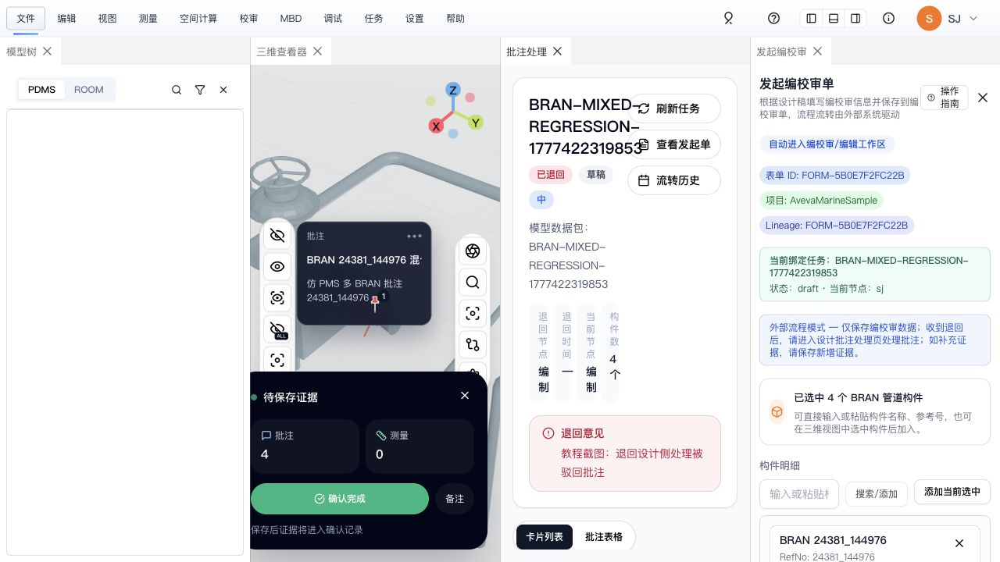
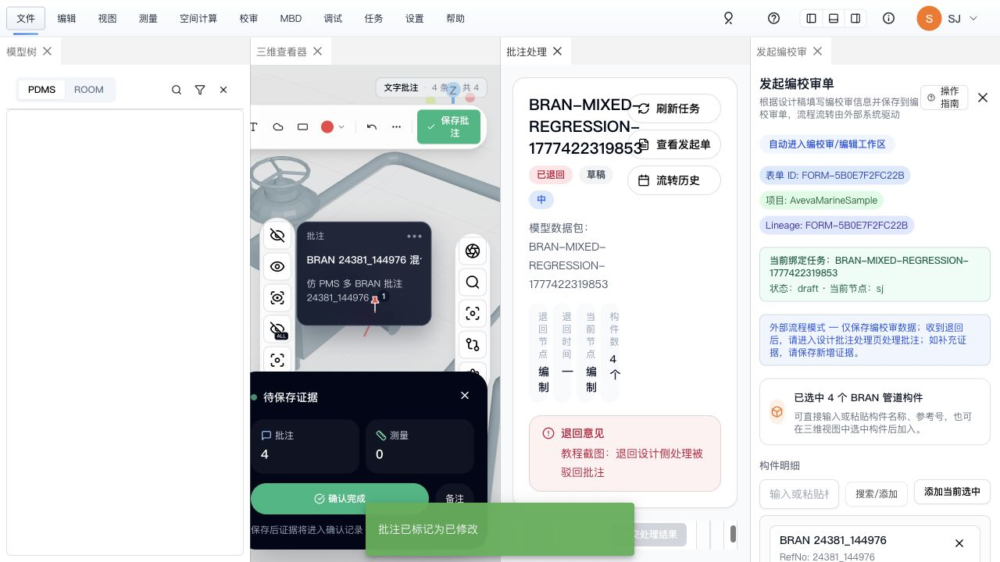
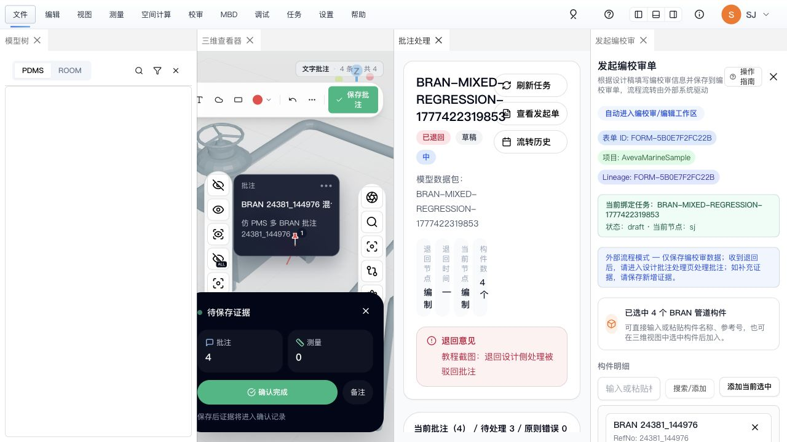
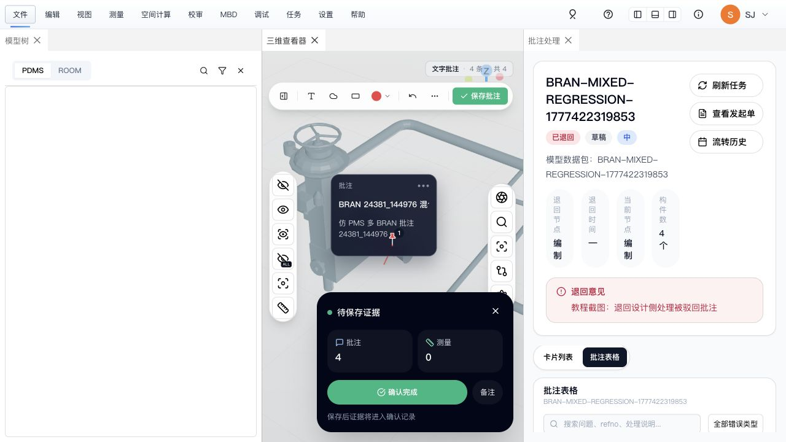

# 设计侧驳回单据处理教程

> 适用对象：设计人员（SJ）  
> 适用场景：校对 / 审核把三维校审单退回后，设计侧处理被驳回的批注。

## 结论

设计人员收到驳回单据后，不是重新填写提资单，也不是直接重新发起流程。

正确流程是：

1. 打开退回的三维校审任务。
2. 进入“批注处理”。
3. 逐条处理被退回的批注。
4. 对每条批注选择“已修改”或“不需解决”。
5. 填写处理备注并提交处理结果。
6. 如有新增截图、测量或几何证据，先保存新增证据。
7. 全部批注处理完成后，再“流转回校对”。

## 本次截图样本

| 项目 | 内容 |
| --- | --- |
| 项目 | AvevaMarineSample |
| 任务 | BRAN-MIXED-REGRESSION-1777422319853 |
| 表单 ID | FORM-5B0E7F2FC22B |
| 任务 ID | task-10f7fcc2-8710-4548-9c88-8a8e4db48c97 |
| 退回意见 | 教程截图：退回设计侧处理被驳回批注 |
| 示例批注 | BRAN 24381_144991 混合流程批注 |

## 操作步骤

### 1. 打开被退回单据

设计人员进入退回的任务后，页面会显示：

- 任务状态为“已退回”。
- 当前节点为“编制”。
- 页面中部显示退回意见。
- 右侧或主面板显示“批注处理”。



### 2. 打开需要处理的批注

在“批注处理”里找到被退回的批注，进入批注详情。

详情页用于查看：

- 批注标题和描述。
- 校对 / 审核意见。
- 历史讨论。
- 当前处理状态。
- 测量证据。


### 3. 提交单条批注处理结果

根据实际情况选择处理结果：

| 处理结果 | 含义 |
| --- | --- |
| 已修改 | 设计侧已经按意见修改，需要校对复核。 |
| 不需解决 | 设计侧判断该问题无需修改，但仍需要校对确认。 |

填写处理备注后，点击“提交处理结果”。

本次示例备注：

```text
已按退回意见检查并修改 24381_144991，等待校对复核。
```

提交后，单条批注状态变为“已修改待确认”。



### 4. 返回列表核对处理进度

返回批注列表后，可以看到：

- 当前任务共有 4 条批注。
- 其中 1 条已经处理。
- 仍有 3 条待处理。
- 已处理批注显示为“已修改”。



### 5. 使用批注表格辅助核对

“批注表格”适合快速核对全部批注的处理状态、错误类型和问题标题。

本次截图中可以看到：

- 共 4 条批注。
- 待处理 3 条。
- 已处理 1 条。
- 示例批注 `BRAN 24381_144991` 已显示“已修改”。



## 重新流转前检查

重新流转前必须确认：

- 所有被退回批注都已经处理。
- 新增的测量、截图或几何证据已经保存。
- 没有未保存的批注证据。
- 页面不再提示待保存证据。

如果还有未处理批注或未确认数据，“流转回校对”会被禁用，这是正常拦截。

## 常见问题

### 1. 驳回后是否需要重新填写提资单？

不需要。退回后的重点是处理批注，不是重填原始提资单。

### 2. “已修改”和“不需解决”有什么区别？

- “已修改”：设计侧认可问题并已经修改。
- “不需解决”：设计侧认为不需要改，但仍要给出说明，并等待校对确认。

### 3. 为什么“流转回校对”不能点击？

通常是因为仍有未处理批注、未保存证据或未确认数据。需要先处理完所有批注，再重新流转。

### 4. 批注处理结果是否会留痕？

会。处理结果、备注、评论和证据会进入批注时间线，供后续校对 / 审核查看。

## 本次验证结果

- 退回单据能在设计侧恢复。
- 退回意见能显示。
- 批注详情能打开。
- 单条批注能提交“已修改”。
- 提交后状态变为“已修改待确认”。
- 返回列表后统计变为“待处理 3 / 已处理 1”。
- 批注表格能显示已处理状态。
- 当前样本仍有 3 条待处理批注，所以不能直接流转回校对，符合预期。

## 观察到的独立问题

- 控制台存在 `pdms-tree` 模型树数据缺失错误：`e3d_world_sites.parquet` 未找到。
- 该问题影响 PDMS 模型树，不影响本次批注驳回处理流程。
