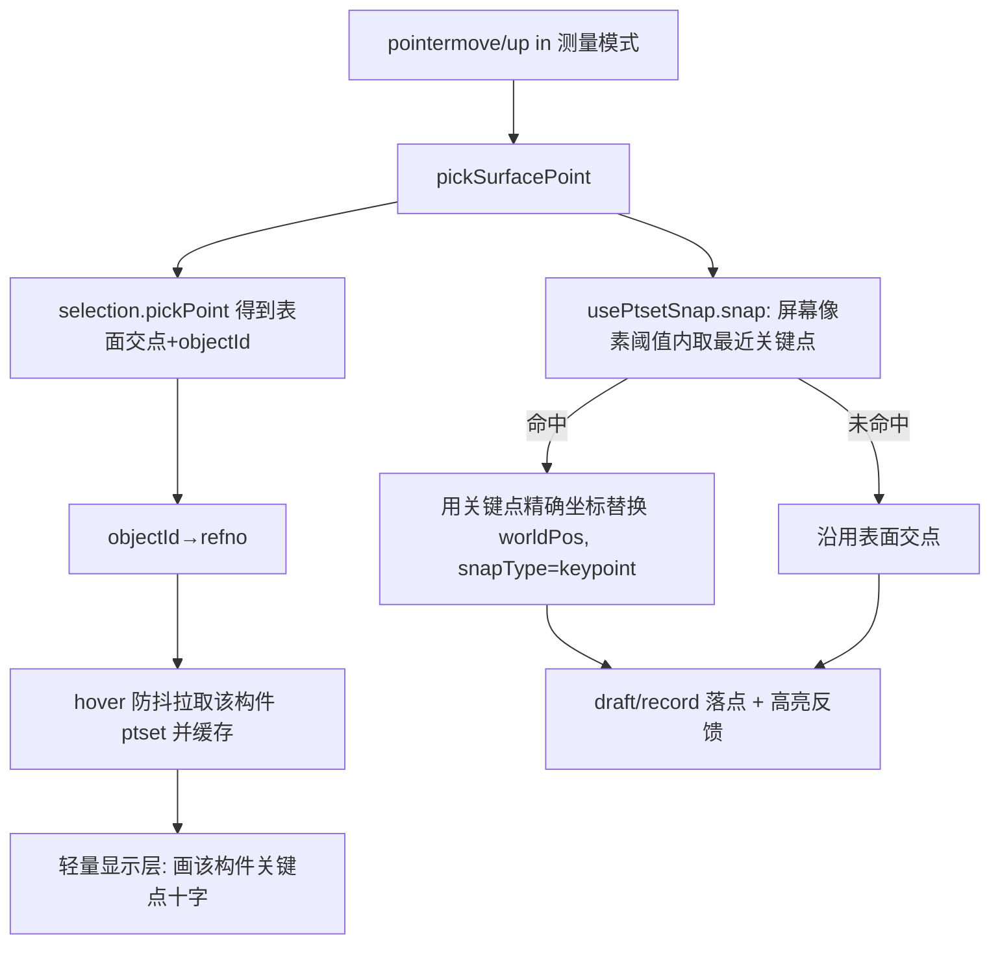

# 开发方案：测量时 hover 显示关键点(ptset) 并吸附捕捉

> 目标 slug：`ptset-hover-measure-snap`
> 所在仓库：`plant3d-web`（Vue 3 + Three.js 0.162）
> 关联后端：`plant-model-gen`（`/api/pdms/ptset/{refno}`）
> 关联既有文档：`开发文档/测量/点到面测量开发方案.md`

---

## 1. 需求概述

在“测量”过程中，用户把鼠标 hover 到某个构件上时，自动显示该构件的**关键点（ptset / P-points：管端、法兰中心、喷嘴、arrive/leave 等连接点）**；当测量光标靠近某个关键点时，落点**自动吸附**到该关键点的精确坐标，从而实现“可捕捉关键点”的精确测量（类似 CAD 的对象捕捉 OSNAP）。

适用测量模式：距离、角度、点标高、高差（`xeokit_measure_distance / angle / elevation_point / elevation_delta`）。

## 2. 现状与可复用资产（代码结论）

| 能力 | 现状 | 位置 |
|---|---|---|
| 关键点数据 | 已可按 refno 获取，含局部坐标/方向/口径/连接 | `src/api/genModelPdmsAttrApi.ts` `pdmsGetPtset(refno)` → `PtsetResponse{ ptset: PtsetPoint[] , world_transform, unit_info }` |
| 关键点三维渲染 | 已实现十字/箭头/标签，并把“局部→world_transform→globalModelMatrix”换算成**场景坐标** `worldPos` | `src/composables/usePtsetVisualizationThree.ts`（`visualObjects: Map<id,{worldPos,...}>`、`applyTransformToPoint`） |
| 测量取点管线 | 所有 hover 预览与点击落点**统一经过** `pickSurfacePoint()` | `src/composables/useXeokitMeasurementTools.ts`（`pickSurfacePoint` L278；`onCanvasPointerMove` L848；`onCanvasPointerUp` L966；`updateHoverFeedback` L442） |
| objectId→refno | 已有解析 | `ViewerPanel.vue:1620 parseRefnoFromObjectId`、`src/composables/useDbnoInstancesDtxLoader.ts:313 resolveDtxRefnoByObjectId` |
| 选择/拾取 | `selection.pickPoint(canvasPos) → {objectId, point(场景系)}` | `useXeokitMeasurementTools.pickSurfacePoint` 内调用 |
| 单位/精度 | 统一 store | `src/composables/useUnitSettingsStore.ts` |
| 后端接口 | `/api/pdms/ptset/{refno}` 已挂载并被点集面板使用 | `plant-model-gen/src/web_server/mod.rs:449` |

**关键结论**：`pickPoint` 命中坐标与 ptset 的 `worldPos` 同处**场景坐标系**（都已过 `globalModelMatrix`），吸附可直接比较，无需额外换算。数据与渲染均已存在，本目标是把三者在“测量 hover”时串起来，并在 `pickSurfacePoint` 这一**唯一咽喉**注入吸附。

## 3. 方案总览（数据流）

## 4. 分步实施（含涉及文件与验证）

### 步骤 0 —— 吸附基础设施（纯前端，无后端依赖）
- **新建** `src/composables/usePtsetSnap.ts`：
  - 维护缓存 `Map<refno, SnapCandidate[]>`，`SnapCandidate = { refno, number, worldPos:[x,y,z]场景系, pbore }`。
  - 复用 `usePtsetVisualizationThree.ts` 中的换算逻辑（`applyTransformToPoint` + `getDtxRefnoTransform` + `globalModelMatrix`）把 `PtsetResponse` 转成场景系候选点（建议把换算函数抽到 `src/utils/three/ptsetTransform.ts` 供两处共享，避免复制）。
  - 暴露：`upsertCandidates(refno, response)`、`getCandidates(refnos[])`、`snap(cursorCanvasPos, camera, canvasRect, candidates, pxThreshold): { worldPos, refno, number } | null`（把候选点 `project()` 到屏幕，取像素距离最近且 < 阈值者）。
- **验证**：新增 `src/composables/usePtsetSnap.test.ts`（vitest）：给定相机/候选点，断言阈值内吸附最近点、阈值外返回 null。运行 `npm run test -- usePtsetSnap`。

### 步骤 1 —— 测量 hover 时按需取 ptset（防抖 + 缓存）
- **改** `src/composables/useXeokitMeasurementTools.ts`：在 `onCanvasPointerMove` 拿到 `hit.objectId` 后解析 `refno`（复用 `resolveDtxRefnoByObjectId`/`parseRefnoFromObjectId`）。
- 对该 refno **防抖 ~80ms** 调 `pdmsGetPtset`，结果 `upsertCandidates` 写入 `usePtsetSnap` 缓存；同一 refno 命中缓存则不重复请求（带 in-flight 去重）。
- 依赖注入：`useXeokitMeasurementTools` 的 options 增加 `ptsetSnapRef`（由 `ViewerPanel.vue` 创建并传入），避免与现有面板用的 `usePtsetVisualizationThree` 实例耦合。
- **验证**：`npm run dev`，进入距离测量，hover 不同构件，Network 面板可见对应 refno 的 ptset 请求且**不重复**；控制台无报错。

### 步骤 2 —— 在咽喉处注入吸附（核心改动）
- **改** `pickSurfacePoint()`（`useXeokitMeasurementTools.ts` L278）：先得到表面交点，再调用 `ptsetSnap.snap(...)`；若命中关键点，则**用关键点精确场景坐标替换 `worldPos`**，并在返回结构里加 `snapType:'keypoint'`、`entityId` 形如 `ptset:<refno>#<number>`。
- 因为 `onCanvasPointerMove`(L848) 与 `onCanvasPointerUp`(L966) 都只认 `pickSurfacePoint` 的返回，**预览与最终落点自动获得吸附**，无需改其它分支。
- **验证**：`npm run test -- useXeokitMeasurementTools`（新增/扩展用例：构造一次 pickPoint 表面交点 + 邻近候选点，断言返回 worldPos 被吸附为关键点坐标、`snapType==='keypoint'`）。

### 步骤 3 —— 轻量显示层（测量态即时显示关键点）
- 在 `ViewerPanel.vue` 为测量场景实例化一个**轻量** ptset 显示（复用 `usePtsetVisualizationThree`，仅开十字、关标签/箭头，ephemeral），hover 切换构件时只显示“当前 + 少量邻域”构件的关键点；退出测量模式或 `pointercancel` 时 `clearAll`。
- **验证**：进入测量 hover 构件即出现绿色十字关键点；移开/退出后消失；大装配下不卡顿（帧率目测稳定）。

### 步骤 4 —— UI 开关与吸附反馈
- **改** `src/components/tools/MeasurementPanel.vue` + `src/composables/useXeokitMeasurementStyleStore.ts`：新增“关键点捕捉”开关与像素阈值（默认开、阈值 12px），与现有 `showMarkers` 等并列持久化。
- **改** `updateHoverFeedback`(L442) 与 `getXeokitOverlayPalette`：把 `snapped` 语义细化为“吸附到关键点”，给关键点吸附独立配色，并在 pointer-lens 显示点号/口径。
- **验证**：开关可切换捕捉行为；吸附时 hover 标记变色、lens 显示 `#号/Ø口径`；关闭开关后回到表面交点行为。

### 步骤 5 —— （可选）后端/批量预取优化 `plant-model-gen`
- 若实测 hover 请求过密：优先复用已有 `POST /api/pdms/ptset/batch-query`（`pdmsBatchGetPtsetWithContext`）对“选中构件邻域/BRAN 兄弟”一次性预取；或在 `web_server/mod.rs`（参考 L449 路由装配处）新增“按视口 AABB 返回邻近构件关键点”的接口。
- **验证**：批量预取后，连续 hover 不再每个构件单独请求；后端响应形状与 `PtsetBatchQueryResponse` 一致。

## 5. 坐标系与对齐（务必遵守）
- 候选点换算链必须与 `usePtsetVisualizationThree` **完全一致**：`PtsetPoint.pt(局部) → applyTransformToPoint(world_transform) → applyMatrix4(globalModelMatrix) → 场景坐标`。否则吸附点与显示十字会错位。
- `pickPoint` 的交点已是场景系；吸附在场景系直接比较，或统一投影到屏幕像素比较（推荐后者，阈值与缩放无关、体验稳定）。

## 6. 性能与缓存
- 缓存按 refno；hover 防抖 ~80ms；in-flight 去重。
- 候选集只取“当前 + 邻近少量构件”，不做全场景。
- `pickSurfacePoint` 必须**同步**返回，吸附只用“已缓存”的候选；异步拉取仅填充缓存（首次 hover 某构件可能“先显示后可吸附”，符合预期）。
- 退出测量模式即清显示层与（可选）候选缓存。

## 7. 风险与对策
| 风险 | 对策 |
|---|---|
| 换算链不一致导致吸附错位 | 抽公共换算函数 `ptsetTransform.ts`，两处共用并加单测 |
| hover 请求过密 | 防抖 + 缓存 + 去重；必要时启用步骤 5 批量预取 |
| 大装配关键点过多影响帧率 | 仅显示当前/邻域构件；显示层 ephemeral；阈值内才高亮 |
| 同步取点 vs 异步数据 | 吸附只用已缓存候选，明确“先显示后吸附”的预期 |
| 与既有点集面板实例冲突 | 测量用独立轻量实例，互不影响 |

## 8. 验证与验收（Done 条件）
1. 进入距离/角度/标高测量并 hover 管件，立即显示其端点/中心关键点十字。
2. 光标靠近关键点（< 阈值）时，hover 标记变色、lens 显示点号/口径，落点吸附到关键点精确坐标。
3. 点击落点坐标与 ptset 面板对应点坐标一致（同单位下数值吻合）。
4. “关键点捕捉”开关可开关；关闭后回到表面交点行为。
5. 单测通过：`usePtsetSnap`、`useXeokitMeasurementTools`（吸附用例）。
6. 大装配（数千构件）hover 流畅、无重复请求、退出后显示清除。

## 9. 工作量与里程碑
- 步骤 0–2（基础设施 + 取数 + 咽喉吸附）：约 1.5–2 人天 —— **可形成最小可用闭环**。
- 步骤 3–4（显示层 + UI/反馈）：约 1–1.5 人天。
- 步骤 5（可选后端预取）：约 1–2 人天。
- 合计纯前端 **约 2.5–4 人天**。

## 10. 范围边界（本目标不做）
- 不重构现有测量/点集面板的既有交互与渲染框架。
- 不新增除“关键点捕捉”外的捕捉类型（如边中点、栅格捕捉）——可作为后续目标。
- 步骤 5 之外不改后端数据生成与存储（关键点数据已可用）。
