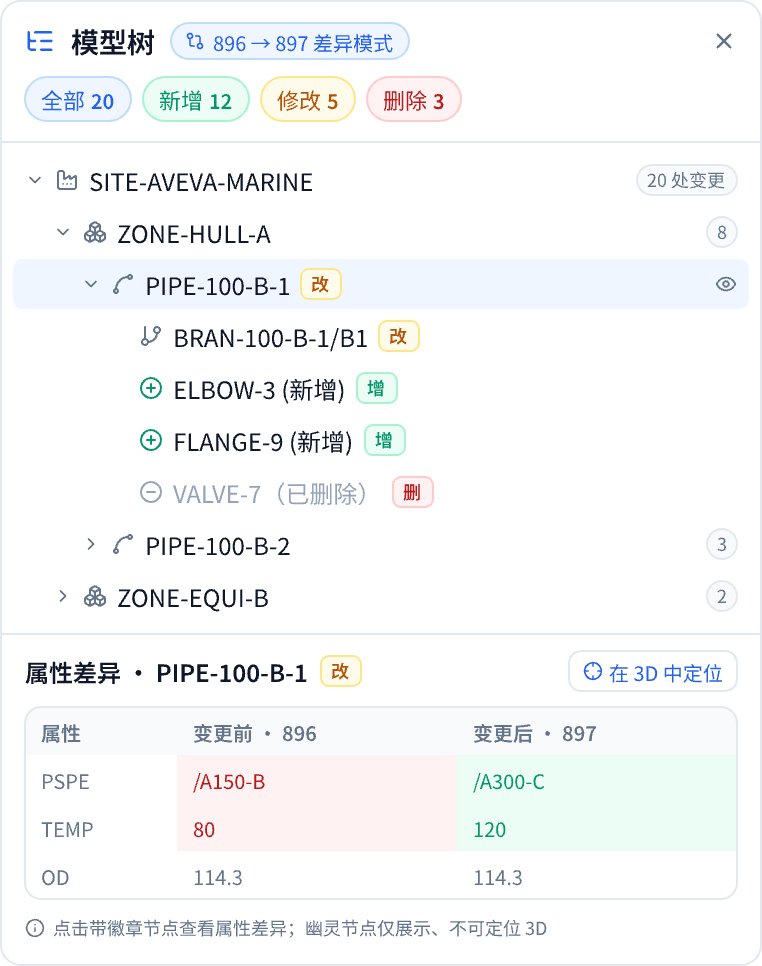
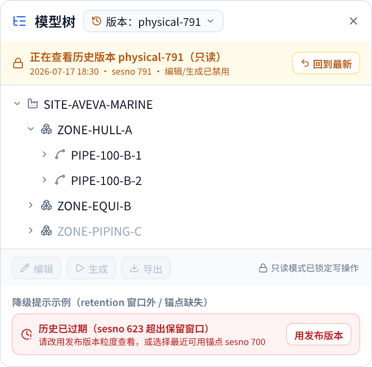
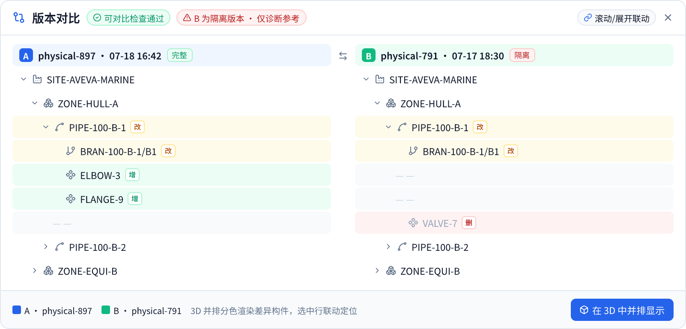
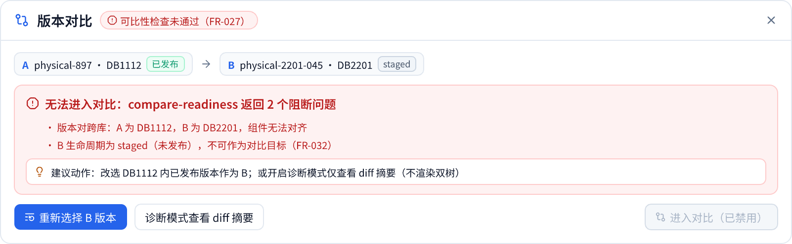
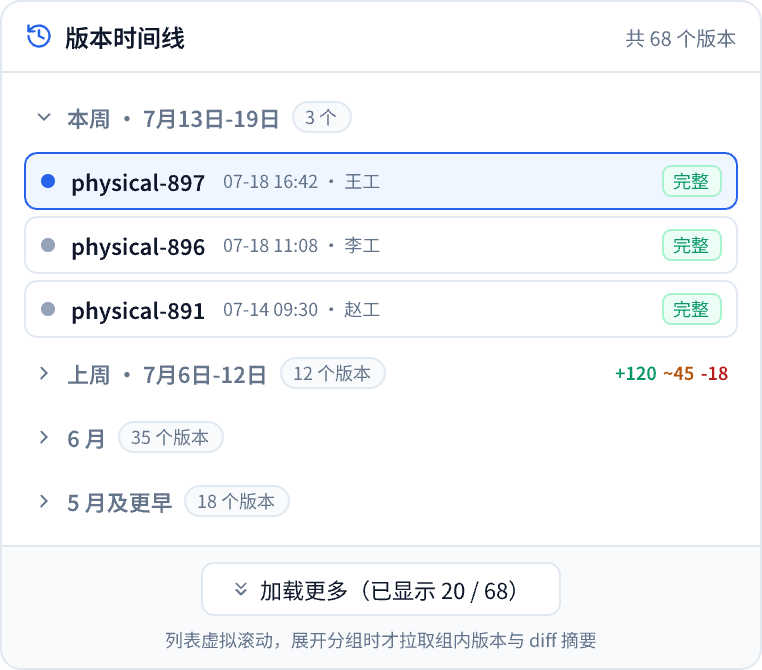

# 界面原型：模型版本时间线与历史模型树

- 对应 spec：`../spec.md`（FR-001 ~ FR-035）
- Pencil 源文件：当前保存在本机 Pencil 工作区文档中（打开 Cursor 的 Pencil 面板即可继续编辑，含本页全部 10 个 frame，文档名 model-version-timeline）；当前版本 Pencil 扩展不落盘明文 .pen，仓库内以本目录导出 PNG 为准
- 导出图（本目录，2x PNG）：见下方索引

## 原型索引

### 1. 版本时间线面板（US1）

顶部：项目 / DB / 分支三个筛选下拉（FR-006），「仅发布版本｜含会话锚点」粒度分段（FR-007）。主体：按天分组的垂直时间轴（FR-002），版本卡片含版本标签、时间 · sesno · 操作人 · label（FR-003）、生命周期 + 质量态双徽章（FR-004）、`+12 ~5 -3` 差异摘要（FR-005）；选中卡片展开「查看此版本树 / 设为 A / 设为 B / 3D 加载」操作（FR-009/021/024）；会话锚点以细刻度小节点穿插（FR-007）；隔离版本卡片附红色警示行（FR-031）；未发布版本卡片不提供快照/对比操作（FR-032）。底部：A/B 钉选栏 + 进入对比（FR-024）。

### 2. 时间线三态：空 / 加载中 / 失败（US1）

空态说明 + 刷新、骨架屏 + 加载提示、失败原因 + 重试按钮（FR-008/033）。

### 3. 模型树差异标注（US2）

树头部「896 → 897 差异模式」chip 与退出按钮（FR-009）；「全部 20 / 新增 12 / 修改 5 / 删除 3」筛选 chips（FR-011）；节点行增（绿）/ 改（琥珀）徽章、删除节点幽灵态（灰色删除线，仅展示不可定位，FR-010）；祖先节点显示变更计数；底部属性差异表：变更前（红）/ 变更后（绿）并排、未变属性无底色（FR-012），附「在 3D 中定位」。

### 4. 历史快照只读模式（US3）

面板头部版本下拉（默认「最新」，FR-015）；琥珀色持续可见只读横幅：版本标识 + 时间 + 「回到最新」（FR-016）；底部编辑 / 生成 / 导出按钮禁用态 + 「只读模式已锁定写操作」提示（FR-016/035）；下方为降级提示示例卡：「历史已过期（retention 窗口外）→ 用发布版本」与「锚点缺失 → 回退最近可用锚点 sesno 700」（FR-019/020）。

### 5. 双版本并排对比（US4）

头部：「可对比检查通过」徽章与「B 为隔离版本 · 仅诊断参考」红色警示（FR-027/031）、「滚动/展开联动」chip（FR-026）。双树按 refno 对齐，仅一侧存在的元素在另一侧留 `— —` 对位占位（FR-025）；行级高亮：新增绿 / 删除红 / 修改琥珀（FR-028）。底部 3D 条：A 蓝（#2563EB）/ B 绿（#10B981）图例（沿用现有 from/to 约定）+「在 3D 中并排显示」（FR-023）。

### 6. 3D 视口时间刻度条（US5）

视口底部可展开 scrubber：播放/暂停按钮、每版本一个刻度点、当前刻度放大高亮、hover tooltip（版本标签 + 时间 + 质量态）、进度 5/12、倍速 1x、「预加载下一版本…」等待态（FR-029/030）。

### 7. 刻度条·隔离版本警示（US5 补充）

隔离版本刻度点为红色（描边强调），hover 出红色警示 tooltip（版本 + 「仅供诊断查看，不建议作为演示基准」）；底部图例：完整绿 / 降级琥珀 / 隔离红 / 未发布灰；播放默认跳过隔离与未发布版本（FR-030/031/032）。

### 8. 锚点节点·点击菜单（US1/US3 补充）

点击时间线上的锚点节点弹出操作菜单：查看此时刻模型树快照（注明先解析锚点，FR-018）、查看选中元素属性快照、设为对比 A / B、复制 sesno；菜单底注「仅 versioned 站点可用；历史过期将提示降级」（FR-007/019/020）。

### 9. 对比·readiness 阻断态（US4 补充）

compare-readiness 未通过时的阻断视图：红色徽章 + 阻断卡片列出后端 problems（跨库、B 未发布 FR-032）、recommended_action 建议行、「重新选择 B / 诊断模式看 diff 摘要」两个可执行动作，「进入对比」按钮禁用（FR-027/033）。

### 10. 时间线·大量版本折叠态（US1 补充）

版本数多（68 个）时的形态：本周展开为紧凑行，上周/6 月/更早折叠为分组头（含数量徽章与聚合 diff `+120 ~45 -18`），底部「加载更多（已显示 20 / 68）」；分组展开时才拉取组内版本与 diff 摘要（SC-002 懒加载）。

## FR 覆盖核对表

| FR | 内容摘要 | 覆盖 frame | 备注 |
|---|---|---|---|
| FR-001 | 时间线面板可停靠开关 | 时间线面板 | 面板形态按 380px 停靠宽度绘制 |
| FR-002 | 按时间倒序、按天分组 | 时间线面板 | 今天/昨天分组 |
| FR-003 | 版本标签/时间/dbnum | 时间线面板 | 卡片 meta 行 |
| FR-004 | 生命周期+质量态双徽章 | 时间线面板 | 四种组合示例（发布+完整/发布+降级/发布+隔离/未发布+完整） |
| FR-005 | 懒加载差异摘要 | 时间线面板 | `+12 ~5 -3 较上一版` |
| FR-006 | 项目/dbnum/分支筛选 | 时间线面板 | 头部三下拉 |
| FR-007 | 发布/含锚点粒度切换 | 时间线面板 + 锚点菜单 | 分段控件 + 锚点小节点 + 点击操作菜单 |
| FR-008 | 空/加载/失败三态 | 时间线三态 | — |
| FR-009 | 选定版本对应用差异 | 时间线面板 + 树差异 | 设为A/B → 差异模式 chip |
| FR-010 | 增/改徽章、删除幽灵节点 | 树差异 | — |
| FR-011 | 差异类别筛选 | 树差异 | chips 含计数；祖先保留为交互逻辑 |
| FR-012 | 属性级 before/after | 树差异 | 底部并排表格 |
| FR-013 | 不破坏树既有功能 | 非视觉 · 不适用 | 交互约束 |
| FR-014 | 大差异集性能 | 非视觉 · 不适用 | 性能约束 |
| FR-015 | 树切换到历史快照 | 历史快照 | 版本下拉 |
| FR-016 | 只读横幅+禁用写操作 | 历史快照 | 横幅 + 工具条禁用态 |
| FR-017 | 快照缓存 | 非视觉 · 不适用 | — |
| FR-018 | 锚点唯一入口 | 非视觉 · 不适用 | 数据访问约束 |
| FR-019 | 历史过期降级提示 | 历史快照 | 红色降级卡 |
| FR-020 | 锚点缺失回退 | 历史快照 | 降级卡含「最近可用锚点 sesno 700」 |
| FR-021 | 时间线触发 3D 加载 | 时间线面板 + 刻度条 | 「3D 加载」按钮 / 视口 chip |
| FR-022 | 三方版本/选中同步 | 刻度条 + 对比 | 静态图以联动 chip 示意，属交互逻辑 |
| FR-023 | 3D 并排/分色渲染 | 对比 | A 蓝 / B 绿图例 |
| FR-024 | A/B 钉选+进入对比 | 时间线面板 + 对比 | Pin 徽标 + 底部对比栏 |
| FR-025 | 元素对齐+对位占位 | 对比 | `— —` 占位行 |
| FR-026 | 滚动/展开联动 | 对比 | 联动 chip 示意 |
| FR-027 | 可比性检查+质量警示 | 对比 + readiness 阻断态 | 通过/阻断两种形态齐备 |
| FR-028 | 差异行分色 | 对比 | 绿/红/琥珀 |
| FR-029 | 刻度条切换版本 | 刻度条 | — |
| FR-030 | 自动播放/暂停/等待 | 刻度条 | 播放钮 + 预加载提示 |
| FR-031 | 隔离版本全入口警示 | 时间线面板 + 对比 + 刻度条隔离警示 | 三入口全覆盖 |
| FR-032 | 未发布不得作为目标 | 时间线面板 + readiness 阻断态 | staged 无操作按钮 + 阻断原因行 |
| FR-033 | 失败提示+重试 | 时间线三态 | — |
| FR-034 | 请求可取消/防竞态 | 非视觉 · 不适用 | — |
| FR-035 | 纯只读不改数据 | 非视觉 · 不适用 | 快照锁定提示间接体现 |

## 已知缺口（2026-07-19 已全部补画）

1. ~~FR-031 刻度条上的隔离警示~~ → 已补：frame「刻度条·隔离版本警示」（scrubber-quarantine.png）。
2. ~~FR-007 锚点粒度的展开形态~~ → 已补：frame「锚点节点·点击菜单」（anchor-menu.png）。
3. ~~FR-027 readiness 不通过的状态变体~~ → 已补：frame「对比·readiness 阻断态」（compare-readiness-blocked.png）。
4. ~~US1 大量版本折叠/分页形态~~ → 已补：frame「时间线·大量版本折叠态」（timeline-collapsed.png）。

另附可实现性分析（哪些功能后端已就绪、哪些有前置条件）：`../research/feature-feasibility-2026-07-19.md`。

## 2026-07-19 复审改进记录

对照原型全量复审后落实的 4 项改进（截图已同步重导出）：

1. **A/B 颜色语义统一**：此前时间线 Pin B 为蓝、对比列头 Pin B 为灰、3D 图例 B 为绿，三处不一致；现统一为 **A=蓝（#2563EB）/ B=绿（#10B981）**，与 ViewerPanel 既有 from 蓝 / to 绿约定对齐（时间线钉选栏、卡片 Pin 徽标、对比列头全部改绿）。
2. **刻度条按质量态着色**：主刻度条的版本刻度点由统一灰色改为按质量态着色（完整绿 / 降级琥珀 / 隔离红 / 未发布灰），并补图例行，与「隔离警示」frame 的语义一致（FR-029/031）。
3. **未发布版本置灰示意**：时间线 physical-790（staged）卡片补「未发布：快照/对比不可用，需诊断模式」灰色提示行，FR-032 在主面板即有可视表达。
4. **画布重排**：10 个 frame 按 US1（常态/三态/折叠）→ US2/US3 → US4（可比/阻断）→ US5（常态/隔离）四行分区排列，每行加深色分区标签，阅读顺序与 spec 用户故事一致。

## 设计变量（与现有面板一致）

`Noto Sans SC`；primary #2563EB；green #059669 / bg #ECFDF5；amber #B45309 / bg #FFFBEB；red #B91C1C / bg #FEF2F2；border #E2E8F0；text #0F172A / #64748B。差异语义：新增=绿、修改=琥珀、删除=红；3D 对比沿用 from 蓝 / to 绿。
