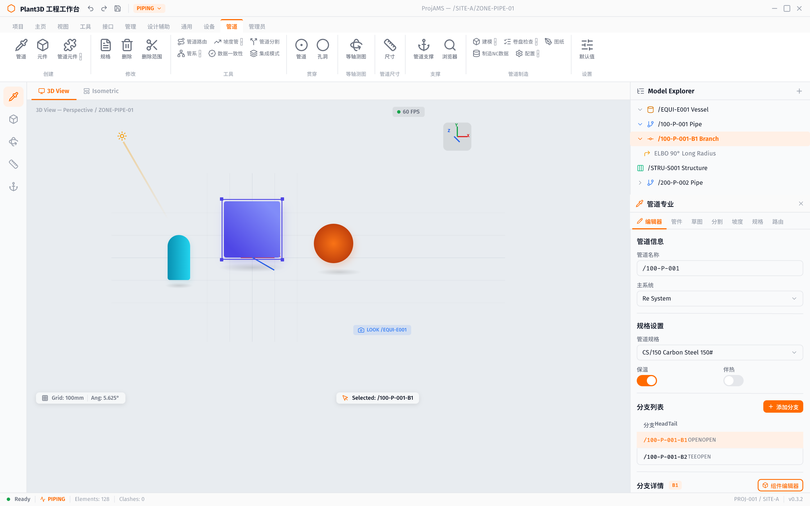
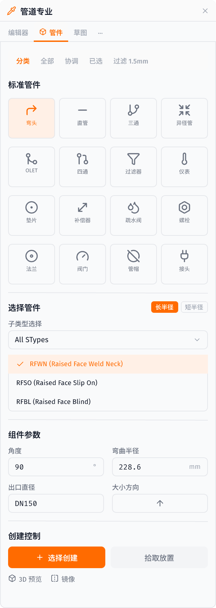
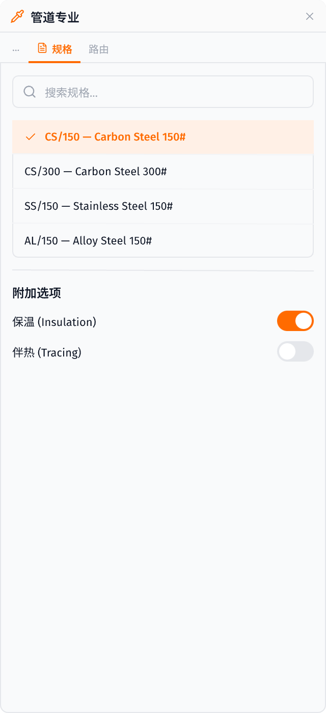
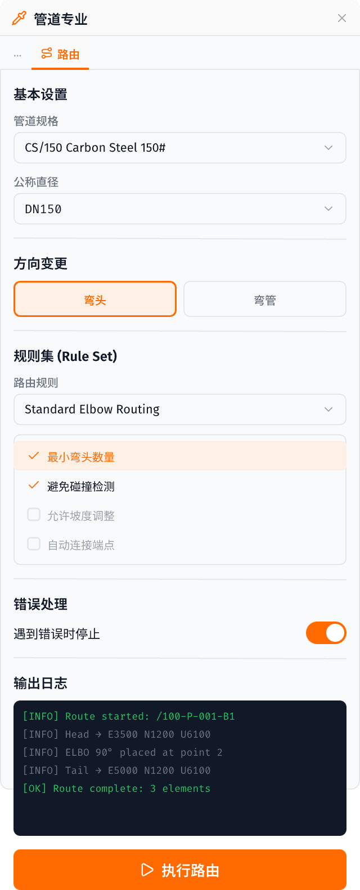
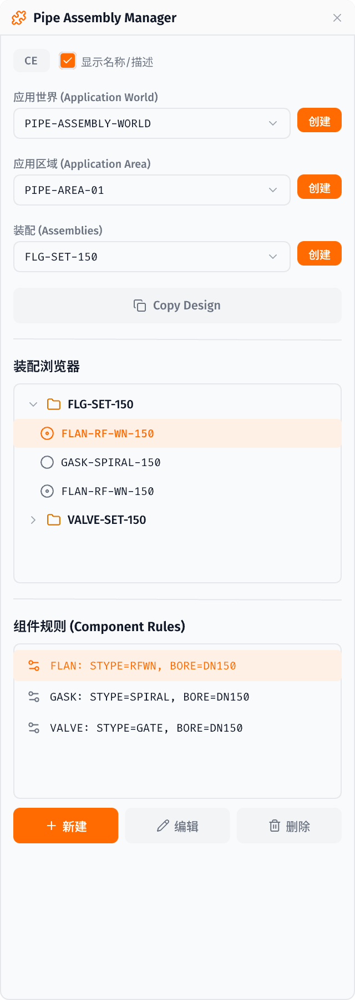
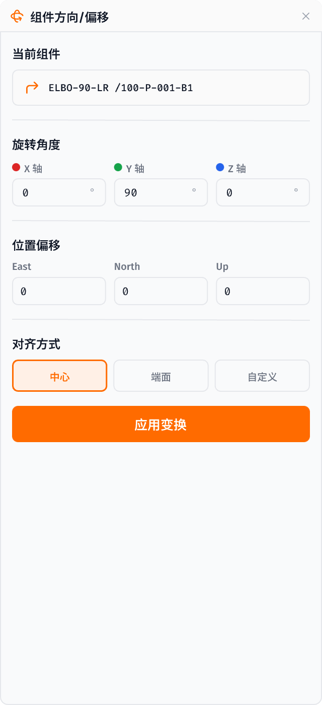
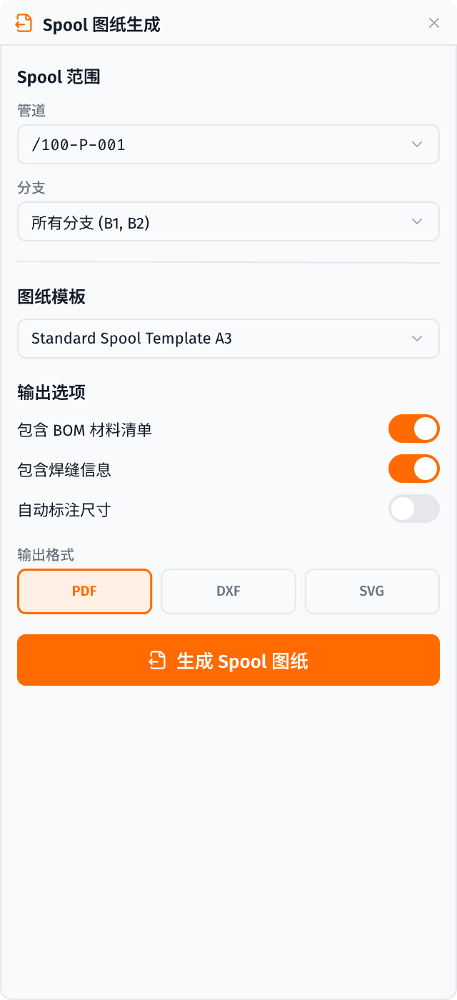
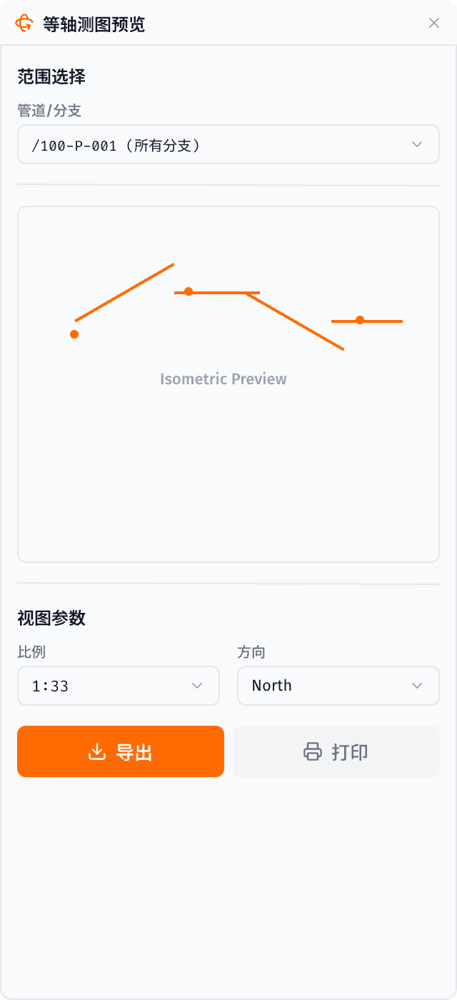
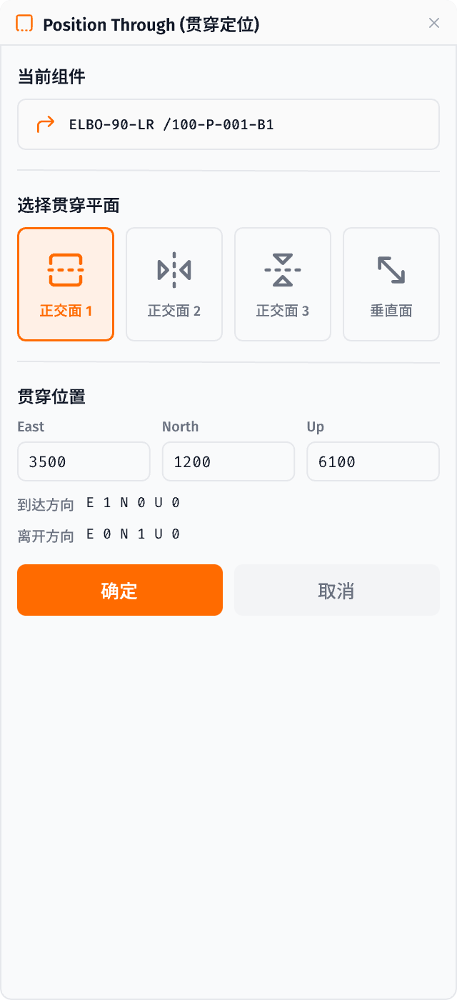
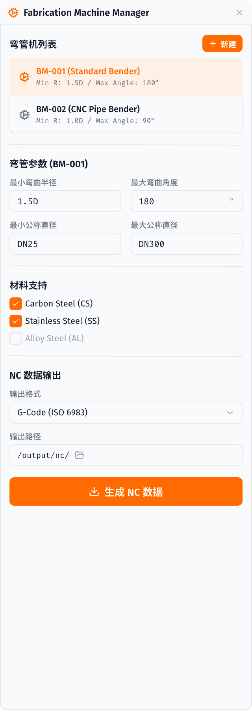

# 管道建模模块 — UI 设计与功能分析汇总

> 基于 AVEVA E3D Design 源码分析 (`D:\reverse\e3d`) 与 Plant3D Editor UI 设计
> 最后更新: 2026-03-16

---

## 1. 已完成的 UI 面板设计（共 18 个）

### 1.1 主界面整合 (`pencil-new.pen`)



**包含：**
- 标题栏（快捷操作 + PIPING 模块选择器）
- PIPING Ribbon（11 个模块标签 + 9 个工具组）
- 左侧栏（5 个模块图标）
- 3D 视口（网格、XYZ 轴、3D 对象、选择框、FPS、Gizmo、阴影、光照、摄像机标签）
- 右侧面板：Model Explorer（6 个层级项） + Application Dock（7 个面板标签）
- 状态栏

---

### 1.2 管道编辑器 (Pipe Editor)

**E3D 源文件**: `PMLLIB/design/forms/pipeEditor.pmlfrm` (8645 行)

**对应设计**: 主界面 Application Dock 中「编辑器」Tab（激活状态）

**功能覆盖：**

| 功能 | E3D 方法 | 设计状态 |
|------|----------|----------|
| 管道创建 | `createPipe()` | ✅ 管道名称 + 主系统选择 |
| 分支创建 | `createBranch()` | ✅ 分支列表 + 添加分支按钮 |
| 规格设置 | `setUpSpecifications()` | ✅ 管道规格选择器 |
| 保温/伴热 | `listInsuSpecs()` / `listTracSpecs()` | ✅ 保温/伴热开关 |
| Head/Tail 连接 | `connectHead()` / `alignHeadTailTabs()` | ✅ Head/Tail 标签页 + **拾取位置/输入名称按钮** |
| 连接详情 | `connectionData()` / `connectionName()` | ✅ 连接类型 + 坐标 + 公称直径 + **方向 + 偏移控制** |
| 断开连接 | `disconnect()` | ✅ 断开连接按钮（红色） |
| 工艺参数 | `collectSlopes()` / `collectFluids()` | ✅ 设计温度 + 设计压力 |
| 分支删除 | `deleteBranch()` | ✅ 分支列表中有操作 |
| 公称直径 | `endBore()` / `loadBores()` | ✅ 公称直径字段 |

---

### 1.3 管件编辑器 (Component Editor)



**E3D 源文件**: `PMLLIB/design/forms/componentEditor.pmlfrm` + `componentcreation.pmlfrm` + `componentselection.pmlfrm`

**功能覆盖：**

| 功能 | 设计状态 |
|------|----------|
| 管件分类导航（分类/全部/协调/已选/过滤） | ✅ |
| 标准管件网格 4×4 | ✅ **16 种**: 弯头/直管/三通/异径管/法兰/阀门/管帽/接头/OLET/四通/过滤器/仪表/垫片/补偿器/疏水阀/螺栓 |
| 子类型选择（长半径/短半径标签 + SType 列表） | ✅ RFWN/RFSO/RFBL |
| 组件参数（角度/弯曲半径/出口直径/方向） | ✅ |
| 创建控制（选择创建/拾取放置 + 3D 预览/镜像选项） | ✅ |

---

### 1.4 管道草图 (Pipe Sketching / 2D Easy Editor)


**E3D 源文件**: `PMLLIB/design/forms/pipeeasyeditor.pmlfrm` (2660 行) + `PMLLIB/design/objects/pipeeasyeditor.pmlobj` (2610 行)

**功能覆盖：**

| 功能 | E3D 方法 | 设计状态 |
|------|----------|----------|
| 路径点工具栏 | `pickStart()` / `insertAidPoint()` / `deleteAidLine()` | ✅ **8 个工具按钮**（含膨胀环/复制/镜像） |
| 路径点列表 | `selectPointList()` / `pointList` | ✅ East/North/Up 坐标表格 |
| 坐标输入 | `posControl` / `derivePosition()` | ✅ E/N/U 输入框 |
| 法兰组插入 | `insertFittingSet('FLG_SET')` | ✅ 法兰组按钮 |
| 阀组插入 | `insertFittingSet('VALVE_SET')` | ✅ 阀组按钮 |
| 正交/偏移模式 | `tglOrthogonal` / `optOffset` | ✅ **正交/偏移开关** |
| Quick Pipe Router | `tglQuickPipeRouter` | ✅ **Quick Router 开关** |
| Use Bends | `dirchange` | ✅ **Use Bends 开关** |
| 镜像选择 | `mirror()` / `mirrorSelection()` | ✅ 工具栏镜像按钮 |
| 扩展环插入 | `insertExpansion()` | ✅ 工具栏膨胀环按钮 |
| 复制选择 | `btnCopySelection` | ✅ 工具栏复制按钮 |

---

### 1.5 管道分割 (Pipe Splitting)


**E3D 源文件**: `PMLLIB/design/forms/pipesplitting.pmlfrm`

| 功能 | 设计状态 |
|------|----------|
| 分割/合并/平面分割模式切换 | ✅ |
| 元素拾取列表（元素名/类型） | ✅ |
| 拾取元素按钮 | ✅ |
| 分割选项（保留原始元素） | ✅ |

---

### 1.6 管道坡度 (Pipe Slope)


**E3D 源文件**: `PMLLIB/design/forms/pipeSlopeForm.pmlfrm`

| 功能 | 设计状态 |
|------|----------|
| 坡度参数（值/方向） | ✅ |
| 分支腿列表（含状态标签） | ✅ 已设(绿)/未设(灰) |

---

### 1.7 规格选择器 (Spec Selector)



**E3D 源文件**: `PMLLIB/design/forms/spcspecselect.pmlfrm`

| 功能 | 设计状态 |
|------|----------|
| 规格搜索 | ✅ |
| 规格列表（CS/150, CS/300, SS/150, AL/150） | ✅ |
| 保温/伴热开关 | ✅ |

---

### 1.8 管道路由器 (Pipe Router)



**E3D 源文件**: `PMLLIB/design/objects/pipesimpleeditor.pmlobj` — `autoRoute()` / `drawBranch()`

| 功能 | 设计状态 |
|------|----------|
| 基本设置（规格/公称直径） | ✅ |
| 方向变更 Radio（弯头/弯管） | ✅ |
| 规则集选择 + 4 条规则 | ✅ 最小弯头/碰撞检测/坡度调整/自动连接 |
| 错误处理（遇错停止开关） | ✅ |
| 输出日志（终端风格） | ✅ 黑色背景 + 绿色/灰色日志 |
| 执行路由按钮 | ✅ |

---

### 1.9 管道装配管理器 (Pipe Assembly Manager)



**E3D 源文件**: `PMLLIB/design/forms/pipeassemblymgr.pmlfrm` (1410行)

| 功能 | 设计状态 |
|------|----------|
| CE 当前元素 + 名称/描述切换 | ✅ |
| 应用世界/区域/装配三级选择器（各带创建按钮） | ✅ |
| Copy Design | ✅ |
| 装配浏览器树（FLG-SET/VALVE-SET） | ✅ |
| 组件规则列表 + 新建/编辑/删除 | ✅ |

---

### 1.10 管道 Tapping (非标分支连接)


**E3D 源文件**: `PMLLIB/design/forms/pipetappings.pmlfrm` + `pipestubin.pmlfrm`

| 功能 | 设计状态 |
|------|----------|
| 主管选择（拾取按钮 + 名称显示） | ✅ |
| 支管选择（拾取按钮 + 名称显示） | ✅ |
| 连接参数（插入深度/连接端/Tee类型/支管直径） | ✅ |
| 交叉点拾取 + 连接状态指示 | ✅ |
| 连接分支按钮 | ✅ |

---

### 1.11 数据一致性检查 (Data Consistency Check)


**功能覆盖：**

| 功能 | 设计状态 |
|------|----------|
| 检查范围（当前管道/当前区域/全部） | ✅ |
| 检查项开关（规格匹配/连接状态/坡度设置/公称直径一致性） | ✅ |
| 执行检查按钮 | ✅ |
| 结果列表（绿色通过卡片 + 黄色警告卡片） | ✅ |
| 结果统计标签（3 通过 / 1 警告） | ✅ |

---

### 1.12 组件方向/偏移编辑器 (Component Orientation/Offset)



**E3D 源文件**: `PMLLIB/design/forms/componentorioff.pmlfrm`

| 功能 | 设计状态 |
|------|----------|
| 当前组件信息显示 | ✅ |
| XYZ 三轴旋转角度（红/绿/蓝色标识） | ✅ |
| East/North/Up 位置偏移 | ✅ |
| 对齐方式（中心/端面/自定义） | ✅ |
| 应用变换按钮 | ✅ |

---

### 1.13 Spool 图纸生成 (Pipe Spool Drawing)



**E3D 源文件**: `PMLLIB/design/forms/pipespooldwg.pmlfrm`

| 功能 | 设计状态 |
|------|----------|
| Spool 范围（管道/分支选择） | ✅ |
| 图纸模板选择 | ✅ |
| 输出选项（BOM 清单/焊缝信息/自动标注） | ✅ |
| 输出格式（PDF/DXF/SVG） | ✅ |
| 生成 Spool 图纸按钮 | ✅ |

---

### 1.14 等轴测图预览 (Isometric Preview)



**E3D 源文件**: `PMLLIB/design/forms/isdpreviewiso.pmlfrm`

| 功能 | 设计状态 |
|------|----------|
| 范围选择（管道/分支） | ✅ |
| Isometric 预览区（管道线段示意） | ✅ |
| 视图参数（比例/方向） | ✅ |
| 导出 + 打印按钮 | ✅ |

---

### 1.15 组件贯穿定位 (Position Through Plane)



**E3D 源文件**: `PMLLIB/design/forms/componentThroughPlane.pmlfrm`

| 功能 | 设计状态 |
|------|----------|
| 当前组件信息 | ✅ |
| 4种贯穿平面选择（正交面1/2/3 + 垂直面） | ✅ 图标卡片式选择 |
| 贯穿位置 E/N/U 坐标 | ✅ |
| 到达方向 / 离开方向 | ✅ |
| 确定/取消按钮 | ✅ |

---

### 1.16 制造弯管机管理器 (Fabrication Machine Manager)



**E3D 源文件**: `PMLLIB/design/forms/fabmachinemgr.pmlfrm` + `fabmachinecrt.pmlfrm` + `fabmachinedat.pmlfrm` + `fabmachinencs.pmlfrm`

| 功能 | 设计状态 |
|------|----------|
| 弯管机列表 + 新建按钮 | ✅ BM-001/BM-002 |
| 弯管参数（最小弯曲半径/最大角度/公称直径范围） | ✅ |
| 材料支持（CS/SS/AL 勾选列表） | ✅ |
| NC 数据输出（格式选择 + 输出路径） | ✅ G-Code ISO 6983 |
| 生成 NC 数据按钮 | ✅ |

---

### 1.17 管道支撑设计 (Pipe Support Design)


**对应 Ribbon 按钮**: 支撑组 → “管道支撑”

| 功能 | 设计状态 |
|------|----------|
| 4种支撑类型（底部/悬挂/导向/固定，图标卡片式） | ✅ |
| 管道拾取选择 | ✅ |
| 支撑参数（标高/间距/材料） | ✅ |
| 放置支撑按钮 | ✅ |

---

### 1.18 管道尺寸标注 (Dimension Annotation)


**对应 Ribbon 按钮**: 管道尺寸组 → “尺寸”

| 功能 | 设计状态 |
|------|----------|
| 4种标注模式（线性/角度/标高/坐标） | ✅ |
| 双点拾取 + 坐标显示 | ✅ |
| 标注结果大字显示 (1500 mm) | ✅ |
| 标注选项（文本/引线开关） | ✅ |

---

### 1.19 管道贯穿 / 孔洞 (Pipe Penetration)


**对应 Ribbon 按钮**: 贯穿组 → “管道” / “孔洞”

| 功能 | 设计状态 |
|------|----------|
| 管道贯穿/孔洞创建两种模式 | ✅ |
| 管道拾取 | ✅ |
| 贯穿目标拾取（墙/楼板） | ✅ |
| 孔洞参数（形状/直径/间隙余量） | ✅ |
| 创建贯穿孔洞按钮 | ✅ |

---

## 2. 尚未设计的 UI 面板

**无** — 所有 E3D 管道建模相关表单 + Ribbon 工具按钮功能已全部覆盖设计。

---

## 3. 设计文件清单

### 3.1 独立面板文件 (`D:\work\plant-code\plant3d-web\ui\管道建模\`)

| # | 文件 | 大小 | 状态 |
|---|------|------|------|
| 1 | `pipe-editor-panel.pen` | 72KB | ✅ 完成 |
| 2 | `component-editor-panel.pen` | 71KB | ✅ 完成 |
| 3 | `pipe-sketching-panel.pen` | 47KB | ✅ 完成 |
| 4 | `pipe-splitting-panel.pen` | 26KB | ✅ 完成 |
| 5 | `pipe-slope-panel.pen` | 29KB | ✅ 完成 |
| 6 | `pipe-spec-panel.pen` | 19KB | ✅ 完成 |
| 7 | `pipe-router-panel.pen` | 21KB | ✅ 完成 |

### 3.2 整合文件 (`D:\work\plant-code\plant3d-editor\ui\`)

| 文件 | 描述 | 状态 |
|------|------|------|
| `pencil-new.pen` | 主界面整合版 + 18 个面板变体（含 3D 视口） | ✅ 完成 |
| `main.pen` | 原始主界面（Light/Dark 双主题 PIPING Ribbon） | ✅ 完成 |

### 3.3 截图文件 (`screenshots/`)

| 文件 | 内容 |
|------|------|
| `bi8Au.png` | 完整主界面（编辑器 Tab 激活） |
| `2E9tl.png` | 管件编辑器 Tab（16 种管件） |
| `lEK7A.png` | 管道草图 Tab（8 工具 + 4 开关） |
| `ytarD.png` | 规格选择器 Tab |
| `6P64W.png` | 管道路由器 Tab（规则集 + 日志） |
| `lIYhO.png` | 管道分割 Tab |
| `VArTR.png` | 管道坡度 Tab |
| `2Xury.png` | 装配管理器 |
| `dfqb9.png` | 管道 Tapping |
| `B1IJl.png` | 数据一致性检查 |
| `dg6YX.png` | 组件方向/偏移 |
| `K1ova.png` | Spool 图纸生成 |
| `wG3gX.png` | 等轴测图预览 |
| `4IR9t.png` | 组件贯穿定位 |
| `lpG4P.png` | 制造弯管机管理器 |
| `xeS7H.png` | 管道支撑设计 |
| `yd1Wy.png` | 管道尺寸标注 |
| `nMuvt.png` | 管道贯穿/孔洞 |

### 3.4 文档文件

| 文件 | 描述 |
|------|------|
| `piping-modeling-summary.md` | 本文件 — UI 设计与功能分析汇总 |
| `piping-workflow.md` | 操作流程与实施方案（含 E3D 状态机分析） |

---

## 4. 设计系统规范

所有面板统一使用以下设计令牌：

| 属性 | 值 |
|------|-----|
| 主色 | `#FF6B00` |
| 背景 | `#FFFFFF` / `#FAFAFA` / `#F9FAFB` |
| 文字主色 | `#111827` |
| 文字次色 | `#6B7280` |
| 文字弱色 | `#9CA3AF` |
| 边框 | `#E5E7EB` |
| 选中背景 | `#FFF0E6` |
| 成功色 | `#16A34A` (绿) |
| 警告色 | `#D97706` (黄) |
| 危险色 | `#DC2626` (红) |
| 正文字体 | `Fira Sans` |
| 代码字体 | `Fira Code` |
| 圆角 | `6px` / `8px` |
| 图标 | `lucide` |

---

## 5. E3D 源码关键文件索引

### 管道核心
```
PMLLIB/design/forms/pipeEditor.pmlfrm          — 管道编辑器主窗体 (8645行)
PMLLIB/design/forms/pipeCreation.pmlfrm         — 管道创建窗体 (4521行)
PMLLIB/design/forms/pipeeasyeditor.pmlfrm       — 2D草图窗体 (2660行)
PMLLIB/design/forms/pipesplitting.pmlfrm        — 管道分割窗体
PMLLIB/design/forms/pipeSlopeForm.pmlfrm        — 管道坡度窗体
PMLLIB/design/objects/pipeeasyeditor.pmlobj      — 2D草图对象 (2610行)
PMLLIB/design/objects/pipesimpleeditor.pmlobj    — 管道简易编辑器对象 (1277行)
```

### 组件
```
PMLLIB/design/forms/componentEditor.pmlfrm      — 组件编辑器
PMLLIB/design/forms/componentcreation.pmlfrm    — 组件创建
PMLLIB/design/forms/componentselection.pmlfrm   — 组件选择
PMLLIB/design/forms/componentSlope.pmlfrm       — 组件坡度
PMLLIB/design/forms/componentThroughPlane.pmlfrm — 组件贯穿
PMLLIB/design/forms/componentorioff.pmlfrm      — 组件方向/偏移
PMLLIB/design/forms/chooseComponent.pmlfrm      — 组件选择器
```

### 装配
```
PMLLIB/design/forms/pipeassemblymgr.pmlfrm      — 装配管理器
PMLLIB/design/forms/pipeassemblyedit.pmlfrm     — 装配编辑
PMLLIB/design/forms/pipeassemblyrules.pmlfrm    — 装配规则
PMLLIB/design/forms/pipeasscrt.pmlfrm           — 装配创建
```

### 制造
```
PMLLIB/design/forms/fabmachinemgr.pmlfrm        — 弯管机管理
PMLLIB/design/forms/fabmachinecrt.pmlfrm        — 弯管机创建
PMLLIB/design/forms/fabmachinedat.pmlfrm        — 弯管机数据
PMLLIB/design/forms/fabmachinencs.pmlfrm        — NC数据
PMLLIB/design/forms/fabselectmaterial.pmlfrm    — 材料选择
PMLLIB/design/forms/pipespooldwg.pmlfrm         — Spool图纸
```

### 其他
```
PMLLIB/design/forms/pipetappings.pmlfrm         — 管道Tapping
PMLLIB/design/forms/pipestubin.pmlfrm           — 管道Stub-in
PMLLIB/design/forms/spcspecselect.pmlfrm        — 规格选择器
PMLLIB/design/forms/isdpreviewiso.pmlfrm        — 等轴测图预览
```

---

## 6. 完成度统计

| 维度 | 完成 | 总计 | 覆盖率 |
|------|------|------|--------|
| 面板设计 | **18** | 18 | **100%** |
| E3D 表单覆盖 | 15/15 源文件 | — | **100%** |
| Ribbon 按钮覆盖 | 18/18 功能 | — | **100%** |
| Phase 1 增强 | 4/4 | — | **100%** |
| Phase 2 新面板 | 2/2 | — | **100%** |
| Phase 3/4 面板 | 5/5 | — | **100%** |
| Ribbon 补充面板 | 3/3 | — | **100%** |
| 截图导出 | 18 | 18 | **100%** |

## 7. 下一步建议

1. **将设计转为前端代码实现** (React/Vue + TailwindCSS)
2. **参考 `piping-workflow.md`** 中的操作流程实现交互逻辑
3. **集成到实际 Plant3D 编辑器应用中**
