# 设备与结构模块 — UI 设计与功能分析汇总

> 基于 AVEVA E3D Design 源码分析 (`D:\reverse\e3d`) 与 Plant3D Editor UI 设计
> 最后更新: 2026-03-16

---

## 1. 已完成的 UI 面板设计（共 20 个）

### 1.1 设备创建 (Equipment Basic Creation)

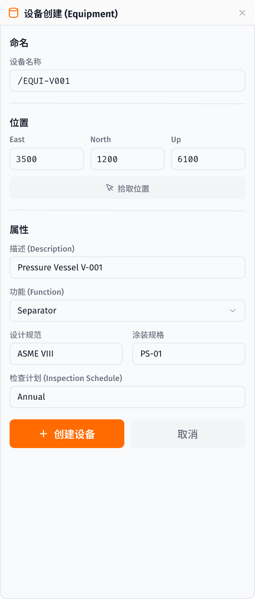

**E3D 源文件**: `PMLLIB/design/forms/equibasic.pmlfrm` (496行)

| 功能 | E3D 方法 | 设计状态 |
|------|----------|----------|
| 设备命名 | `nameCheck()` | ✅ |
| 位置设置 E/N/U | `setPositionXYZ()` | ✅ + 拾取位置按钮 |
| 描述 (Description) | `.description` | ✅ |
| 功能 (Function) | `.function` | ✅ 下拉选择 |
| 设计规范 (Design Code) | `.code` | ✅ |
| 涂装规格 (Paint Spec) | `.paint` | ✅ |
| 检查计划 (Inspection) | `.inSpec` | ✅ |
| 创建/取消按钮 | `apply()` / `close()` | ✅ |

---

### 1.2 管口创建 (Nozzle Creation)

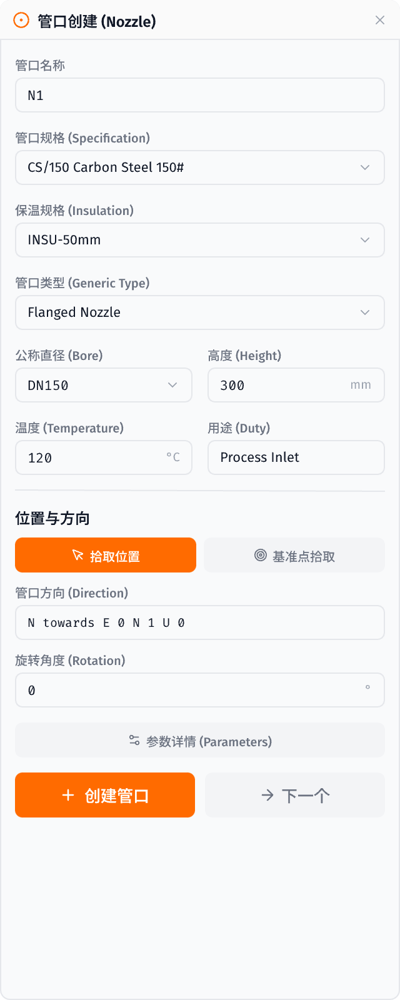

**E3D 源文件**: `PMLLIB/design/forms/equnozzle.pmlfrm` (1782行)

| 功能 | E3D 方法 | 设计状态 |
|------|----------|----------|
| 管口名称 | `nameCheck()` | ✅ |
| 管口规格 (Specification) | `selectNozzleSpec()` | ✅ 下拉选择 |
| 保温规格 (Insulation) | `.optInsuSpec` | ✅ |
| 管口类型 (Generic Type) | `getNozzleTypes()` | ✅ |
| 公称直径 (Bore) | `getNozzleBores()` | ✅ |
| 高度 (Height) | `.txtHeight` | ✅ |
| 温度 (Temperature) | `.txtTemp` | ✅ |
| 用途 (Duty) | `.txtDuty` | ✅ |
| 位置拾取 + 基准点拾取 | `pick()` / `pickDatum()` | ✅ |
| 管口方向 (Direction) | `nozzleDirection()` | ✅ |
| 旋转角度 (Rotation) | `rotate()` | ✅ |
| 参数详情按钮 | `showPlot()` | ✅ |
| 创建/下一个按钮 | `createNozz()` / `next()` | ✅ |

---

### 1.3 结构截面编辑 (Structural Section Edit)

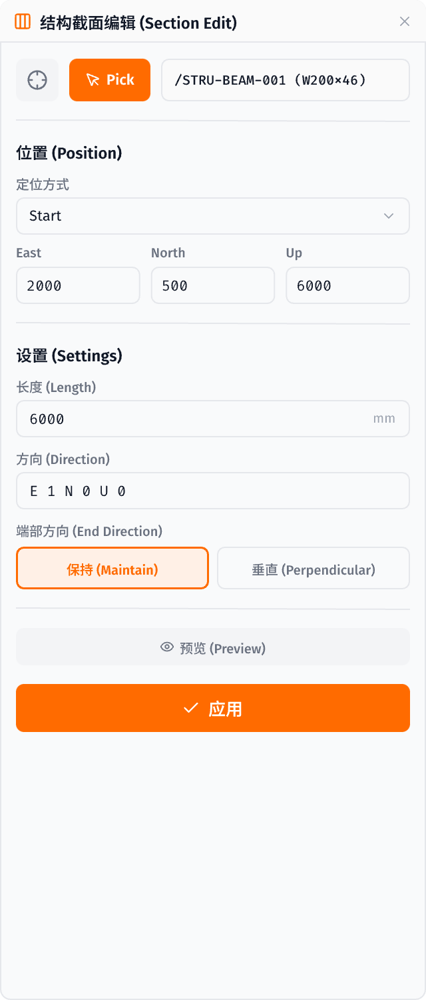

**E3D 源文件**: `PMLLIB/design/forms/strsectionedit.pmlfrm` (744行)

| 功能 | E3D 方法 | 设计状态 |
|------|----------|----------|
| CE选择 + Pick拾取 | `ce()` / `pick()` | ✅ |
| 元素名称显示 | `.name` | ✅ |
| 定位方式 (Position Type) | `positionType()` | ✅ Start/End/Centre |
| 位置 E/N/U 坐标 | `setPosition()` | ✅ |
| 长度 (Length) | `length()` | ✅ |
| 方向 (Direction) | `direction()` | ✅ |
| 端部方向 (End Direction) | `.cutPlane` | ✅ Maintain/Perpendicular |
| 预览 (Preview) | `preview()` | ✅ |
| 应用按钮 | `apply()` | ✅ |

---

## 2. 待设计面板

### 设备模块 (14 个 E3D 表单)

| # | 表单 | 功能 | 优先级 |
|---|------|------|--------|
| 1 | `equibasic.pmlfrm` | 设备创建 | ✅ 已完成 |
| 2 | `equnozzle.pmlfrm` | 管口创建 | ✅ 已完成 |
| 3 | `equiCreateSube.pmlfrm` | 子设备创建 | 高 |
| 4 | `equimportmanager.pmlfrm` | 设备导入管理 | 高 |
| 5 | `equipencreate.pmlfrm` | 贯穿创建 | 中 |
| 6 | `equcreatestd.pmlfrm` | 标准设备创建 | 中 |
| 7 | `equcopymodel.pmlfrm` | 设备模型复制 | 中 |
| 8 | `equassociate.pmlfrm` | 设备关联 | 低 |
| 9 | `equassquery.pmlfrm` | 关联查询 | 低 |
| 10 | `equipreport.pmlfrm` | 设备报告 | 低 |
| 11 | `equmodspref.pmlfrm` | 修改规格引用 | 低 |
| 12 | `equmeicreatenozzle.pmlfrm` | MEI管口创建 | 低 |
| 13 | `equmeicreatepoint.pmlfrm` | MEI点创建 | 低 |
| 14 | `equelecchoose.pmlfrm` | 电气设备选择 | 低 |

### 结构模块 (21 个 E3D 表单)

| # | 表单 | 功能 | 优先级 |
|---|------|------|--------|
| 1 | `strsectionedit.pmlfrm` | 截面编辑 | ✅ 已完成 |
| 2 | `strgensection.pmlfrm` | 通用截面 | 高 |
| 3 | `strspineedit.pmlfrm` | 脊线编辑 | 高 |
| 4 | `strringcreate.pmlfrm` | 环创建 | 中 |
| 5 | `strringedit.pmlfrm` | 环编辑 | 中 |
| 6-10 | `strpave*.pmlfrm` | 铺装(5种) | 中 |
| 11-15 | `strspine*.pmlfrm` | 脊线(5种) | 中 |
| 16 | `strsctnfitt.pmlfrm` | 截面拟合 | 低 |
| 17 | `strpanefitt.pmlfrm` | 面板拟合 | 低 |
| 18 | `strcurvecent.pmlfrm` | 曲线中心 | 低 |
| 19 | `strtagends.pmlfrm` | 端部标签 | 低 |
| 20 | `strstorageareas.pmlfrm` | 存储区域 | 低 |
| 21 | `strfittspec.pmlfrm` | 拟合规格 | 低 |

### 通用模块

| # | 表单 | 功能 | 优先级 |
|---|------|------|--------|
| 1 | `genprimitives.pmlfrm` | 基本体创建 | 高 |
| 2 | `genvolumemodel.pmlfrm` | 体积建模 | 中 |
| 3 | `genpencreate.pmlfrm` | 贯穿创建 | 中 |

---

### 1.4 子设备创建 (Sub-Equipment Creation)

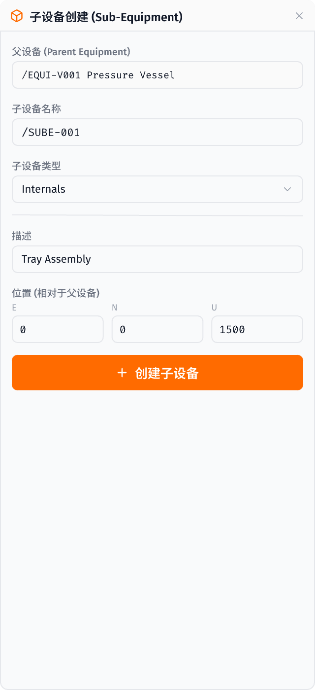

**E3D 源文件**: `PMLLIB/design/forms/equiCreateSube.pmlfrm`

| 功能 | 设计状态 |
|------|----------|
| 父设备显示 | ✅ |
| 子设备名称/类型/描述 | ✅ |
| 相对位置 E/N/U | ✅ |
| 创建子设备按钮 | ✅ |

---

### 1.5 基本体创建 (Primitives)

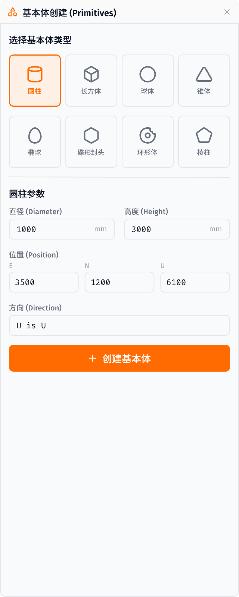

**E3D 源文件**: `PMLLIB/design/forms/genprimitives.pmlfrm`

| 功能 | 设计状态 |
|------|----------|
| 8种基本体选择（圆柱/长方体/球体/锥体/椭球/碟形封头/环形体/棱柱） | ✅ 图标卡片 |
| 参数输入（直径/高度等） | ✅ |
| 位置 E/N/U + 方向 | ✅ |
| 创建基本体按钮 | ✅ |

---

### 1.6 设备导入管理器 (Equipment Import Manager)

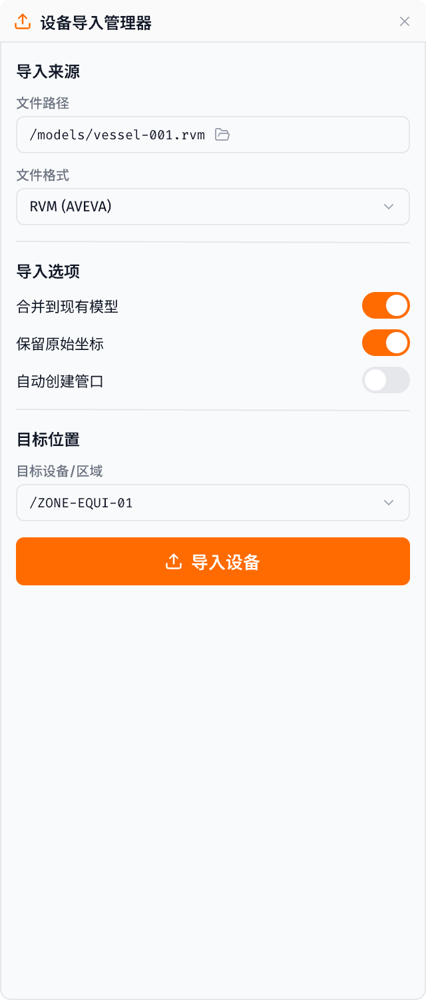

**E3D 源文件**: `PMLLIB/design/forms/equimportmanager.pmlfrm`

| 功能 | 设计状态 |
|------|----------|
| 文件路径 + 浏览按钮 | ✅ |
| 文件格式选择 (RVM/IFC/STEP) | ✅ |
| 导入选项（合并/坐标保留/自动管口） | ✅ |
| 目标设备/区域选择 | ✅ |
| 导入设备按钮 | ✅ |

---

### 1.7 通用截面 (Generic Section)

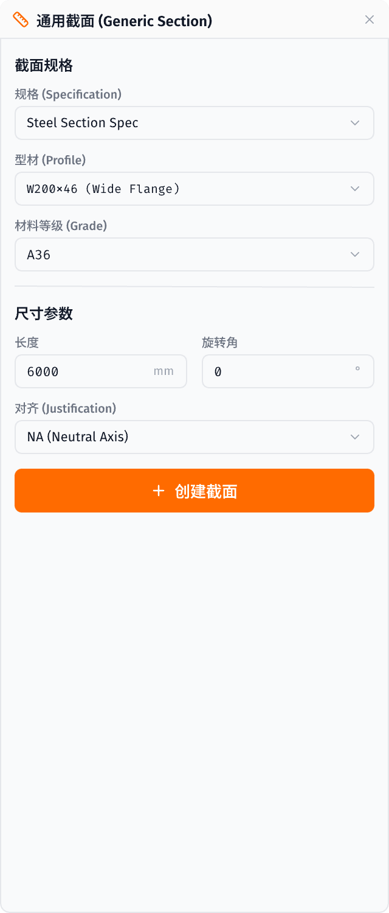

**E3D 源文件**: `PMLLIB/design/forms/strgensection.pmlfrm`

| 功能 | 设计状态 |
|------|----------|
| 规格/型材/材料等级选择 | ✅ |
| 长度/旋转角参数 | ✅ |
| 对齐方式 (Justification) | ✅ NA/TOS/BOS |
| 创建截面按钮 | ✅ |

---

### 1.8 脊线编辑 (Spine Edit)

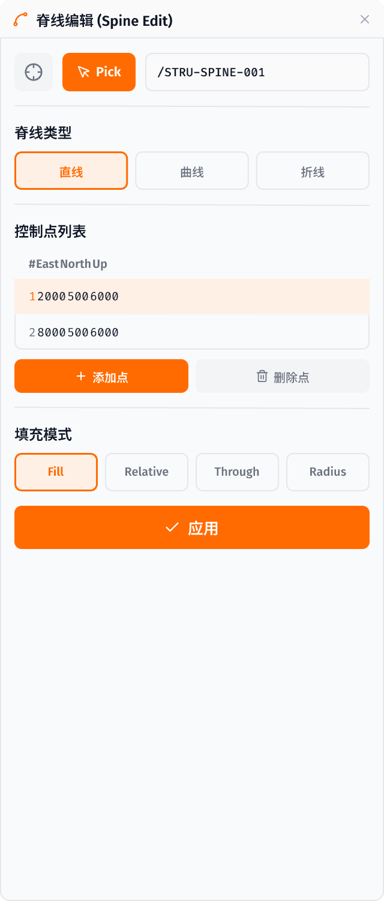

**E3D 源文件**: `PMLLIB/design/forms/strspineedit.pmlfrm`

| 功能 | 设计状态 |
|------|----------|
| CE选择 + Pick拾取 | ✅ |
| 脊线类型（直线/曲线/折线） | ✅ |
| 控制点列表 E/N/U 表格 | ✅ |
| 添加/删除控制点 | ✅ |
| 填充模式（Fill/Relative/Through/Radius） | ✅ |
| 应用按钮 | ✅ |

---

## 3. 设计文件清单

### 截图文件 (`screenshots/`)

| 文件 | 内容 |
|------|------|
| `liQe2.png` | 设备创建面板 |
| `5Tw80.png` | 管口创建面板 |
| `gBHhU.png` | 结构截面编辑面板 |
| `7wPpV.png` | 子设备创建面板 |
| `Wbktm.png` | 基本体创建面板 |
| `rPpfg.png` | 设备导入管理器 |
| `annPR.png` | 通用截面面板 |
| `JJN65.png` | 脊线编辑面板 |
| `1Ga3t.png` | 标准设备创建 |
| `IpLE3.png` | 设备贯穿 |
| `llmqr.png` | 结构环创建/编辑 |
| `ARmrI.png` | 体积建模 |
| `N2rvp.png` | 设备模型复制 |
| `XbBvt.png` | 设备报告 |
| `XIAs7.png` | 设备关联 |
| `yEbL3.png` | 结构铺装 |
| `h4WdZ.png` | 截面拟合 |
| `Yvkql.png` | 端部标签 |
| `UME8f.png` | 曲线中心 |

---

### 1.9 标准设备创建 (Standard Equipment)

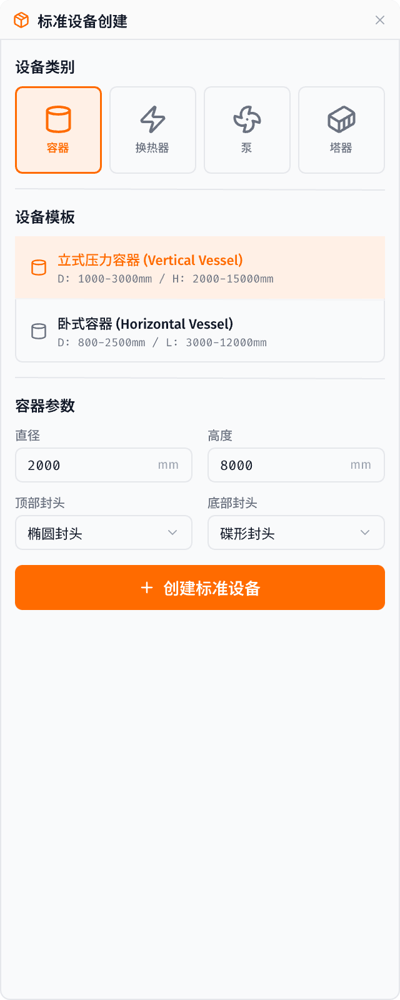

**E3D 源文件**: `PMLLIB/design/forms/equcreatestd.pmlfrm`

| 功能 | 设计状态 |
|------|----------|
| 4种设备类别（容器/换热器/泵/塔器，图标卡片式） | ✅ |
| 设备模板列表（立式/卧式容器含参数范围） | ✅ |
| 容器参数（直径/高度） | ✅ |
| 顶部/底部封头类型选择 | ✅ |
| 创建标准设备按钮 | ✅ |

---

### 1.10 设备贯穿 (Equipment Penetration)

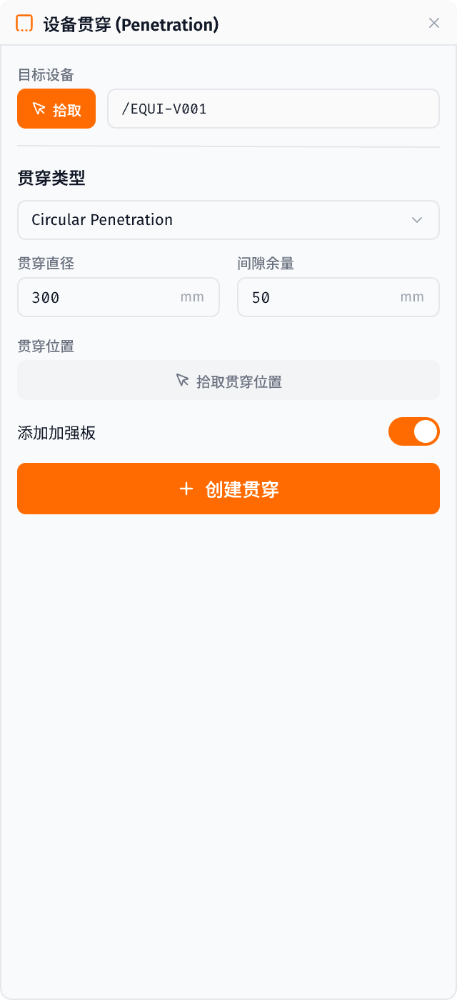

**E3D 源文件**: `PMLLIB/design/forms/equipencreate.pmlfrm`

| 功能 | 设计状态 |
|------|----------|
| 目标设备拾取 | ✅ |
| 贯穿类型选择 (Circular) | ✅ |
| 贯穿直径/间隙余量参数 | ✅ |
| 贯穿位置拾取 | ✅ |
| 加强板开关 | ✅ |
| 创建贯穿按钮 | ✅ |

---

### 1.11 结构环创建/编辑 (Ring Create/Edit)

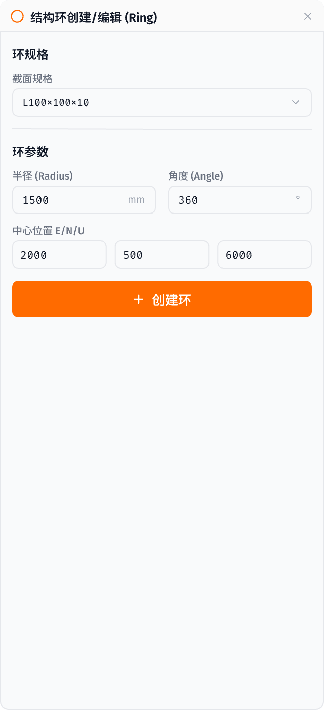

**E3D 源文件**: `PMLLIB/design/forms/strringcreate.pmlfrm` + `strringedit.pmlfrm`

| 功能 | 设计状态 |
|------|----------|
| 截面规格选择 | ✅ |
| 半径/角度参数 | ✅ |
| 中心位置 E/N/U | ✅ |
| 创建环按钮 | ✅ |

---

### 1.12 体积建模 (Volume Model)

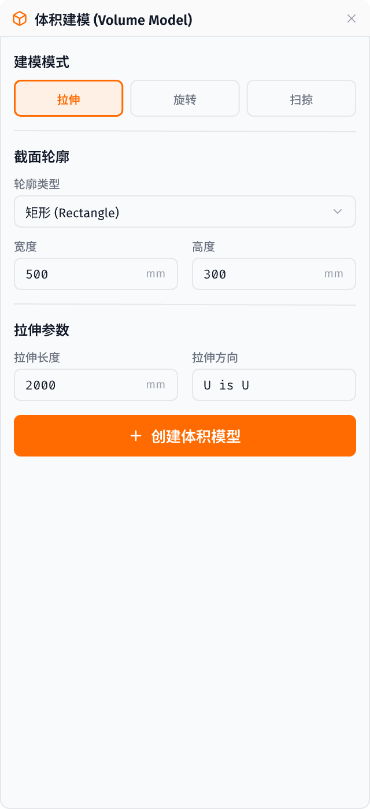

**E3D 源文件**: `PMLLIB/design/forms/genvolumemodel.pmlfrm`

| 功能 | 设计状态 |
|------|----------|
| 3种建模模式（拉伸/旋转/扫掠） | ✅ |
| 截面轮廓类型选择 | ✅ |
| 轮廓尺寸（宽度/高度） | ✅ |
| 拉伸参数（长度/方向） | ✅ |
| 创建体积模型按钮 | ✅ |

---

### 1.13 截面拟合 (Section Fitting)

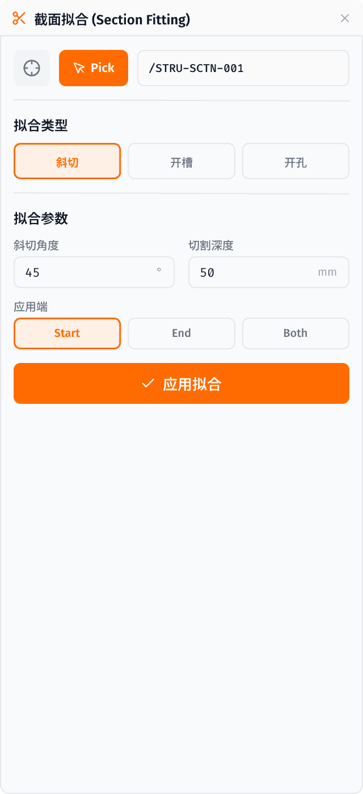

**E3D 源文件**: `PMLLIB/design/forms/strsctnfitt.pmlfrm`

| 功能 | 设计状态 |
|------|----------|
| CE+Pick 选择 | ✅ |
| 3种拟合类型（斜切/开槽/开孔） | ✅ |
| 拟合参数（斜切角度/切割深度） | ✅ |
| 应用端（Start/End/Both） | ✅ |
| 应用拟合按钮 | ✅ |

---

### 1.14 端部标签 (Tag Ends)

**E3D 源文件**: `PMLLIB/design/forms/strtagends.pmlfrm`

| 功能 | 设计状态 |
|------|----------|
| 截面拾取 | ✅ |
| Start端/End端标签输入 | ✅ |
| 应用标签按钮 | ✅ |

---

### 1.15 曲线中心 (Curve Centre)

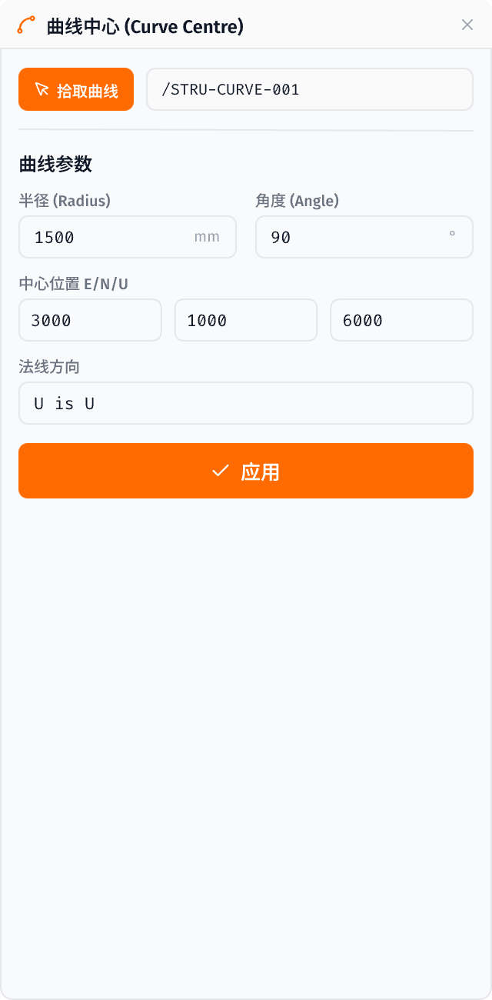

**E3D 源文件**: `PMLLIB/design/forms/strcurvecent.pmlfrm`

| 功能 | 设计状态 |
|------|----------|
| 曲线拾取 | ✅ |
| 半径/角度参数 | ✅ |
| 中心位置 E/N/U | ✅ |
| 法线方向 | ✅ |
| 应用按钮 | ✅ |

---

### 1.16 设备模型复制 (Equipment Copy Model)

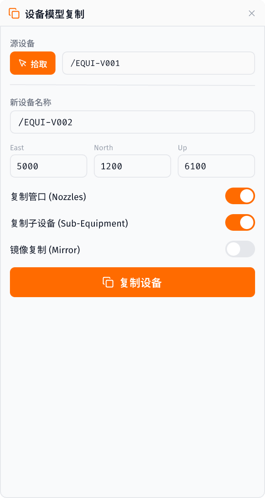

**E3D 源文件**: `PMLLIB/design/forms/equcopymodel.pmlfrm`

| 功能 | 设计状态 |
|------|----------|
| 源设备拾取 | ✅ |
| 新设备名称 + E/N/U 位置 | ✅ |
| 复制选项（管口/子设备/镜像开关） | ✅ |
| 复制设备按钮 | ✅ |

---

### 1.14 设备报告 (Equipment Report)

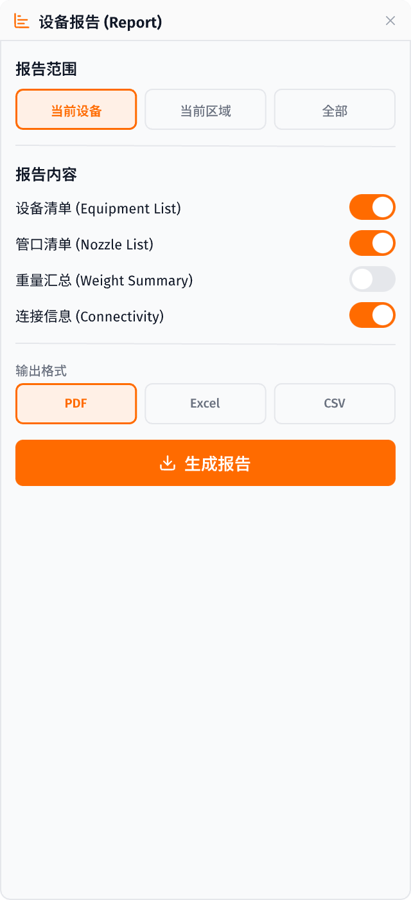

**E3D 源文件**: `PMLLIB/design/forms/equipreport.pmlfrm`

| 功能 | 设计状态 |
|------|----------|
| 报告范围（当前设备/区域/全部） | ✅ |
| 报告内容（设备清单/管口清单/重量汇总/连接信息） | ✅ 4项开关 |
| 输出格式（PDF/Excel/CSV） | ✅ |
| 生成报告按钮 | ✅ |

---

### 1.15 设备关联 (Equipment Association)

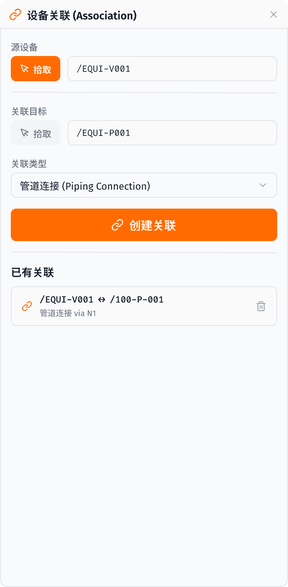

**E3D 源文件**: `PMLLIB/design/forms/equassociate.pmlfrm`

| 功能 | 设计状态 |
|------|----------|
| 源设备/关联目标拾取 | ✅ |
| 关联类型选择 | ✅ |
| 创建关联按钮 | ✅ |
| 已有关联列表（含删除） | ✅ |

---

### 1.16 结构铺装 (Structural Paving)

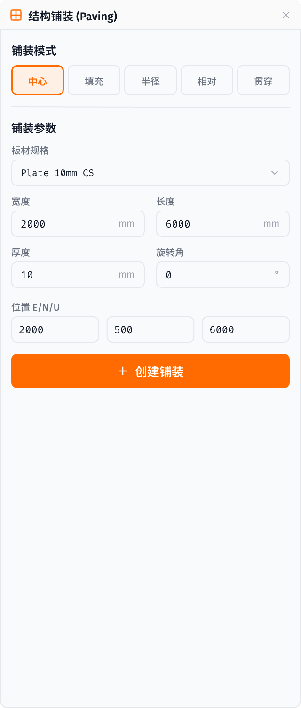

**E3D 源文件**: `PMLLIB/design/forms/strpavecent.pmlfrm` + `strpavefill/rad/rel/thru`

| 功能 | 设计状态 |
|------|----------|
| 5种铺装模式（中心/填充/半径/相对/贯穿） | ✅ |
| 板材规格选择 | ✅ |
| 尺寸参数（宽度/长度/厚度/旋转角） | ✅ |
| 位置 E/N/U | ✅ |
| 创建铺装按钮 | ✅ |

---

## 4. 完成度统计

| 维度 | 完成 | 总计 | 覆盖率 |
|------|------|------|--------|
| 设备模块面板 | **9** | 14 | **64%** |
| 结构模块面板 | **8** | 21 | **38%** |
| 通用模块面板 | **3** | 3 | **100%** |
| 截图导出 | 20 | 20 | **100%** |

## 5. 下一步建议

1. **代码实现**: 将已完成的 38 个面板设计（管道18 + 设备结构20）转为前端代码 (React/Vue + TailwindCSS)
2. **参考操作流程文档** `piping-workflow.md` 实现交互逻辑
3. **集成到实际 Plant3D 编辑器应用中**
4. **剩余低优先级**: 结构存储区域、拟合规格、面板拟合等 (~13个结构表单未设计）
