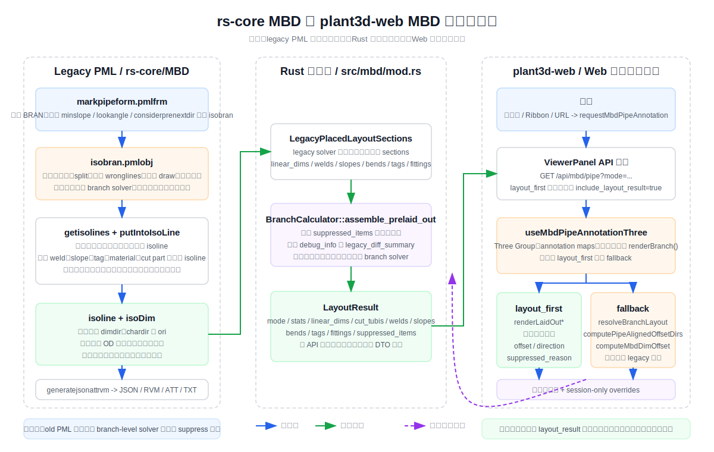

# rs-core MBD 对比与前端 MBD 标注开发文档

日期：2026-04-18

本文档目的：
- 对照 `rs-core/MBD` old PML、`rs-core/src/mbd/mod.rs` 的 Rust 契约层、以及 `plant3d-web` 当前实现。
- 说明现阶段 Web 端 MBD 管道标注到底迁移了什么、复用了什么、又在哪些地方仍然依赖 old PML 语义。
- 给后续维护者一张“入口 -> 数据 -> 布局 -> 绘制 -> 交互 -> 缺口”的完整地图。

适用范围：
- `rs-core/MBD/markpipe/*`
- `rs-core/src/mbd/mod.rs`
- `plant3d-web/src/api/mbdPipeApi.ts`
- `plant3d-web/src/components/dock_panels/ViewerPanel.vue`
- `plant3d-web/src/composables/useMbdPipeAnnotationThree.ts`
- `plant3d-web/src/composables/mbd/*`

非范围：
- 支吊架、设备、土建等非 BRAN/HANG 管道标注模块
- old PML 的 TPlant 上传协议细节
- 浏览器外的导出/发布链路实现



## 1. 结论先行

1. `rs-core/MBD` 下的 old PML `markpipeform -> isobran -> isoline -> isoDim`，仍然是当前 MBD branch-level solver 语义的事实源。它不仅负责“画线”，还负责分支拆解、对象归线、方向选择、坡度处理、错误收集和导出。
2. `rs-core/src/mbd/mod.rs` 目前更接近“布局结果契约层”和“legacy 结果组装层”，而不是完整求解器。`BranchCalculator::assemble_prelaid_out()` 的输入已经是假定排布好的 `LegacyPlacedLayoutSections`。
3. `plant3d-web` 现阶段不是把 old PML 原样搬进前端，而是并行维护两条路径：
   - `layout_first`：优先消费后端已经排布好的 `layout_result`
   - `construction` / fallback：前端再用 `branchLayoutEngine`、`computePipeAlignedOffsetDirs`、`computeMbdDimOffset` 去做近似重建
4. 当前 Web 端已经和 old PML/Rust 契约对齐的核心抽象有：`mode`、`layout_result`、`suppressed_reason`、`placement_lane`、`offset_level`、`direction`、`offset`、`label_t`。
5. 当前 Web 端尚未完整对齐的部分主要有：完整 isoline 对象优先级、old PML 特殊元件拆线规则、导出链路、以及“前后段占位/极坐标系统”的全量语义。
6. 后续开发的基本原则应该是：
   - old PML 的 branch solver 语义继续作为事实源
   - 后端已给出 `layout_result` 时，前端只负责绘制，不再二次发明版面
   - 前端 fallback 只能作为降级路径，而不应继续膨胀成第二套完整版 `isobran`

## 2. old PML：`rs-core/MBD` 的管道标注主链路

### 2.1 入口层：`markpipeform.pmlfrm`

old PML 的入口非常直接。用户在 `markpipeform` 中选择分支后，表单为每个 branch 构造一个 `isobran` 对象，并把表单参数传进去，包括：

- `minslope`
- `maxslope`
- `considerprenextdir`
- `lookangle`
- `drawtype`（如 `EM4`）

从实现职责上看，表单层只负责：

- 收集 branch
- 构造 `isobran`
- 展示属性列表
- 触发绘制/导出

真正的分支求解逻辑并不在表单里，而是在 `isobran` 内部。

### 2.2 Branch 求解器：`isobran.pmlobj`

`isobran` 是 old PML 管道标注的总调度对象。它在初始化阶段做几件关键事情：

- 记录 branch 名称与是否为 `INST` 管道
- 保存 `minslope` / `maxslope`
- 保存 `considerprenextdir` 和 `lookangle`
- 创建 `mbdstru`
- 准备首层/第二层尺寸倍率（`firstdimtimes`、`seconddimtimes`）

同时，`clearcontent()` 会重置整个分支级别的中间状态，包括：

- `isolines`
- `materials`
- `tags`
- `welds`
- `zyjc`
- `benchmarks`
- `wronglines`

也就是说，`isobran` 并不是一个“纯绘制对象”，而是 branch 级别的状态机和编排器。

### 2.3 分支拆解：`getisolines()`

old PML 的关键算法之一，是先把一条 branch 拆成多个 `isoline`。`getisolines()` 的职责是：

1. 遍历 branch members（含 `Head` / `Tail`）
2. 收集每段候选的成员数组 `allarr`
3. 收集每段的方向 `ldirs`
4. 收集转折点 `poss`
5. 根据这些数组构造 `isoline`

这一步并不只是“按直管段切分”这么简单，它已经嵌入了很多 old PML 业务语义：

- `PCOM` 的水平/垂直布置分支逻辑
- `BEND` / `ELBO` 等拐弯元件的拆线规则
- special element 的单独切段
- branch 建模方向错误时直接记录 `wronglines` 并返回失败
- 把前一个 isoline 的 `prehoridir` 传给下一个 isoline，形成“前后段约束”

这一层非常重要，因为后面的尺寸方向、对象落线、占位冲突，很大程度上都建立在 isoline 切分正确的前提上。

### 2.4 对象采集与优先级：`getobjects()` + `putIntoIsoLine()`

在 old PML 里，标注对象不是直接挂在 branch 上，而是先采集，再归入某条 isoline。

`getobjects()` 的采集顺序本身就是语义：

1. `getattadatas()`
2. `getadjustwelds()`
3. `getinstallationangles()`
4. `getslopes()`
5. `getmaterials()`
6. `gettags()`
7. `getwelds()`
8. `getcutparts()`
9. `getbranmlabel()`

这个顺序并非随意。注释已经写得很清楚：

- `adjustweld` 优先级高
- 安装角度优先级次之
- 坡度优先级又高于其他对象

随后 `putIntoIsoLine()` 再根据对象类型，用不同方式把对象分配到 isoline：

- 有名字的对象优先按成员归属分配
- 没名字的对象（例如某些 cut pipe / text / 辅助对象）按投影距离找最近 isoline
- 焊缝文字、弯头 pad/leg 等特殊对象还有单独判断

如果对象无法找到合适 isoline，old PML 会留下调试痕迹并进入错误路径，而不是悄悄硬画。

这一点与当前 Web 端的差异很大：old PML 先有“归线”，后有“绘制”；前端 fallback 则更偏向“直接按对象类型绘制”。

### 2.5 绘制总调度：`isobran.draw()`

`isobran.draw()` 的高层流程可以概括为：

```text
draw()
  -> split()
     -> getisolines()
     -> putIntoIsoLine()
  -> 权限检查（删除旧 DIM/AID、切换到 MBD site/group）
  -> drawdmf() 处理弯头/定位等辅助项
  -> 遍历每条 isoline 调用 isoline.draw()
  -> 收集 wronglines
  -> 需要时 generatejsonattrvm()
```

这里要特别注意两点：

1. old PML 先删旧 DIM/AID 再画新对象，因此它天然带有“重建式渲染”的假设。
2. 每条 isoline 画完后，还会把空间占用信息继续传给前后段，这也是 old PML 能维持全局布局一致性的原因之一。

### 2.6 尺寸求解器：`isoDim.pmlobj`

`isoDim` 是 old PML 中最贴近“尺寸算法”的对象。它的职责不是单纯创建一个 dimension，而是对某条 isoline 的线性尺寸和坡度尺寸进行求解。

初始化时，`isoDim` 会：

- 过滤 `ATTA`、`TUBI`、`GASK` 等不参与主尺寸序列的成员
- 识别是否为 `INST` 管道
- 记录 `pipedir`、`minslope`、`maxslope`、`od`
- 把剩余成员转换为 `poss` / `mems`

在绘制阶段，它的典型路径是：

```text
isoDim.draw(dimdir, mbdstru, cheight, dimtimes)
  -> CalculateDimChardirs()
  -> dimOneMemSlope()
  -> isoori.getori()
  -> drawDim(dimtimes)
     -> dimOneMem(offset)
        -> lindim(...)
```

这里体现了 old PML 的几个关键策略。

#### 2.6.1 方向选择：`isoGetDimDir()` + `isoGetBestDir()`

old PML 不会任意选一个垂直方向做尺寸线，而是：

1. 根据 `pipedir` 和候选 `dimdirs` 取一个正交方向
2. 再用 `isoGetBestDir()` 通过和三个基准方向的夹角，决定方向是否需要翻转

换句话说，它不是只算“垂直”，还要算“朝哪一边画更好”。

#### 2.6.2 文字符号方向：`isoori`

`isoDim.draw()` 在真正出线前，还会让 `isoori` 统一求出：

- `pipedir`
- `dimdir`
- `chardir`
- `ori`

这说明 old PML 的尺寸方向和文字方向是成套求解的，而不是分散在不同模块里零敲碎打。

#### 2.6.3 偏移量公式

`drawDim()` 会先找出一条参考线，再把尺寸线整体偏到管道外侧。它的核心偏移近似可以理解为：

```text
offset ~= od + cheight * 1.2 * (dimtimes - 1)
```

其中：

- `od` 决定尺寸线至少离开管道外轮廓
- `cheight` 和 `dimtimes` 决定层级越往外，文字和尺寸线偏移越大

这和 Web 端现在的 `distance * 0.15` 经验偏移不是一回事。old PML 的偏移语义里明确包含了“管径”和“层级”。

#### 2.6.4 坡度尺寸：`dimslope()`

坡度不是普通 linear dimension。old PML 的处理逻辑是：

- 如果两个点 `up` 差值大于阈值，则走高低点投影逻辑
- 画垂直辅助线
- 画坡度文字
- 必要时再补一个直角符号

如果不是显著的竖向差，而是平面上的斜率关系，则进入另一条分支，用候选 `dimdirs` 做正交判断。

因此 old PML 里的“坡度”是一个独立几何对象族，而不是给普通 linear dimension 换个文字。

### 2.7 错误与抑制：`wronglines`

old PML 没有今天这种结构化的 `suppressed_items`，但它非常强调“发现异常就记下来，不要硬画”。

典型错误来源包括：

- branch 建模方向反了
- 元件顺序与几何位置不一致
- 找不到合适 isoline
- 特殊元件材料/焊缝信息不完整

这些错误统一落入 `wronglines`，并在 `draw()` 之后汇总。

这正是今天 Rust/前端里 `suppressed_reason` 设计的来源之一。

### 2.8 导出：`generatejsonattrvm()`

old PML 的管道标注不是只负责画在模型里。`generatejsonattrvm()` 还会同时输出：

- `.json`
- `.rvm`
- `.att`
- `.txt`

再继续接到 TPlant 上传链路。

因此如果从 old PML 的视角看，`isobran` 其实是“branch 标注 + 导出打包”的一体化模块，而不是纯前端渲染模块。

## 3. Rust 契约层：`rs-core/src/mbd/mod.rs`

### 3.1 这个模块当前解决了什么

Rust 侧 `src/mbd/mod.rs` 已经抽出了 Web/API 能消费的核心 DTO：

- `BranchLayoutMode`
- `LayoutRequest`
- `PlacedLinearDim`
- `PlacedWeld`
- `PlacedSlope`
- `PlacedTag`
- `PlacedFitting`
- `PlacedBend`
- `SuppressedItem`
- `LayoutDebugInfo`
- `LayoutResult`

它的价值在于：

1. 把 old PML 的“结果形状”显式化
2. 给前端/API 一个稳定的 JSON 契约
3. 把“抑制原因统计”“solver version”“legacy diff summary”等调试信息标准化

### 3.2 这个模块当前没有解决什么

`BranchCalculator::assemble_prelaid_out()` 的名字容易让人误解成“完整 branch 求解器”，但从代码看，它当前做的事情是：

- 接收已经求解好的 `LegacyPlacedLayoutSections`
- 把各类 section 合并为 `LayoutResult`
- 自动收集 `suppressed_items`
- 统计 `suppressed_by_reason`
- 写入 `debug_info`

换句话说，它现在更像：

```text
legacy solver output -> Rust contract assembly -> API/front-end
```

而不是：

```text
raw branch data -> full Rust solver -> final layout
```

这也是理解当前系统非常关键的一点：Rust 契约层已经就位，但完整 old PML 求解器还没有完全收敛到这个文件里。

### 3.3 三种模式默认语义

Rust 契约层已经显式支持三种模式：

- `layout_first`
- `construction`
- `inspection`

并且 `LayoutRequest::default()` 默认就是 `layout_first`。

这和 `plant3d-web` 现在的模式体系是一致的，说明模式语义已经从“前端约定”上升成了“契约层约定”。

## 4. plant3d-web：当前 Web 端的 MBD 管道标注实现

### 4.1 入口层

当前前端有三个典型入口会触发 MBD 管道标注：

1. 模型树右键菜单：`ModelTreePanel.vue` 调用 `requestMbdPipeAnnotation(refno)`
2. Ribbon：`mbd.generate`
3. URL 预加载：通过查询参数自动触发

这些入口最终都会收敛到 `useToolStore.ts` 中的：

- `mbdPipeAnnotationRequest`
- `requestMbdPipeAnnotation(refno)`

随后由 `ViewerPanel.vue` 监听这个 request，并执行真正的加载与渲染。

### 4.2 API 请求层

`src/api/mbdPipeApi.ts` 定义了前端能看到的完整 MBD 合同。它和 Rust 契约层的字段命名几乎是一一对应的，包括：

- `MbdPipeApiMode`
- `MbdPipeLayoutResult`
- `MbdLaidOutLinearDimDto`
- `MbdLaidOutWeldDto`
- `MbdLaidOutSlopeDto`
- `MbdLaidOutBendDto`
- `MbdSuppressedLayoutItemDto`

`ViewerPanel.vue` 发请求时还做了两件很关键的事情：

1. 显式传 `mode`
2. 只有在 `layout_first` 下才请求 `include_layout_result=true`

如果 `layout_first` 没拿到 `layout_result`，前端会立刻回退到 `construction` 默认显示，并给出提示。

因此前端当前并不是“始终本地布局”，而是明确的：

```text
先信后端排布 -> 缺失时再本地降级
```

### 4.3 核心渲染器：`useMbdPipeAnnotationThree.ts`

这个 composable 是 Web 端 MBD 的真正中枢。它负责维护：

- Three.js `Group`
- `dimAnnotations`
- `weldAnnotations`
- `slopeAnnotations`
- `bendAnnotations`
- `cutTubiAnnotations`
- `fittingAnnotations`
- `tagAnnotations`
- 调试 overlay
- session-only overrides

同时它还暴露给面板/UI 的状态：

- `mbdViewMode`
- `dimMode`
- `bendDisplayMode`
- `showDimSegment / Chain / Overall / Port`
- `showWelds / Slopes / Bends / Segments / Labels`

也就是说，`useMbdPipeAnnotationThree` 在 Web 端同时承担了：

- 状态容器
- 渲染器
- 交互回写目标
- fallback 布局器

### 4.4 三种模式在前端的默认显示语义

`applyModeDefaults()` 当前的默认映射是：

- `layout_first`
  - `dimMode = classic`
  - 开启 `segment / chain / overall / weld / slope / bend`
- `construction`
  - 保持旧施工视图语义
  - 默认不显示 `segment`，保留 `chain / overall / weld / slope`
- `inspection`
  - `dimMode = rebarviz`
  - 关闭 `segment / chain / overall`
  - 打开 `port`

这里要注意：模式切换不会立即把所有局部显隐状态静默覆盖，只有显式点击“重置当前模式默认”才会整套回到默认值。

这点和 old PML 的“每次重建都是全量重置”不同，更符合 Web 交互习惯。

## 5. plant3d-web 的两条布局路径

### 5.1 路径 A：`layout_first`

当 `mode === layout_first` 且 `data.layout_result` 存在时，`renderBranch()` 直接走：

- `renderLaidOutLinearDims()`
- `renderLaidOutWelds()`
- `renderLaidOutSlopes()`
- `renderLaidOutBends()`
- `renderLaidOutCutTubis()`
- `renderLaidOutFittings()`
- `renderLaidOutTags()`

此时前端基本不再自己算“放哪儿”，而是只把后端给出的：

- `direction`
- `offset`
- `label_t`
- `label_offset_world`
- `text_anchor`
- `visible`
- `suppressed_reason`

喂给 `LinearDimension3D` / `WeldAnnotation3D` / `SlopeAnnotation3D` 等对象。

这一条路径最接近“old PML 语义被后端继承，前端只做绘制”。

### 5.2 路径 B：construction / fallback

如果不是 `layout_first`，或者 `layout_first` 缺少 `layout_result`，前端会回到旧路径：

- `renderDims()`
- `renderWelds()`
- `renderSlopes()`
- `renderPipeClearances()`
- `renderBends()`
- `renderCutTubis()`
- `renderFittings()`
- `renderTags()`

这时前端必须自己推导一部分排版语义。

## 6. plant3d-web fallback 算法：它和 old PML 对齐到什么程度

### 6.1 对齐点 1：语义层级不再是硬编码常量

`branchLayoutEngine.ts` 已经把 old PML 里“不同类型尺寸应分层/分道”的思想抽出来，体现在：

- `offset_level`
- `placement_lane`
- 语义 lane 顺序：`segment -> port -> chain -> cut_tubi -> overall`

并通过：

- `resolveSemanticLane()`
- `resolveSemanticOffsetFromLane()`
- `resolveBranchLayout()`

把这些语义转成最终 `offset`。

这已经明显比早期“所有尺寸一个固定偏移值”进步很多。

### 6.2 对齐点 2：优先使用后端 hint，其次才用前端推断

fallback 布局的方向来源顺序是：

1. `layout_hint.offset_dir`
2. `findSegmentOffsetDir()` 基于 branch 拓扑推断
3. 更后面的相机 fallback / 本地 fallback

这和 old PML 的思路是一致的：优先使用业务/拓扑语义，最后才用视觉兜底。

### 6.3 对齐点 3：管段级方向预计算

`computePipeAlignedOffsetDirs.ts` 预计算每个 segment 的偏移方向时，考虑了：

- 相邻段叉积得到 bend normal
- 近似水平段重力对齐
- 主轴垂直兜底
- 相邻段翻面一致性修正

这一层虽然没有 old PML 那么复杂的 isoline 体系，但本质上是在用“branch 邻接关系”而不是“相机方向”决定尺寸朝向。

### 6.4 仍然没有完全对齐的点

前端 fallback 目前还没有完整复刻 old PML 的以下语义：

1. **完整 isoline 对象模型**
   - 现在只有 segment 级方向预计算，没有完整的 `isoline -> objects -> usedDirs/polarsystem` 体系。

2. **对象采集优先级**
   - old PML 的 `adjustweld -> installation angle -> slope -> material -> tag -> weld -> cut part` 优先级，在前端没有 1:1 对应的数据结构。

3. **基于管径/文字高度的偏移**
   - 前端当前偏移更偏经验公式：`distance * 0.15`，再夹在 `50~500`。
   - old PML 则显式依赖 `OD + cheight * layer_factor`。

4. **前后段占位传播**
   - old PML 在 isoline 之间传递 `prehoridir` / `usedDirs`。
   - 前端目前只有局部 declutter 与 lane 语义，没有完整“前后段空间影响模型”。

5. **导出一致性**
   - old PML 的绘制结果天然连着 `json/rvm/att/txt`。
   - 前端当前只负责视觉渲染，不负责导出打包。

## 7. 交互层差异：old PML 是重建式，Web 是会话覆盖式

### 7.1 old PML

old PML 的思路是：

- 删除旧 DIM/AID
- 全量重算
- 再次写入模型标注对象

因此它更像“批处理/重建”。

### 7.2 Web 端

Web 端把 MBD 标注注册进统一 `annotationSystem`，并给它们分配外部交互 ID：

- `mbd_dim_*`
- `mbd_weld_*`
- `mbd_slope_*`
- `mbd_bend_*`

随后：

- 拖拽 label 会写入 `labelOffsetWorld`
- 拖拽尺寸线会写入 `offset` / `direction`
- 右键菜单可切换 `isReference`
- 重置时用 `resetDimOverride()` 回到当前数据源

这些 override 只保存在当前会话，不回写后端。

因此 Web 端的定位是：

```text
后端结果 / fallback 结果  +  会话内交互修正
```

而不是：

```text
修改模型本体中的持久 DIM/AID
```

## 8. old PML -> Rust DTO -> plant3d-web 的概念映射

| old PML / legacy 概念 | Rust 契约层 | plant3d-web 当前实现 | 说明 |
| --- | --- | --- | --- |
| `markpipeform` | 无直接对应 | `ModelTreePanel` / Ribbon / URL -> `requestMbdPipeAnnotation` | UI 入口从桌面表单变为浏览器事件 |
| `isobran` | `BranchCalculator`（语义目标） | `ViewerPanel + useMbdPipeAnnotationThree` | Web 端目前把 orchestrator 分散到了 Viewer 和 composable |
| `allarr + poss + ldirs` | 尚无完整显式结构 | `segments + pipeOffsetDirs + layout_hint` | isoline 结构尚未完全迁移 |
| `isoline` | `LegacyPlacedLayoutSections` 的隐式来源 | 无完整一等公民，仅有局部 segment/topology 概念 | 这是当前迁移最大缺口之一 |
| `isoDim.dimdir / chardir / ori` | `PlacedLinearDim.direction` 等字段 | `LinearDimension3D` 参数 + `dimMode` | Web 端已经能消费最终方向，但 fallback 计算仍更轻量 |
| `wronglines` | `SuppressedItem` + `LayoutDebugInfo.suppressed_by_reason` | `suppressed_reason` + `suppressedWrongLineCount` | 结构化程度提升，但来源仍需继续统一 |
| `generatejsonattrvm()` | `LayoutResult` 可作为 JSON 基础 | 前端无导出实现 | Web 端只渲染，不打包 |
| `usepolarsystem / usedDirs` | 尚未完整抽象 | `placement_lane / offset_level / declutter` | 部分语义被 lane 化，但不是完整等价物 |
| `EM4 / EM9` | `mode` | `layout_first / construction / inspection` | 模式体系已经现代化并显式化 |

## 9. 对 plant3d-web 后续开发最重要的几条规则

### 9.1 规则一：old PML 的 branch solver 语义仍然是事实源

当你在 Web 端遇到以下问题时，不要只看前端：

- 某类元件应该归哪条线
- 某个方向为什么要翻转
- bend/tee/flange 为什么要额外占一层
- 为什么某对象应该 suppress 而不是硬画

优先回到 `rs-core/MBD/markpipe/object/isobran.pmlobj` 和 `isoDim.pmlobj` 看 old PML 语义。

### 9.2 规则二：能消费 `layout_result` 就不要前端重算

如果后端已经给出：

- `direction`
- `offset`
- `label_offset_world`
- `placement_lane`
- `suppressed_reason`

那么前端只需要负责：

- 渲染
- 显隐
- 交互

不要在前端重新发明另一套版面规则，否则很容易和 old PML / Rust 契约分叉。

### 9.3 规则三：fallback 只做降级，不做无限扩张

当前前端 fallback 已经足够承担：

- 后端没返回 `layout_result`
- 某些 hint 缺失
- 开发阶段 demo / fixture 验证

但它不应该继续演化成全量 `isobran`。否则会出现：

- 一套后端 branch solver
- 一套前端 branch solver
- 两套 suppress 语义
- 两套 debug 口径

这会让问题定位几乎不可维护。

### 9.4 规则四：新增标注类别时要同时补五层

如果未来要新增某个 MBD 标注类别，不要只改渲染器。至少要同步考虑：

1. Rust / API DTO 是否有字段
2. `mbdPipeApi.ts` 是否暴露类型
3. `renderBranch()` 的 `layout_first` 路径是否支持
4. fallback 路径是否需要最小降级
5. 交互注册、显隐开关、面板统计是否要补

### 9.5 规则五：bend/angle/aux label 应与所属直段共享偏移基线

这条规则其实已经写在 `rs-core/AGENTS.md` 里：

- ELBO/BEND 的尺寸、角度、标签
- 应与所属直段共享偏移基线与方向系统

前端当前对 bend size dim 已经开始这么做：

- 优先取 owner candidate 的 offset baseline
- 再 fallback 到普通 semantic offset

后续所有新增的弯头/管件扩展，都应该继续保持这个方向，而不是为弯头单独造一套完全独立的 offset 规则。

## 10. 当前系统的主要缺口与建议补位顺序

### 10.1 缺口一：完整 Rust branch solver 还未完全落地

`src/mbd/mod.rs` 当前的重点是 DTO 和 `suppressed` 组装，不是完整求解器。

建议：
- 继续以 old PML `isobran` 为蓝本，逐步把 isoline / object priority / usedDirs 迁到 Rust
- 前端只消费结果，不继续扩展 fallback

### 10.2 缺口二：前端 fallback 和 old PML 仍有语义差

典型差异包括：
- isoline 切分缺失
- special element 归线语义不全
- 偏移公式没有显式管径语义

建议：
- 先补后端 `layout_result`
- 再缩减 fallback 职责

### 10.3 缺口三：debug 信息还不够闭环

现在前端虽然能显示 `suppressedWrongLineCount`，但 old PML 的 `wronglines` 粒度、Rust `suppressed_by_reason` 统计、前端 toast/console 之间还没有完全统一口径。

建议：
- 后端固定一套 suppress reason 枚举
- `debug_info.notes` / `legacy_diff_summary` 继续对外暴露
- 前端开发模式保留完整 debug 展示

### 10.4 缺口四：导出链路没有迁入 Web 架构

前端现在只负责看，不负责出：

- `.json`
- `.rvm`
- `.att`
- `.txt`

如果未来 Web 端要承担交付导出，就不能只看 `plant3d-web`，必须把 old PML 的 `generatejsonattrvm()` 和其上下游链路一起系统性迁移。

## 11. 建议的阅读顺序

如果你刚接手这个模块，建议按下面顺序阅读：

1. `rs-core/MBD/开发文档/管道标注绘制流程.md`
2. `rs-core/MBD/markpipe/markpipeform.pmlfrm`
3. `rs-core/MBD/markpipe/object/isobran.pmlobj`
4. `rs-core/MBD/markpipe/object/isoDim.pmlobj`
5. `rs-core/MBD/markpipe/function/isoGetDimDir.pmlfnc`
6. `rs-core/MBD/markpipe/function/isoGetBestDir.pmlfnc`
7. `rs-core/src/mbd/mod.rs`
8. `plant3d-web/src/api/mbdPipeApi.ts`
9. `plant3d-web/src/components/dock_panels/ViewerPanel.vue`
10. `plant3d-web/src/composables/useMbdPipeAnnotationThree.ts`
11. `plant3d-web/src/composables/mbd/branchLayoutEngine.ts`

## 12. 一句话总结

今天的 `plant3d-web` MBD 管道标注，已经完成了“Web 渲染层 + 交互层 + Rust/API 契约层”的基本闭环，但真正决定 branch 语义的 old PML `isobran/isoDim` 还没有被完整替代。

因此当前最稳妥的工程策略不是继续把前端 fallback 做大，而是继续把 old PML branch solver 语义向 Rust/后端收敛，再让前端只做消费、展示和交互增强。
