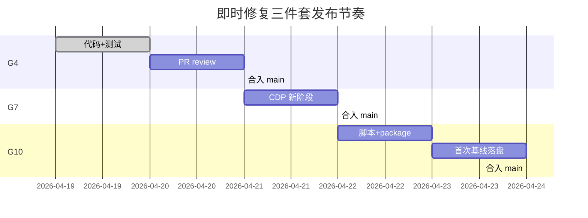

# 三维校审即时修复三件套 · 执行清单

> 日期：2026-04-19  
> 适用仓库：`plant3d-web`  
> 关联：
> - `三维校审当前实现-Gap分析与完善建议-2026-04-19.md` §5（本清单是其细化）
> - `三维校审流程与批注处理审核-2026-04-19.md`
>
> 定位：**零依赖 / 低风险 / ~2 人日**的短平快修复集，目标是让当前代码从"跑得通"提升到"读路径有实时性 / 冒烟深入 / 性能可度量"。不依赖 M2 SHADOW 灰度、M4 后端改动、M5 commentSync 服务。

## 0. 目标与准入

| 项 | 说明 |
|---|---|
| **修复 1（G4）** | `ReviewCommentsTimeline` 订阅 `reviewStore.onCommentAdded`，评论实时 P0 问题立即恢复 |
| **修复 2（G7）** | `scripts/local-pms-cdp-smoke.ts` 增 2 阶段：写评论 / 读验证，CDP 冒烟覆盖批注 CRUD |
| **修复 3（G10）** | `src/review/benchmarks/restore.bench.ts`：50/200/1000 批注规模下的 snapshot + payload 构造耗时基线 |
| **总工作量** | 约 **2 人日**（G4 0.5d / G7 0.5d / G10 0.5d + 联调 0.5d） |
| **准入条件** | 无依赖，当前 main 分支即可开工 |

## 1. G4 修复：评论实时订阅（~0.5 人日）

### 1.1 现状证据

- `useReviewStore.ts:362-372`：`commentAddedCallbacks` 列表 + `onCommentAdded(callback)` API 已存在
- `useReviewStore.ts:474-481`：WebSocket 的 `comment_added` 分发到所有回调
- `grep onCommentAdded src/**`：**0 命中** → **没有组件订阅** → 评论实时链路事实失效

### 1.2 改动

只改一个文件：`src/components/review/ReviewCommentsTimeline.vue`（约 10 行）

```ts
// setup 段顶部已经有 useReviewStore()，直接复用
import { onMounted, onUnmounted } from 'vue';

onMounted(() => {
  const stop = reviewStore.onCommentAdded((data) => {
    const payload = data as
      | { annotationId?: string; annotationType?: string }
      | { comment?: { annotationId?: string; annotationType?: string } }
      | null;
    const ann =
      (payload as { annotationId?: string })?.annotationId
        ? payload
        : (payload as { comment?: { annotationId?: string; annotationType?: string } })?.comment;
    if (
      ann?.annotationType === props.annotationType
      && ann?.annotationId === props.annotationId
    ) {
      loadCommentsFromBackend();
    }
  });
  onUnmounted(stop);
});
```

**关键点**：

- 只对"当前打开的批注"精准匹配（`annotationType + annotationId`），避免全局重拉；
- 收到事件 → 调现有 `loadCommentsFromBackend()` 重拉 → 更新 `useToolStore.setAnnotationComments`，`allComments` computed 自动重算，M3-T7 的 DUAL_READ watch 也会同步推到 thread store；
- `onUnmounted(stop)` 卸载 listener 防内存泄漏；
- `data` 的 shape 兼容两种可能后端结构（直接 `{annotationId, ...}` 或嵌套 `{comment: {...}}`）。

### 1.3 单测（`ReviewCommentsTimeline.test.ts` 新增 3 case）

- **CT-1**：mount 时注册 callback；unmount 时注销（用 vi.fn 监听返回的 stop）
- **CT-2**：收到匹配的 event → 触发 `reviewCommentGetByAnnotation`（mock）
- **CT-3**：收到不匹配的 event（别的 annotationId）→ **不**触发重拉

### 1.4 验证

```bash
npm run type-check
npx vitest run src/components/review/ReviewCommentsTimeline.test.ts
```

手测：两标签页登录 → A 发评论 → B 立即看到（无需刷新）。

### 1.5 flag 保护（可选）

如果担心 3 行代码引入误刷新，可加 flag：

```ts
import { isReviewFlagEnabled } from '@/review/flags';
if (!isReviewFlagEnabled('REVIEW_F_COMMENT_SYNC_LEGACY_HOOK')) return;  // 默认 true
```

flag 名复用 M5 规范（`REVIEW_F_*`），未来切到 commentSyncService 时关掉这个即可退役。

## 2. G7 CDP 冒烟扩展（~0.5 人日）

### 2.1 现状

`scripts/local-pms-cdp-smoke.ts` 现有 6 阶段：`open-simulator / seed-tasks-present / click-add / embed-url-contract / embed-plant3d-ready / refresh-list`。

缺口：没验"评论 CRUD 的真实数据链"。

### 2.2 新增 2 阶段

在 `refresh-list` 之前插入：

```ts
// ---------------------------------------------------------------------
// Stage 6: 评论写入（frame 内 fetch 直调 API）
// ---------------------------------------------------------------------
results.push(
  await withTiming('annotation-write', async () => {
    const frame = page.frames().find((f) => /form_id=/.test(f.url()));
    if (!frame) throw new Error('embed frame not found');
    const createdCommentId = await frame.evaluate(async () => {
      const body = {
        annotationId: 'cdp-mock-ann-1',
        annotationType: 'text',
        authorId: 'SJ',
        authorName: 'SJ',
        authorRole: 'sj',
        content: 'CDP 冒烟写入评论',
      };
      const resp = await fetch('/api/review/comments', {
        method: 'POST',
        headers: { 'Content-Type': 'application/json' },
        body: JSON.stringify(body),
      });
      const json = await resp.json();
      if (!json?.success) throw new Error('create comment failed: ' + JSON.stringify(json));
      return json?.comment?.id;
    });
    if (!createdCommentId) throw new Error('comment id missing');
    return { createdCommentId };
  }),
);

// ---------------------------------------------------------------------
// Stage 7: 评论读验证
// ---------------------------------------------------------------------
results.push(
  await withTiming('annotation-read-after-write', async () => {
    const frame = page.frames().find((f) => /form_id=/.test(f.url()));
    if (!frame) throw new Error('embed frame not found');
    const found = await frame.evaluate(async () => {
      const resp = await fetch('/api/review/comments/by-annotation/cdp-mock-ann-1?type=text');
      const json = await resp.json();
      const list = (json?.comments ?? []) as Array<{ id: string; content: string }>;
      return list.some((c) => c.content === 'CDP 冒烟写入评论');
    });
    if (!found) throw new Error('written comment not returned by list API');
    return { ok: true };
  }),
);
```

### 2.3 验证

```bash
$env:SMOKE_HEADLESS='1'; npm run test:pms:cdp:local
```

期望输出：

```
✓ [open-simulator] ...
...
✓ [annotation-write] xxxms
✓ [annotation-read-after-write] xxxms
✓ [refresh-list] ...
8/8 阶段通过
```

### 2.4 清理

CDP 冒烟使用 `cdp-mock-ann-1` 作为假 annotationId，不会真正挂到任何批注上。后续如需清理，加一个 teardown 阶段：

```ts
results.push(
  await withTiming('annotation-cleanup', async () => {
    const frame = page.frames().find((f) => /form_id=/.test(f.url()));
    await frame!.evaluate(async (id: string) => {
      await fetch(`/api/review/comments/${id}`, { method: 'DELETE' });
    }, createdCommentId);  // 从 stage 6 结果 propagate
  }),
);
```

## 3. G10 benchmark 骨架（~0.5 人日）

### 3.1 新增文件：`src/review/benchmarks/restore.bench.ts`

```ts
#!/usr/bin/env npx tsx
/**
 * 批注体系 M2 回放性能基线。
 *
 * 跑法：
 *   npx tsx src/review/benchmarks/restore.bench.ts
 *   # 或指定梯度：
 *   BENCH_SIZES=50,200,1000 npx tsx src/review/benchmarks/restore.bench.ts
 *
 * 基线要求（补遗 §6）：
 *   - 100 批注 restore < 500ms
 *   - 1000 批注 restore < 2s
 *
 * 结果以 JSON 行输出 + 写 benchmark.json；
 * CI 里可对比 baseline 文件触发告警。
 */

import { performance } from 'node:perf_hooks';
import { mkdir, writeFile } from 'node:fs/promises';
import path from 'node:path';

import type { ConfirmedRecord } from '../../composables/useReviewStore';
import type {
  AnnotationRecord,
  MeasurementPoint,
  DistanceMeasurementRecord,
} from '../../composables/useToolStore';
import { buildSnapshotFromTaskRecords } from '../adapters/reviewRecordAdapter';
import { buildReplayPayloadFromSnapshot } from '../adapters/toolStoreAdapter';
import { buildReviewRecordReplayPayload } from '../../components/review/reviewRecordReplay';

function genPoint(i: number): MeasurementPoint {
  return { entityId: `e-${i}`, worldPos: [i * 0.1, i * 0.2, i * 0.3] };
}

function genText(i: number): AnnotationRecord {
  return {
    id: `ann-${i}`,
    entityId: `e-${i}`,
    worldPos: [i, i, i],
    visible: true,
    glyph: 'M',
    title: `t-${i}`,
    description: `desc-${i}`,
    createdAt: 1_700_000_000_000 + i,
  };
}

function genDistance(i: number): DistanceMeasurementRecord {
  return {
    id: `m-${i}`,
    kind: 'distance',
    origin: genPoint(i),
    target: genPoint(i + 1),
    visible: true,
    createdAt: 1_700_000_000_000 + i,
  };
}

function genRecord(n: number): ConfirmedRecord {
  return {
    id: `rec-${n}`,
    type: 'batch',
    annotations: Array.from({ length: n }, (_, i) => genText(i)),
    cloudAnnotations: [],
    rectAnnotations: [],
    obbAnnotations: [],
    measurements: Array.from({ length: Math.floor(n / 10) }, (_, i) => genDistance(i)),
    confirmedAt: 1_700_000_000_000,
    note: '',
  };
}

function mean(xs: number[]): number { return xs.reduce((a, b) => a + b, 0) / xs.length; }
function p95(xs: number[]): number {
  const s = [...xs].sort((a, b) => a - b);
  return s[Math.floor(s.length * 0.95)] ?? s.at(-1) ?? 0;
}

async function runOnce(record: ConfirmedRecord) {
  const t0 = performance.now();
  const snap = buildSnapshotFromTaskRecords([record]);
  const payload = buildReplayPayloadFromSnapshot(snap);
  const t1 = performance.now();
  // 旁路对比：直接走旧路径
  const t2 = performance.now();
  const legacyPayload = buildReviewRecordReplayPayload([
    {
      annotations: record.annotations,
      cloudAnnotations: record.cloudAnnotations,
      rectAnnotations: record.rectAnnotations,
      obbAnnotations: record.obbAnnotations ?? [],
      measurements: record.measurements,
    } as unknown as Parameters<typeof buildReviewRecordReplayPayload>[0][0],
  ]);
  const t3 = performance.now();
  if (legacyPayload !== payload) throw new Error('shadow != legacy payload!');
  return {
    snapshotPathMs: t1 - t0,
    legacyPathMs: t3 - t2,
    payloadBytes: payload.length,
    snapshotAnnotationCount: snap.annotations.length,
  };
}

async function main() {
  const sizesEnv = process.env.BENCH_SIZES?.trim();
  const sizes = (sizesEnv ? sizesEnv.split(',').map((s) => Number(s.trim())) : [50, 200, 1000])
    .filter((n) => Number.isFinite(n) && n > 0);
  const rounds = Number(process.env.BENCH_ROUNDS || 5);

  const report: unknown[] = [];
  for (const size of sizes) {
    const record = genRecord(size);
    // warmup
    await runOnce(record);
    const runs: Awaited<ReturnType<typeof runOnce>>[] = [];
    for (let i = 0; i < rounds; i += 1) runs.push(await runOnce(record));

    const snapshotPath = runs.map((r) => r.snapshotPathMs);
    const legacyPath = runs.map((r) => r.legacyPathMs);
    const entry = {
      size,
      rounds,
      payloadBytes: runs[0].payloadBytes,
      snapshotPath: { mean: mean(snapshotPath), p95: p95(snapshotPath) },
      legacyPath:   { mean: mean(legacyPath),   p95: p95(legacyPath) },
      overhead: {
        meanDeltaMs: mean(snapshotPath) - mean(legacyPath),
        p95DeltaMs:  p95(snapshotPath) - p95(legacyPath),
      },
    };
    report.push(entry);
    // eslint-disable-next-line no-console
    console.log(JSON.stringify(entry));
  }

  const outDir = process.env.BENCH_OUT
    || path.resolve('.factory/benchmarks/review');
  await mkdir(outDir, { recursive: true });
  const out = path.join(outDir, `restore.bench.${Date.now()}.json`);
  await writeFile(out, JSON.stringify(report, null, 2), 'utf-8');
  console.log(`report: ${out}`);
}

main().catch((err) => {
  console.error(err);
  process.exit(1);
});
```

### 3.2 package.json 新 script

```json
{
  "scripts": {
    "bench:review-restore": "npx tsx src/review/benchmarks/restore.bench.ts"
  }
}
```

### 3.3 基线目标

| 梯度 | `snapshotPath.mean` 目标 | `overhead.meanDeltaMs` 目标 |
|---|---|---|
| 50 批注 | < 5ms | < 1ms |
| 200 批注 | < 20ms | < 3ms |
| 1000 批注 | < 100ms | < 10ms |

SHADOW 阶段最敏感的是 `overhead`（snapshot 路径 vs 旧路径的差值）；目标控制在 **10%** 以内，否则 M2 CUTOVER 会引入感知延迟。

### 3.4 首次基线

```bash
npm run bench:review-restore
# 输出 3 行 JSON + 落盘到 .factory/benchmarks/review/restore.bench.<ts>.json
```

落盘文件纳入 git（gitignore 例外），每次 M2/M3/M7 改动后都跑一次对比。

## 4. 验证与发布

### 4.1 合并顺序建议



### 4.2 验证脚本

```bash
# G4
npm run type-check
npx vitest run src/components/review/ReviewCommentsTimeline.test.ts

# G7（前后端需在跑）
$env:SMOKE_HEADLESS='1'; npm run test:pms:cdp:local

# G10
npm run bench:review-restore
```

全部应 exit 0。

### 4.3 回退

- G4 修复无 flag 时无法分组回退，**推荐加 localStorage flag**（§1.5）保留 1 个发版周期；
- G7 新阶段用 `cdp-mock-ann-1` 仅污染一条假数据，不影响真实任务；紧急停止：临时注释两段代码即可；
- G10 benchmark 是独立脚本，不进产线 → 零风险。

## 5. 风险评估

| 风险 | 对策 |
|---|---|
| G4 `loadCommentsFromBackend` 频繁拉接口 | 仅匹配当前打开 annotation 才拉；一天同 annotation 的新增频次通常 < 10 次 |
| 后端 `comment_added` 事件体结构未来变化 | `data as ... | { comment: ... }` 双 shape 兼容，M5 时再严格类型化 |
| CDP 新阶段因种子数据变化跑挂 | 使用独立的 `cdp-mock-ann-1` 作为人造锚点，与 seed 任务解耦 |
| benchmark 在 CI 上的机器性能波动 | 基线允许 ±50% 波动；对比用 `overhead.meanDeltaMs` 而非绝对值 |
| G4 与 M5 commentSyncService 冲突 | M5 落地时 `REVIEW_F_COMMENT_SYNC_LEGACY_HOOK=0` 关掉当前实现即可 |

## 6. 工作量合计

| 任务 | 工时 |
|---|---|
| G4 代码 + 单测 | 0.5 人日 |
| G7 CDP 两阶段 | 0.5 人日 |
| G10 benchmark + package 脚本 + 首次落盘 | 0.5 人日 |
| 联调 / PR / 复核 | 0.5 人日 |
| **合计** | **2 人日** |

## 7. 与 Mission 重构主线的关系

| 修复 | 长期替代 |
|---|---|
| G4 3 行订阅 | M5 commentSyncService（正式方案，带去重 + HTTP fallback） |
| G7 CDP 新阶段 | 完整 E2E 套件（需 Playwright 独立执行，未在当前 Mission） |
| G10 benchmark | M2 SHADOW 灰度期要求的性能数据收集基础 |

三项都是**过渡性补丁**，不影响后续 M4/M5/M7 落地；M5 上线时 G4 可退役，benchmark 脚本长期保留。

---

本清单面向"当前代码短期强化"，与"批注双闸门门控 / M2-M7 重构 / Mission 总览"并行独立；任意一项可单独提 PR 合并。
