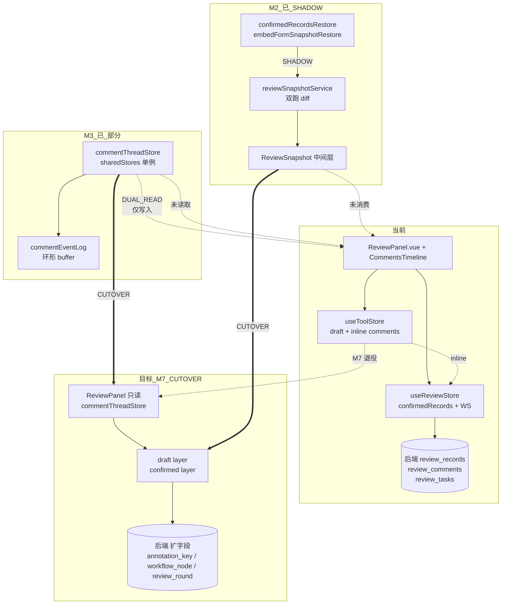
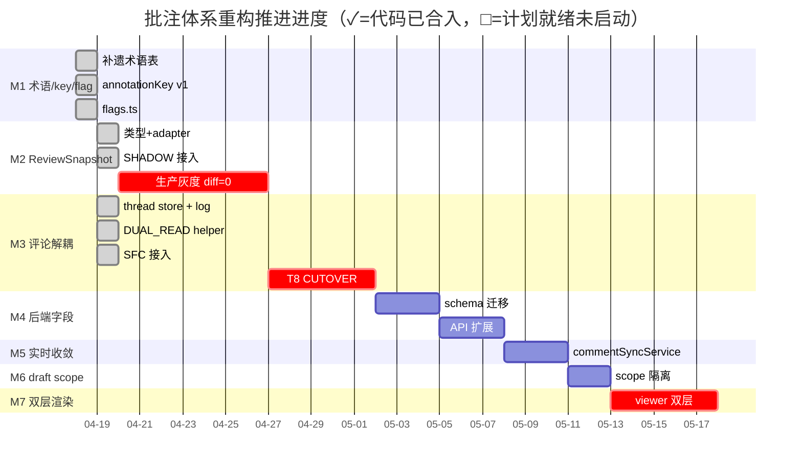
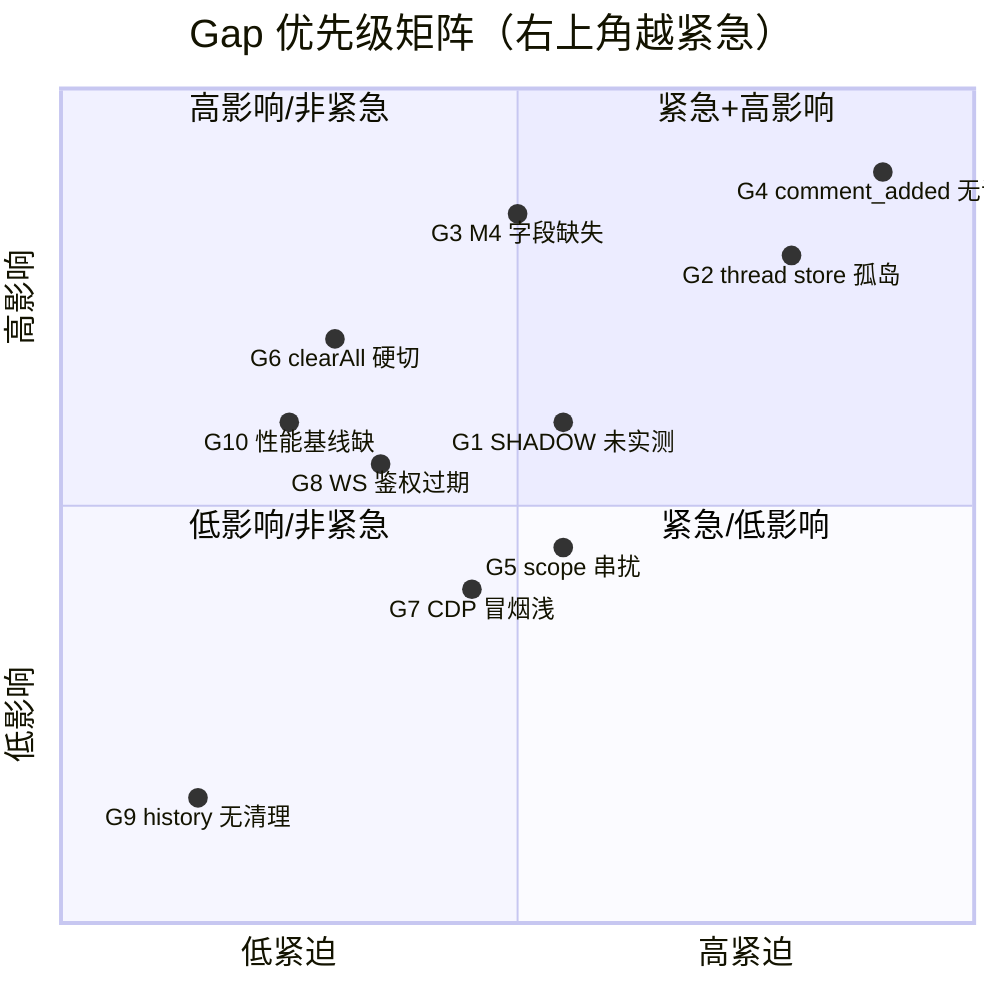
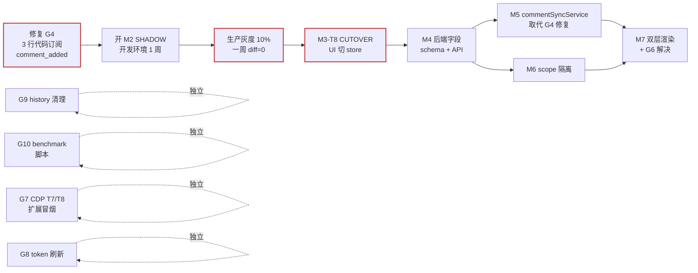

# 三维校审当前实现 Gap 分析与完善建议

> 日期：2026-04-19  
> 范围：`plant3d-web` 前端 + `plant-model-gen` 后端已落地代码  
> 前置阅读：
> - `三维校审流程与批注处理审核-2026-04-19.md`
> - `三维校审批注交互操作手册-2026-04-19.md`
> - `批注体系重构-M2/M3/M4/M5/M6-执行清单-2026-04-19.md`

## 0. 执行摘要（结论先行）

| 维度 | 结论 |
|---|---|
| 整体 | **已具备端到端可跑通**（契约 5/5 + CDP 冒烟 6/6），但**真源解耦未闭环** |
| 代码落地 | M1 / M2 SHADOW / M3-T1~T7 已合入 main，剩 M3-T8 / M4 / M5 / M6 / M7 全部未动 |
| 高危 Gap | **实时评论失效**（M5）/ **生产 SHADOW 未实测**（M2）/ **thread store 孤岛**（M3-T8）/ **后端字段未扩展**（M4） |
| 运营 Gap | WebSocket 鉴权过期、workflow_history 无清理、cancel_task 不清 records |
| 测试覆盖 | 单测 108+ / 契约 5 / CDP 冒烟 6，但**批注 CRUD / 评论实时 / 断网重连 / 1000 批注性能** 全无覆盖 |
| 推荐节奏 | 先 M3-T8 产出"确认无回归"证据 → 并行推 M4 / M5 → 再 M6 / M7 |

## 1. 代码分层 — 现状 vs 目标



**关键观察**：

- **M2 SHADOW 的中间层已存在但没有消费者**：`ReviewSnapshot` 构造出来只被 service 用于 diff，UI 仍走旧 payload。一旦 CUTOVER，所有 UI 都要切到 snapshot 源。
- **M3 thread store 已存在但 UI 读仍走 inline**：`ReviewCommentsTimeline` 的 watch 只**写**入 store（DUAL_READ 阶段），**读**路径仍是 `useToolStore.getAnnotationComments`。
- **三条数据流并行**：inline (Ax) / snapshot (Bv) / thread store (Cv)，目前三者在内存中各活各的。

## 2. Milestone 推进时间轴



**关键依赖**：`M2 生产灰度 diff=0` 是 M3-T8 的入口；M4 后端字段是 M5 幂等 key 的前置；M6 scope 改动会影响 M7 layer 合并。

## 3. Gap 清单（按影响 × 紧迫性）



### G1. M2 SHADOW 在生产从未实测

- 现状：flag `REVIEW_B_SNAPSHOT_LAYER_SHADOW` 默认 false，打开后会双跑 + diff，但**生产从未开启**。
- 影响：M3-T8 / M4 / M5 后续阶段都依赖 snapshot 产出与旧 payload 字节等价；未验 = 无法进 CUTOVER。
- 建议：开发 / 测试环境先把 flag 设 `1` 跑一周，收集 `dual_read_diff=0` 证据；生产 10% 灰度一周后再 CUTOVER。

### G2. M3 commentThreadStore 是"孤岛"

- 现状：store 单例已就绪，DUAL_READ 写路径（`ReviewCommentsTimeline.watch(allComments)`）已接入，但**读路径仍是 `useToolStore.getAnnotationComments`**。
- 影响：store 对 UI 不生效；真正的评论解耦 = M3-T8 CUTOVER 才闭环。
- 建议：
  1. 在开发环境 `REVIEW_C_COMMENT_THREAD_STORE_DUAL_READ=1` 连跑 3 天，观察 `commentEventLog.snapshot()` 的 `dual_read_diff` 计数；
  2. 若 ≥ 2 个工作日 diff=0，推进 M3-T8.2（读路径切到 store）。

### G3. 后端 metadata 字段（annotation_key / workflow_node / review_round）未扩展

- 现状：前端 M2 adapter 已预留 `SnapshotComment.annotationKey` 等字段，但**后端 review_comments / review_records / review_tasks 均未加字段**，前端永远拿到 undefined。
- 影响：
  - 评论跨快照归并仍依赖 `annotationId`（不稳定）；
  - 无法实现"仅本轮 / 累计全部"过滤（M6 / M7 需要）；
  - 幂等 key 缺失，阻塞 M5 实时收敛。
- 建议：按 M4 清单 §4 schema 迁移先跑一次，字段允许 nullable，前端在 CUTOVER 前不依赖即可无风险发布后端。

### G4. `comment_added` WebSocket 事件**前端 0 订阅**（最高危）

- 现状（代码证据）：

```ts
// useReviewStore.ts:474
case 'comment_added': {
  for (const cb of commentAddedCallbacks) {
    try { cb(message.data); } catch { /* ignore */ }
  }
  break;
}
```

但 `grep onCommentAdded` 在整个 `plant3d-web/src` 中**0 命中**。评论的实时性事实上**不生效**：A 用户发评论 → B 用户必须手动刷新才能看到。

- 影响：多人协同场景产品宣称的"实时评论"是假象，用户感知质量低。
- 建议：按 M5 清单落地 commentSyncService。本阶段**可先做最小修复**：在 `ReviewCommentsTimeline.vue` 里注册 `onCommentAdded` 回调，收到后 `loadCommentsFromBackend()` 重拉 — 3 行代码就能让 P0 级实时性生效。

### G5. `useToolStore` scope 只到 `project + db`，多任务草稿互串

- 现状：`getCurrentStorageScope()` = `project=xxx|db=yyy`（代码位置 `useToolStore.ts:370`）；同项目下切换任务 A → B → A，A 的 draft 可能被 B 覆盖。
- 影响：reviewer 切任务时偶发草稿丢失，尤其在长时间未提交的场景。
- 建议：按 M6 清单落地；过渡期可加**任务切换前弹确认**（一行代码）缓解。

### G6. 确认流程 `clearAll() + replay` 硬切

- 现状：`ReviewPanel.confirmCurrentData()` 成功后调 `useToolStore.clearAll()` 再 `restoreConfirmedRecordsIntoScene(force=true)`。中间窗口 viewer 短暂清空再重建。
- 影响：
  - 视觉上 annotations 会"闪一下"；
  - draft 与 confirmed 没分层，无法支持"局部确认 / 分批确认 / 草稿保留"；
  - 与 review_state 的并发操作窗口难管。
- 建议：按 M7 双层渲染落地；过渡期**不动 UI**，只做 viewer 层的软重建（diff-based replace）。

### G7. Chrome CDP 冒烟**只验证到入口打开**，未覆盖批注 CRUD

- 现状：`scripts/local-pms-cdp-smoke.ts` 6 阶段：`open-simulator / seed-tasks-present / click-add / embed-url-contract / embed-plant3d-ready / refresh-list`。
- 缺口：没验"在 iframe 内画批注 → 保存 → 回到模拟器看列表"。
- 建议：增加 T7 / T8：
  - T7：frame 内调 `window.__plant3dInitiateReviewE2E.addMockComponent`（现有 designer automation hook）→ 点保存 → 断言 `POST /api/review/records` 200
  - T8：切换 JH 用户 → 打开同一 form → 画批注 → 评论 → 送审 → 断言后端数据链

### G8. WebSocket 鉴权过期后**无 token 刷新**

- 现状：`useReviewStore.connectWebSocket` 在 `onclose` 后会自动重连，但如果断开原因是 token 过期，重连**还是用旧 token**，会无限失败。
- 影响：长时间（> 24h）挂起的页面会静默失去实时能力。
- 建议：重连前先 ping `/api/auth/refresh`（若后端提供）或强制重登；前端 `useUserStore.refreshToken()` hook。

### G9. `review_workflow_history` 表无清理策略

- 现状：每次 submit / return / approve / reject 都插 1 行；生产环境长时间任务可能累计数千行。
- 影响：`GET /api/review/tasks/{id}/history` 查询会越来越慢。
- 建议：写定时任务按 `task_status in (approved, cancelled)` + `updated_at < now - 90 days` 清理；或前端分页 + 懒加载。

### G10. 性能基线从未度量

- 现状：补遗 §6 定义了 5 个性能指标（首次 restore < 500ms / 1000 批注 < 2s / 评论拉取 < 200ms / 内存增长 < 20MB / WS → UI < 300ms），但**没有任何基线数据**。
- 影响：M7 双层渲染改造很可能引入性能退化，但没有 baseline 对比。
- 建议：写 `src/review/benchmarks/restore.bench.ts`（M2 清单 A-4 要求）先跑一次 mock 数据，落盘到 `.factory/benchmarks/` 备案。

## 4. 完善路径（推荐执行顺序）



**"独立"轨道（可与主线并行，不阻塞）**：

- G9 history 清理：纯后端 migrate + cron；
- G10 benchmark：纯前端脚本；
- G7 CDP 扩展：测试脚本；
- G8 token 刷新：前后端各一处小改。

## 5. 本轮建议优先落地的 3 件事（零依赖）

### 5.1 G4 3 行修复：订阅 `comment_added` 实现最小实时性

```ts
// src/components/review/ReviewCommentsTimeline.vue setup 内：
onMounted(() => {
  const stop = reviewStore.onCommentAdded((data) => {
    const payload = data as { annotationId?: string; annotationType?: string } | null;
    if (
      payload?.annotationType === props.annotationType
      && payload?.annotationId === props.annotationId
    ) {
      loadCommentsFromBackend();
    }
  });
  onUnmounted(stop);
});
```

代价：一次 HTTP 重拉，但解决"评论不实时"这一 P0 感知问题；等 M5 就绪再换成 store 增量更新。

### 5.2 G7 CDP 扩展：加两个阶段覆盖批注 CRUD

在 `scripts/local-pms-cdp-smoke.ts` 里追加：

- Stage `annotation-write`：frame 内 evaluate 直接调 `fetch('/api/review/comments', ...)` 创建一条评论，断言 `success=true`
- Stage `annotation-read-after-write`：frame 内 evaluate `fetch('/api/review/comments/by-annotation/...')`，断言列表长度 +1

不依赖 UI，快速覆盖核心 API 链。

### 5.3 G10 benchmark 骨架

```ts
// src/review/benchmarks/restore.bench.ts
import { performance } from 'node:perf_hooks';
import { buildSnapshotFromTaskRecords } from '../adapters/reviewRecordAdapter';
import { buildReplayPayloadFromSnapshot } from '../adapters/toolStoreAdapter';

function genRecord(n: number) { /* ... */ }
const record = genRecord(1000);
const t0 = performance.now();
const snap = buildSnapshotFromTaskRecords([record]);
const payload = buildReplayPayloadFromSnapshot(snap);
const t1 = performance.now();
console.log(JSON.stringify({ batch: 1000, elapsed_ms: t1 - t0, payload_len: payload.length }));
```

一次运行即拿到基线，后续每次大改跑一次比对。

## 6. 长期完善（M7 之后）

- **annotation event stream**（补遗 §8 / M3-H8）：把 add/update/delete/commented/confirmed 变更写事件表；当前依赖快照差分成本高。
- **评论 @人、分页、已读态**：Phase D+F 后可展开。
- **跨 task 的评论对比 / 差异视图**：annotation_key 稳定后容易实现。
- **PMS 域外的 reviewer 体验**：非嵌入场景的审核工作台（独立 SaaS），目前全链路绑定 `output_project` 参数，脱离 PMS 后一些默认值（project_id、token）需要新的鉴权源。

## 7. 结论

当前实现已经具备"跑通"的能力（契约 + CDP + 手动演示），但**离"生产级"还差三段**：

1. 把 M2 SHADOW 真正开灰度跑一次（G1）；
2. 把 M3 thread store 从"孤岛"推到 CUTOVER（G2 / M3-T8）；
3. 把 G4 实时性缺陷先用 3 行代码堵住。

这三件事合计 **< 2 人日** 即可把当前 Mission 从"计划完整、代码半熟"推进到"读路径闭环、实时性恢复"，再进入 M4/M5 跨仓阶段。

---

本文件侧重"**已落地代码的完善度**"。规划文件仍在各 Mn 执行清单；操作手册专注"**怎么跑**"；三者互补，请配合阅读。
