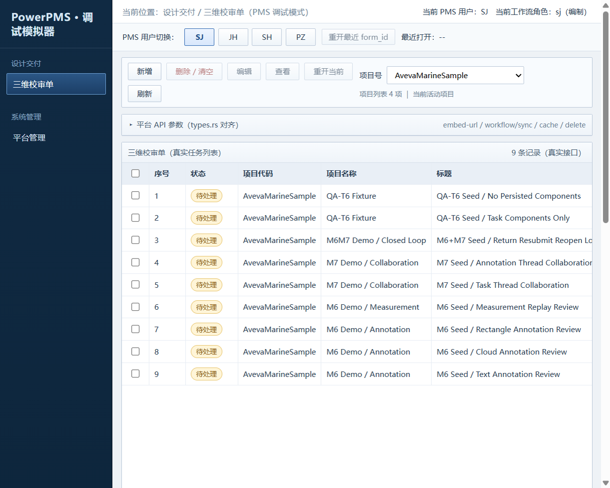
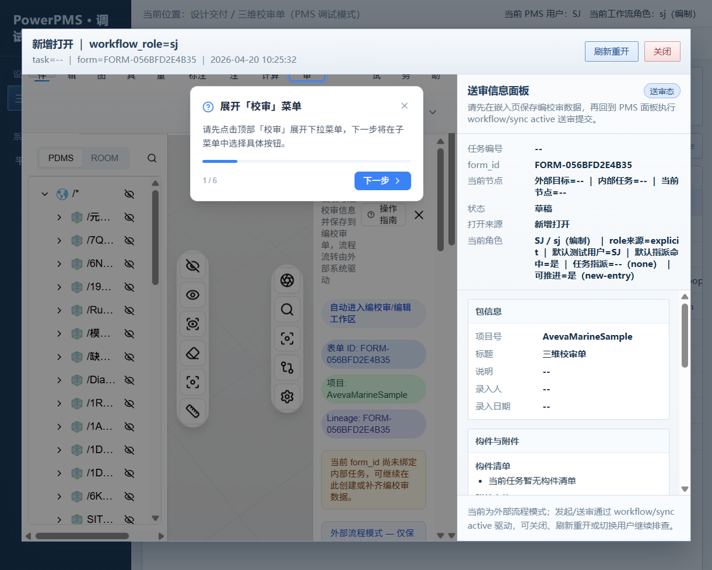
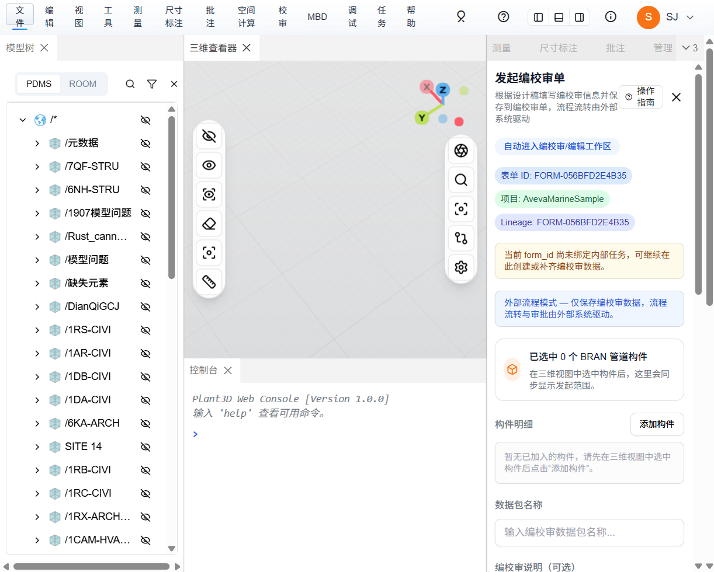
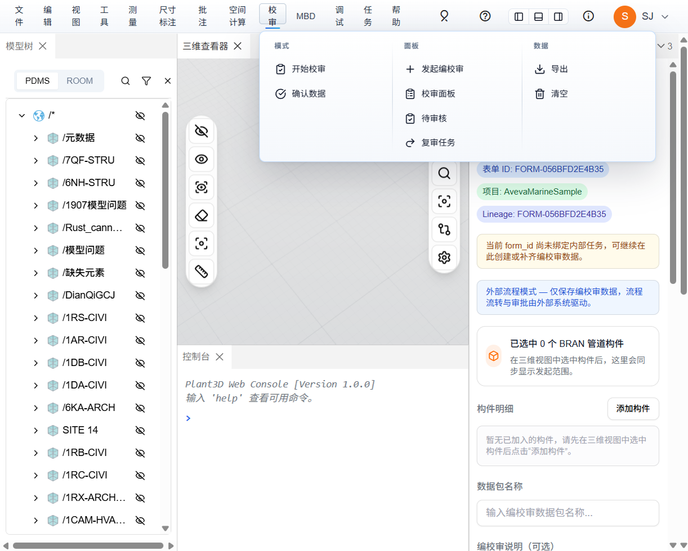
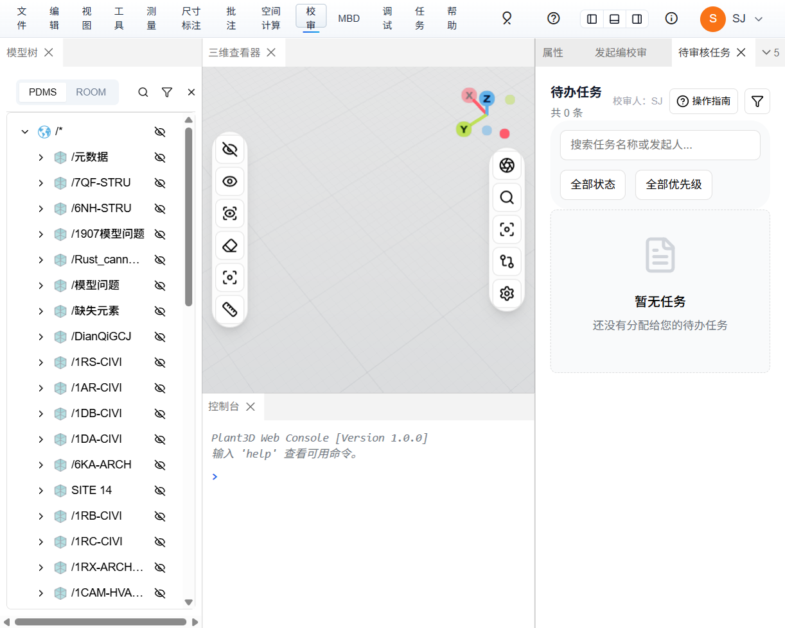
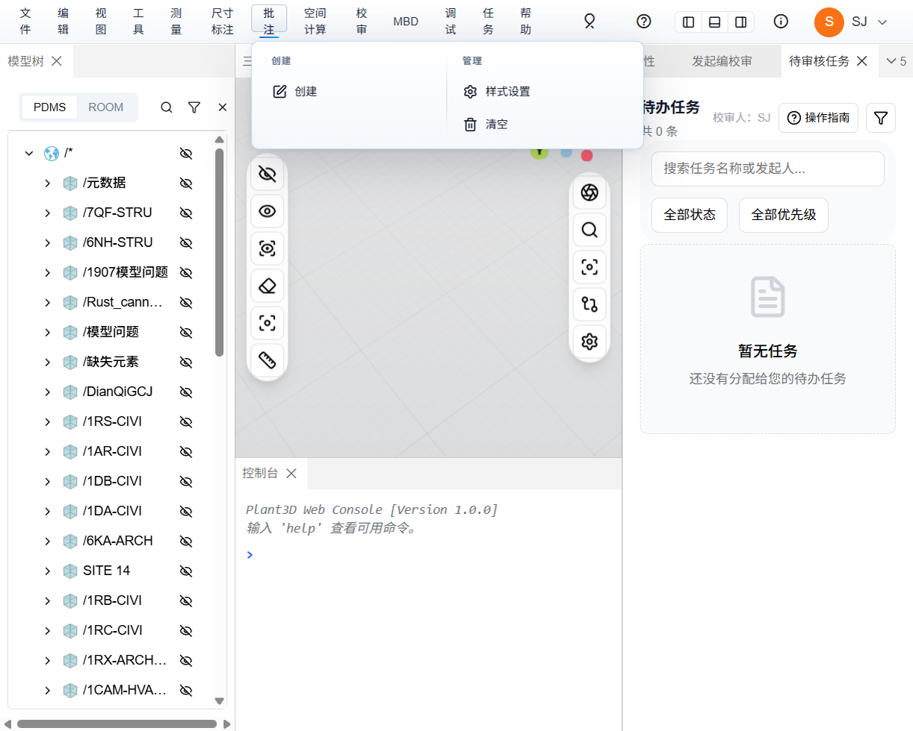
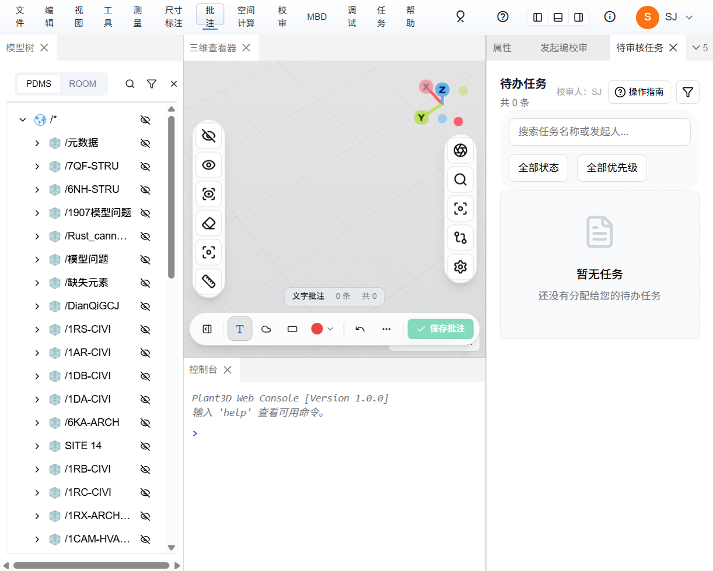
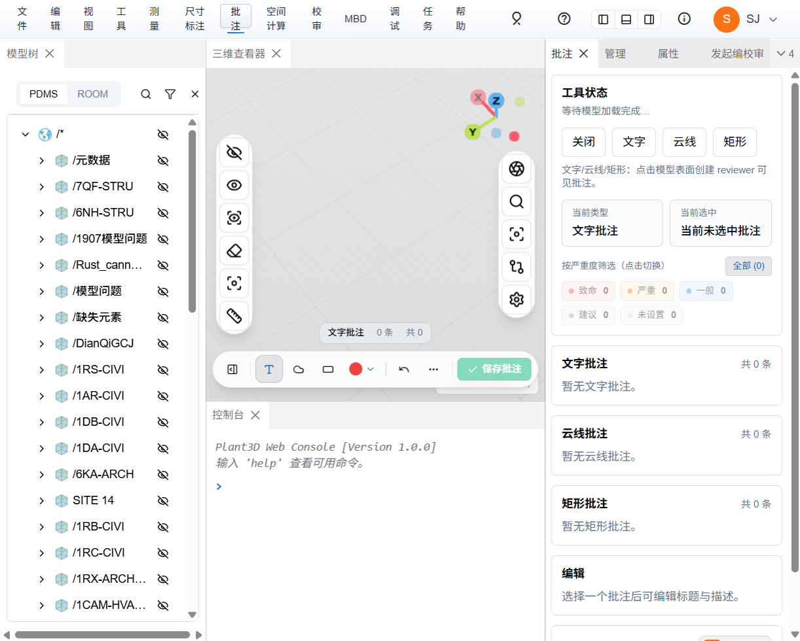

# 三维校审批注交互操作手册（仿 PMS 联调版）

> 日期：2026-04-19  
> 运行环境：`plant3d-web` 前端 vite (3101) + `plant-model-gen` web_server (3100) + 仿 PMS 调试页 `/pms-review-simulator.html`  
> 数据集：`AvevaMarineSample`，后端预置 9 条种子任务  
> 截图目录：`开发文档/三维校审/screenshots/2026-04-19-pms-review/`  
> 关联文档：
> - `三维校审流程与批注处理审核-2026-04-19.md`
> - `批注体系重构-M2/M3/M4/M5/M6 执行清单-2026-04-19.md`

本手册覆盖从仿 PMS 发起三维校审任务到在 `plant3d-web` 里完成批注交互的完整链路；所有截图来自本机真实运行的服务，配合下文操作步骤即可复现。

## 0. 环境准备

```bash
# 1) 启动后端（监听 3100，需开启 web_server feature）
cd plant-model-gen
cargo run --bin web_server --features web_server
# 看到 "🚀 Web UI服务器启动成功 / http://localhost:3100" 即就绪

# 2) 启动前端（监听 3101，vite strictPort）
cd plant3d-web
npm run dev
# 看到 "Local: http://localhost:3101/" 即就绪
```

打开两个入口：

- **仿 PMS 调试页**：<http://localhost:3101/pms-review-simulator.html>
- **plant3d-web 主页**：<http://localhost:3101/?output_project=AvevaMarineSample>

> 路由约定：`pms-review-simulator.html` 对外等价于 PowerPMS 的「三维校审单」菜单；点「新增」会在 iframe 内嵌入一份 `plant3d-web` 并附上 `form_id / workflow_mode / token`。

## 1. 仿 PMS 模拟器：发起任务

### 1.1 登录与任务列表

打开 `/pms-review-simulator.html`：



**关键控件**

| 位置 | 控件 | 作用 |
|---|---|---|
| 顶栏 | `PMS 用户切换` `SJ / JH / SH / PZ` | 切换模拟角色（编/校/审/批），等价于 PMS 登录 |
| 工具栏 | `新增 / 删除 / 编辑 / 查看 / 重开当前 / 刷新` | 对接后端 `/api/review/tasks` 增删改查 + embed-url |
| 工具栏 | `项目号` 下拉 `AvevaMarineSample / AvevaCatalogue / SCB / ZDJ` | 选择 `output_project` |
| 列表 | 9 条种子任务（M6/M7 Seed） | 验证用，含 annotation / measurement / return 闭环场景 |

### 1.2 新增校审单（designer 发起）

依次确认：`PMS 用户 = SJ` / `项目号 = AvevaMarineSample`，然后点工具栏的 **新增**。  
后端响应：生成 `form_id`（如 `FORM-056BFD2E4B35`），iframe 内嵌入 `plant3d-web` 并定位到"发起编校审单"面板。



**观察要点**（对应代码 `src/components/review/embedFormSnapshotRestore.ts`）：

- iframe URL 形如 `http://localhost:3101/?embed=1&form_id=FORM-056BFD2E4B35&workflow_mode=external&token=<JWT>&output_project=AvevaMarineSample`
- 右侧"送审信息面板"显示 `form_id` 与 `当前节点` / `状态=草稿`
- 模拟器会打开 `/api/review/workflow/sync?action=query`（M2 审核报告 §3.2 流程）

## 2. plant3d-web 三维校审工作台

直接访问 `http://localhost:3101/?output_project=AvevaMarineSample` 可跳过 iframe 嵌套，便于演示 UI 交互：



**UI 分区**（左→右）：

| 区域 | 内容 |
|---|---|
| Ribbon 菜单 | `文件 / 编辑 / 视图 / 工具 / 测量 / 尺寸标注 / **批注** / 空间计算 / **校审** / MBD / 调试 / 任务 / 帮助` |
| 左侧面板 | `模型树`（PDMS / ROOM），按节点层级浏览模型；上方搜索与过滤 |
| 中间主区 | `三维查看器`（viewport gizmo、隐藏/显示/X-ray/测量/定位工具条） + `控制台`（底部） |
| 右侧面板 | `发起编校审单`（designer）/ `待审核任务`（reviewer）/ `批注面板`（通用） 等多 tab |

> 右上角头像 `SJ` 是当前登录身份；实际生产环境由 `?user_token=` 承载鉴权。本地默认使用测试账号。

### 2.1 校审功能集入口

点 Ribbon 的 **校审** 菜单：



**3 列分组**

- **模式**：`开始校审` / `确认数据`
- **面板**：`发起编校审` / `校审面板` / **`待审核`** / `复审任务`
- **数据**：`导出` / `清空`

点 **待审核** 打开 reviewer 工作台：



**控件**

- 顶部：`搜索任务名称或发起人` / `全部状态` `全部优先级` / `筛选 / 操作指南`
- 状态枚举：`全部 / 待处理 / 审核中 / 已通过 / 已驳回`（对应后端 `review_tasks.status`）
- 身份说明：当前账号 `SJ`（designer）**没有被指派**为校对/审核人，所以右侧 `共 0 条 / 暂无任务`。  
  → 切换到 JH / SH / PZ 即可看到对应角色待办。

## 3. 批注工具详解

点 Ribbon 的 **批注** 菜单：



- **创建**：激活底部批注工具条（仅当未激活时可见）
- **样式设置**：按钮/线宽/透明度等 UI 样式
- **清空**：清除当前 draft 层全部批注（*不*影响已确认记录）

### 3.1 批注工具条

点 `创建` 后，3D viewer 底部出现工具条：



| 按钮 | 批注类型 | 交互方式 | useToolStore 字段 |
|---|---|---|---|
| `T` 文字 | text | 点击 3D 构件 → 生成锚点 + 文本输入 | `annotations[]` |
| 云 云线 | cloud | 框选一组构件 → 生成云线标记 | `cloudAnnotations[]` |
| 矩形 矩形 | rect | 在 viewport 拉框 → 生成矩形批注 | `rectAnnotations[]` |
| `● 颜色` | — | 修改默认颜色（逐批注生效） | `style` |
| `↶ 撤销` | — | 只撤销 draft 层最后一次操作 | — |
| `⋯ 更多操作` | — | OBB 批注、批量复制等扩展 | `obbAnnotations[]` |
| **`✓ 保存批注`**（绿） | — | 打开 `ConfirmSnapshot` 流程 | 触发 `POST /api/review/records` |

左侧状态条 `文字批注 0 条 ｜ 共 0` 用于展示当前 draft 计数。

### 3.2 批注面板（ReviewPanel）

点工具条最左的 **打开批注面板** 按钮（或从 Ribbon `校审` → `校审面板`），右侧打开：



**三段结构**：

1. **工具状态**（顶部）：
   - `关闭 / 文字 / 云线 / 矩形`：工具切换按钮
   - `当前类型 / 当前选中`：运行态反馈（未选中时显示"当前未选中批注"）
2. **按严重度筛选**：`全部 (0) / 致命 / 严重 / 一般 / 建议 / 未设置`，筛选当前 draft/confirmed 汇总数据（0 条时整栏 disabled）
3. **批注分组列表**：`文字批注 / 云线批注 / 矩形批注`，各自独立计数，支持展开查看列表
4. **编辑区**（底部）：`选择一个批注后可编辑标题与描述`

> 右侧 tab：`批注 / 管理 / 属性 / 发起编校审` 多视图切换；本手册只涉及"批注"tab。

## 4. 完整批注交互流程

> 以 `SJ` 身份在嵌入 form 或直接项目页操作。后端侧数据链：`useToolStore`（draft）→ `/api/review/comments`（评论 CRUD）→ `/api/review/records`（confirmed snapshot）→ `workflow/sync`（PMS 聚合）

### 4.1 创建批注（T 文字批注为例）

```text
Ribbon → 批注 → 创建
       ↓（工具条出现）
工具条 → T 文字批注（高亮选中）
       ↓
3D viewer → 点击目标管段/设备 → 弹输入框 → 填写"管线偏移 30mm"
       ↓
useToolStore.addAnnotation({ entityId, worldPos, title, ... })
       ↓
ReviewPanel 文字批注列表 +1 条
```

*M3-T7 已接入*：当 `REVIEW_C_COMMENT_THREAD_STORE_DUAL_READ=1` 时，`ReviewCommentsTimeline` 的 watch 会自动把 inline 评论同步到 `commentThreadStore`（见 `commentThreadDualRead.ts`）。

### 4.2 发起评论协作（ReviewCommentsTimeline）

在批注列表中点开某条批注 → 右下弹出 `ReviewCommentsTimeline`：

- `输入评论 → Enter` → `POST /api/review/comments`
- `回复` 按钮 → 建立 `replyToId` 关联
- `同意 / 驳回 / 已修改 / 不修改` 四类 `AnnotationReviewAction` → 写入 `AnnotationReviewState.history`

> WebSocket `comment_added` 事件**当前前端无订阅**（见审核报告 §8.2），A 用户新增的评论 B 用户必须**手动刷新**才能看到。M5 commentSyncService 计划解决此问题。

### 4.3 确认并持久化（ConfirmedRecord）

点批注工具条最右的 `保存批注`（绿色）：

```text
ReviewPanel.confirmCurrentData()
  → buildReviewConfirmSnapshotPayload(draft)
  → useReviewStore.addConfirmedRecord(record)
      → POST /api/review/records  （落 SurrealDB review_records 表）
  → useToolStore.clearAll()
      → confirmedRecordsRestore 监听变化
      → buildReviewRecordReplayPayload(records)
      → toolStore.importJSON(...)
      → viewer.syncFromStore()
```

确认后 draft 层清空，已确认 annotations 以只读态重新出现在 viewer；可以继续画新 draft 不影响历史层。

### 4.4 工作流流转

designer 画完批注后，在模拟器右侧填写 `送审说明` → 点 **送审提交**（`workflow/sync action=active`）：

```
sj (SJ) → submit_to_next → jd (JH)
                           → 校对提交 → sh
                                       → 审核提交 → pz (PZ)
                                                   → 批准 → approved
```

各节点 *打回* 使用 `POST /tasks/{id}/return` + `targetNode`；`can_return_to` 只允许回退到更早节点。

> 完整节点矩阵与权限校验见 `三维校审流程与批注处理审核-2026-04-19.md` §2.3 与 §7。

## 5. 切换身份做审核演示

1. 返回模拟器 → 顶部点 **JH** 或 **SH**，模拟 PMS 登录换角色。
2. 列表刷新 → 列表里能看到指派给自己的任务 → 点 **查看** / **编辑**。
3. 嵌入 plant3d → 自动加载 confirmedRecords 作为只读图层（`confirmedRecordsRestore`）。
4. 右侧 `批注` tab → 浏览既有批注 → 点某条 → `评论 / 同意 / 驳回`。
5. 送审提交 `workflow/sync action=agree` 或 `return`。

## 6. 排障

| 现象 | 处置 |
|---|---|
| iframe 里 `/api/*` 502（Connection Refused） | 后端 `web_server` 未起来。检查 `http://localhost:3100/api/version` |
| 待审核列表始终空 | 当前角色不在 `checker_id / reviewer_id / approver_id`。切换 JH/SH/PZ |
| 画不出批注（工具条变灰） | 3D viewer 未就绪；在模型树选一个节点加载模型后再试 |
| 评论列表无实时更新 | WebSocket 无订阅（见审核报告 §8.2）。临时：切换批注再切回强制重拉 |
| PMS 模拟器新增没反应 | 看浏览器 console；`embed-url` 接口依赖后端 JWT 签发 |
| 嵌入 token 过期 | 回到模拟器 → `重开最近 form_id`，或刷新页面获取新 token |

## 7. 数据链核对

可在浏览器 DevTools 的 Network 里直接观察以下接口：

| 时机 | 请求 | 验证点 |
|---|---|---|
| 模拟器新增 | `POST /api/review/embed/url` | 返回 `form_id + token + open_url` |
| iframe 加载 | `POST /api/review/workflow/sync`（`action=query`） | 返回 `records / annotationComments / attachments / models` |
| 画 text 批注 + 确认 | `POST /api/review/records` | 持久化 `ConfirmedRecord` |
| 发评论 | `POST /api/review/comments` | `annotation_id + annotation_type` 为主键 |
| 读评论 | `GET /api/review/comments/by-annotation/{id}?type=` | 按 createdAt ASC 返回 |
| 送审提交 | `POST /api/review/tasks/{id}/submit` | `current_node` 递进、生成 `review_workflow_history` |
| 打回 | `POST /api/review/tasks/{id}/return` | `current_node` 回退、status 回到 `draft` |

## 8. Chrome CDP 自动化回归

手工点击验证完后，用内置脚本跑一次 CDP 冒烟可以**完全复现** §1～§5 的关键契约：

```bash
cd plant3d-web
# 默认有头（便于 DevTools 观察 Network）；CI 建议设环境变量走 headless：
#   $env:SMOKE_HEADLESS='1'   (PowerShell)
#   SMOKE_HEADLESS=1           (bash)
npm run test:pms:cdp:local
```

脚本位置：`scripts/local-pms-cdp-smoke.ts`。  
使用 Playwright 内置 Chromium 走 **Chrome DevTools Protocol**，6 阶段断言：

| 阶段 | 断言点 |
|---|---|
| `open-simulator` | `/pms-review-simulator.html` 可达，title 含 PMS 或 三维校审 |
| `seed-tasks-present` | 列表至少 1 条包含 `Seed /` 的种子任务 |
| `click-add` | 点「新增」后 iframe URL 在 20s 内携带 `form_id=` |
| `embed-url-contract` | iframe URL 必须含 `form_id + user_token + user_id + output_project`（token-primary 口径） |
| `embed-plant3d-ready` | iframe 内 `document.title` 含 `plant3d` |
| `refresh-list` | 「刷新」按钮后列表 ≥ 1 条种子记录（幂等） |

典型通过输出：

```
✓ [open-simulator] 832ms
✓ [seed-tasks-present] 22ms
✓ [click-add] 549ms
✓ [embed-url-contract] 1ms
✓ [embed-plant3d-ready] 1283ms
✓ [refresh-list] 871ms
6/6 阶段通过
```

阶段截图落到 `开发文档/三维校审/screenshots/2026-04-19-pms-review/cdp/`，并生成 `report.json`。

### 附加到已启动的本机 Chrome

如果希望在本机 Chrome 里肉眼观察、同时 CDP 控制，不关窗口：

```bash
# 先用调试端口启动 Chrome（一次性）
"C:\Program Files\Google\Chrome\Application\chrome.exe" --remote-debugging-port=9222 --user-data-dir=%TEMP%\chrome-cdp
# 或 macOS/Linux 用 ./scripts/launch-chrome-cdp.sh

# 再附加执行
$env:CHROME_CDP_URL='http://127.0.0.1:9222'; npm run test:pms:cdp:local
```

附加模式下脚本不会 launch 新 Chromium，而是 `connectOverCDP` 到 9222，用户可在 DevTools 的 Network/Elements/Console 直接观察自动化交互，排障最稳。

### 外网 PowerPMS 全链路（需密码）

本地冒烟不覆盖真实 PowerPMS（[http://pms.powerpms.net:1801](http://pms.powerpms.net:1801)）登录与「新增」弹窗流程。  
需要时改用仓库里已有的 `npm run test:pms:cdp` / `test:pms:cdp:full` / `test:pms:cdp:extended`（见 `docs/verification/pms-3d-review-integration-e2e.md`）。  
这两条脚本与本地冒烟底层都是 Playwright + CDP，区别只在断言目标（真实 PowerPMS vs 仿 PMS 调试页）。

## 9. 扩展阅读

- `三维校审流程与批注处理审核-2026-04-19.md`：当前代码的完整流程与问题清单
- `批注体系重构-M2/M3/M4/M5/M6 执行清单`：解耦真源 / 中间层 / 实时协同 / 后端元数据 / 草稿隔离 的分阶段实施方案
- `docs/verification/pms-3d-review-integration-e2e.md`：PowerPMS 真实入口 Playwright E2E 方案（需内网 PMS 账号）

---

本手册只覆盖"批注交互"核心面向；尺寸标注、测量、空间计算、MBD 等子能力另行撰文。
