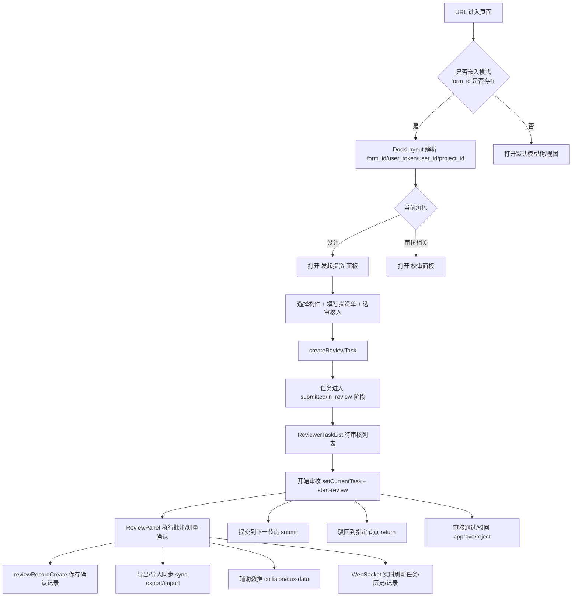

# 三维校审流程与代码审查报告

> 生成时间：2026-03-06  
> 范围：`plant3d-web` 前端三维校审主流程（入口、提资、审核、流转、同步、通知）

## 1. 总流程（端到端）

## 2. 分步骤操作清单（按代码实现）

### 步骤 0：入口识别与面板分流
- 触发：页面加载。
- 前端操作：读取 URL 参数 `form_id/user_token/user_id/project_id`，判定 `isEmbedMode`。
- 分流逻辑：
  - 设计角色：自动打开 `initiateReview`。
  - 审核相关角色：自动打开 `review`。
  - 非嵌入：打开 `modelTree` 与 `viewer`。
- 关键代码：
  - `src/components/DockLayout.vue:21`
  - `src/components/DockLayout.vue:738`

### 步骤 1：发起提资（设计人员）
- 触发：`InitiateReviewPanel` 中点击“创建提资单”。
- 前端操作：
  - 从当前三维选中提取 `refNo`，补齐构件名称/类型（`pdmsGetUiAttr` + 本地兜底）。
  - 填写：数据包名、描述、审核人、优先级、截止时间。
  - 嵌入模式透传 `formId`。
- 调用接口：`POST /api/review/tasks`。
- 状态变化：由后端返回任务状态；本地模式初始为 `draft`。
- 关键代码：
  - `src/components/review/InitiateReviewPanel.vue:28`
  - `src/components/review/InitiateReviewPanel.vue:146`
  - `src/composables/useUserStore.ts:400`

### 步骤 2：待审核任务领取
- 触发：审核人员进入 `ReviewerTaskList`。
- 前端操作：
  - 从 `pendingReviewTasks` 展示 `submitted/in_review` 任务。
  - “开始审核” 主链路：`setCurrentTask(task)` 后先保持 `panel.reviewerTasks` 处于可见状态，再切换到 `panel.review`，避免 app entry -> inbox -> active task 的 smoke path 中断。
  - reviewer 工作区继续展示同一任务的 `formId`、附件、workflow history 等共享上下文，确保 handoff continuity 可观察。
- 调用接口：当前主链路优先走 inbox -> hydrate workbench；后续 reviewer 流转使用标准 `submit` / `return`，而非把 `start-review` 作为必须的入口前置条件。
- 关键代码：
  - `src/components/review/ReviewerTaskList.vue:67`
  - `src/components/review/reviewerTaskListActions.ts:24`
  - `src/composables/useUserStore.ts:477`

### 步骤 3：校审数据确认（批注/测量）
- 触发：在 `ReviewPanel` 执行“确认当前数据”。
- 前端操作：
  - 汇总 `toolStore` 的文字/云线/矩形/OBB 批注与测量数据。
  - 调用 `addConfirmedRecord` 保存后端记录。
  - 清空当前工具数据。
- 调用接口：`POST /api/review/records`。
- 关键代码：
  - `src/components/review/ReviewPanel.vue:445`
  - `src/composables/useReviewStore.ts:141`

### 步骤 4：审批流转（多级节点）
- 节点定义：`sj -> jd -> sh -> pz`。
- 前端操作：
  - 提交下一节点：`submitTaskToNextNode(taskId, comment)`。
  - 驳回指定节点：`returnTaskToNode(taskId, targetNode, reason)`。
  - 并行存在“直接通过/驳回”按钮：`updateTaskStatus(approved/rejected)`。
- 调用接口：
  - `POST /api/review/tasks/{id}/submit`
  - `POST /api/review/tasks/{id}/return`
  - `POST /api/review/tasks/{id}/approve|reject`
- 关键代码：
  - `src/components/review/ReviewPanel.vue:310`
  - `src/components/review/ReviewPanel.vue:323`
  - `src/components/review/ReviewPanel.vue:397`
  - `src/composables/useUserStore.ts:581`

### 步骤 4.1：M2 cross-surface smoke path evidence
- 最小 smoke path：`http://127.0.0.1:3101/` 进入 app -> 点击项目卡片进入主界面 -> 打开 reviewer inbox（`panel.reviewerTasks`）-> 选择 handoff task -> reviewer workbench（`panel.review`）加载 active task -> 继续标准 `submit` / `return` workflow action。
- 可见 continuity 证据：active task 至少保留标题、发起人、checker/approver、构件数、`formId` lineage、附件列表或 workflow history 中的一项 reviewer 可见上下文。
- 对应自动化保障：`src/components/review/reviewerTaskListActions.test.ts` 覆盖了 inbox-to-workbench handoff 顺序，确保 reviewer smoke path 在切换面板前不会丢失当前任务上下文。

### 步骤 5：历史、同步与辅助校审数据
- 前端操作：
  - 加载工作流历史并展示时间线。
  - 后端数据导入导出（`sync/export|import`）。
  - 查询碰撞数据与辅助数据（`collision-data`、`aux-data`）。
- 关键代码：
  - `src/components/review/ReviewPanel.vue:261`
  - `src/components/review/ReviewPanel.vue:98`
  - `src/components/review/ReviewPanel.vue:151`

### 步骤 6：外部三维校审嵌入
- 前端操作：
  - 调用 `reviewGetEmbedUrl(projectId, userId)` 生成外部 iframe 地址。
  - 按 `relative_path + user_token + form_id + user_id + project_id` 拼装 URL。
- 调用接口：`POST /api/review/embed-url`。
- 关键代码：
  - `src/components/review/ExternalReviewViewer.vue:36`
  - `src/api/reviewApi.ts:399`

### 步骤 7：实时通知
- 全局任务通知：`/ws/review`，刷新任务列表。
- 用户专属通知：`/ws/review/user/{userId}`，刷新确认记录/审核历史。
- 关键代码：
  - `src/composables/useUserStore.ts:738`
  - `src/composables/useReviewStore.ts:318`

## 3. 状态与角色（实现视角）

### 3.1 任务状态
- `draft`（草稿）
- `submitted`（待审核）
- `in_review`（审核中）
- `approved`（通过）
- `rejected`（驳回）
- `cancelled`（取消）

### 3.2 审批节点
- `sj` 编制
- `jd` 校对
- `sh` 审核
- `pz` 批准

## 4. Code Review（按 code-review-expert）

## Code Review Summary

- Files reviewed: 10+（核心：`useUserStore`、`useReviewStore`、`ReviewPanel`、`ReviewerTaskList`、`reviewApi`）
- Overall assessment: **REQUEST_CHANGES**

---

## Findings

### P0 - Critical
- 无。

### P1 - High

- **[src/components/review/ReviewPanel.vue:445] 确认记录保存未等待结果，失败时会导致用户数据丢失**
  - `confirmCurrentData()` 调用 `reviewStore.addConfirmedRecord(...)` 后立即 `toolStore.clearAll()`，未 `await` 也无异常处理。
  - 后果：后端写入失败时，本地批注/测量已被清空，形成不可恢复的数据丢失。
  - 建议：改为 `async` + `await`，仅在保存成功后清理本地数据；失败时保留现场并提示重试。

- **[src/components/review/ReviewPanel.vue:397] 审批操作未等待接口返回，UI 会提前清任务**
  - `handleApprove/handleReject` 未 `await userStore.updateTaskStatus`，先执行 `reviewStore.clearCurrentTask()`。
  - 后果：接口失败时界面已显示“处理完成”，造成状态错觉和追踪困难。
  - 建议：加 `loading`、`try/catch`、失败回滚，成功后再清任务。

- **[src/components/review/ReviewPanel.vue:600] 多级流程可被“直接通过/驳回”按钮绕过**
  - 页面同时提供“提交下一节点/驳回指定节点”与“通过/驳回”按钮，且未按当前节点限制。
  - 后果：可能在非终审节点直接 `approved/rejected`，破坏 `sj→jd→sh→pz` 业务闭环。
  - 建议：仅在允许终审的节点显示“通过/驳回”，其他节点仅允许提交/驳回到指定节点。

- **[src/composables/useUserStore.ts:414] 后端创建失败静默回退本地，导致数据分裂**
  - `createReviewTask()` 后端失败后直接走本地创建，不抛错给上层。
  - 后果：用户看到“创建成功”，但任务可能只存在本地内存/本地存储，跨用户不可见。
  - 建议：默认失败即报错；如需离线模式，必须显式提示“离线草稿”。

### P2 - Medium

- **[src/components/review/ReviewerTaskList.vue:50] 刷新按钮未真正刷新后端数据**
  - `refreshTasks()` 仅 `setTimeout` 关闭 loading，未调用 `userStore.loadReviewTasks()`。
  - 建议：改为 `await userStore.loadReviewTasks()` 并处理异常。

- **[src/composables/useReviewStore.ts:199] 删除失败仍删除本地记录，状态不一致**
  - 后端删除失败时，仍执行 `confirmedRecords.value = filter(...)`。
  - 建议：仅在后端成功后删除本地；或显式标记“待重试删除”。

- **[src/composables/useUserStore.ts:46] / [src/composables/useReviewStore.ts:46] 持久化 useBackend 读取后未生效**
  - 两个 store 都把 `USE_BACKEND` 固定为 `ref(true)`，未采用 `persisted.useBackend`。
  - 建议：初始化 `USE_BACKEND` 时使用持久化值，避免配置与行为不一致。

- **[src/api/reviewApi.ts:38] Token 与辅助鉴权信息采用 localStorage 常驻**
  - JWT token 及 `UCode/UKey`（`ReviewPanel.vue:210-215`）在 localStorage 明文持久化。
  - 风险：XSS 场景下泄露长期凭证。
  - 建议：优先 HttpOnly Cookie 或短期内存令牌；至少增加过期/清理机制并降低暴露面。

### P3 - Low

- **[src/api/reviewApi.ts:733] WebSocket URL 构建存在不可达分支**
  - `getBaseUrl()` 总返回非空，`if (!base)` 分支理论上不可达。
  - 建议：简化分支或统一由环境变量驱动，减少维护噪音。

---

## Removal / Iteration Plan

### Safe to remove now
- 项：`reviewApi` 内 `if (!base)` WebSocket 回退分支（低风险冗余）。
- 位置：`src/api/reviewApi.ts:733`、`src/api/reviewApi.ts:748`。

### Defer with plan
- 项：`createReviewTask` 自动本地回退机制。
- 原因：可能被“离线演示”场景依赖。
- 计划：
  1. 增加显式离线开关。
  2. 默认线上失败直接报错。
  3. 离线任务加明显标记与同步入口。

## 5. 结论

当前三维校审主流程已具备“发起-领取-确认-流转-同步-通知”的完整骨架，但在关键动作的异步一致性与流程约束上存在高优先级问题。建议优先修复 P1 项后再继续扩展业务细节。
