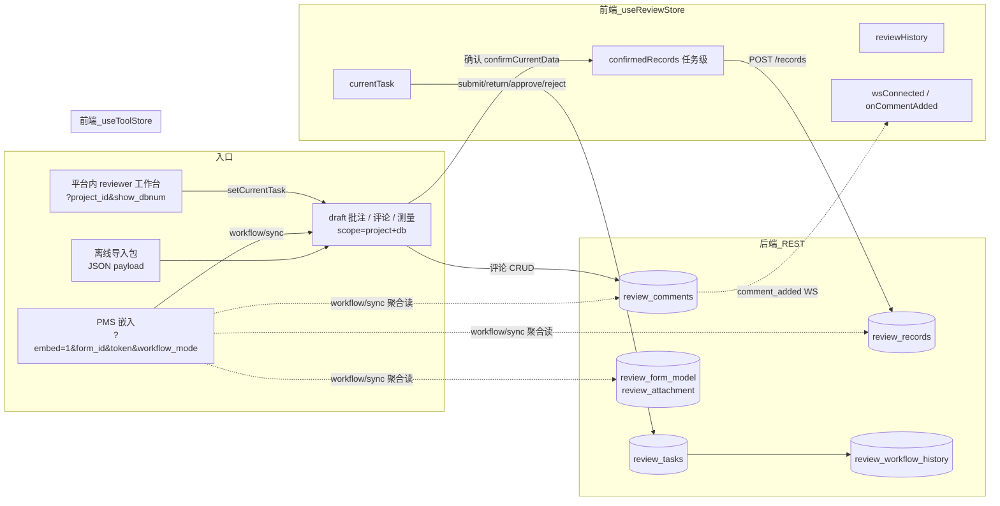
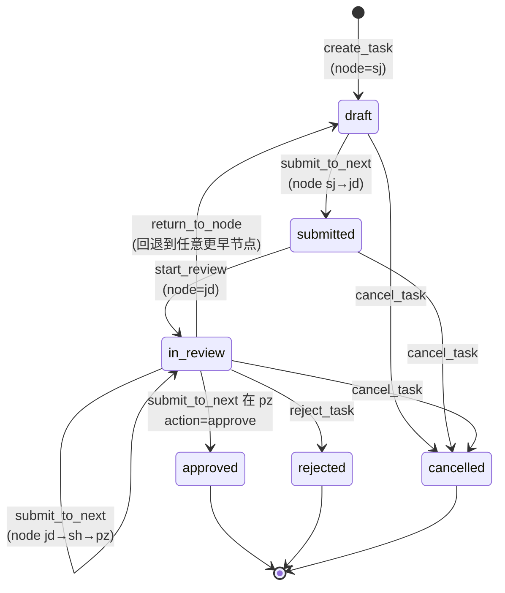
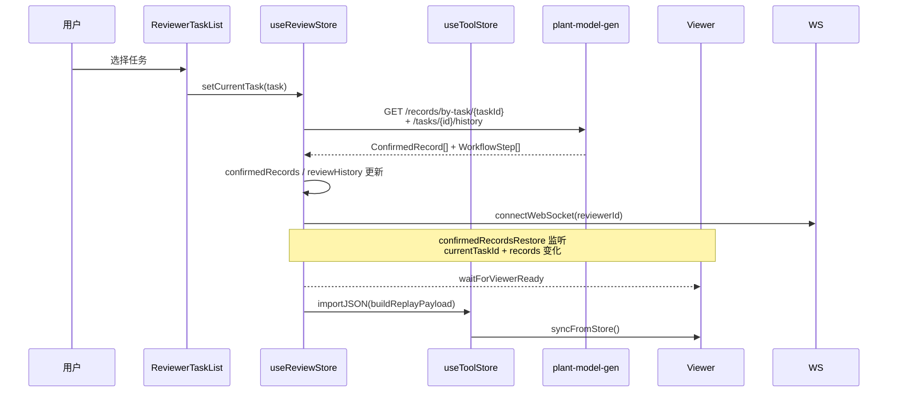
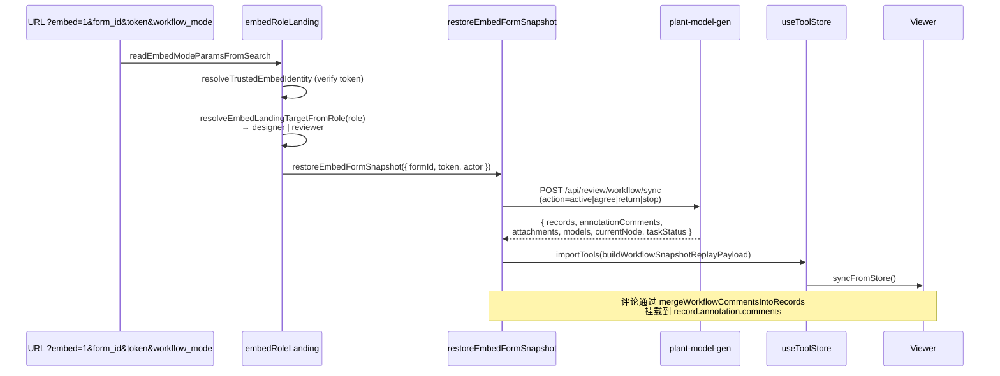
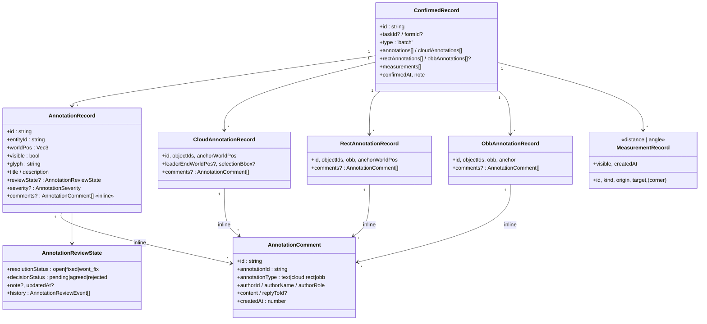
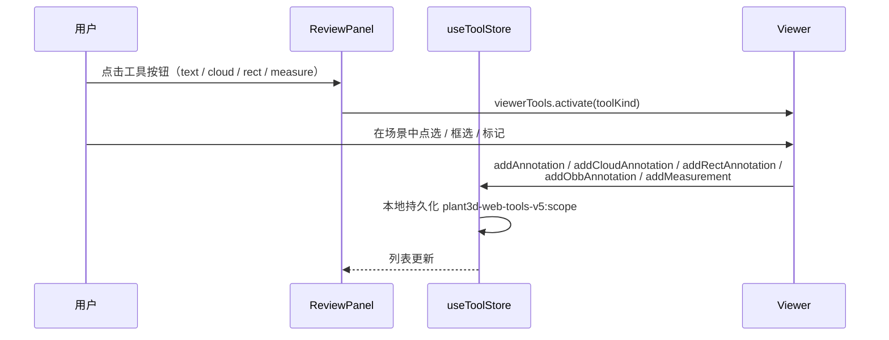
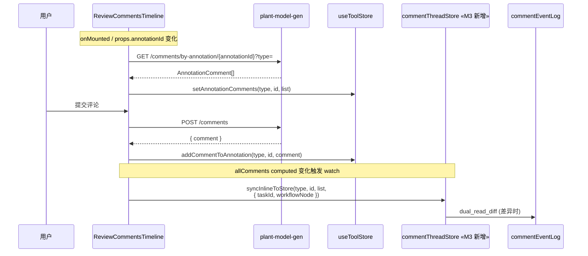
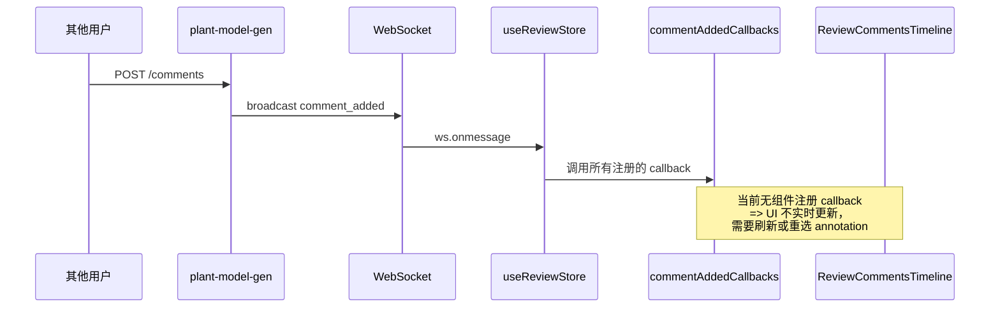
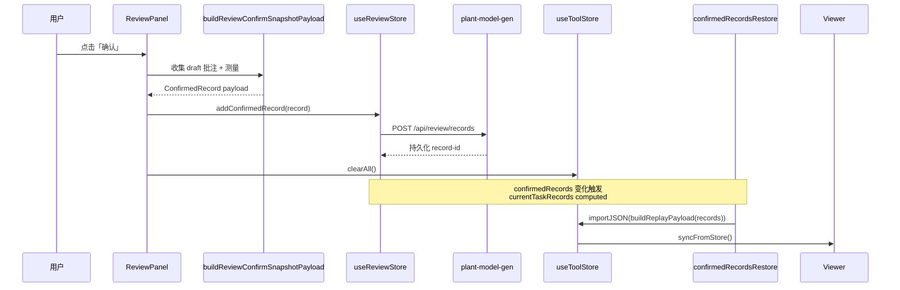
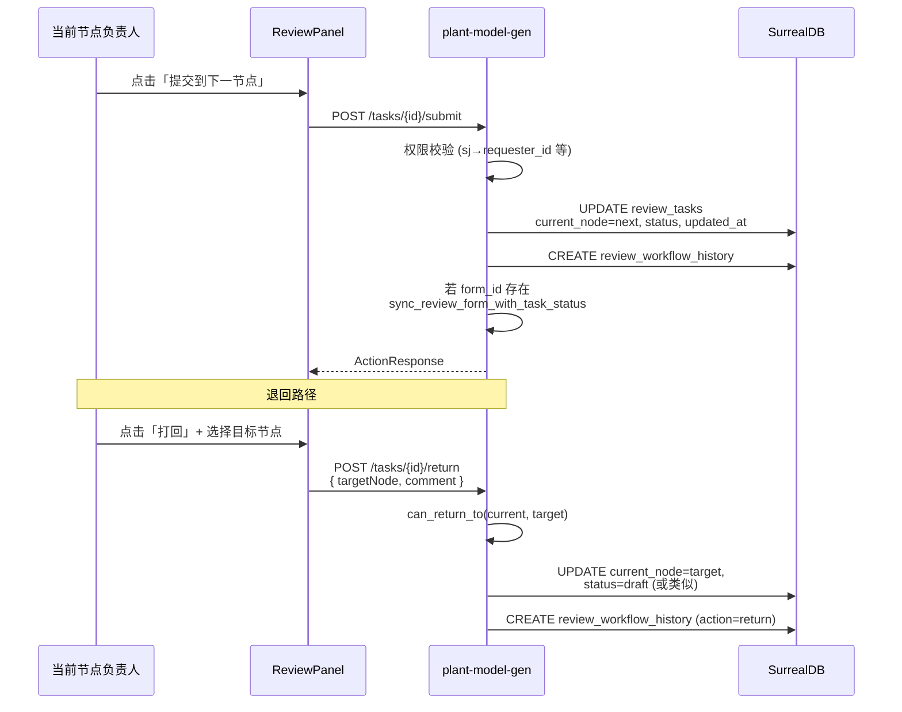

# 三维校审流程与批注处理审核

> 日期：2026-04-19  
> 适用仓库：`plant3d-web`（前端）+ `plant-model-gen`（后端 Rust）  
> 定位：对当前线上代码"三维校审主流程"和"批注体系"做现状梳理。仅描述事实，不重复 M2/M3/M4 重构计划。

## 1. 总览



## 2. 工作流节点与状态机

### 2.1 节点链

线性链路（plant-model-gen `review_api.rs:2670 get_next_node`）：

```
sj (编制) → jd (校对) → sh (审核) → pz (批准) ─┘ end
```

退回（`return_to_node` + `can_return_to`）：当前节点可以退回到任意更早的节点。

### 2.2 任务状态机



### 2.3 角色到节点的权限映射

来源：`submit_to_next_node` 的 `has_permission` 分支（`review_api.rs:2742`）

| 节点 | 允许操作的字段 |
|---|---|
| `sj` | `requester_id` |
| `jd` | `checker_id` 或 `reviewer_id` |
| `sh` | `approver_id` |
| `pz` | `approver_id` |

前端嵌入入口角色映射（`embedRoleLanding.ts:156`）：

| 后端 role | 前端 landing target |
|---|---|
| `sj` | `designer` |
| `jd / jh / sh / pz / admin` | `reviewer` |

## 3. 入口流程

### 3.1 平台内 reviewer 工作台



### 3.2 PMS 嵌入恢复



## 4. 批注实体模型

### 4.1 类图



### 4.2 后端持久化字段

| 表 | 字段（关键） |
|---|---|
| `review_tasks` | id / form_id / current_node / status / requester_id / checker_id / reviewer_id / approver_id / workflow_history (snapshot) / review_comment / created_at / updated_at |
| `review_records` | id / task_id / form_id / type / annotations / cloud_annotations / rect_annotations / obb_annotations / measurements / current_node / operator_id / operator_name / slot_key / snapshot_hash / confirmed_at / note |
| `review_comments` | id / annotation_id / annotation_type / author_id / author_name / author_role / content / reply_to_id / created_at |
| `review_workflow_history` | id / task_id / from_node / to_node / action / actor_id / actor_name / comment / timestamp |
| `review_form_model` / `review_attachment` | workflow/sync 聚合用，含 form_id 维度模型与附件清单 |

> **注意**：`review_records.annotations[i]` 内嵌 inline `comments` 字段；`review_comments` 表本身又是评论的真源——存在双源结构（本审计的核心问题，见第 8 节）。

## 5. 批注 CRUD 时序

### 5.1 在 ReviewPanel 内创建文字/云线/矩形批注



### 5.2 批注评论（DUAL_READ 接入后）



### 5.3 评论实时收敛（**当前缺位**）



## 6. 确认与回放

### 6.1 确认（confirmCurrentData）



### 6.2 任务切换 / 重进时的恢复

`confirmedRecordsRestore.createConfirmedRecordsRestorer` 监听 `currentTaskId + currentTaskRecords + viewer ready`，hash 化为 `restoreKey`，相同时不重复 restore；不同时：

- 空任务（`taskId=null` 或 `records=[]`）→ `clearAll`（受 `skipClearOnEmpty` 控制）
- 非空 → `importJSON(buildReplayPayload)` + `syncFromStore`
- M2 SHADOW 在此处插桩（默认关）；M3 thread store 在此处 `mergeFromSnapshot`（flag 控制）

## 7. 工作流流转时序



## 8. 审核结论

### 8.1 优点

- **职责拆分清晰**：`useToolStore` 专管 draft，`useReviewStore` 专管 task 状态，`reviewApi` 专管 HTTP，`reviewerTaskListActions` 专管选择动作。
- **平台内 + PMS 嵌入**双入口共用同一 viewer 渲染管线（`importJSON → syncFromStore`），降低视图层不一致风险。
- **后端工作流权限按节点细分**（`has_permission` 矩阵），与角色映射一致。
- **回放 hash 去重**（`buildSceneKey`）避免 viewer 重复刷新。

### 8.2 问题（与 M2/M3/M4 重构对应）

| 现状问题 | 已开启的对策 |
|---|---|
| `review_records.annotations[i].comments` 与 `review_comments` 表**双源**，replay/restore 时需重新挂载（`mergeWorkflowCommentsIntoRecords`） | M3 commentThreadStore 解耦（已落地 T1~T7） |
| 评论 inline 字段使 annotation 结构越来越重，导出/导入/合并都要承担 merge 逻辑 | M3 thread store 成为唯一真源（T8 CUTOVER 计划就绪） |
| 平台内（taskId）与外部嵌入（formId）走两套 restore 入口，恢复结果可能不一致 | M2 ReviewSnapshot 中间层 + 两个 adapter（已落地，SHADOW flag 默认关） |
| `comment_added` WebSocket 事件**无组件订阅**（`commentAddedCallbacks` 在前端被搜索 0 命中），评论实时性事实上失效 | M5 commentSyncService 计划就绪 |
| 缺少 `annotationKey` 业务键，annotation 跨快照/跨同步重建后归并依赖 `annotationId`，存在漂移 | M1 v1 已落地；M4 v2 后端权威键计划就绪 |
| 缺少 `review_round`、`workflow_node`（与 `current_node` 区分）字段，无法做"仅本轮 / 累计全部"过滤与节点级归档 | M4 后端 metadata 扩展计划就绪 |
| `useToolStore` 持久化 scope 只到 `project + db`，多任务草稿串扰 | M6 task-scoped draft 隔离计划就绪 |
| 确认成功后 `clearAll() + replay` 硬切，draft 与 confirmed 没有分层 | M7 双层渲染计划（最终阶段，未启动） |

### 8.3 风险点（与重构无关、纯运营层面）

- **WebSocket 鉴权过期** 后只重连不刷 token，重连失败时只能等待用户刷新页面
- **review_workflow_history** 表无清理策略，长期任务历史会持续增长
- **PMS 嵌入** 路径 token 校验失败时 fallback 行为未在 UI 上明确告知用户
- **任务取消** 路径只更新状态，不清理 confirmed records，删除策略不一致

## 9. 关键代码索引

| 主题 | 文件 |
|---|---|
| 任务流转后端 | `plant-model-gen/src/web_api/review_api.rs`（routes `:1014~`、`submit_to_next_node :2691`、`return_to_node :2910`、`get_next_node :2670`） |
| 嵌入聚合后端 | `plant-model-gen/src/web_api/platform_api/workflow_sync.rs`（`sync_workflow_handler :130`） |
| 前端任务列表动作 | `plant3d-web/src/components/review/reviewerTaskListActions.ts` |
| 前端任务态 | `plant3d-web/src/composables/useReviewStore.ts`（WebSocket `:374~487`） |
| 前端工具态 | `plant3d-web/src/composables/useToolStore.ts`（scope `:370`、setAnnotationComments `:1359` 等） |
| 前端确认 / 回放 | `plant3d-web/src/components/review/reviewPanelActions.ts` + `reviewRecordReplay.ts` + `confirmedRecordsRestore.ts` |
| 前端嵌入恢复 | `plant3d-web/src/components/review/embedFormSnapshotRestore.ts` + `embedRoleLanding.ts` |
| 前端评论 UI | `plant3d-web/src/components/review/ReviewCommentsTimeline.vue` |
| M2 ReviewSnapshot | `plant3d-web/src/review/{domain,adapters,services}/*` |
| M3 thread store | `plant3d-web/src/review/services/commentThread*` |

---

本文件聚焦"现状描述 + 审核结论"，重构路径请参见 `批注体系重构-M*执行清单-2026-04-19.md` 系列。
