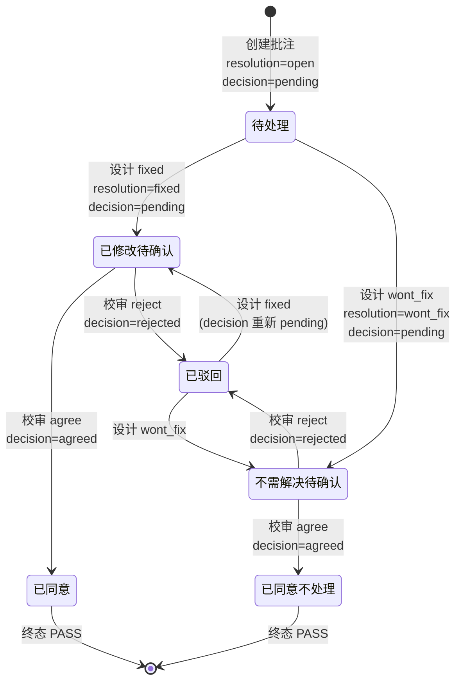
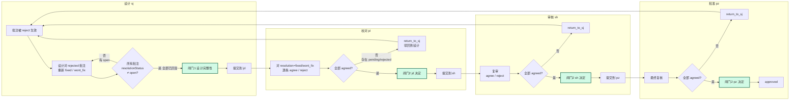
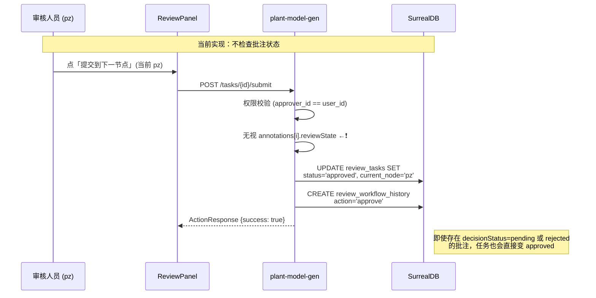
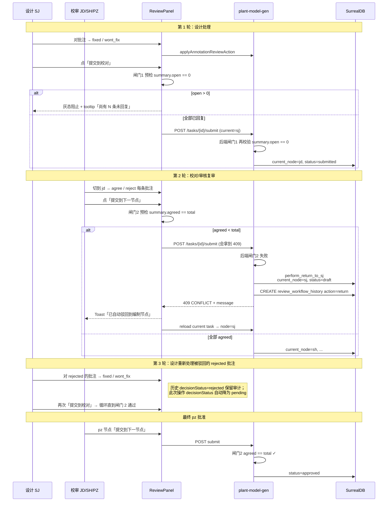

# 批注驳回与批准门控机制审核

> 日期：2026-04-19  
> 适用仓库：`plant3d-web` + `plant-model-gen`  
> 前置阅读：
> - `三维校审流程与批注处理审核-2026-04-19.md`
> - `三维校审当前实现-Gap分析与完善建议-2026-04-19.md`
>
> 关注点：在整个校审流程里，**批注如何被多角色驳回/同意**，以及**批注全通过是否是任务批准的前置条件**。

## 0. 结论先行

- **批注级状态机**（`resolutionStatus × decisionStatus`）已设计完整，前端 UI 按"设计处理 → 校审决定"两段路径正确约束权限；
- **业务完整规则**（来自产品补充）：
  1. 被驳回的批注"生效"后，**设计人员必须对所有批注都回复**（即 `resolutionStatus` 全部脱离 `open`）；
  2. 下一节点人员（jd / sh / pz）**复审**；
  3. **全通过才能送到下一节点**；
  4. 未通过 → **自动驳回到设计人员（`return_to_node targetNode=sj`）**；
- **当前代码与业务规则的差距**：
  - 每一节点 `submit_to_next`（不只是 pz）都**不校验**批注终态 → 任意节点均可被跨端绕过；
  - `return_to_node` 是审核人员**手动**触发的；代码里**没有**"发现 rejected 批注 → 自动 return_to_sj"的链路；
  - 前端 UI **没有**"设计未全部回复 ⇒ 提交到 jd 按钮 disabled"的防御；
  - 后端 `review_records.annotations[]` 内嵌 `reviewState`，**没有**聚合视图支持 O(1) 校验；
- 所以这一业务约束**在前后端都需要补 gate**，否则流程链路事实上是"软约束"而非"硬约束"。

## 1. 批注级状态机（前端 `useToolStore.applyAnnotationReviewAction`）



**关键代码**：

```1208:1263:d:/work/plant-code/plant3d-web/src/composables/useToolStore.ts
function applyAnnotationReviewAction(
  annotationType: AnnotationType,
  annotationId: string,
  payload: {
    action: AnnotationReviewAction;
    actor: AnnotationReviewActor;
    note?: string;
    createdAt?: number;
  }
): AnnotationReviewState | null {
  const record = getAnnotationRecordByType(annotationType, annotationId);
  if (!record) return null;

  const timestamp = payload.createdAt || Date.now();
  const note = payload.note?.trim() || undefined;
  const current = getAnnotationReviewState(annotationType, annotationId);
  const next: AnnotationReviewState = {
    ...current,
    note,
    updatedAt: timestamp,
    updatedById: payload.actor.id,
    updatedByName: payload.actor.name,
    updatedByRole: payload.actor.role,
    history: [
      ...current.history,
      {
        id: `annotation_review_${timestamp}_${Math.random().toString(36).slice(2, 8)}`,
        action: payload.action,
        operatorId: payload.actor.id,
        operatorName: payload.actor.name,
        operatorRole: payload.actor.role,
        note,
        createdAt: timestamp,
      },
    ],
  };

  switch (payload.action) {
    case 'fixed':
      next.resolutionStatus = 'fixed';
      next.decisionStatus = 'pending';
      break;
    case 'wont_fix':
      next.resolutionStatus = 'wont_fix';
      next.decisionStatus = 'pending';
      break;
    case 'agree':
      next.decisionStatus = 'agreed';
      break;
    case 'reject':
      next.decisionStatus = 'rejected';
      break;
  }

  return setAnnotationReviewState(annotationType, annotationId, next) ? next : null;
}
```

`reject` 只把 `decisionStatus` 改为 `rejected`，**不会**自动回滚 `resolutionStatus`。设计人员需要**再次处理**（改回 `fixed` 或 `wont_fix`），批注才能再次进入校审决定环节。

## 2. 权限矩阵（前端 `ReviewCommentsTimeline.vue`）

| 当前用户角色 | 可见动作 | 允许条件 |
|---|---|---|
| `DESIGNER` / `ADMIN` | `fixed` 已修改、`wont_fix` 不需解决 | `canDesignHandle = true` |
| `PROOFREADER` / `REVIEWER` / `MANAGER` / `ADMIN` | `agree` 同意、`reject` 驳回 | `canDecisionAct = canReviewDecide && resolutionStatus !== 'open'` |
| `VIEWER` | — | 仅查看 |

**关键约束**：校审人员**必须**等设计先标记 `fixed / wont_fix` 后才能点 `agree/reject`；否则按钮灰（`canDecisionAct=false`）。这符合"先处理后决定"的业务语义。

## 2.5 完整业务规则：每节点双闸门



**双闸门语义**：

| 闸门 | 位于 | 校验条件 | 目前代码状态 |
|---|---|---|---|
| 闸门 1：**设计完整性** | 设计 → 校对（sj→jd 提交） | 所有批注 `resolutionStatus ∈ {fixed, wont_fix}`（不能有 `open`） | ❌ 未实现 |
| 闸门 2：**校审全通过** | jd → sh、sh → pz、pz → approved | 所有批注 `decisionStatus = agreed` | ❌ 未实现 |
| 失败处置 | 闸门 2 不通过 | **自动** `return_to_node(targetNode=sj)` | ❌ 未实现（当前需人工点"打回"） |

**关键澄清**（回应业务规则）：

- 设计在 sj 节点"回复"= 对批注执行 `fixed` 或 `wont_fix` 动作（前端 `canDesignHandle`）；
- "回复全"指 **每一条** 批注 `resolutionStatus ≠ open`；
- 校审"全通过"指 **每一条** 批注 `decisionStatus = agreed`（`wont_fix + agreed = 已同意不处理` 也算通过）；
- 只要校审节点做了**任何 `reject`**，闸门 2 必定失败 → **自动退回 sj 重新处理**；
- `return_to_sj` 触发后，rejected 批注的 `decisionStatus` **不重置**，保留审计；设计对其重新 `fixed/wont_fix` 时 `decisionStatus` 自动退回 `pending`（见 §1 `applyAnnotationReviewAction` 代码）。

## 3. 任务级流转现状（`plant-model-gen`）



**关键证据**：`submit_to_next_node`（`review_api.rs:2691`）的实现里**只校验操作者是否为节点负责人**（参见 §1.2 权限表），没有任何 `annotations.every(a => a.decisionStatus === 'agreed')` 的 SurQL 断言。

## 4. Gap 清单

| ID | Gap | 影响 | 优先级 |
|---|---|---|---|
| **A** | **每个节点**"提交到下一节点"按钮**永远可点**，不 disable（不只是 pz） | UI 误导：jd/sh/pz 三个节点都能误操作 | P0 |
| **B** | 前端调用 `reviewTaskSubmitToNext` 前**不预检批注状态** | 键盘 / 自动化 / API 绕过 UI | P0 |
| **C** | 后端 `submit_to_next_node`（**所有节点**）**不聚合校验批注终态** | 跨端绕过（Postman / 脚本）可强制推进 | P0 |
| **H** | 缺 **闸门 1**（设计完整性）：sj 节点 submit 时**未校验** `resolutionStatus` 全部非 open | 设计可能漏回复就提交 | P0 |
| **I** | 闸门 2 失败时**无自动 `return_to_sj`**；依赖审核员手动点"打回" | 流程割裂、审计缺 | P0 |
| **D** | `review_records.annotations[]` 内嵌 `reviewState`，**后端聚合查询困难** | 校验逻辑需扫 SurQL `array::flatten`，慢 | P1 |
| **E** | 缺少**未决批注清单汇总视图**（按 task 维度） | 审核员无法一目了然看到"还差几条" | P1 |
| **F** | `reject` 只改 decisionStatus，不与闸门 2 联动 | 审核可以"全部驳回"但任务仍挂在当前节点 | P1 |
| **G** | "全部通过"后无**一键确认全部**（仅能一条条操作） | 大批量批注时 UX 差 | P2 |

## 5. 推荐实现（三段式门控）

### 5.1 前端 UI 层（Gap A / B / E / G）

```mermaid
flowchart LR
    A[ReviewPanel 汇总<br/>pendingCount/<br/>rejectedCount] -->|>0| B[提交按钮灰显<br/>title=尚有 N 条未通过]
    A -->|=0| C[提交按钮亮起<br/>点击前二次确认]
    C --> D[POST /tasks/{id}/submit]

    E[未决批注侧栏]
    E --> F[点击跳转到批注]
    E --> G[一键确认全部<br/>批量调 agree]
```

**具体落地**：

1. `useToolStore` 暴露 `getAnnotationReviewSummary(taskId)`：
   ```ts
   {
     total,
     open,        // resolutionStatus=open → 设计未回复
     pending,     // decisionStatus=pending → 校审未决
     agreed,
     rejected,
     // 闸门状态
     blockingSj: open > 0,            // sj 节点 submit 被拦
     blockingReview: agreed < total,  // jd/sh/pz 节点 submit 被拦
   }
   ```
2. `ReviewPanel.vue` 顶部加 `AnnotationReviewSummaryBar`：展示 `已同意 32 / 共 40`，细分 `未回复 3 / 未决 2 / 已驳回 3`，每类点击跳转对应批注。
3. **sj 节点**："提交到校对"按钮：`:disabled="summary.blockingSj"`；tooltip：`尚有 ${summary.open} 条批注未回复`。
4. **jd / sh / pz 节点**："提交到下一节点"按钮：`:disabled="summary.blockingReview"`；tooltip：`尚有 ${summary.pending + summary.rejected} 条批注未通过，点击会自动驳回到编制`。  
   *设计考量*：保留按钮可点但灰，点击后走后端 gate（闸门 2）自动 return_to_sj，UI 弹 toast 通知"已自动驳回到编制节点"。
5. 新增 `一键确认全部` 按钮（jd / sh / pz 节点可见）：弹出确认框 → 批量调 `applyAnnotationReviewAction(..., action: 'agree')` + 批量 POST 到后端。

### 5.2 前端 API gate（Gap B）

在 `reviewTaskSubmitToNext` 调用前加 `assertAnnotationsAllAgreed(taskId)`：

```ts
// src/api/reviewApi.ts
export async function reviewTaskSubmitToNextWithGate(taskId: string, payload: SubmitToNextRequest) {
  const summary = await reviewTaskAnnotationSummary(taskId);  // 新增聚合接口
  if (summary.blocking) {
    throw new ReviewGateError(`还有 ${summary.pending + summary.rejected} 条批注未全部通过`);
  }
  return reviewTaskSubmitToNext(taskId, payload);
}
```

### 5.3 后端强制校验（Gap C / D）

**数据层改造（Gap D）**：在 `review_records` 表外新增聚合 view / SurQL 函数：

```surql
-- 定义一个聚合视图，把嵌入在 annotations[] 内的 reviewState 抽出来
-- 返回四段计数：open（未处理） / pending（已处理但未决） / agreed / rejected
DEFINE FUNCTION fn::annotation_review_summary($task_id: string) {
  LET $records = SELECT * FROM review_records WHERE task_id = $task_id;
  LET $all_ann = array::flatten(
    $records.map(|$r| array::concat(
      $r.annotations ?? [],
      $r.cloud_annotations ?? [],
      $r.rect_annotations ?? [],
      $r.obb_annotations ?? []
    ))
  );
  RETURN {
    total:    array::len($all_ann),
    -- 闸门 1：resolutionStatus 仍为 open（或缺失）→ 设计未回复
    open:     array::len($all_ann.filter(|$a|
                 $a.reviewState.resolutionStatus = NONE
                 OR $a.reviewState.resolutionStatus = "open")),
    -- 闸门 2：decisionStatus 状态
    agreed:   array::len($all_ann.filter(|$a| $a.reviewState.decisionStatus = "agreed")),
    rejected: array::len($all_ann.filter(|$a| $a.reviewState.decisionStatus = "rejected")),
    pending:  array::len($all_ann.filter(|$a|
                 $a.reviewState.decisionStatus = NONE
                 OR $a.reviewState.decisionStatus = "pending"))
  };
};
```

**API 层 gate（Gap C / H / I）**：在 `submit_to_next_node` 中按 `current_node` 分别插入**闸门 1 / 2**：

```rust
// review_api.rs:2737 附近（current_node 获取之后）
let summary = fn_annotation_review_summary(&id).await?;

match current_node.as_str() {
    "sj" => {
        // 闸门 1：设计完整性 —— 全部批注必须脱离 open
        if summary.open > 0 {
            return (StatusCode::CONFLICT, Json(ActionResponse {
                success: false,
                message: None,
                error_message: Some(format!(
                    "尚有 {} 条批注未回复（处于待处理状态），请先逐条标记「已修改」或「不需解决」",
                    summary.open,
                )),
            }));
        }
    }
    "jd" | "sh" | "pz" => {
        // 闸门 2：校审全通过 —— agreed 必须等于 total
        if summary.agreed != summary.total {
            // 业务规则：未通过 → 自动驳回设计（return_to_sj）
            let auto_return_msg = format!(
                "「{}」节点发现 {} 条未通过批注（pending={} rejected={}），按流程已自动驳回到编制节点",
                get_node_display_name(&current_node),
                summary.total - summary.agreed,
                summary.pending, summary.rejected,
            );
            // 直接内部调用 return 逻辑（避免 HTTP 二次跳转）
            perform_return_to_sj(&id, &op_id, &op_name, &auto_return_msg).await?;

            return (StatusCode::CONFLICT, Json(ActionResponse {
                success: false,
                message: Some(auto_return_msg.clone()),
                error_message: Some(auto_return_msg),
            }));
        }
    }
    _ => {}
}
```

`perform_return_to_sj` 是对 `return_to_node` 的内部封装：设置 `current_node='sj'`、`status='draft'`、`CREATE review_workflow_history(action='return', comment=<auto_return_msg>)`。

**两条规则合计覆盖**：

1. 设计没回复完 → 闸门 1 返回 409，UI 弹提示；
2. 校审没全通过 → 闸门 2 触发自动 return_to_sj，UI 显示"任务已自动驳回到编制节点"。

## 6. 交互时序（推荐版 · 双闸门 + 自动驳回）



## 7. 实施注意事项

### 7.1 历史任务的向后兼容

- 已经 `approved` 的老任务可能含 `decisionStatus=pending` 的批注（之前无约束），新 gate 启用后不可回写。
- 后端校验要加**特性开关**：`REVIEW_GATE_PZ_ALL_AGREED` 默认 false，逐步在测试 → 新项目 → 全量启用。

### 7.2 与重构 Mission 的交叉

- Gap D 的"聚合查询困难"在 **M4 后端 metadata 扩展** 到位后可显著简化：`review_comments / review_records` 都带 `review_round`，可按轮次过滤；`annotation_key` 也可作为稳定聚合键。
- 建议把"批注门控"作为 **M4 之后的一项独立 feature**（不在 M1~M7 主线上，是增量强化）。

### 7.3 UI 细节

- `rejected` 状态单独高亮（红）并可一键跳转到该批注；
- "已同意不处理"（decision=agreed + resolution=wont_fix）计入 `agreed` 统计；
- `wont_fix` 但 `decision=pending` 不计入 `agreed`，提交门控仍拦截；
- 显示剩余条数时按 `annotationType` 分组，避免混淆：`文字 2 / 云线 1 / 矩形 0`。

### 7.4 rejected 与任务节点的关系（业务规则对齐）

按用户补充的业务规则，采用 **"批准门控失败即自动退回"** 策略：

- 审核人员在任一节点做 `reject` **只改批注级**，任务节点不变；
- 审核人员点"提交到下一节点"时：
  - 闸门 2 发现 `agreed < total` → **后端自动触发 `perform_return_to_sj`**；
  - 一次性退回，不分条；
- 被 return 的任务 `current_node=sj, status=draft`；
- 设计对 `rejected` 批注重新 `fixed / wont_fix` 时，`decisionStatus` 由代码自动降为 `pending`（见 §1），`resolutionStatus` 更新为新值；
- 审核历史（`review_workflow_history`）保留每次 return 的 `comment`（见 §5.3 `auto_return_msg`），审计完整。

这既避免了"一次 reject 就 return"的频繁回退，也解决了"审核全部决定完再提交却被 pending 绕过"的漏洞。

## 8. 落地任务拆分（建议）

| 任务 | 归属 | 预估 |
|---|---|---|
| T1 `useToolStore.getAnnotationReviewSummary(taskId)` + 单测（`open/agreed/rejected/pending/blockingSj/blockingReview` 六字段） | 前端 | 1 人日 |
| T2 `ReviewPanel` 顶部 `AnnotationReviewSummaryBar` + 跳转 | 前端 | 1 人日 |
| T3 `submit` 按钮按 `current_node` 分别使用 `blockingSj / blockingReview` 灰态 + tooltip | 前端 | 0.5 人日 |
| T4 后端 409 + 自动 return 后的 Toast + 任务状态刷新 | 前端 | 0.5 人日 |
| T5 "一键确认全部" 批量 action（jd/sh/pz 可见） | 前端 | 0.5 人日 |
| T6 SurQL `fn::annotation_review_summary`（`open + agreed + rejected + pending + total`） | 后端 | 1 人日 |
| T7 `submit_to_next_node` 闸门 1（sj）+ 闸门 2（jd/sh/pz 含 `perform_return_to_sj`） | 后端 | 1.5 人日 |
| T8 集成测试：  \- sj 未回复 → 被拦（闸门 1）  \- jd/sh/pz 未全通过 → 自动 return_to_sj  \- flag on/off 对比  \- 历史 rejected 批注重新处理后的 decisionStatus 自动 pending 行为 | 测试 | 1.5 人日 |
| T9 文档：更新操作手册 §4 / §5，明确双闸门 + 自动回退语义 | 文档 | 0.5 人日 |

**合计约 8 人日**；建议 `REVIEW_GATE_ALL_NODES` 默认 false 发布 2 个周期验证，再默认开。

## 9. 结论与下一步

用户的完整业务规则：

> 被驳回后，批注生效了之后，设计人员需要对所有的批注都进行回复，然后下一个节点的人员进行复审，如果全通过了才能送到下一个节点，否则就是驳回到设计人员。

对应代码状态：

- 批注级状态机 ✓（已完整）
- 闸门 1：sj 提交前"全回复" ✗（未实现）
- 闸门 2：jd/sh/pz 提交前"全通过" ✗（未实现）
- 闸门 2 失败自动 return_to_sj ✗（未实现，目前需人工点打回）

**落地节奏**：

- 短期（~2.5 人日）：**只做前端**（T1~T5），即使后端未上 gate，也能在 UI 上消除 80% 误操作；缺点：跨端仍可绕过；
- 中期（~5 人日）：**补齐后端 gate**（T6~T7），双端对齐，消灭绕过路径；
- 长期：等 **M4 metadata 扩展** 到位后，把 `annotation_key/workflow_node/review_round` 字段带入，可按轮次过滤"仅本轮"通过率，并把嵌入式 `reviewState` 独立成表让 `fn::annotation_review_summary` 从 `array::flatten` 降级为 index 查询。

---

本文件聚焦"批准门控"这一单点问题；全局流程与 Mission 进度见同目录审核报告与 M1~M7 执行清单。
