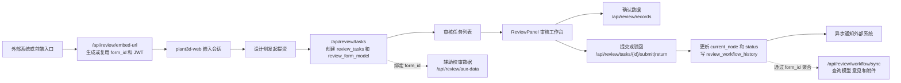
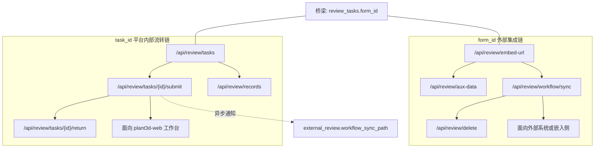

# 新的三维校审流程简版

> **版本**: 2026-03-24 | **涉及仓库**: `plant3d-web`、`plant-model-gen`
> **详细版**: [新的三维校审流程分析](./新的三维校审流程分析.md)（适合深挖实现细节）

## 一页结论

- 当前新流程已经是 `plant3d-web` + `plant-model-gen` 协同的后端驱动方案，不再是旧版文档中的纯前端 mock 流程。
- 跨系统稳定主线索是 `form_id`，平台内部任务流转主线索是 `task_id`。
- 前端真正推进节点用的是 `/api/review/tasks/{id}/submit|return`，不是 `/api/review/workflow/sync`。
- 当前系统同时存在两条不同职责的同步链：
  - `form_id` 型外部集成链
  - `task_id` 型平台内部流转后通知链

## 总览图

## 两条链路

## 关键口径

### `form_id`

- 用于嵌入地址、lineage、辅助校审数据、外部同步、模型/意见/附件聚合查询。
- 它是跨系统共享的业务单据 ID。

### `task_id`

- 用于平台内部任务创建、审核工作台打开、节点流转、确认记录、工作流历史。
- 它是前端工作台真正操作的任务 ID。

### `externalWorkflowMode`

- 默认更偏向外部驱动。
- 在 `external` 模式下，创建提资后只落任务数据，不自动推进内部节点。
- 只有切到 `manual/internal`，才会在创建后自动 `submitTaskToNextNode`。

## 当前实现状态

### 已基本打通

- 嵌入地址获取：`/api/review/embed-url`
- JWT 会话建立：`user_token -> review_auth_token -> /api/auth/verify`
- 任务创建与流转：`/api/review/tasks*`
- 确认记录：`/api/review/records*`
- 工作台实时刷新：WebSocket
- 辅助校审数据：`/api/review/aux-data`

### 仍需注意

- `embed-url` 里还有“暂时关闭 token 校验”的 TODO
- `/api/review/cache/preload` 仍是占位实现
- `aux-data` 当前主要只有碰撞数据更接近可用，`quality` / `otverification` / `rules` 仍偏占位
- “workflow sync” 这个词容易造成误解，建议后续文档拆成“单据数据同步”和“任务状态通知”

## 推荐对外表述

如果给产品、联调或管理侧只讲一句话，可以用下面这句：

> 当前新三维校审流程是先通过 `form_id` 建立跨系统单据 lineage，再在平台内部围绕 `task_id` 完成工作台审核操作，最后把任务状态和意见数据按需同步回外部系统。
