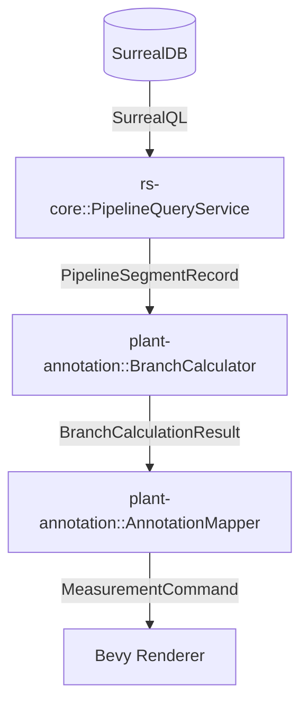

# 管道等轴测标注计算与查询设计

本文档记录管道标注系统中的数据查询逻辑、几何计算流程以及相关的兜底策略。

## 1. 数据架构概览

标注系统通过 `rs-core` 与 SurrealDB 交互，获取管道分支（BRAN）及其下属管段（Pipeline Segments）的数据，并在 `plant-annotation` 中进行几何计算。



## 2. 数据查询逻辑 (`rs-core/src/rs_surreal/pipeline.rs`)

### 2.1 元件位置获取策略

由于模型数据的完整度不同，系统采用了多层位置兜底策略以确保在只有 PE 数据时也能进行基础标注：

| 优先级 | 数据来源 | 适用场景 |
| :--- | :--- | :--- |
| **1. 高** | `inst_info.ptset` | 完整模型生成后，具有详细的端口局部坐标。 |
| **2. 中** | `HPOS` / `TPOS` 属性 | BRAN 元件本身自带的 Head/Tail 坐标值。 |
| **3. 低** | `tubi_relate.world_trans` | **核心兜底逻辑**：利用元件间的拓扑连接点推断位置。 |

### 2.2 连接点位置映射逻辑（Tubi 兜底）

在没有几何点位数据时，利用 `tubi_insts`（即 `tubi_relate` 表的查询结果）重建连接关系：

1.  **Arrive 位置**: `tubi_insts[i].leave` 元件的 `arrive` 点 = 当前连接点（`world_trans.translation`）。
2.  **Leave 位置**: `tubi_insts[i].leave` 元件的 `leave` 点 = 下一个连接点（`tubi_insts[i+1].world_trans.translation`）。

```rust
// 简化后的代码逻辑
for i in 0..tubi_insts.len().saturating_sub(1) {
    let current_leave_refno = &tubi_insts[i].leave;
    let next_connection_pos = tubi_insts[i + 1].world_trans.translation;
    leave_from_tubi.insert(current_leave_refno.clone(), next_connection_pos);
}
```

## 3. 几何计算逻辑 (`plant-annotation/src/calculator/mod.rs`)

### 3.1 焊缝识别 (Weld Identification)

基于管段间的物理间距进行自动识别。

*   **识别规则**: 判断相邻两个管段 `seg1.leave` 与 `seg2.arrive` 的世界坐标距离。
*   **阈值**: 为了兼容精度误差，距离小于 `1.0mm` 即认为存在焊缝。
*   **类型判断**:
    *   **对接焊 (Butt)**: 默认类型。
    *   **承插焊 (Socket)**: 检查属性中是否包含 `SW` (Socket Weld) 关键字。
    *   **角焊 (Fillet)**: 检查是否连接到法兰或支管台。

### 3.2 等轴测线段组织 (Isolines)

将一系列连续的、方向一致的管段组织在一起。

*   **合并规则**: 如果两个相邻管段的 `world_dir` 方向相同，则认为它们在同一个等轴测方向上。
*   **输出**: 供后续布局优化算法（如 `LayoutOptimizer`）进行标注位置摆放。

## 4. 验证结果分析 (典型分支: 24383_73962)

通过上述修复与优化，该分支的标注数据提取结果如下：

| 指标 | 原始状态 (仅 PE) | 优化后 (Tubi 兜底) |
| :--- | :--- | :--- |
| **有坐标的管段** | 1 (仅 BRAN) | 12 (全部) |
| **识别出的焊缝** | 0 | 10 |
| **等轴测线段数** | 2 | 11 |
| **标注点位总数** | 2 | 23 |

## 5. 后续改进计划

1.  **支吊架解析**: 增强对 `HUNG` 和 `SUPP` 类型组件的支撑位置计算。
2.  **坡度标注**: 利用 `world_dir` 的斜率计算管道坡度百分比。
3.  **弯头展开长度**: 进一步优化弯头组件的弧长计算。
