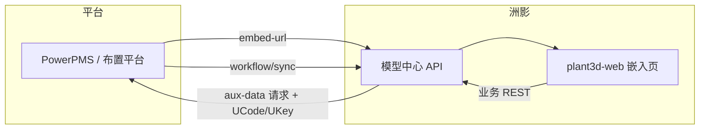

# 接口要求：

> 接口规范统一：为每个接口补充版本号、HTTP方法、路径、状态码约定、错误码与错误信息结构。例如统一使用code、message、data作为响应骨架。

通信协议：当前版本统一使用 HTTP，后续如需切换 HTTPS 再单独评估与升级计划。

> 数据格式：请求与响应应保证合法 JSON，字段命名使用蛇形或小驼峰的一致风格，并与平台现有数据模型保持映射关系。

> 附件与大字段处理：审批意见的云线图片、文件等需走独立的文件上传/下载接口，或采用分片/批量分页策略，避免单次响应过大。

日志与追踪：在双方系统中统一记录请求ID（X-Request-Id），便于问题追踪；错误响应需写入告警。


整体流程图

> 下图与上文配图互补：侧重 **谁调用谁** 与 `**workflow/sync` 的 query 与写入分支**。实现侧：模型中心为 `plant-model-gen`（如 `web_server`），嵌入前端为 `plant3d-web`。


```mermaid
flowchart LR
  subgraph 平台
    PMS[PowerPMS / 布置平台]
  end
  subgraph 洲影
    MC[模型中心 API]
    WEB[plant3d-web 嵌入页]
  end
  PMS -->|embed-url| MC
  MC --> WEB
  PMS -->|workflow/sync| MC
  MC -->|aux-data 请求 + UCode/UKey| PMS
  WEB -->|业务 REST| MC
```


`**POST /api/review/workflow/sync` 的 `action` 约定（与实现对齐）**


| 取值       | 含义                    | 是否写入模型中心审批意见记录    |
| -------- | --------------------- | ----------------- |
| `query`  | 打开/刷新单据，仅查询当前工作流与意见快照 | 否                 |
| `active` | 发起流程                  | 视业务与 comments     |
| `agree`  | 同意                    | 是（有 comments 时落库） |
| `return` | 驳回                    | 是                 |
| `stop`   | 终止                    | 是                 |


根据已经安排和规划的方案，涉及与洲影模型中心的接口清单如下：


|     |            |           |                                                                     |
| --- | ---------- | --------- | ------------------------------------------------------------------- |
| 序号  | 接口/服务 名称   | 接口/服务 提供方 | 内容描述                                                                |
| 1   | 模型数据缓存服务   | 模型中心      | 模型中心需要提供一个可以访问的地址，用于平台切换项目后，前端直接访问模型的地址，触发模型自身的缓存服务。                |
| 2   | 模型嵌入地址获取接口 | 模型中心      | 平台侧调用模型中心提供的模型嵌入审批地址接口，传递项目号、人员信息等参数给模型中心，模型中心依据此返回一个可以直接嵌入平台表单中的地址 |
| 3   | 辅助校审数据接口   | 布置平台      | 模型中心调用平台侧接口，传递项目号、模型参考号或名称等，用于获取对应的辅助校审数据，包括：质量校验、碰撞校验、规则校验、二三维校验。  |
| 4   | 校审信息同步接口   | 模型中心      | 用于推送平台侧的校审信息给模型侧，并接收模型测返回的模型审批意见信息。平台侧接收意见信息后，进行解析存储审批意见。           |
| 5   | 数据删除同步接口   | 模型中心      | 平台侧进行数据删除后，需要调用该接口同步进行模型中心数据的删除动作。                                  |


# 1. 模型数据缓存服务

洲影提供一个接口API，平台端通过POST的方式后端调用该API，传递项目号、操作人员等信息。洲影接收到请求后，开始自行处理数据缓存逻辑。

调用的触发由平台进行用户行为判定：

用户登录系统，开始判定是否在项目节点，如果是，开始后端调用洲影API；

用户切换至项目节点，开始后端调用洲影API。

根据洲影的接口反馈，平台后端调用，例如：

```txt
MethodType: POST  
URL: /api/review/cache/preload  
Body:  
{  
    "project_id": "2410", //项目号  
    "initiator": "kangwp", //当前操作人员  
    "token": "token" //先调 POST /api/auth/token 领到的 JWT（见第 2 节「Token 认证方案」）；不是 SHA256 哈希
}
```

调用洲影的接口后，洲影API需要响应返回API调用是否调用成功，如：

```json
{"code":0,"message":"accepted","data":"task_id":"cache_2410"}
```

如果调用成功，即表示该操作完成，平台即完成操作，无后续动作。

如果调用失败，平台过10s后开始进行重新调用。为了避免一直重试导致失败，仅重试一次，如果还失败，则放弃该项目的缓存API调用。

# 2. 模型嵌入地址获取接口

洲影提供一个接口服务，需要接收对应的项目号、编制人信息，比如：项目号-project_id，编制人-user_id，对接密钥-token。其中，token 使用 **JWT (JSON Web Token)** 方案，由**模型中心签发**（平台先调下文 `POST /api/auth/token` 领取，再原样带进后续每个 S2S 请求体），该值的目的是接口对接校验使用，验证合法访问。

## Token 认证方案 (JWT)

平台使用 JWT (JSON Web Token) 生成 token，支持 token 解码和反向验证。

### JWT Token 结构

```
Header.Payload.Signature
```

**Payload 包含以下字段：**

- `project_id`: 项目号
- `user_id`: 用户ID
- `user_name`: 用户姓名（未传时等于 `user_id`）
- `role`: 角色（可选，未传则无此字段）
- `exp`: 过期时间戳 (Unix timestamp)
- `iat`: 签发时间戳 (Unix timestamp)

> `form_id` **不在** token 里：它由 `/api/auth/token` 与 `embed-url` 的回包 `data.form_id` / `data.query.form_id` 单独回传，页面地址里的 `form_id` 以回包为准。旧版 token 里若带 `form_id`，模型中心只兼容读取、不再签进新 token。

**配置说明：**

- `token_secret`: 在模型中心 `DbOption.toml` 配置文件的 `[model_center]` 部分配置（服务器上 600 权限，不进仓库）
- `token_expiration_hours`: Token 过期时间（小时），默认 24 小时
- 密钥只在模型中心一侧配置、一侧签验；**平台不持有密钥**——平台用到的每一个 token 都是先调 `POST /api/auth/token` 领的。模型中心换密钥 = 已发 token 全部失效，平台重新领取即可，双方不需要同步任何密钥值

### Token 获取接口

支持两种请求格式：

**格式一（新）：**

```txt
MethodType: POST
URL: /api/auth/token
Body:
{
    "username": "testuser",    // 用户ID
    "project": "testproject",  // 项目号
    "role": "admin"            // 角色 (可选)
}
```

**角色 (role) 字段说明：**


| 角色代码    | 含义    |
| ------- | ----- |
| `admin` | 管理员   |
| `sj`    | 设计（编） |
| `jd`    | 校对（校） |
| `sh`    | 审核（审） |
| `pz`    | 批准    |


> **注意：** 如果提供了 `role` 字段，必须是上述有效值之一，否则返回错误。

**响应：**

```json
{
    "code": 0,
    "message": "ok",
    "data": {
        "token": "eyJhbGciOiJIUzI1NiIsInR5cCI6IkpXVCJ9...",
        "expires_at": 1735170000,
        "form_id": "FORM-ABC123DEF456"
    }
}
```

> **`code` 口径**：`/api/auth/token` 与 `/api/auth/verify` 成功回 **`code: 0`**（失败 `code: -1` + HTTP 400/500）；`embed-url` / `workflow/verify` / `workflow/sync` / `delete` 成功回 **`code: 200`**。这是新旧两代模型中心（`plant-model-gen :3100`、`gen-model :8022`）一直以来的实际行为，本文旧版写成统一 200 是笔误。判成功请同时看 HTTP 状态与 `data` 是否存在，不要只比 `code == 200`。

**请求体校验（不满足直接 HTTP 400，`code: -1`）：**

- `project` / `project_id` 与 `username` / `user_id` 必填（两组键名任选其一，混用也收）
- `role` 若提供，只认 `admin / sj / jd / sh / pz`，不区分大小写（`"SJ"` 也可）；传 `designer` 之类回 `Invalid role`
- 请求体必须是 JSON（`Content-Type: application/json`），表单编码会被拒
- `form_id` 可选：传了原样回传，不传由模型中心生成 `FORM-XXXXXXXXXXXX`

**JWT Payload 包含以下字段：**

- `project_id`: 项目号
- `user_id`: 用户ID
- `user_name`: 用户姓名（未传回退为 `user_id`）
- `role`: 角色 (可选)
- `exp`: 过期时间戳 (Unix timestamp)
- `iat`: 签发时间戳 (Unix timestamp)

### Token 验证接口

```txt
MethodType: POST
URL: /api/auth/verify
Body:
{
    "token": "eyJhbGciOiJIUzI1NiIsInR5cCI6IkpXVCJ9..."
}
```

**响应（验证成功）：**

```json
{
    "code": 0,
    "message": "ok",
    "data": {
        "valid": true,
        "claims": {
            "project_id": "2410",
            "user_id": "kangwp",
            "user_name": "kangwp",
            "role": "sj",
            "exp": 1735170000,
            "iat": 1735083600
        },
        "error": null
    }
}
```

**响应（验证失败，仍是 HTTP 200）：**

```json
{
    "code": 0,
    "message": "ok",
    "data": {
        "valid": false,
        "claims": null,
        "error": "ExpiredSignature"
    }
}
```

### 前端解码 Token

JWT Token 的 Payload 部分可以在前端直接解码（Base64），无需密钥：

```javascript
function decodeJwtPayload(token) {
    const parts = token.split('.');
    if (parts.length !== 3) return null;
    const payload = JSON.parse(atob(parts[1]));
    return payload;
}

// 示例
const claims = decodeJwtPayload(token);
console.log(claims.project_id); // "2410"
console.log(claims.user_id);    // "kangwp"
```

## 接口调用示例

平台调用洲影接口时的请求格式如下：

```jsonl
MethodType: POST  
URL: /api/review/embed-url  
Body:  
{  
    "project_id": "2410", //项目号  
    "user_id": "kangwp", //当前操作人员  
    "workflow_role": "sj", //本单据上该用户的工作流角色（sj/jd/sh/pz/admin）；兼容旧键名 role，勿用 user_role  
    "token": "token-xxxxxx", //先调 POST /api/auth/token 领到的 JWT；模型中心 [platform_auth].enabled = true（新旧两端默认值、服务器配置均如此）时只认自己签发的 JWT，其它字串一律 401  
    "extra_parameters": {"key": "value"}  
}
```

其中：extra.params 作为预留参数，用于后续传参扩展。

因为该接口是属于新增创建单据，所以此处平台请求洲影接口传递的user_id一定是编制人，且单据应该属于编制阶段，尚未开启审批流程。洲影可以依据传递数据创建单据，并且单据可以绑定项目号和人员信息，以此作

为后续操作界面的判定依据。

洲影接收后，需要返回一个可以免登录的模型审批单相对地址（不用返回ip和端口）。例如：

```json
{
    "code": 200,
    "message": "ok",
    "data": {
        "relative_path": "/3dview",
        "token": "JWT-token",
        "query": {
            "form_id": "FORM-123",
            "is_reviewer": true
        }
    }
}
```

平台接收到返回的接口响应后，将得到得响应地址以及用户 token、用户编号拼接形成一个完整的模型嵌入的网页地址。例如：

参数定义：

token：`POST /api/auth/token` 回包里的 `data.token`（JWT）；`embed-url` 回包 `data.token` 是同一把密钥签出的等价 token，二者取其一即可；

relative_path: 洲影接口响应中的 relative_path 的值;

form_id: 洲影接口响应中的 form_id 的值;

user_id: 平台当前操作用户的用户编号。

通过以上参数可以拼接形成嵌入平台的完整的一个模型编校审单据的地址：

http://模型服务IP：模型服务端口/relative_path的值?user_token=user_token的值&form_id=form_id的值&user_id=user_id的值

通过上述地址访问模型服务以后，洲影依据最初请求的生成单据的信息进行匹配核实，是否 token 正确，form_id 与 user_id 是否匹配当前操作。判定是否有编制的操作权限，进行响应的界面处理。

# 3. 辅助校审数据接口

目前数据库存储方案暂未定，数据存储还未开发完成。目前可以先确定接口对接逻辑和参数、数据返回等。

平台提供一个可以被调用的接口地址，和以前的接口基本一致，需要传递相关的header进行接口权限验证，然后通过post的方式发送相关查询的参数。

Header:


|       |         |      |      |
| ----- | ------- | ---- | ---- |
| 名称    | 数据类型    | 必须传递 | 描述   |
| UCode | VarChar | 是    | 接口账号 |
| UKey  | Varchar | 是    | 接口密钥 |


Body（暂定，后续根据实际需求可以调整）：


|              |         |      |                                                          |
| ------------ | ------- | ---- | -------------------------------------------------------- |
| 名称           | 数据类型    | 必须传递 | 描述                                                       |
| project_id   | varchar | 是    | 项目号，不可为空                                                 |
| model_refnos | varchar | 是    | 需要查询的模型清单，不可为空。数组形式。                                     |
| major        | varchar | 是    | 专业                                                       |
| requester_id | varchar | 是    | 人员工号                                                     |
| page         | int     | 是    | 查询页数                                                     |
| page_size    | int     | 是    | 每页数量                                                     |
| form_id      | varchar | 是    | 洲影的模型单据主键form_id。洲影请求需要带上该值。                             |
| new_search   | Bool    | 否    | 是否查询最新数据。如果为true则重新查询辅助校审数据返回。如果为false，则查询当前单据所应的辅助校审数据。 |


洲影通过调用平台接口地址后，平台响应返回结构如下：

```json
{
    "code":200,
    "message":"ok",
    "page":1,
}
```

```txt
"page_size": 100,   
"total": 1   
},   
"data":{   
"collision":[   
{ "ObjectOneLoc":"物项1所在BRAN\EQUI\FRMW", "ObjectOne":"物项1", "ObjectTowLoc":"物项2所在BRAN\EQUI\FRMW", "ObjectTow":"物项2", "ErrorMsg":"错误信息", "ObjectOneMajor":"物项1专业", "ObjectTwoMajor":"物项2专业", "CheckUsr":"检查用户", "CheckDate":"检查时间", "UpUsr":"修改用户", "UpTime":"修改时间", "ErrorStatus":"错误状态" } ],   
"quality":[   
{ "SubName":"分支名称", "DomName":"元素名称", "RuleName":"规则名称", "RuleDes":"规则描述", "Major":"专业名称", "RuleType":"规则类型", "ErrorMsg":"错误信息", "CheckUsr":"检查用户", "CheckDate":"检查时间", "UpUsr":"修改用户", "UpTime":"修改时间", "ErrorStatus":"错误状态" } ],   
"otverification":[   
{ "SubName":"分支名称", "E3DObject":"E3D对象", "PIDObject":"PID对象", "ErrorContent":"错误内容", "E3DValue":"E3D属性值", "PIDValue":"PID属性值", "ErrorMsg":"错误信息", "CheckUsr":"检查用户", "CheckDate":"检查时间", "UpUsr":"修改用户", "UpTime":"修改时间",
```

```json
"ErrorStatus":"错误状态"  
}  
],  
"rules":[  
{  
    "SubName":"分支名称",  
    "DomName":"元素名称",  
    "Major":"专业名称",  
    "ErrorMsg":"错误信息",  
    "CheckUsr":"检查用户",  
    "CheckDate":"检查时间",  
    "UpUsr":"修改用户",  
    "UpTime":"修改时间",  
    "ErrorStatus":"错误状态"  
}  
]
```

# 4. 校审信息同步接口

校审信息同步接口用于在平台端用户触发并完成审批操作以后，平台将整合当前审批人的信息和下一个节点的信息，调用模型中心提供的接口将校审操作信息同步推送至模型中心。

模型中心需要提供一个接口，接收如下数据结构：

```txt
MethodType: POST
URL: /api/review/workflow/sync
Body:
```

```json
{
    "form_id": "FORM-123", //洲影的单据Id
    "token": "token", //先调 POST /api/auth/token 领到的 JWT（第 2 节），不是 SHA256 哈希
    "action": "active", //当前用户的操作：query：仅查询（打开/刷新，不写意见）；active：发起流程；agree：同意；return：驳回；stop：终止。
    "actor": {
        "id": "kangwp", //当前用户编号
        "name": "康某", //当前用户名称
        "roles": "sj" // sj：设计（编），jd：校对（校），sh：审核（审），pz：批准。暂定，可能有些节点不一定存在，预留。
    },
    "next_step": {
        "assignee_id": "liubo", //下一个审批节点的人员
        "name": "刘某", //下一个审批节点的人员名称
        "roles": "jd", //下一个审批节点类型。sj：设计（编），jd：校对（校），sh：审核（审），pz：批准。暂定，可能有些节点不一定存在，预留。
    },
    "comments": "通过，请领导审核", //当前节点的整体审批意见
    "metadata": {
        "decision_at": "2025/09/23 13:56:23" //当前审批人审批送出时间
    }
}
```

模型中心接收到数据以后，需要处理自身数据逻辑。比如记录下一个节点的操作人员、节点类型等。用于后续依据平台端嵌入地址后，通过url传参过来的操作人员进行判断操作权限。

模型中心处理结束后，需要将当前单据所对应的模型审批意见（本次审批的模型清单、云线图片、审批意见等）进行返回：

```json
{
"code": 200,
"message": "ok",
"data": {
"models": ["ref-001","ref-002","ref-003"], //当前用户选择进行编校审的所有模型清单
"opinions": [/批注、贴标等文本意见，都需要关联对应产生的模型
{
"model": ["ref-001"], //对应意见产生的模型
"node": "jd", //审批节点类型。sj：设计（编），jd：校对（校），sh：审核（审），pz：批准。暂定，可能有些节点不一定存在，预留。
"order": 1, //意见审批节点对应的顺序
"author": "kangwp", //审批节点人员
"opinion": "符合要求", //总体意见文本
"created_at": "2024-05-27T08:00:00Z" //意见创建日期
}
],
"attachments": [/主要是云线、附件等文件数据。都需要关联对应产生的模型
{
"model": ["ref-001"], //对应云线产生的模型
{id": "file-001", //文件Id
"type": "markup", //markup：云线，file：文件
"download_url": "http://../files/file-001", //对应下载地址
"description": "云线截图", //文件名称
"file_ext": ".png", //文件后缀
}
]
```

# 5. 数据删除同步接口

因为涉及到数据创建后删除的动作，可能会需要同步删除洲影模型中心的审批单据。保持双方数据的一致性以及避免数据库冗余，洲影需要提供一个同步删除的接口，在平台删除单据后，同步删除模型中心的单据。

模型中心需要提供一个接口，接收如下数据结构：

```txt
Method: POST  
Body:  
{  
    "form_ids": ["FORM-123", "FORM-456"], //需要删除的模型中心的单据 form_id  
    "operator_id": "kangwp", //当前删除操作人  
    "token": "token" //先调 POST /api/auth/token 领到的 JWT（第 2 节），不是 SHA256 哈希
}
```

模型中心接收到该接口请求后，联动删除对应审批单据的数据，保持双方数据的一致性。

# 6. 真机回包与 PMS 两跳映射（2026-09-21 记）

## 6.1 环境

| 项 | 值 |
| --- | --- |
| 模型中心公网入口 | `http://123.57.182.243`（80 口 nginx，全部 `/api` 与 `/files/` 反代到本机 `:8022`） |
| 后端 | gen-model `0.1.27+gc04a9e558`（`aios-database`，`deploy/backend-20260918` 分支），`/api/review/health` → `{"status":"ok","database":"healthy"}`，持久层 rocksdb |
| 前端 | plant3d-web `c9346de2`（bundle `9e0b71e8`），`/review/3d-view` 由 SPA 回退到 `index.html` |
| 鉴权 | `[platform_auth].enabled = true`、`[review_auth].enabled = true`、`[model_center].token_secret` 已配（09-21 00:31 起） |
| **已退役** | `http://123.57.182.243:3100`（旧 `plant-model-gen web_server`）端口已关、**连接被拒**（本机经 7890 代理探会看成 502，是代理的回包），平台侧若仍配着这个端口，`GetZyModelUrl` 会一直「接口连通失败」 |
| 端口盘点（2026-09-21 公网直连） | 80 开（nginx）、443 开（同一 nginx，Let's Encrypt 短期 IP 证书）、**8022 开**（后端直连，`/api/v1` 无鉴权，建议防火墙只放 nginx）；3100 / 3101 / 3910 / 8009 / 8020 关 |
| PMS 侧实测 | 以 SJ 登录 PMS 后调 `POST /HD/GetZyModeInfo`（form-urlencoded `username=SJ&project=AvevaMarineSample&role=SJ`）→ `{"ip_addr":"","token":""}`（2.4 s）；JSON 体会被 IIS 500。`GetZyModelUrl` 在 AddForm 打开时以 `Id=<新单据 GUID>` 发出，本次在浏览器端拦下未放行（放行即建单） |

## 6.2 PMS 页面两跳 ↔ 模型中心接口（从 PMS 页面运行态抓到的对应关系）

```
PMS 页面「新增」
  ├─ PMS 后端 /HD/GetZyModelUrl ──→ 模型中心 POST /api/review/embed-url ──→ PMS 把 relative_path + query.form_id 存成单据的 ModelUrl / ModelFormId
  │                                    （请求体里的 token 本身先由 POST /api/auth/token 领取）
  └─ PMS 页面 /HD/GetZyModeInfo ──→ 模型中心 POST /api/auth/token ──→ PMS 回页面 { ip_addr, token }
                                     请求体原样：{"username":"SJ","project":"AvevaMarineSample","role":"SJ"}

iframe.src = ip_addr + ModelUrl + "&user_token=" + token + "&user_id=" + HumanCode
```

`ip_addr` 即 PMS 配置里的模型中心地址，应为 `http://123.57.182.243`（不带端口）。`GetZyModelUrl` 回 `{"message":"接口连通失败，异常信息：","success":false}` 时，是 PMS 服务器上那一跳 HTTP 没拿到 200（连不上 / 超时 / 非 2xx），与浏览器所在机器无关；先核对该地址，再看模型中心日志里有没有 `Embed URL request:` / `Token request:` 这两行——没有就是请求根本没到模型中心。

## 6.3 实际回包（对 `http://123.57.182.243`，token 已打码）

**`POST /api/auth/token`，PMS `GetZyModeInfo` 的原样请求体**

```txt
→ {"username":"SJ","project":"AvevaMarineSample","role":"SJ"}
← HTTP 200
{"code":0,"message":"ok","data":{"token":"eyJ0eXAiOiJKV1QiLCJhbGciOiJIUzI1NiJ9.…","expires_at":1790064528,"form_id":"FORM-88C3B22E9FAE"}}
```

**`POST /api/auth/token`，旧格式 + 自带 form_id**

```txt
→ {"project_id":"AvevaMarineSample","user_id":"SJ","role":"sj","form_id":"FORM-PROBE-DRYRUN"}
← HTTP 200
{"code":0,"message":"ok","data":{"token":"…","expires_at":1790064528,"form_id":"FORM-PROBE-DRYRUN"}}
```

**`POST /api/auth/token`，三种 400**

```txt
→ {"username":"SJ","project":"AvevaMarineSample","role":"designer"}
← HTTP 400 {"code":-1,"message":"Invalid role: 'designer'. Valid values are: [\"admin\", \"sj\", \"jd\", \"sh\", \"pz\"]","data":null}

→ {"username":"SJ"}
← HTTP 400 {"code":-1,"message":"Missing required field: project_id or project","data":null}

→ username=SJ&project=AvevaMarineSample            （表单编码，不是 JSON）
← HTTP 400 Failed to parse the request body as JSON: expected value at line 1 column 1
```

**`POST /api/review/embed-url`（token 为上一步领到的 JWT）**

```txt
→ {"project_id":"TEST_PROJECT","user_id":"SJ","workflow_role":"sj","token":"eyJ…"}
← HTTP 200
{"code":200,"message":"ok","data":{
   "relative_path":"/review/3d-view",
   "token":"eyJ…",
   "query":{"form_id":"FORM-82F167649230","is_reviewer":false},
   "lineage":{"form_id":"FORM-82F167649230", "task_id":…, "current_node":…, "status":…},   // 后三项仅在 form 已绑任务时出现
   "form":{"form_id":"FORM-82F167649230","exists":true, "status":…, "task_created":…},
   "task": …                                                                                  // 仅在 form 已绑任务时出现
}}
```

页面地址 = `http://123.57.182.243` + `/review/3d-view` + `?user_token=<token>&form_id=FORM-82F167649230&user_id=SJ`。

**`POST /api/auth/verify`，无效 token**

```txt
→ {"token":"invalid-probe-token"}
← HTTP 200 {"code":0,"message":"ok","data":{"valid":false,"claims":null,"error":"InvalidToken"}}
```

**S2S 接口给错 token**

```txt
POST /api/review/embed-url     {"project_id":"AvevaMarineSample","user_id":"SJ","token":"invalid-probe-token"}
POST /api/review/workflow/sync {"form_id":"probe-nonexistent","token":"invalid-probe-token","action":"query"}
← 两者均 HTTP 401 {"code":401,"message":"unauthorized","data":null}
```

## 6.4 同日整链实跑

`plant3d-web/scripts/pms-contract-sequence.ts`（`PMS_CONTRACT_BASE_URL=http://123.57.182.243`，项目 `TEST_PROJECT`）：`auth/token → embed-url → review/tasks(seed) → workflow/verify(active→jd, passed=true) → workflow/sync(query, node=sj) → cache/preload(accepted) → delete(已清理)` **7/7**；`scripts/review-annotation-flow-contract.ts`（`PLANT3D_API_BASE` 同上）：建任务 → 确认记录 → 批注状态 → 评论 → `submit` 推进到 jd → JH `annotations/check` 先 block、agree 后 passed → 评论权限 403/200 → 双 form 隔离 → 删任务 **35/35**。两脚本都自带清理。